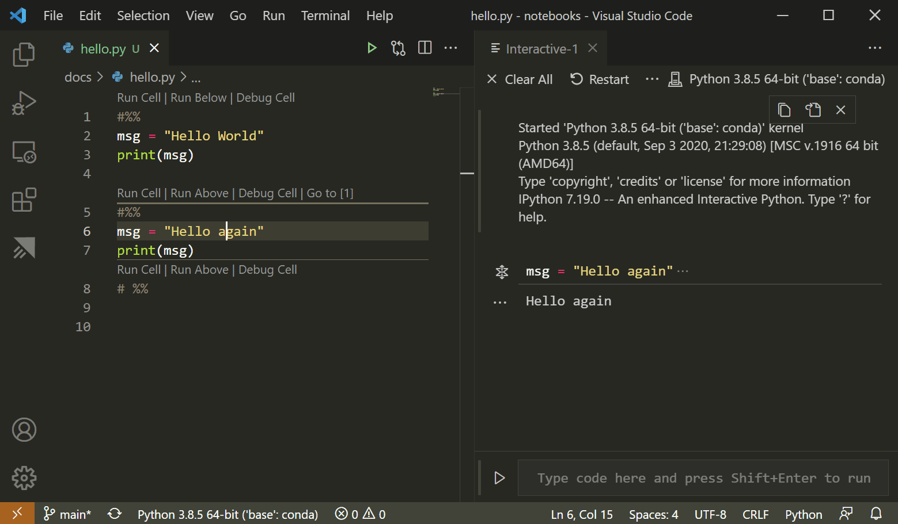

+++
title = "Python Interactive"
date = 2024-01-12T22:36:24+08:00
weight = 70
type = "docs"
description = ""
isCJKLanguage = true
draft = false
+++

> 原文: [https://code.visualstudio.com/docs/python/jupyter-support-py](https://code.visualstudio.com/docs/python/jupyter-support-py)

# Python Interactive window Python 交互式窗口


[Jupyter](https://jupyter-notebook.readthedocs.io/en/latest/) (formerly IPython Notebook) is an open-source project that lets you easily combine Markdown text and executable Python source code on one canvas called a **notebook**. Visual Studio Code supports working with [Jupyter Notebooks natively](https://code.visualstudio.com/docs/datascience/jupyter-notebooks), as well as through Python code files. This topic covers the support offered through Python code files and demonstrates how to:

&zeroWidthSpace;Jupyter（以前称为 IPython Notebook）是一个开源项目，可让您轻松地在一个名为笔记本的画布上组合 Markdown 文本和可执行 Python 源代码。Visual Studio Code 原生支持使用 Jupyter Notebooks，还支持通过 Python 代码文件使用。本主题介绍通过 Python 代码文件提供的支持，并演示如何执行以下操作：

- Work with Jupyter-like code cells
  使用类似 Jupyter 的代码单元
- Run code in the Python Interactive Window
  在 Python 交互式窗口中运行代码
- View, inspect, and filter variables using the Variables Explorer and Data Viewer
  使用变量资源管理器和数据查看器查看、检查和筛选变量
- Connect to a remote Jupyter server
  连接到远程 Jupyter 服务器
- Debug a Jupyter notebook
  调试 Jupyter 笔记本
- Export a Jupyter notebook
  导出 Jupyter 笔记本

To work with Jupyter notebooks, you must activate an Anaconda environment in VS Code, or another Python environment in which you've installed the [Jupyter package](https://pypi.org/project/jupyter/). To select an environment, use the **Python: Select Interpreter** command from the Command Palette (Ctrl+Shift+P).

&zeroWidthSpace;若要使用 Jupyter 笔记本，您必须在 VS Code 中激活 Anaconda 环境，或激活已安装 Jupyter 包的另一个 Python 环境。若要选择环境，请使用命令面板（Ctrl+Shift+P）中的 Python: 选择解释器命令。

Once the appropriate environment is activated, you can create and run Jupyter-like code cells, connect to a remote Jupyter server for running code cells, and export Python files as Jupyter notebooks.

&zeroWidthSpace;激活相应环境后，您可以创建和运行类似 Jupyter 的代码单元，连接到远程 Jupyter 服务器以运行代码单元，并将 Python 文件导出为 Jupyter 笔记本。

## [Jupyter code cells Jupyter 代码单元格](https://code.visualstudio.com/docs/python/jupyter-support-py#_jupyter-code-cells)

You define Jupyter-like code cells within Python code using a `# %%` comment:

&zeroWidthSpace;您使用 `# %%` 注释在 Python 代码中定义类似 Jupyter 的代码单元：

```
# %%
msg = "Hello World"
print(msg)

# %%
msg = "Hello again"
print(msg)
```

> **Note**: Make sure to save the code shown above in a file with a .py extension.
>
> &zeroWidthSpace;注意：确保将上面显示的代码保存在扩展名为 .py 的文件中。

When the Python extension detects a code cell, it adds **Run Cell** and **Debug Cell** CodeLens adornments. The first cell also includes **Run Below** and all subsequent cells include **Run Above**:

&zeroWidthSpace;当 Python 扩展检测到代码单元格时，它会添加“运行单元格”和“调试单元格”CodeLens 装饰。第一个单元格还包括“在下方运行”，所有后续单元格包括“在上方运行”：


> **Note:** By default, **Debug Cell** just steps into user code. If you want to step into non-user code, you need to uncheck **Debug Just My Code** in the Jupyter extension settings (Ctrl+,).
>
> &zeroWidthSpace;注意：默认情况下，“调试单元格”只会进入用户代码。如果您想进入非用户代码，您需要取消选中 Jupyter 扩展设置（Ctrl+,）中的“仅调试我的代码”。

**Run Cell** applies to only the one code cell. **Run Below**, which appears on the first cell, runs all the code in the file. **Run Above** applies to all the code cells up to, but not including, the cell with the adornment. You would use **Run Above**, for example, to initialize the state of the runtime environment before running that specific cell.

&zeroWidthSpace;“运行单元格”仅适用于一个代码单元格。“在下方运行”出现在第一个单元格上，运行文件中的所有代码。“在上方运行”适用于所有代码单元格，直到（但不包括）具有装饰的单元格。例如，您可以在运行特定单元格之前使用“在上方运行”来初始化运行时环境的状态。

Selecting a command starts Jupyter (if necessary, which might take a minute), then runs the appropriate cell(s) in the **Python Interactive** window:

&zeroWidthSpace;选择一个命令启动 Jupyter（如果需要，可能需要一分钟），然后在 Python 交互式窗口中运行相应的单元格：



You can also run code cells using (Ctrl+Enter) or the **Python: Run Selection/Line in Python Terminal** command (Shift+Enter). After using this command, the Python extension automatically moves the cursor to the next cell. If you're in the last cell in the file, the extension automatically inserts another `# %%` delimiter for a new cell, mimicking the behavior of a Jupyter notebook.

&zeroWidthSpace;您还可以使用 (Ctrl+Enter) 或 Python: 在 Python 终端中运行选定内容/行命令 (Shift+Enter) 来运行代码单元格。使用此命令后，Python 扩展会自动将光标移至下一个单元格。如果您位于文件中的最后一个单元格中，该扩展会自动插入另一个 `# %%` 分隔符以用于新单元格，模仿 Jupyter 笔记本的行为。

You can also click in the margin to the left of line numbers to set breakpoints. Then you can use **Debug Cell** to start a debugging session for that code cell. The debugger stops execution at breakpoints and allows you to step through code one line at a time and inspect variables (see [Debugging](https://code.visualstudio.com/docs/editor/debugging) for details).

&zeroWidthSpace;您还可以单击行号左侧的边距来设置断点。然后，您可以使用“调试单元格”来针对该代码单元格启动调试会话。调试器会在断点处停止执行，并允许您逐行逐步执行代码并检查变量（有关详细信息，请参阅调试）。

### [Additional commands and keyboard shortcuts 其他命令和键盘快捷键](https://code.visualstudio.com/docs/python/jupyter-support-py#_additional-commands-and-keyboard-shortcuts)

The following table lists additional commands and keyboard shortcuts supported when working with code cells.

&zeroWidthSpace;下表列出了在使用代码单元格时支持的其他命令和键盘快捷键。

| Command 命令                                                 | Keyboard shortcut 键盘快捷键 |
| :----------------------------------------------------------- | :--------------------------- |
| Python: Go to Next Cell Python: 转到下一个单元格             | Ctrl+Alt+]                   |
| Python: Go to Previous Cell Python: 转到上一个单元格         | Ctrl+Alt+[                   |
| Python: Extend Selection by Cell Above Python：通过上方单元格扩展选择 | Ctrl+Shift+Alt+[             |
| Python: Extend Selection by Cell Below Python：通过下方单元格扩展选择 | Ctrl+Shift+Alt+]             |
| Python: Move Selected Cells Up Python：向上移动所选单元格    | Ctrl+; U                     |
| Python: Move Selected Cells Down Python：向下移动所选单元格  | Ctrl+; D                     |
| Python: Insert Cell Above Python：在上方插入单元格           | Ctrl+; A                     |
| Python: Insert Cell Below Python：在下方插入单元格           | Ctrl+; B                     |
| Python: Insert Cell Below Position Python：在下方插入单元格位置 | Ctrl+; S                     |
| Python: Delete Selected Cells Python：删除选定的单元格       | Ctrl+; X                     |
| Python: Change Cell to Code Python：将单元格更改为代码       | Ctrl+; C                     |
| Python: Change Cell to Markdown Python：将单元格更改为 Markdown | Ctrl+; M                     |

## [Using the Python Interactive window 使用 Python 交互式窗口](https://code.visualstudio.com/docs/python/jupyter-support-py#_using-the-python-interactive-window)

The **Python Interactive** window, mentioned in the previous section, can be used as a standalone console with arbitrary code (with or without code cells). To use the window as a console, open it with the **Jupyter: Create Interactive Window** command from the Command Palette. You can then type in code, using Enter to go to a new line and Shift+Enter to run the code.

&zeroWidthSpace;前面部分提到的 Python 交互式窗口可以用作独立控制台，其中包含任意代码（带或不带代码单元格）。要将窗口用作控制台，请使用命令面板中的 Jupyter：创建交互式窗口命令将其打开。然后，您可以键入代码，使用 Enter 换行，使用 Shift+Enter 运行代码。

To use the window with a file, use the **Jupyter: Run Current File in Python Interactive Window** command from the Command Palette.

&zeroWidthSpace;要将窗口与文件一起使用，请使用命令面板中的 Jupyter：在 Python 交互式窗口中运行当前文件命令。

### [IntelliSense](https://code.visualstudio.com/docs/python/jupyter-support-py#_intellisense)

The Python Interactive window has full IntelliSense – code completions, member lists, quick info for methods, and parameter hints. You can be just as productive typing in the Python Interactive window as you are in the code editor.

&zeroWidthSpace;Python 交互式窗口具有完整的 IntelliSense - 代码补全、成员列表、方法快速信息和参数提示。您在 Python 交互式窗口中键入内容时，就像在代码编辑器中一样高效。


### [Plot Viewer 绘图查看器](https://code.visualstudio.com/docs/python/jupyter-support-py#_plot-viewer)

The Plot Viewer gives you the ability to work more deeply with your plots. In the viewer you can pan, zoom, and navigate plots in the current session. You can also export plots to PDF, SVG, and PNG formats.

&zeroWidthSpace;绘图查看器使您能够更深入地处理绘图。在查看器中，您可以在当前会话中平移、缩放和导航绘图。您还可以将绘图导出为 PDF、SVG 和 PNG 格式。

Within the Python Interactive window, double-click any plot to open it in the viewer, or select the expand button on the upper left corner of the plot.

&zeroWidthSpace;在 Python 交互式窗口中，双击任意绘图以在查看器中将其打开，或选择绘图左上角的展开按钮。


> **Note:** The Python Interactive window supports rendering plots created with [matplotlib](https://matplotlib.org/) and [Altair](https://altair-viz.github.io/index.html).
>
> &zeroWidthSpace;注意：Python 交互式窗口支持使用 matplotlib 和 Altair 创建的渲染图。

## [Variables Explorer and Data Viewer 变量资源管理器和数据查看器](https://code.visualstudio.com/docs/python/jupyter-support-py#_variables-explorer-and-data-viewer)

Within the Python Interactive window, it's possible to view, inspect, and filter the variables within your current Jupyter session. Select the **Variables** button in the interactive window toolbar to open the Variables explorer after running code and cells, you'll see a list of the current variables, which will automatically update as variables are used in code.

&zeroWidthSpace;在 Python 交互式窗口中，可以查看、检查和筛选当前 Jupyter 会话中的变量。在交互式窗口工具栏中选择“变量”按钮以打开变量资源管理器，在运行代码和单元格后，您将看到当前变量的列表，该列表会随着代码中使用变量而自动更新。


For additional information about your variables, you can also double-click on a row or use the **Show variable in data viewer** button to see a more detailed view of a variable in the Data Viewer. Once open, you can filter the values by searching over the rows.

&zeroWidthSpace;有关变量的其他信息，您还可以双击某行或使用“在数据查看器中显示变量”按钮，以在数据查看器中查看变量的更详细视图。打开后，您可以通过搜索行来筛选值。


## [Connect to a remote Jupyter server 连接到远程 Jupyter 服务器](https://code.visualstudio.com/docs/python/jupyter-support-py#_connect-to-a-remote-jupyter-server)

You can offload intensive computation in a Jupyter notebook to other computers by connecting to a remote Jupyter server. Once connected, code cells run on the remote server rather than the local computer.

&zeroWidthSpace;您可以通过连接到远程 Jupyter 服务器，将 Jupyter 笔记本中的密集计算卸载到其他计算机。连接后，代码单元格将在远程服务器上运行，而不是在本地计算机上运行。

To connect to a remote Jupyter server:

&zeroWidthSpace;要连接到远程 Jupyter 服务器：

1. Run the **Jupyter: Specify local or remote Jupyter server for connections** command from the Command Palette (Ctrl+Shift+P).

   &zeroWidthSpace;从命令面板 (Ctrl+Shift+P) 运行 Jupyter：指定用于连接的本地或远程 Jupyter 服务器命令。

2. Select how you would like to connect to a Jupyter server.

   &zeroWidthSpace;选择您希望连接到 Jupyter 服务器的方式。

3. If working remotely, provide the server's URI (hostname) with the authentication token included with a `?token=` URL parameter when prompted. (If you start the server in the VS Code terminal with an authentication token enabled, the URL with the token typically appears in the terminal output from where you can copy it.) Alternatively, you can specify a username and password after providing the URI.

   &zeroWidthSpace;如果远程工作，请在提示时提供包含身份验证令牌的服务器 URI（主机名），并将其作为 `?token=` URL 参数。 （如果您在启用了身份验证令牌的情况下在 VS Code 终端中启动服务器，则通常会将包含令牌的 URL 显示在终端输出中，您可以从中复制它。）或者，您可以在提供 URI 后指定用户名和密码。

   

4. The Python Interactive window indicates where code is run by displaying the URI (which is blurred out in the image below):

   &zeroWidthSpace;Python 交互式窗口通过显示 URI（在下图中模糊显示）来指示代码的运行位置：

   

> **Note:** For added security, Microsoft recommends configuring your Jupyter server with security precautions such as SSL and token support. This helps ensure that requests sent to the Jupyter server are authenticated and connections to the remote server are encrypted. For guidance about securing a notebook server, see the [Jupyter docs](https://jupyter-notebook.readthedocs.io/en/stable/public_server.html#securing-a-notebook-server).
>
> &zeroWidthSpace;注意：为了增加安全性，Microsoft 建议您使用 SSL 和令牌支持等安全预防措施来配置 Jupyter 服务器。这有助于确保发送到 Jupyter 服务器的请求经过身份验证，并且与远程服务器的连接已加密。有关保护笔记本服务器安全的指南，请参阅 Jupyter 文档。

## [Convert Jupyter notebooks to Python code file 将 Jupyter 笔记本转换为 Python 代码文件](https://code.visualstudio.com/docs/python/jupyter-support-py#_convert-jupyter-notebooks-to-python-code-file)

When you've activated an environment with Jupyter installed, you can open a Jupyter notebook file (`.ipynb`) in VS Code and then convert it to Python code. Once you've converted the file, you can run the code as you would with any other Python file and also use the VS Code debugger. Opening and debugging notebooks in VS Code is a convenient way to find and resolve code bugs, which is difficult to do directly in a Jupyter notebook.

&zeroWidthSpace;当您激活已安装 Jupyter 的环境时，您可以在 VS Code 中打开 Jupyter 笔记本文件 ( `.ipynb` )，然后将其转换为 Python 代码。转换文件后，您可以像使用任何其他 Python 文件一样运行代码，还可以使用 VS Code 调试器。在 VS Code 中打开和调试笔记本是查找和解决代码错误的便捷方式，而直接在 Jupyter 笔记本中很难做到这一点。

When you open a notebook file, Visual Studio Code will open it in the Notebook Editor automatically. Use the convert icon on the toolbar to convert the Notebook (.ipynb) file to a Python file (.py).

&zeroWidthSpace;当您打开笔记本文件时，Visual Studio Code 会自动在笔记本编辑器中将其打开。使用工具栏上的转换图标将笔记本 (.ipynb) 文件转换为 Python 文件 (.py)。


Select the convert icon followed by "Python Script", wait a few seconds, and then VS Code opens the converted notebook in an untitled file. The notebook's cells are delimited in the Python file with `# %%` comments; Markdown cells are converted wholly to comments preceded with `# %% [markdown]`, and render as HTML in the interactive window alongside code and output such as graphs:

&zeroWidthSpace;选择转换图标，然后选择“Python 脚本”，等待几秒钟，然后 VS Code 在一个无标题文件中打开转换后的笔记本。笔记本的单元格在 Python 文件中用 `# %%` 注释分隔；Markdown 单元格完全转换为以 `# %% [markdown]` 开头的注释，并在交互式窗口中作为 HTML 呈现，连同代码和输出（如图形）：


> **Note:** The first time you run code cells in a Python file, the Python extension starts a Jupyter server. It may take some time for the server to start up and for the **Python Interactive** window to appear with the results of the code.
>
> &zeroWidthSpace;注意：首次在 Python 文件中运行代码单元格时，Python 扩展程序会启动 Jupyter 服务器。服务器可能需要一些时间才能启动，并且 Python 交互式窗口才能显示代码的结果。

## [Debug a Jupyter notebook 调试 Jupyter 笔记本](https://code.visualstudio.com/docs/python/jupyter-support-py#_debug-a-jupyter-notebook)

The Visual Studio Code debugger lets you step through your code, set breakpoints, examine state, and analyze problems. Using the debugger is a helpful way to find and correct issues in notebook code.

&zeroWidthSpace;Visual Studio Code 调试器允许您逐步执行代码、设置断点、检查状态和分析问题。使用调试器是查找和更正笔记本代码中问题的一种有用方法。

1. In VS Code, activate a Python environment in which Jupyter is installed, as described at the beginning of this article.

   &zeroWidthSpace;在 VS Code 中，激活已安装 Jupyter 的 Python 环境，如本文开头所述。

2. Import the notebook's `.ipynb` file into VS Code as described in the previous section. (Download the file first if you're using a cloud-based Jupyter environment such as [Azure Notebooks](https://learn.microsoft.com/azure/notebooks).)

   &zeroWidthSpace;按照上一节中的说明，将笔记本的 `.ipynb` 文件导入 VS Code。（如果您使用的是基于云的 Jupyter 环境（如 Azure 笔记本），请先下载该文件。）

3. To start the debugger, use one of the following options:

   &zeroWidthSpace;要启动调试器，请使用以下选项之一：

   - For the whole notebook, open the Command Palette (Ctrl+Shift+P) and run the **Jupyter: Debug Current File in Python Interactive Window** command.
     对于整个笔记本，请打开命令面板 (Ctrl+Shift+P) 并运行 Jupyter: 在 Python 交互式窗口中调试当前文件命令。
   - For an individual cell, use the **Debug Cell** adornment that appears above the cell. The debugger specifically starts on the code in that cell. By default, **Debug Cell** just steps into user code. If you want to step into non-user code, you need to uncheck **Debug Just My Code** in the Jupyter extension settings (Ctrl+,).
     对于单个单元格，请使用显示在单元格上方的“调试单元格”修饰。调试器专门从该单元格中的代码开始。默认情况下，“调试单元格”仅逐步进入用户代码。如果您想逐步进入非用户代码，则需要取消选中 Jupyter 扩展设置（Ctrl+,）中的“仅调试我的代码”。

4. To familiarize yourself with the general debugging features of VS Code, such as inspecting variables, setting breakpoints, and other activities, review [VS Code debugging](https://code.visualstudio.com/docs/editor/debugging).

   &zeroWidthSpace;要熟悉 VS Code 的常规调试功能，例如检查变量、设置断点和其他活动，请查看 VS Code 调试。

5. As you find issues, stop the debugger, correct your code, save the file, and start the debugger again.

   &zeroWidthSpace;在您发现问题时，停止调试器，更正您的代码，保存文件，然后再次启动调试器。

6. When you're satisfied that all your code is correct. Save the file, then export the notebook as described in the following section. You can then upload the notebook to your normal Jupyter environment.

   &zeroWidthSpace;当您对所有代码都满意时，保存文件，然后按以下部分所述导出笔记本。然后，您可以将笔记本上传到您的正常 Jupyter 环境。

## [Export a Jupyter notebook 导出 Jupyter 笔记本](https://code.visualstudio.com/docs/python/jupyter-support-py#_export-a-jupyter-notebook)

In addition to opening a Jupyter notebook, you can also use one of the following commands from the Command Palette (Ctrl+Shift+P) to export content from a Python file in VS Code to a Jupyter notebook (with the `.ipynb` extension).

&zeroWidthSpace;除了打开 Jupyter 笔记本外，您还可以使用命令面板（Ctrl+Shift+P）中的以下命令之一将内容从 VS Code 中的 Python 文件导出到 Jupyter 笔记本（使用 `.ipynb` 扩展）。

- **Jupyter: Export Current Python File as Jupyter Notebook**: creates a Jupyter notebook from the contents of the current file, using the `# %%` and `# %% [markdown]` delimiters to specify their respective cell types.
  Jupyter：将当前 Python 文件导出为 Jupyter 笔记本：使用 `# %%` 和 `# %% [markdown]` 分隔符指定各自的单元格类型，根据当前文件的内容创建一个 Jupyter 笔记本。
- **Jupyter: Export Current Python File and Output as Jupyter Notebook**: creates a Jupyter notebook from the contents of the current file and includes output from code cells.
  Jupyter：将当前 Python 文件和输出导出为 Jupyter 笔记本：根据当前文件的内容创建一个 Jupyter 笔记本，并包含来自代码单元格的输出。
- **Jupyter: Export Interactive Window as Jupyter Notebook**: creates a Jupyter notebook from the contents of the Python Interactive window.
  Jupyter：将交互式窗口导出为 Jupyter 笔记本：根据 Python 交互式窗口的内容创建一个 Jupyter 笔记本。

After exporting the contents, VS Code displays a prompt through which you can open the notebook in a browser.

&zeroWidthSpace;导出内容后，VS Code 会显示一个提示，你可以在其中通过浏览器打开笔记本。
