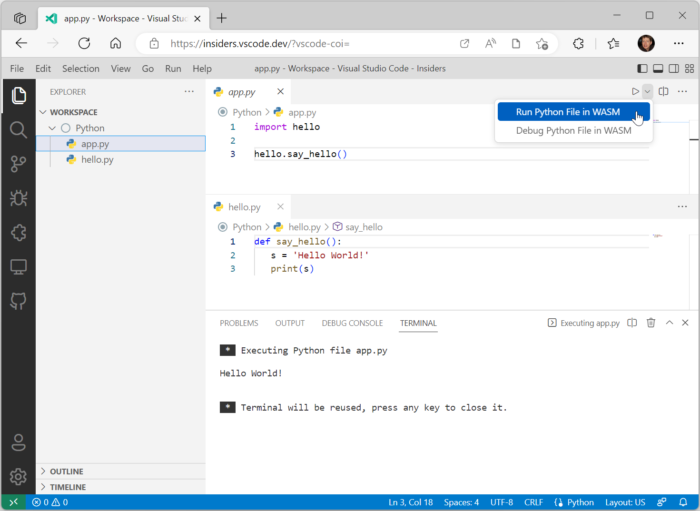
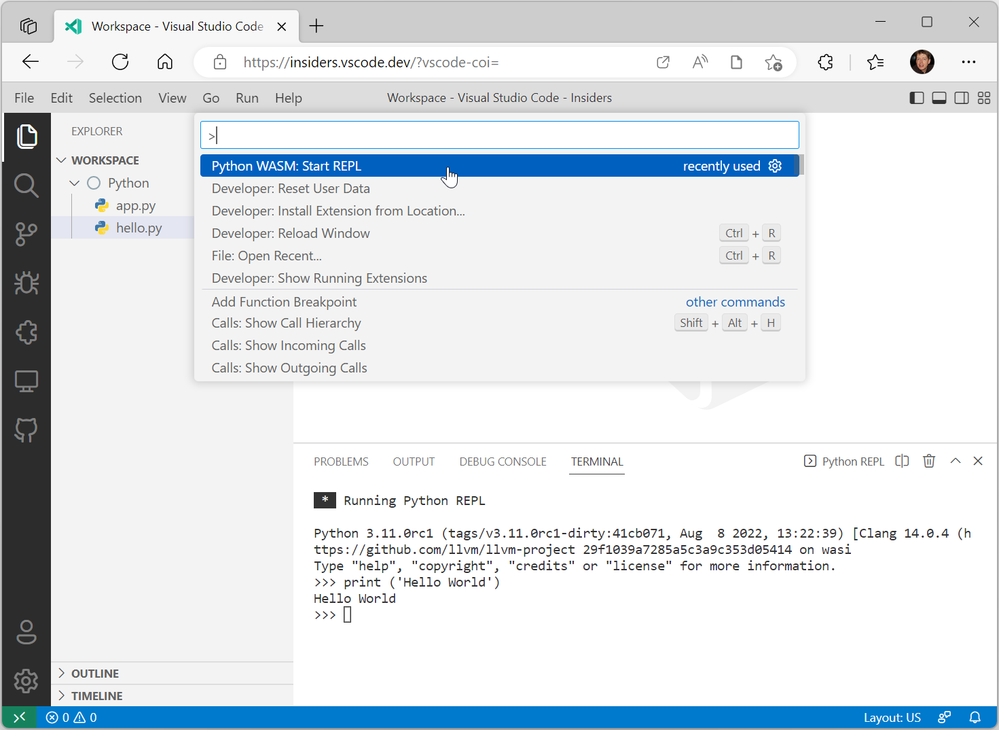
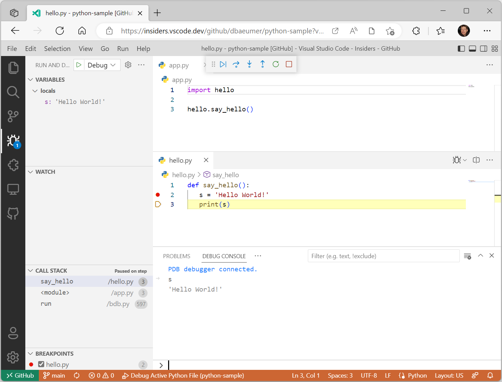

+++
title = "Python in the Web"
date = 2024-01-12T22:36:24+08:00
weight = 130
type = "docs"
description = ""
isCJKLanguage = true
draft = false
+++

> 原文: [https://code.visualstudio.com/docs/python/python-web](https://code.visualstudio.com/docs/python/python-web)

# Run and Debug Python in the Web 在 Web 中运行和调试 Python


We are happy to announce **experimental** support for running Python code on the Web. To try it out, install the latest pre-release version of the [Experimental - Python for the Web](https://marketplace.visualstudio.com/items?itemName=ms-vscode.vscode-python-web-wasm) extension from the Marketplace. This work is based on WASM in Python, which is currently in development. To learn more about how it works and the ongoing progress, you can read [Compiling Python to WebAssembly (WASM)](https://pythondev.readthedocs.io/wasm.html).

​​​	我们很高兴地宣布对在 Web 上运行 Python 代码的实验性支持。要试用它，请从 Marketplace 安装最新预发布版本的实验性 - Python for the Web 扩展。这项工作基于 Python 中的 WASM，目前正在开发中。要详细了解其工作原理和正在进行的进度，您可以阅读将 Python 编译到 WebAssembly (WASM)。

## [Prerequisites 先决条件](https://code.visualstudio.com/docs/python/python-web#_prerequisites)

The following prerequisites are needed to use the extension:

​​​	使用该扩展需要以下先决条件：

- You need to have the [GitHub Repositories](https://marketplace.visualstudio.com/items?itemName=GitHub.remotehub) extension installed.
  您需要安装 GitHub 存储库扩展。
- You need to authenticate with GitHub.
  您需要使用 GitHub 进行身份验证。
- You need to use a browser that supports [cross-origin isolation](https://developer.chrome.com/docs/extensions/mv3/cross-origin-isolation/). The extension has been tested with the Microsoft Edge and Google Chrome browsers.
  您需要使用支持跨源隔离的浏览器。该扩展已通过 Microsoft Edge 和 Google Chrome 浏览器进行测试。
- You need to use the insider version of [VS Code for the Web](https://code.visualstudio.com/docs/editor/vscode-web) (for example `https://insiders.vscode.dev/`)
  您需要使用 VS Code for the Web 的内部版本（例如 `https://insiders.vscode.dev/` ）
- Your source code must be hosted either on your local file system or a GitHub repository that is accessed through the [GitHub Repositories](https://marketplace.visualstudio.com/items?itemName=GitHub.remotehub) extension.
  您的源代码必须托管在本地文件系统或通过 GitHub 存储库扩展访问的 GitHub 存储库中。
- When starting [VS Code for the Web](https://code.visualstudio.com/docs/editor/vscode-web), you need to add the following query parameter to the end of the URL: `?vscode-coi=`.
  启动 VS Code for the Web 时，您需要将以下查询参数添加到 URL 末尾： `?vscode-coi=` 。

## [Run Hello World 运行 Hello World](https://code.visualstudio.com/docs/python/python-web#_run-hello-world)

The screenshot below shows the execution of a simple Python program in the browser. The program consists of two files `app.py` and `hello.py` stored on the local file system.

​​​	下图显示了在浏览器中执行一个简单的 Python 程序。该程序由存储在本地文件系统上的两个文件 `app.py` 和 `hello.py` 组成。



## [Start a REPL 启动 REPL](https://code.visualstudio.com/docs/python/python-web#_start-a-repl)

The extension comes with an integrated Python REPL. To activate it, run the command **Python WASM: Start REPL**.

​​​	该扩展附带一个集成的 Python REPL。要激活它，请运行命令 Python WASM：启动 REPL。



## [Debugging 调试](https://code.visualstudio.com/docs/python/python-web#_debugging)

There is support for debugging Python files on the Web and it uses the same UI as VS Code Desktop [debugging](https://code.visualstudio.com/docs/python/debugging). The features currently supported are:

​​​	支持在 Web 上调试 Python 文件，并且它使用与 VS Code 桌面调试相同的 UI。当前支持的功能有：

- Set breakpoints
  设置断点
- Step into and out of functions
  进入和退出函数
- Debug across modules
  跨模块调试
- Evaluate variables in the Debug Console
  在调试控制台中计算变量
- Debug the program in the Integrated Terminal
  在集成终端中调试程序

The screenshot below shows an active debug session. The files are hosted directly on GitHub on this [sample repository](https://github.com/dbaeumer/python-sample).

​​​	下图显示了一个活动的调试会话。这些文件直接托管在 GitHub 上的此示例存储库中。



## [Create your own Python environment 创建您自己的 Python 环境](https://code.visualstudio.com/docs/python/python-web#_create-your-own-python-environment)

The extension uses a pre-configured Python environment based on the [CPython WebAssembly builds](https://github.com/tiran/cpython-wasm-test/releases). The build used is `Python-3.11.0-wasm32-wasi-16.zip`.

​​​	该扩展使用基于 CPython WebAssembly 构建的预配置 Python 环境。使用的构建是 `Python-3.11.0-wasm32-wasi-16.zip` 。

You can create your own Python environment, including source wheel Python packages, following these steps:

​​​	您可以按照以下步骤创建自己的 Python 环境，包括源轮 Python 包：

- Create a new GitHub repository.

  ​​​	创建一个新的 GitHub 存储库。

- Download a wasm-wasi-16 build from [cpython-wasm-test/releases](https://github.com/tiran/cpython-wasm-test/releases) and expand it into the root of the repository.

  ​​​	从 cpython-wasm-test/releases 下载 wasm-wasi-16 构建，并将其展开到存储库的根目录中。

- To add source wheel packages, do the following:

  ​​​	要添加源轮包，请执行以下操作：

  - Create a `site-packages` folder in the root.
    在根目录中创建一个 `site-packages` 文件夹。
  - Install the package using the following command `pip install my_package --target ./site-packages`. Note that you need to have a Python installation in your OS including pip.
    使用以下命令安装包 `pip install my_package --target ./site-packages` 。请注意，您需要在操作系统中安装 Python，包括 pip。

- Commit the changes.

  ​​​	提交更改。

- Change the `python.wasm.runtime` setting to point to your GitHub repository. For example:

  ​​​	将 `python.wasm.runtime` 设置更改为指向您的 GitHub 存储库。例如：

  ```
  {
    "python.wasm.runtime": "https://github.com/dbaeumer/python-3.11.0"
  }
  ```

## [Limitations 局限性](https://code.visualstudio.com/docs/python/python-web#_limitations)

The Python for the Web support doesn't provide all the features available when running source code on your local machine. The major limitations in the Python interpreter are:

​​​	Python for the Web 支持不提供在本地计算机上运行源代码时可用的所有功能。Python 解释器中的主要限制是：

- No socket support.
  不支持套接字。
- No thread support. As a consequence, there is no async support.
  不支持线程。因此，不支持异步。
- No pip support.
  不支持 pip。
- No support for native Python modules.
  不支持原生 Python 模块。

## [Acknowledgment 致谢](https://code.visualstudio.com/docs/python/python-web#_acknowledgment)

The work would have not been possible without the support of the Python community, who are building and maintaining the necessary WASM files of CPython.

​​​	如果没有 Python 社区构建和维护 CPython 的必要 WASM 文件，这项工作是不可能完成的。

## [Feedback 反馈](https://code.visualstudio.com/docs/python/python-web#_feedback)

If you run into issues while using the Python for the Web extension, you can enter issues in the [vscode-python-web-wasm](https://github.com/microsoft/vscode-python-web-wasm) repository.

​​​	如果您在使用 Python for the Web 扩展时遇到问题，可以在 vscode-python-web-wasm 存储库中输入问题。
