+++
title = "Tutorial"
date = 2024-01-12T22:36:24+08:00
weight = 1
type = "docs"
description = ""
isCJKLanguage = true
draft = false
+++

> 原文: [https://code.visualstudio.com/docs/python/python-tutorial](https://code.visualstudio.com/docs/python/python-tutorial)

# Getting Started with Python in VS Code 在 VS Code 中开始使用 Python


In this tutorial, you will learn how to use Python 3 in Visual Studio Code to create, run, and debug a Python "Roll a dice" application, work with virtual environments, use packages, and more! By using the [Python extension](https://marketplace.visualstudio.com/items?itemName=ms-python.python), you turn VS Code into a great, lightweight Python editor.

​​​	在本教程中，您将学习如何在 Visual Studio Code 中使用 Python 3 创建、运行和调试 Python“掷骰子”应用程序，使用虚拟环境、使用包等！通过使用 Python 扩展，您可以将 VS Code 变成一个出色、轻量级的 Python 编辑器。

If you are new to programming, check out the [Visual Studio Code for Education - Introduction to Python](https://vscodeedu.com/courses/intro-to-python) course. This course offers a comprehensive introduction to Python, featuring structured modules in a ready-to-code browser-based development environment.

​​​	如果您是编程新手，请查看 Visual Studio Code for Education - Python 简介课程。本课程提供对 Python 的全面介绍，在可立即编码的基于浏览器的开发环境中提供结构化的模块。

To gain a deeper understanding of the Python language, you can explore any of the [programming tutorials](https://wiki.python.org/moin/BeginnersGuide/Programmers) listed on python.org within the context of VS Code.

​​​	为了更深入地了解 Python 语言，您可以在 VS Code 的上下文中浏览 python.org 上列出的任何编程教程。

For a Data Science focused tutorial with Python, check out our [Data Science section]().

​​​	有关以 Python 为重点的数据科学教程，请查看我们的数据科学部分。

## [Prerequisites 先决条件]()

To successfully complete this tutorial, you need to first setup your Python development environment. Specifically, this tutorial requires:

​​​	要成功完成本教程，您需要首先设置 Python 开发环境。具体来说，本教程需要：

- [Python 3]()
- [VS Code](https://code.visualstudio.com/)
- [VS Code Python extension](https://marketplace.visualstudio.com/items?itemName=ms-python.python) (For additional details on installing extensions, see [Extension Marketplace]())
  VS Code Python 扩展（有关安装扩展的其他详细信息，请参阅扩展市场）

## [Install a Python interpreter 安装 Python 解释器]()

Along with the Python extension, you need to install a Python interpreter. Which interpreter you use is dependent on your specific needs, but some guidance is provided below.

​​​	除了 Python 扩展外，您还需要安装 Python 解释器。您使用哪个解释器取决于您的具体需求，但下面提供了一些指导。

### [Windows]()

Install [Python from python.org](https://www.python.org/downloads/). Use the **Download Python** button that appears first on the page to download the latest version.

​​​	从 python.org 安装 Python。使用页面上首先出现的“下载 Python”按钮下载最新版本。

> **Note**: If you don't have admin access, an additional option for installing Python on Windows is to use the Microsoft Store. The Microsoft Store provides installs of [supported Python versions](https://apps.microsoft.com/store/search?publisher=Python Software Foundation).
>
> ​​​	注意：如果您没有管理员访问权限，在 Windows 上安装 Python 的另一种选择是使用 Microsoft Store。Microsoft Store 提供受支持的 Python 版本的安装。

For additional information about using Python on Windows, see [Using Python on Windows at Python.org](https://docs.python.org/3.9/using/windows.html)

​​​	有关在 Windows 上使用 Python 的更多信息，请参阅 Python.org 上的“在 Windows 上使用 Python”

### [macOS]()

The system install of Python on macOS is not supported. Instead, a package management system like [Homebrew](https://brew.sh/) is recommended. To install Python using Homebrew on macOS use `brew install python3` at the Terminal prompt.

​​​	macOS 上的 Python 系统安装不受支持。相反，建议使用像 Homebrew 这样的包管理系统。要在 macOS 上使用 Homebrew 安装 Python，请在终端提示符下使用 `brew install python3` 。

> **Note**: On macOS, make sure the location of your VS Code installation is included in your PATH environment variable. See [these setup instructions]() for more information.
>
> ​​​	注意：在 macOS 上，请确保您的 VS Code 安装位置包含在您的 PATH 环境变量中。有关更多信息，请参阅这些设置说明。

### [Linux]()

The built-in Python 3 installation on Linux works well, but to install other Python packages you must install `pip` with [get-pip.py](https://pip.pypa.io/en/stable/installation/#get-pip-py).

​​​	Linux 上内置的 Python 3 安装效果很好，但要安装其他 Python 包，您必须使用 get-pip.py 安装 `pip` 。

### [Other options 其他选项]()

- **Data Science**: If your primary purpose for using Python is Data Science, then you might consider a download from [Anaconda](https://www.anaconda.com/download/). Anaconda provides not just a Python interpreter, but many useful libraries and tools for data science.

  ​​​	数据科学：如果使用 Python 的主要目的是数据科学，那么您可以考虑从 Anaconda 下载。Anaconda 不仅提供 Python 解释器，还提供许多有用的数据科学库和工具。

- **Windows Subsystem for Linux**: If you are working on Windows and want a Linux environment for working with Python, the [Windows Subsystem for Linux](https://learn.microsoft.com/windows/wsl/about) (WSL) is an option for you. If you choose this option, you'll also want to install the [WSL extension](https://marketplace.visualstudio.com/items?itemName=ms-vscode-remote.remote-wsl). For more information about using WSL with VS Code, see [VS Code Remote Development]() or try the [Working in WSL tutorial](), which will walk you through setting up WSL, installing Python, and creating a Hello World application running in WSL.

  ​​​	适用于 Linux 的 Windows 子系统：如果您在 Windows 上工作，并且想要一个用于处理 Python 的 Linux 环境，那么适用于 Linux 的 Windows 子系统 (WSL) 是您的选择。如果您选择此选项，您还将需要安装 WSL 扩展。有关将 WSL 与 VS Code 配合使用的详细信息，请参阅 VS Code 远程开发或尝试在 WSL 中工作教程，该教程将指导您完成设置 WSL、安装 Python 和创建在 WSL 中运行的 Hello World 应用程序。

> **Note**: To verify that you've installed Python successfully on your machine, run one of the following commands (depending on your operating system):
>
> ​​​	注意：若要验证是否已成功在计算机上安装 Python，请运行以下命令之一（具体取决于您的操作系统）：
>
> Linux/macOS: open a Terminal Window and type the following command:
>
> ​​​	Linux/macOS：打开终端窗口并键入以下命令：
>
> ```
> python3 --version
> ```
>
> Windows: open a command prompt and run the following command:
>
> ​​​	Windows：打开命令提示符并运行以下命令：
>
> ```
> py -3 --version
> ```
>
> If the installation was successful, the output window should show the version of Python that you installed. Alternatively, you can use the `py -0` command in the VS Code integrated terminal to view the versions of python installed on your machine. The default interpreter is identified by an asterisk (*).
>
> ​​​	如果安装成功，输出窗口应显示您安装的 Python 版本。或者，您可以在 VS Code 集成终端中使用 `py -0` 命令来查看计算机上安装的 Python 版本。默认解释器由星号 (*) 标识。

## [Start VS Code in a workspace folder 在工作区文件夹中启动 VS Code]()

By starting VS Code in a folder, that folder becomes your "workspace".

​​​	通过在文件夹中启动 VS Code，该文件夹将成为您的“工作区”。

Using a command prompt or terminal, create an empty folder called "hello", navigate into it, and open VS Code (`code`) in that folder (`.`) by entering the following commands:

​​​	使用命令提示符或终端，创建一个名为“hello”的空文件夹，导航到其中，然后通过输入以下命令在该文件夹中打开 VS Code ( `code` ) ( `.` )：

```
mkdir hello
cd hello
code .
```

> **Note**: If you're using an Anaconda distribution, be sure to use an Anaconda command prompt.
>
> ​​​	注意：如果您使用的是 Anaconda 发行版，请务必使用 Anaconda 命令提示符。

Alternately, you can create a folder through the operating system UI, then use VS Code's **File > Open Folder** to open the project folder.

​​​	或者，您可以通过操作系统 UI 创建一个文件夹，然后使用 VS Code 的文件 > 打开文件夹来打开项目文件夹。

## [Create a virtual environment 创建虚拟环境]()

A best practice among Python developers is to use a project-specific `virtual environment`. Once you activate that environment, any packages you then install are isolated from other environments, including the global interpreter environment, reducing many complications that can arise from conflicting package versions. You can create non-global environments in VS Code using Venv or Anaconda with **Python: Create Environment**.

​​​	Python 开发人员的最佳做法是使用特定于项目的 `virtual environment` 。一旦激活该环境，您随后安装的任何软件包都会与其他环境（包括全局解释器环境）隔离，从而减少了因软件包版本冲突而可能产生的许多复杂情况。您可以使用 Venv 或 Anaconda with Python 在 VS Code 中创建非全局环境：创建环境。

Open the Command Palette (Ctrl+Shift+P), start typing the **Python: Create Environment** command to search, and then select the command.

​​​	打开命令面板 (Ctrl+Shift+P)，开始键入 Python: Create Environment 命令进行搜索，然后选择该命令。

The command presents a list of environment types, Venv or Conda. For this example, select **Venv**.

​​​	该命令会显示一个环境类型列表，Venv 或 Conda。对于此示例，请选择 Venv。


The command then presents a list of interpreters that can be used for your project. Select the interpreter you installed at the beginning of the tutorial.

​​​	然后，该命令会显示一个可用于您的项目的解释器列表。选择您在本教程开始时安装的解释器。

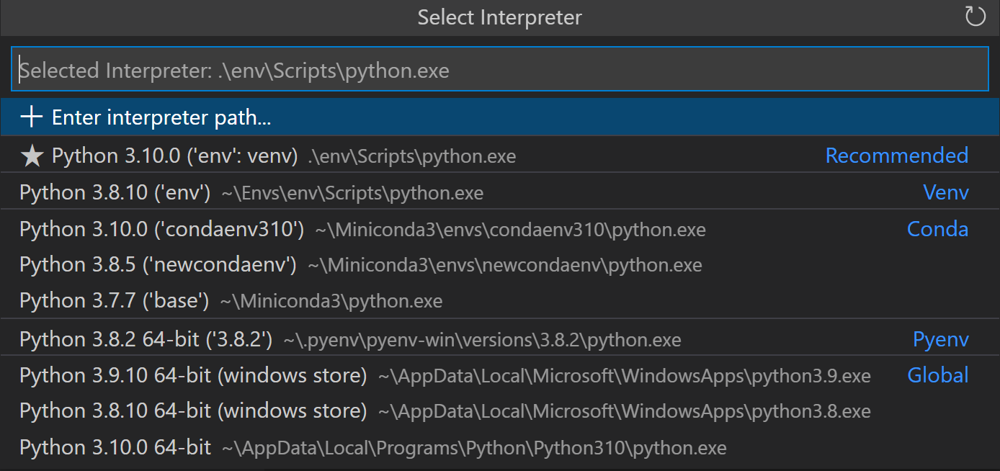

After selecting the interpreter, a notification will show the progress of the environment creation and the environment folder (`/.venv`) will appear in your workspace.

​​​	选择解释器后，一条通知将显示环境创建进度，环境文件夹 ( `/.venv` ) 将显示在您的工作区中。

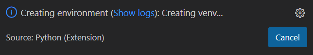

Ensure your new environment is selected by using the **Python: Select Interpreter** command from the **Command Palette**.

​​​	通过使用命令面板中的 Python: Select Interpreter 命令确保已选择您的新环境。

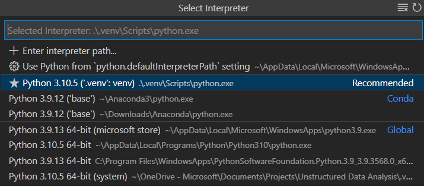

> **Note**: For additional information about virtual environments, or if you run into an error in the environment creation process, see [Environments]().
>
> ​​​	注意：有关虚拟环境的更多信息，或者如果您在环境创建过程中遇到错误，请参阅环境。

## [Create a Python source code file 创建 Python 源代码文件]()

From the File Explorer toolbar, select the **New File** button on the `hello` folder:

​​​	从文件资源管理器工具栏中，选择 `hello` 文件夹上的新建文件按钮：

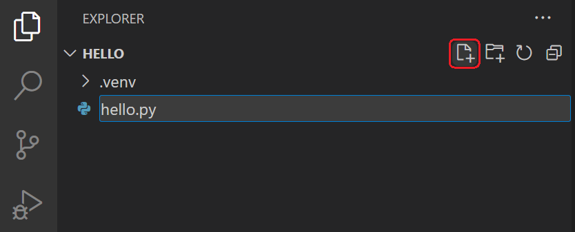

Name the file `hello.py`, and VS Code will automatically open it in the editor:

​​​	将文件命名为 `hello.py` ，VS Code 将自动在编辑器中将其打开：

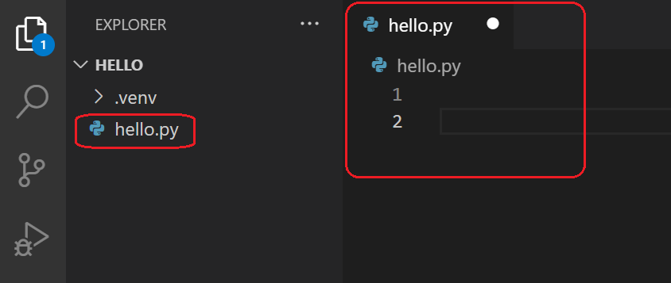

By using the `.py` file extension, you tell VS Code to interpret this file as a Python program, so that it evaluates the contents with the Python extension and the selected interpreter.

​​​	通过使用 `.py` 文件扩展名，您可以告诉 VS Code 将此文件解释为 Python 程序，以便它使用 Python 扩展和选定的解释器来评估内容。

> **Note**: The File Explorer toolbar also allows you to create folders within your workspace to better organize your code. You can use the **New folder** button to quickly create a folder.
>
> ​​​	注意：文件资源管理器工具栏还允许您在工作区内创建文件夹，以便更好地组织代码。您可以使用新建文件夹按钮快速创建一个文件夹。

Now that you have a code file in your Workspace, enter the following source code in `hello.py`:

​​​	现在您在工作区中有一个代码文件，在 `hello.py` 中输入以下源代码：

```
msg = "Roll a dice"
print(msg)
```

When you start typing `print`, notice how [IntelliSense]() presents auto-completion options.

​​​	当您开始键入 `print` 时，请注意 IntelliSense 如何显示自动完成选项。

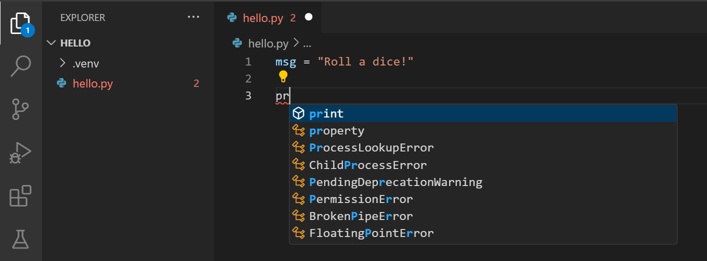

IntelliSense and auto-completions work for standard Python modules as well as other packages you've installed into the environment of the selected Python interpreter. It also provides completions for methods available on object types. For example, because the `msg` variable contains a string, IntelliSense provides string methods when you type `msg.`:

​​​	IntelliSense 和自动完成功能适用于标准 Python 模块以及您已安装到所选 Python 解释器环境中的其他软件包。它还提供对对象类型上可用方法的完成。例如，由于 `msg` 变量包含一个字符串，因此当您键入 `msg.` 时，IntelliSense 会提供字符串方法：

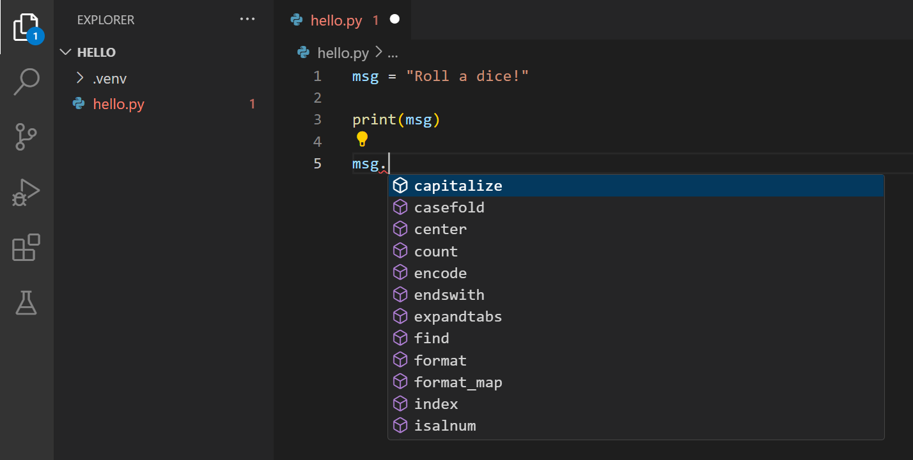

Finally, save the file (Ctrl+S). At this point, you're ready to run your first Python file in VS Code.

​​​	最后，保存文件 (Ctrl+S)。此时，您已准备好运行 VS Code 中的第一个 Python 文件。

For full details on editing, formatting, and refactoring, see [Editing code](). The Python extension also has full support for [Linting]().

​​​	有关编辑、格式化和重构的完整详细信息，请参阅编辑代码。Python 扩展还完全支持 Linting。

## [Run Python code 运行 Python 代码]()

Click the **Run Python File in Terminal** play button in the top-right side of the editor.

​​​	单击编辑器右上角的“在终端中运行 Python 文件”播放按钮。

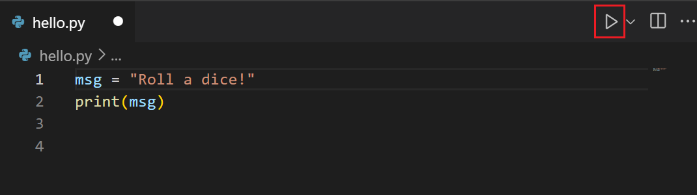

The button opens a terminal panel in which your Python interpreter is automatically activated, then runs `python3 hello.py` (macOS/Linux) or `python hello.py` (Windows):

​​​	该按钮将打开一个终端面板，其中您的 Python 解释器会自动激活，然后运行 `python3 hello.py` (macOS/Linux) 或 `python hello.py` (Windows)：

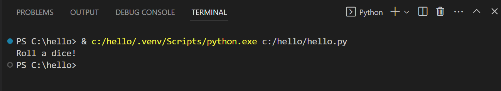

There are three other ways you can run Python code within VS Code:

​​​	您还可以在 VS Code 中通过其他三种方式运行 Python 代码：

1. Right-click anywhere in the editor window and select **Run > Python File in Terminal** (which saves the file automatically):

   ​​​	右键单击编辑器窗口中的任意位置，然后选择“运行”>“在终端中运行 Python 文件”(该操作会自动保存文件)：

   

2. Select one or more lines, then press Shift+Enter or right-click and select **Run Selection/Line in Python Terminal**. This command is convenient for testing just a part of a file.

   ​​​	选择一行或多行，然后按 Shift+Enter 或右键单击并选择在 Python 终端中运行选择/行。此命令便于仅测试文件的一部分。

3. From the Command Palette (Ctrl+Shift+P), select the **Python: Start REPL** command to open a REPL terminal for the currently selected Python interpreter. In the REPL, you can then enter and run lines of code one at a time.

   ​​​	从命令面板 (Ctrl+Shift+P) 中，选择 Python: 启动 REPL 命令，为当前选定的 Python 解释器打开一个 REPL 终端。然后，您可以在 REPL 中逐行输入和运行代码行。

Congrats, you just ran your first Python code in Visual Studio Code!

​​​	恭喜，您刚刚在 Visual Studio Code 中运行了第一个 Python 代码！

## [Configure and run the debugger 配置并运行调试器]()

Let's now try debugging our Python program.

​​​	现在，我们尝试调试 Python 程序。

First, set a breakpoint on line 2 of `hello.py` by placing the cursor on the `print` call and pressing F9. Alternately, click in the editor's left gutter, next to the line numbers. When you set a breakpoint, a red circle appears in the gutter.

​​​	首先，通过将光标放在 `hello.py` 调用上并按 F9，在 `hello.py` 的第 2 行上设置一个断点。或者，单击编辑器的左槽，位于行号旁边。设置断点后，槽中会显示一个红色圆圈。

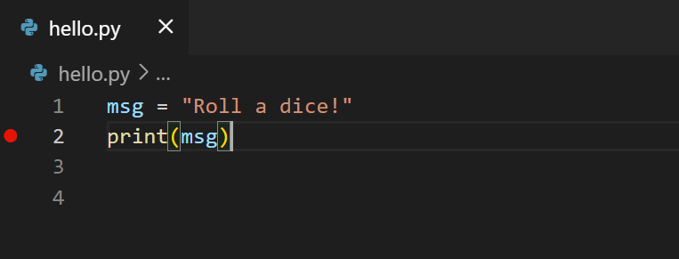

Next, to initialize the debugger, press F5. Since this is your first time debugging this file, a configuration menu will open from the Command Palette allowing you to select the type of debug configuration you would like for the opened file.

​​​	接下来，按 F5 初始化调试器。由于这是您第一次调试此文件，因此会从命令面板中打开一个配置菜单，允许您选择要为打开的文件使用的调试配置类型。

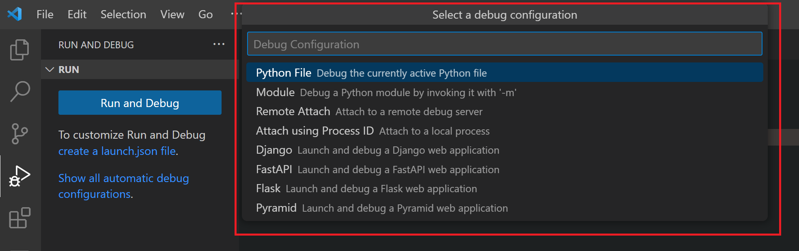

> **Note**: VS Code uses JSON files for all of its various configurations; `launch.json` is the standard name for a file containing debugging configurations.
>
> ​​​	注意：VS Code 为其所有各种配置使用 JSON 文件； `launch.json` 是包含调试配置的文件的标准名称。

Select **Python File**, which is the configuration that runs the current file shown in the editor using the currently selected Python interpreter.

​​​	选择 Python 文件，这是使用当前选定的 Python 解释器运行编辑器中显示的当前文件的配置。

Start the debugger by clicking on the down-arrow next to the run button on the editor, and selecting **Debug Python File in Terminal**.

​​​	通过单击编辑器上运行按钮旁边的向下箭头并选择在终端中调试 Python 文件来启动调试器。

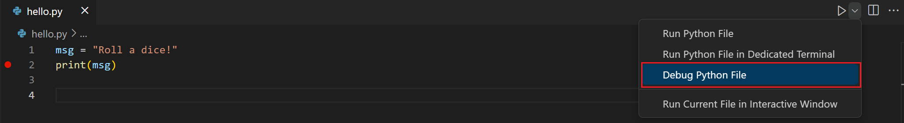

The debugger will stop at the first line of the file breakpoint. The current line is indicated with a yellow arrow in the left margin. If you examine the **Local** variables window at this point, you will see now defined `msg` variable appears in the **Local** pane.

​​​	调试器将在文件断点的第一行停止。当前行在左页边距中用黄色箭头指示。如果您此时检查“局部变量”窗口，您将看到现在定义的 `msg` 变量出现在“局部”窗格中。

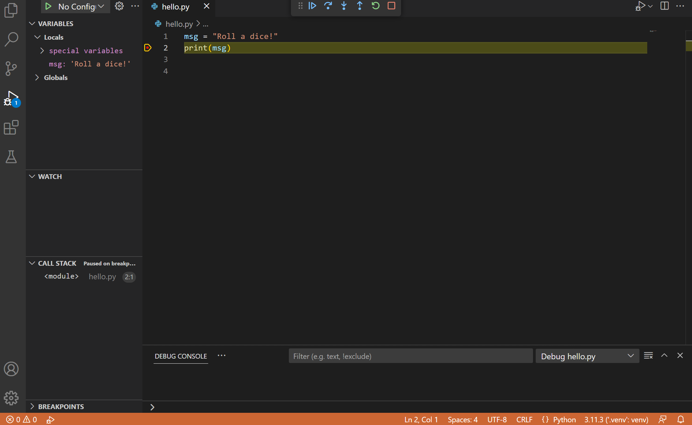

A debug toolbar appears along the top with the following commands from left to right: continue (F5), step over (F10), step into (F11), step out (Shift+F11), restart (Ctrl+Shift+F5), and stop (Shift+F5).

​​​	顶部会显示一个调试工具栏，其中包含以下命令（从左到右）：继续（F5）、单步执行（F10）、单步进入（F11）、单步退出（Shift+F11）、重新启动（Ctrl+Shift+F5）和停止（Shift+F5）。


The Status Bar also changes color (orange in many themes) to indicate that you're in debug mode. The **Python Debug Console** also appears automatically in the lower right panel to show the commands being run, along with the program output.

​​​	状态栏也会变色（在许多主题中为橙色），以指示您处于调试模式。Python 调试控制台也会自动显示在右下角面板中，以显示正在运行的命令以及程序输出。

To continue running the program, select the continue command on the debug toolbar (F5). The debugger runs the program to the end.

​​​	要继续运行程序，请选择调试工具栏上的继续命令（F5）。调试器将运行程序到结束。

> **Tip** Debugging information can also be seen by hovering over code, such as variables. In the case of `msg`, hovering over the variable will display the string `Roll a dice!` in a box above the variable.
>
> ​​​	提示：还可以通过将鼠标悬停在代码上（例如变量）来查看调试信息。对于 `msg` ，将鼠标悬停在变量上将在变量上方的框中显示字符串 `Roll a dice!` 。

You can also work with variables in the **Debug Console** (If you don't see it, select **Debug Console** in the lower right area of VS Code, or select it from the **...** menu.) Then try entering the following lines, one by one, at the **>** prompt at the bottom of the console:

​​​	您还可以在调试控制台中使用变量（如果您看不到它，请在 VS Code 的右下角区域中选择“调试控制台”，或从 ... 菜单中选择它。）然后尝试在控制台底部的 > 提示符处逐行输入以下行：

```
msg
msg.capitalize()
msg.split()
```

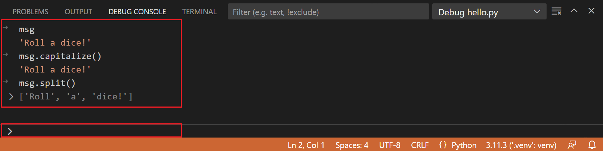

Select the blue **Continue** button on the toolbar again (or press F5) to run the program to completion. "Roll a dice!" appears in the **Python Debug Console** if you switch back to it, and VS Code exits debugging mode once the program is complete.

​​​	再次选择工具栏上的蓝色“继续”按钮（或按 F5）以运行程序直至完成。如果您切换回它，“掷骰子！”将显示在 Python 调试控制台中，并且一旦程序完成，VS Code 将退出调试模式。

If you restart the debugger, the debugger again stops on the first breakpoint.

​​​	如果您重新启动调试器，调试器将再次在第一个断点处停止。

To stop running a program before it's complete, use the red square stop button on the debug toolbar (Shift+F5), or use the **Run > Stop debugging** menu command.

​​​	要在程序完成之前停止运行它，请使用调试工具栏上的红色方块停止按钮（Shift+F5），或使用“运行”>“停止调试”菜单命令。

For full details, see [Debugging configurations](), which includes notes on how to use a specific Python interpreter for debugging.

​​​	有关完整详细信息，请参阅调试配置，其中包括有关如何将特定 Python 解释器用于调试的说明。

> **Tip: Use Logpoints instead of print statements**: Developers often litter source code with `print` statements to quickly inspect variables without necessarily stepping through each line of code in a debugger. In VS Code, you can instead use **Logpoints**. A Logpoint is like a breakpoint except that it logs a message to the console and doesn't stop the program. For more information, see [Logpoints]() in the main VS Code debugging article.
>
> ​​​	提示：使用 Logpoint 而非 print 语句：开发人员经常在源代码中散布 `print` 语句，以便快速检查变量，而无需在调试器中逐行检查每行代码。在 VS Code 中，您可以改用 Logpoint。Logpoint 类似于断点，但它会将消息记录到控制台，而不会停止程序。有关详细信息，请参阅 VS Code 主调试文章中的 Logpoint。

## [Install and use packages 安装并使用包]()

Let's build upon the previous example by using packages.

​​​	让我们通过使用包来构建上一个示例。

In Python, packages are how you obtain any number of useful code libraries, typically from [PyPI](https://pypi.org/), that provide additional functionality to your program. For this example, you use the `numpy` package to generate a random number.

​​​	在 Python 中，包是您获取任意数量有用代码库的方式，通常来自 PyPI，这些代码库为您的程序提供其他功能。对于此示例，您使用 `numpy` 包来生成随机数。

Return to the **Explorer** view (the top-most icon on the left side, which shows files), open `hello.py`, and paste in the following source code:

​​​	返回到资源管理器视图（左侧最顶部的图标，显示文件），打开 `hello.py` ，并粘贴以下源代码：

```
import numpy as np

msg = "Roll a dice"
print(msg)

print(np.random.randint(1,9))
```

> **Tip**: If you enter the above code by hand, you may find that auto-completions change the names after the `as` keywords when you press Enter at the end of a line. To avoid this, type a space, then Enter.
>
> ​​​	提示：如果您手动输入以上代码，您可能会发现自动完成在您按 Enter 键结束一行时更改 `as` 关键字后的名称。为避免这种情况，请键入一个空格，然后按 Enter 键。

Next, run the file in the debugger using the "Python: Current file" configuration as described in the last section.

​​​	接下来，按照上一节所述，使用“Python：当前文件”配置在调试器中运行文件。

You should see the message, **"ModuleNotFoundError: No module named 'numpy'"**. This message indicates that the required package isn't available in your interpreter. If you're using an Anaconda distribution or have previously installed the `numpy` package you may not see this message.

​​​	您应该会看到消息“ModuleNotFoundError: No module named 'numpy'”。此消息表明所需的包在您的解释器中不可用。如果您使用的是 Anaconda 发行版或之前已安装 `numpy` 包，则可能看不到此消息。

To install the `numpy` package, stop the debugger and use the Command Palette to run **Terminal: Create New Terminal** (Ctrl+Shift+`). This command opens a command prompt for your selected interpreter.

​​​	要安装 `numpy` 包，请停止调试器并使用命令面板运行终端：创建新终端 (Ctrl+Shift+`)。此命令会为所选解释器打开命令提示符。

To install the required packages in your virtual environment, enter the following commands as appropriate for your operating system:

​​​	要在虚拟环境中安装所需的包，请根据您的操作系统输入以下命令：

1. Install the packages

   ​​​	安装包

   ```
   # Don't use with Anaconda distributions because they include matplotlib already.
   
   # macOS
   python3 -m pip install numpy
   
   # Windows (may require elevation)
   py -m pip install numpy
   
   # Linux (Debian)
   apt-get install python3-tk
   python3 -m pip install numpy
   ```

2. Now, rerun the program, with or without the debugger, to view the output!

   ​​​	现在，重新运行程序（使用或不使用调试器）以查看输出！

Congrats on completing the Python tutorial! During the course of this tutorial, you learned how to create a Python project, create a virtual environment, run and debug your Python code, and install Python packages. Explore additional resources to learn how to get the most out of Python in Visual Studio Code!

​​​	恭喜您完成 Python 教程！在本教程中，您学习了如何创建 Python 项目、创建虚拟环境、运行和调试 Python 代码以及安装 Python 包。探索更多资源，了解如何在 Visual Studio Code 中充分利用 Python！

## [Next steps 后续步骤]()

To learn how to build web apps with popular Python web frameworks, see the following tutorials:

​​​	要了解如何使用流行的 Python Web 框架构建 Web 应用，请参阅以下教程：

- [Use Django in Visual Studio Code
  在 Visual Studio Code 中使用 Django]()
- [Use Flask in Visual Studio Code
  在 Visual Studio Code 中使用 Flask]()
- [Use FastAPI in Visual Studio Code
  在 Visual Studio Code 中使用 FastAPI]()

There is then much more to explore with Python in Visual Studio Code:

​​​	然后，您还可以在 Visual Studio Code 中使用 Python 探索更多内容：

- [Python profile template]() - Create a new [profile]() with a curated set of extensions, settings, and snippets
  Python 配置文件模板 - 使用精选的扩展、设置和代码段创建新配置文件
- [Editing code]() - Learn about autocomplete, IntelliSense, formatting, and refactoring for Python.
  编辑代码 - 了解 Python 的自动完成、IntelliSense、格式化和重构。
- [Linting]() - Enable, configure, and apply a variety of Python linters.
  Linting - 启用、配置和应用各种 Python linter。
- [Debugging]() - Learn to debug Python both locally and remotely.
  调试 - 了解如何在本地和远程调试 Python。
- [Testing]() - Configure test environments and discover, run, and debug tests.
  测试 - 配置测试环境并发现、运行和调试测试。
- [Settings reference]() - Explore the full range of Python-related settings in VS Code.
  设置参考 - 探索 VS Code 中与 Python 相关的全部设置。
- [Deploy Python to Azure App Service
  将 Python 部署到 Azure 应用服务](https://learn.microsoft.com/azure/developer/python/tutorial-containerize-deploy-python-web-app-azure-01)
- [Deploy Python to Container Apps
  将 Python 部署到容器应用](https://learn.microsoft.com/azure/developer/python/tutorial-deploy-python-web-app-azure-container-apps-01)
