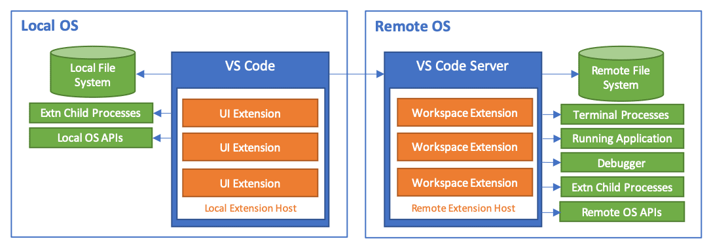
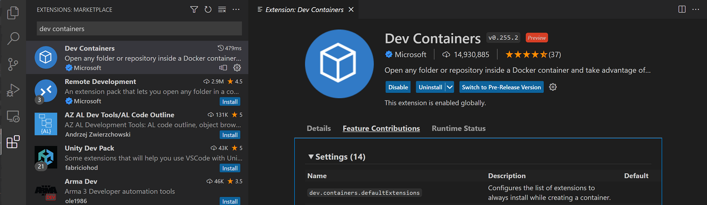

+++
title = "FAQ"
date = 2024-01-12T22:36:24+08:00
weight = 100
type = "docs"
description = ""
isCJKLanguage = true
draft = false
+++

> 原文: [https://code.visualstudio.com/docs/remote/faq](https://code.visualstudio.com/docs/remote/faq)

# Remote Development FAQ 远程开发常见问题解答

This article covers frequently asked questions for each of the **Visual Studio Code Remote Development** extensions. See the [SSH](), [Containers](), and [WSL]() articles for more details on setting up and working with each of their respective capabilities. Or try the introductory [Tutorials]() to help get you running quickly in a remote environment.

​​	本文介绍了 Visual Studio Code 远程开发扩展的常见问题解答。有关设置和使用各个功能的详细信息，请参阅 SSH、容器和 WSL 文章。或者尝试使用入门教程，帮助您快速在远程环境中运行。

For questions about [GitHub Codespaces](https://github.com/features/codespaces), see the [GitHub Codespaces documentation](https://docs.github.com/github/developing-online-with-codespaces).

​​	有关 GitHub Codespaces 的问题，请参阅 GitHub Codespaces 文档。

## [General 常规]()

### [What is Visual Studio Code Remote Development? Visual Studio Code 远程开发是什么？]()

The Visual Studio Code [Remote Development extension pack](https://aka.ms/vscode-remote/download/extension) allows you to open any folder in a container, on a remote machine (via SSH), or in the Windows Subsystem for Linux and take advantage of VS Code's full feature set. This means that VS Code can provide a local-quality development experience — including full IntelliSense (completions), debugging, and more — regardless of where your code is located or hosted.

​​	Visual Studio Code 远程开发扩展包允许您在容器、远程计算机（通过 SSH）或适用于 Linux 的 Windows 子系统中打开任何文件夹，并利用 VS Code 的全套功能。这意味着 VS Code 可以提供本地质量的开发体验，包括完整的 IntelliSense（完成）、调试等，而不管您的代码位于何处或托管在何处。

### [What advantages does VS Code Remote Development provide over local editing? Visual Studio Code 远程开发与本地编辑相比有什么优势？]()

Some benefits of remote development include:

​​	远程开发的一些好处包括：

- Being able to edit, build, or debug on a different OS than you are running locally.
  能够在与您本地运行不同的操作系统上进行编辑、构建或调试。
- Being able to develop in an environment that matches the target deployment environment.
  能够在与目标部署环境匹配的环境中进行开发。
- Using larger or more specialized hardware than your local machine for development.
  使用比本地计算机更大的或更专业的硬件进行开发。
- The ability to edit code stored in another location, such as in the cloud or at a customer site.
  能够编辑存储在其他位置的代码，例如在云端或客户站点。
- Separating developer environments to avoid conflicts, improve security, and speed up on-boarding.
  分离开发人员环境以避免冲突、提高安全性并加快入职速度。

Compared to using a network share or synchronizing files, VS Code Remote Development provides dramatically better performance along with better control over your development environment and tools.

​​	与使用网络共享或同步文件相比，VS Code 远程开发提供了显著更好的性能，以及对开发环境和工具的更好控制。

### [How do the Remote Development extensions relate to GitHub Codespaces? 远程开发扩展与 GitHub Codespaces 有什么关系？]()

[GitHub Codespaces](https://github.com/features/codespaces) is a service that provides managed cloud-hosted development environments accessible from both VS Code and a new browser-based editor. The service also allows VS Code and the browser-based editor to access self-hosted environments (desktop or server) without requiring an SSH server or even a direct network route. You can read more in the [GitHub Codespaces documentation](https://docs.github.com/github/developing-online-with-codespaces).

​​	GitHub Codespaces 是一项服务，它提供托管的云托管开发环境，可从 VS Code 和新的基于浏览器的编辑器访问。该服务还允许 VS Code 和基于浏览器的编辑器访问自托管环境（桌面或服务器），而无需 SSH 服务器甚至直接网络路由。您可以在 GitHub Codespaces 文档中阅读更多信息。

While the Remote Development and Codespaces extensions share technology and features, the Remote Development extensions are released separately and can operate independently from GitHub Codespaces.

​​	虽然远程开发和 Codespaces 扩展共享技术和功能，但远程开发扩展是单独发布的，并且可以独立于 GitHub Codespaces 运行。

### [How do the Remote Development extensions work? 远程开发扩展如何工作？]()

Visual Studio Code Remote Development allows your local VS Code installation to transparently interact with source code and runtime environments on other machines (whether virtual or physical) by moving the execution of certain commands to a "remote server". The **VS Code Server** is quickly installed by VS Code when you connect to a remote endpoint and can host extensions that interact directly with the remote workspace, machine, and file system.

​​	Visual Studio Code 远程开发允许本地 VS Code 安装与其他计算机（无论是虚拟机还是物理机）上的源代码和运行时环境进行透明交互，方法是将某些命令的执行移至“远程服务器”。当您连接到远程端点时，VS Code 会快速安装 VS Code Server，并且可以托管与远程工作区、计算机和文件系统直接交互的扩展。

See [Supporting Remote Development](https://code.visualstudio.com/api/advanced-topics/remote-extensions) for additional details about extensions.

​​	有关扩展的更多详细信息，请参阅支持远程开发。

### [How do the Remote Development extensions secure access to a remote machine, VM, or container? 远程开发扩展如何保护对远程计算机、VM 或容器的访问？]()

Visual Studio Code Remote Development uses existing, well known transports like [secure shell](https://en.wikipedia.org/wiki/Secure_Shell) to authenticate and secure traffic. No ports need to be publicly opened beyond those used by these well-known, secure transports.

​​	Visual Studio Code 远程开发使用现有的、众所周知的传输（如安全外壳）来验证和保护流量。除了这些众所周知、安全的传输所使用的端口之外，无需公开任何端口。

The VS Code Server that is injected runs as the same user you used to sign in to the machine, ensuring that VS Code and its extensions are not given improper elevated access without permission. The server is started and stopped by VS Code and is not wired into any user or global login or startup scripts. VS Code manages the server's lifecycle so you do not need to worry about whether or not it is running.

​​	注入的 VS Code Server 以您用于登录计算机的相同用户身份运行，确保 VS Code 及其扩展未在未经许可的情况下获得不当的提升访问权限。服务器由 VS Code 启动和停止，并且未连接到任何用户或全局登录或启动脚本。VS Code 管理服务器的生命周期，因此您无需担心它是否正在运行。

### [Can VS Code Server be installed or used on its own? VS Code Server 可以单独安装或使用吗？]()

No. The VS Code Server is a component of the Remote Development extensions and is managed by a VS Code client. It is installed and updated automatically by VS Code when it connects to an endpoint and if installed separately could become quickly out of date. It is not intended or [licensed]() for use by other clients.

​​	不可以。VS Code Server 是远程开发扩展组件，由 VS Code 客户端管理。当它连接到端点时，VS Code 会自动安装和更新它，如果单独安装，可能会很快过时。它不打算或未获得许可供其他客户端使用。

### [What are the connectivity requirements for VS Code Server? VS Code Server 的连接要求是什么？]()

Installation of VS Code Server requires that your local machine have outbound HTTPS (port 443) connectivity to:

​​	安装 VS Code Server 要求您的本地计算机具有到以下位置的出站 HTTPS（端口 443）连接：

- `update.code.visualstudio.com`
- `*.vo.msecnd.net` (Azure CDN)
  `*.vo.msecnd.net` （Azure CDN）

By default, the Remote - SSH will attempt to download on the remote host, but if you enable `remote.SSH.allowLocalServerDownload`, the extension will fall back to downloading VS Code Server locally and transferring it remotely once a connection is established.

​​	默认情况下，远程 - SSH 将尝试在远程主机上下载，但如果您启用 `remote.SSH.allowLocalServerDownload` ，扩展将回退到在本地下载 VS Code Server，并在建立连接后将其远程传输。

The Dev Containers extension always downloads locally and transfers into the container.

​​	Dev Containers 扩展始终在本地下载并传输到容器中。

You can install extensions manually without an internet connection using the **Extensions: Install from VSIX...** command, but if you use the extension panel or `devcontainer.json` to install extensions, your local machine and VS Code Server will need outbound HTTPS (port 443) access to:

​​	您可以使用“扩展：从 VSIX 安装...”命令在没有互联网连接的情况下手动安装扩展，但如果您使用扩展面板或 `devcontainer.json` 安装扩展，您的本地计算机和 VS Code Server 将需要出站 HTTPS（端口 443）访问权限：

- `marketplace.visualstudio.com`
- `vscode.blob.core.windows.net`
- `*.vo.msecnd.net` (Azure CDN)
  `*.vo.msecnd.net` （Azure CDN）
- `*.gallerycdn.vsassets.io` (Azure CDN)
  `*.gallerycdn.vsassets.io` （Azure CDN）

Finally, some extensions (like C#) download secondary dependencies from `download.microsoft.com` or `download.visualstudio.microsoft.com`. Others (like [Visual Studio Live Share](https://learn.microsoft.com/visualstudio/liveshare/reference/connectivity#requirements-for-connection-modes)) may have additional connectivity requirements. Consult the extension's documentation for details if you run into trouble.

​​	最后，一些扩展（如 C#）从 `download.microsoft.com` 或 `download.visualstudio.microsoft.com` 下载辅助依赖项。其他扩展（如 Visual Studio Live Share）可能具有其他连接要求。如果您遇到问题，请查阅扩展的文档以了解详细信息。

All other communication between the server and the VS Code client is accomplished through the following transport channels depending on the extension:

​​	服务器和 VS Code 客户端之间的所有其他通信都通过以下传输通道完成，具体取决于扩展：

- SSH: An authenticated, secure SSH tunnel.
  SSH：经过身份验证的安全 SSH 隧道。
- Containers: Docker's configured communication channel (via `docker exec`).
  容器：Docker 的已配置通信通道（通过 `docker exec` ）。
- WSL: A random local port.
  WSL：随机本地端口。

You can find a list of locations VS Code itself needs access to in the [network connections article]().

​​	您可以在网络连接文章中找到 VS Code 本身需要访问的位置列表。

### [Why can't I see my local containers in the Docker extension when using the Remote - extensions? 在使用远程 - 扩展时，为什么我看不到 Docker 扩展中的本地容器？]()

By default, the Docker extension will run remotely. While this is a sensible default in some cases, it means the extension may not show local containers when VS Code is connected to a remote SSH host, container, or WSL.

​​	默认情况下，Docker 扩展将在远程运行。虽然在某些情况下这是一个合理的默认设置，但这意味着当 VS Code 连接到远程 SSH 主机、容器或 WSL 时，扩展可能不会显示本地容器。

You can use one of the following solutions to resolve this problem:

​​	您可以使用以下解决方案之一来解决此问题：

- Open a new local window (**File > New Window**) and use it to work with local containers.

  ​​	打开一个新的本地窗口（文件 > 新窗口）并使用它来处理本地容器。

- Install the [Dev Containers](https://aka.ms/vscode-remote/download/containers) extension and use the [Remote Explorer]() in situations when you need to see your local containers.

  ​​	在需要查看本地容器时，安装 Dev Containers 扩展并使用远程资源管理器。

- **WSL only**: Use the [Docker Technical Preview for WSL 2](https://docs.docker.com/docker-for-windows/wsl-tech-preview/) or [configure Docker Desktop for use in WSL 1](https://nickjanetakis.com/blog/setting-up-docker-for-windows-and-wsl-to-work-flawlessly).

  ​​	仅限 WSL：使用适用于 WSL 2 的 Docker 技术预览版或配置 Docker Desktop 以在 WSL 1 中使用。

- **Dev Containers only**: Forward the [Docker socket and install the Docker CLI](https://aka.ms/vscode-remote/samples/docker-from-docker) (only) in the container.

  ​​	仅限 Dev Containers：转发 Docker 套接字并在容器中安装 Docker CLI（仅限）。

- Use the [extensionKind property]() to force the extension to be `ui`. However, this will prevent some commands from working.

  ​​	使用 extensionKind 属性强制扩展为 `ui` 。但是，这将阻止某些命令正常工作。

### [What Linux packages or libraries need to be installed on a host to use Remote Development? 在主机上需要安装哪些 Linux 软件包或库才能使用远程开发？]()

Remote Development requires kernel >= 3.10, glibc >=2.17, and libstdc++ >= 3.4.18. Recent x86_64 glibc-based distributions have the best support, but exact requirements can vary by distribution.

​​	远程开发需要内核 >= 3.10、glibc >=2.17 和 libstdc++ >= 3.4.18。最新的基于 x86_64 glibc 的发行版具有最佳支持，但确切要求可能因发行版而异。

Support for musl-based [Alpine Linux](https://alpinelinux.org/) is available for the Dev Containers and WSL extensions and ARMv7l (AArch32) / ARMv8l (AArch64) is available in Remote - SSH. However, native dependencies in certain extensions may cause them not to function on non-x86_64 glibc distributions. Note that experimental ARMv8l (AArch64) is available in [VS Code Insiders](https://code.visualstudio.com/insiders/) only.

​​	Dev Containers 和 WSL 扩展支持基于 musl 的 Alpine Linux，ARMv7l (AArch32)/ARMv8l (AArch64) 在远程 - SSH 中可用。但是，某些扩展中的本机依赖项可能导致它们无法在非 x86_64 glibc 发行版上运行。请注意，实验性 ARMv8l (AArch64) 仅在 VS Code Insiders 中可用。

See [Remote Development with Linux](https://code.visualstudio.com/docs/remote/linux) for additional details.

​​	有关其他详细信息，请参阅使用 Linux 进行远程开发。

### [Can I install individual extensions instead of the extension pack? 我可以安装单个扩展而不是扩展包吗？]()

Yes. The [Remote Development extension pack](https://aka.ms/vscode-remote/download/extension) provides a convenient way for you to access all of the latest remote capabilities as they are released. However, you can always install the individual extensions from the Marketplace or VS Code Extensions view.

​​	可以。远程开发扩展包提供了一种便捷的方式，可让您在发布时访问所有最新的远程功能。但是，您始终可以从 Marketplace 或 VS Code Extensions 视图安装各个扩展。

- [Remote - SSH](https://aka.ms/vscode-remote/download/ssh)
- [Dev Containers
  开发容器](https://aka.ms/vscode-remote/download/containers)
- [WSL](https://aka.ms/vscode-remote/download/wsl)

## [How can I review and configure extension settings? 如何查看和配置扩展设置？]()

As with [other parts of Visual Studio Code](), you can customize each of the Remote Development extensions through their settings. Using Dev Containers as an example, you may review a list of all Dev Containers settings by opening the extension in the Extensions view (Ctrl+Shift+X), and navigating to **Feature Contributions**:

​​	与 Visual Studio Code 的其他部分一样，您可以通过其设置自定义每个远程开发扩展。以 Dev Containers 为例，您可以通过在扩展视图 (Ctrl+Shift+X) 中打开扩展并在功能贡献中导航来查看所有 Dev Containers 设置的列表：

## [WSL]()

### [What is the advantage of the extension over using WSL as the terminal? 该扩展与使用 WSL 作为终端相比有什么优势？]()

You can think of WSL as a Linux machine running on Windows, where you can install Linux specific frameworks/tools (for example Python, Go, Rust, etc.) without impacting your Windows setup. You can then use VS Code and the WSL extension to develop in the context of what is installed in WSL, isolated from what is installed on Windows.

​​	您可以将 WSL 视为运行在 Windows 上的 Linux 机器，您可以在其中安装 Linux 特定的框架/工具（例如 Python、Go、Rust 等），而不会影响您的 Windows 设置。然后，您可以使用 VS Code 和 WSL 扩展在 WSL 中安装的内容的上下文中进行开发，而无需考虑在 Windows 上安装的内容。

For example, you might install the Go stack in WSL (compiler, debugger, linters, etc.). If you run VS Code only on Windows, you must also install the same Go stack there to get features like smart completions, debugging, Go to Definition navigation. And because the language services are running on Windows, they don’t know what is in WSL.

​​	例如，您可能会在 WSL 中安装 Go 堆栈（编译器、调试器、linter 等）。如果您仅在 Windows 上运行 VS Code，还必须在其中安装相同的 Go 堆栈，才能获得智能完成、调试、转到定义导航等功能。并且由于语言服务在 Windows 上运行，因此它们不知道 WSL 中的内容。

It’s true that you can run binaries in WSL from Windows and vice-versa, but regular VS Code extensions don’t know how to do this. This is how we started out supporting debugging in WSL, but quickly realized we would have to update all extensions to know about WSL.

​​	确实，您可以从 Windows 在 WSL 中运行二进制文件，反之亦然，但常规 VS Code 扩展不知道如何执行此操作。这就是我们开始支持在 WSL 中进行调试的方式，但很快意识到我们必须更新所有扩展才能了解 WSL。

We decided instead to make parts of VS Code run in WSL and let the UI running on Windows talk to the VS Code server running in WSL. This is what the WSL extension enables and with it, the Go extension runs in WSL along with the rest of the Go tools (compiler, debugger, linters), while VS Code runs on Windows.

​​	我们决定改为让 VS Code 的部分在 WSL 中运行，并让在 Windows 上运行的 UI 与在 WSL 中运行的 VS Code 服务器通信。这就是 WSL 扩展所实现的功能，借助此扩展，Go 扩展与其他 Go 工具（编译器、调试器、linter）一起在 WSL 中运行，而 VS Code 在 Windows 上运行。

With this approach, language features like smart completions just work against what is in WSL without having to set up anything on Windows. You don't have to worry about path issues or set up different versions of development stacks on Windows. If you are deploying applications to Linux, you can set up your WSL instances to look like your runtime environment while still getting a rich editing experience on Windows.

​​	通过这种方法，智能补全等语言功能只需针对 WSL 中的内容即可，而无需在 Windows 上设置任何内容。您不必担心路径问题，也不必在 Windows 上设置不同版本的开发堆栈。如果您要将应用程序部署到 Linux，可以将 WSL 实例设置为类似于您的运行时环境，同时仍可在 Windows 上获得丰富的编辑体验。

## [Extensions authors 扩展作者]()

### [As an extension author, what do I need to do? 作为扩展作者，我需要做什么？]()

The VS Code extension API abstracts away local/remote details so most extensions will work without modification. However, given extensions can use any node module or runtime they want, there are situations where adjustments may need to be made. We recommend you should test your extension (particularly in a container) to be sure that no updates are required. See [Supporting Remote Development](https://code.visualstudio.com/api/advanced-topics/remote-extensions) for details.

​​	VS Code 扩展 API 抽象了本地/远程详细信息，因此大多数扩展无需修改即可工作。但是，鉴于扩展可以使用任何所需的 node 模块或运行时，因此可能需要进行调整。我们建议您测试您的扩展（尤其是在容器中），以确保不需要任何更新。有关详细信息，请参阅支持远程开发。

### [Can an extension access local resources or APIs when a user is connected remotely? 当用户远程连接时，扩展可以访问本地资源或 API 吗？]()

When VS Code connects to a remote environment, extensions are classified as either **UI** or **Workspace** extensions. UI Extensions run in a **local extension host**, can contribute UI or personalization features (for example themes), and have access to local files or APIs. Workspace extensions run in a **remote extension host** with the workspace and have full access to the source code, remote filesystem, and remote APIs. While Workspace extensions do not focus on UI customization, they can contribute explorers, views, and other UI elements as well.

​​	当 VS Code 连接到远程环境时，扩展程序被分类为 UI 扩展程序或工作区扩展程序。UI 扩展程序在本地扩展程序主机中运行，可以提供 UI 或个性化功能（例如主题），并且可以访问本地文件或 API。工作区扩展程序在远程扩展程序主机中与工作区一起运行，并且可以完全访问源代码、远程文件系统和远程 API。虽然工作区扩展程序不专注于 UI 自定义，但它们也可以提供资源管理器、视图和其他 UI 元素。

When a user installs an extension, VS Code attempts to infer the correct location and install it based on its type. Extensions that do not need to run remotely like themes and other UI customizations are automatically installed on the UI side. All others are treated as Workspace extensions since they are the most full-featured. However, extension authors can also override this location with an `extensionKind` property in `package.json`.

​​	当用户安装扩展程序时，VS Code 会尝试推断正确的位置并根据其类型进行安装。无需远程运行的扩展程序（如主题和其他 UI 自定义）会自动安装在 UI 端。所有其他扩展程序都被视为工作区扩展程序，因为它们功能最齐全。但是，扩展程序作者也可以使用 `extensionKind` 中的 `package.json` 属性覆盖此位置。

If your extension is not functioning as expected, [there are steps to check](https://code.visualstudio.com/api/advanced-topics/remote-extensions#incorrect-execution-location) if it is running in the correct location or should perhaps have a different `extensionKind`. Also see [Supporting Remote Development](https://code.visualstudio.com/api/advanced-topics/remote-extensions) for additional details on what extension authors need to know about Remote Development and Codespaces.

​​	如果您的扩展未按预期运行，则可以采取一些步骤来检查它是否在正确的位置运行，或者是否应该具有不同的 `extensionKind` 。另请参阅支持远程开发，以了解扩展作者需要了解的有关远程开发和 Codespaces 的其他详细信息。

## [License and privacy 许可证和隐私]()

### [Location 位置]()

You can find the licenses for the VS Code Remote Development extensions here:

​​	您可以在此处找到 VS Code 远程开发扩展的许可证：

- [Remote-SSH License
  Remote-SSH 许可证](https://marketplace.visualstudio.com/items/ms-vscode-remote.remote-ssh/license)
- [WSL License
  WSL 许可证](https://marketplace.visualstudio.com/items/ms-vscode-remote.remote-wsl/license)
- [Dev Containers License
  Dev Containers 许可证](https://marketplace.visualstudio.com/items/ms-vscode-remote.remote-containers/license)

### [Why aren't the Remote Development extensions or their components open source? 为什么远程开发扩展或其组件不是开源的？]()

The Visual Studio Code Remote Development extensions and their related components use an [open planning, issue, and feature request process](https://aka.ms/vscode-remote/feedback), but are not currently open source. The extensions share source code which is also used in fully managed remote development services like [GitHub Codespaces](https://github.com/features/codespaces) and their related extensions.

​​	Visual Studio Code 远程开发扩展及其相关组件使用开放的规划、问题和功能请求流程，但目前不是开源的。这些扩展共享源代码，这些源代码还用于完全托管的远程开发服务（如 GitHub Codespaces 及其相关扩展）。

See the [Visual Studio Code and 'Code - OSS' Differences](https://github.com/microsoft/vscode/wiki/Differences-between-the-repository-and-Visual-Studio-Code) and [Microsoft Extension Licenses](https://code.visualstudio.com/docs/supporting/oss-extensions) articles for more information.

​​	请参阅 Visual Studio Code 和“Code - OSS”差异以及 Microsoft 扩展许可证文章以了解更多信息。

### [Are there any restrictions on where the Remote Development extensions can connect? 远程开发扩展的连接位置是否有任何限制？]()

You are free to use the extensions for both personal or corporate use to connect to your own physical machines, virtual machines, or containers. These can be on-premise, in your own private cloud or datacenter, in Azure, or other cloud/non-cloud hosting providers. You cannot build public products or services on top of the extensions or their related components (see next question).

​​	您可以自由地将扩展用于个人或公司用途，以连接到您自己的物理机器、虚拟机或容器。这些可以是本地、您自己的私有云或数据中心、Azure 或其他云/非云托管提供商。您不能在扩展或其相关组件之上构建公共产品或服务（请参阅下一个问题）。

### [Can I use the VS Code Remote Development extensions to build my own product or service? 我可以使用 VS Code 远程开发扩展来构建自己的产品或服务吗？]()

You can use the extensions with your own internal or private services. You cannot build a public or commercial service on top of the VS Code Remote Development extensions or their related components (for example VS Code Server). You cannot create other extensions that extend or manipulate the Remote Development extensions. While the license states you may not "provide the software as a stand-alone or integrated offering or combine it with any of your applications for others to use", you can document how to use the extensions in conjunction with your service.

​​	您可以将扩展与您自己的内部或私人服务一起使用。您不能在 VS Code 远程开发扩展或其相关组件（例如 VS Code Server）之上构建公共或商业服务。您不能创建其他扩展来扩展或操作远程开发扩展。虽然许可证规定您不得“将软件作为独立或集成产品提供，或将其与您的任何应用程序结合起来供他人使用”，但您可以记录如何将扩展与您的服务结合使用。

### [Can I repackage or reuse VS Code Server in my own public service offering? 我可以在自己的公共服务产品中重新打包或重复使用 VS Code Server 吗？]()

No. The license states that you may not "provide the software as a stand-alone or integrated offering or combine it with any of your applications for others to use" which means you may not build public products or services on top of the VS Code Server.

​​	否。许可证规定您不得“将软件作为独立或集成产品提供，或将其与您的任何应用程序结合起来供他人使用”，这意味着您不得在 VS Code Server 之上构建公共产品或服务。

### [I have a question about whether I can use the extensions for X, who can I ask? 我有关于是否可以使用 X 的扩展的问题，我可以问谁？]()

Please file an [issue](https://github.com/microsoft/vscode-remote-release/issues).

​​	请提交问题。

### [GDPR and VS Code Remote Development GDPR 和 VS Code 远程开发]()

The VS Code Remote Development extensions follow the GDPR policies as Visual Studio Code itself. See the [general FAQ](https://code.visualstudio.com/docs/supporting/faq#_gdpr-and-vs-code) for more details.

​​	VS Code 远程开发扩展遵循与 Visual Studio Code 本身相同的 GDPR 政策。有关更多详细信息，请参阅常见问题解答。

## [Questions or feedback 问题或反馈]()

Have a question or feedback?

​​	有疑问或反馈？

- See [Tips and Tricks]().
  请参阅提示和技巧。
- Search on [Stack Overflow](https://stackoverflow.com/questions/tagged/vscode-remote).
  在 Stack Overflow 上搜索。
- Add a [feature request](https://aka.ms/vscode-remote/feature-requests) or [report a problem](https://aka.ms/vscode-remote/issues/new).
  添加功能请求或报告问题。
