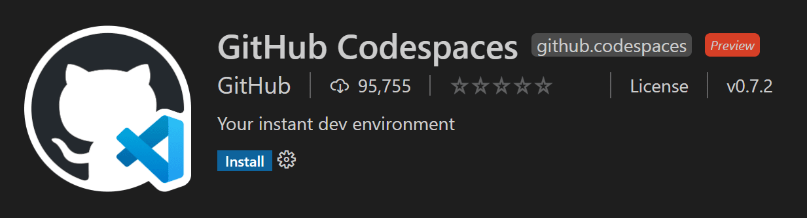
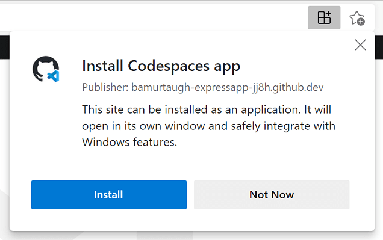
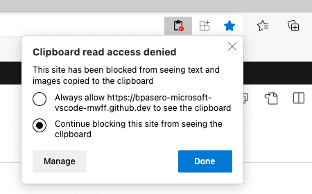
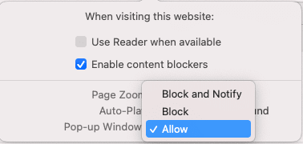

+++
title = "GitHub Codespaces"
date = 2024-01-12T22:36:24+08:00
weight = 40
type = "docs"
description = ""
isCJKLanguage = true
draft = false
+++

> 原文: [https://code.visualstudio.com/docs/remote/codespaces](https://code.visualstudio.com/docs/remote/codespaces)

# GitHub Codespaces

[GitHub Codespaces](https://github.com/features/codespaces) provides cloud-powered development environments for any activity - whether it's a long-term project, or a short-term task like reviewing a pull request. You can work with these environments from Visual Studio Code or in a browser-based editor.

​​	GitHub Codespaces 为任何活动提供云端开发环境 - 无论是长期项目还是像审查拉取请求这样的短期任务。您可以通过 Visual Studio Code 或基于浏览器的编辑器使用这些环境。

## [Environments 环境](https://code.visualstudio.com/docs/remote/codespaces#_environments)

An environment is the "backend" half of GitHub Codespaces. It's where all of the compute associated with software development happens: compiling, debugging, restoring, etc. When you need to work on a new project, pick up a new task, or review a PR, you can simply spin up a Cloud-hosted environment, and GitHub Codespaces takes care of configuring it correctly. It automatically configures everything you need to work on your project: the source code, runtime, compiler, debugger, editor, custom dotfile configurations, relevant editor extensions and more.

​​	环境是 GitHub Codespaces 的“后端”部分。它是所有与软件开发相关的计算发生的地方：编译、调试、还原等。当您需要处理新项目、开始新任务或审查 PR 时，您可以简单地启动一个云托管环境，GitHub Codespaces 会负责正确配置它。它会自动配置您处理项目所需的一切：源代码、运行时、编译器、调试器、编辑器、自定义点文件配置、相关的编辑器扩展等。

## [Customization 自定义](https://code.visualstudio.com/docs/remote/codespaces#_customization)

GitHub Codespaces are fully customizable on a per project basis. This is accomplished by including a `devcontainer.json` file in the project's repository, similar to VS Code [Dev Containers](https://code.visualstudio.com/docs/devcontainers/containers) development.

​​	GitHub Codespaces 可以根据每个项目进行完全自定义。这可以通过在项目的存储库中包含一个 `devcontainer.json` 文件来实现，类似于 VS Code Dev Containers 开发。

Example customizations include:

​​	示例自定义包括：

- Setting the Linux-based operating system to use.
  设置要使用的基于 Linux 的操作系统。
- Automatically installing various tools, runtimes, and frameworks.
  自动安装各种工具、运行时和框架。
- Forwarding commonly used ports.
  转发常用端口。
- Setting environment variables.
  设置环境变量。
- Configuring editor settings and installing preferred extensions.
  配置编辑器设置并安装首选扩展。

See the [Configuring Codespaces](https://docs.github.com/github/developing-online-with-codespaces/configuring-codespaces-for-your-project) documentation for codespace-specific `devcontainer.json` settings.

​​	有关特定于代码空间的 `devcontainer.json` 设置，请参阅配置代码空间文档。

## [Dotfile per user configuration 每个用户配置的点文件](https://code.visualstudio.com/docs/remote/codespaces#_dotfile-per-user-configuration)

Dotfiles are files whose filename begins with a dot (.). They typically contain configuration information for applications and can control how terminals, editors, source control, and various other tools behave. `.bashrc`, `.gitignore`, and `.editorconfig` are examples of dotfiles commonly used by developers.

​​	点文件是文件名以点 (.) 开头的文件。它们通常包含应用程序的配置信息，可以控制终端、编辑器、源代码管理和其他各种工具的行为。 `.bashrc` 、 `.gitignore` 和 `.editorconfig` 是开发人员常用的点文件示例。

You can specify a GitHub repo containing your dotfiles, a target location for the files, as well as install commands when creating a codespace.

​​	您可以在创建代码空间时指定包含您的点文件的 GitHub 仓库、文件的目标位置以及安装命令。

See the [Personalizing Codespaces](https://docs.github.com/github/developing-online-with-codespaces/personalizing-codespaces-for-your-account) documentation to learn how to add your dotfile configurations to a codespace.

​​	请参阅个性化代码空间文档，了解如何将您的点文件配置添加到代码空间。

## [Getting started 入门](https://code.visualstudio.com/docs/remote/codespaces#_getting-started)

There are getting started topics for both GitHub Codespaces clients. These will fast-track you through signing in to GitHub Codespaces, creating your first codespace, and connecting to it with your preferred client:

​​	GitHub Codespaces 客户端都有入门主题。这些主题将快速引导您完成登录 GitHub Codespaces、创建第一个代码空间以及使用您首选的客户端连接到该代码空间的过程：

- [Codespaces in VS Code](https://docs.github.com/github/developing-online-with-codespaces/using-codespaces-in-visual-studio-code) - Use the [GitHub Codespaces](https://marketplace.visualstudio.com/items?itemName=GitHub.codespaces) extension to connect and work in your environment.
  VS Code 中的代码空间 - 使用 GitHub Codespaces 扩展连接到您的环境并在此环境中工作。
- [Codespaces in the browser](https://docs.github.com/github/developing-online-with-codespaces/creating-a-codespace) - Connect to your codespace through a browser-based editor.
  浏览器中的 Codespaces - 通过基于浏览器的编辑器连接到你的 codespace。

## [Extension authors 扩展作者](https://code.visualstudio.com/docs/remote/codespaces#_extension-authors)

The VS Code extension API hides most of the implementation details of running remotely so many extensions will just work in GitHub Codespaces environments without any modification. However, we recommend that you test your extension in a codespace to be sure that all of its functionality works as expected. See the article on [Supporting Remote Development and GitHub Codespaces](https://code.visualstudio.com/api/advanced-topics/remote-extensions) for details.

​​	VS Code 扩展 API 隐藏了远程运行的大部分实现细节，因此许多扩展无需任何修改即可在 GitHub Codespaces 环境中运行。但是，我们建议你在 codespace 中测试你的扩展，以确保其所有功能按预期工作。有关详细信息，请参阅有关支持远程开发和 GitHub Codespaces 的文章。

## [Browser-based editor 基于浏览器的编辑器](https://code.visualstudio.com/docs/remote/codespaces#_browserbased-editor)

You also have a free, lightweight Visual Studio Code experience entirely in the browser. The web-based editor lets you browse source code repositories from GitHub safely and quickly and make lightweight code changes. You can open any repository, fork, or pull request in the editor, which has many of the features of VS Code, including search and syntax highlighting. If you want to run or debug your code, you can switch to the cloud-hosted environment or the VS Code desktop.

​​	你还可以完全在浏览器中获得免费的轻量级 Visual Studio Code 体验。基于 Web 的编辑器让你可以安全快速地浏览 GitHub 中的源代码存储库，并进行轻量级的代码更改。你可以在编辑器中打开任何存储库、分支或拉取请求，该编辑器具有许多 VS Code 的功能，包括搜索和语法突出显示。如果你想运行或调试你的代码，可以切换到云托管环境或 VS Code 桌面。

To access this browser-based editor, you can go to your repo on github.com and press . (period key) or change the URL of your repository to `github.dev/org/repo`, replacing `github.com` with `github.dev`.

​​	要访问此基于浏览器的编辑器，你可以转到 github.com 上的存储库并按 .(句点键)，或将存储库的 URL 更改为 `github.dev/org/repo` ，将 `github.com` 替换为 `github.dev` 。

Limitation: You may not be able to use the web-based editor if you are running your browser with Incognito mode or have ad blockers enabled.

​​	限制：如果您在浏览器中运行隐身模式或启用了广告拦截器，则可能无法使用基于 Web 的编辑器。

> **Note**: This editor is currently in Technical Preview. You can try it out today and provide feedback at https://github.co/browser-editor-feedback.
>
> ​​	注意：此编辑器当前处于技术预览版。您今天可以试用它，并在 https://github.co/browser-editor-feedback 上提供反馈。

## [Known limitations and adaptations 已知限制和改编](https://code.visualstudio.com/docs/remote/codespaces#_known-limitations-and-adaptations)

While working with Codespaces and specifically VS Code in the web, there are certain limitations to keep in mind. Some of these limitations have workarounds or adaptations in place to provide a consistent development experience.

​​	在使用 Codespaces 和 Web 中的 VS Code 时，需要注意某些限制。其中一些限制有解决方法或改编措施，以提供一致的开发体验。

For several issues (especially keybindings or those listed with a workaround for the desktop), you can install and use a Codespace as a [progressive web application](https://learn.microsoft.com/microsoft-edge/progressive-web-apps-chromium) (PWA).

​​	对于几个问题（尤其是那些列有桌面解决方法的键绑定或问题），您可以将 Codespace 安装并用作渐进式 Web 应用程序 (PWA)。

| Issue 问题                                                   | Reason 原因                                                  | Workaround 解决方法                                          |
| :----------------------------------------------------------- | :----------------------------------------------------------- | :----------------------------------------------------------- |
| Ctrl+Shift+P won't launch the Command Palette in Firefox. Ctrl+Shift+P 不会在 Firefox 中启动命令面板。 | Ctrl+Shift+P is reserved in Firefox. Ctrl+Shift+P 在 Firefox 中是保留的。 | Use F1 to launch the Command Palette. 使用 F1 启动命令面板。 |
| Certain default keybindings (for debugging) are different in the web. 某些默认键绑定（用于调试）在 Web 中有所不同。 | Since the browser may already have an action registered for those keybindings, we adjust the default for VS Code in the web. 由于浏览器可能已经为这些键绑定注册了一个操作，因此我们调整了 Web 中 VS Code 的默认设置。 | Use the adjusted defaults. They appear on tooltip hovers over the debug actions. 使用调整后的默认设置。它们显示在调试操作的工具提示悬停上。Step over is Alt+F10 (instead of F10) on all browsers. 在所有浏览器中，单步执行是 Alt+F10（而不是 F10）。Step into in the web is Alt+F11 (instead of F11) on Windows browsers. 在 Windows 浏览器中，Web 中的单步进入是 Alt+F11（而不是 F11）。 |
| F11 for debugging does not work on macOS in web or desktop. 在 Web 或桌面中，macOS 上的 F11 不适用于调试。 | This is a known, non-browser specific limitation. More information can be found in [issue #5102](https://github.com/microsoft/vscode/issues/5102). 这是一个已知的、非浏览器特定的限制。可以在问题 #5102 中找到更多信息。 | Disable F11 to show desktop on macOS. 禁用 F11 以在 macOS 上显示桌面。Go to: **System Preferences** > **Keyboard** > **Shortcuts** 转到：系统偏好设置 > 键盘 > 快捷键Uncheck the **Show Desktop F11** option 取消选中显示桌面 F11 选项 |
| Ctrl+N for new file doesn't work in web. Ctrl+N 无法在 Web 中新建文件。 | Ctrl+N opens a new window instead. Ctrl+N 会打开一个新窗口。 | Ctrl+N for new file works in the desktop. Ctrl+N 可在桌面上新建文件。 |
| Ctrl+W for closing an editor doesn't work in web. Ctrl+W 无法在 Web 中关闭编辑器。 | Ctrl+W closes the current tab in browsers. Ctrl+W 会在浏览器中关闭当前标签页。 | Ctrl+W works in the desktop. Ctrl+W 可在桌面上使用。         |
| Ctrl+Shift+B will not toggle the favorites bar in the browser. Ctrl+Shift+B 不会在浏览器中切换收藏栏。 | Codespaces overrides this and redirects to the "Build" menu in the Command Palette. Codespaces 会覆盖此操作并重定向到命令面板中的“生成”菜单。 | No current workarounds. 目前没有解决方法。                   |
| Dragging and dropping files from VS Code to a Codespace (and vice versa) does not work. 无法将文件从 VS Code 拖放到 Codespace（反之亦然）。 | You can see more context in [issue #115535](https://github.com/microsoft/vscode/issues/115535). 您可以在问题 #115535 中看到更多上下文。 | There are a couple of options: 有几个选项：You can right-click the file in your Codespace to download it to your local machine. 您可以在 Codespace 中右键单击文件以将其下载到本地计算机。You can drag files to your Codespace from the File Explorer. 您可以从文件资源管理器将文件拖动到 Codespace。 |
| Angular app debugging isn't supported in the web. Angular 应用调试在网络中不受支持。 | Code running in a browser cannot launch another browser instance in debug mode for security reasons. 出于安全原因，在浏览器中运行的代码无法以调试模式启动另一个浏览器实例。 | You have a few options: 您有几个选项：Debug Node.js/service-side js normally. 正常调试 Node.js/服务端 js。Open the Codespace in desktop, in which case the [companion](https://github.com/microsoft/vscode-js-debug-companion) will be used to launch your local Edge or Chrome install. 在桌面上打开 Codespace，在这种情况下，将使用伴侣启动您的本地 Edge 或 Chrome 安装。 |
| Downloading a file with no extension from the browser automatically adds ".txt" 从浏览器下载没有扩展名的文件会自动添加“.txt” | This is how Chrome and Edge behave. 这是 Chrome 和 Edge 的行为方式。 | Context and potential future solutions in [issue #118436](https://github.com/microsoft/vscode/issues/118436). 问题 #118436 中的上下文和潜在的未来解决方案。 |
| When you download a file from a remote (including Codespaces), attributes such as the executable bit are removed. 当您从远程（包括 Codespaces）下载文件时，可执行位等属性将被移除。 | Context and potential future solutions can be found in [issue #112099](https://github.com/microsoft/vscode/issues/112099). 可以在问题 #112099 中找到上下文和潜在的未来解决方案。 | No current workarounds. 目前没有解决方法。                   |
| You may see the prompt, "`Your_codespace_name` can't open this folder because it contains system files" when trying to download certain folders from a Codespace. 尝试从 Codespace 下载某些文件夹时，您可能会看到提示“ `Your_codespace_name` 无法打开此文件夹，因为它包含系统文件”。 | A user agent is free to impose the level of restrictions on sensitive directories. More information in [this spec](https://wicg.github.io/file-system-access/#privacy-wide-access) and [Chromium's blocklist](https://source.chromium.org/chromium/chromium/src/+/master:chrome/browser/file_system_access/chrome_file_system_access_permission_context.cc;l=140-208). 用户代理可以自由地对敏感目录施加限制级别。有关更多信息，请参阅此规范和 Chromium 的阻止列表。 | No additional workarounds beyond the spec and blocklist. 除了规范和阻止列表之外，没有其他解决方法。 |
| Manually visiting `http://localhost:forwarded_port` won't work to access a forwarded port from a Codespace in the web. 手动访问 `http://localhost:forwarded_port` 无法从 Web 中的 Codespace 访问已转发的端口。 | This is based on how Codespaces handles port forwarding and generates the correct URL for the web. 这是基于 Codespaces 如何处理端口转发并为 Web 生成正确 URL 的方式。 | Click the link from the port forwarding notification to open your app, or the globe icon in the [Ports view](https://code.visualstudio.com/docs/devcontainers/containers#_forwarding-or-publishing-a-port), both of which will provide the properly generated link. More information in the [Codespaces docs](https://docs.github.com/codespaces/developing-in-codespaces/forwarding-ports-in-your-codespace). 单击端口转发通知中的链接以打开您的应用，或单击“端口”视图中的地球图标，这两个操作都会提供正确生成的链接。有关更多信息，请参阅 Codespaces 文档。 |

### [Some extensions behave differently in the web 某些扩展在 Web 中的行为不同](https://code.visualstudio.com/docs/remote/codespaces#_some-extensions-behave-differently-in-the-web)

| Extension 扩展                                               | Issue / Reason 问题/原因                                     | Workaround 解决方法                                          |
| :----------------------------------------------------------- | :----------------------------------------------------------- | :----------------------------------------------------------- |
| Extensions with keyboard shortcuts that overlap with browser shortcuts, for example [Git Graph](https://marketplace.visualstudio.com/items?itemName=mhutchie.git-graph), which uses Ctrl+R to refresh. 键盘快捷键与浏览器快捷键重叠的扩展，例如 Git Graph，它使用 Ctrl+R 来刷新。 | The keyboard shortcut may overlap with an existing browser shortcut, for example Ctrl+R refreshes the window in Safari. 键盘快捷键可能与现有的浏览器快捷键重叠，例如 Ctrl+R 在 Safari 中刷新窗口。 | You can use a desktop-based, rather than web-based, Codespace to fully leverage your keyboard shortcuts. Different browsers may also behave differently (you can refresh Git Graph in Chrome). 您可以使用基于桌面的 Codespace（而不是基于 Web 的 Codespace）来充分利用键盘快捷键。不同的浏览器行为也可能不同（您可以在 Chrome 中刷新 Git Graph）。 |
| Language packs, for example the [Japanese Language Pack for Visual Studio Code](https://marketplace.visualstudio.com/items?itemName=MS-CEINTL.vscode-language-pack-ja) 语言包，例如适用于 Visual Studio Code 的日语语言包 | Language pack extensions are currently not supported in web-based Codespaces. 语言包扩展目前不受基于 Web 的 Codespaces 支持。 | You can use a desktop-based Codespace to use language packs and configure the display language. 您可以使用基于桌面的 Codespace 来使用语言包并配置显示语言。 |
| [Bracket Pair Colorizer 2](https://marketplace.visualstudio.com/items?itemName=CoenraadS.bracket-pair-colorizer-2) | It will not work in the browser as it introduces an install location dependency that is not easily fixable. 它不会在浏览器中工作，因为它引入了难以轻松修复的安装位置依赖项。 | Use [Bracket Pair Colorizer](https://marketplace.visualstudio.com/items?itemName=CoenraadS.bracket-pair-colorizer). 使用 Bracket Pair Colorizer。 |
| Browser Debuggers, such as [Debugger for Firefox](https://marketplace.visualstudio.com/items?itemName=firefox-devtools.vscode-firefox-debug). 浏览器调试器，例如适用于 Firefox 的调试器。 | Extensions that require a UI/Desktop extension host do not load in the browser. 需要 UI/桌面扩展程序主机的扩展程序不会在浏览器中加载。 | You can use these extensions in local VS Code (not connected to Codespaces). Or, while your app is running from a Codespace, you can use an alternative, like Chrome DevTools to inspect elements and set breakpoints. 您可以在本地 VS Code（未连接到 Codespaces）中使用这些扩展程序。或者，当您的应用正在 Codespace 中运行时，您可以使用替代方案（如 Chrome DevTools）来检查元素并设置断点。 |
| Extensions to open a browser, for example [open in browser](https://marketplace.visualstudio.com/items?itemName=techer.open-in-browser). 用于打开浏览器的扩展程序，例如在浏览器中打开。 | Extensions that require a UI/Desktop extension host do not load in the browser. 需要 UI/桌面扩展程序主机的扩展程序不会在浏览器中加载。 | Use a substitute extension if possible, like [Live Server](https://marketplace.visualstudio.com/items?itemName=ritwickdey.LiveServer). 如果可能，请使用替代扩展程序，例如 Live Server。 |
| [Project Manager 项目管理器](https://marketplace.visualstudio.com/items?itemName=alefragnani.project-manager) | Project Manager relies on syncing a custom `projects.json` file, which [isn't currently supported](https://github.com/microsoft/vscode/issues/113774). 项目管理器依赖于同步自定义 `projects.json` 文件，目前不支持此操作。 | You can use the extension in desktop Codespaces or local VS Code to save and manage your projects, as these options won't require syncing a custom file. 您可以在桌面 Codespaces 或本地 VS Code 中使用扩展来保存和管理项目，因为这些选项不需要同步自定义文件。 |
| Extensions that rely on Chrome, such as [Protractor Test Runner](https://marketplace.visualstudio.com/items?itemName=luciannaie.protractor-test-runner#:~:text=Protractor Test Runner is a,that has protractor test files.) and [Browser Preview](https://marketplace.visualstudio.com/items?itemName=auchenberg.vscode-browser-preview). 依赖于 Chrome 的扩展，例如 Protractor Test Runner 和浏览器预览。 | Chrome is not included in a Codespace. Codespace 中不包含 Chrome。 | Try to find alternative experiences, or you can use these extensions on your project in local VS Code (not connected to Codespaces). 尝试寻找替代体验，或者您可以在本地 VS Code（未连接到 Codespaces）中的项目中使用这些扩展。 |
| [Flutter](https://marketplace.visualstudio.com/items?itemName=Dart-Code.flutter) (and Flutter development overall) Flutter（以及整体的 Flutter 开发） | Several aspects of the Flutter workflow are limited due to the nature of Docker containers and Codespaces. 由于 Docker 容器和 Codespaces 的性质，Flutter 工作流的几个方面受到限制。Flutter recommends installation from snap, but snap cannot be installed within the Codespaces container. Flutter 建议从 snap 安装，但无法在 Codespaces 容器内安装 snap。Android Emulation does not work within a container. Android 模拟在容器内不起作用。Codespaces cannot detect USB devices plugged into your machine, which makes development on a physical device impossible. Codespaces 无法检测插入到计算机中的 USB 设备，这使得在物理设备上进行开发变得不可能。Codespaces, like other Linux environments, doesn't support iOS development. Codespaces 与其他 Linux 环境一样，不支持 iOS 开发。 | You can use local VS Code for Flutter development. 您可以使用本地 VS Code 进行 Flutter 开发。 |
| [LaTeX Workshop](https://marketplace.visualstudio.com/items?itemName=James-Yu.latex-workshop) | The extension provides three kinds of features to help with LaTeX authoring: 1) a set of views that surface common commands, 2) a PDF previewer, and 3) language features like snippets and IntelliSense. The extension can be used fairly fully featured, but there are some web or security limitations. 该扩展程序提供三种功能来帮助 LaTeX 创作：1) 一组显示常用命令的视图，2) 一个 PDF 预览器，以及 3) 代码片段和 IntelliSense 等语言功能。该扩展程序的功能相当齐全，但存在一些网络或安全限制。 | The following workarounds address limitations in the view and previewer feature areas: 以下解决方法解决了视图和预览器功能区域中的限制：The views themselves work without issue, but a few of the commands try to launch native applications, like revealing the output folder in the OS file explorer. These do nothing in the web, so using the desktop is an alternative. 视图本身可以正常工作，但一些命令会尝试启动本机应用程序，例如在操作系统文件资源管理器中显示输出文件夹。这些命令在网络中不起作用，因此使用桌面是一个替代方案。`"latex-workshop.view.pdf.viewer"` - This setting provides a PDF previewer similar to the [Markdown preview](https://code.visualstudio.com/docs/languages/markdown#_markdown-preview). You can preview in a browser tab, in a separate PDF viewer, or in a VS Code tab. `"latex-workshop.view.pdf.viewer"` - 此设置提供类似于 Markdown 预览的 PDF 预览器。您可以在浏览器选项卡、单独的 PDF 查看器或 VS Code 选项卡中进行预览。 Only the browser tab is usable in web-based Codespaces. The separate PDF viewer fails silently, and the VS Code tab hits the [Content Security Policy](https://code.visualstudio.com/api/extension-guides/webview#_content-security-policy) issue. The VS Code Tab viewer has other features that aren't available due to this limitation. 在基于 Web 的 Codespaces 中，只有浏览器选项卡可用。单独的 PDF 查看器会静默失败，而 VS Code 选项卡会遇到内容安全策略问题。由于此限制，VS Code 选项卡查看器还有其他不可用的功能。 |
| [Git Graph Git 图表](https://marketplace.visualstudio.com/items?itemName=mhutchie.git-graph) | Some Git Graph webview functionality may be limited in Codespaces. For instance, switching between a file from a commit and the Git Graph webview may blank out the webview. Codespaces 中的一些 Git 图表 Web 视图功能可能会受到限制。例如，在提交中的文件和 Git 图表 Web 视图之间切换可能会使 Web 视图变为空白。 | You can use Git Graph fully within VS Code desktop. 您可以在 VS Code 桌面版中充分使用 Git 图表。 |
| Other [Remote Development extensions](https://code.visualstudio.com/docs/remote/remote-overview) (WSL, Dev Containers, Remote - SSH) cannot be installed in a Codespace. 其他远程开发扩展（WSL、Dev Containers、Remote - SSH）无法安装在 Codespace 中。 | The Codespace is already a remote context. Codespace 已经是远程上下文。 | If you'd like to run in another remote context (for example WSL or a remote SSH computer), open VS Code desktop (not connected to a Codespace) and launch one of the other remote extensions. If you'd like to use a [custom dev container](https://code.visualstudio.com/docs/devcontainers/create-dev-container), you can use the same `.devcontainer` in both Codespaces and Dev Containers. 如果您想在另一个远程上下文中运行（例如 WSL 或远程 SSH 计算机），请打开 VS Code 桌面版（未连接到 Codespace）并启动其他远程扩展之一。如果您想使用自定义开发容器，则可以在 Codespaces 和 Dev Containers 中使用相同的 `.devcontainer` 。 |
| **My_Favorite_Extension** doesn't work and isn't listed above. My_Favorite_Extension 不起作用，并且上面未列出。 | There are a few other issues that can prevent features from working as expected in remote contexts. 还有一些其他问题可能会导致功能无法按预期在远程上下文中工作。 | In some cases, you can use another command to work around the issue, but in others, the extension may need to be modified. Check out the [remote extension tips](https://code.visualstudio.com/docs/remote/troubleshooting#_extension-tips) for common remote issues and tips on resolving them. 在某些情况下，您可以使用其他命令来解决问题，但在其他情况下，可能需要修改扩展。查看远程扩展提示，了解常见的远程问题及其解决提示。 |

## [Common questions 常见问题](https://code.visualstudio.com/docs/remote/codespaces#_common-questions)

### [Why is an extension not installable in the browser 为什么扩展无法在浏览器中安装](https://code.visualstudio.com/docs/remote/codespaces#_why-is-an-extension-not-installable-in-the-browser)

There are a small number of extensions that have built-in assumptions or need to run on the desktop. Examples are when an extension accesses files from the VS Code installation on the desktop or when an extension depends on an executable that must run in a desktop environment. When you try to install such an extension in the browser, you will be informed that the extension is not available.

​​	有少数扩展具有内置假设或需要在桌面上运行。例如，当扩展访问桌面上 VS Code 安装中的文件时，或者当扩展依赖于必须在桌面环境中运行的可执行文件时。当您尝试在浏览器中安装此类扩展时，系统会通知您该扩展不可用。

**Notice** such an extension can still be used when connecting to a Codespace from VS Code running on the desktop.

​​	请注意，当从运行在桌面上的 VS Code 连接到 Codespace 时，仍然可以使用此类扩展。

### [How do I allow VS Code to access my clipboard for reading? 如何允许 VS Code 访问我的剪贴板以进行读取？](https://code.visualstudio.com/docs/remote/codespaces#_how-do-i-allow-vs-code-to-access-my-clipboard-for-reading)

In certain cases, VS Code might ask you for permission to access the clipboard when reading from it. You should be able to grant access to the clipboard from your browser either through settings (search for "site permissions") or by looking for this option in the address bar on the right:

​​	在某些情况下，VS Code 在从剪贴板读取时可能会要求您授予访问剪贴板的权限。您应该能够通过设置（搜索“网站权限”）或在右侧地址栏中查找此选项来从浏览器授予对剪贴板的访问权限：

Once you have granted VS Code access to the clipboard, you can retry the operation.

​​	授予 VS Code 对剪贴板的访问权限后，您可以重试该操作。

### [How do I allow VS Code to always open new tabs and windows? 如何允许 VS Code 始终打开新标签页和窗口？](https://code.visualstudio.com/docs/remote/codespaces#_how-do-i-allow-vs-code-to-always-open-new-tabs-and-windows)

Sometimes browsers will, as a security precaution, block VS Code from opening new tabs or windows. If this happens, VS Code will detect the blocking action and explicitly prompt the user. However, you can allow VS Code to always open new windows and tabs by opening the site settings via the context menu in the browser navigation bar and by allowing to **Pop-up Windows**.

​​	出于安全预防，浏览器有时会阻止 VS Code 打开新标签页或窗口。如果发生这种情况，VS Code 将检测到阻止操作并明确提示用户。但是，您可以通过浏览器导航栏中的上下文菜单打开站点设置并允许弹出窗口，以允许 VS Code 始终打开新窗口和标签页。

### [How do I allow VS Code in a browser to access local files and folders? 如何允许浏览器中的 VS Code 访问本地文件和文件夹？](https://code.visualstudio.com/docs/remote/codespaces#_how-do-i-allow-vs-code-in-a-browser-to-access-local-files-and-folders)

Opening local files and folders in VS Code from a browser requires the browser to support the [File System Access API](https://developer.mozilla.org/en-US/docs/Web/API/File_System_Access_API). As of today both [Microsoft Edge](https://www.microsoft.com/en-us/edge) and Google Chrome offer this level of support. If you want to access local files and folders when using VS Code in a browser, please consider to switch to one of these two browsers.

​​	从浏览器在 VS Code 中打开本地文件和文件夹需要浏览器支持文件系统访问 API。截至今日，Microsoft Edge 和 Google Chrome 都提供此级别的支持。如果您想在浏览器中使用 VS Code 时访问本地文件和文件夹，请考虑切换到这两个浏览器之一。

## [Questions or feedback 问题或反馈](https://code.visualstudio.com/docs/remote/codespaces#_questions-or-feedback)

If you have questions, you can consult the GitHub Codespaces [Troubleshooting guide](https://docs.github.com/github/developing-online-with-codespaces/troubleshooting-your-codespace). If you'd like to provide feedback, you can enter issues in the GitHub Codespaces [Discussions](https://github.com/community/community/discussions/categories/codespaces).

​​	如果您有疑问，可以查阅 GitHub Codespaces 故障排除指南。如果您想提供反馈，可以在 GitHub Codespaces 讨论中输入问题。
