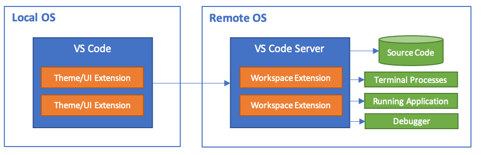

+++
title = "Overview"
date = 2024-01-12T22:36:24+08:00
weight = 1
type = "docs"
description = ""
isCJKLanguage = true
draft = false
+++

> 原文: [https://code.visualstudio.com/docs/remote/remote-overview](https://code.visualstudio.com/docs/remote/remote-overview)

# VS Code Remote Development VS Code 远程开发

**Visual Studio Code Remote Development** allows you to use a container, remote machine, or the [Windows Subsystem for Linux](https://learn.microsoft.com/windows/wsl) (WSL) as a full-featured development environment. You can:

​​	Visual Studio Code 远程开发允许您将容器、远程计算机或适用于 Linux 的 Windows 子系统 (WSL) 用作全功能开发环境。您可以：

- Develop on the **same operating system** you deploy to or use **larger or more specialized** hardware.
  在您部署到的相同操作系统上进行开发或使用更大或更专业的硬件。
- **Separate** your development environment to avoid impacting your local **machine configuration**.
  隔离您的开发环境，以避免影响您的本地计算机配置。
- Make it easy for new contributors to **get started** and keep everyone on a **consistent environment**.
  让新贡献者轻松入门，并让每个人都保持在一致的环境中。
- Use tools or runtimes **not available** on your local OS or manage **multiple versions** of them.
  使用本地操作系统上不可用的工具或运行时，或管理它们的多个版本。
- Develop your Linux-deployed applications using the **Windows Subsystem for Linux**.
  使用适用于 Linux 的 Windows 子系统开发您的 Linux 部署的应用程序。
- Access an **existing** development environment from **multiple machines or locations**.
  从多台计算机或位置访问现有开发环境。
- Debug an **application running somewhere else** such as a customer site or in the cloud.
  调试在其他位置（例如客户站点或云中）运行的应用程序。

**No source code** needs to be on your local machine to get these benefits. Each extension in the [Remote Development extension pack](https://aka.ms/vscode-remote/download/extension) can run commands and other extensions directly inside a container, in WSL, or on a remote machine so that everything feels like it does when you run locally.

​​	无需将源代码放在本地计算机上即可获得这些好处。远程开发扩展包中的每个扩展都可以在容器、WSL 或远程计算机中直接运行命令和其他扩展，因此一切感觉就像在本地运行时一样。

## [Getting started 入门](https://code.visualstudio.com/docs/remote/remote-overview#_getting-started)

### [Remote Development extension pack 远程开发扩展包](https://code.visualstudio.com/docs/remote/remote-overview#_remote-development-extension-pack)

The [Remote Development extension pack](https://aka.ms/vscode-remote/download/extension) includes four extensions. See the following articles to get started with each of them:

​​	远程开发扩展包包括四个扩展。请参阅以下文章，开始使用每个扩展：

- [Remote - SSH](https://code.visualstudio.com/docs/remote/ssh) - Connect to any location by opening folders on a remote machine/VM using SSH.
  Remote - SSH - 通过 SSH 在远程计算机/VM 上打开文件夹，连接到任何位置。
- [Dev Containers](https://code.visualstudio.com/docs/devcontainers/containers) - Work with a separate toolchain or container-based application inside (or mounted into) a container.
  开发容器 - 在容器内（或挂载到容器中）使用单独的工具链或基于容器的应用程序。
- [WSL](https://code.visualstudio.com/docs/remote/wsl) - Get a Linux-powered development experience in the Windows Subsystem for Linux.
  WSL - 在适用于 Linux 的 Windows 子系统中获取由 Linux 提供支持的开发体验。
- [Remote - Tunnels](https://code.visualstudio.com/docs/remote/tunnels) - Connect to a remote machine via a secure tunnel, without configuring SSH.
  Remote - Tunnels - 通过安全隧道连接到远程计算机，无需配置 SSH。

While most VS Code extensions should work unmodified in a remote environment, extension authors can learn more at [Supporting Remote Development](https://code.visualstudio.com/api/advanced-topics/remote-extensions).

​​	虽然大多数 VS Code 扩展应在远程环境中不经修改即可工作，但扩展作者可以在支持远程开发中了解更多信息。

## [Remote tutorials 远程教程](https://code.visualstudio.com/docs/remote/remote-overview#_remote-tutorials)

The tutorials below will walk you through running Visual Studio Code with the Remote Development extensions.

​​	以下教程将指导您使用远程开发扩展运行 Visual Studio Code。

| Tutorial 教程                                                | Description 说明                                             |
| :----------------------------------------------------------- | :----------------------------------------------------------- |
| [Remote via SSH 通过 SSH 远程](https://code.visualstudio.com/docs/remote/ssh-tutorial) | Connect to remote and virtual machines with Visual Studio Code via SSH. 通过 SSH 连接到远程和虚拟机，使用 Visual Studio Code。 |
| [Work in WSL 在 WSL 中工作](https://code.visualstudio.com/docs/remote/wsl-tutorial) | Run Visual Studio Code in Windows Subsystem for Linux. 在适用于 Linux 的 Windows 子系统中运行 Visual Studio Code。 |
| [Develop in Containers 在容器中开发](https://code.visualstudio.com/docs/devcontainers/tutorial) | Run Visual Studio Code in a Docker Container. 在 Docker 容器中运行 Visual Studio Code。 |
| [GitHub Codespaces](https://docs.github.com/github/developing-online-with-codespaces/using-codespaces-in-visual-studio-code) | Connect to a codespace with Visual Studio Code. 使用 Visual Studio Code 连接到代码空间。 |

## [GitHub Codespaces](https://code.visualstudio.com/docs/remote/remote-overview#_github-codespaces)

[GitHub Codespaces](https://code.visualstudio.com/docs/remote/codespaces) provides remote development environments that are managed for you. You can configure and create a development environment hosted in the cloud, which is spun up and available when you need it.

​​	GitHub Codespaces 提供了为您管理的远程开发环境。您可以在云中配置并创建托管的开发环境，该环境会在您需要时启动并可用。

## [Questions or feedback 问题或反馈](https://code.visualstudio.com/docs/remote/remote-overview#_questions-or-feedback)

- See [Tips and Tricks](https://code.visualstudio.com/docs/remote/troubleshooting) or the [FAQ](https://code.visualstudio.com/docs/remote/faq).
  请参阅提示和技巧或常见问题解答。
- Search on [Stack Overflow](https://stackoverflow.com/questions/tagged/vscode-remote).
  在 Stack Overflow 上搜索。
- Add a [feature request](https://aka.ms/vscode-remote/feature-requests) or [report a problem](https://aka.ms/vscode-remote/issues/new).
  添加功能请求或报告问题。
