+++
title = "SSH"
date = 2024-01-12T22:36:24+08:00
weight = 10
type = "docs"
description = ""
isCJKLanguage = true
draft = false
+++

> 原文: [https://code.visualstudio.com/docs/remote/ssh](https://code.visualstudio.com/docs/remote/ssh)

# Remote Development using SSH 使用 SSH 进行远程开发


The **Visual Studio Code Remote - SSH** extension allows you to open a remote folder on any remote machine, virtual machine, or container with a running SSH server and take full advantage of VS Code's feature set. Once connected to a server, you can interact with files and folders anywhere on the remote filesystem.

​​	Visual Studio Code Remote - SSH 扩展允许您在任何远程计算机、虚拟机或容器上打开远程文件夹，这些计算机、虚拟机或容器运行 SSH 服务器，并充分利用 VS Code 的功能集。连接到服务器后，您可以在远程文件系统上的任何位置与文件和文件夹进行交互。

No source code needs to be on your local machine to gain these benefits since the extension runs commands and other extensions directly on the remote machine.

​​	无需将源代码放在本地计算机上即可获得这些好处，因为该扩展直接在远程计算机上运行命令和其他扩展。


This lets VS Code provide a **local-quality development experience** - including full IntelliSense (completions), code navigation, and debugging - **regardless of where your code is hosted**.

​​	这样，VS Code 可以提供本地质量的开发体验 - 包括完整的 IntelliSense（完成）、代码导航和调试 - 无论您的代码托管在哪里。

## [Getting started 入门](https://code.visualstudio.com/docs/remote/ssh#_getting-started)

**Note**: After reviewing this topic, you can get started with the introductory [SSH tutorial](https://code.visualstudio.com/docs/remote/ssh-tutorial).

​​	注意：在阅读完本主题后，您可以开始使用 SSH 入门教程。

### [System requirements 系统要求](https://code.visualstudio.com/docs/remote/ssh#_system-requirements)

**Local:** A supported [OpenSSH compatible SSH client](https://code.visualstudio.com/docs/remote/troubleshooting#_installing-a-supported-ssh-client) must also be installed.

​​	本地：还必须安装受支持的 OpenSSH 兼容 SSH 客户端。

**Remote SSH host**: A running [SSH server](https://code.visualstudio.com/docs/remote/troubleshooting#_installing-a-supported-ssh-server) on:

​​	远程 SSH 主机：运行 SSH 服务器的：

- x86_64 Debian 8+, Ubuntu 16.04+, CentOS / RHEL 7+.
  x86_64 Debian 8+、Ubuntu 16.04+、CentOS / RHEL 7+。
- ARMv7l (AArch32) Raspberry Pi OS (previously called Raspbian) Stretch/9+ (32-bit).
  ARMv7l (AArch32) Raspberry Pi OS（以前称为 Raspbian）Stretch/9+（32 位）。
- ARMv8l (AArch64) Ubuntu 18.04+ (64-bit).
  ARMv8l (AArch64) Ubuntu 18.04+（64 位）。
- Windows 10 / Server 2016/2019 (1803+) using the [official OpenSSH Server](https://learn.microsoft.com/windows-server/administration/openssh/openssh_install_firstuse).
  使用官方 OpenSSH 服务器的 Windows 10/Server 2016/2019 (1803+)。
- macOS 10.14+ (Mojave) SSH hosts with [Remote Login enabled](https://support.apple.com/guide/mac-help/allow-a-remote-computer-to-access-your-mac-mchlp1066/mac).
  启用了远程登录的 macOS 10.14+ (Mojave) SSH 主机。
- 1 GB RAM is required for remote hosts, but at least 2 GB RAM and a 2-core CPU is recommended.
  远程主机需要 1 GB RAM，但建议至少使用 2 GB RAM 和 2 核 CPU。

Other `glibc` based Linux distributions for x86_64, ARMv7l (AArch32), and ARMv8l (AArch64) should work if they have the needed prerequisites. See the [Remote Development with Linux](https://code.visualstudio.com/docs/remote/linux) article for information prerequisites and tips for getting community supported distributions up and running.

​​	基于 `glibc` 的其他 Linux 发行版（适用于 x86_64、ARMv7l (AArch32) 和 ARMv8l (AArch64)）应该可以使用，前提是它们具有所需的前提条件。请参阅使用 Linux 进行远程开发一文，了解有关社区支持的发行版的先决条件和提示信息。

While ARMv7l (AArch32) and ARMv8l (AArch64) support is available, some extensions installed on these devices may not work due to the use of x86 native code in the extension.

​​	虽然支持 ARMv7l (AArch32) 和 ARMv8l (AArch64)，但由于扩展中使用了 x86 本机代码，因此在这些设备上安装的某些扩展可能无法使用。

### [Installation 安装](https://code.visualstudio.com/docs/remote/ssh#_installation)

To get started, you need to:

​​	要开始，您需要：

1. Install an [OpenSSH compatible SSH client](https://code.visualstudio.com/docs/remote/troubleshooting#_installing-a-supported-ssh-client) if one is not already present.

   ​​	安装 OpenSSH 兼容的 SSH 客户端（如果尚未安装）。

2. Install [Visual Studio Code](https://code.visualstudio.com/) or [Visual Studio Code Insiders](https://code.visualstudio.com/insiders/).

   ​​	安装 Visual Studio Code 或 Visual Studio Code Insiders。

3. Install the [Remote-SSH extension](https://marketplace.visualstudio.com/items?itemName=ms-vscode-remote.remote-ssh). If you plan to work with other remote extensions in VS Code, you may choose to install the [Remote Development extension pack](https://aka.ms/vscode-remote/download/extension).

   ​​	安装 Remote-SSH 扩展。如果您计划在 VS Code 中使用其他远程扩展，可以选择安装远程开发扩展包。

### [SSH host setup SSH 主机设置](https://code.visualstudio.com/docs/remote/ssh#_ssh-host-setup)

1. If you do not have an SSH host set up, follow the directions for [Linux](https://code.visualstudio.com/docs/remote/troubleshooting#_installing-a-supported-ssh-server), [Windows 10 / Server (1803+)](https://learn.microsoft.com/windows-server/administration/openssh/openssh_install_firstuse), or [macOS](https://support.apple.com/guide/mac-help/allow-a-remote-computer-to-access-your-mac-mchlp1066/mac) SSH host or create a [VM on Azure](https://learn.microsoft.com/azure/virtual-machines/linux/quick-create-portal).

   ​​	如果您尚未设置 SSH 主机，请按照 Linux、Windows 10/Server (1803+) 或 macOS SSH 主机的说明进行操作，或在 Azure 上创建 VM。

2. **Optional:** If your Linux or macOS SSH host will be accessed by multiple users at the same time, consider enabling **Remote.SSH: Remote Server Listen On Socket** in VS Code [User settings](https://code.visualstudio.com/docs/getstarted/settings) for improved security.

   ​​	可选：如果您的 Linux 或 macOS SSH 主机将同时供多个用户访问，请考虑在 VS Code 用户设置中启用 Remote.SSH: Remote Server Listen On Socket 以提高安全性。

   In the Settings editor:

   ​​	在“设置”编辑器中：

   

   See the [Tips and Tricks](https://code.visualstudio.com/docs/remote/troubleshooting#_improving-security-on-multi-user-servers) article for details.

   ​​	有关详细信息，请参阅提示和技巧文章。

3. **Optional:** While password-based authentication is supported, we recommend setting up **key based authentication** for your host. See the [Tips and Tricks](https://code.visualstudio.com/docs/remote/troubleshooting#_configuring-key-based-authentication) article for details.

   ​​	可选：虽然支持基于密码的身份验证，但我们建议为您的主机设置基于密钥的身份验证。有关详细信息，请参阅提示和技巧文章。

### [Connect to a remote host 连接到远程主机](https://code.visualstudio.com/docs/remote/ssh#_connect-to-a-remote-host)

To connect to a remote host for the first time, follow these steps:

​​	要首次连接到远程主机，请按照以下步骤操作：

1. Verify you can connect to the SSH host by running the following command from a terminal / PowerShell window replacing `user@hostname` as appropriate.

   ​​	通过从终端/PowerShell 窗口运行以下命令来验证您是否可以连接到 SSH 主机，并根据需要替换 `user@hostname` 。

   ```
   ssh user@hostname
   # Or for Windows when using a domain / AAD account
   ssh user@domain@hostname
   ```

2. In VS Code, select **Remote-SSH: Connect to Host...** from the Command Palette (F1, Ctrl+Shift+P) and use the same `user@hostname` as in step 1.

   ​​	在 VS Code 中，从命令面板 (F1、Ctrl+Shift+P) 中选择“远程-SSH：连接到主机...”并使用与步骤 1 中相同的 `user@hostname` 。

   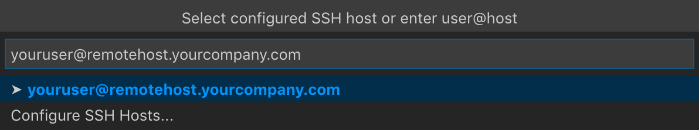

3. If VS Code cannot automatically detect the type of server you are connecting to, you will be asked to select the type manually.

   ​​	如果 VS Code 无法自动检测您要连接到的服务器类型，系统将要求您手动选择类型。

   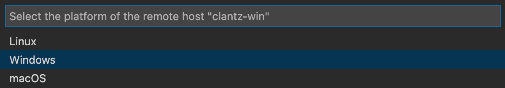

   Once you select a platform, it will be stored in [VS Code settings](https://code.visualstudio.com/docs/getstarted/settings) under the `remote.SSH.remotePlatform` property so you can change it at any time.

   ​​	一旦您选择了一个平台，它将存储在 VS Code 设置中的 `remote.SSH.remotePlatform` 属性下，以便您可以随时更改它。

4. After a moment, VS Code will connect to the SSH server and set itself up. VS Code will keep you up-to-date using a progress notification and you can see a detailed log in the `Remote - SSH` output channel.

   ​​	片刻之后，VS Code 将连接到 SSH 服务器并进行设置。VS Code 将使用进度通知让您保持最新状态，您可以在 `Remote - SSH` 输出通道中查看详细日志。

   > **Tip:** Connection hanging or failing? See [troubleshooting tips](https://code.visualstudio.com/docs/remote/troubleshooting#_troubleshooting-hanging-or-failing-connections) for information on resolving common problems.
   >
   > ​​	提示：连接挂起或失败？请参阅故障排除提示，了解有关解决常见问题的的信息。
   >
   > If you see errors about SSH file permissions, see the section on [Fixing SSH file permission errors](https://code.visualstudio.com/docs/remote/troubleshooting#_fixing-ssh-file-permission-errors).
   >
   > ​​	如果您看到有关 SSH 文件权限的错误，请参阅修复 SSH 文件权限错误的部分。

5. After you are connected, you'll be in an empty window. You can always refer to the Status bar to see which host you are connected to.

   ​​	连接后，您将进入一个空窗口。您始终可以参考状态栏以查看您连接到的主机。

   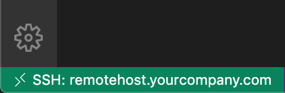

   Clicking on the Status bar item will provide a list of remote commands while you are connected.

   ​​	在连接时，单击状态栏项目将提供远程命令列表。

6. You can then open any folder or workspace on the remote machine using **File > Open...** or **File > Open Workspace...** just as you would locally!

   ​​	然后，您可以使用“文件”>“打开...”或“文件”>“打开工作区...”在远程计算机上打开任何文件夹或工作区，就像您在本地一样！

   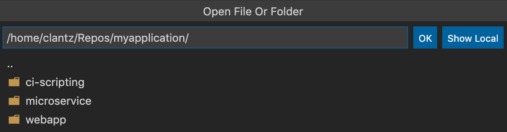

From here, [install any extensions](https://code.visualstudio.com/docs/remote/ssh#_managing-extensions) you want to use when connected to the host and start editing!

​​	在此处，安装您在连接到主机时想要使用的任何扩展，然后开始编辑！

> **Note:** On ARMv7l / ARMv8l `glibc` SSH hosts, some extensions may not work due to x86 compiled native code inside the extension.
>
> ​​	注意：在 ARMv7l/ARMv8l `glibc` SSH 主机上，某些扩展可能无法工作，因为扩展内部是 x86 编译的本机代码。

### [Open a folder on a remote SSH host in a container 在容器中打开远程 SSH 主机上的文件夹](https://code.visualstudio.com/docs/remote/ssh#_open-a-folder-on-a-remote-ssh-host-in-a-container)

If you are using a Linux or macOS SSH host, you can use the Remote - SSH and [Dev Containers](https://code.visualstudio.com/docs/devcontainers/containers) extensions together to open a folder on your remote host inside of a container. You do not even need to have a Docker client installed locally.

​​	如果您使用的是 Linux 或 macOS SSH 主机，您可以将 Remote - SSH 和 Dev Containers 扩展一起使用，以便在容器内打开远程主机上的文件夹。您甚至无需在本地安装 Docker 客户端。

To do so:

​​	要执行此操作，请执行以下操作：

1. Follow the [installation](https://code.visualstudio.com/docs/devcontainers/containers#_installation) steps for installing Docker on your remote host and VS Code and the Dev Containers extension locally.
   按照安装步骤在远程主机和 VS Code 上安装 Docker，并在本地安装 Dev Containers 扩展。
2. **Optional:** Set up SSH [key based authentication](https://code.visualstudio.com/docs/remote/troubleshooting#_configuring-key-based-authentication) to the server so you do not need to enter your password multiple times.
   可选：设置基于 SSH 密钥的身份验证到服务器，以便您无需多次输入密码。
3. Follow the [quick start](https://code.visualstudio.com/docs/remote/ssh#_connect-to-a-remote-host) for the Remote - SSH extension to connect to a host and open a folder there.
   按照 Remote - SSH 扩展的快速入门指南连接到主机并在其中打开文件夹。
4. Use the **Dev Containers: Reopen in Container** command from the Command Palette (F1, Ctrl+Shift+P).
   从命令面板（F1、Ctrl+Shift+P）中使用 Dev Containers：在容器中重新打开命令。

The rest of the [Dev Containers quick start](https://code.visualstudio.com/docs/devcontainers/containers#_quick-start-open-an-existing-folder-in-a-container) applies as-is. You can learn more about the [Dev Containers extension in its documentation](https://code.visualstudio.com/docs/devcontainers/containers). You can also see the [Develop on a remote Docker host](https://code.visualstudio.com/remote/advancedcontainers/develop-remote-host) article for other options if this model does not meet your needs.

​​	Dev Containers 快速入门指南的其余部分照常适用。您可以在其文档中了解有关 Dev Containers 扩展的更多信息。如果您不满足此模型的需求，您还可以参阅在远程 Docker 主机上进行开发一文，了解其他选项。

### [Disconnect from a remote host 断开与远程主机的连接](https://code.visualstudio.com/docs/remote/ssh#_disconnect-from-a-remote-host)

To close the connection when you finish editing files on the remote host, choose **File > Close Remote Connection** to disconnect from the host. The default configuration does not include a keyboard shortcut for this command. You can also simply exit VS Code to close the remote connection.

​​	要关闭连接，请在您编辑远程主机上的文件后，选择文件 > 关闭远程连接以断开与主机的连接。默认配置不包含此命令的键盘快捷键。您也可以简单地退出 VS Code 来关闭远程连接。

### [Remember hosts and advanced settings 记住主机和高级设置](https://code.visualstudio.com/docs/remote/ssh#_remember-hosts-and-advanced-settings)

If you have a set of hosts you use frequently or you need to connect to a host using some additional options, you can add them to a local file that follows the [SSH config file format](https://man7.org/linux/man-pages/man5/ssh_config.5.html).

​​	如果您有一组经常使用的主机，或者您需要使用一些其他选项连接到主机，则可以将它们添加到遵循 SSH 配置文件格式的本地文件中。

To make setup easy, the extension can guide you through adding a host without having to hand edit this file.

​​	为了简化设置，该扩展可以指导您添加主机，而无需手动编辑此文件。

Start by selecting **Remote-SSH: Add New SSH Host...** from the Command Palette (F1, Ctrl+Shift+P) or clicking on the **Add New** icon in the SSH **Remote Explorer** in the Activity Bar.

​​	首先，从命令面板（F1、Ctrl+Shift+P）中选择远程 SSH：添加新的 SSH 主机...，或单击活动栏中的 SSH 远程资源管理器中的添加新图标。

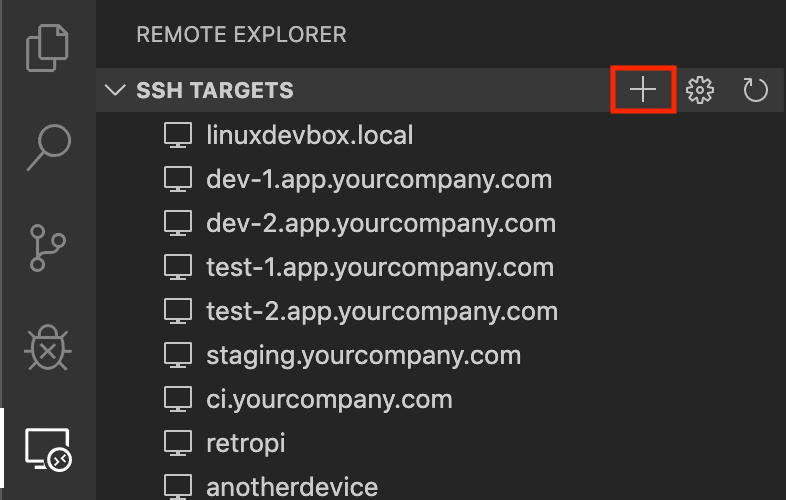

You'll then be asked to enter the SSH connection information. You can either enter a host name:

​​	然后，系统会要求您输入 SSH 连接信息。您可以输入主机名：

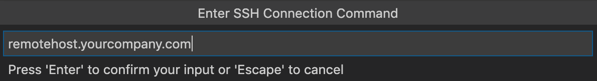

Or the full `ssh` command you would use to connect to the host from the command line:

​​	或从命令行连接到主机的完整 `ssh` 命令：

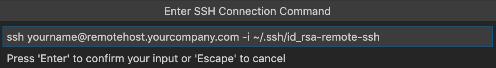

Finally, you'll be asked to pick a config file to use. You can also set the `"remote.SSH.configFile"` property in your User `settings.json` file if you want to use a different config file than those listed. The extension takes care of the rest!

​​	最后，系统会要求您选择要使用的配置文件。如果您想使用除列出的配置文件之外的其他配置文件，您还可以在用户 `settings.json` 文件中设置 `"remote.SSH.configFile"` 属性。扩展会处理其余部分！

For example, entering `ssh -i ~/.ssh/id_rsa-remote-ssh yourname@remotehost.yourcompany.com` in the input box would generate this entry:

​​	例如，在输入框中输入 `ssh -i ~/.ssh/id_rsa-remote-ssh yourname@remotehost.yourcompany.com` 会生成此条目：

```
Host remotehost.yourcompany.com
    User yourname
    HostName another-host-fqdn-or-ip-goes-here
    IdentityFile ~/.ssh/id_rsa-remote-ssh
```

See [Tips and Tricks](https://code.visualstudio.com/docs/remote/troubleshooting#_improving-your-security-with-a-dedicated-key) for details on generating the key shown here. You can manually edit this file with anything the [SSH config file format](https://man7.org/linux/man-pages/man5/ssh_config.5.html) supports, so this is just one example.

​​	有关在此处显示密钥的生成详细信息，请参阅提示和技巧。您可以使用 SSH 配置文件格式支持的任何内容手动编辑此文件，因此这只是一个示例。

From this point forward, the host will appear in the list of hosts when you select **Remote-SSH: Connect to Host...** from the Command Palette (F1, Ctrl+Shift+P) or in the **SSH Targets** section of the **Remote Explorer**.

​​	从现在开始，当您从命令面板（F1、Ctrl+Shift+P）或远程资源管理器的 SSH 目标部分中选择远程 SSH：连接到主机... 时，主机将显示在主机列表中。

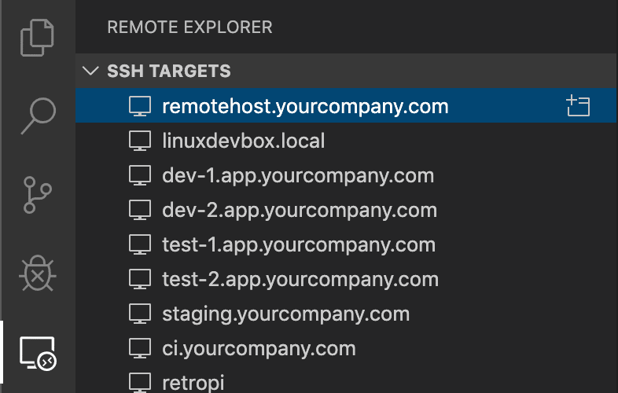

The **Remote Explorer** allows you to both open a new empty window on the remote host or directly open a folder you previously opened. Expand the host and click on the **Open Folder** icon next to the folder you want to open on the host.

​​	远程资源管理器允许您在远程主机上打开一个新的空窗口，或直接打开您之前打开的文件夹。展开主机并单击您想要在主机上打开的文件夹旁边的打开文件夹图标。

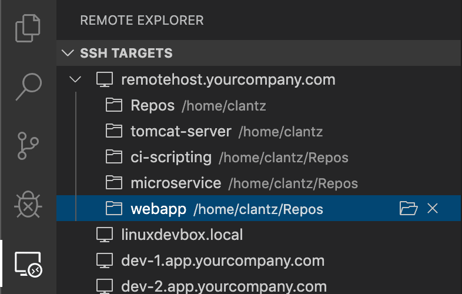

## [Managing extensions 管理扩展](https://code.visualstudio.com/docs/remote/ssh#_managing-extensions)

VS Code runs extensions in one of two places: locally on the UI / client side, or remotely on the SSH host. While extensions that affect the VS Code UI, like themes and snippets, are installed locally, most extensions will reside on the SSH host. This ensures you have smooth experience and allows you to install any needed extensions for a given workspace on an SSH host from your local machine. This way, you can pick up exactly where you left off, from a different machine complete with your extensions.

​​	VS Code 在两个位置之一运行扩展：本地 UI/客户端或 SSH 主机上的远程位置。虽然影响 VS Code UI 的扩展（如主题和代码段）是本地安装的，但大多数扩展将驻留在 SSH 主机上。这确保您拥有流畅的体验，并允许您从本地计算机为 SSH 主机上给定的工作空间安装任何所需的扩展。这样，您可以从另一台装有扩展的计算机继续上次中断的位置。

If you install an extension from the Extensions view, it will automatically be installed in the correct location. Once installed, you can tell where an extension is installed based on the category grouping.

​​	如果您从“扩展”视图安装扩展，它将自动安装在正确的位置。安装后，您可以根据类别分组来判断扩展安装在何处。

There will be a category for your remote SSH host:

​​	您的远程 SSH 主机将有一个类别：

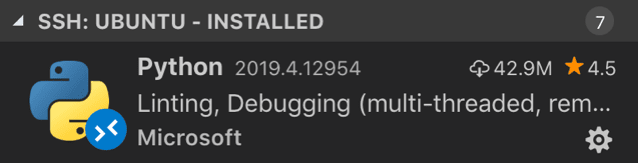

And also a **Local - Installed** category:

​​	还会有一个“本地 - 已安装”类别：

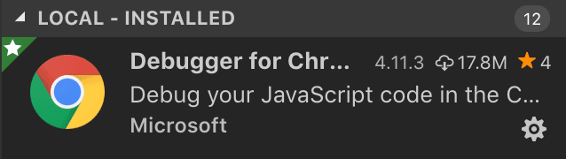

> **Note:** If you are an extension author and find that your extension is not working properly or installs in the wrong place, see [Supporting Remote Development](https://code.visualstudio.com/api/advanced-topics/remote-extensions) for details.
>
> ​​	注意：如果您是扩展作者，发现您的扩展无法正常工作或安装在错误的位置，请参阅支持远程开发以了解详细信息。

Local extensions that actually need to run remotely will appear dimmed and disabled in the **Local - Installed** category. Select **Install** to install an extension on your remote host.

​​	实际上需要远程运行的本地扩展将在“本地 - 已安装”类别中显示为灰显和禁用状态。选择“安装”以在您的远程主机上安装扩展。


You can also install all locally installed extensions on the SSH host by going to the Extensions view and selecting **Install Local Extensions in SSH: {Hostname}** using the cloud button at the right of the **Local - Installed** title bar. This will display a dropdown where you can select which locally installed extensions to install on your SSH host.

​​	您还可以通过转到扩展视图并使用本地 - 已安装标题栏右侧的云按钮选择在 SSH 中安装本地扩展：{主机名} 来安装 SSH 主机上所有本地安装的扩展。这将显示一个下拉菜单，您可以在其中选择要在 SSH 主机上安装的本地安装扩展。

### ["Always installed" extensions “始终安装”扩展](https://code.visualstudio.com/docs/remote/ssh#_always-installed-extensions)

If there are extensions that you would like to always have installed on any SSH host, you can specify which ones using the `remote.SSH.defaultExtensions` property in `settings.json`. For example, if you wanted to install the [GitLens](https://marketplace.visualstudio.com/items?itemName=eamodio.gitlens) and [Resource Monitor](https://marketplace.visualstudio.com/items?itemName=mutantdino.resourcemonitor) extensions, specify their extension IDs as follows:

​​	如果您希望始终在任何 SSH 主机上安装扩展，可以使用 `remote.SSH.defaultExtensions` 中的 `settings.json` 属性指定要安装的扩展。例如，如果您想安装 GitLens 和资源监视器扩展，请按如下方式指定其扩展 ID：

```
"remote.SSH.defaultExtensions": [
    "eamodio.gitlens",
    "mutantdino.resourcemonitor"
]
```

### [Advanced: Forcing an extension to run locally / remotely 高级：强制扩展在本地/远程运行](https://code.visualstudio.com/docs/remote/ssh#_advanced-forcing-an-extension-to-run-locally-remotely)

Extensions are typically designed and tested to either run locally or remotely, not both. However, if an extension supports it, you can force it to run in a particular location in your `settings.json` file.

​​	扩展通常被设计和测试为在本地或远程运行，而不是两者兼而有之。但是，如果扩展支持，您可以在 `settings.json` 文件中强制它在特定位置运行。

For example, the setting below will force the [Docker](https://marketplace.visualstudio.com/items?itemName=ms-azuretools.vscode-docker) extension to run locally and [Remote - SSH: Editing Configuration Files](https://marketplace.visualstudio.com/items?itemName=ms-vscode-remote.remote-ssh-edit) extension to run remotely instead of their defaults:

​​	例如，以下设置将强制 Docker 扩展在本地运行，而远程 - SSH：编辑配置文件扩展在远程运行，而不是其默认设置：

```
"remote.extensionKind": {
    "ms-azuretools.vscode-docker": [ "ui" ],
    "ms-vscode-remote.remote-ssh-edit": [ "workspace" ]
}
```

A value of `"ui"` instead of `"workspace"` will force the extension to run on the local UI/client side instead. Typically, this should only be used for testing unless otherwise noted in the extension's documentation since it **can break extensions**. See the article on [Supporting Remote Development](https://code.visualstudio.com/api/advanced-topics/remote-extensions) for details.

​​	使用 `"ui"` 值而不是 `"workspace"` 值将强制扩展在本地 UI/客户端上运行。通常，除非扩展的文档中另有说明，否则仅应将其用于测试，因为它可能会破坏扩展。有关详细信息，请参阅支持远程开发的文章。

## [Forwarding a port / creating SSH tunnel 转发端口/创建 SSH 隧道](https://code.visualstudio.com/docs/remote/ssh#_forwarding-a-port-creating-ssh-tunnel)

Sometimes when developing, you may need to access a port on a remote machine that is not publicly exposed. There are two ways to do this using an [SSH tunnel](https://www.ssh.com/ssh/tunneling/example) that "forwards" the desired remote port to your local machine.

​​	有时在开发时，您可能需要访问未公开的远程计算机上的端口。可以使用将所需远程端口“转发”到本地计算机的 SSH 隧道来完成此操作，方法有两种。

### [Temporarily forwarding a port 临时转发端口](https://code.visualstudio.com/docs/remote/ssh#_temporarily-forwarding-a-port)

Once you are connected to a host, if you want to **temporarily forward** a new port for the duration of the session, select **Forward a Port** from the Command Palette (F1, Ctrl+Shift+P) or select the **Add Port** button in the **Ports view**. You can see the Ports view in the bottom panel, or by running the command **Ports: Focus on Ports View**.

​​	连接到主机后，如果您想在会话期间临时转发新端口，请从命令面板 (F1、Ctrl+Shift+P) 中选择“转发端口”，或在“端口”视图中选择“添加端口”按钮。您可以在底部面板中看到“端口”视图，或通过运行命令“端口：聚焦于端口视图”。

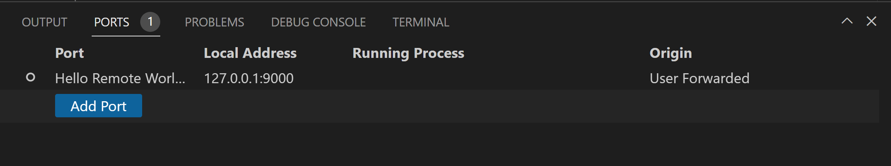

You'll be asked to enter the port you would like to forward and you can give it a name.

​​	系统会要求您输入要转发的端口，您可以为其指定一个名称。

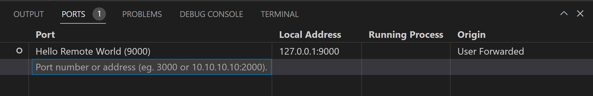

A notification will tell you the localhost port you should use to access the remote port. For example, if you forwarded an HTTP server listening on port 3000, the notification may tell you that it was mapped to port 4123 on localhost since 3000 was already in use. You can then connect to this remote HTTP server using `http://localhost:4123`.

​​	一条通知会告诉您应该使用哪个本地主机端口来访问远程端口。例如，如果您转发了一个侦听端口 3000 的 HTTP 服务器，则通知可能会告诉您它已映射到本地主机上的端口 4123，因为 3000 已在使用中。然后，您可以使用 `http://localhost:4123` 连接到此远程 HTTP 服务器。

This same information is available in the **Forwarded Ports** section of the Remote Explorer if you need to access it later.

​​	如果您以后需要访问此信息，则可以在“远程资源管理器”的“已转发端口”部分中找到相同的信息。

If you would like VS Code to remember any ports you have forwarded, check **Remote: Restore Forwarded Ports** in the Settings editor (Ctrl+,) or set `"remote.restoreForwardedPorts": true` in `settings.json`.

​​	如果您希望 VS Code 记住所转发的任何端口，请在“设置”编辑器中选中“远程：还原已转发的端口”（Ctrl+,）或在 `settings.json` 中设置 `"remote.restoreForwardedPorts": true` 。

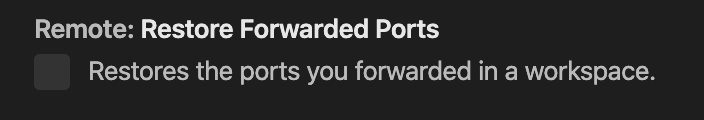

#### [Change local port on tunnel 更改隧道上的本地端口](https://code.visualstudio.com/docs/remote/ssh#_change-local-port-on-tunnel)

If you would like the local port of the tunnel to be different than the remote server's, you can change this via the **Forwarded Ports** panel.

​​	如果您希望隧道的本地端口与远程服务器的本地端口不同，则可以通过“已转发端口”面板进行更改。

Right-click the tunnel you want to modify, and select **Change Local Address Port** in the context menu.

​​	右键单击要修改的隧道，然后在上下文菜单中选择“更改本地地址端口”。

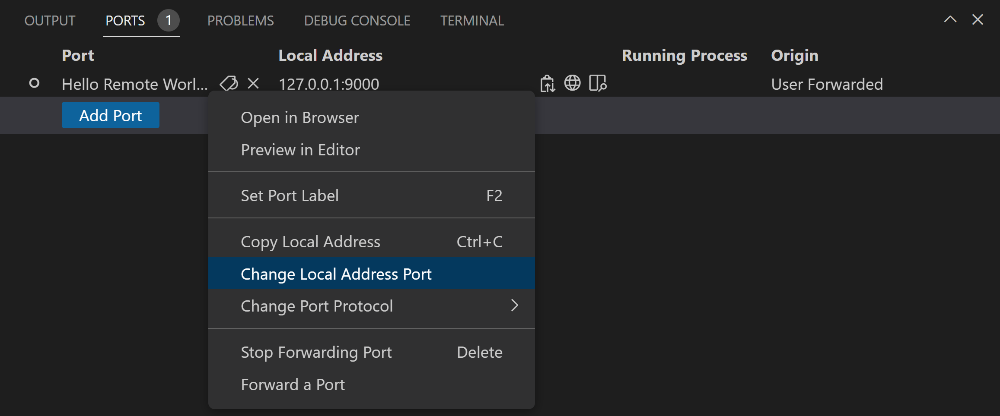

### [Always forwarding a port 始终转发端口](https://code.visualstudio.com/docs/remote/ssh#_always-forwarding-a-port)

If you have ports that you **always want to forward**, you can use the `LocalForward` directive in the same SSH config file you use to [remember hosts and advanced settings](https://code.visualstudio.com/docs/remote/ssh#_remember-hosts-and-advanced-settings).

​​	如果您始终希望转发端口，则可以在您用来记住主机和高级设置的 SSH 配置文件中使用 `LocalForward` 指令。

For example, if you wanted to forward ports 3000 and 27017, you could update the file as follows:

​​	例如，如果您想转发端口 3000 和 27017，则可以按如下方式更新文件：

```
Host remote-linux-machine
    User myuser
    HostName remote-linux-machine.mydomain
    LocalForward 127.0.0.1:3000 127.0.0.1:3000
    LocalForward 127.0.0.1:27017 127.0.0.1:27017
```

## [Opening a terminal on a remote host 在远程主机上打开终端](https://code.visualstudio.com/docs/remote/ssh#_opening-a-terminal-on-a-remote-host)

Opening a terminal on the remote host from VS Code is simple. Once connected, **any terminal window** you open in VS Code (**Terminal > New Terminal**) will automatically run on the remote host rather than locally.

​​	从 VS Code 打开远程主机上的终端很简单。连接后，您在 VS Code 中打开的任何终端窗口（终端 > 新建终端）都将自动在远程主机上运行，而不是在本地运行。

You can also use the `code` command line from this same terminal window to perform a number of operations such as opening a new file or folder on the remote host. Type `code --help` to see all the options available from the command line.

​​	您还可以从同一个终端窗口使用 `code` 命令行执行许多操作，例如在远程主机上打开新文件或文件夹。键入 `code --help` 以查看命令行中提供的所有选项。


## [Debugging on the SSH host 在 SSH 主机上调试](https://code.visualstudio.com/docs/remote/ssh#_debugging-on-the-ssh-host)

Once you are connected to a remote host, you can use VS Code's debugger in the same way you would when running the application locally. For example, if you select a launch configuration in `launch.json` and start debugging (F5), the application will start on remote host and attach the debugger to it.

​​	连接到远程主机后，您可以像在本地运行应用程序时一样使用 VS Code 的调试器。例如，如果您在 `launch.json` 中选择启动配置并开始调试 (F5)，应用程序将在远程主机上启动并将调试器附加到它。

See the [debugging](https://code.visualstudio.com/docs/editor/debugging) documentation for details on configuring VS Code's debugging features in `.vscode/launch.json`.

​​	有关在 `.vscode/launch.json` 中配置 VS Code 的调试功能的详细信息，请参阅调试文档。

## [SSH host-specific settings SSH 主机特定设置](https://code.visualstudio.com/docs/remote/ssh#_ssh-hostspecific-settings)

VS Code's local User settings are also reused when you are connected to an SSH host. While this keeps your user experience consistent, you may want to vary some of these settings between your local machine and each host. Fortunately, once you have connected to a host, you can also set host-specific settings by running the **Preferences: Open Remote Settings** command from the Command Palette (F1, Ctrl+Shift+P) or by selecting on the **Remote** tab in the Settings editor. These will override any User settings you have in place whenever you connect to the host. And Workspace settings will override Remote and User settings.

​​	连接到 SSH 主机时，VS Code 的本地用户设置也会被重新使用。虽然这保持了用户体验的一致性，但你可能希望在本地计算机和每个主机之间改变其中一些设置。幸运的是，一旦你连接到主机，你也可以通过运行命令面板（F1、Ctrl+Shift+P）中的首选项：打开远程设置命令或在设置编辑器中的远程选项卡上进行选择来设置特定于主机的设置。无论何时连接到主机，这些设置都会覆盖你设置的任何用户设置。工作区设置将覆盖远程和用户设置。

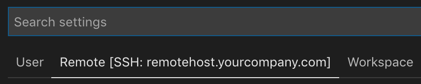

## [Working with local tools 使用本地工具](https://code.visualstudio.com/docs/remote/ssh#_working-with-local-tools)

The Remote - SSH extension does not provide direct support for sync'ing source code or using local tools with content on a remote host. However, there are two ways to do this using common tools that will work with most Linux hosts. Specifically, you can:

​​	Remote - SSH 扩展不提供直接支持来同步源代码或使用本地工具处理远程主机上的内容。但是，有两种方法可以使用适用于大多数 Linux 主机的一般工具来执行此操作。具体来说，你可以：

1. [Mount the remote filesystem using SSHFS](https://code.visualstudio.com/docs/remote/troubleshooting#_using-sshfs-to-access-files-on-your-remote-host).
   使用 SSHFS 挂载远程文件系统。
2. [Sync files to/from the remote host to your local machine using `rsync`](https://code.visualstudio.com/docs/remote/troubleshooting#_using-rsync-to-maintain-a-local-copy-of-your-source-code).
   使用 `rsync` 将文件从远程主机同步到本地计算机或从本地计算机同步到远程主机。

SSHFS is the most convenient option and does not require any file sync'ing. However, performance will be significantly slower than working through VS Code, so it is best used for single file edits and uploading/downloading content. If you need to use an application that bulk reads/write to many files at once (like a local source control tool), rsync is a better choice.

​​	SSHFS 是最方便的选择，不需要任何文件同步。但是，性能将比通过 VS Code 工作慢得多，因此最适合用于编辑单个文件和上传/下载内容。如果您需要使用一次批量读/写多个文件的应用程序（例如本地源代码管理工具），rsync 是更好的选择。

## [Known limitations 已知限制](https://code.visualstudio.com/docs/remote/ssh#_known-limitations)

### [Remote - SSH limitations 远程 - SSH 限制](https://code.visualstudio.com/docs/remote/ssh#_remote-ssh-limitations)

- Using key based authentication is recommended. Passwords and other tokens entered for [alternate authentication methods](https://code.visualstudio.com/docs/remote/troubleshooting#_enabling-alternate-ssh-authentication-methods) are not saved.
  建议使用基于密钥的身份验证。不会保存为备用身份验证方法输入的密码和其他令牌。
- Alpine Linux and non-glibc based Linux SSH hosts are not supported.
  不支持 Alpine Linux 和基于非 glibc 的 Linux SSH 主机。
- Older (community supported) Linux distributions require workarounds to install the [needed prerequisites](https://code.visualstudio.com/docs/remote/linux).
  较旧的（社区支持的）Linux 发行版需要解决方法才能安装所需的先决条件。
- PuTTY is not supported on Windows.
  Windows 上不支持 PuTTY。
- If you clone a Git repository using SSH and your SSH key has a passphrase, VS Code's pull and sync features may hang when running remotely. Either use an SSH key without a passphrase, clone using HTTPS, or run `git push` from the command line to work around the issue.
  如果您使用 SSH 克隆 Git 存储库，并且您的 SSH 密钥有密码，则在远程运行时 VS Code 的拉取和同步功能可能会挂起。使用没有密码的 SSH 密钥，使用 HTTPS 克隆，或从命令行运行 `git push` 来解决此问题。
- Local proxy settings are not reused on the remote host, which can prevent extensions from working unless the appropriate proxy information is configured on the remote host (for example global `HTTP_PROXY` or `HTTPS_PROXY` environment variables with the appropriate proxy information).
  本地代理设置不会在远程主机上重复使用，这可能会阻止扩展程序工作，除非在远程主机上配置了适当的代理信息（例如带有适当代理信息的全局 `HTTP_PROXY` 或 `HTTPS_PROXY` 环境变量）。
- See [here for a list of active issues](https://aka.ms/vscode-remote/ssh/issues) related to SSH.
  在此处查看与 SSH 相关的活动问题列表。

### [Docker Extension limitations Docker 扩展限制](https://code.visualstudio.com/docs/remote/ssh#_docker-extension-limitations)

If you are using the Docker or Kubernetes extension in a Remote - SSH window, you will not be able to use the right-click **Attach VS Code to Container** option. This will only work if you are using it from your local machine.

​​	如果您在远程 - SSH 窗口中使用 Docker 或 Kubernetes 扩展，您将无法使用右键单击将 VS Code 附加到容器选项。只有在您从本地计算机使用它时，此选项才有效。

### [Extension limitations 扩展限制](https://code.visualstudio.com/docs/remote/ssh#_extension-limitations)

Many extensions will work on remote SSH hosts without modification. However, in some cases, certain features may require changes. If you run into an extension issue, there is [a summary of common problems and solutions](https://code.visualstudio.com/docs/remote/troubleshooting#_extension-tips) that you can mention to the extension author when reporting the issue.

​​	许多扩展程序将在远程 SSH 主机上工作，无需修改。但是，在某些情况下，某些功能可能需要更改。如果您遇到扩展问题，则有一份常见问题和解决方案的摘要，您可以在报告问题时向扩展作者提及。

In addition, some extensions installed on ARMv7l (AArch32) / ARMv8l (AArch64) devices may not work due to native modules or runtimes in the extension that only support x86_64. In these cases, the extensions would need to opt-in to supporting these platforms by compiling / including binaries for ARMv7l / ARMv8l.

​​	此外，由于扩展中仅支持 x86_64 的本机模块或运行时，因此在 ARMv7l (AArch32)/ARMv8l (AArch64) 设备上安装的某些扩展可能无法正常工作。在这些情况下，扩展需要选择支持这些平台，方法是编译/包含适用于 ARMv7l/ARMv8l 的二进制文件。

## [Common questions 常见问题](https://code.visualstudio.com/docs/remote/ssh#_common-questions)

### [How do I set up an SSH client on ...? 如何在 ... 上设置 SSH 客户端？](https://code.visualstudio.com/docs/remote/ssh#_how-do-i-set-up-an-ssh-client-on-)

See [Installing a supported SSH client](https://code.visualstudio.com/docs/remote/troubleshooting#_installing-a-supported-ssh-client) for details.

​​	有关详细信息，请参阅安装受支持的 SSH 客户端。

### [How do I set up an SSH server on ...? 如何在 ... 上设置 SSH 服务器？](https://code.visualstudio.com/docs/remote/ssh#_how-do-i-set-up-an-ssh-server-on-)

See [Installing a supported SSH server](https://code.visualstudio.com/docs/remote/troubleshooting#_installing-a-supported-ssh-server) for details on setting up an SSH server for your host.

​​	有关为您的主机设置 SSH 服务器的详细信息，请参阅安装受支持的 SSH 服务器。

### [Can I sign in to my SSH server with another/additional authentication mechanism like a password? 我能否使用其他/其他身份验证机制（如密码）登录我的 SSH 服务器？](https://code.visualstudio.com/docs/remote/ssh#_can-i-sign-in-to-my-ssh-server-with-anotheradditional-authentication-mechanism-like-a-password)

Yes, you should be prompted to enter your token or password automatically. However, passwords are not saved, so using [key based authentication](https://code.visualstudio.com/docs/remote/troubleshooting#_configuring-key-based-authentication) is typically more convenient.

​​	可以，系统会提示您自动输入令牌或密码。但是，密码不会保存，因此通常使用基于密钥的身份验证会更方便。

### [How do I fix SSH errors about "bad permissions"? 如何修复有关“权限错误”的 SSH 错误？](https://code.visualstudio.com/docs/remote/ssh#_how-do-i-fix-ssh-errors-about-bad-permissions)

See [Fixing SSH file permission errors](https://code.visualstudio.com/docs/remote/troubleshooting#_fixing-ssh-file-permission-errors) for details on resolving these types of errors.

​​	有关解决这些类型错误的详细信息，请参阅修复 SSH 文件权限错误。

### [What Linux packages / libraries need to be installed on remote SSH hosts? 需要在远程 SSH 主机上安装哪些 Linux 软件包/库？](https://code.visualstudio.com/docs/remote/ssh#_what-linux-packages-libraries-need-to-be-installed-on-remote-ssh-hosts)

Most Linux distributions will not require additional dependency installation steps. For SSH, Linux hosts need to have Bash (`/bin/bash`), `tar`, and either `curl` or `wget` installed and those utilities could be missing from certain stripped down distributions. Remote Development also requires kernel >= 3.10, glibc >=2.17, libstdc++ >= 3.4.18. Only glibc-based distributions are supported currently, so by extension [Alpine Linux](https://alpinelinux.org/) is not supported.

​​	大多数 Linux 发行版不需要额外的依赖项安装步骤。对于 SSH，Linux 主机需要安装 Bash ( `/bin/bash` )、 `tar` 以及 `curl` 或 `wget` ，某些精简版发行版中可能缺少这些实用程序。远程开发还需要内核 >= 3.10、glibc >=2.17、libstdc++ >= 3.4.18。目前仅支持基于 glibc 的发行版，因此扩展 Alpine Linux 不受支持。

See [Linux Prerequisites](https://code.visualstudio.com/docs/remote/linux) for details.

​​	有关详细信息，请参阅 Linux 先决条件。

### [What are the connectivity requirements for the VS Code Server when it is running on a remote machine / VM? VS Code Server 在远程计算机/VM 上运行时，对连接有什么要求？](https://code.visualstudio.com/docs/remote/ssh#_what-are-the-connectivity-requirements-for-the-vs-code-server-when-it-is-running-on-a-remote-machine-vm)

Installation of VS Code Server requires that your local machine has outbound HTTPS (port 443) connectivity to:

​​	安装 VS Code Server 要求本地计算机具有到以下位置的出站 HTTPS（端口 443）连接：

- `update.code.visualstudio.com`
- `vscode.blob.core.windows.net`
- `*.vo.msecnd.net` (Azure CDN)
  `*.vo.msecnd.net` （Azure CDN）

By default, the Remote - SSH will attempt to download on the remote host, but if you enable `remote.SSH.allowLocalServerDownload`, the extension will fall back to downloading VS Code Server locally and transferring it remotely once a connection is established.

​​	默认情况下，远程 - SSH 将尝试在远程主机上下载，但如果您启用 `remote.SSH.allowLocalServerDownload` ，扩展将回退到在本地下载 VS Code Server，并在建立连接后将其远程传输。

You can install extensions manually without an internet connection using the **Extensions: Install from VSIX...** command, but if you use the extension panel to install extensions, your local machine and VS Code Server server will need outbound HTTPS (port 443) access to:

​​	您可以使用“扩展：从 VSIX 安装...”命令在没有互联网连接的情况下手动安装扩展，但如果您使用扩展面板安装扩展，您的本地计算机和 VS Code Server 服务器将需要出站 HTTPS（端口 443）访问权限：

- `marketplace.visualstudio.com`
- `*.vo.msecnd.net` (Azure CDN)
  `*.vo.msecnd.net` （Azure CDN）
- `*.gallerycdn.vsassets.io` (Azure CDN)
  `*.gallerycdn.vsassets.io` （Azure CDN）

Finally, some extensions (like C#) download secondary dependencies from `download.microsoft.com` or `download.visualstudio.microsoft.com`. Others (like [Visual Studio Live Share](https://learn.microsoft.com/visualstudio/liveshare/reference/connectivity#requirements-for-connection-modes)) may have additional connectivity requirements. Consult the extension's documentation for details if you run into trouble.

​​	最后，一些扩展（如 C#）从 `download.microsoft.com` 或 `download.visualstudio.microsoft.com` 下载辅助依赖项。其他扩展（如 Visual Studio Live Share）可能具有其他连接要求。如果您遇到问题，请查阅扩展的文档以了解详细信息。

All other communication between the server and the VS Code client is accomplished through the authenticated, secure SSH tunnel.

​​	服务器和 VS Code 客户端之间的所有其他通信都是通过经过身份验证的安全 SSH 隧道完成的。

### [Can I use local tools on source code sitting on the remote SSH host? 我可以在位于远程 SSH 主机上的源代码上使用本地工具吗？](https://code.visualstudio.com/docs/remote/ssh#_can-i-use-local-tools-on-source-code-sitting-on-the-remote-ssh-host)

Yes. Typically this is done [using SSHFS](https://code.visualstudio.com/docs/remote/troubleshooting#_using-sshfs-to-access-files-on-your-remote-host) or by [using `rsync`](https://code.visualstudio.com/docs/remote/troubleshooting#_using-rsync-to-maintain-a-local-copy-of-your-source-code) to get a copy of the files on your local machine. SSHFS mounts the remote filesystem is ideal for scenarios where you need to edit individual files or browse the source tree and requires no sync step to use. However, it is not ideal for using something like a source control tool that bulk manages files. In this case, the `rsync` approach is better since you get a complete copy of the remote source code on your local machine. See [Tips and Tricks](https://code.visualstudio.com/docs/remote/troubleshooting#_using-sshfs-to-access-files-on-your-remote-host) for details.

​​	是。通常这是通过使用 SSHFS 或使用 `rsync` 来获取本地计算机上的文件副本来完成的。SSHFS 挂载远程文件系统非常适合需要编辑单个文件或浏览源树的场景，并且无需使用同步步骤。但是，它不适合使用批量管理文件的源代码控制工具。在这种情况下， `rsync` 方法更好，因为您可以在本地计算机上获得远程源代码的完整副本。有关详细信息，请参阅提示和技巧。

### [Can I use VS Code when I only have SFTP/FTP filesystem access to my remote host (no shell access)? 如果我对远程主机只有 SFTP/FTP 文件系统访问权限（没有 shell 访问权限），是否可以使用 VS Code？](https://code.visualstudio.com/docs/remote/ssh#_can-i-use-vs-code-when-i-only-have-sftpftp-filesystem-access-to-my-remote-host-no-shell-access)

Some cloud platforms only provide remote filesystem access for developers rather than direct shell access. VS Code Remote Development was not designed with this use case in mind since it negates the performance and user experience benefits.

​​	一些云平台只为开发人员提供远程文件系统访问权限，而不是直接的 shell 访问权限。VS Code 远程开发并非针对此用例而设计，因为它否定了性能和用户体验优势。

However, this use case can typically be handled by combining extensions like [SFTP](https://marketplace.visualstudio.com/items?itemName=liximomo.sftp) with remote debugging features for [Node.js](https://code.visualstudio.com/docs/nodejs/nodejs-debugging#_remote-debugging), [Python](https://code.visualstudio.com/docs/python/debugging#_remote-script-debugging-with-ssh), [C#](https://marketplace.visualstudio.com/items?itemName=ms-dotnettools.csharp), or others.

​​	但是，此用例通常可以通过将 SFTP 等扩展与 Node.js、Python、C# 或其他语言的远程调试功能相结合来处理。

### [As an extension author, what do I need to do? 作为扩展作者，我需要做什么？](https://code.visualstudio.com/docs/remote/ssh#_as-an-extension-author-what-do-i-need-to-do)

The VS Code extension API abstracts away local/remote details so most extensions will work without modification. However, given extensions can use any node module or runtime they want, there are situations where adjustments may need to be made. We recommend you test your extension to be sure that no updates are required. See [Supporting Remote Development](https://code.visualstudio.com/api/advanced-topics/remote-extensions) for details.

​​	VS Code 扩展 API 抽象了本地/远程详细信息，因此大多数扩展无需修改即可工作。但是，鉴于扩展可以使用任何所需的 node 模块或运行时，因此在某些情况下可能需要进行调整。我们建议您测试您的扩展以确保不需要任何更新。有关详细信息，请参阅支持远程开发。

### [Questions or feedback 问题或反馈](https://code.visualstudio.com/docs/remote/ssh#_questions-or-feedback)

- See [Tips and Tricks](https://code.visualstudio.com/docs/remote/troubleshooting#_ssh-tips) or the [FAQ](https://code.visualstudio.com/docs/remote/faq).
  请参阅提示和技巧或常见问题解答。
- Search on [Stack Overflow](https://stackoverflow.com/questions/tagged/vscode-remote).
  在 Stack Overflow 上搜索。
- Add a [feature request](https://aka.ms/vscode-remote/feature-requests) or [report a problem](https://aka.ms/vscode-remote/issues/new).
  添加功能请求或报告问题。
- Contribute to [our documentation](https://github.com/microsoft/vscode-docs) or [VS Code itself](https://github.com/microsoft/vscode).
  为我们的文档或 VS Code 本身做出贡献。
- See our [CONTRIBUTING](https://aka.ms/vscode-remote/contributing) guide for details.
  有关详细信息，请参阅我们的 CONTRIBUTING 指南。
