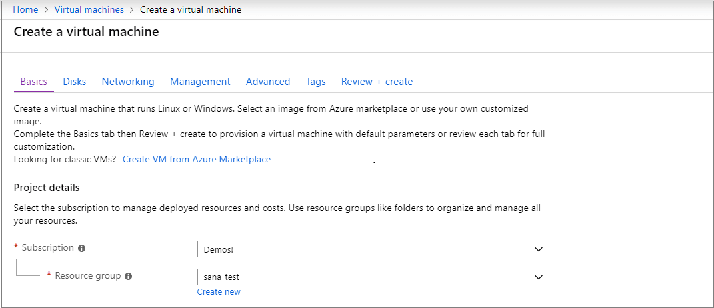

+++
title = "SSH Tutorial"
date = 2024-01-12T22:36:24+08:00
weight = 70
type = "docs"
description = ""
isCJKLanguage = true
draft = false
+++

> 原文: [https://code.visualstudio.com/docs/remote/ssh-tutorial](https://code.visualstudio.com/docs/remote/ssh-tutorial)

# Remote development over SSH 通过 SSH 进行远程开发


This tutorial walks you through creating and connecting to a virtual machine (VM) on Azure using the Visual Studio Code [Remote - SSH](https://marketplace.visualstudio.com/items?itemName=ms-vscode-remote.remote-ssh) extension. You'll create a Node.js Express web app to show how you can edit and debug on a remote machine with VS Code just like you could if the source code was local.

​​	本教程将指导您使用 Visual Studio Code Remote - SSH 扩展在 Azure 上创建虚拟机 (VM) 并连接到该虚拟机。您将创建一个 Node.js Express Web 应用，以展示如何像处理本地源代码一样在远程计算机上使用 VS Code 编辑和调试代码。

> **Note**: Your Linux VM can be hosted anywhere - on your local host, on premise, in Azure, or in any other cloud, as long as the chosen Linux distribution meets these [prerequisites](https://code.visualstudio.com/docs/remote/linux#_local-linux-prerequisites).
>
> ​​	注意：您的 Linux VM 可以托管在任何地方 - 本地主机、本地、Azure 或任何其他云中，只要所选的 Linux 发行版满足这些先决条件即可。

## [Prerequisites 先决条件](https://code.visualstudio.com/docs/remote/ssh-tutorial#_prerequisites)

To get started, you need to have done the following steps:

​​	要开始，您需要完成以下步骤：

1. Install an [OpenSSH compatible SSH client](https://code.visualstudio.com/docs/remote/troubleshooting#_installing-a-supported-ssh-client) (PuTTY is not supported).
   安装兼容 OpenSSH 的 SSH 客户端（不支持 PuTTY）。
2. Install [Visual Studio Code](https://code.visualstudio.com/).
   安装 Visual Studio Code。
3. Have an Azure subscription (If you don't have an Azure subscription, create a [free account](https://azure.microsoft.com/free/?WT.mc_id=A261C142F) before you begin).
   拥有 Azure 订阅（如果您没有 Azure 订阅，请在开始前创建一个免费帐户）。

### [Install the extension 安装扩展](https://code.visualstudio.com/docs/remote/ssh-tutorial#_install-the-extension)

The Remote - SSH extension is used to connect to SSH hosts.

​​	Remote - SSH 扩展用于连接到 SSH 主机。

> [Install the Remote - SSH extension
> 安装 Remote - SSH 扩展](vscode:extension/ms-vscode-remote.remote-ssh)


### [Remote - SSH](https://code.visualstudio.com/docs/remote/ssh-tutorial#_remote-ssh)

With the Remote - SSH extension installed, you will see a new Status bar item at the far left.

​​	安装了 Remote - SSH 扩展后，您将在最左侧看到一个新的状态栏项目。


The Remote Status bar item can quickly show you in which context VS Code is running (local or remote) and clicking on the item will bring up the Remote - SSH commands.

​​	远程状态栏项目可以快速向您显示 VS Code 在哪个上下文中运行（本地或远程），单击该项目将显示 Remote - SSH 命令。


## [Create a virtual machine 创建虚拟机](https://code.visualstudio.com/docs/remote/ssh-tutorial#_create-a-virtual-machine)

If you don't have an existing Linux virtual machine, you can create a new VM through the [Azure portal](https://portal.azure.com/). In the Azure portal, search for "Virtual Machines", and choose **Add**. From there, you can select your Azure subscription and create a new resource group, if you don't already have one.

​​	如果您没有现有的 Linux 虚拟机，可以通过 Azure 门户创建新的 VM。在 Azure 门户中，搜索“虚拟机”，然后选择“添加”。在其中，您可以选择您的 Azure 订阅并创建一个新的资源组（如果您还没有）。

> **Note**: In this tutorial, we are using Azure, but your Linux VM can be hosted anywhere, as long as the Linux distribution meets these [prerequisites](https://code.visualstudio.com/docs/remote/linux#_local-linux-prerequisites).
>
> ​​	注意：在本教程中，我们使用的是 Azure，但您的 Linux VM 可以托管在任何地方，只要 Linux 发行版满足这些先决条件即可。



Now you can specify details of your VM, such as the name, the size, and the base image. Choose Ubuntu Server 18.04 LTS for this example, but you can choose recent versions of other Linux distros and look at VS Code's [supported SSH servers](https://code.visualstudio.com/docs/remote/troubleshooting#_installing-a-supported-ssh-server).

​​	现在，您可以指定 VM 的详细信息，例如名称、大小和基础映像。为此示例选择 Ubuntu Server 18.04 LTS，但您可以选择其他 Linux 发行版的最新版本，并查看 VS Code 支持的 SSH 服务器。


## [Set up SSH 设置 SSH](https://code.visualstudio.com/docs/remote/ssh-tutorial#_set-up-ssh)

There are several authentication methods into a VM, including an SSH public/private key pair or a username and password. We recommend using key-based authentication (if you use a username/password, you'll be prompted to enter your credentials more than once by the extension). If you're on Windows and have already created keys using PuttyGen, you can [reuse them](https://code.visualstudio.com/docs/remote/troubleshooting#_reusing-a-key-generated-in-puttygen).

​​	进入 VM 的身份验证方法有多种，包括 SSH 公钥/私钥对或用户名和密码。我们建议使用基于密钥的身份验证（如果您使用用户名/密码，扩展程序会提示您多次输入凭据）。如果您使用的是 Windows 并且已使用 PuttyGen 创建了密钥，则可以重复使用它们。

### [Create an SSH key 创建 SSH 密钥](https://code.visualstudio.com/docs/remote/ssh-tutorial#_create-an-ssh-key)

If you don't have an SSH key pair, open a bash shell or the command line and type in:

​​	如果您没有 SSH 密钥对，请打开 bash shell 或命令行并输入：

```
ssh-keygen -t ed25519
```

This will generate the SSH key. Press Enter at the following prompt to save the key in the default location (under your user directory as a folder named `.ssh`).

​​	这将生成 SSH 密钥。在以下提示符下按 Enter 键，以将密钥保存在默认位置（在您的用户目录下，作为名为 `.ssh` 的文件夹）。


You will then be prompted to enter a secure passphrase, but you can leave that blank. You should now have a `id_ed25519.pub` file which contains your new public SSH key.

​​	然后系统会提示您输入安全的密码短语，但您可以将其留空。现在您应该有一个 `id_ed25519.pub` 文件，其中包含您的新公共 SSH 密钥。

> **Note**: If you are using a legacy system that doesn't support the Ed25519 algorithm, you can use rsa instead: `ssh-keygen -t rsa -b 4096`.
>
> ​​	注意：如果您使用的是不支持 Ed25519 算法的旧系统，则可以使用 rsa： `ssh-keygen -t rsa -b 4096` 。

## [Add SSH key to your VM 将 SSH 密钥添加到您的 VM](https://code.visualstudio.com/docs/remote/ssh-tutorial#_add-ssh-key-to-your-vm)

In the previous step, you generated an SSH key pair. Select **Use existing public key** in the dropdown for **SSH public key source** so that you can use the public key you just generated. Take the public key and paste it into your VM setup, by copying the entire contents of the `id_ed25519.pub` in the **SSH public key**. You also want to allow your VM to accept inbound SSH traffic by selecting **Allow selected ports** and choosing **SSH (22)** from the **Select inbound ports** dropdown list.

​​	在上一步中，您生成了 SSH 密钥对。在 SSH 公钥源的下拉列表中选择“使用现有公钥”，以便您可以使用刚刚生成的公钥。获取公钥并将其粘贴到您的 VM 设置中，方法是复制 `id_ed25519.pub` 中的全部内容到 SSH 公钥中。您还可以选择“允许选定的端口”，然后从“选择入站端口”下拉列表中选择 SSH (22)，以允许您的 VM 接受入站 SSH 流量。


### [Auto shutdown 自动关机](https://code.visualstudio.com/docs/remote/ssh-tutorial#_auto-shutdown)

A cool feature of using Azure VMs is the ability to enable auto shutdown (because let's face it, we all forget to turn off our VMs…). If you go to the **Management** tab, you can set the time you want to shut down the VM daily.

​​	使用 Azure VM 的一个很酷的功能是能够启用自动关机（因为我们都忘记关闭我们的 VM……）。如果您转到“管理”选项卡，则可以设置每天关闭 VM 的时间。


Select **Review and Create**, then **Create**, and Azure will deploy your VM for you!

​​	选择“查看并创建”，然后选择“创建”，Azure 将为您部署 VM！

Once the deployment is finished (it may take several minutes), go to the new resource view for your virtual machine.

​​	部署完成后（可能需要几分钟），转到虚拟机的全新资源视图。

## [Connect using SSH 使用 SSH 连接](https://code.visualstudio.com/docs/remote/ssh-tutorial#_connect-using-ssh)

Now that you've created an SSH host, let's connect to it!

​​	现在您已经创建了一个 SSH 主机，让我们连接到它！

You'll have noticed an indicator on the bottom-left corner of the Status bar. This indicator tells you in which context VS Code is running (local or remote). Click on the indicator to bring up a list of Remote extension commands.

​​	您会注意到状态栏左下角有一个指示器。此指示器告诉您 VS Code 在哪个上下文中运行（本地或远程）。单击指示器以显示远程扩展命令列表。


Choose the **Connect to Host...** command in the **Remote-SSH** section and connect to the host by entering connection information for your VM in the following format: `user@hostname`.

​​	在远程 - SSH 部分中选择连接到主机...命令，并通过以下格式输入 VM 的连接信息来连接到主机： `user@hostname` 。

The `user` is the username you set when adding the SSH public key to your VM. For the `hostname`, go back to the [Azure portal](https://portal.azure.com/) and in the **Overview** pane of the VM you created, copy the **Public IP address**.

​​	 `user` 是您在将 SSH 公钥添加到 VM 时设置的用户名。对于 `hostname` ，返回到 Azure 门户，在您创建的 VM 的概述窗格中，复制公共 IP 地址。


Before connecting in Remote - SSH, you can verify you're able to connect to your VM via a command prompt using `ssh user@hostname`.

​​	在远程 - SSH 中连接之前，您可以使用 `ssh user@hostname` 通过命令提示符验证您是否能够连接到您的 VM。

> Note: If you run into an error `ssh: connect to host <host ip> port 22: Connection timed out`, you may need to delete NRMS-Rule-106 from the Networking tab of your VM:
>
> ​​	注意：如果您遇到错误 `ssh: connect to host <host ip> port 22: Connection timed out` ，您可能需要从 VM 的网络选项卡中删除 NRMS-Rule-106：


Set the user and hostname in the connection information text box.

​​	在连接信息文本框中设置用户和主机名。


VS Code will now open a new window (instance). You'll then see a notification that the "VS Code Server" is initializing on the SSH Host. Once the VS Code Server is installed on the remote host, it can run extensions and talk to your local instance of VS Code.

​​	VS Code 现在将打开一个新窗口（实例）。然后，您会看到一条通知，指出“VS Code Server”正在 SSH 主机上初始化。一旦 VS Code Server 安装在远程主机上，它就可以运行扩展并与您的本地 VS Code 实例通信。


You'll know you're connected to your VM by looking at the indicator in the Status bar. It shows the hostname of your VM.

​​	通过查看状态栏中的指示器，您将知道您已连接到您的 VM。它显示了您的 VM 的主机名。


The Remote - SSH extension also contributes a new icon on your Activity bar, and clicking on it will open the Remote explorer. From the dropdown, select **SSH Targets**, where you can configure your SSH connections. For instance, you can save the hosts you connect to the most and access them from here instead of entering the user and hostname.

​​	Remote - SSH 扩展还在您的活动栏中添加了一个新图标，单击它将打开远程资源管理器。从下拉列表中，选择 SSH 目标，您可以在其中配置您的 SSH 连接。例如，您可以保存您最常连接的主机，并从此处访问它们，而无需输入用户和主机名。


Once you're connected to your SSH host, you can interact with files and open folders on the remote machine. If you open the integrated terminal (Ctrl+`), you'll see you're working inside a bash shell **while you're on Windows**.

​​	一旦您连接到您的 SSH 主机，您就可以与远程计算机上的文件进行交互并打开文件夹。如果您打开集成终端 (Ctrl+`)，您将看到您在 Windows 上时正在 bash shell 中工作。


You can use the bash shell to browse the file system on the VM. You can also browse and open folders on the remote home directory with **File** > **Open Folder**.

​​	您可以使用 bash shell 浏览 VM 上的文件系统。您还可以使用文件 > 打开文件夹浏览和打开远程主目录中的文件夹。


## [Create your Node.js application 创建您的 Node.js 应用程序](https://code.visualstudio.com/docs/remote/ssh-tutorial#_create-your-nodejs-application)

In this step, you will create a simple Node.js application. You will use an application generator to quickly scaffold out the application from a terminal.

​​	在此步骤中，您将创建一个简单的 Node.js 应用程序。您将使用应用程序生成器从终端快速构建应用程序脚手架。

### [Install Node.js and npm 安装 Node.js 和 npm](https://code.visualstudio.com/docs/remote/ssh-tutorial#_install-nodejs-and-npm)

From the integrated terminal (Ctrl+`), update the packages in your Linux VM, then install Node.js, which includes npm, the Node.js package manager.

​​	从集成终端 (Ctrl+`)，更新 Linux VM 中的软件包，然后安装 Node.js，其中包括 Node.js 包管理器 npm。

```
sudo apt-get update
curl -sL https://deb.nodesource.com/setup_lts.x | sudo -E bash -
sudo apt-get install -y nodejs
```

You can verify the installations by running:

​​	您可以通过运行以下命令来验证安装：

```
node --version
npm --version
```

### [Install the Express generator 安装 Express 生成器](https://code.visualstudio.com/docs/remote/ssh-tutorial#_install-the-express-generator)

[Express](https://www.expressjs.com/) is a popular framework for building and running Node.js applications. You can scaffold (create) a new Express application using the [Express Generator](https://expressjs.com/en/starter/generator.html) tool. The Express Generator is shipped as an npm module and installed by using the npm command-line tool `npm`.

​​	Express 是一个用于构建和运行 Node.js 应用程序的流行框架。您可以使用 Express Generator 工具脚手架（创建）一个新的 Express 应用程序。Express Generator 作为 npm 模块提供，并使用 npm 命令行工具安装 `npm` 。

```
sudo npm install -g express-generator
```

The `-g` switch installs the Express Generator globally on your machine so that you can run it from anywhere.

​​	 `-g` 开关在您的机器上全局安装 Express Generator，以便您可以从任何地方运行它。

### [Create a new application 创建新应用程序](https://code.visualstudio.com/docs/remote/ssh-tutorial#_create-a-new-application)

You can now create a new Express application called `myExpressApp` by running:

​​	您现在可以通过运行以下命令创建一个名为 `myExpressApp` 的新 Express 应用程序：

```
express myExpressApp --view pug
```

The `--view pug` parameters tell the generator to use the [pug](https://pugjs.org/api/getting-started.html) template engine.

​​	 `--view pug` 参数告诉生成器使用 pug 模板引擎。

To install all of the application's dependencies, go to the new folder and run `npm install`.

​​	要安装应用程序的所有依赖项，请转到新文件夹并运行 `npm install` 。

```
cd myExpressApp
npm install
```

### [Run the application 运行应用程序](https://code.visualstudio.com/docs/remote/ssh-tutorial#_run-the-application)

Last, let's ensure that the application runs. From the terminal, start the application using the `npm start` command to start the server.

​​	最后，让我们确保应用程序运行。从终端，使用 `npm start` 命令启动应用程序以启动服务器。

```
npm start
```

The Express app by default runs on [http://localhost:3000](http://localhost:3000/). You won't see anything in your local browser on localhost:3000 because the web app is running on your virtual machine.

​​	默认情况下，Express 应用在 http://localhost:3000 上运行。您不会在 localhost:3000 上的本地浏览器中看到任何内容，因为 Web 应用在您的虚拟机上运行。

### [Port forwarding 端口转发](https://code.visualstudio.com/docs/remote/ssh-tutorial#_port-forwarding)

To be able to browse to the web app on your local machine, you can leverage another feature called [Port forwarding](https://code.visualstudio.com/docs/remote/ssh#_temporarily-forwarding-a-port).

​​	为了能够在本地计算机上浏览 Web 应用，您可以利用另一项称为端口转发

To be able to access a port on the remote machine that may not be publicly exposed, you need to establish a connection or a tunnel between a port on your local machine and the server. With the app still running, open the SSH Explorer and find the **Forwarded Ports** view. Click on the **Forward a port** link and indicate that you want to forward port 3000:

​​	的功能。要能够访问远程计算机上可能未公开的端口，您需要在本地计算机上的端口和服务器之间建立连接或隧道。在应用仍在运行时，打开 SSH Explorer 并找到已转发的端口视图。单击转发端口链接并指示您要转发端口 3000：


Name the connection "browser":

​​	将连接命名为“浏览器”：


The server will now forward traffic on port 3000 to your local machine. When you browse to [http://localhost:3000](http://localhost:3000/), you see the running web app.

​​	服务器现在会将端口 3000 上的流量转发到您的本地计算机。当您浏览到 http://localhost:3000 时，您会看到正在运行的 Web 应用。


## [Edit and debug 编辑和调试](https://code.visualstudio.com/docs/remote/ssh-tutorial#_edit-and-debug)

From the Visual Studio Code File Explorer (Ctrl+Shift+E), navigate to your new `myExpressApp` folder and double-click the `app.js` file to open it in the editor.

​​	从 Visual Studio Code 文件资源管理器 (Ctrl+Shift+E) 中，导航到您的新 `myExpressApp` 文件夹，然后双击 `app.js` 文件以在编辑器中将其打开。

### [IntelliSense](https://code.visualstudio.com/docs/remote/ssh-tutorial#_intellisense)

You have syntax highlighting for the JavaScript file as well as IntelliSense with hovers, just like you would see if the source code was on your local machine.

​​	您对 JavaScript 文件具有语法突出显示以及带有悬停的 IntelliSense，就像在源代码位于您的本地计算机上时看到的一样。


When you start typing, you'll get smart completions for the object methods and properties.

​​	开始键入时，您将获得对象方法和属性的智能补全。


### [Debugging 调试](https://code.visualstudio.com/docs/remote/ssh-tutorial#_debugging)

Set a breakpoint on line 10 of `app.js` by clicking in the gutter to the left of the line number or by putting the cursor on the line and pressing F9. The breakpoint will be displayed as a red circle.

​​	通过单击行号左侧的边距或将光标放在该行并按 F9，在 `app.js` 的第 10 行设置一个断点。断点将显示为一个红色圆圈。


Now, press F5 to run your application. If you are asked how to run the application, choose **Node.js**.

​​	现在，按 F5 运行您的应用程序。如果系统询问您如何运行该应用程序，请选择 Node.js。

The app will start, and you'll hit the breakpoint. You can inspect variables, create watches, and navigate the call stack.

​​	该应用程序将启动，您将命中断点。您可以检查变量、创建监视并导航调用堆栈。

Press F10 to step or F5 again to finish your debugging session.

​​	按 F10 进行单步调试，或再次按 F5 完成调试会话。


You get the full development experience of Visual Studio Code connected over SSH.

​​	您将获得通过 SSH 连接的 Visual Studio Code 的完整开发体验。

### [Ending your SSH connection 结束您的 SSH 连接](https://code.visualstudio.com/docs/remote/ssh-tutorial#_ending-your-ssh-connection)

You can end your session over SSH and go back to running VS Code locally with **File** > **Close Remote Connection**.

​​	您可以通过 SSH 结束会话，并通过“文件”>“关闭远程连接”返回在本地运行 VS Code。

### [Congratulations 恭喜](https://code.visualstudio.com/docs/remote/ssh-tutorial#_congratulations)

Congratulations, you've successfully completed this tutorial!

​​	恭喜，您已成功完成本教程！

Next, check out the other Remote Development extensions.

​​	接下来，查看其他远程开发扩展。

- [WSL](https://marketplace.visualstudio.com/items?itemName=ms-vscode-remote.remote-wsl)
- [Dev Containers
  开发容器](https://marketplace.visualstudio.com/items?itemName=ms-vscode-remote.remote-containers)

Or get them all by installing the [Remote Development](https://marketplace.visualstudio.com/items?itemName=ms-vscode-remote.vscode-remote-extensionpack) Extension Pack.

​​	或通过安装远程开发扩展包获取所有扩展。
