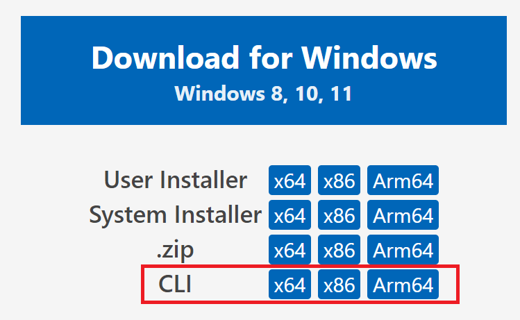
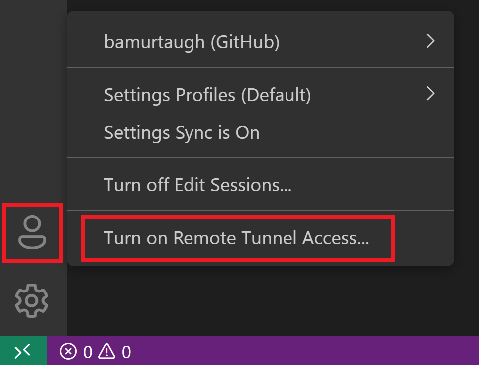
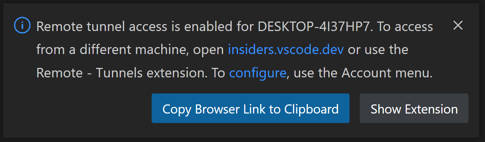
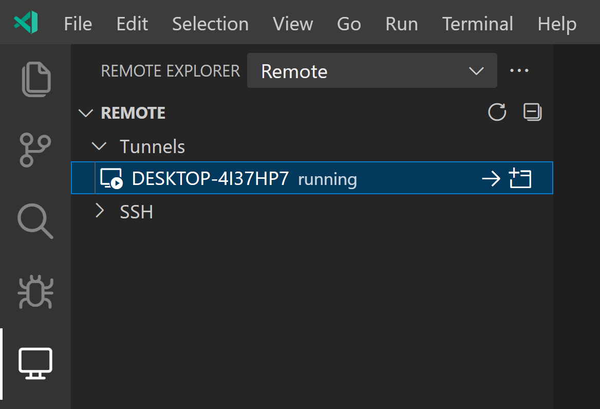
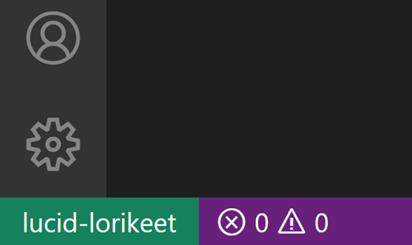

+++
title = "Tunnels"
date = 2024-01-12T22:36:24+08:00
weight = 60
type = "docs"
description = ""
isCJKLanguage = true
draft = false
+++

> 原文: [https://code.visualstudio.com/docs/remote/tunnels](https://code.visualstudio.com/docs/remote/tunnels)

# Developing with Remote Tunnels 使用远程隧道进行开发


The Visual Studio Code [Remote - Tunnels](https://marketplace.visualstudio.com/items?itemName=ms-vscode.remote-server) extension lets you connect to a remote machine, like a desktop PC or virtual machine (VM), via a secure tunnel. You can connect to that machine from a VS Code client anywhere, without the requirement of SSH.

​​	Visual Studio Code Remote - Tunnels 扩展程序允许您通过安全隧道连接到远程计算机，如台式机或虚拟机 (VM)。您可以从任何地方的 VS Code 客户端连接到该计算机，而无需 SSH。通过 Microsoft 开发隧道，可以安全地将数据从一个网络传输到另一个网络。

Tunneling securely transmits data from one network to another via [Microsoft dev tunnels](https://learn.microsoft.com/azure/developer/dev-tunnels/overview).

​​	这样可以消除将源代码放在 VS Code 客户端计算机上的需要，因为该扩展程序直接在远程计算机上运行命令和其他扩展程序。无论您的代码托管在何处，VS Code 都可以提供本地质量的开发体验 - 包括完整的 IntelliSense（完成）、代码导航和调试。

This can eliminate the need for source code to be on your VS Code client machine since the extension runs commands and other extensions directly on the remote machine.

​​	您有两种方法可以使用隧道：


VS Code can provide a **local-quality development experience** - including full IntelliSense (completions), code navigation, and debugging - **regardless of where your code is hosted**.

​​	运行 命令行界面 (CLI) 的 命令。

## [Getting Started 入门]()

You have two paths to work with tunnels:

​​	通过 VS Code 桌面 UI 启用隧道。

- Run the `tunnel` command of the `code` [command-line interface (CLI)]().
- Enable tunneling through the VS Code Desktop UI.

Both of these paths result in the same tunneling functionality – you can use whichever tooling works best for you. The CLI is a great option if you can't install the full VS Code Desktop on your remote machine. Using the VS Code Desktop UI is convenient if you're already doing some work in VS Code and would then like to enable tunneling for your current machine.

​​	这两条路径都会产生相同的隧道功能 - 您可以使用最适合您的工具。如果您无法在远程计算机上安装完整的 VS Code Desktop，则 CLI 是一个不错的选择。如果您已经在 VS Code 中进行了一些工作，并且希望为当前计算机启用隧道，那么使用 VS Code Desktop UI 会很方便。

We'll describe both paths in the sections below.

​​	我们将在以下部分中描述这两条路径。

## [Using the 'code' CLI 使用“代码”CLI]()

You may create and use tunnels through the `code` [CLI]().

​​	您可以通过 `code` CLI 创建和使用隧道。

1. Install the `code` CLI on a remote machine you'd like to develop against from a VS Code client. The CLI establishes a tunnel between a VS Code client and your remote machine. The CLI is automatically built into VS Code Desktop – no additional setup required.

   ​​	在您希望通过 VS Code 客户端进行开发的远程计算机上安装 `code` CLI。CLI 在 VS Code 客户端和远程计算机之间建立隧道。CLI 会自动内置到 VS Code Desktop 中 - 无需其他设置。

   ### [Alternative downloads 备用下载]()

   Alternatively, you can grab the CLI through a [standalone install](https://code.visualstudio.com/#alt-downloads) on our download page, which is separate from a VS Code Desktop installation:

   ​​	或者，您可以通过我们的下载页面上的独立安装获取 CLI，该安装与 VS Code Desktop 安装分开：

   

   You can also install and unpack the CLI through the terminal of your remote machine. This may be especially helpful if your remote doesn't have a UI:

   ​​	您还可以通过远程计算机的终端安装并解压缩 CLI。如果您的远程计算机没有 UI，这可能特别有用：

   ```
   curl -Lk 'https://code.visualstudio.com/sha/download?build=stable&os=cli-alpine-x64' --output vscode_cli.tar.gz
   
   tar -xf vscode_cli.tar.gz
   ```

   > **Note:** If you're using the standalone or terminal install, the commands in the following section will start with `./code` rather than `code`.
   >
   > ​​	注意：如果您使用的是独立或终端安装，则以下部分中的命令将以 `./code` 开头，而不是 `code` 。

2. Create a secure tunnel with the `tunnel` command:

   ​​	使用 `tunnel` 命令创建安全隧道：

   ```
   code tunnel
   ```

   This command downloads and starts the VS Code Server on this machine and then creates a tunnel to it.

   ​​	此命令下载并启动此计算机上的 VS Code Server，然后创建一条隧道。

   > **Note:** You will be prompted to accept the server license terms when you first start a tunnel on a machine. You can also pass `--accept-server-license-terms` on the command line to avoid the prompt.
   >
   > ​​	注意：当您首次在计算机上启动隧道时，系统会提示您接受服务器许可条款。您还可以在命令行中传递 `--accept-server-license-terms` 以避免出现提示。

3. This CLI will output a vscode.dev URL tied to this remote machine, such as `https://vscode.dev/tunnel/<machine_name>/<folder_name>`. You can open this URL on a client of your choosing.

   ​​	此 CLI 将输出一个与该远程计算机绑定的 vscode.dev URL，例如 `https://vscode.dev/tunnel/<machine_name>/<folder_name>` 。您可以在您选择的客户端上打开此 URL。

4. When opening a vscode.dev URL for the first time on this client, you'll be prompted to log into your GitHub account at a `https://github.com/login/oauth/authorize...` URL. This authenticates you to the tunneling service to ensure you have access to the right set of remote machines.

   ​​	首次在此客户端上打开 vscode.dev URL 时，系统会提示您在 `https://github.com/login/oauth/authorize...` URL 中登录您的 GitHub 帐户。这会对您进行隧道服务身份验证，以确保您有权访问正确的远程计算机集。

## [Using the VS Code UI 使用 VS Code UI]()

1. Open VS Code on the remote machine where you'd like to turn on tunnel access.

   ​​	在您想要启用隧道访问的远程计算机上打开 VS Code。

2. In the VS Code Account menu, select the option to **Turn on Remote Tunnel Access**, as demonstrated in the image below. You may also open the Command Palette (F1) in VS Code and run the command **Remote Tunnels: Turn on Remote Tunnel Access...**.

   ​​	在 VS Code 帐户菜单中，选择启用远程隧道访问选项，如下面的图像所示。您还可以在 VS Code 中打开命令面板 (F1) 并运行命令远程隧道：启用远程隧道访问....

   

3. You'll be prompted to log into GitHub. Once you're logged in, a tunnel will start up on your current machine, and you'll be able to connect to this machine remotely.

   ​​	您将收到登录 GitHub 的提示。登录后，将在您当前的计算机上启动一个隧道，您将能够远程连接到此计算机。

   

4. In a client of your choice, you may open the vscode.dev link from the notification above and start coding!

   ​​	在您选择的客户端中，您可以从上面的通知中打开 vscode.dev 链接并开始编码！

> **Note:** The remote machine will only be reachable through a tunnel while VS Code remains running there. Once you exit VS Code it will no longer be possible to tunnel to it until you start VS Code there again or run the `code tunnel` CLI command.
>
> ​​	注意：只有在 VS Code 在远程计算机上运行时，才能通过隧道访问远程计算机。退出 VS Code 后，将无法再通过隧道访问它，直到您再次在该计算机上启动 VS Code 或运行 `code tunnel` CLI 命令。

## [Remote Tunnels extension Remote Tunnels 扩展]()

The vscode.dev instances you open through the `code` CLI or VS Code UI come with the Remote - Tunnels extension preinstalled.

​​	您通过 `code` CLI 或 VS Code UI 打开的 vscode.dev 实例预装了 Remote - Tunnels 扩展。

If you're already working in VS Code (desktop or web) and would like to connect to a remote tunnel, you can install and use the [Remote - Tunnels](https://marketplace.visualstudio.com/items?itemName=ms-vscode.remote-server) extension directly. Once you install the extension, open the Command Palette (F1) and run the command **Remote Tunnels: Connect to Tunnel**. You'll be able to connect to any remote machines with an active tunnel.

​​	如果您已经在 VS Code（桌面或 Web）中工作，并且想要连接到远程隧道，则可以直接安装并使用 Remote - Tunnels 扩展。安装扩展后，打开命令面板 (F1) 并运行命令 Remote Tunnels: Connect to Tunnel。您将能够连接到具有活动隧道的任何远程计算机。

You can also view your remote machines in the Remote Explorer, which you may focus on through the command **Remote Explorer: Focus on Remote View**:

​​	您还可以在远程资源管理器中查看远程计算机，您可以通过命令 Remote Explorer: Focus on Remote View：



Like the other Remote Development extensions, the name of your remote machine will be listed in the lower left green remote indicator. Clicking on this indicator is another way to explore Remote Tunnels commands, along with options to close your remote connection or install VS Code Desktop.

​​	与其他远程开发扩展一样，远程计算机的名称将列在左下角的绿色远程指示器中。单击此指示器是探索远程隧道命令的另一种方式，以及关闭远程连接或安装 VS Code Desktop 的选项。



### [Open a folder on a Remote Tunnels host in a container 在容器中打开远程隧道主机上的文件夹]()

You can use the Remote - Tunnels and [Dev Containers]() extensions together to open a folder on your remote host inside of a container. You do not even need to have a Docker client installed locally.

​​	您可以将远程隧道和开发容器扩展一起使用，以便在容器中打开远程主机上的文件夹。您甚至不需要在本地安装 Docker 客户端。

To do so:

​​	要执行此操作，请执行以下操作：

1. Follow the [installation]() steps for installing Docker on your remote host and VS Code and the Dev Containers extension locally.
   按照安装步骤在远程主机和 VS Code 上安装 Docker，并在本地安装 Dev Containers 扩展。
2. Follow the [Getting Started]() instructions for the Remote - Tunnels extension to set up a tunnel, connect to it and open a folder there.
   按照远程隧道扩展的入门说明进行操作，以设置隧道、连接到隧道并在其中打开文件夹。
3. Use the **Dev Containers: Reopen in Container** command from the Command Palette (F1, Ctrl+Shift+P).
   从命令面板（F1、Ctrl+Shift+P）中使用 Dev Containers：在容器中重新打开命令。

The rest of the [Dev Containers quick start]() applies as-is. You can learn more about the [Dev Containers extension in its documentation](). You can also see the [Develop on a remote Docker host]() article for other options if this model does not meet your needs.

​​	Dev Containers 快速入门指南的其余部分照常适用。您可以在其文档中了解有关 Dev Containers 扩展的更多信息。如果您不满足此模型的需求，您还可以参阅在远程 Docker 主机上进行开发一文，了解其他选项。

## [Common questions 常见问题]()

### [What is the relationship between the Remote Tunnels, VS Code Server, and Remote Development? 远程隧道、VS Code Server 和远程开发之间的关系是什么？]()

Visual Studio Code [Remote Development]() allows you to use a container, remote machine, or the Windows Subsystem for Linux (WSL) as a full-featured development environment.

​​	Visual Studio Code 远程开发允许您将容器、远程计算机或适用于 Linux 的 Windows 子系统 (WSL) 用作功能齐全的开发环境。

Remote Development lets your local VS Code installation transparently interact with source code and runtime environments on other machines (whether virtual or physical) by moving the execution of certain commands to a "remote server", the VS Code Server. The VS Code Server is quickly installed by VS Code when you connect to a remote endpoint and can host extensions that interact directly with the remote workspace, machine, and file system.

​​	远程开发允许您的本地 VS Code 安装通过将某些命令的执行移至“远程服务器”VS Code Server，与其他计算机（无论是虚拟还是物理）上的源代码和运行时环境透明地交互。当您连接到远程端点时，VS Code 会快速安装 VS Code Server，并且可以托管与远程工作区、计算机和文件系统直接交互的扩展。

We've released this VS Code Server backend component as a service you can run yourself (which you may read more about in [its documentation]()), rather than it only being solely installed and managed by the Remote Development extensions.

​​	我们已将此 VS Code Server 后端组件发布为您可以自行运行的服务（您可以在其文档中阅读更多相关信息），而不仅仅是仅由远程开发扩展安装和管理。

Accessing the VS Code Server involves a few components:

​​	访问 VS Code Server 涉及几个组件：

- The VS Code Server: Backend server that makes VS Code remote experiences possible.
  VS Code Server：使 VS Code 远程体验成为可能的后端服务器。
- Remote - Tunnels extension: Extension that facilitates the connection to the remote machine, where you have an instance of the server running.
  Remote - Tunnels 扩展：该扩展可帮助连接到远程计算机，您可以在其中运行服务器实例。

### [As an extension author, what do I need to do? 作为扩展作者，我需要做什么？]()

The VS Code extension API abstracts away local/remote details so most extensions will work without modification. However, given extensions can use any node module or runtime they want, there are situations where adjustments may need to be made. We recommend you test your extension to be sure that no updates are required. See [Supporting Remote Development](https://code.visualstudio.com/api/advanced-topics/remote-extensions) for details.

​​	VS Code 扩展 API 抽象了本地/远程详细信息，因此大多数扩展无需修改即可工作。但是，鉴于扩展可以使用任何所需的 node 模块或运行时，因此在某些情况下可能需要进行调整。我们建议您测试您的扩展以确保不需要任何更新。有关详细信息，请参阅支持远程开发。

### [Can multiple users or clients access the same remote instance simultaneously? 多个用户或客户端是否可以同时访问同一个远程实例？]()

No, an instance of the server is designed to be accessed by one user or client at a time.

​​	不可以，服务器实例一次只能供一个用户或客户端访问。

### [How do I remove a tunnel or machine? 如何删除隧道或计算机？]()

If you'd like to stop a tunnel you're running via the CLI, you may use Ctrl + C to end the active tunnel. If you've enabled tunneling through the VS Code UI, you can run the command **Remote Tunnels: Turn off Remote Tunnel Access...** in VS Code.

​​	如果您想通过 CLI 停止正在运行的隧道，可以使用 Ctrl + C 结束活动隧道。如果您已通过 VS Code UI 启用隧道，可以在 VS Code 中运行命令 Remote Tunnels: Turn off Remote Tunnel Access...。

You can remove a machine's association with tunneling by running `code tunnel unregister` on that machine. You can also open any VS Code client, select the Remote Explorer view, right-click on the machine you'd like to remove, and select **unregister**.

​​	您可以在计算机上运行 `code tunnel unregister` 来删除计算机与隧道的关联。您还可以打开任何 VS Code 客户端，选择“远程资源管理器”视图，右键单击要删除的计算机，然后选择“取消注册”。

### [How are tunnels secured? 隧道如何保护安全？]()

Both hosting and connecting to a tunnel requires authentication with the same Github or Microsoft account on each end. In both cases, VS Code will make outbound connections to a service hosted in Azure; no firewall changes are generally necessary, and VS Code doesn't set up any network listeners.

​​	托管和连接到隧道都需要在每端使用相同的 Github 或 Microsoft 帐户进行身份验证。在这两种情况下，VS Code 都将对 Azure 中托管的服务建立出站连接；通常无需更改防火墙，VS Code 也不会设置任何网络侦听器。

Once you connect from a remote VS Code instance, an SSH connection is created over the tunnel in order to provide end-to-end encryption. The current preferred cipher for this encryption is AES 256 in CTR mode, and the code that implements this is [open source](https://github.com/microsoft/dev-tunnels).

​​	一旦您从远程 VS Code 实例连接，就会通过隧道创建 SSH 连接，以便提供端到端加密。此加密的当前首选密码是 CTR 模式下的 AES 256，并且实现此密码的代码是开源的。

If you're part of an organization who wants to control access to Remote Tunnels, you can do so by allowing or denying access to the domain `global.rel.tunnels.api.visualstudio.com`.

​​	如果您所在的组织想要控制对远程隧道的访问，可以通过允许或拒绝访问域 `global.rel.tunnels.api.visualstudio.com` 来实现。

You can learn more about the security of the underlying dev tunnels service in its [documentation](https://learn.microsoft.com/azure/developer/dev-tunnels/security).

​​	您可以在其文档中了解有关基础开发隧道服务安全性的更多信息。

### [Are there usage limits for the tunneling service? 隧道服务是否有使用限制？]()

To avoid abuse of the underlying tunneling service, there are usage limits in place for resources like number of tunnels and bandwidth. We anticipate most users to never reach these limits.

​​	为了避免滥用基础隧道服务，对隧道数量和带宽等资源的使用有限制。我们预计大多数用户永远不会达到这些限制。

For instance, right now you can have 5 tunnels registered for your account. If you'd like to create a new tunnel and already have 5 others registered, the CLI will pick a random unused tunnel and delete it. Please note this limit is subject to change.

​​	例如，现在您可以为您的帐户注册 5 个隧道。如果您想创建新隧道并且已经注册了 5 个其他隧道，CLI 会选择一个随机未使用的隧道并将其删除。请注意，此限制可能会更改。

If you are hitting a limit and would like to discuss getting more usage, we'd love to learn more. Please reach out to `vscodeserver@microsoft.com` with information on your scenario and how much usage you need.

​​	如果您达到限制并且想讨论获取更多使用权限，我们很乐意了解更多信息。请通过 `vscodeserver@microsoft.com` 联系我们，提供有关您的方案以及您需要多少使用权限的信息。

### [How can I ensure I keep my tunnel running? 如何确保隧道保持运行？]()

You have a few options:

​​	您有几个选项：

- Use the `service` command to run as a service. You can run `code tunnel service install` and `code tunnel service uninstall` to install and remove them.
  使用 `service` 命令作为服务运行。您可以运行 `code tunnel service install` 和 `code tunnel service uninstall` 来安装和删除它们。
- Use the `no-sleep` option, `code tunnel --no-sleep`, to prevent your remote machine from going to sleep.
  使用 `no-sleep` 选项 `code tunnel --no-sleep` 来防止远程计算机进入睡眠状态。

As mentioned in the [`code` CLI doc](), you can explore all the possible CLI commands and options through `code tunnel --help`.

​​	如 `code` CLI 文档中所述，您可以通过 `code tunnel --help` 浏览所有可能的 CLI 命令和选项。

### [Can I use other Remote Development Extensions or a dev container while I'm tunneling? 在进行隧道传输时，我可以使用其他远程开发扩展或开发容器吗？]()

Yes! Currently, you can connect to [WSL]() and [dev containers]() over Remote - Tunnels.

​​	可以！目前，您可以通过远程 - 隧道连接到 WSL 和开发容器。
