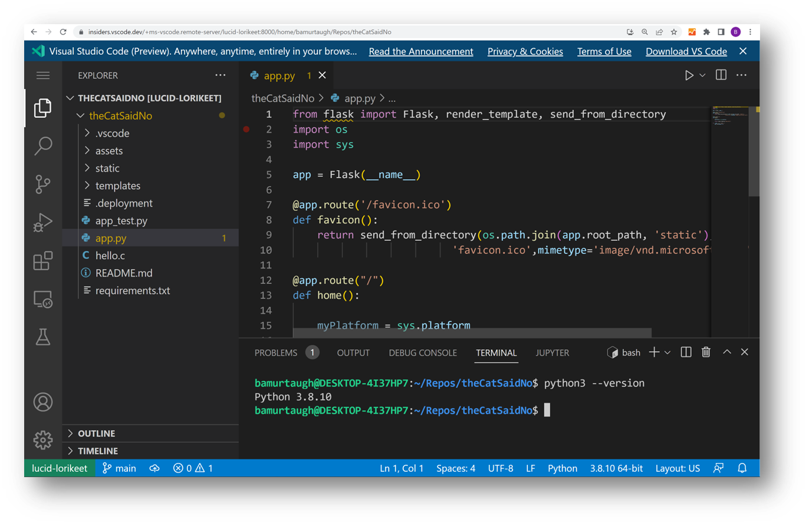

+++
title = "VS Code Server"
date = 2024-01-12T22:36:24+08:00
weight = 50
type = "docs"
description = ""
isCJKLanguage = true
draft = false
+++

> 原文: [https://code.visualstudio.com/docs/remote/vscode-server](https://code.visualstudio.com/docs/remote/vscode-server)

# Visual Studio Code Server


The Visual Studio Code Server is a service you can run on a remote development machine, like your desktop PC or a virtual machine (VM). It allows you to securely connect to that remote machine from anywhere through a local VS Code client, without the requirement of SSH.

​​	Visual Studio Code Server 是一款服务，您可以在远程开发计算机（如您的台式机或虚拟机 (VM)）上运行它。它允许您通过本地 VS Code 客户端从任何地方安全地连接到该远程计算机，而无需 SSH。

## [What is the VS Code Server? 什么是 VS Code Server？]()

In VS Code, we want users to seamlessly leverage the environments that make them the most productive. The [VS Code Remote Development extensions]() allow you to work in the Windows Subsystem for Linux (WSL), remote machines via SSH, and dev containers directly from VS Code. These extensions install a server on the remote environment, allowing local VS Code to smoothly interact with remote source code and runtimes.

​​	在 VS Code 中，我们希望用户无缝利用让他们最具生产力的环境。VS Code 远程开发扩展允许您直接从 VS Code 在 Windows 子系统 Linux (WSL)、通过 SSH 的远程计算机和开发容器中工作。这些扩展在远程环境中安装一个服务器，允许本地 VS Code 与远程源代码和运行时平滑交互。

We now provide a standalone "VS Code Server," which is a service built off the same underlying server used by the remote extensions, plus some additional functionality, like an interactive CLI and facilitating secure connections to vscode.dev.

​​	我们现在提供一个独立的“VS Code Server”，它是一个服务，由远程扩展使用的相同底层服务器构建而成，外加一些其他功能，如交互式 CLI 和促进与 vscode.dev 的安全连接。



## [Architecture 体系结构]()

We want to provide a unified VS Code experience no matter how you use the editor, whether it's local or remote, in the desktop or in the browser.

​​	无论您如何使用编辑器，无论是本地还是远程，在桌面还是在浏览器中，我们都希望提供统一的 VS Code 体验。

Access to the VS Code Server is built in to the existing [`code` CLI]().

​​	对 VS Code Server 的访问内置于现有的 `code` CLI 中。

The CLI establishes a tunnel between a VS Code client and your remote machine. Tunneling securely transmits data from one network to another.

​​	CLI 在 VS Code 客户端和远程计算机之间建立隧道。隧道传输将数据从一个网络安全地传输到另一个网络。


The VS Code Server experience includes a few components:

​​	VS Code Server 体验包括几个组件：

- The VS Code Server: Backend server that makes VS Code remote experiences possible.
  VS Code Server：使 VS Code 远程体验成为可能的后端服务器。
- [Remote - Tunnels extension](): Automatically loaded in your local VS Code client, it facilitates the connection to the remote machine.
  Remote - Tunnels 扩展：自动加载到本地 VS Code 客户端中，它有助于连接到远程计算机。

## [Scenarios 方案]()

The VS Code Server allows you to use VS Code in new ways, such as:

​​	VS Code Server 允许您以新方式使用 VS Code，例如：

- Developing on a remote machine where SSH support may be limited, or you need web-based access.
  在 SSH 支持可能受限的远程计算机上进行开发，或者您需要基于 Web 的访问权限。
- Developing on a machine that doesn't support the installation of VS Code desktop, such as an iPad / tablet or Chromebook.
  在不支持安装 VS Code 桌面版的计算机上进行开发，例如 iPad/平板电脑或 Chromebook。
- Experiencing the client-side security benefit that all code can be executed in the browser sandbox.
  体验客户端安全优势，即所有代码都可以在浏览器沙盒中执行。

## [Getting Started 入门]()

You can choose from two paths to enable tunneling, which are described in greater details in their respective docs content:

​​	您可以选择两种路径来启用隧道传输，这些路径在其各自的文档内容中都有更详细的描述：

- [Run the `tunnel` command in the `code` CLI
  在 `code` CLI 中运行 `tunnel` 命令]()
- [Enable tunneling through the VS Code UI
  通过 VS Code UI 启用隧道]()

## [Things to try 尝试操作]()

### [Licensing and other commands 许可和其他命令]()

Upon first run of the VS Code Server, you'll be prompted with the terms of the license. You can view the license for the VS Code Server [here](https://aka.ms/vscode-server-license).

​​	首次运行 VS Code Server 时，系统会提示您了解许可条款。您可以在此处查看 VS Code Server 的许可证。

```
* Visual Studio Code Server
*
* By using the software, you agree to
* the Visual Studio Code Server License Terms (https://aka.ms/vscode-server-license) and
* the Microsoft Privacy Statement (https://privacy.microsoft.com/en-US/privacystatement).
```

You can explore the CLI's other commands by running `code -h`, and specifically the tunneling commands by running `code tunnel -help`:

​​	您可以通过运行 `code -h` 来浏览 CLI 的其他命令，并通过运行 `code tunnel -help` 来浏览隧道命令：


### [Extension commands 扩展命令]()

As with the CLI, the VS Code Remote Tunnels extension has additional commands you can explore by opening the Command Palette (`F1`) in VS Code and typing **Remote Tunnels**. You may learn more in the [Remote Tunnels documentation]().

​​	与 CLI 一样，VS Code Remote Tunnels 扩展还提供其他命令，您可以在 VS Code 中打开命令面板 ( `F1` ) 并键入 Remote Tunnels 来浏览这些命令。您可以在 Remote Tunnels 文档中了解更多信息。

## [Telemetry 遥测]()

If you want to disable telemetry, you can pass in `--disable-telemetry` when launching the VS Code Server: `code tunnel --disable-telemetry`. Alternatively, if you would like to specify an initial telemetry level, such as only collecting errors, you can pass in `--telemetry-level` followed by the level (for example, `error`).

​​	如果您想禁用遥测，可以在启动 VS Code Server 时传入 `--disable-telemetry` ： `code tunnel --disable-telemetry` 。或者，如果您想指定初始遥测级别（例如仅收集错误），可以传入 `--telemetry-level` 后跟级别（例如， `error` ）。

If telemetry is not disabled via the CLI, the VS Code Server will begin respecting the client telemetry settings (your telemetry setting in vscode.dev or desktop) upon successful connection.

​​	如果未通过 CLI 禁用遥测，VS Code Server 将在连接成功后开始尊重客户端遥测设置（您在 vscode.dev 或桌面的遥测设置）。

## [Common Questions 常见问题]()

### [Is the VS Code Server designed for multiple users to access the same remote instance? VS Code Server 是否旨在让多个用户访问同一个远程实例？]()

No, an instance of the server is designed to be accessed by a single user.

​​	否，服务器的一个实例旨在供单个用户访问。

### [Can I host the VS Code Server as a service? 我是否可以将 VS Code Server 托管为一项服务？]()

No, hosting it as a service is not allowed, as specified in the [VS Code Server license](https://aka.ms/vscode-server-license).

​​	否，根据 VS Code Server 许可证的规定，不允许将其托管为一项服务。

### [Is there a list of endpoints the VS Code Server uses? VS Code Server 使用的端点列表是什么？]()

If you're working in a restricted environment, you may need to ensure the VS Code Server has access to the following endpoints:

​​	如果您在受限环境中工作，您可能需要确保 VS Code Server 可以访问以下端点：

- https://code.visualstudio.com/docs/setup/network#_common-hostnames
- https://code.visualstudio.com/docs/remote/ssh#_what-are-the-connectivity-requirements-for-the-vs-code-server-when-it-is-running-on-a-remote-machine-vm

### [Are there any other extension limitations? 还有其他扩展限制吗？]()

Pure UI extensions are not supported when using a web-based instance of VS Code, which you can learn more about in the extension authors [Remote Development](https://code.visualstudio.com/api/advanced-topics/remote-extensions#_architecture-and-extension-kinds) guide.

​​	在使用基于 Web 的 VS Code 实例时不支持纯 UI 扩展，您可以在扩展作者的远程开发指南中了解更多相关信息。

### [Are there browser limitations? 是否存在浏览器限制？]()

While working in the browser, there are certain limitations and configuration steps to consider. You can read more about this in the [VS Code for the Web]() documentation.
在浏览器中工作时，需要考虑某些限制和配置步骤。您可以在 VS Code for the Web 文档中阅读更多相关信息。

### [How can I keep the VS Code Server up-to-date? 如何使 VS Code Server 保持最新状态？]()

You will get a notification in VS Code when you connect to your remote machine if an update is available, and you'll be able to update directly through this notification.
如果存在可用更新，您在连接到远程计算机时将在 VS Code 中收到通知，并且您将能够通过此通知直接更新。

### [I see an error about keyring storage. What should I do? 我看到有关钥匙串存储的错误。我该怎么办？]()

Settings Sync requires authentication against a Settings Sync server. The corresponding secret is persisted on the server. This requires to set up a keyring on the server. When the keyring is not set up, the VS Code Server falls back to an in-memory secret stored on the server. In this case, secrets are only persisted during the lifetime of the server.
设置同步需要针对设置同步服务器进行身份验证。相应的机密保存在服务器上。这需要在服务器上设置钥匙串。当钥匙串未设置时，VS Code Server 会回退到存储在服务器上的内存中机密。在这种情况下，机密仅在服务器的生存期内保留。

[This issue](https://github.com/microsoft/vscode-remote-release/issues/8628) provides more context and may help you troubleshoot. If you're still experiencing issues, please feel free to file a new issue in the [VS Code Remote GitHub repo](https://github.com/microsoft/vscode-remote-release/issues).
此问题提供了更多背景信息，可能有助于您进行故障排除。如果您仍然遇到问题，请随时在 VS Code Remote GitHub 存储库中提交新问题。

### [Where can I provide feedback or report an issue? 我可以在哪里提供反馈或报告问题？]()

If you have any issues or feedback, please file an issue in the [VS Code Remote GitHub repo](https://github.com/microsoft/vscode-remote-release/issues). When filing an issue, include verbose logging, which you can enable by launching the VS Code Server with the `-v` flag: `code -v tunnel`.
如果您有任何问题或反馈，请在 VS Code Remote GitHub 存储库中提交问题。提交问题时，请包含详细日志记录，您可以通过使用 `-v` 标志启动 VS Code Server 来启用它： `code -v tunnel` 。

You may filter just for VS Code Server issues with the [`code-server` label](https://github.com/microsoft/vscode-remote-release/issues?q=is%3Aissue+is%3Aopen+label%3Acode-server).
您可以使用 `code-server` 标签仅筛选 VS Code Server 问题。
