+++
title = "WSL Tutorial"
date = 2024-01-12T22:36:24+08:00
weight = 80
type = "docs"
description = ""
isCJKLanguage = true
draft = false
+++

> 原文: [https://code.visualstudio.com/docs/remote/wsl-tutorial](https://code.visualstudio.com/docs/remote/wsl-tutorial)

# Remote development in WSL WSL 中的远程开发


This tutorial walks you through enabling [Windows Subsystem for Linux](https://learn.microsoft.com/windows/wsl/install) (WSL) and running Visual Studio Code in WSL using the [WSL](https://marketplace.visualstudio.com/items?itemName=ms-vscode-remote.remote-wsl) extension.

​​	本教程引导您启用适用于 Linux 的 Windows 子系统 (WSL) 并使用 WSL 扩展在 WSL 中运行 Visual Studio Code。

## [Prerequisites 先决条件]()

You need [Visual Studio Code](https://code.visualstudio.com/) installed.

​​	您需要安装 Visual Studio Code。

### [Install the extension 安装扩展]()

The WSL extension enables you to run Visual Studio Code within the Windows Subsystem for Linux (WSL).

​​	WSL 扩展使您能够在适用于 Linux 的 Windows 子系统 (WSL) 中运行 Visual Studio Code。

> [Install the WSL extension
> 安装 WSL 扩展](vscode:extension/ms-vscode-remote.remote-wsl)

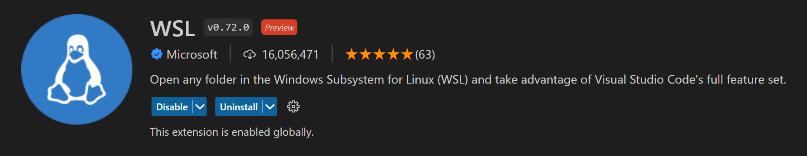

### [Prerequisite check 先决条件检查]()

With the WSL extension installed, you will see a new Status bar item at the far left.

​​	安装 WSL 扩展后，您将在最左侧看到一个新的状态栏项目。


The Remote Status bar item can quickly show you in which context VS Code is running (local or remote) and clicking on the item will bring up the WSL extension commands.

​​	“远程”状态栏项目可以快速向您显示 VS Code 在哪个上下文中运行（本地或远程），单击该项目将显示 WSL 扩展命令。

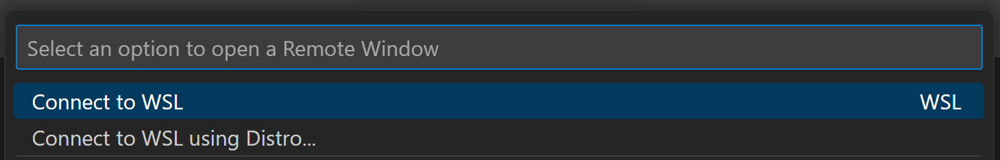

## [Enable WSL 启用 WSL]()

Windows Subsystem for Linux (WSL) is an optional feature on Windows 10. You can enable it through the Windows Features dialog or PowerShell.

​​	适用于 Linux 的 Windows 子系统 (WSL) 是 Windows 10 上的一项可选功能。您可以通过“Windows 功能”对话框或 PowerShell 启用它。

### [Windows Features dialog “Windows 功能”对话框]()

In the Windows search bar, type 'features' to bring up the **Turn Windows Features on and off** dialog. Scroll down and check **Windows Subsystem for Linux**.

​​	在 Windows 搜索栏中，键入“功能”以打开“启用或关闭 Windows 功能”对话框。向下滚动并选中“适用于 Linux 的 Windows 子系统”。


Select **OK** and you will be prompted to restart Windows.

​​	选择“确定”，系统将提示您重新启动 Windows。

### [PowerShell]()

If you prefer, you can open PowerShell as an Administrator and type:

​​	如果您愿意，可以以管理员身份打开 PowerShell 并键入：

```
Enable-WindowsOptionalFeature -Online -FeatureName Microsoft-Windows-Subsystem-Linux
```

After the command runs, you will be prompted to restart Windows.

​​	运行命令后，系统将提示您重新启动 Windows。

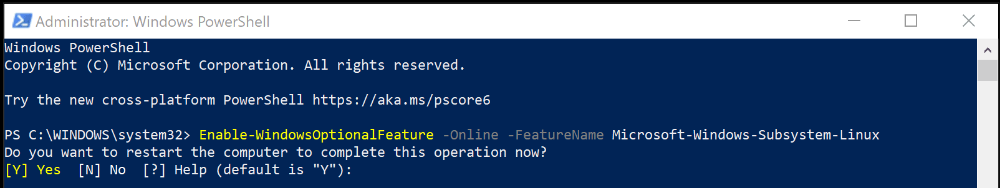

### [Check WSL 检查 WSL]()

After restarting Windows, you can check that you have WSL enabled by opening a Command Prompt and typing 'wsl'.

​​	重新启动 Windows 后，您可以通过打开命令提示符并键入“wsl”来检查您是否已启用 WSL。

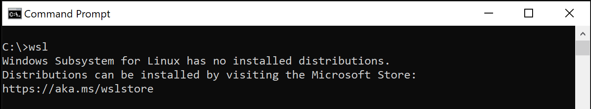

WSL is enabled, but you haven't installed a Linux distribution yet.

​​	已启用 WSL，但您尚未安装 Linux 发行版。

## [Install a Linux distro 安装 Linux 发行版]()

You install Linux distributions for WSL from the Microsoft Store. You can use the store app, or search for a Linux distro in the Windows search bar. Choose the Linux distribution you want to install (for example Ubuntu) and follow the prompts.

​​	您可以从 Microsoft Store 为 WSL 安装 Linux 发行版。您可以使用商店应用程序，或在 Windows 搜索栏中搜索 Linux 发行版。选择您要安装的 Linux 发行版（例如 Ubuntu），然后按照提示进行操作。

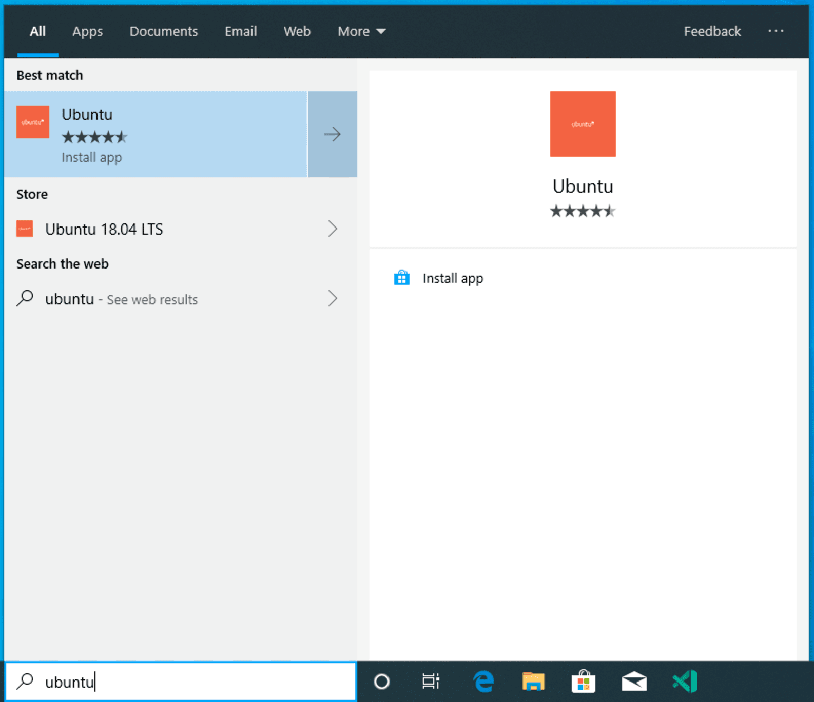

Select **Install**.

​​	选择安装。

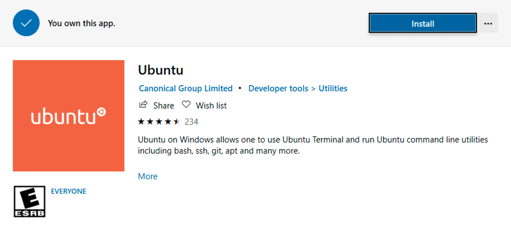

And when done, select **Launch** to get started. This will open a Linux terminal and complete the installation. You'll need to create a user ID and password since you are setting up a full Linux instance. You are now running Linux on Windows.

​​	完成后，选择启动以开始。这将打开一个 Linux 终端并完成安装。由于您正在设置一个完整的 Linux 实例，因此您需要创建一个用户 ID 和密码。您现在在 Windows 上运行 Linux。

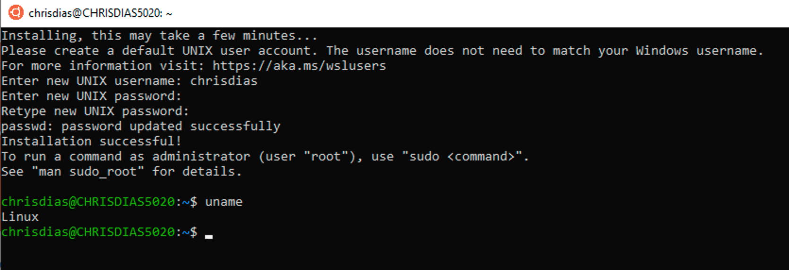

## [Python development Python 开发]()

If you don't have Python already installed, run the following commands to install Python3 and pip, the package manager for Python, into your Linux installation.

​​	如果您尚未安装 Python，请运行以下命令将 Python3 和 pip（Python 的包管理器）安装到您的 Linux 安装中。

```
sudo apt update
sudo apt install python3 python3-pip
```

And to verify, run:

​​	要验证，请运行：

```
python3 --version
```

Start with the canonical "Hello World" app. Create a new folder called "helloWorld" and then add a Python file that will print a message when run:

​​	从经典的“Hello World”应用程序开始。创建一个名为“helloWorld”的新文件夹，然后添加一个在运行时将打印消息的 Python 文件：

```
mkdir helloWorld && cd helloWorld
echo 'print("hello from python on ubuntu on windows!")' >> hello.py
python3 hello.py
```

In a remote Linux environment (this WSL distro is technically another machine without UI, that just happens to be running locally on your computer), your development tools and experiences are pretty limited. You can run [Vim](https://stackoverflow.blog/2017/05/23/stack-overflow-helping-one-million-developers-exit-vim/) in the terminal to edit your file, or you can edit the sources on the Windows side through the `\\wsl$` mount:

​​	在远程 Linux 环境中（此 WSL 发行版在技术上是另一台没有 UI 的机器，碰巧在您的计算机上本地运行），您的开发工具和体验非常有限。您可以在终端中运行 Vim 来编辑文件，或者可以通过 `\\wsl$` 挂载在 Windows 端编辑源代码：

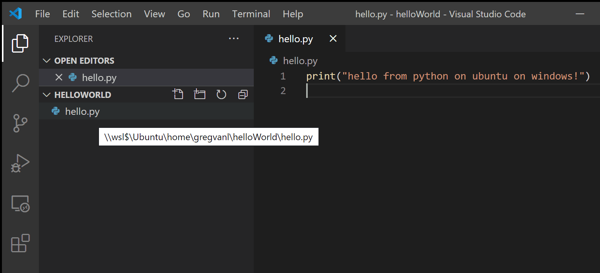

The problem with this model is that the Python runtime, pip, or any conda packages for that matter, are not installed on Windows.

​​	此模型的问题在于，Python 运行时、pip 或任何 conda 包都未安装在 Windows 上。

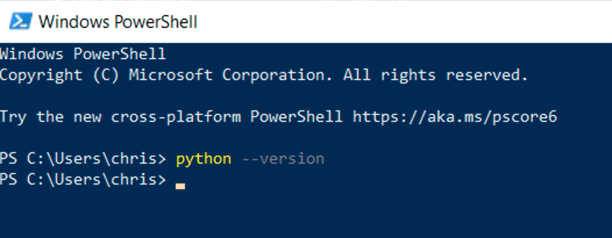

Remember, Python is installed in the Linux distro, which means if you're editing Python files on the Windows side, you can't run or debug them unless you install the same Python development stack on Windows. And that defeats the purpose of having an isolated Linux instance set up with all your Python tools and runtimes!

​​	记住，Python 已安装在 Linux 发行版中，这意味着如果您在 Windows 端编辑 Python 文件，则除非您在 Windows 上安装相同的 Python 开发堆栈，否则无法运行或调试它们。这样就违背了设置一个与所有 Python 工具和运行时隔离的 Linux 实例的目的！

## [Run in WSL 在 WSL 中运行]()

In the WSL terminal, make sure you are in the helloWorld folder, and type in `'code .'` to launch Visual Studio Code. The `'.'` argument tells VS Code to open the current folder. If you use the [Insiders](https://code.visualstudio.com/insiders) version of VS Code, you will have to run `'code-insiders .'` instead.

​​	在 WSL 终端中，确保您位于 helloWorld 文件夹中，然后键入 `'code .'` 以启动 Visual Studio Code。 `'.'` 参数告诉 VS Code 打开当前文件夹。如果您使用 VS Code 的 Insiders 版本，则必须运行 `'code-insiders .'` 。

> **Note:** If this command does not work, you may need to restart your terminal, or you may not have added VS Code to your path when it was installed.
>
> ​​	注意：如果此命令不起作用，您可能需要重新启动终端，或者您可能在安装 VS Code 时未将其添加到路径中。

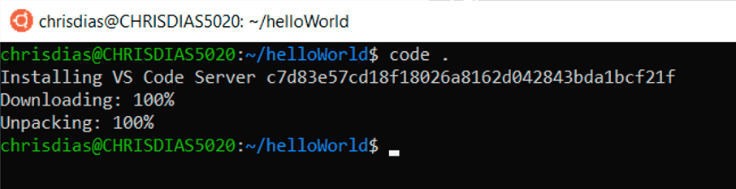

The first thing you'll see is a message about "Installing VS Code Server" (the c7d83e57… number is the version of the VS Code Server that matches the client-side tools you just installed). VS Code is installing a small server on the Linux side that the desktop VS Code will then talk to. That server will then install and host extensions in WSL, so that they run in the context of the tools and frameworks installed in WSL. In other words, your language extensions will run against the tools and frameworks installed in WSL, not against what is installed on the Windows side, as it should for the proper development experience.

​​	您会看到的第一条消息是“正在安装 VS Code Server”（c7d83e57… 是与您刚刚安装的客户端工具相匹配的 VS Code Server 版本）。VS Code 正在 Linux 端安装一个小型服务器，然后桌面 VS Code 将与该服务器通信。然后，该服务器将在 WSL 中安装并托管扩展，以便它们在 WSL 中安装的工具和框架的上下文中运行。换句话说，您的语言扩展将在 WSL 中安装的工具和框架上运行，而不是在 Windows 端安装的内容上运行，因为这才是正确的开发体验。

The next thing that happens is VS Code will start and open the `helloWorld` folder. You may see a quick notification telling you that VS Code is connecting to WSL, and you may be prompted to allow access to the Node.js-based server.

​​	接下来发生的事情是 VS Code 将启动并打开 `helloWorld` 文件夹。您可能会看到一条快速通知，告诉您 VS Code 正在连接到 WSL，并且系统可能会提示您允许访问基于 Node.js 的服务器。


Now, when you hover over `hello.py`, you get the proper Linux path.

​​	现在，当您将鼠标悬停在 `hello.py` 上时，您将获得正确的 Linux 路径。

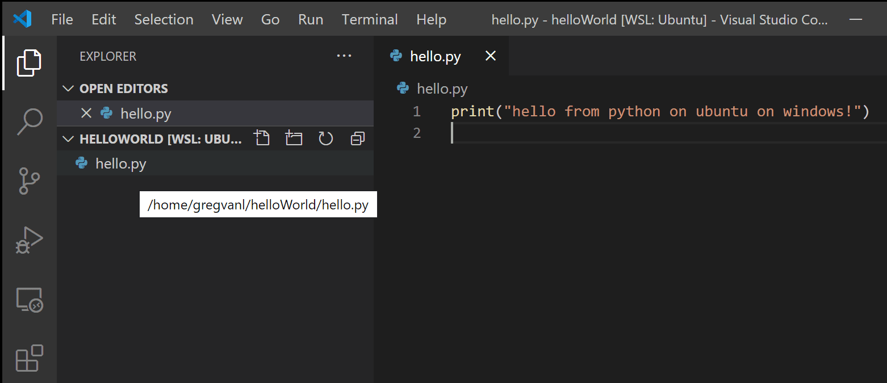

### [Integrated Terminal 集成终端]()

Run **Terminal** > **New Terminal** (Ctrl+`) to open a new terminal instance.

​​	运行终端 > 新建终端（Ctrl+`）以打开新的终端实例。

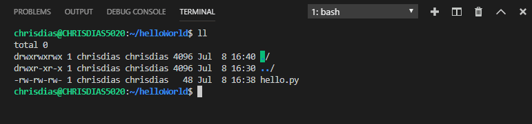

You'll start a new instance of the bash shell in WSL, again from VS Code running on Windows.

​​	您将在 WSL 中启动 bash shell 的新实例，同样是从在 Windows 上运行的 VS Code 启动的。

**Tip**: In the lower left corner of the Status Bar, you can see that you're connected to your **WSL: Ubuntu** instance.

​​	提示：在状态栏的左下角，您可以看到您已连接到您的 WSL：Ubuntu 实例。

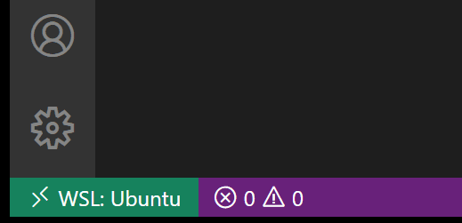

## [Edit and debug 编辑和调试]()

### [Installing the Python extension (and additional tools) 安装 Python 扩展（和附加工具）]()

Click on `hello.py` to open it for editing. You will be prompted with an extension recommendation, in this case to install the [Microsoft Python](https://marketplace.visualstudio.com/items?itemName=ms-python.python) extension, which will give you rich editing and debugging experiences. Go ahead and select **Install** and reload if prompted.

​​	单击 `hello.py` 以将其打开进行编辑。系统会提示您提供扩展建议，在本例中是安装 Microsoft Python 扩展，这将为您提供丰富的编辑和调试体验。如果出现提示，请继续选择“安装并重新加载”。

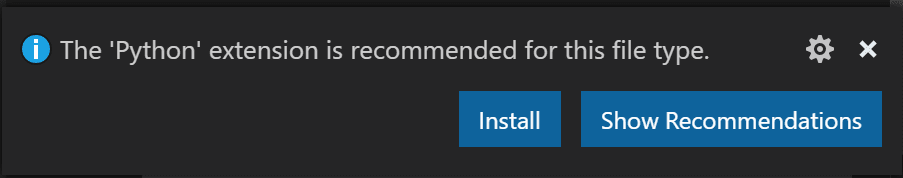

To prove that the extension is installed in WSL, open the Extensions view again (Ctrl+Shift+X). You will see a section titled **WSL: Ubuntu – Installed**, and you can see any extensions that are installed on the WSL side.

​​	要证明该扩展已安装在 WSL 中，请再次打开“扩展”视图（Ctrl+Shift+X）。您将看到一个名为 WSL：Ubuntu – 已安装的部分，并且可以看到 WSL 端安装的任何扩展。


Upon reload, you'll also get prompted telling you that the pylint linter is not installed. Linters are used to show errors and warnings in source code. Go ahead and select **Install**.

​​	重新加载后，您还会收到提示，告知您 pylint linter 未安装。Linter 用于显示源代码中的错误和警告。继续选择“安装”。


Now, when you edit your code, you get rich colorization and completions.

​​	现在，当您编辑代码时，您会获得丰富的着色和自动完成。


And when you save your file (Ctrl+S), you'll get linting errors and warnings on the file.

​​	当您保存文件（Ctrl+S）时，您会在该文件中获得 linting 错误和警告。

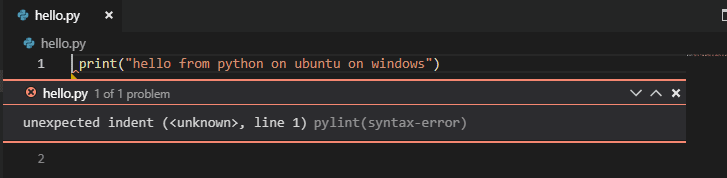

### [Debugging 调试]()

With your tools set up, let's take this one step further. Set a breakpoint on line 1 of hello.py by clicking in the gutter to the left of the line number or by putting the cursor on the line and pressing F9.

​​	在设置好工具后，让我们更进一步。通过单击行号左侧的边距或将光标放在该行上并按 F9，在 hello.py 的第 1 行设置一个断点。

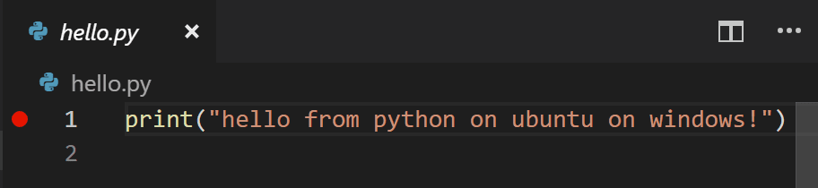

Now, press F5 to run your application. You will be asked how to run the application, and since this is a simple file, just choose **Python File**.

​​	现在，按 F5 运行您的应用程序。系统会询问您如何运行应用程序，由于这是一个简单的文件，因此只需选择“Python 文件”。按 F10 进行单步调试，您将在调试控制台中看到 print 语句的输出。


The app will start, and you'll hit the breakpoint. You can inspect variables, create watches, and navigate the call stack.

​​	该应用程序将启动，您将命中断点。您可以检查变量、创建监视并导航调用堆栈。

Press F10 to step and you'll see the output of the print statement in the debug console.

​​	您可以使用安装在 WSL 中的 Linux 实例，获得 Visual Studio Code 的完整开发体验。


You get the full development experience of Visual Studio Code, using the Linux instance installed in WSL.

​​	如果您想在 WSL 中打开另一个文件夹，请打开“文件”菜单并选择“打开文件夹”。您将获得 Linux 文件系统（而非 Windows 文件系统）的最小文件和文件夹导航器。

If you want to open another folder in WSL, open the **File** menu and choose **Open Folder**. You'll get a minimal file and folder navigator for the Linux file system, not the Windows file system.

​​	如果您想切换回 Windows，请选择“显示本地”选项，您将获得标准的 Windows 文件打开对话框。

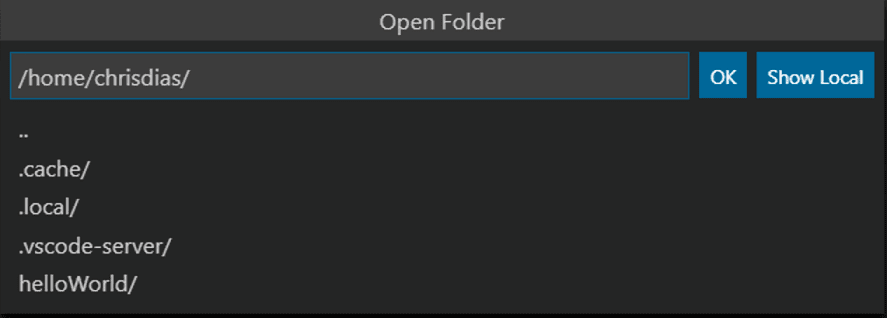

If you want to switch back to the Windows, select the **Show Local** option and you'll get the standard Windows File Open dialog.

​​	结束 WSL 连接

### [Ending your WSL connection 您可以结束在 WSL 中的会话，并通过“文件”>“关闭远程连接”返回在本地运行 VS Code。]()

You can end your session in WSL and go back to running VS Code locally with **File** > **Close Remote Connection**.

​​	启用 WSL

### [Congratulations 恭喜]()

Congratulations, you've successfully completed this tutorial!

​​	恭喜，您已成功完成本教程！

Next, check out the other Remote Development extensions.

​​	接下来，查看其他远程开发扩展。

- [Remote - SSH](https://marketplace.visualstudio.com/items?itemName=ms-vscode-remote.remote-ssh)
- [Dev Containers
  开发容器](https://marketplace.visualstudio.com/items?itemName=ms-vscode-remote.remote-containers)

Or get them all by installing the [Remote Development](https://marketplace.visualstudio.com/items?itemName=ms-vscode-remote.vscode-remote-extensionpack) Extension Pack.

​​	或通过安装远程开发扩展包获取所有扩展。
