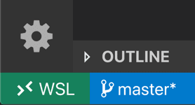

+++
title = "Windows Subsystem for Linux"
date = 2024-01-12T22:36:24+08:00
weight = 30
type = "docs"
description = ""
isCJKLanguage = true
draft = false
+++

> 原文: [https://code.visualstudio.com/docs/remote/wsl](https://code.visualstudio.com/docs/remote/wsl)

# Developing in WSL 在 WSL 中开发


The **Visual Studio Code WSL** extension lets you use the [Windows Subsystem for Linux (WSL)](https://learn.microsoft.com/windows/wsl) as your full-time development environment right from VS Code. You can develop in a Linux-based environment, use Linux-specific toolchains and utilities, and run and debug your Linux-based applications all from the comfort of Windows.

​​	Visual Studio Code WSL 扩展程序可让你直接从 VS Code 将 Windows 子系统用于 Linux (WSL) 作为你的全职开发环境。你可以在基于 Linux 的环境中进行开发，使用特定于 Linux 的工具链和实用工具，以及运行和调试基于 Linux 的应用程序，所有这些都可以在 Windows 的舒适环境中完成。

The extension runs commands and other extensions directly in WSL so you can edit files located in WSL or the mounted Windows filesystem (for example `/mnt/c`) without worrying about pathing issues, binary compatibility, or other cross-OS challenges.

​​	该扩展程序直接在 WSL 中运行命令和其他扩展程序，因此你可以编辑位于 WSL 或已装载的 Windows 文件系统（例如 `/mnt/c` ）中的文件，而无需担心路径问题、二进制兼容性或其他跨操作系统挑战。


This lets VS Code provide a **local-quality development experience** — including full IntelliSense (completions), code navigation, and debugging — **regardless of where your code is hosted**.

​​	这使得 VS Code 能够提供本地质量的开发体验——包括完整的 IntelliSense（完成）、代码导航和调试——无论你的代码托管在何处。

## [Getting started 入门](https://code.visualstudio.com/docs/remote/wsl#_getting-started)

**Note**: After reviewing this topic, you can get started with the introductory [WSL tutorial](https://code.visualstudio.com/docs/remote/wsl-tutorial).

​​	注意：在阅读完本主题后，你可以开始使用 WSL 入门教程。

### [Installation 安装](https://code.visualstudio.com/docs/remote/wsl#_installation)

To get started, you need to:

​​	要开始，您需要：

1. Install the [Windows Subsystem for Linux](https://learn.microsoft.com/windows/wsl/install) along with your preferred Linux distribution.

   ​​	安装 Windows 子系统用于 Linux 以及你首选的 Linux 发行版。

   > **Note:** WSL 1 does have some [known limitations](https://code.visualstudio.com/docs/remote/wsl#_known-limitations) for certain types of development. Also, extensions installed in Alpine Linux may not work due to `glibc` dependencies in native source code inside the extension. See the [Remote Development and Linux](https://aka.ms/vscode-remote/linux) article for details.
   >
   > ​​	注意：WSL 1 确实有一些已知的限制，适用于某些类型的开发。此外，由于扩展程序内部的本机源代码中的 `glibc` 依赖项，在 Alpine Linux 中安装的扩展程序可能无法工作。有关详细信息，请参阅远程开发和 Linux 文章。

2. Install [Visual Studio Code](https://code.visualstudio.com/) on the **Windows** side (not in WSL).

   ​​	在 Windows 端（不在 WSL 中）安装 Visual Studio Code。

   > **Note:** When prompted to **Select Additional Tasks** during installation, be sure to check the **Add to PATH** option so you can easily open a folder in WSL using the `code` command.
   >
   > ​​	注意：在安装过程中出现提示“选择其他任务”时，务必选中“添加到 PATH”选项，以便您可以使用 `code` 命令轻松地在 WSL 中打开文件夹。

3. Install the [WSL extension](https://marketplace.visualstudio.com/items?itemName=ms-vscode-remote.remote-wsl). If you plan to work with other remote extensions in VS Code, you may choose to install the [Remote Development extension pack](https://aka.ms/vscode-remote/download/extension).

   ​​	安装 WSL 扩展。如果您计划在 VS Code 中使用其他远程扩展，可以选择安装远程开发扩展包。

### [Open a remote folder or workspace 打开远程文件夹或工作区](https://code.visualstudio.com/docs/remote/wsl#_open-a-remote-folder-or-workspace)

#### [From the WSL terminal 从 WSL 终端](https://code.visualstudio.com/docs/remote/wsl#_from-the-wsl-terminal)

Opening a folder inside the Windows Subsystem for Linux in VS Code is very similar to opening up a Windows folder from the command prompt or PowerShell.

​​	在 VS Code 中打开 Linux 的 Windows 子系统中的文件夹与从命令提示符或 PowerShell 中打开 Windows 文件夹非常相似。

1. Open a **WSL terminal window** (using the start menu item or by typing `wsl` from a command prompt / PowerShell).

   ​​	打开 WSL 终端窗口（使用开始菜单项或从命令提示符/PowerShell 中键入 `wsl` ）。

2. Navigate to a folder you'd like to open in VS Code (including, but not limited to, Windows filesystem mounts like `/mnt/c`)

   ​​	导航到您想在 VS Code 中打开的文件夹（包括但不限于 Windows 文件系统装入点，如 `/mnt/c` ）

3. Type **`code .`** in the terminal. When doing this for the first time, you should see VS Code fetching components needed to run in WSL. This should only take a short while, and is only needed once.

   ​​	在终端中键入 `code .` 。首次执行此操作时，您应该会看到 VS Code 正在获取在 WSL 中运行所需的组件。这应该只需要很短的时间，并且只需要执行一次。

   > **Note:** If this command does not work, you may need to restart your terminal or you may not have added VS Code to your path when it was installed.
   >
   > ​​	注意：如果此命令不起作用，您可能需要重新启动终端，或者您可能在安装 VS Code 时未将其添加到您的路径中。

4. After a moment, a new VS Code window will appear, and you'll see a notification that VS Code is opening the folder in WSL.

   ​​	片刻之后，将出现一个新的 VS Code 窗口，您会看到一条通知，提示 VS Code 正在 WSL 中打开文件夹。

   

   VS Code will now continue to configure itself in WSL and keep you up to date as it makes progress.

   ​​	VS Code 现在将继续在 WSL 中配置自身，并在取得进展时让您随时了解情况。

5. Once finished, you now see a WSL indicator in the bottom left corner, and you'll be able to use VS Code as you would normally!

   ​​	完成后，您现在会在左下角看到一个 WSL 指示符，您将能够像往常一样使用 VS Code！

   

That's it! Any VS Code operations you perform in this window will be executed in the WSL environment, everything from editing and file operations, to debugging, using terminals, and more.

​​	就是这样！您在此窗口中执行的任何 VS Code 操作都将在 WSL 环境中执行，从编辑和文件操作到调试、使用终端等，所有操作均可执行。

#### [From VS Code 从 VS Code](https://code.visualstudio.com/docs/remote/wsl#_from-vs-code)

Alternatively, you can open a WSL window directly from VS Code:

​​	或者，您可以直接从 VS Code 打开 WSL 窗口：

1. Start VS Code.
   启动 VS Code。
2. Press F1, select **WSL: Connect to WSL** for the default distro or **WSL: Connect to WSL using Distro** for a specific distro.
   按 F1，选择 WSL：连接到默认发行版的 WSL 或 WSL：使用发行版连接到 WSL 以获取特定发行版。
3. Use the File menu to open your folder.
   使用“文件”菜单打开您的文件夹。

If you already have a folder open, you can also use the **WSL: Reopen Folder in WSL** command. You will be prompted which distro to use.

​​	如果您已经打开了一个文件夹，您还可以使用 WSL：在 WSL 中重新打开文件夹命令。系统将提示您使用哪个发行版。

If you are in a WSL window and want to open the current input in a local window, use **WSL: Reopen in Windows**.

​​	如果您在 WSL 窗口中，并且想要在本地窗口中打开当前输入，请使用 WSL：在 Windows 中重新打开。

#### [From the Windows command prompt 从 Windows 命令提示符](https://code.visualstudio.com/docs/remote/wsl#_from-the-windows-command-prompt)

To open a WSL window directly from a Windows prompt use the `--remote` command line parameter:

​​	要直接从 Windows 提示符打开 WSL 窗口，请使用 `--remote` 命令行参数：

```
code --remote wsl+<distro name> <path in WSL>
```

for example: `code --remote wsl+Ubuntu /home/jim/projects/c`

​​	例如： `code --remote wsl+Ubuntu /home/jim/projects/c`

We need to do some guessing on whether the input path is a file or a folder. If it has a file extension, it is considered a file.

​​	我们需要猜测输入路径是文件还是文件夹。如果它具有文件扩展名，则认为它是一个文件。

To force that a folder is opened, add slash to the path or use:

​​	要强制打开文件夹，请在路径中添加斜杠或使用：

```
code --folder-uri vscode-remote://wsl+Ubuntu/home/ubuntu/folder.with.dot
```

To force that a file is opened add `--goto` or use:

​​	要强制打开文件，请添加 `--goto` 或使用：

```
code --file-uri vscode-remote://wsl+Ubuntu/home/ubuntu/fileWithoutExtension
```

## [Working with Git 使用 Git](https://code.visualstudio.com/docs/remote/wsl#_working-with-git)

If you are working with the same repository in WSL and Windows, be sure to set up consistent line endings. See [tips and tricks](https://code.visualstudio.com/docs/remote/troubleshooting#_resolving-git-line-ending-issues-in-wsl-resulting-in-many-modified-files) for details.

​​	如果您在 WSL 和 Windows 中使用同一个存储库，请务必设置一致的行尾。有关详细信息，请参阅提示和技巧。

You can also avoid passwords by configuring WSL to use the Windows Git credential manager. See [tips and tricks](https://code.visualstudio.com/docs/remote/troubleshooting#_sharing-git-credentials-between-windows-and-wsl) for details.

​​	您还可以通过将 WSL 配置为使用 Windows Git 凭据管理器来避免使用密码。有关详细信息，请参阅提示和技巧。

## [Managing extensions 管理扩展](https://code.visualstudio.com/docs/remote/wsl#_managing-extensions)

VS Code runs extensions in one of two places: locally on the UI / client side, or in WSL. While extensions that affect the VS Code UI, like themes and snippets, are installed locally, most extensions will reside inside WSL.

​​	VS Code 在两个位置之一运行扩展：本地 UI/客户端或 WSL。虽然影响 VS Code UI 的扩展（如主题和代码段）是本地安装的，但大多数扩展将驻留在 WSL 中。

If you install an extension from the Extensions view, it will automatically be installed in the correct location. Once installed, you can tell where an extension is installed based on the category grouping. There will be **Local - Installed** category and one for WSL.

​​	如果您从“扩展”视图安装扩展，它将自动安装在正确的位置。安装后，您可以根据类别分组来判断扩展安装在何处。将有一个“本地 - 已安装”类别和一个适用于 WSL 的类别。


> **Note:** If you are an extension author and your extension is not working properly or installs in the wrong place, see [Supporting Remote Development](https://code.visualstudio.com/api/advanced-topics/remote-extensions) for details.
>
> ​​	注意：如果您是扩展作者，并且您的扩展无法正常工作或安装在错误的位置，请参阅支持远程开发以了解详细信息。

Local extensions that actually need to run remotely will appear dimmed and disabled in the **Local - Installed** category. Select **Install** to install an extension on your remote host.

​​	实际上需要远程运行的本地扩展将在“本地 - 已安装”类别中显示为灰显和禁用状态。选择“安装”以在您的远程主机上安装扩展。


You can also install all locally installed extensions inside WSL by going to the Extensions view and selecting **Install Local Extensions in WSL: {Name}** using the cloud button at the right of the **Local - Installed** title bar. This will display a dropdown where you can select which locally installed extensions to install in your WSL instance.

​​	您还可以通过转到“扩展”视图并使用“本地 - 已安装”标题栏右侧的云按钮选择“在 WSL 中安装本地扩展：{名称}”来安装 WSL 中的所有本地安装扩展。这将显示一个下拉列表，您可以在其中选择要在 WSL 实例中安装的本地安装扩展。


## [Opening a terminal in WSL 在 WSL 中打开终端](https://code.visualstudio.com/docs/remote/wsl#_opening-a-terminal-in-wsl)

Opening a terminal in WSL from VS Code is simple. Once folder is opened in WSL, **any terminal window** you open in VS Code (**Terminal > New Terminal**) will automatically run in WSL rather than locally.

​​	从 VS Code 在 WSL 中打开终端很简单。在 WSL 中打开文件夹后，您在 VS Code 中打开的任何终端窗口（终端 > 新建终端）都将自动在 WSL 中运行，而不是本地运行。

You can also use the `code` command line from this same terminal window to perform a number of operations such as opening a new file or folder in WSL. Type `code --help` to see what options are available from the command line.

​​	您还可以从同一个终端窗口使用 `code` 命令行来执行许多操作，例如在 WSL 中打开新文件或文件夹。键入 `code --help` 以查看命令行中可用的选项。


## [Debugging in WSL 在 WSL 中调试](https://code.visualstudio.com/docs/remote/wsl#_debugging-in-wsl)

Once you've opened a folder in WSL, you can use VS Code's debugger in the same way you would when running the application locally. For example, if you select a launch configuration in `launch.json` and start debugging (F5), the application will start on remote host and attach the debugger to it.

​​	在 WSL 中打开文件夹后，您可以像在本地运行应用程序时一样使用 VS Code 的调试器。例如，如果您在 `launch.json` 中选择启动配置并开始调试 (F5)，应用程序将在远程主机上启动并将调试器附加到它。

See the [debugging](https://code.visualstudio.com/docs/editor/debugging) documentation for details on configuring VS Code's debugging features in `.vscode/launch.json`.

​​	有关在 `.vscode/launch.json` 中配置 VS Code 的调试功能的详细信息，请参阅调试文档。

## [WSL specific settings WSL 特定设置](https://code.visualstudio.com/docs/remote/wsl#_wsl-specific-settings)

VS Code's local user settings are also reused when you have opened a folder in WSL. While this keeps your user experience consistent, you may want to vary some of these settings between your local machine and WSL. Fortunately, once you have connected to WSL, you can also set WSL specific settings by running the **Preferences: Open Remote Settings** command from the Command Palette (F1) or by selecting the **Remote** tab in the Settings editor. These will override any local settings you have in place whenever you open a folder in WSL.

​​	在 WSL 中打开文件夹时，VS Code 的本地用户设置也会被重新使用。虽然这保持了用户体验的一致性，但您可能希望在本地计算机和 WSL 之间改变其中一些设置。幸运的是，一旦连接到 WSL，您还可以通过从命令面板 (F1) 运行首选项：打开远程设置命令或在设置编辑器中选择远程选项卡来设置 WSL 特定设置。无论何时在 WSL 中打开文件夹，这些设置都会覆盖您设置的任何本地设置。

## [Advanced: Environment setup script 高级：环境设置脚本](https://code.visualstudio.com/docs/remote/wsl#_advanced-environment-setup-script)

When VS Code Remote is started in WSL, no shell startup scripts are run. This was done to avoid issues with startup scripts that are tuned for shells. If you want to run additional commands or modify the environment this can be done in a setup script `~/.vscode-server/server-env-setup` (Insiders: `~/.vscode-server-insiders/server-env-setup`). If present, the script is processed before the server is started.

​​	在 WSL 中启动 VS Code Remote 时，不会运行任何 shell 启动脚本。这样做是为了避免与针对 shell 调整的启动脚本出现问题。如果您想运行其他命令或修改环境，可以在设置脚本 `~/.vscode-server/server-env-setup` 中完成此操作（Insider： `~/.vscode-server-insiders/server-env-setup` ）。如果存在，该脚本将在服务器启动之前进行处理。

The script needs to be a valid Bourne shell script. Be aware that an invalid script will prevent the server from starting up. If you end up with a script that prevents the server from starting, you will have to use a regular WSL shell and delete or rename the setup script.

​​	该脚本需要是一个有效的 Bourne shell 脚本。请注意，无效的脚本将阻止服务器启动。如果您最终得到一个阻止服务器启动的脚本，您将必须使用常规 WSL shell 并删除或重命名设置脚本。

Check the WSL log (**WSL: Show Log**) for output and errors.

​​	检查 WSL 日志（WSL：显示日志）以获取输出和错误。

## [Advanced: Opening a WSL 2 folder in a container 高级：在容器中打开 WSL 2 文件夹](https://code.visualstudio.com/docs/remote/wsl#_advanced-opening-a-wsl-2-folder-in-a-container)

If you are using WSL 2 and [Docker Desktop's WSL 2 back-end](https://docs.docker.com/docker-for-windows/wsl-tech-preview/), you can use the [Dev Containers](https://code.visualstudio.com/docs/devcontainers/containers) extension to work with source code stored inside WSL! Just follow these steps:

​​	如果您使用的是 WSL 2 和 Docker Desktop 的 WSL 2 后端，则可以使用 Dev Containers 扩展来处理存储在 WSL 中的源代码！只需按照以下步骤操作：

1. If you have not already, [install and setup](https://docs.docker.com/docker-for-windows/wsl-tech-preview/) Docker Desktop's WSL 2 support.

   ​​	如果您尚未安装和设置 Docker Desktop 的 WSL 2 支持，请执行此操作。

   > **Tip:** Go to **Settings > Resources > WSL Integration** and enable Docker integration with the WSL distribution you will be using.
   >
   > ​​	提示：转到“设置”>“资源”>“WSL 集成”，并启用与您将使用的 WSL 发行版的 Docker 集成。

2. If you have not already, install the [Dev Containers](https://aka.ms/vscode-remote/download/containers) extension along with the WSL extension.

   ​​	如果您尚未安装，请安装 Dev Containers 扩展和 WSL 扩展。

3. Next, [open your source code folder in WSL](https://code.visualstudio.com/docs/remote/wsl#_open-a-remote-folder-or-workspace) as you would normally.

   ​​	接下来，像往常一样在 WSL 中打开源代码文件夹。

4. Once your folder is open in WSL, select **Dev Containers: Reopen in Container** from the Command Palette (F1).

   ​​	在 WSL 中打开文件夹后，从命令面板 (F1) 中选择“开发容器：在容器中重新打开”。

5. If the folder does not have a `.devcontainer/devcontainer.json` file in it, you'll be asked to pick a starting point from a filterable list or an existing [Dockerfile](https://docs.docker.com/engine/reference/builder/) or [Docker Compose file](https://docs.docker.com/compose/compose-file/#compose-file-structure-and-examples) (if one exists).

   ​​	如果文件夹中没有 `.devcontainer/devcontainer.json` 文件，系统会要求您从可筛选列表或现有 Dockerfile 或 Docker Compose 文件（如果存在）中选择一个起点。

   

6. The VS Code window (instance) will reload and start building the dev container. A progress notification provides status updates.

   ​​	VS Code 窗口（实例）将重新加载并开始构建开发容器。进度通知会提供状态更新。

   

7. After the build completes, VS Code will automatically connect to the container. You can now work with the your source code from inside the container.

   ​​	构建完成后，VS Code 将自动连接到容器。您现在可以从容器内部处理源代码。

See the [Dev Containers documentation](https://code.visualstudio.com/docs/devcontainers/containers) for more information.

​​	有关详细信息，请参阅开发容器文档。

## [Known limitations 已知限制](https://code.visualstudio.com/docs/remote/wsl#_known-limitations)

This section contains a list of common know issues with WSL. The intent is not to provide a complete list of issues but to highlight some of the common problems seen with WSL.

​​	本部分列出了 WSL 中常见的已知问题。其目的不是提供完整的问题列表，而是突出显示 WSL 中常见的一些问题。

See [here for a list of active issues](https://aka.ms/vscode-remote/wsl/issues) related to WSL.

​​	在此处查看与 WSL 相关的活动问题列表。

### [I see EACCES: permission denied error trying to rename a folder in the open workspace in WSL 1 我看到 EACCES：尝试在 WSL 1 中重命名打开的工作区中的文件夹时出现权限被拒绝错误](https://code.visualstudio.com/docs/remote/wsl#_i-see-eacces-permission-denied-error-trying-to-rename-a-folder-in-the-open-workspace-in-wsl-1)

That's a known problem with the WSL file system implementation ([Microsoft/WSL#3395](https://github.com/microsoft/WSL/issues/3395), [Microsoft/WSL#1956](https://github.com/microsoft/WSL/issues/1956)) caused by the file watcher active by VSCode. The issue will only be fixed in WSL 2.

​​	这是 WSL 文件系统实现（Microsoft/WSL#3395、Microsoft/WSL#1956）的一个已知问题，由 VSCode 激活的文件观察程序导致。此问题仅在 WSL 2 中修复。

To avoid the issue, set `remote.WSL.fileWatcher.polling` to true. However, polling based file watching has a performance impact for large workspaces.

​​	要避免此问题，请将 `remote.WSL.fileWatcher.polling` 设置为 true。但是，基于轮询的文件监视会对大型工作区产生性能影响。

For large workspace you want to increase the polling interval: `remote.WSL.fileWatcher.pollingInterval` and control the folders that are watched: `files.watcherExclude`.

​​	对于大型工作区，您需要增加轮询间隔： `remote.WSL.fileWatcher.pollingInterval` 并控制受监视的文件夹： `files.watcherExclude` 。

[WSL 2](https://learn.microsoft.com/windows/wsl/compare-versions#whats-new-in-wsl-2) does not have that file watcher problem is also not affected by the new setting.

​​	WSL 2 没有该文件监视器问题，也不会受到新设置的影响。

### [Golang in WSL 1 WSL 1 中的 Golang](https://code.visualstudio.com/docs/remote/wsl#_golang-in-wsl-1)

| Issue 问题                                                   | Existing issues 现有问题                                     |
| :----------------------------------------------------------- | :----------------------------------------------------------- |
| Delve debugger doesn't work under WSL Delve 调试器在 WSL 下不起作用 | [go-delve/delve#810](https://github.com/go-delve/delve/issues/810), [Microsoft/vscode-go#926](https://github.com/microsoft/vscode-go/issues/926) go-delve/delve#810、Microsoft/vscode-go#926 |

### [Node.js in WSL 1 WSL 1 中的 Node.js](https://code.visualstudio.com/docs/remote/wsl#_nodejs-in-wsl-1)

| Issue 问题                                                   | Existing issues 现有问题                                     |
| :----------------------------------------------------------- | :----------------------------------------------------------- |
| NodeJS Error: spawn EACCES (different variants of this error) NodeJS 错误：spawn EACCES（此错误的不同变体） | [Microsoft/WSL#3886](https://github.com/microsoft/WSL/issues/3886) |
| Webpack HMR not working Webpack HMR 不起作用                 | [Microsoft/WSL#2709](https://github.com/microsoft/WSL/issues/2709) |
| Firebase via node unusably slow only on WSL 仅在 WSL 上通过节点的 Firebase 慢得无法使用 | [Microsoft/WSL#2657](https://github.com/microsoft/WSL/issues/2657) |

### [Git limitations Git 限制](https://code.visualstudio.com/docs/remote/wsl#_git-limitations)

If you clone a Git repository using SSH and your SSH key has a passphrase, VS Code's pull and sync features may hang when running remotely. Either use an SSH key without a passphrase, clone using HTTPS, or run `git push` from the command line to work around the issue.

​​	如果您使用 SSH 克隆 Git 存储库，并且您的 SSH 密钥有密码，则在远程运行时 VS Code 的拉取和同步功能可能会挂起。使用没有密码的 SSH 密钥，使用 HTTPS 克隆，或从命令行运行 `git push` 来解决此问题。

### [Docker Extension limitations Docker 扩展限制](https://code.visualstudio.com/docs/remote/wsl#_docker-extension-limitations)

While the Docker extension can run both remotely and locally, if it is already installed locally, you will be unable to install on a remote SSH host without first uninstalling it locally. We will address this problem in a future VS Code release.

​​	虽然 Docker 扩展可以在远程和本地运行，但如果已在本地安装，则在不先在本地卸载的情况下，您将无法在远程 SSH 主机上安装。我们将在未来的 VS Code 版本中解决此问题。

### [Extension limitations 扩展限制](https://code.visualstudio.com/docs/remote/wsl#_extension-limitations)

Many extensions will work in WSL without modification. However, in some cases, certain features may require changes. If you run into an extension issue, see [here for a summary of common problems and solutions](https://code.visualstudio.com/docs/remote/troubleshooting#_extension-tips) that you can mention to the extension author when reporting the issue.

​​	许多扩展将在 WSL 中运行而无需修改。但是，在某些情况下，某些功能可能需要更改。如果您遇到扩展问题，请参阅此处以了解常见问题和解决方案的摘要，您可以在报告问题时向扩展作者提及这些摘要。

In addition, some extensions installed in an WSL when using an Alpine Linux-based distribution may not work due to `glibc` dependencies in native code inside the extension. See the [Remote Development with Linux](https://code.visualstudio.com/docs/remote/linux) article for details.

​​	此外，由于扩展中本机代码中的 `glibc` 依赖项，在使用基于 Alpine Linux 的发行版时，在 WSL 中安装的某些扩展可能无法工作。有关详细信息，请参阅使用 Linux 进行远程开发一文。

## [Common questions 常见问题](https://code.visualstudio.com/docs/remote/wsl#_common-questions)

### [Why am I asked to change the default distro? 为什么要求我更改默认发行版？](https://code.visualstudio.com/docs/remote/wsl#_why-am-i-asked-to-change-the-default-distro)

When using **WSL: Connect to WSL using Distro** and running on WSL older than Windows 10, May 2019 Update (version 1903) you will be asked to switch the **default distribution** as the WSL command can only work on the default distro as it does not support the `-d` option yet.

​​	在使用 WSL 时：使用发行版连接到 WSL 并运行早于 Windows 10 2019 年 5 月更新（版本 1903）的 WSL，系统会要求您切换默认发行版，因为 WSL 命令只能在默认发行版上运行，因为它尚不支持 `-d` 选项。

You can always manually switch the default distro by using [wslconfig.exe](https://learn.microsoft.com/windows/wsl/wsl-config).

​​	您始终可以使用 wslconfig.exe 手动切换默认发行版。

For example:

​​	例如：

```
wslconfig /setdefault Ubuntu
```

You can see which distributions you have installed using:

​​	您可以使用以下命令查看已安装的发行版：

```
wslconfig /l
```

### [I'm seeing an error about a missing library or dependency 我看到有关缺少库或依赖项的错误](https://code.visualstudio.com/docs/remote/wsl#_im-seeing-an-error-about-a-missing-library-or-dependency)

Some extensions rely on libraries not found in the vanilla install of certain WSL Linux distributions. You can add additional libraries into your Linux distribution by using its package manager. For Ubuntu and Debian based distributions, run `sudo apt-get install <package>` to install the needed libraries. Check the documentation for your extension or the runtime that is mentioned for additional installation details.

​​	某些扩展依赖于在某些 WSL Linux 发行版的原始安装中找不到的库。您可以使用其软件包管理器向 Linux 发行版中添加其他库。对于基于 Ubuntu 和 Debian 的发行版，运行 `sudo apt-get install <package>` 以安装所需的库。查看扩展的文档或提到的运行时以获取其他安装详细信息。

### [What are the connectivity requirements for the WSL extension? WSL 扩展的连接要求是什么？](https://code.visualstudio.com/docs/remote/wsl#_what-are-the-connectivity-requirements-for-the-wsl-extension)

The WSL extension and VS Code Server require outbound HTTPS (port 443) connectivity to:

​​	WSL 扩展和 VS Code Server 需要与以下内容建立出站 HTTPS（端口 443）连接：

- `update.code.visualstudio.com`
- `marketplace.visualstudio.com`
- `vscode.blob.core.windows.net`
- `*.vo.msecnd.net` (Azure CDN)
  `*.vo.msecnd.net` （Azure CDN）
- `*.gallerycdn.vsassets.io` (Azure CDN)
  `*.gallerycdn.vsassets.io` （Azure CDN）

Some extensions (like C#) download secondary dependencies from `download.microsoft.com` or `download.visualstudio.microsoft.com`. Others (like [Visual Studio Live Share](https://learn.microsoft.com/visualstudio/liveshare/reference/connectivity#requirements-for-connection-modes)) may have additional connectivity requirements. Consult the extension's documentation for details if you run into trouble.

​​	某些扩展（如 C#）从 `download.microsoft.com` 或 `download.visualstudio.microsoft.com` 下载辅助依赖项。其他扩展（如 Visual Studio Live Share）可能具有其他连接要求。如果您遇到问题，请参阅扩展的文档以了解详细信息。

All other communication between the server and the VS Code client is accomplished through an random local TCP port. You can find a list of locations VS Code itself needs access to in the [network connections article](https://code.visualstudio.com/docs/setup/network#_common-hostnames).

​​	服务器与 VS Code 客户端之间的所有其他通信都是通过随机本地 TCP 端口完成的。您可以在网络连接一文中找到 VS Code 本身需要访问的位置列表。

### [I'm behind a proxy and have connectivity issues 我处于代理后面并且存在连接问题](https://code.visualstudio.com/docs/remote/wsl#_im-behind-a-proxy-and-have-connectivity-issues)

Proxy settings might be missing on either the Windows or the WSL side.

​​	Windows 或 WSL 端可能缺少代理设置。

When a remote window is opened out of VSCode, the WSL extension tries to download the VSCode server on the Windows side. It therefore uses the Window side proxy configuration:

​​	当从 VSCode 外部打开远程窗口时，WSL 扩展会尝试在 Windows 端下载 VSCode 服务器。因此，它使用 Windows 端代理配置：

- inherited from the OS settings
  继承自操作系统设置
- as described in [Network Connections in Visual Studio Code](https://code.visualstudio.com/docs/setup/network)
  如 Visual Studio Code 中的网络连接所述

When the remote VSCode is started from a WSL terminal, the download is done using `wget` in the WSL distro. Proxy settings can be configured in:

​​	当从 WSL 终端启动远程 VSCode 时，下载是使用 WSL 发行版中的 `wget` 完成的。可以在以下位置配置代理设置：

- wget proxy settings: https://stackoverflow.com/questions/11211705/how-to-set-proxy-for-wget
  wget 代理设置：https://stackoverflow.com/questions/11211705/how-to-set-proxy-for-wget
- manually in the [server setup script](https://code.visualstudio.com/docs/remote/wsl#_advanced-environment-setup-script)
  在服务器设置脚本中手动

Once the server is up and running the proxy settings on the *Remote* tab are used.

​​	服务器启动并运行后，将使用“远程”选项卡上的代理设置。

### [Can I force an extension to run locally / remotely ? 我可以强制扩展在本地/远程运行吗？](https://code.visualstudio.com/docs/remote/wsl#_can-i-force-an-extension-to-run-locally-remotely-)

Extensions are typically designed and tested to either run locally or remotely, not both. However, if an extension supports it, you can force it to run in a particular location in your `settings.json` file.

​​	扩展通常被设计和测试为在本地或远程运行，而不是两者兼而有之。但是，如果扩展支持，您可以在 `settings.json` 文件中强制它在特定位置运行。

For example, the setting below will force the [Docker](https://marketplace.visualstudio.com/items?itemName=ms-azuretools.vscode-docker) extension to run locally and [Remote - SSH: Editing Configuration Files](https://marketplace.visualstudio.com/items?itemName=ms-vscode-remote.remote-ssh-edit) extension to run remotely instead of their defaults:

​​	例如，以下设置将强制 Docker 扩展在本地运行，而远程 - SSH：编辑配置文件扩展在远程运行，而不是其默认设置：

```
"remote.extensionKind": {
    "ms-azuretools.vscode-docker": [ "ui" ],
    "ms-vscode-remote.remote-ssh-edit": [ "workspace" ]
}
```

A value of `"ui"` instead of `"workspace"` will force the extension to run on the local UI/client side instead. Typically, this should only be used for testing unless otherwise noted in the extension's documentation since it **can break extensions**. See the article on [Supporting Remote Development](https://code.visualstudio.com/api/advanced-topics/remote-extensions) for details.

​​	使用 `"ui"` 值而不是 `"workspace"` 值将强制扩展在本地 UI/客户端上运行。通常，除非扩展的文档中另有说明，否则仅应将其用于测试，因为它可能会破坏扩展。有关详细信息，请参阅支持远程开发的文章。

### [As an extension author, what do I need to do? 作为扩展作者，我需要做什么？](https://code.visualstudio.com/docs/remote/wsl#_as-an-extension-author-what-do-i-need-to-do)

The VS Code extension API abstracts away local/remote details so most extensions will work without modification. However, given extensions can use any node module or runtime they want, there are situations where adjustments may need to be made. We recommend you test your extension to be sure that no updates are required. See [Supporting Remote Development](https://code.visualstudio.com/api/advanced-topics/remote-extensions) for details.

​​	VS Code 扩展 API 抽象了本地/远程详细信息，因此大多数扩展无需修改即可工作。但是，鉴于扩展可以使用任何所需的 node 模块或运行时，因此在某些情况下可能需要进行调整。我们建议您测试您的扩展以确保不需要任何更新。有关详细信息，请参阅支持远程开发。

## [Questions or feedback 问题或反馈](https://code.visualstudio.com/docs/remote/wsl#_questions-or-feedback)

- See [Tips and Tricks](https://code.visualstudio.com/docs/remote/troubleshooting#_wsl-tips) or the [FAQ](https://code.visualstudio.com/docs/remote/faq).
  请参阅提示和技巧或常见问题解答。
- Search on [Stack Overflow](https://stackoverflow.com/questions/tagged/vscode-remote).
  在 Stack Overflow 上搜索。
- Add a [feature requests](https://aka.ms/vscode-remote/feature-requests) or [report a problem](https://aka.ms/vscode-remote/issues/new).
  添加功能请求或报告问题。
- Contribute to [our documentation](https://github.com/microsoft/vscode-docs) or [VS Code itself](https://github.com/microsoft/vscode).
  为我们的文档或 VS Code 本身做出贡献。
- See our [CONTRIBUTING](https://aka.ms/vscode-remote/contributing) guide for details.
  有关详细信息，请参阅我们的 CONTRIBUTING 指南。
