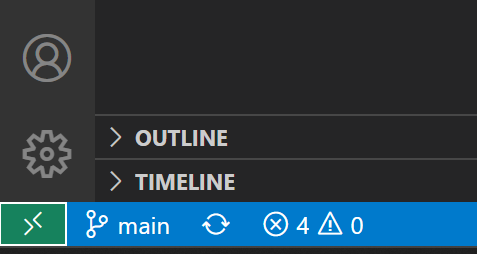
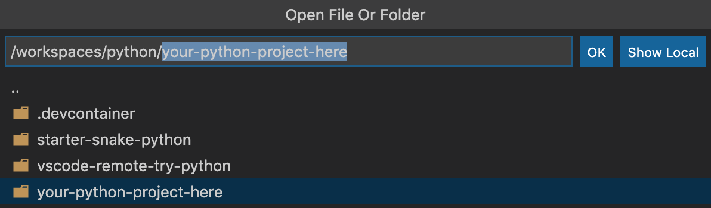
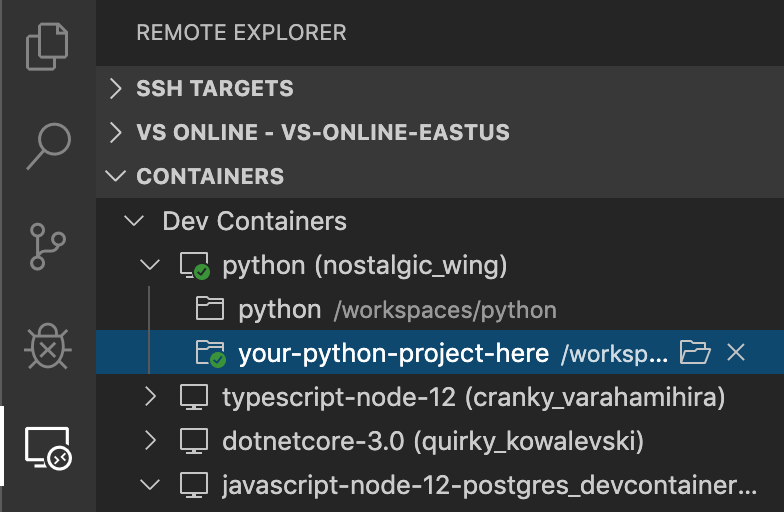

+++
title = "Configure separate containers"
date = 2024-01-13T13:53:43+08:00
weight = 110
type = "docs"
description = ""
isCJKLanguage = true
draft = false
+++

> 原文: [https://code.visualstudio.com/remote/advancedcontainers/configure-separate-containers](https://code.visualstudio.com/remote/advancedcontainers/configure-separate-containers)

# Configure separate containers 配置单独的容器


While development containers often are tied to a single folder, repository, or project, they can also be used with multiple folders as a way to simplify setup or separate your tools. Imagine you had your source code across multiple repositories in a single folder for a given toolset.

​​	虽然开发容器通常与单个文件夹、存储库或项目相关联，但它们也可以与多个文件夹一起使用，作为简化设置或分离工具的一种方式。想象一下，您在单个文件夹中跨多个存储库拥有源代码，用于给定的工具集。

For example:

​​	例如：

```
📁 Repos
   📁 node
   📁 python
      📁 starter-snake-python
      📁 vscode-remote-try-python
      📁 your-python-project-here
   📁 go
   📁 dotnet
```

Let's set up a container for use with all of the Python projects in the `./Repos/python` folder.

​​	让我们设置一个容器，以便与 `./Repos/python` 文件夹中的所有 Python 项目一起使用。

1. Start Visual Studio Code, select **Dev Containers: Open Folder in Container...** from the Command Palette (F1) or quick actions Status bar item, and select the `./Repos/python` folder.

   ​​	启动 Visual Studio Code，从命令面板 (F1) 或快速操作状态栏项中选择“开发容器：在容器中打开文件夹...”，然后选择 `./Repos/python` 文件夹。

   

   > **Tip:** If you want to edit the container's contents or settings before opening the folder, you can run **Dev Containers: Add Dev Container Configuration Files...** instead.
   >
   > ​​	提示：如果要在打开文件夹之前编辑容器的内容或设置，可以改为运行 Dev Containers：添加 Dev Container 配置文件...。

2. Now pick a starting point for your dev container. You can either select a base **dev container definition** from a filterable list, or use an existing [Dockerfile](https://docs.docker.com/engine/reference/builder/) or [Docker Compose file](https://docs.docker.com/compose/compose-file/#compose-file-structure-and-examples) if one exists in the folder you selected.

   ​​	现在为您的开发容器选择一个起点。您可以从可筛选列表中选择一个基本开发容器定义，或者如果在您选择的文件夹中存在 Dockerfile 或 Docker Compose 文件，则可以使用现有的 Dockerfile 或 Docker Compose 文件。

   > **Note:** When using Alpine Linux containers, some extensions may not work due to `glibc` dependencies in native code inside the extension.
   >
   > ​​	注意：在使用 Alpine Linux 容器时，某些扩展可能无法工作，因为扩展内部的本机代码中存在 `glibc` 依赖项。

   

   The list will be automatically sorted based on the contents of the folder you open. The dev container Templates displayed come from our [first-party and community index](https://containers.dev/templates), which is part of the [Dev Container Specification](https://containers.dev/). We host a set of Templates as part of the spec in the [devcontainers/templates repository](https://github.com/devcontainers/templates). You can browse the `src` folder of that repository to see the contents of each Template.

   ​​	列表会根据您打开的文件夹的内容自动排序。显示的开发容器模板来自我们的第一方和社区索引，它是开发容器规范的一部分。我们作为规范的一部分在 devcontainers/templates 存储库中托管一组模板。您可以浏览该存储库的 `src` 文件夹以查看每个模板的内容。

3. After picking the starting point for your container, VS Code will add the dev container configuration files to the `./Repos/python/.devcontainer` folder.

   ​​	在为容器选择起点后，VS Code 会将开发容器配置文件添加到 `./Repos/python/.devcontainer` 文件夹。

4. The VS Code window will reload and start building the dev container. A progress notification provides status updates. You only have to build a dev container the first time you open it; opening the folder after the first successful build will be much quicker.

   ​​	VS Code 窗口将重新加载并开始构建 dev container。进度通知提供状态更新。您只需在首次打开 dev container 时构建它；在首次成功构建后打开文件夹会快得多。

   

5. After the build completes, VS Code will automatically connect to the container. Once connected use **File > Open... / Open Folder...** to select one of the folders under `./Repos/python`.

   ​​	在构建完成后，VS Code 会自动连接到容器。连接后，使用“文件”>“打开...”/“打开文件夹...”来选择 `./Repos/python` 下的某个文件夹。

   

6. In a moment, VS Code will open the folder inside the same container. In the future, you can use the **Remote Explorer** in the Activity Bar to open this sub-folder in the container directly.

   ​​	片刻之后，VS Code 将在同一个容器内打开该文件夹。将来，您可以在活动栏中使用远程资源管理器直接在容器中打开此子文件夹。

   

> **Tip:** Instead of mounting the local filesystem, you can use a similar flow to set up a container with an isolated, more performant volume that you clone your source code into. See the Advanced Containers [Improve disk performance]() article for details.
>
> ​​	提示：除了装载本地文件系统，您还可以使用类似的流程设置一个容器，其中包含一个独立的、性能更高的卷，您可以将源代码克隆到该卷中。有关详细信息，请参阅高级容器改善磁盘性能一文。
