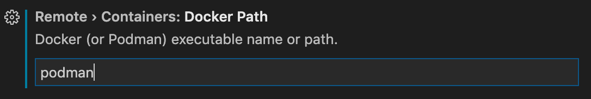

+++
title = "Docker options"
date = 2024-01-13T13:53:43+08:00
weight = 140
type = "docs"
description = ""
isCJKLanguage = true
draft = false
+++

> 原文: [https://code.visualstudio.com/remote/advancedcontainers/docker-options](https://code.visualstudio.com/remote/advancedcontainers/docker-options)

# Alternate ways to install Docker 安装 Docker 的其他方式


You can use Docker with the [Dev Containers](https://marketplace.visualstudio.com/items?itemName=ms-vscode-remote.remote-containers) extension in a few ways:

​​	您可以通过以下几种方式将 Docker 与 Dev Containers 扩展配合使用：

- Docker installed locally.
  本地安装的 Docker。

- Docker installed on another machine or remote environment.

  
  在另一台计算机或远程环境中安装 Docker。

  - You only need Docker installed on the remote host, rather than Docker installed locally.
    您只需在远程主机上安装 Docker，而无需在本地安装 Docker。

- Other Docker compliant CLIs, installed locally or in a remote environment.

  
  其他符合 Docker 标准的 CLI，在本地或远程环境中安装。

  - For instance,

     

    Rancher Desktop

     

    is another way to install Docker, providing container management and Kubernetes on Windows, macOS, and Linux.

    
    例如，Rancher Desktop 是另一种安装 Docker 的方式，可在 Windows、macOS 和 Linux 上提供容器管理和 Kubernetes。

    - Since Rancher Desktop supports Docker CLI via [Moby](https://mobyproject.org/), you can use Dev Containers extension with it. You may learn how to get started in Rancher Desktop's [guide](https://docs.rancherdesktop.io/how-to-guides/vs-code-remote-containers/).
      由于 Rancher Desktop 通过 Moby 支持 Docker CLI，因此您可以将 Dev Containers 扩展与之配合使用。您可以在 Rancher Desktop 指南中了解如何开始。

  - Dev Containers interacts with CLIs; it makes no assumptions about how a container engine works and does not interact with container engines or daemons directly.
    Dev Containers 与 CLI 交互；它不假设容器引擎的工作方式，也不直接与容器引擎或守护程序交互。

  - Note that other Docker compliant CLIs are not officially supported.
    请注意，其他符合 Docker 标准的 CLI 未得到官方支持。

Continue reading to learn alternate ways you can install and use Docker or a Docker compliant CLI.

​​	继续阅读以了解您可以安装和使用 Docker 或符合 Docker 标准的 CLI 的其他方式。

## [Windows: Windows Subsystem for Linux (WSL) Windows：适用于 Linux 的 Windows 子系统 (WSL)]()

On Windows, you can use Docker installed in WSL through the [WSL](https://marketplace.visualstudio.com/items?itemName=ms-vscode-remote.remote-wsl) extension. You can reference the [Docker documentation](https://docs.docker.com/engine/install/) for installing Docker on Linux, with [specific information per distribution](https://docs.docker.com/engine/install/centos/).

​​	在 Windows 上，您可以通过 WSL 扩展使用安装在 WSL 中的 Docker。您可以参考 Docker 文档来安装适用于 Linux 的 Docker，其中包含针对每个发行版的具体信息。

One issue is that the `dockerd` daemon won't start automatically due to the lack of `systemd` or any other system daemon. In WSL version 0.67.6 and later (`wsl --version`), you can enable [support for `systemd`](https://devblogs.microsoft.com/commandline/systemd-support-is-now-available-in-wsl/). With older WSL versions, you can use [Distrod](https://github.com/nullpo-head/wsl-distrod) to create or update existing WSL distros with `systemd`.

​​	一个问题是，由于缺少 `dockerd` 或任何其他系统守护程序， `systemd` 守护程序不会自动启动。在 WSL 版本 0.67.6 及更高版本（ `wsl --version` ）中，您可以启用对 `systemd` 的支持。对于较旧的 WSL 版本，您可以使用 Distrod 来创建或更新具有 `systemd` 的现有 WSL 发行版。

## [macOS: Colima macOS：Colima]()

[Colima](https://github.com/abiosoft/colima) provides container runtimes on macOS. It's recommended to use Colima v0.2.2 or later so that VS Code can properly see containers running through Colima.

​​	Colima 在 macOS 上提供容器运行时。建议使用 Colima v0.2.2 或更高版本，以便 VS Code 能够正确查看通过 Colima 运行的容器。

Colima automatically sets up a `colima` [Docker context](https://docs.docker.com/engine/context/working-with-contexts/) and makes it the active context. You may also want to install the `docker` and `docker-compose` CLIs before running `colima start` for this setup to work properly.

​​	Colima 会自动设置 `colima` Docker 上下文并使其成为活动上下文。您可能还希望在运行 `colima start` 之前安装 `docker` 和 `docker-compose` CLI，以便此设置正常工作。

> Note: Colima uses Alpine Linux, which isn't supported by Remote - SSH.
>
> ​​	注意：Colima 使用 Alpine Linux，而 Remote - SSH 不支持 Alpine Linux。

## [Linux]()

If you're using Linux on your local machine, or already have a remote Linux machine with SSH access, you can reference the [Docker documentation](https://docs.docker.com/engine/install/) for installing Docker on Linux, with [specific information per distribution](https://docs.docker.com/engine/install/centos/).

​​	如果您在本地计算机上使用 Linux，或者已经拥有具有 SSH 访问权限的远程 Linux 计算机，您可以参考 Docker 文档来安装适用于 Linux 的 Docker，其中包含针对每个发行版的具体信息。

### [Cloud-Init VM]()

You can use the [Remote - SSH](https://marketplace.visualstudio.com/items?itemName=ms-vscode-remote.remote-ssh) extension with Dev Containers. This enables you to have Docker installed on your remote machine, such as a Linux VM.

​​	您可以将 Remote - SSH 扩展与 Dev Containers 配合使用。这使您能够在远程计算机（例如 Linux VM）上安装 Docker。

You may use a [Cloud-Init](https://cloud-init.io/) file (which is an industry standard) to install Docker on the VM automatically. As an example, you can create an Azure VM through the Azure CLI, and set it to use a `cloud-init.txt` during creation.

​​	您可以使用 Cloud-Init 文件（这是行业标准）自动在 VM 上安装 Docker。例如，您可以通过 Azure CLI 创建 Azure VM，并将其设置为在创建期间使用 `cloud-init.txt` 文件：

`cloud-init.txt` file:

​​	以下是一些 Azure CLI 命令的示例。务必将 `cloud-init.txt` 更新为靠近您的数据中心（例如， 、 ）：

```
#cloud-config

apt:
  sources:
    docker.list:
      source: deb [arch=amd64] https://download.docker.com/linux/ubuntu $RELEASE stable
      keyid: 9DC858229FC7DD38854AE2D88D81803C0EBFCD88

packages:
  - docker-ce
  - docker-ce-cli

groups:
  - docker

system_info:
  default_user:
    groups: [docker]
```

Here is an example of the Azure CLI commands. Be sure to update `<location-here>` to a data center close to you (for example, `eastus`, `westeurope`):

​​	您可以在远程 Docker 主机上进行开发文档中了解有关将 Remote - SSH 与 Dev Containers 配合使用的更多信息。

```
az login

az group create --name dev-server --location <location-here>

az vm create \
  --resource-group dev-server \
  --name dev-server \
  --image Canonical:0001-com-ubuntu-server-impish:21_10-gen2:latest \
  --custom-data cloud-init.txt \
  --generate-ssh-keys
```

You can learn more about using Remote - SSH with Dev Containers in the [develop on a remote Docker host]() documentation.

​​	Podman

### [Podman Podman 1.9+ 与 Docker 的 CLI 命令基本兼容，因此如果您将 Docker 路径设置（通过设置编辑器中的“开发”>“容器”>“Docker 路径”）更新为 Linux 上的 ，它就会起作用。]()

[Podman](https://podman.io/) 1.9+ is mostly compatible with Docker's CLI commands and therefore does work if you update the **Docker Path** setting (via **Dev > Containers: Docker Path** in the Settings editor) to `podman` on Linux.

​​	但是，由于 Podman 的局限性，某些技巧（如 Docker-from-Docker）不起作用。这会影响“Dev Containers: Try a Dev Container Sample...”和“Dev Containers: Clone Repository in Container Volume...”命令。



However, certain tricks like [Docker-from-Docker do not work](https://github.com/containers/libpod/issues/4056#issuecomment-535511841) due to limitations in Podman. This affects the **Dev Containers: Try a Dev Container Sample...** and [Dev Containers: Clone Repository in Container Volume...]() commands.

To work around issues with rootless Podman (for example, not respecting a non-root `"remoteUser"` and trying to install the server in `root`), you can set the following:

​​	要解决无根 Podman 的问题（例如，不尊重非根 `"remoteUser"` 并尝试在 `root` 中安装服务器），您可以设置以下内容：

```
"runArgs": [
  "--userns=keep-id"
],
"containerEnv": {
  "HOME": "/home/node"
}
```

`"remoteUser"` can be used when `"HOME"` is set because Dev Containers gives that setting precedence over the home folder it finds in `/etc/passwd`.

​​	 `"remoteUser"` 可在设置 `"HOME"` 时使用，因为 Dev Containers 会优先考虑该设置，而不是在 `/etc/passwd` 中找到的主文件夹。

Podman also has its own implementation of the Compose Spec with [Podman Compose](https://github.com/containers/podman-compose).

​​	Podman 还具有自己的 Compose Spec 实现，即 Podman Compose。

## [Other container engines 其他容器引擎]()

You can open or review requests for support for other container engines through the [vscode-remote-release repository](https://github.com/microsoft/vscode-remote-release). There are already several feature requests you can explore:

​​	您可以通过 vscode-remote-release 存储库打开或查看对其他容器引擎的支持请求。您已经可以探索几个功能请求：

- [nerdctl](https://github.com/microsoft/vscode-remote-release/issues/6014)
- [critcl](https://github.com/microsoft/vscode-remote-release/issues/6075)
- [Singularity containers
  Singularity 容器](https://github.com/microsoft/vscode-remote-release/issues/3066)
