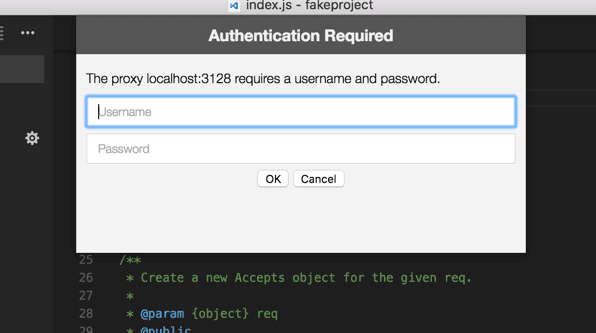

+++
title = "Network"
date = 2024-01-12T22:36:24+08:00
weight = 50
type = "docs"
description = ""
isCJKLanguage = true
draft = false
+++

> 原文: [https://code.visualstudio.com/docs/setup/network](https://code.visualstudio.com/docs/setup/network)

# Network Connections in Visual Studio Code Visual Studio Code 中的网络连接


Visual Studio Code is built on top of [Electron](https://www.electronjs.org/) and benefits from all the networking stack capabilities of [Chromium](https://www.chromium.org/). This also means that VS Code users get much of the networking support available in [Google Chrome](https://www.google.com/chrome/index.html).

​​	Visual Studio Code 是基于 Electron 构建的，并受益于 Chromium 的所有网络堆栈功能。这也意味着 VS Code 用户可以获得 Google Chrome 中的大部分网络支持。

## [Common hostnames 常见主机名](https://code.visualstudio.com/docs/setup/network#_common-hostnames)

A handful of features within VS Code require network communication to work, such as the auto-update mechanism, querying and installing extensions, and telemetry. For these features to work properly in a proxy environment, you must have the product correctly configured.

​​	VS Code 中的一些功能需要网络通信才能工作，例如自动更新机制、查询和安装扩展以及遥测。为了使这些功能在代理环境中正常工作，您必须正确配置产品。

If you are behind a firewall that needs to allow specific domains used by VS Code, here's the list of hostnames you should allow communication to go through:

​​	如果您位于需要允许 VS Code 使用的特定域名的防火墙之后，以下列出了您应该允许通信通过的主机名列表：

- `update.code.visualstudio.com` - Visual Studio Code download and update server
  `update.code.visualstudio.com` - Visual Studio Code 下载和更新服务器
- `code.visualstudio.com` - Visual Studio Code documentation
  `code.visualstudio.com` - Visual Studio Code 文档
- `go.microsoft.com` - Microsoft link forwarding service
  `go.microsoft.com` - Microsoft 链接转发服务
- `vscode.blob.core.windows.net` - Visual Studio Code blob storage, used for remote server
  `vscode.blob.core.windows.net` - Visual Studio Code blob 存储，用于远程服务器
- `marketplace.visualstudio.com` - Visual Studio Marketplace
- `*.gallery.vsassets.io` - Visual Studio Marketplace
- `*.gallerycdn.vsassets.io` - Visual Studio Marketplace
- `rink.hockeyapp.net` - Crash reporting service
  `rink.hockeyapp.net` - 崩溃报告服务
- `bingsettingssearch.trafficmanager.net` - In-product settings search
  `bingsettingssearch.trafficmanager.net` - 产品内设置搜索
- `vscode.search.windows.net` - In-product settings search
  `vscode.search.windows.net` - 产品内设置搜索
- `raw.githubusercontent.com` - GitHub repository raw file access
  `raw.githubusercontent.com` - GitHub 存储库原始文件访问
- `vsmarketplacebadges.dev` - Visual Studio Marketplace badge service
  `vsmarketplacebadges.dev` - Visual Studio Marketplace 徽章服务
- `az764295.vo.msecnd.net` - Visual Studio Code download CDN (deprecated)
  `az764295.vo.msecnd.net` - Visual Studio Code 下载 CDN（已弃用）
- `vscode.download.prss.microsoft.com` - Visual Studio Code download CDN
  `vscode.download.prss.microsoft.com` - Visual Studio Code 下载 CDN
- `download.visualstudio.microsoft.com` - Visual Studio download server, provides dependencies for some VS Code extensions (C++, C#)
  `download.visualstudio.microsoft.com` - Visual Studio 下载服务器，提供某些 VS Code 扩展（C++、C#）的依赖项
- `vscode-sync.trafficmanager.net` - Visual Studio Code Settings Sync service
  `vscode-sync.trafficmanager.net` - Visual Studio Code 设置同步服务
- `vscode-sync-insiders.trafficmanager.net` - Visual Studio Code Settings Sync service (Insiders)
  `vscode-sync-insiders.trafficmanager.net` - Visual Studio Code 设置同步服务（预览版）
- `vscode.dev` - Used when logging in with GitHub or Microsoft for an extension or Settings Sync
  `vscode.dev` - 用于通过 GitHub 或 Microsoft 登录以获取扩展或设置同步
- `*.vscode-unpkg.net` - Used when loading web extensions
  `*.vscode-unpkg.net` - 用于加载 Web 扩展
- `default.exp-tas.com` - Visual Studio Code Experiment Service, used to provide experimental user experiences
  `default.exp-tas.com` - Visual Studio Code 实验服务，用于提供实验性用户体验

## [Proxy server support 代理服务器支持](https://code.visualstudio.com/docs/setup/network#_proxy-server-support)

VS Code has exactly the same proxy server support as Google Chromium. Here's a snippet from [Chromium's documentation](https://www.chromium.org/developers/design-documents/network-settings):

​​	VS Code 具有与 Google Chromium 完全相同的代理服务器支持。以下是 Chromium 文档中的摘录：

```
"The Chromium network stack uses the system network settings so that users and administrators can control the network settings of all applications easily. The network settings include:

 - proxy settings
 - SSL/TLS settings
 - certificate revocation check settings
 - certificate and private key stores"
```

This means that your proxy settings should be picked up automatically.

​​	这意味着你的代理设置应自动获取。

Otherwise, you can use the following command-line arguments to control your proxy settings:

​​	否则，你可以使用以下命令行参数来控制代理设置：

```
# Disable proxy
--no-proxy-server

# Manual proxy address
--proxy-server=<scheme>=<uri>[:<port>][;...] | <uri>[:<port>] | "direct://"

# Manual PAC address
--proxy-pac-url=<pac-file-url>

# Disable proxy per host
--proxy-bypass-list=(<trailing_domain>|<ip-address>)[:<port>][;...]
```

To learn more about these command-line arguments, see [Chromium Network Settings](https://www.chromium.org/developers/design-documents/network-settings).

​​	若要详细了解这些命令行参数，请参阅 Chromium 网络设置。

### [Authenticated proxies 经过身份验证的代理](https://code.visualstudio.com/docs/setup/network#_authenticated-proxies)

Authenticated proxies should work seamlessly within VS Code with the addition of [PR #22369](https://github.com/microsoft/vscode/pull/22369).

​​	经过 PR #22369 的添加，经过身份验证的代理应可在 VS Code 中无缝运行。

The authentication methods supported are:

​​	支持的身份验证方法有：

- Basic
  基本
- Digest
  摘要
- NTLM
- Negotiate
  协商

When using VS Code behind an authenticated HTTP proxy, the following authentication popup should appear:

​​	在经过身份验证的 HTTP 代理后使用 VS Code 时，应出现以下身份验证弹出窗口：



Note that SOCKS5 proxy authentication support isn't implemented yet; you can follow the [issue in Chromium's issue tracker](https://bugs.chromium.org/p/chromium/issues/detail?id=256785).

​​	请注意，尚未实现 SOCKS5 代理身份验证支持；您可以在 Chromium 的问题跟踪器中关注此问题。

See [Chromium HTTP authentication](https://www.chromium.org/developers/design-documents/http-authentication) to read more about HTTP proxy authentication within VS Code.

​​	请参阅 Chromium HTTP 身份验证以详细了解 VS Code 中的 HTTP 代理身份验证。

### [SSL certificates SSL 证书](https://code.visualstudio.com/docs/setup/network#_ssl-certificates)

Often HTTPS proxies rewrite SSL certificates of the incoming requests. Chromium was designed to reject responses which are signed by certificates which it doesn't trust. If you hit any SSL trust issues, there are a few options available for you:

​​	通常，HTTPS 代理会重写传入请求的 SSL 证书。Chromium 被设计为拒绝由其不信任的证书签名的响应。如果您遇到任何 SSL 信任问题，您可以选择以下几种方法：

- Since Chromium uses the OS's certificate trust infrastructure, the preferred option is to add your proxy's certificate to your OS's trust chain. See the [Chromium Root Certificate Policy](https://www.chromium.org/Home/chromium-security/root-ca-policy) documentation to learn more.
  由于 Chromium 使用操作系统的证书信任基础架构，因此首选的方法是将代理的证书添加到操作系统的信任链中。请参阅 Chromium 根证书政策文档以了解更多信息。
- If your proxy runs in `localhost`, you can always try the [--allow-insecure-localhost](https://peter.sh/experiments/chromium-command-line-switches/#allow-insecure-localhost) command-line flag.
  如果您的代理在 `localhost` 中运行，您可以随时尝试使用 --allow-insecure-localhost 命令行标志。
- If all else fails, you can tell VS Code to ignore all certificate errors using the [--ignore-certificate-errors](https://peter.sh/experiments/chromium-command-line-switches/#ignore-certificate-errors) command-line flag. **Warning:** This is **dangerous** and **not recommended**, since it opens the door to security issues.
  如果所有方法均失败，您可以使用 --ignore-certificate-errors 命令行标志告诉 VS Code 忽略所有证书错误。警告：这样做很危险，不建议这样做，因为它会引发安全问题。

## [Legacy proxy server support 旧版代理服务器支持](https://code.visualstudio.com/docs/setup/network#_legacy-proxy-server-support)

Extensions don't benefit yet from the same proxy support that VS Code supports. You can follow this issue's development in [GitHub](https://github.com/microsoft/vscode/issues/12588).

​​	扩展尚未从 VS Code 支持的相同代理支持中受益。您可以在 GitHub 中关注此问题的进展。

Similarly to extensions, a few other VS Code features don't yet fully support proxy networking, namely the CLI interface. The CLI interface is what you get when running `code --install-extension vscodevim.vim` from a command prompt or terminal. You can follow this issue's development in [GitHub](https://github.com/microsoft/vscode/issues/29910).

​​	与扩展类似，其他一些 VS Code 功能目前还不完全支持代理网络，即 CLI 界面。CLI 界面是您从命令提示符或终端运行 `code --install-extension vscodevim.vim` 时获得的内容。您可以在 GitHub 中关注此问题的进展情况。

Due to both of these constraints, the `http.proxy`, `http.proxyStrictSSL` and `http.proxyAuthorization` variables are still part of VS Code's settings, yet they are only respected in these two scenarios.

​​	由于这两个限制， `http.proxy` 、 `http.proxyStrictSSL` 和 `http.proxyAuthorization` 变量仍是 VS Code 设置的一部分，但它们仅在此两种情况下受到尊重。

## [Troubleshooting 故障排除](https://code.visualstudio.com/docs/setup/network#_troubleshooting)

Here are some helpful links that might help you troubleshoot networking issues in VS Code:

​​	以下是一些可能有用的链接，可帮助您对 VS Code 中的网络问题进行故障排除：

- [Network Settings
  网络设置](https://www.chromium.org/developers/design-documents/network-settings)
- [Debugging problems with the network proxy
  调试网络代理的问题](https://www.chromium.org/developers/design-documents/network-stack/debugging-net-proxy)
- [Configuring a SOCKS proxy server in Chrome
  在 Chrome 中配置 SOCKS 代理服务器](https://www.chromium.org/developers/design-documents/network-stack/socks-proxy)
- [Proxy settings and fallback (Windows)
  代理设置和回退（Windows）](https://www.chromium.org/developers/design-documents/network-stack/proxy-settings-fallback)
