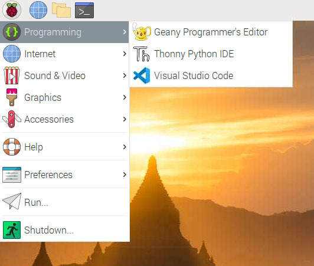

+++
title = "Raspberry Pi"
date = 2024-01-12T22:36:24+08:00
weight = 40
type = "docs"
description = ""
isCJKLanguage = true
draft = false
+++

> 原文: [https://code.visualstudio.com/docs/setup/raspberry-pi](https://code.visualstudio.com/docs/setup/raspberry-pi)

# Visual Studio Code on Raspberry Pi 树莓派上的 Visual Studio Code


You can run Visual Studio Code on [Raspberry Pi](https://www.raspberrypi.org/) devices.

​​​	您可以在 Raspberry Pi 设备上运行 Visual Studio Code。

[](https://www.raspberrypi.org/)

By downloading and using Visual Studio Code, you agree to the [license terms](https://code.visualstudio.com/license) and [privacy statement](https://go.microsoft.com/fwlink/?LinkID=528096&clcid=0x409).

​​​	通过下载和使用 Visual Studio Code，您同意许可条款和隐私声明。

## [Installation 安装]()

Visual Studio Code is officially distributed via the [Raspberry Pi OS](https://www.raspberrypi.org/software/operating-systems) (previously called Raspbian) APT repository, in both 32-bit and 64-bit variants.

​​​	Visual Studio Code 通过 Raspberry Pi OS（以前称为 Raspbian）APT 存储库以 32 位和 64 位变体形式正式分发。

You can install it by running:

​​​	您可以通过运行以下命令进行安装：

```
sudo apt update
sudo apt install code
```

### [Running VS Code 运行 VS Code]()

After installing the VS Code package, you can run VS Code by typing `code` in a terminal or launching it via the **Programming** menu.

​​​	安装 VS Code 软件包后，您可以通过在终端中键入 `code` 或通过编程菜单启动它来运行 VS Code。



## [Updates 更新]()

Your Raspberry Pi should handle updating VS Code in the same way as other packages on the system:

​​​	您的 Raspberry Pi 应以与系统上其他软件包相同的方式处理 VS Code 更新：

```
sudo apt update
sudo apt upgrade code
```

You can always check when a new release is available in our [Updates](https://code.visualstudio.com/updates) page.

​​​	您始终可以在我们的更新页面中查看何时有新版本可用。

## [System requirements 系统要求]()

VS Code is supported on these Raspberry Pi models running a 32-bit or 64-bit version of Raspberry Pi OS:

​​​	VS Code 在运行 32 位或 64 位版本 Raspberry Pi OS 的以下 Raspberry Pi 型号上受支持：

- Raspberry Pi 3 Model B/B+
  Raspberry Pi 3 型号 B/B+
- Raspberry Pi 4 Model B
  Raspberry Pi 4 型号 B
- Raspberry Pi 400

While 1 GB of memory (RAM) meets the minimum system requirements, users will benefit from installing VS Code on a Raspberry Pi 4 with more memory.

​​​	虽然 1 GB 内存 (RAM) 满足最低系统要求，但用户将受益于在具有更多内存的 Raspberry Pi 4 上安装 VS Code。

First-generation Raspberry Pi modules and Raspberry Pi Zero are not supported as they only include an ARMv6 CPU.

​​​	第一代 Raspberry Pi 模块和 Raspberry Pi Zero 不受支持，因为它们仅包含 ARMv6 CPU。

### [Workaround for poor performance 解决性能不佳问题]()

VS Code on Raspberry Pi 4 may be slow with the default setup. A workaround is to disable hardware (GPU) acceleration in VS Code:

​​​	在 Raspberry Pi 4 上的 VS Code 在默认设置下可能很慢。解决方法是在 VS Code 中禁用硬件 (GPU) 加速：

1. Open the VS Code `argv.json` file using the **Preferences: Configure Runtime Arguments** command.
   使用“首选项：配置运行时参数”命令打开 VS Code `argv.json` 文件。
2. Set `"disable-hardware-acceleration": true`.
   设置 `"disable-hardware-acceleration": true` 。
3. Restart VS Code.
   重新启动 VS Code。

The `"disable-hardware-acceleration": true` runtime argument switch has the effect of passing the `--disable-gpu` command-line argument on VS Code startup.

​​​	 `"disable-hardware-acceleration": true` 运行时参数开关的作用是在 VS Code 启动时传递 `--disable-gpu` 命令行参数。

## [Next steps 后续步骤]()

Once you have installed VS Code, these topics will help you learn more about it:

​​​	安装 VS Code 后，以下主题将帮助您详细了解它：

- [Additional Components]() - Learn how to install Git, Node.js, TypeScript, and tools like Yeoman.
  其他组件 - 了解如何安装 Git、Node.js、TypeScript 和 Yeoman 等工具。
- [User Interface]() - A quick orientation to VS Code.
  用户界面 - VS Code 的快速入门。
- [User/Workspace Settings]() - Learn how to configure VS Code to your preferences through settings.
  用户/工作区设置 - 了解如何通过设置将 VS Code 配置为您的首选项。
