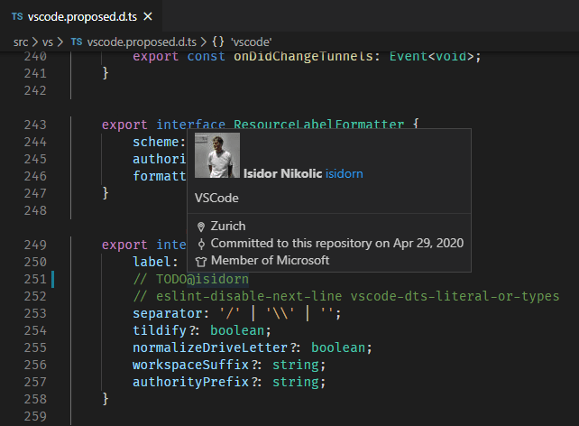
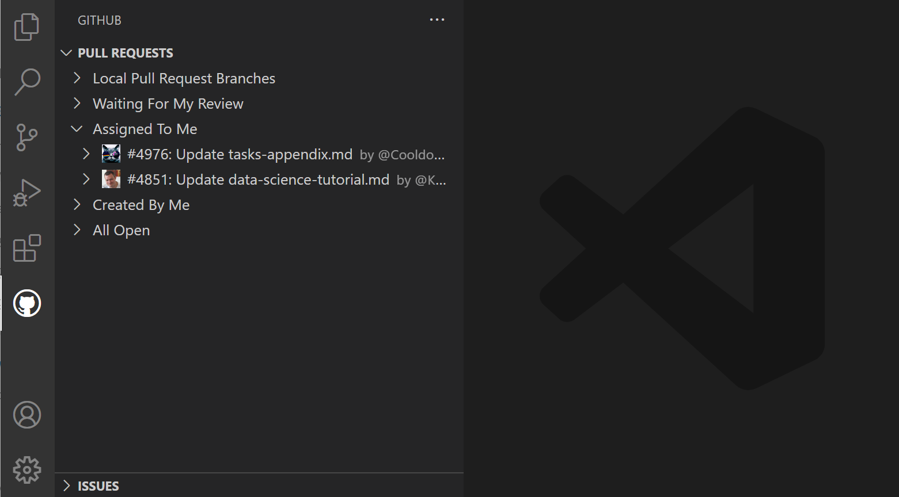
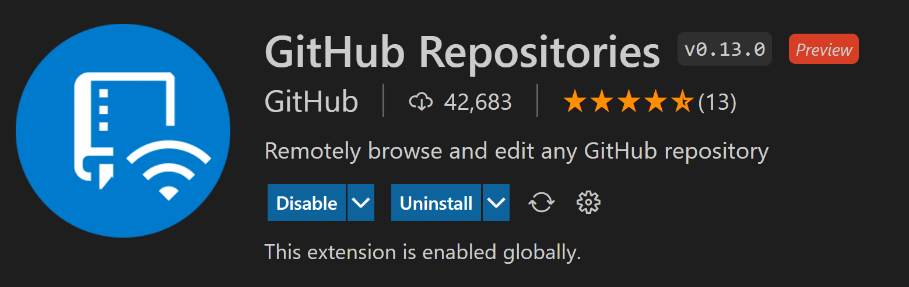

+++
title = "Collaborate on GitHub"
date = 2024-01-12T22:36:24+08:00
weight = 20
type = "docs"
description = ""
isCJKLanguage = true
draft = false
+++

> 原文: [https://code.visualstudio.com/docs/sourcecontrol/github](https://code.visualstudio.com/docs/sourcecontrol/github)

# Working with GitHub in VS Code 在 VS Code 中使用 GitHub


[GitHub](https://github.com/) is a cloud-based service for storing and sharing source code. Using GitHub with Visual Studio Code lets you share your source code and collaborate with others right within your editor. There are many ways to interact with GitHub, for example, via their website at [https://github.com](https://github.com/) or the [Git](https://git-scm.com/) command-line interface (CLI), but in VS Code, the rich GitHub integration is provided by the [GitHub Pull Requests and Issues](https://marketplace.visualstudio.com/items?itemName=GitHub.vscode-pull-request-github) extension.

​​	GitHub 是一项用于存储和共享源代码的基于云的服务。将 GitHub 与 Visual Studio Code 配合使用，您可以在编辑器中共享源代码并与他人协作。有很多种方式可以与 GitHub 交互，例如，通过其网站 https://github.com 或 Git 命令行界面 (CLI)，但在 VS Code 中，丰富的 GitHub 集成由 GitHub Pull Requests and Issues 扩展提供。

[Install the GitHub Pull Requests and Issues extension
安装 GitHub Pull Requests and Issues 扩展](vscode:extension/GitHub.vscode-pull-request-github)

To get started with the GitHub in VS Code, you'll need to install [Git](https://git-scm.com/download), [create a GitHub account](https://docs.github.com/get-started/signing-up-for-github/signing-up-for-a-new-github-account) and install the [GitHub Pull Requests and Issues](https://marketplace.visualstudio.com/items?itemName=GitHub.vscode-pull-request-github) extension. In this topic, we'll demonstrate how you can use some of your favorite parts of GitHub without leaving VS Code.

​​	要开始在 VS Code 中使用 GitHub，您需要安装 Git、创建一个 GitHub 帐户并安装 GitHub Pull Requests and Issues 扩展。在本主题中，我们将演示如何在不离开 VS Code 的情况下使用 GitHub 的部分您最喜欢的部分。

If you're new to source control or want to learn more about VS Code's basic Git support, you can start with the [Source Control]() topic.

​​	如果您不熟悉源代码管理或想详细了解 VS Code 的基本 Git 支持，可以从源代码管理主题开始。

## [Getting started with GitHub Pull Requests and Issues 开始使用 GitHub Pull Requests and Issues]()

Once you've installed the [GitHub Pull Requests and Issues](https://marketplace.visualstudio.com/items?itemName=GitHub.vscode-pull-request-github) extension, you'll need to sign in. Follow the prompts to authenticate with GitHub in the browser and return to VS Code.

​​	安装 GitHub Pull Requests and Issues 扩展后，您需要登录。按照提示在浏览器中使用 GitHub 进行身份验证，然后返回 VS Code。


If you are not redirected to VS Code, you can add your authorization token manually. In the browser window, you will receive your authorization token. Copy the token, and switch back to VS Code. Select **Signing in to github.com...** in the Status bar, paste the token, and hit Enter.

​​	如果您未重定向到 VS Code，可以手动添加授权令牌。在浏览器窗口中，您将收到授权令牌。复制令牌，然后切换回 VS Code。选择状态栏中的“正在登录到 github.com...”、粘贴令牌，然后按 Enter。

## [Setting up a repository 设置存储库]()

### [Cloning a repository 克隆存储库]()

You can search for and clone a repository from GitHub using the **Git: Clone** command in the Command Palette (Ctrl+Shift+P) or by using the **Clone Repository** button in the Source Control view (available when you have no folder open).

​​	可以使用命令面板（Ctrl+Shift+P）中的 Git: 克隆命令或源代码管理视图中的“克隆存储库”按钮（在未打开任何文件夹时可用）搜索并克隆 GitHub 中的存储库。


From the GitHub repository dropdown you can filter and pick the repository you want to clone locally.

​​	从 GitHub 存储库下拉列表中，可以筛选并选择要克隆到本地的存储库。


### [Authenticating with an existing repository 使用现有存储库进行身份验证]()

Enabling authentication through GitHub happens when you run any Git action in VS Code that requires GitHub authentication, such as pushing to a repository that you're a member of or cloning a private repository. You don't need to have any special extensions installed for authentication; it is built into VS Code so that you can efficiently manage your repository.

​​	在 VS Code 中运行任何需要 GitHub 身份验证的 Git 操作（例如将代码推送到您是其成员的存储库或克隆私有存储库）时，将通过 GitHub 进行身份验证。无需安装任何特殊扩展即可进行身份验证；它内置于 VS Code 中，以便您可以高效地管理存储库。

When you do something that requires GitHub authentication, you'll see a prompt to sign in:

​​	执行需要 GitHub 身份验证的操作时，您将看到登录提示：


Follow the steps to sign into GitHub and return to VS Code. If authenticating with an existing repository doesn't work automatically, you may need to manually provide a personal access token. See [Personal Access Token authentication](https://github.com/microsoft/vscode-pull-request-github/wiki#personal-access-token-authentication) for more information.

​​	按照步骤登录 GitHub 并返回到 VS Code。如果使用现有存储库进行身份验证无法自动进行，您可能需要手动提供个人访问令牌。有关详细信息，请参阅个人访问令牌身份验证。

Note that there are several ways to authenticate to GitHub, including using your username and password with two-factor authentication (2FA), a personal access token, or an SSH key. See [About authentication to GitHub](https://docs.github.com/github/authenticating-to-github/about-authentication-to-github) for more information and details about each option.

​​	请注意，有多种方法可以对 GitHub 进行身份验证，包括使用您的用户名和密码以及双重身份验证 (2FA)、个人访问令牌或 SSH 密钥。有关详细信息和每个选项的详情，请参阅关于 GitHub 身份验证。

> **Note**: If you'd like to work on a repository without cloning the contents to your local machine, you can install the [GitHub Repositories](https://marketplace.visualstudio.com/items?itemName=github.remotehub) extension to browse and edit directly on GitHub. You can learn more below in the [GitHub Repositories extension]() section.
>
> ​​	注意：如果您想处理存储库而不将内容克隆到本地计算机，可以安装 GitHub Repositories 扩展以直接在 GitHub 上浏览和编辑。您可以在下面的 GitHub Repositories 扩展部分中了解更多信息。

## [Editor integration 编辑器集成]()

### [Hovers 悬停]()

When you have a repository open and a user is @-mentioned, you can hover over that username and see a GitHub-style hover.

​​	当您打开存储库并且有人被 @ 提及时，您可以将鼠标悬停在该用户名上并看到 GitHub 风格的悬停。



There is a similar hover for #-mentioned issue numbers, full GitHub issue URLs, and repository specified issues.

​​	对于 # 提及的问题编号、完整的 GitHub 问题 URL 和指定存储库的问题，也有类似的悬停。


### [Suggestions 建议]()

User suggestions are triggered by the "@" character and issue suggestions are triggered by the "#" character. Suggestions are available in the editor and in the **Source Control** view's input box.

​​	用户建议由“@”字符触发，问题建议由“#”字符触发。建议在编辑器和源代码管理视图的输入框中提供。


The issues that appear in the suggestion can be configured with the **GitHub Issues: Queries** (`githubIssues.queries`) [setting](). The queries use the [GitHub search syntax](https://docs.github.com/search-github/getting-started-with-searching-on-github/understanding-the-search-syntax).

​​	建议中显示的问题可以通过 GitHub Issues: Queries ( `githubIssues.queries` ) 设置进行配置。查询使用 GitHub 搜索语法。

You can also configure which files show these suggestions using the settings **GitHub Issues: Ignore Completion Trigger** (`githubIssues.ignoreCompletionTrigger`) and **GitHub Issues: Ignore User Completion Trigger** (`githubIssues.ignoreUserCompletionTrigger`). These settings take an array of [language identifiers](https://code.visualstudio.com/docs/languages/identifiers) to specify the file types.

​​	您还可以使用设置 GitHub Issues: Ignore Completion Trigger ( `githubIssues.ignoreCompletionTrigger` ) 和 GitHub Issues: Ignore User Completion Trigger ( `githubIssues.ignoreUserCompletionTrigger` ) 配置显示这些建议的文件。这些设置采用语言标识符数组来指定文件类型。

```
// Languages that the '#' character should not be used to trigger issue completion suggestions.
"githubIssues.ignoreCompletionTrigger": [
  "python"
]
```

## [Pull requests 拉取请求]()

From the **Pull Requests** view you can view, manage, and create pull requests.

​​	在“拉取请求”视图中，您可以查看、管理和创建拉取请求。



The queries used to display pull requests can be configured with the **GitHub Pull Requests: Queries** (`githubPullRequests.queries`) setting and use the [GitHub search syntax](https://docs.github.com/search-github/getting-started-with-searching-on-github/understanding-the-search-syntax).

​​	用于显示拉取请求的查询可以通过 GitHub Pull Requests: Queries ( `githubPullRequests.queries` ) 设置进行配置，并使用 GitHub 搜索语法。

```
"githubPullRequests.queries": [
    {
        "label": "Assigned To Me",
        "query": "is:open assignee:${user}"
    },
```

### [Creating Pull Requests 创建拉取请求]()

Once you have committed changes to your fork or branch, you can use the **GitHub Pull Requests: Create Pull Request** command or the **Create Pull Request** button in the **Pull Requests** view to create a pull request.

​​	将更改提交到您的分支或分支后，您可以使用 GitHub Pull Requests: Create Pull Request 命令或“拉取请求”视图中的“创建拉取请求”按钮来创建拉取请求。


A new **Create** view will be displayed where you can select the base repository and base branch you'd like your pull request to target as well as fill in the title and description. If your repository has a pull request template, this will automatically be used for the description.

​​	将显示一个新的“创建视图”，您可以在其中选择基本存储库和基本分支，您希望将您的请求拉取到目标，并填写标题和说明。如果您的存储库有请求拉取模板，这将自动用于说明。

Use the buttons in the action bar at the top to add **Assignees**, **Reviewers**, **Labels** and a **Milestone**.

​​	使用顶部操作栏中的按钮添加受让人、审阅人、标签和里程碑。


The **Create** button menu allows you to select alternative create options, such as **Create Draft** or enable an **Auto-Merge** method.

​​	“创建”按钮菜单允许您选择其他创建选项，例如创建草稿或启用自动合并方法。

Once you select **Create**, if you have not already pushed your branch to a GitHub remote, the extension will ask if you'd like to publish the branch and provides a dropdown to select the specific remote.

​​	一旦您选择“创建”，如果您尚未将您的分支推送到 GitHub 远程，扩展程序将询问您是否希望发布分支，并提供一个下拉菜单来选择特定的远程。

The **Create Pull Request** view now enters **Review Mode**, where you can review the details of the PR, add comments, and merge the PR once it's ready. After the PR is merged, you'll have the option to delete both the remote and local branch.

​​	“创建请求拉取”视图现在进入审阅模式，您可以在其中审阅 PR 的详细信息、添加评论，并在准备好后合并 PR。在合并 PR 之后，您将可以选择删除远程和本地分支。

### [Reviewing 审阅]()

Pull requests can be reviewed from the **Pull Requests** view. You can assign reviewers and labels, add comments, approve, close, and merge all from the pull request **Description**.

​​	可以从“请求拉取”视图审阅请求拉取。您可以分配审阅人和标签、添加评论、批准、关闭和合并所有来自请求拉取说明的内容。


From the **Description** page, you can also easily checkout the pull request locally using the **Checkout** button. This will switch VS Code to open the fork and branch of the pull request (visible in the Status bar) in Review Mode and add a new **Changes in Pull Request** view from which you can view diffs of the current changes as well as all commits and the changes within these commits. Files that have been commented on are decorated with a diamond icon. To view the file on disk, you can use the **Open File** inline action.

​​	在“说明”页面中，您还可以使用“签出”按钮轻松地签出本地拉取请求。这会将 VS Code 切换为在“审阅”模式下打开拉取请求的分支和分支（在状态栏中可见），并添加一个新的“拉取请求中的更改”视图，您可以在其中查看当前更改的差异以及所有提交和这些提交中的更改。已评论的文件会用菱形图标装饰。若要查看磁盘上的文件，可以使用“内联操作”打开文件。


The diff editors from this view use the local file, so file navigation, IntelliSense, and editing work as normal. You can add comments within the editor on these diffs. Both adding single comments and creating a whole review is supported.

​​	此视图中的差异编辑器使用本地文件，因此文件导航、IntelliSense 和编辑工作正常。您可以在编辑器中对这些差异添加注释。支持添加单个注释和创建整个审阅。

When you are done reviewing the pull request changes you can merge the PR or select **Exit Review Mode** to go back to the previous branch you were working on.

​​	审阅完拉取请求更改后，您可以合并 PR 或选择“退出审阅模式”以返回您之前正在处理的分支。

## [Issues 问题]()

### [Creating issues 创建问题]()

Issues can be created from the **+** button in the **Issues** view and by using the **GitHub Issues: Create Issue from Selection** and **GitHub Issues: Create Issue from Clipboard** commands. They can also be created using a Code Action for "TODO" comments. When creating issues, you can take the default description or select the **Edit Description** pencil icon in the upper right to bring up an editor for the issue body.

​​	可以通过“问题”视图中的“+”按钮以及使用“GitHub 问题：从选择中创建问题”和“GitHub 问题：从剪贴板创建问题”命令来创建问题。还可以使用“TODO”注释的代码操作来创建问题。创建问题时，您可以采用默认说明，或选择右上角的“编辑说明”铅笔图标，以调出问题正文的编辑器。


You can configure the trigger for the Code Action using the **GitHub Issues: Create Issue Triggers** (`githubIssues.createIssueTriggers`) setting.

​​	可以使用“GitHub 问题：创建问题触发器 ( `githubIssues.createIssueTriggers` )”设置来配置代码操作的触发器。

The default issue triggers are:

​​	默认问题触发器为：

```
"githubIssues.createIssueTriggers": [
  "TODO",
  "todo",
  "BUG",
  "FIXME",
  "ISSUE",
  "HACK"
]
```

### [Working on issues 处理问题]()

From the **Issues** view, you can see your issues and work on them.

​​	在“问题”视图中，您可以查看问题并处理问题。


By default, when you start working on an issue (**Start Working on Issue** context menu item), a branch will be created for you, as shown in the Status bar in the image below.

​​	默认情况下，当您开始处理问题（“开始处理问题”上下文菜单项）时，将为您创建一个分支，如下面的图像所示，在状态栏中显示。


The Status bar also shows the active issue and if you select that item, a list of issue actions are available such as opening the issue on the GitHub website or creating a pull request.

​​	状态栏还显示活动问题，如果您选择该项，则会提供一系列问题操作，例如在 GitHub 网站上打开问题或创建拉取请求。


You can configure the name of the branch using the **GitHub Issues: Issue Branch Title** (`githubIssues.issueBranchTitle`) setting. If your workflow doesn't involve creating a branch, or if you want to be prompted to enter a branch name every time, you can skip that step by turning off the **GitHub Issues: Use Branch For Issues** (`githubIssues.useBranchForIssues`) setting.

​​	您可以使用 GitHub 问题：问题分支标题 ( `githubIssues.issueBranchTitle` ) 设置来配置分支的名称。如果您的工作流不涉及创建分支，或者您希望每次都提示您输入分支名称，您可以通过关闭 GitHub 问题：为问题使用分支 ( `githubIssues.useBranchForIssues` ) 设置来跳过该步骤。

Once you are done working on the issue and want to commit a change, the commit message input box in the **Source Control** view will be populated with a message, which can be configured with **GitHub Issues: Working Issue Format SCM** (`githubIssues.workingIssueFormatScm`).

​​	一旦您完成对问题的处理并希望提交更改，源代码管理视图中的提交消息输入框将填充一条消息，该消息可以通过 GitHub 问题：正在处理的问题格式 SCM ( `githubIssues.workingIssueFormatScm` ) 进行配置。

## [GitHub Repositories extension GitHub 存储库扩展]()

The [GitHub Repositories](https://marketplace.visualstudio.com/items?itemName=github.remotehub) extension lets you quickly browse, search, edit, and commit to any remote GitHub repository directly from within Visual Studio Code, without needing to clone the repository locally. This can be fast and convenient for many scenarios, where you just need to review source code or make a small change to a file or asset.

​​	GitHub 存储库扩展允许您直接从 Visual Studio Code 快速浏览、搜索、编辑和提交到任何远程 GitHub 存储库，而无需在本地克隆存储库。对于许多场景来说，这既快速又方便，您只需查看源代码或对文件或资产进行少量更改即可。



### [Opening a repository 打开存储库]()

Once you have installed the GitHub Repositories extension, you can open a repository with the **GitHub Repositories: Open Repository...** command from the Command Palette (Ctrl+Shift+P) or by clicking the Remote indicator in the lower left of the Status bar.

​​	安装 GitHub Repositories 扩展后，您可以通过命令面板 (Ctrl+Shift+P) 中的 GitHub Repositories: Open Repository... 命令或单击状态栏左下角的远程指示器来打开一个存储库。


When you run the **Open Repository** command, you then choose whether to open a repository from GitHub, open a Pull Request from GitHub, or reopen a repository that you had previously connected to.

​​	运行 Open Repository 命令时，您需要选择是从 GitHub 打开存储库、从 GitHub 打开拉取请求，还是重新打开之前连接的存储库。

If you haven't logged into GitHub from VS Code before, you'll be prompted to authenticate with your GitHub account.

​​	如果您之前未从 VS Code 登录到 GitHub，系统会提示您使用 GitHub 帐户进行身份验证。


You can provide the repository URL directly or search GitHub for the repository you want by typing in the text box.

​​	您可以直接提供存储库 URL，或在文本框中输入内容以在 GitHub 中搜索所需的存储库。

Once you have selected a repository or Pull Request, the VS Code window will reload and you will see the repository contents in the File Explorer. You can then open files (with full syntax highlighting and bracket matching), make edits, and commit changes, just like you would working on a local clone of a repository.

​​	选择存储库或拉取请求后，VS Code 窗口将重新加载，您将在文件资源管理器中看到存储库内容。然后，您可以打开文件（具有完整的语法突出显示和括号匹配）、进行编辑并提交更改，就像处理存储库的本地克隆一样。

One difference from working with a local repository is that when you commit a change with the GitHub Repository extension, the changes are pushed directly to the remote repository, similar to if you were working in the GitHub web interface.

​​	与本地存储库协作的一个区别在于，当您使用 GitHub 存储库扩展提交更改时，这些更改会直接推送到远程存储库，类似于您在 GitHub Web 界面中协作的情况。

Another feature of the GitHub Repositories extension is that every time you open a repository or branch, you get the up-to-date sources available from GitHub. You don't need to remember to pull to refresh as you would with a local repository.

​​	GitHub 存储库扩展的另一个功能是，每次您打开存储库或分支时，都会获得 GitHub 提供的最新来源。您无需记住像使用本地存储库那样进行拉取以刷新。

The GitHub Repositories extension supports viewing and even committing LFS-tracked files without needing to install [Git LFS](https://git-lfs.github.com/) (Large File System) locally. Add the file types you want tracked with LFS to a [`.gitattributes` file](https://git-lfs.com/), then commit your changes directly to GitHub using the Source Control view.

​​	GitHub 存储库扩展支持查看甚至提交 LFS（大型文件系统）跟踪的文件，而无需在本地安装 Git LFS。将您希望使用 LFS 跟踪的文件类型添加到 `.gitattributes` 文件，然后使用源代码管理视图将您的更改直接提交到 GitHub。

### [Switching branches 切换分支]()

You can easily switch between branches by clicking on the branch indicator in the Status bar. One great feature of the GitHub Repositories extension is that you can switch branches without needing to stash uncommitted changes. The extension remembers your changes and reapplies them when you switch branches.

​​	您可以通过单击状态栏中的分支指示器轻松地在分支之间切换。GitHub 存储库扩展的一大特色是，您无需暂存未提交的更改即可切换分支。该扩展会记住您的更改，并在您切换分支时重新应用这些更改。


### [Remote Explorer 远程资源管理器]()

You can quickly reopen remote repositories with the Remote Explorer available on the Activity bar. This view shows you the previously opened repositories and branches.

​​	您可以使用“活动”栏中提供的“远程资源管理器”快速重新打开远程存储库。此视图会显示之前打开的存储库和分支。


### [Create Pull Requests 创建拉取请求]()

If your workflow uses Pull Requests, rather than direct commits to a repository, you can create a new PR from the Source Control view. You'll be prompted to provide a title and create a new branch.

​​	如果您的工作流使用拉取请求，而不是直接提交到存储库，则可以从源代码管理视图创建新的 PR。系统会提示您提供标题并创建一个新分支。


Once you have created a Pull Request, you can use the [GitHub Pull Request and Issues](https://marketplace.visualstudio.com/items?itemName=GitHub.vscode-pull-request-github) extension to review, edit, and merge your PR as described [earlier]() in this topic.

​​	创建拉取请求后，您可以使用 GitHub 拉取请求和问题扩展来查看、编辑和合并您的 PR，如本主题前面所述。

### [Virtual file system 虚拟文件系统]()

Without a repository's files on your local machine, the GitHub Repositories extension creates a virtual file system in memory so you can view file contents and make edits. Using a virtual file system means that some operations and extensions which assume local files are not enabled or have limited functionality. Features such as tasks, debugging, and integrated terminals are not enabled and you can learn about the level of support for the virtual file system via the **features are not available** link in the Remote indicator hover.

​​	如果没有本地计算机上的存储库文件，GitHub 存储库扩展会在内存中创建一个虚拟文件系统，以便您可以查看文件内容并进行编辑。使用虚拟文件系统意味着某些假定本地文件的操作和扩展未启用或功能受限。任务、调试和集成终端等功能未启用，您可以通过远程指示器悬停中的“功能不可用”链接了解对虚拟文件系统的支持级别。


Extension authors can learn more about running in a virtual file system and workspace in the [Virtual Workspaces extension author's guide](https://github.com/microsoft/vscode/wiki/Virtual-Workspaces).

​​	扩展作者可以在虚拟工作区扩展作者指南中了解有关在虚拟文件系统和工作区中运行的更多信息。

### [Continue Working On... 继续处理...]()

Sometimes you'll want to switch to working on a repository in a development environment with support for a local file system and full language and development tooling. The GitHub Repositories extension makes it easy for you to:

​​	有时，您需要切换到在开发环境中处理存储库，该环境支持本地文件系统以及完整的语言和开发工具。GitHub 存储库扩展让您可以轻松地：

- Create a GitHub codespace (if you have the [GitHub Codespaces extension](https://marketplace.visualstudio.com/items?itemName=GitHub.codespaces)).
  创建 GitHub 代码空间（如果您有 GitHub Codespaces 扩展）。
- Clone the repository locally.
  在本地克隆存储库。
- Clone the repository into a Docker container (if you have [Docker](https://docker.com/) and the Microsoft [Docker extension](https://marketplace.visualstudio.com/items?itemName=ms-azuretools.vscode-docker) installed).
  将存储库克隆到 Docker 容器中（如果您已安装 Docker 和 Microsoft Docker 扩展）。

To switch development environments, use the **Continue Working On...** command, available from the Command Palette (Ctrl+Shift+P) or by clicking on the Remote indicator in the Status bar.

​​	若要切换开发环境，请使用“继续处理...”命令，该命令可从命令面板（Ctrl+Shift+P）中获得，或通过单击状态栏中的“远程”指示器获得。


If you are using the [browser-based editor](), the **"Continue Working On..."** command has the options to open the repository locally or within a cloud-hosted environment in [GitHub Codespaces](https://github.com/features/codespaces).

​​	如果您使用的是基于浏览器的编辑器，“继续处理...”命令具有在本地或 GitHub Codespaces 中的云托管环境中打开存储库的选项。


The first time that you use **Continue Working On** with uncommitted changes, you will have the option to bring your edits to your selected development environment using **Cloud Changes**, which uses a VS Code service to store your pending changes.

​​	第一次使用“继续处理”时，您将可以选择使用云更改将编辑内容带到所选的开发环境，云更改使用 VS Code 服务来存储待处理的更改。

These changes are deleted from our service once they are applied to your target development environment. If you choose to continue without your uncommitted changes, you can always change this preference later by configuring the setting `"workbench.cloudChanges.continueOn": "prompt"`.

​​	这些更改在应用到目标开发环境后会从我们的服务中删除。如果您选择继续处理，而不处理待处理的更改，您始终可以通过配置设置 `"workbench.cloudChanges.continueOn": "prompt"` 来稍后更改此首选项。

## [GitHub Copilot]()

In VS Code, you can enhance your coding with artificial intelligence (AI), such as suggestions for lines of code or entire functions, fast documentation creation, and help creating code-related artifacts like tests.

​​	在 VS Code 中，您可以使用人工智能 (AI) 来增强编码，例如，提供代码行或整个函数的建议、快速创建文档以及帮助创建与代码相关的工件，如测试。

[GitHub Copilot](https://copilot.github.com/) is an AI-powered code completion tool that helps you write code faster and smarter. You can use the [GitHub Copilot extension](https://marketplace.visualstudio.com/items?itemName=GitHub.copilot) in VS Code to generate code, or to learn from the code it generates.

​​	GitHub Copilot 是一款由 AI 支持的代码完成工具，可帮助您更快速、更智能地编写代码。您可以在 VS Code 中使用 GitHub Copilot 扩展来生成代码，或从它生成的代码中学习。

[](https://marketplace.visualstudio.com/items?itemName=GitHub.copilot)

You can learn more about how to get started with Copilot in the [Copilot documentation]().

​​	您可以在 Copilot 文档中了解有关如何开始使用 Copilot 的更多信息。
