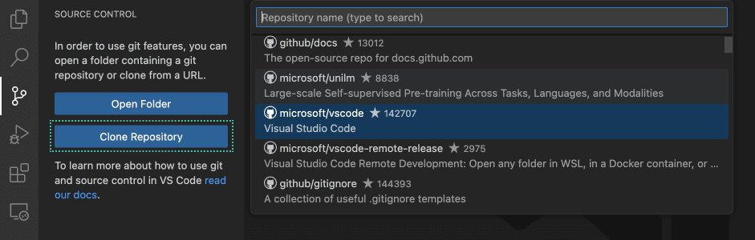
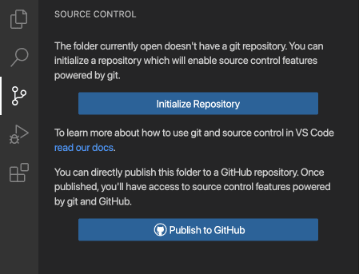
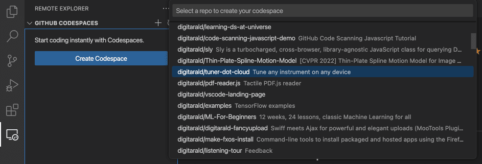
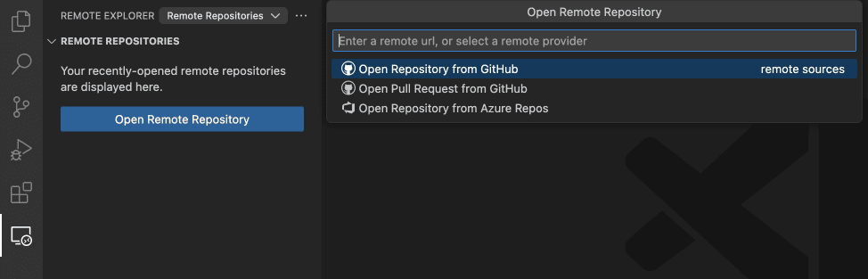
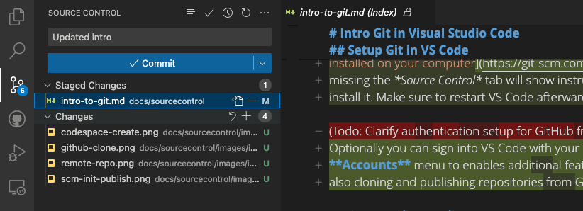
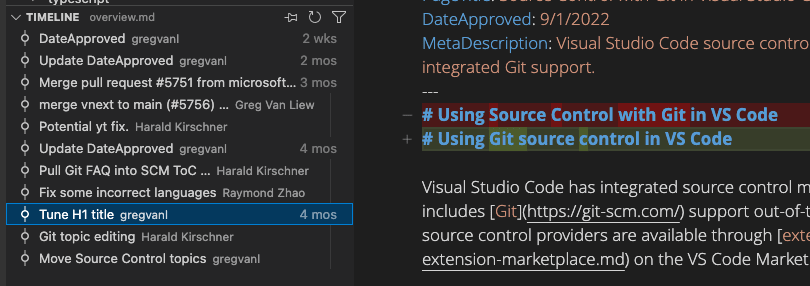
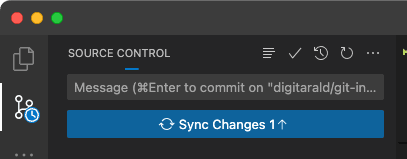
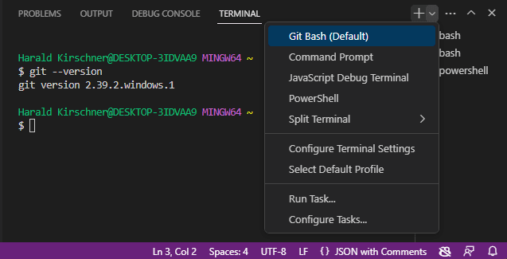

+++
title = "Introduction to Git"
date = 2024-01-12T22:36:24+08:00
weight = 10
type = "docs"
description = ""
isCJKLanguage = true
draft = false
+++

> 原文: [https://code.visualstudio.com/docs/sourcecontrol/intro-to-git](https://code.visualstudio.com/docs/sourcecontrol/intro-to-git)

# Introduction to Git in VS Code VS Code 中的 Git 简介

Want to easily manage your source code and collaborate with others? Git and GitHub are the tools you need! And with Visual Studio Code, you can set up and use them in a snap. Even if you're a beginner, VS Code's user-friendly interface guides you through common Git actions like pushing and pulling code, creating and merging branches, and committing code changes. And if you're a pro, you'll love the ability to perform Git actions directly within the editor, saving you time and effort compared to using the Git command line. Plus, the seamless workflow between VS Code and Git means you can stay in your editor and get more done.

​​	想要轻松管理您的源代码并与他人协作？Git 和 GitHub 是您需要的工具！借助 Visual Studio Code，您可以在转瞬间设置并使用它们。即使您是初学者，VS Code 的用户友好界面也会指导您完成常见的 Git 操作，例如推送和拉取代码、创建和合并分支以及提交代码更改。如果您是专业人士，您会喜欢能够直接在编辑器中执行 Git 操作的功能，与使用 Git 命令行相比，这可以节省您的时间和精力。此外，VS Code 和 Git 之间的无缝工作流意味着您可以停留在编辑器中并完成更多工作。

## [Set up Git in VS Code 在 VS Code 中设置 Git]()

To use Git and GitHub in VS Code, first make sure you [have Git installed on your computer](https://git-scm.com/downloads). If Git is missing, the **Source Control** view shows instructions on how to install it. Make sure to restart VS Code afterwards.

​​	要在 VS Code 中使用 Git 和 GitHub，首先确保您的计算机上已安装 Git。如果缺少 Git，源代码管理视图会显示有关如何安装它的说明。之后务必重新启动 VS Code。

Additionally you can sign into VS Code with your GitHub account in the **Accounts** menu in the lower right of the Activity bar to enables additional features like [Settings Sync](), but also cloning and publishing repositories from GitHub.

​​	此外，您还可以使用活动栏右下角的帐户菜单中的 GitHub 帐户登录 VS Code，以启用其他功能，例如设置同步，还可以从 GitHub 克隆和发布存储库。

## [Open a Git repository 打开 Git 存储库]()

VS Code provides several ways to get started in a Git repository, from local to remote cloud-powered environments like [GitHub Codespaces](https://github.com/features/codespaces).

​​	VS Code 提供多种方法来在 Git 存储库中开始工作，从本地到 GitHub Codespaces 等远程云支持环境。

### [Clone a repository locally 在本地克隆存储库]()

To clone a repository from GitHub, execute the **Git: Clone** command or select the **Clone Repository** button in the **Source Control** view. If you clone from GitHub, VS Code will prompt you to authenticate with GitHub. This allows you to search all available repositories and clone private repositories. For other Git providers, enter the repository URL and select **Clone** and pick a folder. VS Code opens the folder once the repository is cloned on your local machine.

​​	要从 GitHub 克隆存储库，请执行 Git：克隆命令或在源代码管理视图中选择“克隆存储库”按钮。如果您从 GitHub 克隆，VS Code 会提示您使用 GitHub 进行身份验证。这允许您搜索所有可用的存储库并克隆私有存储库。对于其他 Git 提供商，请输入存储库 URL 并选择“克隆”，然后选择一个文件夹。存储库在本地计算机上克隆后，VS Code 会打开该文件夹。

### [Initialize a repository in a local folder 在本地文件夹中初始化存储库]()

To initialize a new local repository, pick an existing or new folder on your computer and open it in VS Code. In the **Source Control** view, select the **Initialize Repository** button. This creates a new Git repository in the current folder, allowing you to start tracking code changes.

​​	要初始化新的本地存储库，请在计算机上选择现有或新的文件夹并在 VS Code 中将其打开。在源代码管理视图中，选择“初始化存储库”按钮。这会在当前文件夹中创建一个新的 Git 存储库，允许您开始跟踪代码更改。

#### [Publish local repository to GitHub 将本地存储库发布到 GitHub]()

Once you have a local Git repository set up, you can publish it to GitHub. This will create a new repository on your GitHub account, and push your local code to the remote repository. Having your source code on a remote repository is a great way to back up your code, collaborate with others, and automate your workflow with [GitHub Actions](https://github.com/features/actions).

​​	设置好本地 Git 存储库后，即可将其发布到 GitHub。这将在你的 GitHub 帐户中创建一个新存储库，并将你的本地代码推送到远程存储库。将源代码放在远程存储库中是备份代码、与他人协作以及使用 GitHub Actions 自动化工作流的好方法。

Use the **Publish to GitHub** command button in the **Source Control** view. You can then choose a name and description for the repository, and whether to make it public or private. Once the repository has been created, VS Code will push your local code to the remote repository. Your code is now backed up on GitHub, and you can start collaborating with others with commits and pull requests.

​​	使用源代码管理视图中的“发布到 GitHub”命令按钮。然后，你可以为存储库选择名称和说明，并选择是公开还是私有。创建存储库后，VS Code 会将你的本地代码推送到远程存储库。你的代码现在已在 GitHub 上备份，你可以开始与他人协作，提交和请求提取。

### [Open a GitHub repository in a codespace 在代码空间中打开 GitHub 存储库]()

[GitHub Codespaces](https://github.com/features/codespaces) let you open a GitHub repository in a full configured cloud-based development environment, allowing you to develop in a browser without having to install any software on your local computer. GitHub Codespaces allows free usage for individuals, which makes it easy to get started working on open source projects.

​​	GitHub Codespaces 允许你在一个完全配置的基于云的开发环境中打开 GitHub 存储库，让你能够在浏览器中进行开发，而无需在本地计算机上安装任何软件。GitHub Codespaces 允许个人免费使用，这使得开始处理开源项目变得很容易。

Install the [GitHub Codespaces](https://marketplace.visualstudio.com/items?itemName=GitHub.codespaces) extension into VS Code and sign in with GitHub. Run the **Codespaces: Create New Codespace** command and pick the repository and branch you want to open. The new codespace will open in a new window.

​​	将 GitHub Codespaces 扩展安装到 VS Code 中，并使用 GitHub 登录。运行 Codespaces: Create New Codespace 命令，并选择要打开的存储库和分支。新的 Codespace 将在新窗口中打开。

Alternatively, you can also start with a template from the [GitHub's Codespaces site](https://github.com/codespaces/templates). If you already have a codespace open in your browser, you can open it in your VS Code Desktop by running the **Codespaces: Open in VS Code Desktop** command. You can learn more about GitHub Codespaces, including customization such as forwarding ports, in the [Developing in a codespace](https://docs.github.com/codespaces/developing-in-codespaces/developing-in-a-codespace?tool=vscode) documentation.

​​	或者，您还可以从 GitHub 的 Codespaces 站点开始使用模板。如果您已经在浏览器中打开了 Codespace，则可以通过运行 Codespaces: Open in VS Code Desktop 命令在 VS Code Desktop 中将其打开。您可以在 Developing in a codespace 文档中了解有关 GitHub Codespaces 的更多信息，包括自定义（例如端口转发）。

### [Open a GitHub repository remotely 远程打开 GitHub 存储库]()

VS Code's remote repository support allows you to browse and edit a GitHub repository without cloning it to your local computer. This is useful for quickly making changes to a remote repository without having to clone the entire codebase to your machine.

​​	VS Code 的远程存储库支持允许您浏览和编辑 GitHub 存储库，而无需将其克隆到本地计算机。这对于快速更改远程存储库非常有用，而无需将整个代码库克隆到您的计算机。

First install the [GitHub Repositories](https://marketplace.visualstudio.com/items?itemName=GitHub.remotehub) extension. Run the command **Remote Repositories: Open Remote Repository...** or use the **Open Remote Repository** button the Explorer view. Search and select the GitHub repository that you want to open.

​​	首先安装 GitHub Repositories 扩展。运行命令 Remote Repositories: Open Remote Repository... 或使用资源管理器视图中的 Open Remote Repository 按钮。搜索并选择要打开的 GitHub 存储库。

> **Tip:** If you need to execute code or run terminal commands, you can seamlessly switch from a remote repository to a codespace with the command **Continue Working on**.
>
> ​​	提示：如果您需要执行代码或运行终端命令，您可以使用“继续处理”命令从远程存储库无缝切换到代码空间。

## [Staging and committing code changes 暂存和提交代码更改]()

Once you have a Git repository set up, you can start tracking code changes by staging and committing your newly created and edited code.

​​	设置好 Git 存储库后，您可以通过暂存和提交新创建和编辑的代码来开始跟踪代码更改。

> **Tip:** Commit your changes early and often. This will make it easier to revert back to previous versions of your code if needed.
>
> ​​	提示：尽早且频繁地提交您的更改。如果需要，这将使您更容易恢复到代码的先前版本。

To stage a file, select the **+** (plus) icon next to the file in the **Source Control** view. This will add the file to the **Staged Changes** section, indicating that it will be included in the next commit. Staged changes can also be discarded by selecting the **−** (minus) icon next to the file.

​​	要暂存文件，请选择源代码管理视图中文件旁边的 +（加号）图标。这会将文件添加到“暂存的更改”部分，表示它将包含在下次提交中。也可以通过选择文件旁边的 −（减号）图标来放弃暂存的更改。

To commit your staged changes, type a commit message in the upper text box and select the **Commit** button. This saves your changes to the local Git repository, allowing you to revert to previous versions of your code if needed. You can navigate through and review all local file changes and commits in the **Timeline** view available in the bottom of the Explorer.

​​	要提交暂存的更改，请在上面的文本框中键入提交消息，然后选择“提交”按钮。这会将您的更改保存到本地 Git 存储库，以便您在需要时恢复到代码的先前版本。您可以在资源管理器底部的“时间线”视图中浏览和查看所有本地文件更改和提交。

## [Pushing and pulling remote changes 推送和拉取远程更改]()

Once you have made commits to your local Git repository, you can push them to the remote repository. The **Sync Changes** button indicates how many commits are going to be pushed and pulled. Selecting the **Sync Changes** button downloads (pull) any new remote commits and uploads (push) new local commits to the remote repository.

​​	在您对本地 Git 存储库进行提交后，您可以将它们推送到远程存储库。同步更改按钮指示将要推送和拉取的提交数。选择同步更改按钮将下载（拉取）任何新的远程提交，并将新的本地提交上传（推送）到远程存储库。

> **Tip:** You can enable the **Git: Autofetch** [setting]() to always get an up-to-date remote commit indicator.
>
> ​​	提示：您可以启用 Git：自动获取设置，以始终获取最新的远程提交指示器。

Push and pull can also be performed individually by using their respective commands.

​​	还可以分别使用各自的命令执行推送和拉取。

## [Using branches 使用分支]()

In Git, [branches](https://docs.github.com/pull-requests/collaborating-with-pull-requests/proposing-changes-to-your-work-with-pull-requests/about-branches) allow you to work on multiple versions of your codebase simultaneously. This is useful for experimenting with new features or making large code changes without affecting the main codebase.

​​	在 Git 中，分支允许您同时处理代码库的多个版本。这对于试验新功能或进行大型代码更改而不影响主代码库非常有用。

The branch indicator in the Status bar shows the current branch and lets you switch to new and existing branches. To create a new branch, select the branch indicator and choose to create it from the current branch or another local one. Type a name for the new branch, and confirm. VS Code creates a new branch and switches to it, allowing you to make changes to your code without affecting the main branch.

​​	状态栏中的分支指示器显示当前分支，并允许您切换到新的和现有的分支。要创建新分支，请选择分支指示器并选择从当前分支或其他本地分支创建它。键入新分支的名称，然后确认。VS Code 创建一个新分支并切换到它，允许您对代码进行更改，而不会影响主分支。

> **Tip:** If you use the [GitHub Pull Requests and Issues](https://marketplace.visualstudio.com/items?itemName=GitHub.vscode-pull-request-github) extension, you can create a branch directly from an issue, which gets you started working in a new local branch and automatically prefills the pull request for you.
>
> ​​	提示：如果您使用 GitHub Pull Requests and Issues 扩展，则可以直接从问题创建分支，这使您可以在新的本地分支中开始工作，并自动为您预填充拉取请求。

To push the branch to the remote repository, select **Publish Branch** in the **Source Control** view. This will create a new branch on the remote repository, allowing you to collaborate with others in that branch.

​​	要将分支推送到远程存储库，请选择源代码视图中的“发布分支”。这将在远程存储库中创建一个新分支，允许您与该分支中的其他人协作。

### [Creating and reviewing GitHub pull requests 创建和审查 GitHub 拉取请求]()

In Git and GitHub, [pull requests (PRs)](https://docs.github.com/pull-requests/collaborating-with-pull-requests/proposing-changes-to-your-work-with-pull-requests/about-pull-requests) are a way for collaborators to review and merge code changes from separate branches into the main branch. This allows teams to review and approve code changes before they are incorporated into the main codebase, ensuring that only high-quality changes are merged.

​​	在 Git 和 GitHub 中，拉取请求 (PR) 是协作者审查和合并来自单独分支的代码更改到主分支的一种方式。这允许团队在将代码更改合并到主代码库之前对其进行审查和批准，确保仅合并高质量的更改。

To use pull requests in VS Code, you need to install the [GitHub Pull Requests and Issues](https://marketplace.visualstudio.com/items?itemName=GitHub.vscode-pull-request-github) extension. This extension adds PR and issue tracking functionality to VS Code, allowing you to create, review, and merge PRs from within the editor.

​​	要在 VS Code 中使用拉取请求，您需要安装 GitHub Pull Requests and Issues 扩展。此扩展向 VS Code 添加了 PR 和问题跟踪功能，允许您在编辑器中创建、审查和合并 PR。

To create a PR, make sure you are on a separate branch from the main branch, and push your code changes to the remote repository. In the **Source Control** view, select the **Create Pull Request** button. This will open the PR creation form, where you can enter a title and description for the PR, and choose which branch to merge the changes into. Select **Create** to create the PR.

​​	要创建 PR，请确保您位于与主分支不同的分支上，并将代码更改推送到远程存储库。在“源代码管理”视图中，选择“创建 Pull Request”按钮。这将打开 PR 创建表单，您可以在其中输入 PR 的标题和说明，并选择将更改合并到的分支。选择“创建”以创建 PR。

To review a PR, select the **Review Pull Request** button in the **Source Control** view, and select the PR you want to review. This will open the PR in a new editor window, where you can review the code changes and leave comments. Once you are satisfied with the code changes, you can select the **Merge** button to merge the PR into the targeted branch.

​​	要查看 PR，请在“源代码管理”视图中选择“查看 Pull Request”按钮，然后选择要查看的 PR。这将在新编辑器窗口中打开 PR，您可以在其中查看代码更改并留下评论。对代码更改感到满意后，可以选择“合并”按钮将 PR 合并到目标分支。

Learn more about pull requests in [VS Code's GitHub documentation]().

​​	在 VS Code 的 GitHub 文档中了解有关 Pull Request 的更多信息。

## [Using Git in the built-in terminal 在内置终端中使用 Git]()

As all Git state is kept in the local repository, you can easily switch between VS Code's UI, the [built-in terminal](), or external tools like [GitHub Desktop](https://desktop.github.com/). You can also set up [VS Code as your default Git editor](), allowing you to use VS Code to edit commit messages and other Git-related files.

​​	由于所有 Git 状态都保存在本地存储库中，因此您可以轻松地在 VS Code 的 UI、内置终端或 GitHub Desktop 等外部工具之间切换。您还可以将 VS Code 设置为默认 Git 编辑器，以便使用 VS Code 编辑提交消息和其他与 Git 相关的文件。

### [Git Bash on Windows Windows 上的 Git Bash]()

Git Bash is a popular shell environment for Windows that provides a Unix-like command-line interface for working with Git and other command-line tools. Visual Studio Code's integrated terminal supports Git Bash as a shell, allowing you to seamlessly integrate Git Bash into your development workflow. Installing Git on your Windows machine will also install Git Bash, if it wasn't deselected during the installation steps.

​​	Git Bash 是 Windows 上流行的 shell 环境，它为使用 Git 和其他命令行工具提供类似 Unix 的命令行界面。Visual Studio Code 的集成终端支持 Git Bash 作为 shell，允许您将 Git Bash 无缝集成到您的开发工作流中。如果在安装步骤中未取消选择，在您的 Windows 机器上安装 Git 也将安装 Git Bash。

Start by opening **View** > **Terminal** (Ctrl+`). Click on the dropdown arrow next to the `+` icon in the terminal panel to pick a new shell to open. If Git Bash is installed, it will be shown in the list. You can toggle between different terminals and shells in the Terminal sidebar. With Git Bash configured in Visual Studio Code, you can now use all of your favorite Git commands directly from the terminal in your code editor.

​​	首先，打开“视图”>“终端”(Ctrl+`)。单击终端面板中 `+` 图标旁边的下拉箭头，以选择要打开的新 shell。如果已安装 Git Bash，它将显示在列表中。您可以在“终端”边栏中不同终端和 shell 之间切换。在 Visual Studio Code 中配置 Git Bash 后，您现在可以直接从代码编辑器中的终端使用所有您喜欢的 Git 命令。

If you want to set Git Bash as your default shell, open the Terminal dropdown (next to the `+` icon) and select **Select Default Profile**. This will open a list of available shells, including Git Bash. Selecting Git Bash will set it as your default shell, and all future terminals will be opened with Git Bash. More advanced tips are available in the [terminal documentation]().

​​	如果您想将 Git Bash 设置为默认 shell，请打开终端下拉菜单（位于 `+` 图标旁边）并选择“选择默认配置文件”。这将打开一个可用 shell 列表，包括 Git Bash。选择 Git Bash 将其设置为默认 shell，所有未来的终端都将使用 Git Bash 打开。更高级的提示可在终端文档中找到。
