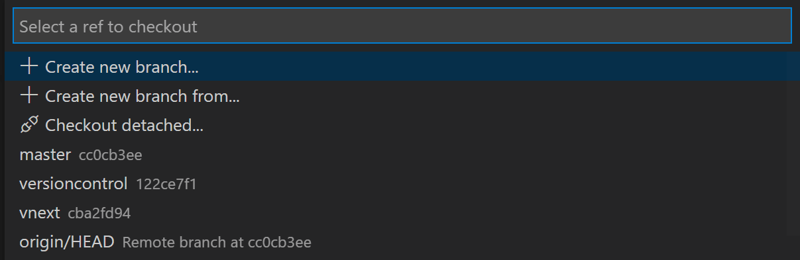

+++
title = "Overview"
date = 2024-01-12T22:36:24+08:00
weight = 1
type = "docs"
description = ""
isCJKLanguage = true
draft = false
+++

> 原文: [https://code.visualstudio.com/docs/sourcecontrol/overview](https://code.visualstudio.com/docs/sourcecontrol/overview)

# Using Git source control in VS Code 在 VS Code 中使用 Git 源代码管理


Visual Studio Code has integrated source control management (SCM) and includes [Git](https://git-scm.com/) support out-of-the-box. Many other source control providers are available through [extensions]() on the VS Code Marketplace.

​​	Visual Studio Code 集成了源代码管理 (SCM)，并开箱即用地支持 Git。VS Code Marketplace 上的扩展提供了许多其他源代码控制提供程序。

<iframe width="560" height="315" src="https://www.youtube.com/embed/i_23KUAEtUM" title="Using Git with Visual Studio Code (Official Beginner Tutorial)" frameborder="0" allow="accelerometer; autoplay; clipboard-write; encrypted-media; gyroscope; picture-in-picture" allowfullscreen="" style="box-sizing: border-box; font-family: &quot;Segoe UI&quot;, &quot;Helvetica Neue&quot;, Helvetica, Arial, sans-serif; width: 616.662px; max-width: 100%; height: 400px; color: rgb(36, 36, 36); font-size: 16px; font-style: normal; font-variant-ligatures: normal; font-variant-caps: normal; font-weight: 400; letter-spacing: normal; orphans: 2; text-align: start; text-indent: 0px; text-transform: none; widows: 2; word-spacing: 0px; -webkit-text-stroke-width: 0px; white-space: normal; background-color: rgb(255, 255, 255); text-decoration-thickness: initial; text-decoration-style: initial; text-decoration-color: initial;"></iframe>


## [Working in a Git repository 在 Git 存储库中工作]()

> **Just getting started with Git?** The [git-scm](https://git-scm.com/documentation) website is a good place to start, with a popular online [book](https://git-scm.com/book), Getting Started [videos](https://git-scm.com/video/what-is-git) and [cheat sheets](https://github.github.com/training-kit/downloads/github-git-cheat-sheet.pdf). The VS Code documentation assumes you are already familiar with Git.
>
> ​​	刚开始使用 Git？git-scm 网站是一个不错的起点，其中包含一本流行的在线书籍、入门视频和备忘单。VS Code 文档假定您已经熟悉 Git。


> **Make sure Git is installed.** VS Code will use your machine's Git installation (at least version `2.0.0`), so you need to [install Git](https://git-scm.com/download) first before you get these features.
>
> ​​	确保已安装 Git。VS Code 将使用计算机的 Git 安装（至少版本 `2.0.0` ），因此在获取这些功能之前，您需要先安装 Git。

The Source Control icon in the Activity Bar on the left will always indicate an **overview of how many changes** you currently have in your repository. Selecting the icon will show you the details of your current repository changes: **CHANGES**, **STAGED CHANGES** and **MERGE CHANGES**.

​​	左侧“活动栏”中的“源代码管理”图标始终会概述您当前在存储库中拥有的更改数量。选择该图标将显示当前存储库更改的详细信息：更改、已暂存更改和合并更改。

Clicking each item will show you in detail **the textual changes within each file**. Note that for unstaged changes, the editor on the right still lets you edit the file: feel free to use it!

​​	单击每个项目将在每个文件中详细显示文本更改。请注意，对于未暂存的更改，右侧的编辑器仍允许您编辑文件：请随意使用它！

You can also find indicators of the **status of your repository** in the bottom-left corner of VS Code: the **current branch**, **dirty indicators**, and the number of **incoming and outgoing commits** of the current branch. You can **checkout** any branch in your repository by clicking that status indicator and selecting the Git reference from the list.

​​	您还可以在 VS Code 的左下角找到存储库状态的指示器：当前分支、脏指示器以及当前分支的传入和传出提交数。您可以通过单击该状态指示器并从列表中选择 Git 引用来签出存储库中的任何分支。

> **Tip:** You can open VS Code in a sub-directory of a Git repository. VS Code's Git services will still work as usual, showing all changes within the repository, but file changes outside of the scoped directory are shaded with a tool tip indicating they are located outside the current workspace.
>
> ​​	提示：您可以在 Git 存储库的子目录中打开 VS Code。VS Code 的 Git 服务仍将照常工作，显示存储库中的所有更改，但范围目录之外的文件更改会以工具提示着色，指示它们位于当前工作区之外。

## [Commit 提交]()

**Staging** (git add) and **unstaging** (git reset) can be done via contextual actions in the files or by drag-and-drop.

​​	暂存 (git add) 和取消暂存 (git reset) 可以通过文件中的上下文操作或通过拖放来完成。

> **Configure your Git username and email.** When you commit, be aware that if your username and/or email is not set in your Git configuration, Git will fall back to using information from your local machine. You can find the details in [Git commit information](https://git-scm.com/docs/git-commit#_commit_information).
>
> ​​	配置您的 Git 用户名和电子邮件。提交时，请注意，如果您的用户名和/或电子邮件未在 Git 配置中设置，Git 将回退到使用本地计算机中的信息。您可以在 Git 提交信息中找到详细信息。


You can type a commit message above the changes and press Ctrl+Enter (macOS: ⌘+Enter) to commit them. If there are any staged changes, only those changes will be committed. Otherwise, you'll get a prompt asking you to select what changes you'd like to commit and get the option to change your commit settings.

​​	您可以在更改上方键入提交消息，然后按 Ctrl+Enter（macOS：⌘+Enter）提交它们。如果有任何暂存的更改，则只会提交这些更改。否则，您将收到一个提示，要求您选择要提交的更改，并可以选择更改您的提交设置。

We've found this to be a great workflow. For example, in the earlier screenshot, only the staged changes to `overview.png` will be included in the commit. Later staging and commit actions could include the changes to `versioncontrol.md` and the two other `.png` images as a separate commit.

​​	我们发现这是一个很好的工作流。例如，在前面的屏幕截图中，只有对 `overview.png` 的暂存更改将包含在提交中。稍后的暂存和提交操作可以将对 `versioncontrol.md` 的更改和另外两个 `.png` 图像作为单独的提交包括进来。

More specific **Commit** actions can be found in the **Views and More Actions** `...` menu on the top of the Source Control view.

​​	可以在源代码管理视图顶部的“视图和更多操作” `...` 菜单中找到更具体的提交操作。


> **Tip:** If you commit your change to the wrong branch, undo your commit using the **Git: Undo Last Commit** command in the **Command Palette** (Ctrl+Shift+P).
>
> ​​	提示：如果您将更改提交到错误的分支，请使用命令面板（Ctrl+Shift+P）中的 Git：撤消上次提交命令撤消您的提交。

<iframe src="https://www.youtube.com/embed/E6ADS2k8oNQ" width="640" height="320" allowfullscreen="true" frameborder="0" title="Git: Commits in Visual Studio Code" style="box-sizing: border-box; font-family: &quot;Segoe UI&quot;, &quot;Helvetica Neue&quot;, Helvetica, Arial, sans-serif; width: 616.662px; max-width: 100%; height: 400px; color: rgb(36, 36, 36); font-size: 16px; font-style: normal; font-variant-ligatures: normal; font-variant-caps: normal; font-weight: 400; letter-spacing: normal; orphans: 2; text-align: start; text-indent: 0px; text-transform: none; widows: 2; word-spacing: 0px; -webkit-text-stroke-width: 0px; white-space: normal; background-color: rgb(255, 255, 255); text-decoration-thickness: initial; text-decoration-style: initial; text-decoration-color: initial;"></iframe>


## [Cloning a repository 克隆存储库]()

If you haven't opened a folder yet, the Source Control view will give you the options to **Open Folder** from your local machine or **Clone Repository**.

​​	如果您尚未打开文件夹，则源代码管理视图将为您提供从本地计算机“打开文件夹”或“克隆存储库”的选项。


If you select **Clone Repository**, you will be asked for the URL of the remote repository (for example on [GitHub](https://github.com/)) and the parent directory under which to put the local repository.

​​	如果您选择“克隆存储库”，系统会要求您提供远程存储库的 URL（例如在 GitHub 上）以及放置本地存储库的父目录。

For a GitHub repository, you would find the URL from the GitHub **Code** dialog.

​​	对于 GitHub 存储库，您可以在 GitHub 代码对话框中找到 URL。


You would then paste that URL into the **Git: Clone** prompt.

​​	然后，您会将该 URL 粘贴到 Git：克隆提示中。


You'll also see the option to **Clone from GitHub**. Once you authenticate with your GitHub account in VS Code, you'll be able to search through repositories by name, and select any repo to clone it. You can also start the flow to clone a Git repository with the **Git: Clone** command in the **Command Palette** (Ctrl+Shift+P). To see a step-by-step walkthrough, check out our [Clone repos from VS Code](https://www.youtube.com/watch?v=bz1KauFlbQI) video.

​​	您还会看到从 GitHub 克隆的选项。在 VS Code 中使用 GitHub 帐户进行身份验证后，您将能够按名称搜索存储库，并选择任何存储库进行克隆。您还可以使用命令面板（Ctrl+Shift+P）中的 Git：克隆命令启动克隆 Git 存储库的流程。若要查看分步演练，请观看我们的从 VS Code 克隆存储库视频。

> **Note**: If you'd like to work on a repository without cloning the contents to your local machine, you can install the [GitHub Repositories](https://marketplace.visualstudio.com/items?itemName=github.remotehub) extension to browse and edit directly on GitHub. You can learn more in the [GitHub Repositories extension]() section.
>
> ​​	注意：如果您想处理存储库而不将内容克隆到本地计算机，则可以安装 GitHub Repositories 扩展以直接在 GitHub 上浏览和编辑。您可以在 GitHub Repositories 扩展部分中了解更多信息。

## [Branches and Tags 分支和标记]()

<iframe src="https://www.youtube.com/embed/b9LTz6joMf8?clip=Ugkxcq7zDGA4aMi8p7lICNMzTANn_8ozU5gK&amp;clipt=EPiBAxj08QU" width="640" height="320" allowfullscreen="true" frameborder="0" title="Create Git Branches in Visual Studio Code" style="box-sizing: border-box; font-family: &quot;Segoe UI&quot;, &quot;Helvetica Neue&quot;, Helvetica, Arial, sans-serif; width: 616.662px; max-width: 100%; height: 400px; color: rgb(36, 36, 36); font-size: 16px; font-style: normal; font-variant-ligatures: normal; font-variant-caps: normal; font-weight: 400; letter-spacing: normal; orphans: 2; text-align: start; text-indent: 0px; text-transform: none; widows: 2; word-spacing: 0px; -webkit-text-stroke-width: 0px; white-space: normal; background-color: rgb(255, 255, 255); text-decoration-thickness: initial; text-decoration-style: initial; text-decoration-color: initial;"></iframe>


You can create and checkout branches directly within VS Code through the **Git: Create Branch** and **Git: Checkout to** commands in the **Command Palette** (Ctrl+Shift+P).

​​	您可以通过命令面板（Ctrl+Shift+P）中的 Git：创建分支和 Git：检出命令直接在 VS Code 中创建和签出分支。

If you run **Git: Checkout to**, you will see a dropdown list containing all of the branches or tags in the current repository. It will also give you the option to create a new branch if you decide that's a better option, or checkout a branch in detached mode.

​​	如果您运行 Git: Checkout to，您将看到一个下拉列表，其中包含当前存储库中的所有分支或标记。如果决定这是一个更好的选项，它还将为您提供创建新分支或以分离模式签出分支的选项。



The **Git: Create Branch** command lets you quickly create a new branch. Just provide the name of your new branch and VS Code will create the branch and switch to it. If you choose to **Create new branch from...**, you'll get an extra prompt that allows you to specify which commit the new branch should be pointing to.

​​	Git: Create Branch 命令可让您快速创建新分支。只需提供新分支的名称，VS Code 就会创建该分支并切换到该分支。如果您选择从...创建新分支，您将获得一个额外的提示，允许您指定新分支应指向哪个提交。

## [Remotes 远程]()

Given that your repository is connected to some remote and that your checked out branch has an [upstream link](https://git-scm.com/book/ch3-5.html) to a branch in that remote, VS Code offers you useful actions to **push**, **pull**, and **sync** that branch (the latter will run a **pull** command followed by a **push** command). You can find these actions in the **Views and More Actions** `...` menu, along with the option to **add or remove a remote**.

​​	鉴于您的存储库已连接到某个远程存储库，并且您签出的分支具有指向该远程存储库中某个分支的上游链接，VS Code 为您提供了有用的操作来推送、拉取和同步该分支（后者将运行一个拉取命令，然后运行一个推送命令）。您可以在“视图”和“更多操作” `...` 菜单中找到这些操作，以及添加或删除远程存储库的选项。

VS Code is able to periodically fetch changes from your remotes. This enables VS Code to show how many changes your local repository is ahead or behind the remote. This feature is disabled by default and you can use the `git.autofetch` [setting]() to enable it.

​​	VS Code 能够定期从远程获取更改。这使 VS Code 能够显示本地存储库比远程存储库超前或落后多少更改。此功能默认情况下处于禁用状态，您可以使用 `git.autofetch` 设置启用它。

> **Tip:** You should [set up a credential helper](https://docs.github.com/get-started/getting-started-with-git/caching-your-github-credentials-in-git) to avoid getting asked for credentials every time VS Code talks to your Git remotes. If you don't do this, you may want to consider disabling automatic fetching via the `git.autofetch` [setting]() to reduce the number of prompts you get.
>
> ​​	提示：您应该设置一个凭据帮助程序，以避免每次 VS Code 与 Git 远程通信时都被要求提供凭据。如果您不这样做，您可能需要考虑通过 `git.autofetch` 设置禁用自动获取，以减少收到的提示数量。

## [Git Status Bar actions Git 状态栏操作]()

There is a **Synchronize Changes** action in the Status Bar, next to the branch indicator, when the current checked out branch has an upstream branch configured. **Synchronize Changes** will pull remote changes down to your local repository and then push local commits to the upstream branch.

​​	当当前检出的分支配置了上游分支时，状态栏中有一个“同步更改”操作，位于分支指示符旁边。同步更改会将远程更改拉取到本地存储库，然后将本地提交推送到上游分支。


If there is no upstream branch configured and the Git repository has remotes set up, the **Publish** action is enabled. This will let you publish the current branch to a remote.

​​	如果未配置上游分支且 Git 存储库已设置远程，则会启用“发布”操作。这将允许您将当前分支发布到远程。


## [Gutter indicators 槽指示符]()

If you open a folder that is a Git repository and begin making changes, VS Code will add useful annotations to the gutter and to the overview ruler.

​​	如果您打开一个作为 Git 存储库的文件夹并开始进行更改，VS Code 会将有用的注释添加到槽和概览标尺中。

- A red triangle indicates where lines have been deleted
  红色三角形表示已删除的行
- A green bar indicates new added lines
  绿色条形表示新添加的行
- A blue bar indicates modified lines
  蓝色条形表示已修改的行


## [Merge conflicts 合并冲突]()


Merge conflicts are recognized by VS Code. Differences are highlighted and there are inline actions to accept either one or both changes. Once the conflicts are resolved, stage the conflicting file so you can commit those changes.

​​	VS Code 可识别合并冲突。差异会突出显示，并提供内联操作以接受其中一项或两项更改。解决冲突后，暂存冲突文件，以便提交这些更改。

## [3-way merge editor 三方合并编辑器]()

To help you resolve merge conflicts, VS Code provides a 3-way merge editor where you can interactively accept incoming and current changes and view and edit the resulting merged file. The 3-way merge editor is opened by selecting the **Resolve in Merge Editor** button in the bottom right corner of a file with Git merge conflicts.

​​	为了帮助您解决合并冲突，VS Code 提供了一个三方合并编辑器，您可以在其中交互式地接受传入和当前的更改，并查看和编辑合并后的文件。通过选择带有 Git 合并冲突的文件右下角的“在合并编辑器中解决”按钮，可以打开三方合并编辑器。

The 3-way merge editor displays separate views for **Incoming** changes (on the left), **Current** changes (on the right), and the **Result** of the merge (at the bottom). Conflicts are highlighted and can be resolved by using the CodeLens buttons.

​​	三方合并编辑器为传入的更改（在左侧）、当前的更改（在右侧）和合并的结果（在底部）显示单独的视图。冲突会突出显示，可以使用 CodeLens 按钮解决。


### [Resolving conflicts 解决冲突]()

The 3-way merge editor allows you to resolve conflicts by accepting either one or both changes. You can also manually edit the result of the merge.

​​	三方合并编辑器允许您通过接受一项或两项更改来解决冲突。您还可以手动编辑合并的结果。

For some conflicts, the merge editor shows an **Accept Combination** button. Accepting the combination resolves the current conflict by smartly merging both changes. This is especially useful for changes in the same line that don't touch the same characters.

​​	对于某些冲突，合并编辑器会显示“接受合并”按钮。接受合并通过智能合并两个更改来解决当前冲突。这对于不涉及相同字符的同一行中的更改特别有用。

Use the **Ignore** buttons to accept neither the incoming nor current change, but mark the conflict as resolved. This resets the conflicting area to the state before any changes were made.

​​	使用“忽略”按钮既不接受传入的更改也不接受当前更改，但将冲突标记为已解决。这会将冲突区域重置为在进行任何更改之前的状态。

### [Completing the merge 完成合并]()

You can use the conflict counter in the right of the result editor to keep track of how many unresolved conflicts are remaining. Clicking on the counter jumps to the next unresolved conflict. Once all conflicts are resolved, you can complete the merge by selecting **Complete Merge** in the bottom right corner. This stages the file and closes the merge editor.

​​	您可以使用结果编辑器右侧的冲突计数器来跟踪剩余的未解决冲突数。单击计数器可跳转到下一个未解决的冲突。解决所有冲突后，您可以通过选择右下角的“完成合并”来完成合并。这会暂存文件并关闭合并编辑器。

### [Alternative layouts and more 备用布局等]()

Selecting the three dots (**···**) in the top right corner of the merge editor opens a context menu with additional options. You can switch to a vertical layout and display the base view, which shows the state of the file before any changes were made.

​​	选择合并编辑器右上角的三个点 (···) 会打开一个包含其他选项的上下文菜单。您可以切换到垂直布局并显示基本视图，该视图显示在进行任何更改之前的文件状态。

The three dots next to **Incoming**, **Current**, and **Result** offer options for each view, such as showing a side-by-side diff against base, accepting all changes, or resetting the result.

​​	“传入”、“当前”和“结果”旁边的三个点为每个视图提供选项，例如显示与基准的并排差异、接受所有更改或重置结果。

### [Understanding conflicts 了解冲突]()

If you want to learn more about the details of how 3-way merge editors work, we can recommend the following video:

​​	如果您想详细了解 3 向合并编辑器的工作原理，我们可以推荐以下视频：

<iframe width="560" height="315" src="https://www.youtube.com/embed/HosPml1qkrg" title="The EXTREMELY helpful guide to merge conflicts" frameborder="0" allow="accelerometer; autoplay; clipboard-write; encrypted-media; gyroscope; picture-in-picture; web-share" allowfullscreen="" style="box-sizing: border-box; font-family: &quot;Segoe UI&quot;, &quot;Helvetica Neue&quot;, Helvetica, Arial, sans-serif; width: 616.662px; max-width: 100%; height: 400px; color: rgb(36, 36, 36); font-size: 16px; font-style: normal; font-variant-ligatures: normal; font-variant-caps: normal; font-weight: 400; letter-spacing: normal; orphans: 2; text-align: start; text-indent: 0px; text-transform: none; widows: 2; word-spacing: 0px; -webkit-text-stroke-width: 0px; white-space: normal; background-color: rgb(255, 255, 255); text-decoration-thickness: initial; text-decoration-style: initial; text-decoration-color: initial;"></iframe>


## [Viewing diffs 查看差异]()

Our Git tooling supports viewing of diffs within VS Code.

​​	我们的 Git 工具支持在 VS Code 中查看差异。


> **Tip:** You can diff any two files by first right clicking on a file in the Explorer or **OPEN EDITORS** list and selecting **Select for Compare** and then right-click on the second file to compare with and select **Compare with 'file_name_you_chose'**. Alternatively from the keyboard hit Ctrl+Shift+P and select **File: Compare Active File With** and you will be presented with a list of recent files.
>
> ​​	提示：您可以通过首先在资源管理器或打开的编辑器列表中右键单击文件并选择“选择以比较”，然后右键单击要比较的第二个文件并选择“与‘您选择的_文件名’比较”来比较任意两个文件。或者，从键盘按 Ctrl+Shift+P 并选择“文件：将活动文件与...比较”，您将看到最近文件的列表。

### [Accessible Diff Viewer 无障碍差异查看器]()

There is an Accessible Diff Viewer in the Diff editor that presents changes in a unified patch format. You can navigate between changes with **Go to Next Difference** (F7) and **Go to Previous Difference** (Shift+F7). Lines can be navigated with arrow keys and pressing Enter will jump back in the Diff editor and the selected line.

​​	差异编辑器中有一个无障碍差异查看器，它以统一的修补程序格式显示更改。您可以使用“转到下一个差异”(F7) 和“转到上一个差异”(Shift+F7) 在更改之间导航。可以使用箭头键导航行，按 Enter 将在差异编辑器和选定行中跳回。


**Note:** This experience is especially helpful for screen reader users.

​​	注意：此体验对屏幕阅读器用户特别有帮助。

## [Timeline view 时间线视图]()

The Timeline view, accessible at the bottom of the File Explorer by default, is a unified view for visualizing time-series events (for example, Git commits) for a file.

​​	默认情况下，可以在文件资源管理器的底部访问时间线视图，它是用于可视化文件的时间序列事件（例如，Git 提交）的统一视图。


VS Code's built-in Git support provides the Git commit history of the specified file. Selecting a commit will open a diff view of the changes introduced by that commit. When you right-click on a commit, you'll get options to **Copy Commit ID** and **Copy Commit Message**.

​​	VS Code 的内置 Git 支持提供指定文件的 Git 提交历史记录。选择提交将打开该提交引入的更改的差异视图。右键单击提交时，您将获得“复制提交 ID”和“复制提交消息”的选项。

Visual Studio Code supports more Git history workflows through [extensions]() available on the VS Code Marketplace.

​​	Visual Studio Code 通过 VS Code Marketplace 上提供的扩展支持更多 Git 历史记录工作流。


GitLens — Git supercharged
GitLens — Git 超级增强

28.7M

eamodio


Git History
Git 历史记录

10.2M

donjayamanne


Git Graph
Git 图表

6.9M

mhutchie


Git History Diff
Git 历史差异

630.5K

huizhou

> **Tip:** Click on an extension tile to read the description and reviews in the Marketplace.
>
> ​​	提示：单击扩展磁贴以阅读 Marketplace 中的描述和评论。

## [Git output window Git 输出窗口]()

You can always peek under the hood to see the Git commands we are using. This is helpful if something strange is happening or if you are just curious. :)

​​	您可以随时查看幕后内容，以查看我们正在使用的 Git 命令。如果发生奇怪的事情或您只是好奇，这会很有帮助。:)

To open the Git output window, run **View** > **Output** and select **Log (Git)** from the dropdown list.

​​	要打开 Git 输出窗口，请运行视图 > 输出，然后从下拉列表中选择日志 (Git)。

## [Initialize a repository 初始化存储库]()

If your workspace is on your local machine, you can enable Git source control by creating a Git repository with the **Initialize Repository** command. When VS Code doesn't detect an existing Git repository, the Source Control view will give you the options to **Initialize Repository** or **Publish to GitHub**.

​​	如果您的工作区在本地计算机上，您可以通过使用“初始化存储库”命令创建 Git 存储库来启用 Git 源代码管理。当 VS Code 未检测到现有 Git 存储库时，“源代码管理”视图将为您提供“初始化存储库”或“发布到 GitHub”选项。


You can also run the **Git: Initialize Repository** and **Publish to GitHub** commands from the **Command Palette** (Ctrl+Shift+P). Running **Initialize Repository** will create the necessary Git repository metadata files and show your workspace files as untracked changes ready to be staged. **Publish to GitHub** will directly publish your workspace folder to a GitHub repository, allowing you to choose between private and public repositories. Check out our [publishing repos](https://www.youtube.com/watch?v=3BBvBwDW4CY) video for more information about publishing to GitHub.

​​	您还可以从命令面板（Ctrl+Shift+P）运行“Git: 初始化存储库”和“发布到 GitHub”命令。运行“初始化存储库”将创建必要的 Git 存储库元数据文件，并将工作区文件显示为准备暂存的未跟踪更改。发布到 GitHub 会将您的工作区文件夹直接发布到 GitHub 存储库，允许您在私有和公有存储库之间进行选择。请查看我们的发布存储库视频，以获取有关发布到 GitHub 的更多信息。

## [VS Code as Git editor VS Code 作为 Git 编辑器]()

When you launch VS Code from the command line, you can pass the `--wait` argument to make the launch command wait until you have closed the new VS Code instance. This can be useful when you configure VS Code as your Git external editor so Git will wait until you close the launched VS Code instance.

​​	当您从命令行启动 VS Code 时，您可以传递 `--wait` 参数，以使启动命令等到您关闭新的 VS Code 实例后才继续执行。当您将 VS Code 配置为 Git 外部编辑器时，这会很有用，这样 Git 会等到您关闭已启动的 VS Code 实例后才继续执行。

Here are the steps to do so:

​​	以下是执行此操作的步骤：

1. Make sure you can run

    

   ```
   code --help
   ```

    

   from the command line and you get help.

   
   确保您可以从命令行运行 `code --help` 并获得帮助。

   - if you do not see help, please follow these steps:

     
     如果您没有看到帮助，请按照以下步骤操作：

     - macOS: Select **Shell Command: Install 'Code' command in path** from the **Command Palette**.
       macOS：从命令面板中选择 Shell 命令：在路径中安装“代码”命令。
     - Windows: Make sure you selected **Add to PATH** during the installation.
       Windows：确保您在安装过程中选择了添加到 PATH。
     - Linux: Make sure you installed Code via our new `.deb` or `.rpm` packages.
       Linux：确保您通过我们的新 `.deb` 或 `.rpm` 包安装了 Code。

2. From the command line, run `git config --global core.editor "code --wait"`
   从命令行运行 `git config --global core.editor "code --wait"`

Now you can run `git config --global -e` and use VS Code as editor for configuring Git.

​​	现在，您可以运行 `git config --global -e` 并使用 VS Code 作为编辑器来配置 Git。

### [VS Code as Git difftool and mergetool VS Code 作为 Git difftool 和 mergetool]()

You can use VS Code's diff and merge capabilities even when using Git from command-line. Add the following to your Git configurations to use VS Code as the diff and merge tool:

​​	即使从命令行使用 Git，您也可以使用 VS Code 的 diff 和 merge 功能。将以下内容添加到您的 Git 配置中，以使用 VS Code 作为 diff 和 merge 工具：

```
[diff]
    tool = default-difftool
[difftool "default-difftool"]
    cmd = code --wait --diff $LOCAL $REMOTE
[merge]
  tool = code
[mergetool "code"]
  cmd = code --wait --merge $REMOTE $LOCAL $BASE $MERGED
```

This uses the `--diff` option that can be passed to VS Code to compare two files side by side. The merge tool will be used the next time Git discovers a merge conflict.

​​	这使用可以传递给 VS Code 以并排比较两个文件的 `--diff` 选项。下次 Git 发现合并冲突时，将使用合并工具。

To summarize, here are some examples of where you can use VS Code as the editor:

​​	总结一下，以下是一些可以使用 VS Code 作为编辑器的情况：

- `git rebase HEAD~3 -i` do interactive rebase using VS Code
  `git rebase HEAD~3 -i` 使用 VS Code 执行交互式变基
- `git commit` use VS Code for the commit message
  `git commit` 将 VS Code 用于提交消息
- `git add -p` followed by e for interactive add
  `git add -p` 然后按 e 进行交互式添加
- `git difftool <commit>^ <commit>` use VS Code as the diff editor for changes
  `git difftool <commit>^ <commit>` 将 VS Code 用作更改的差异编辑器

## [Working with GitHub Pull Requests and Issues 使用 GitHub 拉取请求和问题]()

Visual Studio Code can also bring in GitHub's pull requests and issues. Create your PRs in VS Code, review with comments, and approve them without switching context. Learn more about [GitHub PRs and Issues in VS Code]().

​​	Visual Studio Code 还可以引入 GitHub 的拉取请求和问题。在 VS Code 中创建 PR，通过评论进行审查，并在不切换上下文的情况下批准它们。详细了解 VS Code 中的 GitHub PR 和问题。

## [SCM Providers SCM 提供程序]()


Git Extension Pack
Git 扩展包

1.7M
170 万

donjayamanne


SVN

987.1K

johnstoncode


Hg

117.2K

mrcrowl


Perforce for VS Code
适用于 VS Code 的 Perforce

68.5K

slevesque

> **Tip:** Click on an extension tile to read the description and reviews in the Marketplace.
>
> ​​	提示：单击扩展磁贴以阅读 Marketplace 中的说明和评论。

VS Code has support for handling multiple Source Control providers simultaneously. For example, you can open multiple Git repositories alongside your Azure DevOps Server local workspace and seamlessly work across your projects. To turn on the **Source Control Providers** view, select the overflow menu in the **Source Control** view (Ctrl+Shift+G), hover over **Views**, and make sure that **Source Control Repositories** is marked with a check. The **Source Control Providers** view shows the detected providers and repositories, and you can scope the display of your changes by selecting a specific provider.

​​	VS Code 支持同时处理多个源代码管理提供程序。例如，您可以在 Azure DevOps Server 本地工作区旁边打开多个 Git 存储库，并在项目之间无缝工作。若要打开源代码管理提供程序视图，请选择源代码管理视图 (Ctrl+Shift+G) 中的溢出菜单，将鼠标悬停在“视图”上，并确保源代码管理存储库已标记为选中。源代码管理提供程序视图显示检测到的提供程序和存储库，您可以通过选择特定提供程序来限定所做更改的显示范围。


### [SCM Provider extensions SCM 提供程序扩展]()

If you would like to install another SCM provider, you can search on the **scm providers** extension category in the **Extensions** view (Ctrl+Shift+X). Start typing '@ca' and you will see suggestions for extension categories like debuggers and linters. Select `@category:"scm providers"` to see available SCM providers.

​​	如果您想安装另一个 SCM 提供程序，可以在“扩展”视图（Ctrl+Shift+X）中搜索 SCM 提供程序扩展类别。开始键入“@ca”，您将看到扩展类别的建议，例如调试器和 linter。选择 `@category:"scm providers"` 以查看可用的 SCM 提供程序。


## [Next steps 后续步骤]()

- [Intro Video - Git Version Control](https://code.visualstudio.com/docs/introvideos/versioncontrol) - An introductory video providing an overview of VS Code Git support.
  简介视频 - Git 版本控制 - 一个介绍性视频，概述了 VS Code Git 支持。
- [Basic Editing]() - Learn about the powerful VS Code editor.
  基本编辑 - 了解功能强大的 VS Code 编辑器。
- [Code Navigation]() - Move quickly through your source code.
  代码导航 - 快速浏览源代码。
- [Debugging]() - This is where VS Code really shines
  调试 - 这是 VS Code 真正出彩的地方
- [Tasks]() - Running tasks with Gulp, Grunt, and Jake. Showing Errors and Warnings
  任务 - 使用 Gulp、Grunt 和 Jake 运行任务。显示错误和警告
- [Source Control API](https://code.visualstudio.com/api/extension-guides/scm-provider) - If you want to integrate another Source Control provider into VS Code, see our Source Control API.
  源代码管理 API - 如果您想将另一个源代码管理提供程序集成到 VS Code 中，请参阅我们的源代码管理 API。
