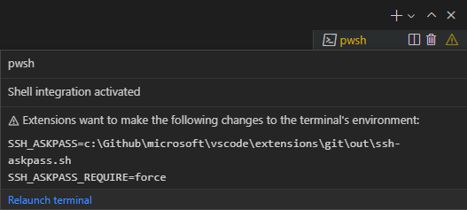

+++
title = "Advanced"
date = 2024-01-12T22:36:24+08:00
weight = 40
type = "docs"
description = ""
isCJKLanguage = true
draft = false
+++

> 原文: [https://code.visualstudio.com/docs/terminal/advanced](https://code.visualstudio.com/docs/terminal/advanced)

# Terminal Advanced 终端高级版


Visual Studio Code's integrated terminal has many advanced features and settings, such as Unicode and emoji support, custom keybindings, and automatic replies. This topic explains these advanced features in detail. If you are new to VS Code or the integrated terminal, you may want to review the [Terminal Basics](https://code.visualstudio.com/docs/terminal/basics) topic first.

​​	Visual Studio Code 的集成终端具有许多高级功能和设置，例如 Unicode 和表情符号支持、自定义键绑定和自动回复。本主题详细介绍了这些高级功能。如果您不熟悉 VS Code 或集成终端，您可能需要先查看“终端基础知识”主题。

## [Persistent sessions 持久会话](https://code.visualstudio.com/docs/terminal/advanced#_persistent-sessions)

The terminal supports two different types of persistent sessions:

​​	终端支持两种不同类型的持久会话：

- Process reconnection: When reloading a window (for example, after installing an extension), **reconnect** to the previous process and restore its content.
  进程重新连接：重新加载窗口时（例如，在安装扩展后），重新连接到上一个进程并还原其内容。
- Process revive: When restarting VS Code, a terminal's content is restored and the process is **relaunched** using its original environment.
  进程恢复：重新启动 VS Code 时，将还原终端的内容，并使用其原始环境重新启动进程。

Both of these persistent sessions can be disabled by setting `terminal.integrated.enablePersistentSessions` to `false`, and the amount of scrollback restored is controlled by the`terminal.integrated.persistentSessionScrollback` setting. Process revive can be configured independently with `terminal.integrated.persistentSessionReviveProcess`.

​​	可以通过将 `terminal.integrated.enablePersistentSessions` 设置为 `false` 来禁用这两个持久会话，并且还原的滚动量由 `terminal.integrated.persistentSessionScrollback` 设置控制。可以使用 `terminal.integrated.persistentSessionReviveProcess` 独立配置进程恢复。

### [Moving terminals between windows 在窗口之间移动终端](https://code.visualstudio.com/docs/terminal/advanced#_moving-terminals-between-windows)

Terminal tabs can be dragged and dropped between VS Code windows. This can also be done manually through the Command Palette and the **Terminal: Detach Session** and **Terminal: Attach to Session** commands.

​​	可以在 VS Code 窗口之间拖放终端选项卡。也可以通过命令面板和“终端：分离会话”和“终端：附加到会话”命令手动完成此操作。

### [Configure how the terminal behaves on start up 配置终端在启动时的行为](https://code.visualstudio.com/docs/terminal/advanced#_configure-how-the-terminal-behaves-on-start-up)

When opening a window, if the terminal view is visible it will either reconnect to the terminal using persistent sessions, or create a new shell. This behavior can be fine tuned with the `terminal.integrated.hideOnStartup` setting.

​​	打开窗口时，如果终端视图可见，它将使用持久会话重新连接到终端，或创建一个新的 shell。此行为可以通过 `terminal.integrated.hideOnStartup` 设置进行微调。

- `never` (default): Never hide the terminal view on startup.
  `never` （默认）：启动时绝不隐藏终端视图。
- `whenEmpty`: Only hide the terminal when there are no persistent sessions restored.
  `whenEmpty` ：仅在没有恢复持久会话时隐藏终端。
- `always`: Always hide the terminal, even when there are persistent sessions restored.
  `always` ：始终隐藏终端，即使恢复了持久会话。

## [Keybinding and the shell 键绑定和 shell](https://code.visualstudio.com/docs/terminal/advanced#_keybinding-and-the-shell)

As an embedded application, the integrated terminal should intercept some, but not all, keybindings dispatched within VS Code.

​​	作为嵌入式应用程序，集成终端应拦截 VS Code 中分派的一些（但不是全部）键绑定。

The configurable `terminal.integrated.commandsToSkipShell` setting determines which command's keybindings should always "skip the shell" and instead be handled by VS Code's keybinding system. By default, it contains a hard-coded list of commands that are integral to the VS Code experience but you can add or remove specific commands:

​​	可配置的 `terminal.integrated.commandsToSkipShell` 设置确定哪些命令的键绑定应始终“跳过 shell”，而应由 VS Code 的键绑定系统处理。默认情况下，它包含一个与 VS Code 体验不可或缺的命令的硬编码列表，但您可以添加或删除特定命令：

```
{
  "terminal.integrated.commandsToSkipShell": [
    // Ensure the toggle sidebar visibility keybinding skips the shell
    "workbench.action.toggleSidebarVisibility",
    // Send quick open's keybinding to the shell
    "-workbench.action.quickOpen",
  ]
}
```

Look at the `terminal.integrated.commandsToSkipShell` setting details to see the complete list of default commands.

​​	查看 `terminal.integrated.commandsToSkipShell` 设置详细信息以查看默认命令的完整列表。

> **Tip:** `terminal.integrated.sendKeybindingsToShell` can be configured to override `terminal.integrated.commandsToSkipShell` and dispatch most keybindings to the shell. Note that this will disable keybindings like Ctrl+F to open [find](https://code.visualstudio.com/docs/terminal/basics#find) though.
>
> ​​	提示： `terminal.integrated.sendKeybindingsToShell` 可以配置为覆盖 `terminal.integrated.commandsToSkipShell` 并将大多数键绑定分派到 shell。请注意，这将禁用诸如 Ctrl+F 之类的键绑定以打开查找。

### [Chords 和弦](https://code.visualstudio.com/docs/terminal/advanced#_chords)

Chord keybindings are made up of two keybindings, for example Ctrl+K followed by Ctrl+C to change the line to a comment. Chords always skip the shell by default but can be disabled with `terminal.integrated.allowChords`.

​​	和弦键绑定由两个键绑定组成，例如 Ctrl+K 后跟 Ctrl+C 将行更改为注释。和弦始终默认跳过 shell，但可以使用 `terminal.integrated.allowChords` 禁用。

### [macOS clear screen macOS 清除屏幕](https://code.visualstudio.com/docs/terminal/advanced#_macos-clear-screen)

On macOS, Cmd+K is a common keybindings in terminals to clear the screen so VS Code also respects that, which means Cmd+K chords will not work. Cmd+K chords can be enabled by [removing the clear keybinding](https://code.visualstudio.com/docs/getstarted/keybindings#_removing-a-specific-key-binding-rule):

​​	在 macOS 上，Cmd+K 是终端中清除屏幕的常见键绑定，因此 VS Code 也尊重这一点，这意味着 Cmd+K 和弦将不起作用。可以通过删除清除键绑定来启用 Cmd+K 和弦：

```
{
  "key": "cmd+k",
  "command": "-workbench.action.terminal.clear"
}
```

Additionally, this keyboard shortcut will be overridden automatically if any extensions contribute Cmd+K keybindings due to how keybinding priority works. To re-enable the Cmd+K clear keybinding in this case, you can redefine it in user keybindings, which have a higher priority than extension keybindings:

​​	此外，如果任何扩展由于键绑定优先级的工作方式而提供 Cmd+K 键绑定，此键盘快捷键将自动被覆盖。在这种情况下，若要重新启用 Cmd+K 清除键绑定，可以在用户键绑定中重新定义它，用户键绑定优先级高于扩展键绑定：

```
{
  "key": "cmd+k",
  "command": "workbench.action.terminal.clear",
  "when": "terminalFocus && terminalHasBeenCreated || terminalFocus && terminalProcessSupported"
}
```

### [Mnemonics 助记符](https://code.visualstudio.com/docs/terminal/advanced#_mnemonics)

Using mnemonics to access VS Code's menu (for example, Alt+F for File menu) is disabled by default in the terminal as these key events are often important hotkeys in shells. Set `terminal.integrated.allowMnemonics` to enable mnemonics, but note that this will disallow any Alt key events to go to the shell. This setting does nothing on macOS.

​​	默认情况下，在终端中禁用使用助记符访问 VS Code 的菜单（例如，Alt+F 用于文件菜单），因为这些键盘事件通常是 shell 中重要的热键。将 `terminal.integrated.allowMnemonics` 设置为启用助记符，但请注意，这将禁止任何 Alt 键事件进入 shell。此设置在 macOS 上不起作用。

### [Custom sequence keybindings 自定义序列键绑定](https://code.visualstudio.com/docs/terminal/advanced#_custom-sequence-keybindings)

The `workbench.action.terminal.sendSequence` command can be used to send a specific sequence of text to the terminal, including escape sequences that are interpreted specially by the shell. The command enables you to send Arrow keys, Enter, cursor moves, etc.

​​	可以使用 `workbench.action.terminal.sendSequence` 命令向终端发送特定的文本序列，包括 shell 特别解释的转义序列。此命令使您可以发送箭头键、Enter、光标移动等。

For example, the sequence below jumps over the word to the left of the cursor (Ctrl+Left) and then presses Backspace:

​​	例如，以下序列跳过光标左侧的单词（Ctrl+左），然后按退格键：

```
{
  "key": "ctrl+u",
  "command": "workbench.action.terminal.sendSequence",
  "args": {
    "text": "\u001b[1;5D\u007f"
  }
}
```

This feature supports [variable substitution](https://code.visualstudio.com/docs/editor/variables-reference).

​​	此功能支持变量替换。

The `sendSequence` command only works with the `\u0000` format for using characters via their character code (not `\x00`). Read more about these hex codes and terminal sequences in the following resources:

​​	 `sendSequence` 命令仅适用于使用字符代码（而非 `\x00` ）的 `\u0000` 格式的字符。在以下资源中详细了解这些十六进制代码和终端序列：

- [XTerm Control Sequences
  XTerm 控制序列](https://invisible-island.net/xterm/ctlseqs/ctlseqs.html)
- [List of C0 and C1 control codes
  C0 和 C1 控制代码列表](https://github.com/xtermjs/xterm.js/blob/0e45909c7e79c83452493d2cd46d99c0a0bb585f/src/common/data/EscapeSequences.ts)

## [Confirmation dialogs 确认对话框](https://code.visualstudio.com/docs/terminal/advanced#_confirmation-dialogs)

In order to avoid unnecessary output and user prompts, the terminal does not show warning dialogs when processes exit. If warnings are desirable, they can be configured with the following settings:

​​	为了避免不必要的输出和用户提示，当进程退出时，终端不会显示警告对话框。如果需要警告，可以使用以下设置进行配置：

- `terminal.integrated.confirmOnExit` - Controls whether to confirm when the window closes if there are active debug sessions.
  `terminal.integrated.confirmOnExit` - 控制在有活动调试会话时关闭窗口时是否确认。
- `terminal.integrated.confirmOnKill` - Controls whether to confirm killing terminals when they have child processes.
  `terminal.integrated.confirmOnKill` - 控制在有子进程时是否确认终止终端。
- `terminal.integrated.showExitAlert` - Controls whether to show the alert "The terminal process terminated with exit code" when exit code is non-zero.
  `terminal.integrated.showExitAlert` - 控制当退出代码非零时是否显示警报“终端进程以退出代码终止”。

## [Auto replies 自动回复](https://code.visualstudio.com/docs/terminal/advanced#_auto-replies)

The terminal can automatically provide a configurable input response to the shell if an exact sequence of output is received. The most common use case is to automatically reply to a prompt when hitting Ctrl+C in batch scripts that ask whether the user wants to terminate the batch job. To automatically dismiss this message, add this setting:

​​	如果接收到精确的输出序列，终端可以自动向外壳提供可配置的输入响应。最常见的用例是在批处理脚本中按 Ctrl+C 时自动回复提示，询问用户是否要终止批处理作业。要自动关闭此消息，请添加此设置：

```
{
  "terminal.integrated.autoReplies": {
    "Terminate batch job (Y/N)": "Y\r"
  }
}
```

Notice that the `\r` character used here means Enter, and much like [custom sequence keybindings](https://code.visualstudio.com/docs/terminal/advanced#_custom-sequence-keybindings), this feature supports sending escape sequences to the shell.

​​	请注意，此处使用的 `\r` 字符表示回车，与自定义序列键绑定非常相似，此功能支持向外壳发送转义序列。

No auto replies are configured by default as providing shell input should be an explicit action or configuration by the user.

​​	默认情况下不配置自动回复，因为提供外壳输入应为用户的显式操作或配置。

## [Change tab stop width 更改制表符宽度](https://code.visualstudio.com/docs/terminal/advanced#_change-tab-stop-width)

The `terminal.integrated.tabStopWidth` setting allows configuring the tab stop width when a program running in the terminal outputs `\t`. This should typically not be needed as programs will often move the cursor instead of using the Tab character, but may be useful in some situations.

​​	当在终端中运行的程序输出 `\t` 时， `terminal.integrated.tabStopWidth` 设置允许配置制表符宽度。通常不需要这样做，因为程序通常会移动光标而不是使用 Tab 字符，但在某些情况下可能有用。

## [Unicode and emoji support 支持 Unicode 和表情符号](https://code.visualstudio.com/docs/terminal/advanced#_unicode-and-emoji-support)

The terminal has both Unicode and emoji support. When these characters are used in the terminal, there are some caveats to that support:

​​	终端同时支持 Unicode 和表情符号。当在终端中使用这些字符时，该支持有一些注意事项：

- Some Unicode symbols have ambiguous width that may change between Unicode versions. Currently we support Unicode version 6 and 11 widths, which can be configured with the `terminal.integrated.unicodeVersion` setting. The version specified should match the Unicode version used by the shell/operating system, otherwise there could be rendering issues. Note that the Unicode version of the shell/OS may not match the font's actual width.
  某些 Unicode 符号具有模糊的宽度，可能会在 Unicode 版本之间发生变化。目前我们支持 Unicode 版本 6 和 11 的宽度，可以通过 `terminal.integrated.unicodeVersion` 设置进行配置。指定的版本应与 shell/操作系统使用的 Unicode 版本匹配，否则可能会出现渲染问题。请注意，shell/操作系统的 Unicode 版本可能与字体的实际宽度不匹配。
- Some emojis comprised of multiple characters may not render correctly, for example, skin tone modifiers.
  某些由多个字符组成的表情符号可能无法正确渲染，例如肤色修饰符。
- Emoji support is limited on Windows.
  在 Windows 上，表情符号支持有限。

## [Image support 图像支持](https://code.visualstudio.com/docs/terminal/advanced#_image-support)

Images in the terminal work provided they use either the Sixel or iTerm inline image protocols. This feature is disabled by default and can be enabled with the `terminal.integrated.enableImages` setting.

​​	终端中的图像可以使用 Sixel 或 iTerm 内联图像协议工作。此功能默认情况下处于禁用状态，可以使用 `terminal.integrated.enableImages` 设置启用。

Current limitations:

​​	当前限制：

- Serialization does not work, so reloading a terminal will not retain any images ([jerch/xterm-addon-image#47](https://github.com/jerch/xterm-addon-image/issues/47)).
  序列化不起作用，因此重新加载终端不会保留任何图像 ( jerch/xterm-addon-image#47)。
- Copying the selection as HTML does not include the selected image ([jerch/xterm-addon-image#50](https://github.com/jerch/xterm-addon-image/issues/50)).
  将选定内容复制为 HTML 不包括选定的图像 ( jerch/xterm-addon-image#50)。
- Animated gifs don't work ([jerch/xterm-addon-image#51](https://github.com/jerch/xterm-addon-image/issues/51)).
  动画 gif 不起作用 ( jerch/xterm-addon-image#51)。
- Images that are shorter than a cell will not work properly, this is a [design flaw with the sequences and also occurs in XTerm](https://github.com/microsoft/vscode/issues/183840#issuecomment-1569345048).
  短于一个单元格的图像无法正常工作，这是序列的一个设计缺陷，在 XTerm 中也会发生。

## [Process environment 进程环境](https://code.visualstudio.com/docs/terminal/advanced#_process-environment)

The process environment of the application running within the terminal is influenced by various settings and extensions and can cause the output in the VS Code terminal to look different than in other terminals.

​​	在终端内运行的应用程序的进程环境受各种设置和扩展的影响，可能导致 VS Code 终端中的输出看起来与其他终端中的输出不同。

### [Environment inheritance 环境继承](https://code.visualstudio.com/docs/terminal/advanced#_environment-inheritance)

When VS Code is opened, it launches a login shell environment in order to source a shell environment. This is done because developer tools are often added to the `$PATH` in a shell launch script like `~/.bash_profile`. By default, the terminal inherits this environment, depending on your [profile shell arguments](https://code.visualstudio.com/docs/terminal/profiles#_configuring-profiles), and means that multiple profile scripts may have run, which could cause unexpected behavior.

​​	打开 VS Code 时，它会启动一个登录 shell 环境，以便获取 shell 环境的源。这样做是因为通常在 shell 启动脚本（如 `~/.bash_profile` ）中将开发人员工具添加到 `$PATH` 中。默认情况下，终端会继承此环境（具体取决于您的配置文件 shell 参数），这意味着可能运行了多个配置文件脚本，这可能会导致意外行为。

This environment inheritance can be disabled on macOS and Linux via the `terminal.integrated.inheritEnv` setting.

​​	可以在 macOS 和 Linux 上通过 `terminal.integrated.inheritEnv` 设置禁用此环境继承。

### [Interaction with $LANG 与 $LANG 的交互](https://code.visualstudio.com/docs/terminal/advanced#_interaction-with-lang)

There is some special interaction with the `$LANG` environment variable, which determines how characters are presented in the terminal. This feature is configured with the `terminal.integrated.detectLocale` setting:

​​	与 `$LANG` 环境变量有一些特殊交互，它决定了在终端中如何显示字符。此功能通过 `terminal.integrated.detectLocale` 设置进行配置：

| Value 值                           | Behavior 行为                                                |
| :--------------------------------- | :----------------------------------------------------------- |
| `on`                               | Always set `$LANG` to the most commonly desired value. The chosen value is based on the operating system locale (falling back to `en-US`) with UTF-8 encoding. 始终将 `$LANG` 设置为最常用的所需值。所选值基于操作系统区域设置（回退到 `en-US` ）并使用 UTF-8 编码。 |
| `auto` (default) `auto` （默认值） | Set `$LANG` similar to the `on` behavior if `$LANG` is not properly configured (is not set to a UTF or EUC encoding). 如果 `$LANG` 未正确配置（未设置为 UTF 或 EUC 编码），则将 `$LANG` 设置为类似于 `on` 的行为。 |
| `off`                              | Do not modify `$LANG`. 不要修改 `$LANG` 。                   |

### [Extension environment contributions 扩展环境贡献](https://code.visualstudio.com/docs/terminal/advanced#_extension-environment-contributions)

Extensions are able to [contribute to terminal environments](https://code.visualstudio.com/api/references/vscode-api#ExtensionContext.environmentVariableCollection), allowing them to provide some integration with the terminal. For example, the built-in Git extension injects the `GIT_ASKPASS` environment variable to allow VS Code to handle authentication to a Git remote.

​​	扩展能够为终端环境做出贡献，允许它们与终端提供某种集成。例如，内置 Git 扩展会注入 `GIT_ASKPASS` 环境变量，以允许 VS Code 处理对 Git 远程的验证。

If an extension changes the terminal environment, any existing terminals will be relaunched if it is safe to do so, otherwise a warning will show in the terminal status. More information about the change can be viewed in the hover, which also includes a relaunch button.

​​	如果扩展更改了终端环境，则如果这样做是安全的，任何现有的终端都将重新启动，否则将在终端状态中显示警告。可以在悬停中查看有关更改的更多信息，其中还包括一个重新启动按钮。



## [Windows and ConPTY Windows 和 ConPTY](https://code.visualstudio.com/docs/terminal/advanced#_windows-and-conpty)

VS Code's terminal is built on the [xterm.js](https://github.com/xtermjs/xterm.js) project to implement a Unix-style terminal that serializes all data into a string and pipes it through a "pseudoterminal". Historically, this was not how the terminal worked on Windows, which used the [Console API](https://learn.microsoft.com/windows/console/console-functions) to implement its console called 'conhost'.

​​	VS Code 的终端基于 xterm.js 项目构建，以实现一个类 Unix 终端，该终端将所有数据序列化为字符串，并通过“伪终端”进行管道传输。从历史上看，这不是终端在 Windows 上的工作方式，Windows 使用控制台 API 来实现其名为“conhost”的控制台。一个名为 winpty 的开源项目被创建，旨在通过在类 Unix 终端和 Windows 控制台之间提供一个模拟/转换层来尝试修复此问题。VS Code 的终端最初仅使用 winpty 实现。这在当时非常棒，但在 2018 年，Windows 10 收到了 ConPTY API，该 API 采用了 winpty 开创的想法并将其集成到 Windows 中，从而提供了一个更可靠且受支持的系统来利用 Windows 上的类 Unix 终端和应用。

An open source project called [winpty](https://github.com/rprichard/winpty) was created to try to fix this issue by providing an emulation/translation layer between a Unix-style terminal and a Windows console. VS Code's terminal was originally implemented using only winpty. This was great at the time, but in 2018, Windows 10 received [the ConPTY API](https://devblogs.microsoft.com/commandline/windows-command-line-introducing-the-windows-pseudo-console-conpty/), which took the idea pioneered by winpty and baked it into Windows, providing a more reliable and supported system to leverage Unix-style terminals and apps on Windows.

​​	VS Code 在 Windows 10+（内部版本号 18309 起）上默认为 ConPTY，并回退到 winpty 作为旧版 Windows 的传统选项。可以通过 设置显式禁用 ConPTY，但通常应避免这样做。

VS Code defaults to ConPTY on Windows 10+ (from build number 18309) and falls back to winpty as a legacy option for older versions of Windows. ConPTY can be explicitly disabled via the `terminal.integrated.windowsEnableConpty` settings but this should normally be avoided.

Since ConPTY is an emulation layer, it does come with some quirks. The most common is that ConPTY considers itself the owner of the viewport and because of that will sometimes reprint the screen. This reprinting can cause unexpected behavior such as old content displaying after running the **Terminal: Clear** command.

​​	由于 ConPTY 是一个模拟层，因此它确实有一些怪癖。最常见的是 ConPTY 认为自己是视口的拥有者，因此有时会重新打印屏幕。这种重新打印可能会导致意外行为，例如在运行 Terminal: Clear 命令后显示旧内容。

## [Remote development 远程开发](https://code.visualstudio.com/docs/terminal/advanced#_remote-development)

This section outlines topics specific to when VS Code is connected to a remote machine using a VS Code [Remote Development](https://code.visualstudio.com/docs/remote/remote-overview) extension.

​​	本部分概述了使用 VS Code 远程开发扩展将 VS Code 连接到远程计算机时特有的主题。

### [Reducing remote input latency 减少远程输入延迟](https://code.visualstudio.com/docs/terminal/advanced#_reducing-remote-input-latency)

Local echo is a feature that helps mitigate the effect of input latency on remote windows. It writes the keystrokes in the terminal in a dimmed color before the result is confirmed by the remote. By default, the feature start running when latency is detected to be above 30 ms and the timing can be configured with `terminal.integrated.localEchoLatencyThreshold`. The color of the unconfirmed characters is defined by `terminal.integrated.localEchoStyle`.

​​	本地回显是一项有助于减轻远程窗口中输入延迟影响的功能。它以灰暗的颜色在终端中写入击键，然后由远程确认结果。默认情况下，当检测到延迟高于 30 毫秒时，此功能开始运行，并且可以使用 `terminal.integrated.localEchoLatencyThreshold` 配置时序。未确认字符的颜色由 `terminal.integrated.localEchoStyle` 定义。

Local echo disables itself dynamically depending on the active program in the terminal. This is controlled by `terminal.integrated.localEchoExcludePrograms`, which defaults to `['vim', 'vi', 'nano', 'tmux']`. It's recommended that you disable the feature for any application or shell that is highly dynamic and/or does a lot of reprinting of the screen when typing.

​​	本地回显会根据终端中的活动程序动态禁用自身。这由 `terminal.integrated.localEchoExcludePrograms` 控制，默认为 `['vim', 'vi', 'nano', 'tmux']` 。建议您为任何高度动态和/或在键入时大量重新打印屏幕的应用程序或 shell 禁用此功能。

To disable the feature completely, use:

​​	要完全禁用此功能，请使用：

```
{
  "terminal.integrated.localEchoEnabled": false
}
```

### [Local terminals in remote windows 远程窗口中的本地终端](https://code.visualstudio.com/docs/terminal/advanced#_local-terminals-in-remote-windows)

The default **local** terminal profile can be launched in remote windows with the **Terminal: Create New Integrated Terminal (Local)** command via the Command Palette. Currently non-default profiles cannot be launched from remote windows.

​​	默认本地终端配置文件可以通过命令面板中的“终端：创建新的集成终端（本地）”命令在远程窗口中启动。目前无法从远程窗口启动非默认配置文件。
