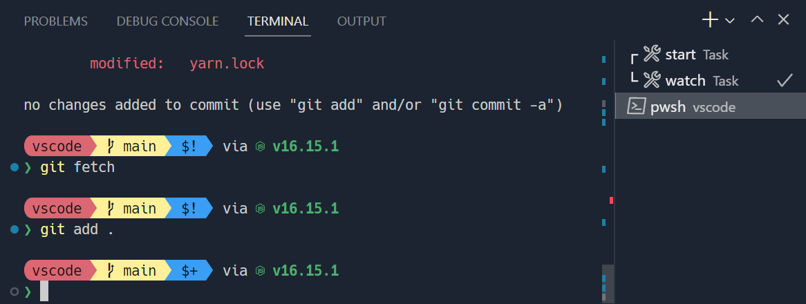
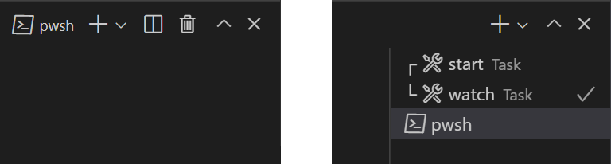
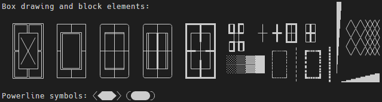

+++
title = "Appearance"
date = 2024-01-12T22:36:24+08:00
weight = 30
type = "docs"
description = ""
isCJKLanguage = true
draft = false
+++

> 原文: [https://code.visualstudio.com/docs/terminal/appearance](https://code.visualstudio.com/docs/terminal/appearance)

# Terminal Appearance 终端外观


The look of Visual Studio Code's terminal can be customized extensively.

​​	Visual Studio Code 终端的外观可以进行广泛自定义。



*[Sapphire](https://marketplace.visualstudio.com/items?itemName=tyriar.theme-sapphire) theme with custom [Starship](https://starship.rs/) prompt using the font [Hack](https://sourcefoundry.org/hack/) with [Nerd Font](https://www.nerdfonts.com/) symbols
使用带有 Nerd 字体符号的 Hack 字体，自定义 Starship 提示的 Sapphire 主题*

## [Text style 文本样式](https://code.visualstudio.com/docs/terminal/appearance#_text-style)

Text in the terminal can be customized with the following settings:

​​	可以使用以下设置自定义终端中的文本：

- `terminal.integrated.fontFamily`: The font family to use, this takes a string in the format that fontFamily in CSS takes. For example, `"'Fira Code', monospace"` will configure `Fira Code` as the primary font and `monospace` as the fallback when it lacks glyphs.
  `terminal.integrated.fontFamily` ：要使用的字体系列，采用 CSS 中 fontFamily 所采用的格式的字符串。例如， `"'Fira Code', monospace"` 将配置 `Fira Code` 作为主字体，当其缺少字形时，将 `monospace` 配置为备用字体。
- `terminal.integrated.fontSize`: Changes the font size of text in the terminal.
  `terminal.integrated.fontSize` ：更改终端中文本的字体大小。
- `terminal.integrated.letterSpacing`: Configures additional horizontal spacing between characters in pixels.
  `terminal.integrated.letterSpacing` ：以像素为单位配置字符之间的额外水平间距。
- `terminal.integrated.lineHeight`: Configures additional spacing vertical between characters as a multiplier of the regular line height. For example, `1.1` will add 10% additional vertical space.
  `terminal.integrated.lineHeight` ：将字符之间的额外垂直间距配置为常规行高的倍数。例如， `1.1` 将添加 10% 的额外垂直间距。
- `terminal.integrated.fontWeight`: Configures the font weight of "normal" text.
  `terminal.integrated.fontWeight` ：配置“普通”文本的字体粗细。
- `terminal.integrated.fontWeightBold`: Configures the font weight of "bold" text.
  `terminal.integrated.fontWeightBold` ：配置“粗体”文本的字体粗细。

### [Powerline symbols and Nerd Fonts 电力线符号和 Nerd 字体](https://code.visualstudio.com/docs/terminal/appearance#_powerline-symbols-and-nerd-fonts)

[Powerline](https://powerline.readthedocs.io/) fonts are special patched fonts that contain additional characters that can be used in the terminal. VS Code's terminal [renders some of the Powerline symbols without needing to configure a font](https://code.visualstudio.com/docs/terminal/appearance#_custom-glyphs), but if more glyphs are desired, configure a Powerline font with the font family setting. Powerline fonts typically end in `" for Powerline"`, the following setting is an example of how to configure a DejaVu Sans Mono that has been patched:

​​	电力线字体是包含可用于终端的附加字符的特殊修补字体。VS Code 的终端无需配置字体即可呈现一些电力线符号，但如果需要更多字形，请使用字体系列设置配置电力线字体。电力线字体通常以 `" for Powerline"` 结尾，以下设置是配置已修补的 DejaVu Sans Mono 的示例：

```
"editor.fontFamily": "'DejaVu Sans Mono for Powerline'"
```

Nerd Fonts work the same and typically have a `" NF"` suffix, the following is an example of how to configure Hack's nerd fonts variant:

​​	Nerd 字体的工作方式相同，通常带有 `" NF"` 后缀，以下是如何配置 Hack 的 nerd 字体变体的示例：

```
"terminal.integrated.fontFamily": "'Hack NF'"
```

## [Terminal cursor 终端光标](https://code.visualstudio.com/docs/terminal/appearance#_terminal-cursor)

The terminal cursor style and whether it blinks can be customized with the following settings:

​​	可以使用以下设置自定义终端光标样式以及是否闪烁：

- `terminal.integrated.cursorStyle`: Defines the shape of the cursor, can be block, line or underline.
  `terminal.integrated.cursorStyle` ：定义光标的形状，可以是块、线或下划线。
- `terminal.integrated.cursorWidth`: How wide in pixels the cursor should be when the cursor style is set to `line`.
  `terminal.integrated.cursorWidth` ：当光标样式设置为 `line` 时，光标的像素宽度应为多少。
- `terminal.integrated.cursorBlinking`: Whether the cursor should blink when the terminal is focused.
  `terminal.integrated.cursorBlinking` ：当终端获得焦点时，光标是否应闪烁。
- `terminal.integrated.cursorStyleInactive`: Defines the shape of the cursor, can be outline, block, line, underline or none.
  `terminal.integrated.cursorStyleInactive` ：定义光标的形状，可以是轮廓、块、线、下划线或无。

## [Customizing tabs 自定义选项卡](https://code.visualstudio.com/docs/terminal/appearance#_customizing-tabs)

Terminal tabs appear on the right of the terminal view when there are two or more terminals by default, showing the active terminal in the view header when there is only one.

​​	默认情况下，当有两个或更多个终端时，终端选项卡会显示在终端视图的右侧，当只有一个终端时，则在视图标题中显示活动终端。



### [Visibility 可见性](https://code.visualstudio.com/docs/terminal/appearance#_visibility)

The default visibility is designed to save horizontal space, but may not be desirable. How tabs are presented can be configured with the following settings:

​​	默认可见性旨在节省水平空间，但可能不理想。选项卡的显示方式可以通过以下设置进行配置：

- `terminal.integrated.tabs.hideCondition`: When to hide the tabs to the right, set to `"never"` to always show them.
  `terminal.integrated.tabs.hideCondition` ：何时将选项卡隐藏在右侧，设置为 `"never"` 以始终显示它们。
- `terminal.integrated.tabs.showActiveTerminal`: When to show the active terminal in the terminal view header.
  `terminal.integrated.tabs.showActiveTerminal` ：何时在终端视图标题中显示活动终端。
- `terminal.integrated.tabs.showActions`: When to show the active terminal's actions in the view header.
  `terminal.integrated.tabs.showActions` ：何时在视图标题中显示活动终端的操作。
- `terminal.integrated.tabs.location`: Whether the tabs should be shown on the left or right of the terminal.
  `terminal.integrated.tabs.location` ：选项卡应显示在终端的左侧还是右侧。
- `terminal.integrated.tabs.enabled`: Whether to use tabs, disabling will show the original dropdown view.
  `terminal.integrated.tabs.enabled` ：是否使用选项卡，禁用将显示原始的下拉视图。

### [Tab text 选项卡文本](https://code.visualstudio.com/docs/terminal/appearance#_tab-text)

The text on each tab is determined by the following settings:

​​	每个选项卡上的文本由以下设置确定：

- `terminal.integrated.tabs.title`: Tab title.
  `terminal.integrated.tabs.title` ：选项卡标题。
- `terminal.integrated.tabs.description`: Text that appears to the right of the title.
  `terminal.integrated.tabs.description` ：显示在标题右侧的文本。
- `terminal.integrated.tabs.separator`: Separator character between the title and description.
  `terminal.integrated.tabs.separator` ：标题和说明之间的分隔符。默认情况下，标题显示 shell 检测到的进程名称。

By default, the title displays what the shell's detected process name.

​​	其他终端通常显示 shell 发送的转义序列作为标题，可以通过以下方式进行配置：

Other terminals often display the escape sequence sent by the shell as the title, which can be configured with:

​​	图标

```
"terminal.integrated.tabs.title": "${sequence}"
```

### [Icons 每个终端都有一个关联的图标，由其终端配置文件决定。默认图标及其颜色（如果在配置文件中未定义，将使用该颜色）可以通过 和 设置进行配置。](https://code.visualstudio.com/docs/terminal/appearance#_icons)

Each terminal has an associated icon that is determined by its [terminal profile](https://code.visualstudio.com/docs/terminal/profiles). The default icon and its color, which will be used if not defined in a profile, can be configured with the `terminal.integrated.tabs.defaultIcon` and `terminal.integrated.tabs.defaultColor` settings.

​​	状态

### [Status 终端的“状态”（如果有）由显示在选项卡右侧的图标表示。某些状态涉及动画。如果这会分散注意力，则可以通过以下方式禁用动画：](https://code.visualstudio.com/docs/terminal/appearance#_status)

A terminal's "status", if any, is signified by an icon that appears on the right of the tab. Some statuses involve animation. If this is distracting the animation can be disabled with:

​​	视觉铃声

```
"terminal.integrated.tabs.enableAnimation": false
```

### [Visual bell](https://code.visualstudio.com/docs/terminal/appearance#_visual-bell)

When the terminal's bell is triggered, a yellow bell icon is briefly shown. This can be disabled with `terminal.integrated.enableBell` and the duration can be configured with `terminal.integrated.bellDuration`.

​​	当终端的铃声被触发时，会短暂显示一个黄色的铃铛图标。这可以通过 `terminal.integrated.enableBell` 禁用，并且可以通过 `terminal.integrated.bellDuration` 配置持续时间。

## [Terminal colors 终端颜色](https://code.visualstudio.com/docs/terminal/appearance#_terminal-colors)

While the terminal is capable of displaying true color, programs commonly use 8 ANSI colors (black, red, green, yellow, blue, magenta, cyan and white) and bright variants of each. These ANSI colors are determined by the active [color theme](https://code.visualstudio.com/docs/getstarted/themes), but they can also be configured independently from the theme with the [workbench.colorCustomizations](https://code.visualstudio.com/docs/getstarted/themes#_workbench-colors) setting.

​​	虽然终端能够显示真彩色，但程序通常使用 8 种 ANSI 颜色（黑色、红色、绿色、黄色、蓝色、品红色、青色和白色）以及每种颜色的亮色变体。这些 ANSI 颜色由活动颜色主题确定，但也可以通过 workbench.colorCustomizations 设置独立于主题进行配置。

Whether bold text uses the normal ANSI colors or the bright variant can be configured with the `terminal.integrated.drawBoldTextInBrightColors` setting.

​​	粗体文本是使用普通 ANSI 颜色还是亮色变体可以通过 `terminal.integrated.drawBoldTextInBrightColors` 设置进行配置。

### [Minimum contrast ratio 最小对比度](https://code.visualstudio.com/docs/terminal/appearance#_minimum-contrast-ratio)

Terminals often have contrast issues due to some conflict with dark/light themes, ANSI colors or shells/programs running, and more.

​​	终端通常由于与深色/浅色主题、ANSI 颜色或正在运行的 shell/程序等发生冲突而存在对比度问题。

The minimum contrast ratio feature solves this problem by either increasing or reducing the luminance of the text's foreground color until a 4.5:1 contrast ratio is met.

​​	最小对比度功能通过增加或减少文本前景色亮度来解决此问题，直到达到 4.5:1 的对比度。

One downside of this is that colored text may sometimes lose some of its saturation. This feature can be configured or disabled to get the original colors with:

​​	此功能的一个缺点是彩色文本有时可能会失去一些饱和度。可以通过以下方式配置或禁用此功能以获取原始颜色：

```
"terminal.integrated.minimumContrastRatio": 1
```

## [GPU acceleration GPU 加速](https://code.visualstudio.com/docs/terminal/appearance#_gpu-acceleration)

The terminal features three different renderers, each of which have different trade offs:

​​	终端具有三种不同的渲染器，每种渲染器都有不同的权衡：

- WebGL renderer - True GPU acceleration.
  WebGL 渲染器 - 真正的 GPU 加速。
- Canvas renderer - GPU acceleration by using the [`CanvasRenderingContext2D` web API](https://developer.mozilla.org/en-US/docs/Web/API/CanvasRenderingContext2D), slower than WebGL but faster than DOM.
  画布渲染器 - 使用 `CanvasRenderingContext2D` Web API 进行 GPU 加速，比 WebGL 慢，但比 DOM 快。
- DOM renderer - A fallback renderer that's much slower but has great compatibility.
  DOM 渲染器 - 速度慢得多但兼容性极佳的备用渲染器。

GPU acceleration driven by the WebGL renderer is enabled in the terminal by default. This helps the terminal work faster and display at a high FPS by significantly reducing the time the CPU spends rendering each frame.

​​	默认情况下，终端中启用了由 WebGL 渲染器驱动的 GPU 加速。这有助于终端工作得更快，并通过显著减少 CPU 渲染每帧所花费的时间来以高 FPS 显示。

When on Linux VMs, browsers that don't support WebGL, or machines with outdated drivers, WebGL may not work properly.

​​	在 Linux VM 上、不支持 WebGL 的浏览器中或具有过时驱动程序的机器上，WebGL 可能无法正常工作。

The default `terminal.integrated.gpuAcceleration` value of `"auto"` tries the WebGL, canvas, and DOM renderers sequentially, settling at the first without detected issues.

​​	默认 `terminal.integrated.gpuAcceleration` 值 `"auto"` 按顺序尝试 WebGL、画布和 DOM 渲染器，停留在第一个没有检测到问题的渲染器上。

Sometimes this detection doesn't work and requires manual intervention, setting `terminal.integrated.gpuAcceleration` to `"off"` typically resolves rendering-related problems like these at the cost of performance.

​​	有时此检测不起作用，需要手动干预，将 `terminal.integrated.gpuAcceleration` 设置为 `"off"` 通常可以解决这些与渲染相关的问题，但会牺牲性能。

### [Custom glyphs 自定义字形](https://code.visualstudio.com/docs/terminal/appearance#_custom-glyphs)

When [GPU acceleration](https://code.visualstudio.com/docs/terminal/appearance#_gpu-acceleration) is enabled, custom rendering, rather than the font, improves how some characters display in the terminal. These include box drawing characters (`U+2500-U+257F`), block elements (`U+2580-U+259F`) and a subset of Powerline symbols (`U+E0B0-U+E0BF`). This means that the configured font does not need to support these characters as well as having the characters draw pixel perfect and stretch to the size of the entire cell.

​​	启用 GPU 加速后，自定义渲染（而非字体）可以改善某些字符在终端中的显示方式。这些字符包括框图字符 ( `U+2500-U+257F` )、块元素 ( `U+2580-U+259F` ) 和 Powerline 符号的子集 ( `U+E0B0-U+E0BF` )。这意味着配置的字体无需支持这些字符，而且这些字符可以像素完美地绘制并延伸至整个单元格的大小。

Below are some examples of these characters with custom line height and letter spacing configured. Notice how there are no gaps between cells thanks to the custom glyphs:

​​	下面是一些具有自定义行高和字母间距配置的这些字符的示例。注意，由于自定义字形，单元格之间没有间隙：



This feature can be disabled by setting `"terminal.integrated.customGlyphs": false`.

​​	可以通过设置 `"terminal.integrated.customGlyphs": false` 来禁用此功能。

## [Customizing your prompt 自定义提示](https://code.visualstudio.com/docs/terminal/appearance#_customizing-your-prompt)

Most shells allow extensive customization of the terminal prompt. This is done by configuring your shell outside VS Code, typically by modifying the `$PS1` variable, setting a `$PROMPT_COMMAND` or installing a plugin.

​​	大多数 shell 允许广泛自定义终端提示符。这可以通过在 VS Code 外部配置 shell 来完成，通常是通过修改 `$PS1` 变量、设置 `$PROMPT_COMMAND` 或安装插件来完成。

Some prompts like [Starship](https://starship.rs/) and [oh-my-posh](https://ohmyposh.dev/) show things like git status and work with most shells, so they're a good choice when starting out.

​​	像 Starship 和 oh-my-posh 这样的某些提示符会显示 git 状态等内容，并且适用于大多数 shell，因此在开始时它们是一个不错的选择。

## [Common questions 常见问题](https://code.visualstudio.com/docs/terminal/appearance#_common-questions)

### [Why is my terminal showing a multi-colored triangle or a black rectangle? 为什么我的终端显示一个多色三角形或一个黑色矩形？](https://code.visualstudio.com/docs/terminal/appearance#_why-is-my-terminal-showing-a-multicolored-triangle-or-a-black-rectangle)

The terminal can have problems with GPU accelerated rendering in some environments. For example, you might see a big multi-colored triangle instead of text. This is typically caused by driver/VM graphics issues and the same also happens in Chromium. Work around these issues by launching `code` with the `--disable-gpu` flag or by using the setting `"terminal.integrated.gpuAcceleration": "off"` to avoid using the canvas in the terminal. See the [GPU acceleration](https://code.visualstudio.com/docs/terminal/appearance#_gpu-acceleration) section for more information.

​​	在某些环境中，终端可能会遇到 GPU 加速渲染问题。例如，您可能会看到一个巨大的多色三角形而不是文本。这通常是由驱动程序/VM 图形问题引起的，在 Chromium 中也会发生这种情况。通过使用 `code` 标志启动 `--disable-gpu` 或使用设置 `"terminal.integrated.gpuAcceleration": "off"` 来避免在终端中使用画布，可以解决这些问题。有关更多信息，请参阅 GPU 加速部分。

### [Why are the colors in the terminal not correct? 为什么终端中的颜色不正确？](https://code.visualstudio.com/docs/terminal/appearance#_why-are-the-colors-in-the-terminal-not-correct)

The [minimum contrast ratio feature](https://code.visualstudio.com/docs/terminal/appearance#_minimum-contrast-ratio) can cause colors to not be displayed as expected. It can be disabled with:

​​	最低对比度比率功能可能会导致颜色无法按预期显示。可以使用以下方法禁用它：

```
"terminal.integrated.minimumContrastRatio": 1
```

Background on why this is the default is explained in [vscode#146406](https://github.com/microsoft/vscode/issues/146406#issuecomment-1084825473).

​​	在 vscode#146406 中解释了为什么这是默认设置的背景信息。
