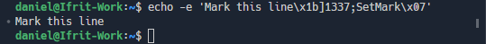

+++
title = "Shell Integration"
date = 2024-01-12T22:36:24+08:00
weight = 20
type = "docs"
description = ""
isCJKLanguage = true
draft = false
+++

> 原文: [https://code.visualstudio.com/docs/terminal/shell-integration](https://code.visualstudio.com/docs/terminal/shell-integration)

# Terminal Shell Integration 终端 Shell 集成


Visual Studio Code has the ability to integrate with common shells, allowing the terminal to understand more about what's actually happening inside the shell. This additional information enables some useful features such as [working directory detection]() and command detection, [decorations](), and [navigation]().

​​	Visual Studio Code 能够与常见 shell 集成，从而使终端更好地了解 shell 内部实际发生的情况。此附加信息支持一些有用的功能，例如工作目录检测和命令检测、修饰和导航。

Supported shells:

​​	受支持的 shell：

- Linux/macOS: bash, fish, pwsh, zsh
  Linux/macOS：bash、fish、pwsh、zsh
- Windows: pwsh
  Windows：pwsh

## [Installation 安装]()

### [Automatic script injection 自动脚本注入]()

By default, the shell integration script should automatically activate on supported shells launched from VS Code. This is done by injecting arguments and/or environment variables when the shell session launches. This automatic injection can be disabled by setting `terminal.integrated.shellIntegration.enabled` to `false`.

​​	默认情况下，shell 集成脚本应在从 VS Code 启动的受支持 shell 上自动激活。这是通过在 shell 会话启动时注入参数和/或环境变量来完成的。可以通过将 `terminal.integrated.shellIntegration.enabled` 设置为 `false` 来禁用此自动注入。

This standard, easy way will not work for some advanced use cases like in sub-shells, through a regular `ssh` session (when not using the [Remote - SSH extension]()) or for some complex shell setups. The recommended way to enable shell integration for those is [manual installation]().

​​	这种标准的简单方法不适用于某些高级用例，例如在子 shell 中、通过常规 `ssh` 会话（不使用远程 - SSH 扩展时）或对于某些复杂的 shell 设置。为这些用例启用 shell 集成的推荐方法是手动安装。

> **Note**: Automatic injection may not work on old versions of the shell, for example older versions of fish do not support the `$XDG_DATA_DIRS` environment variable which is how injection works. You may still be able to manually install to get it working.
>
> ​​	注意：自动注入可能无法在旧版本的 shell 上运行，例如旧版本的 fish 不支持 `$XDG_DATA_DIRS` 环境变量，而注入正是通过该变量实现的。您可能仍能够通过手动安装使其运行。

### [Manual installation 手动安装]()

To manually install shell integration, the VS Code shell integration script needs to run during your shell's initialization. Where and how to do this depends on the shell and OS you're using. When using manual install it's recommended to set `terminal.integrated.shellIntegration.enabled` to `false`, though not mandatory.

​​	要手动安装 shell 集成，VS Code shell 集成脚本需要在 shell 初始化期间运行。具体位置和方法取决于您使用的 shell 和操作系统。使用手动安装时，建议将 `terminal.integrated.shellIntegration.enabled` 设置为 `false` ，但这不是强制要求。

> **Tip:** When using the [Insiders build](https://code.visualstudio.com/insiders), replace `code` with `code-insiders` below.
>
> ​​	提示：使用 Insiders 内部版本时，请将下面的 `code` 替换为 `code-insiders` 。

**bash**

Add the following to your `~/.bashrc` file. Run `code ~/.bashrc` in bash to open the file in VS Code.

​​	将以下内容添加到您的 `~/.bashrc` 文件中。在 bash 中运行 `code ~/.bashrc` 以在 VS Code 中打开该文件。

```
[[ "$TERM_PROGRAM" == "vscode" ]] && . "$(code --locate-shell-integration-path bash)"
```

**fish**

Add the following to your `config.fish`. Run `code $__fish_config_dir/config.fish` in fish to open the file in VS Code.

​​	将以下内容添加到您的 `config.fish` 中。在 fish 中运行 `code $__fish_config_dir/config.fish` 以在 VS Code 中打开该文件。

```
string match -q "$TERM_PROGRAM" "vscode"
and . (code --locate-shell-integration-path fish)
```

**pwsh**

Add the following to your [PowerShell profile](https://learn.microsoft.com/powershell/module/microsoft.powershell.core/about/about_profiles?view=powershell-7.2). Run `code $Profile` in pwsh to open the file in VS Code.

​​	将以下内容添加到您的 PowerShell 配置文件中。在 pwsh 中运行 `code $Profile` 以在 VS Code 中打开该文件。

```
if ($env:TERM_PROGRAM -eq "vscode") { . "$(code --locate-shell-integration-path pwsh)" }
```

**zsh**

Add the following to your `~/.zshrc` file. Run `code ~/.zshrc` in bash to open the file in VS Code.

​​	将以下内容添加到您的 `~/.zshrc` 文件中。在 bash 中运行 `code ~/.zshrc` 以在 VS Code 中打开文件。

```
[[ "$TERM_PROGRAM" == "vscode" ]] && . "$(code --locate-shell-integration-path zsh)"
```

**Git Bash**

⚠️ This is currently experimental and automatic injection is not supported

​​	⚠️ 这目前处于实验阶段，不支持自动注入

Add the following to your `~/.bashrc` file. Run `code ~/.bashrc` in Git Bash to open the file in VS Code.

​​	将以下内容添加到您的 `~/.bashrc` 文件中。在 Git Bash 中运行 `code ~/.bashrc` 以在 VS Code 中打开文件。

```
[[ "$TERM_PROGRAM" == "vscode" ]] && . "$(code --locate-shell-integration-path bash)"
```

#### [Portability versus performance 可移植性与性能]()

The above shell integration installation is cross-platform and compatible with any installation type if `code` is in the `$PATH`. However, this recommended approach starts Node.js to fetch the script path, leading to a slight delay in shell startup. To mitigate this delay, inline the script above by resolving the path ahead of time and adding it directly into your init script.

​​	如果 `code` 在 `$PATH` 中，上述 shell 集成安装是跨平台的，并且与任何安装类型兼容。但是，此推荐方法会启动 Node.js 以获取脚本路径，从而导致 shell 启动时出现轻微延迟。为了减轻此延迟，请通过预先解析路径并将它直接添加到您的 init 脚本中来内联上述脚本。

```
# Output the executable's path first:
code --locate-shell-integration-path bash

# Add the result of the above to the source statement:
[[ "$TERM_PROGRAM" == "vscode" ]] && . "/path/to/shell/integration/script.sh"
```

## [Command decorations and the overview ruler 命令修饰和概述标尺]()

One of the things that shell integration enables is the ability to get the exit codes of the commands run within the terminal. Using this information, decorations are added to the left of the line to indicate whether the command succeeded or failed. These decorations also show up in the relatively new overview ruler in the scroll bar, just like in the editor.

​​	shell 集成启用的一项功能是能够获取在终端内运行的命令的退出代码。使用此信息，会在行的左侧添加修饰，以指示命令是成功还是失败。这些修饰还会显示在滚动条中相对较新的概述标尺中，就像在编辑器中一样。


The decorations can be interacted with to give some contextual actions like re-running the command:

​​	可以与修饰进行交互以提供一些上下文操作，例如重新运行命令：


The command and overview ruler decorations can be configured with the `terminal.integrated.shellIntegration.decorationsEnabled` setting.

​​	命令和概览标尺装饰可以通过 `terminal.integrated.shellIntegration.decorationsEnabled` 设置进行配置。

## [Command navigation 命令导航]()

The commands detected by shell integration feed into the command navigation feature (Ctrl/Cmd+Up, Ctrl/Cmd+Down) to give it more reliable command positions. This feature allows for quick navigation between commands and selection of their output. To select from the current position to the command, you can also hold down Shift, pressing Shift+Ctrl/Cmd+Up and Shift+Ctrl/Cmd+Down.

​​	通过 shell 集成检测到的命令会馈送到命令导航功能（Ctrl/Cmd+向上键、Ctrl/Cmd+向下键），以便为其提供更可靠的命令位置。此功能允许在命令之间快速导航并选择其输出。若要从当前位置选择到命令，还可以按住 Shift，然后按 Shift+Ctrl/Cmd+向上键和 Shift+Ctrl/Cmd+向下键。

## [Sticky scroll 粘性滚动]()

The sticky scroll feature will "stick" the command that is partially showing at the top of the terminal, making it much easier to see what command that output belongs to. Clicking on the sticky scroll component will scroll to the command's location in the terminal buffer.

​​	粘性滚动功能会将部分显示在终端顶部的命令“粘贴”在那里，以便更轻松地查看该输出所属的命令。单击粘性滚动组件会滚动到终端缓冲区中的命令位置。


This can be enabled with the `terminal.integrated.stickyScroll.enabled` setting.

​​	这可以通过 `terminal.integrated.stickyScroll.enabled` 设置启用。

## [Quick fixes 快速修复]()

VS Code scans the output of a command and presents a Quick Fix with actions that have a high likelihood of being what the user will want to do next.

​​	VS Code 会扫描命令的输出，并提供一个快速修复，其中包含很可能就是用户接下来想要执行的操作。


Here are some of the built-in Quick Fixes:

​​	以下是一些内置的快速修复：

- When it's detected that a port is already being listened to, suggest to kill the process and re-run the previous command.
  当检测到某个端口已被侦听时，建议终止该进程并重新运行上一个命令。
- When `git push` fails due to an upstream not being set, suggest to push with the upstream set.
  当 `git push` 因未设置上游而失败时，建议使用已设置上游进行推送。
- When a `git` subcommand fails with a similar command error, suggest to use the similar command(s).
  当 `git` 子命令因类似的命令错误而失败时，建议使用类似的命令。
- When `git push` results in a suggestion to create a GitHub PR, suggest to open the link.
  当 `git push` 导致建议创建 GitHub PR 时，建议打开链接。
- When a `General` or `cmd-not-found` PowerShell feedback provider triggers, suggest each suggestion.
  当 `General` 或 `cmd-not-found` PowerShell 反馈提供程序触发时，建议每个建议。

The Quick Fix feature also supports [audio cues]() for additional feedback when a Quick Fix is available.

​​	快速修复功能还支持在有快速修复可用时提供额外的反馈的音频提示。

## [Run recent command 运行最近的命令]()

The **Terminal: Run Recent Command** command surfaces history from various sources in a Quick Pick, providing similar functionality to a shell's reverse search (Ctrl+R). The sources are the current session's history, previous session history for this shell type and the common shell history file.

​​	终端：运行最近的命令命令在快速选择中显示来自各种来源的历史记录，提供类似于 shell 的反向搜索（Ctrl+R）的功能。来源是当前会话的历史记录、此 shell 类型的前一个会话历史记录和通用 shell 历史记录文件。


Some other functionality of the command:

​​	该命令的其他一些功能：

- By default the search mode is "contiguous search", meaning the search term must exactly match. The button on the right of the search input allows switching to fuzzy search.
  默认情况下，搜索模式为“连续搜索”，这意味着搜索词必须完全匹配。搜索输入右侧的按钮允许切换到模糊搜索。
- In the current session section, there is a clipboard icon in the right of the Quick Pick that will open the command output in an editor.
  在当前会话部分，快速选择右侧有一个剪贴板图标，该图标将在编辑器中打开命令输出。
- The pin action in the right of the Quick Pick can pin the command to the top of the list.
  快速选择右侧的固定操作可以将命令固定到列表顶部。
- Alt can be held to write the text to the terminal without running it.
  可以按住 Alt 键将文本写入终端而不运行它。
- The amount of history stored in the previous session section is determined by the `terminal.integrated.shellIntegration.history` setting.
  先前会话部分中存储的历史记录量由 `terminal.integrated.shellIntegration.history` 设置决定。

The default keybinding for this command is Ctrl+Alt+R. However, when accessibility mode is on these are reversed; Ctrl+R runs a recent command and Ctrl+Alt+R sends Ctrl+R to the shell.

​​	此命令的默认键绑定为 Ctrl+Alt+R。但是，当辅助功能模式开启时，这些键绑定会颠倒；Ctrl+R 运行最近的命令，Ctrl+Alt+R 将 Ctrl+R 发送到 shell。

The keybindings can be flipped when accessibility mode is off with the following keybindings:

​​	当辅助功能模式关闭时，可以使用以下键绑定翻转键绑定：

```
{
    "key": "ctrl+r",
    "command": "workbench.action.terminal.runRecentCommand",
    "when": "terminalFocus"
},
{
  "key": "ctrl+alt+r",
  "command": "workbench.action.terminal.sendSequence",
  "args": { "text": "\u0012"/*^R*/ },
  "when": "terminalFocus"
}
```

## [Go to recent directory 转到最近的目录]()

Similar to the run recent command feature, the **Terminal: Go to Recent Directory** command keeps track of directories that have been visited and allows quick filtering and navigating (`cd`) to them. Alt can be held to write the text to the terminal without running it.

​​	与运行最近的命令功能类似，终端：转到最近的目录命令会跟踪已访问的目录，并允许快速筛选和导航（ `cd` ）到这些目录。可以按住 Alt 键将文本写入终端而不运行它。

The default keybinding for this command is Ctrl+G as it behaves similar to the **Go to Line/Column** command in the editor. Ctrl+G can be send to the shell with Ctrl+Alt+G.

​​	此命令的默认键绑定为 Ctrl+G，因为它与编辑器中的转到行/列命令的行为类似。可以使用 Ctrl+Alt+G 将 Ctrl+G 发送到 shell。

## [Current working directory detection 当前工作目录检测]()

Shell integration tells VS Code what the current working directory of the shell is. This information is not possible to get on Windows without trying to detect the prompt through regex and requires polling on macOS and Linux, which isn't good for performance.

​​	Shell 集成会告知 VS Code shell 的当前工作目录。在 Windows 上，如果不尝试通过正则表达式检测提示，则无法获取此信息，并且在 macOS 和 Linux 上需要轮询，这不利于性能。

One of the biggest features this enables is enhanced resolving of links in the terminal. Take a link `package.json` for example, when the link is activated while shell integration is disabled this will open a search quick pick with `package.json` as the filter if there are multiple `package.json` files in the workspace. When shell integration is enabled however, it will open the `package.json` file in the current folder directly because the current location is known. This allows the output of `ls` for example to reliably open the correct file.

​​	此功能启用的一项最大功能是对终端中的链接进行增强的解析。以链接 `package.json` 为例，当在禁用 shell 集成时激活链接，如果工作区中有多个 `package.json` 文件，这会打开一个搜索快速选取，其中 `package.json` 作为筛选器。但是，当启用 shell 集成时，它会直接在当前文件夹中打开 `package.json` 文件，因为已知当前位置。例如，这允许 `ls` 的输出可靠地打开正确文件。

The current working directory is also used to show the directory in the terminal tab, in the run recent command quick pick and for the `"terminal.integrated.splitCwd": "inherited"` feature.

​​	当前工作目录还用于在终端选项卡中显示目录，在运行最近命令快速选取中以及用于 `"terminal.integrated.splitCwd": "inherited"` 功能。

## [Extended PowerShell keybindings 扩展的 PowerShell 键绑定]()

Windows' console API allows for more keybindings than Linux/macOS terminals, since VS Code's terminal emulates the latter even on Windows there are some PowerShell keybindings that aren't possible using the standard means due to lack of VT encoding such as Ctrl+Space. Shell integration allows VS Code to attach a custom keybindings to send a special sequence to PowerShell that then gets handled in the shell integration script and forwarded to the proper key handler.

​​	Windows 的控制台 API 允许比 Linux/macOS 终端更多的按键绑定，因为 VS Code 的终端即使在 Windows 上也模拟后者，因此有一些 PowerShell 按键绑定由于缺乏 VT 编码而无法使用标准方式，例如 Ctrl+空格键。Shell 集成允许 VS Code 附加自定义按键绑定以向 PowerShell 发送特殊序列，然后在 shell 集成脚本中处理该序列并转发到适当的按键处理程序。

The following keybindings should work in PowerShell when shell integration is enabled:

​​	启用 shell 集成后，以下按键绑定应在 PowerShell 中起作用：

- Ctrl+Space: Defaults to `MenuComplete` on Windows only
  Ctrl+空格键：仅在 Windows 上默认为 `MenuComplete`
- Alt+Space: Defaults to `SetMark` on all platforms
  Alt+空格键：在所有平台上默认为 `SetMark`
- Shift+Enter: Defaults to `AddLine` on all platforms
  Shift+Enter：在所有平台上默认为 `AddLine`
- Shift+End: Defaults to `SelectLine` on all platforms
  Shift+End：在所有平台上默认为 `SelectLine`
- Shift+Home: Defaults to `SelectBackwardsLine` on all platforms
  Shift+Home：在所有平台上默认为 `SelectBackwardsLine`

## [Enhanced accessibility 增强辅助功能]()

The information that shell integration provides to VS Code is used to improve [accessibility in the terminal](). Some examples of enhancements are:

​​	Shell 集成提供给 VS Code 的信息用于改进终端中的辅助功能。增强功能的一些示例包括：

- Navigation through detected commands in the accessible buffer (Alt+F2)
  在可访问缓冲区中通过检测到的命令进行导航（Alt+F2）
- An [audio cue]() plays when a command fails.
  命令失败时会播放音频提示。
- Underlying text box synchronizing such that using the arrow and backspace keys behave more correctly.
  底层文本框同步，以便使用箭头和退格键的行为更加正确。

## [Supported escape sequences 支持的转义序列]()

VS Code supports several custom escape sequences:

​​	VS Code 支持多种自定义转义序列：

### [VS Code custom sequences 'OSC 633 ; ... ST' VS Code 自定义序列“OSC 633 ; ... ST”]()

VS Code has a set of custom escape sequences designed to enable the shell integration feature when run in VS Code's terminal. These are used by the built-in scripts but can also be used by any application capable of sending sequences to the terminal, for example the [Julia extension](https://marketplace.visualstudio.com/items?itemName=julialang.language-julia) uses these to support shell integration in the Julia REPL.

​​	VS Code 有一组自定义转义序列，旨在在 VS Code 的终端中运行时启用 shell 集成功能。这些序列由内置脚本使用，但也可以由任何能够向终端发送序列的应用程序使用，例如 Julia 扩展使用这些序列在 Julia REPL 中支持 shell 集成。

These sequences should be ignored by other terminals, but unless other terminals end up adopting the sequences more widely, it's recommended to check that `$TERM_PROGRAM` is `vscode` before writing them.

​​	其他终端应忽略这些序列，但除非其他终端最终更广泛地采用这些序列，否则建议在编写这些序列之前检查 `$TERM_PROGRAM` 是否为 `vscode` 。

- `OSC 633 ; A ST` - Mark prompt start.

  ​​	 `OSC 633 ; A ST` - 标记提示开始。

- `OSC 633 ; B ST` - Mark prompt end.

  ​​	 `OSC 633 ; B ST` - 标记提示结束。

- `OSC 633 ; C ST` - Mark pre-execution.

  ​​	 `OSC 633 ; C ST` - 标记预执行。

- `OSC 633 ; D [; <exitcode>] ST` - Mark execution finished with an optional exit code.

  ​​	 `OSC 633 ; D [; <exitcode>] ST` - 标记执行已完成，并带有可选的退出代码。

- `OSC 633 ; E ; <commandline> ST` - Explicitly set the command line.

  ​​	 `OSC 633 ; E ; <commandline> ST` - 显式设置命令行。

  The E sequence allows the terminal to reliably get the exact command line interpreted by the shell. When this is not specified, the terminal may fallback to using the A, B and C sequences to get the command, or disable the detection all together if it's unreliable.

  ​​	E 序列允许终端可靠地获取 shell 解释的确切命令行。如果未指定此项，终端可能会退回到使用 A、B 和 C 序列来获取命令，或者如果不可靠，则完全禁用检测。

  The optional nonce can be used to verify the sequence came from the shell integration script to prevent command spoofing. When the nonce is verified successfully, some protections before using the commands will be removed for an improved user experience.

  ​​	可选的随机数可用于验证序列来自 shell 集成脚本，以防止命令欺骗。成功验证随机数后，为了改善用户体验，在使用命令之前会取消某些保护。

  The command line can escape ASCII characters using the `\xAB` format, where AB are the hexadecimal representation of the character code (case insensitive), and escape the `\` character using `\\`. It's required to escape semi-colon (`0x3b`) and characters 0x20 and below and this is particularly important for new line and semi-colon.

  ​​	命令行可以使用 `\xAB` 格式来转义 ASCII 字符，其中 AB 是字符代码的十六进制表示（不区分大小写），并使用 `\\` 转义 `\` 字符。必须转义分号 ( `0x3b` ) 和字符 0x20 及以下，这对于换行符和分号尤其重要。

  Some examples:

  ​​	一些示例：

  ```
  "\"  -> "\\"
  "\n" -> "\x0a"
  ";"  -> "\x3b"
  ```

- `OSC 633 ; P ; <Property>=<Value> ST` - Set a property on the terminal, only known properties will be handled.

  ​​	 `OSC 633 ; P ; <Property>=<Value> ST` - 在终端上设置属性，只有已知属性才会被处理。

  Known properties:

  ​​	已知属性：

  - `Cwd` - Reports the current working directory to the terminal.
    `Cwd` - 向终端报告当前工作目录。
  - `IsWindows` - Indicates whether the terminal is using a Windows backend like winpty or conpty. This may be used to enable additional heuristics as the positioning of the shell integration sequences are not guaranteed to be correct. Valid values are `True` and `False`.
    `IsWindows` - 指示终端是否使用类似于 winpty 或 conpty 的 Windows 后端。这可用于启用其他启发式方法，因为无法保证外壳集成序列的位置正确。有效值为 `True` 和 `False` 。

### [Final Term shell integration Final Term 外壳集成]()

VS Code supports Final Term's shell integration sequences, which allow non-VS Code shell integration scripts to work in VS Code. This results in a somewhat degraded experience as it doesn't support as many features as `OSC 633`. Here are the specific sequences that are supported:

​​	VS Code 支持 Final Term 的外壳集成序列，这允许非 VS Code 外壳集成脚本在 VS Code 中运行。这会导致体验有些下降，因为它不支持像 `OSC 633` 那样多的功能。以下是支持的特定序列：

- `OSC 133 ; A ST` - Mark prompt start.
  `OSC 133 ; A ST` - 标记提示开始。
- `OSC 133 ; B ST` - Mark prompt end.
  `OSC 133 ; B ST` - 标记提示结束。
- `OSC 133 ; C ST` - Mark pre-execution.
  `OSC 133 ; C ST` - 标记预执行。
- `OSC 133 ; D [; <exitcode>] ST` - Mark execution finished with an optional exit code.
  `OSC 133 ; D [; <exitcode>] ST` - 标记执行完成，并带有可选的退出代码。

### [SetMark 'OSC 1337 ; SetMark ST']()

This sequence adds a mark to the left of the line it was triggered on and also adds an annotation to the scroll bar:

​​	此序列在触发它的行的左侧添加一个标记，并在滚动条中添加一个注释：



These marks integrate with command navigation to make them easy to navigate to via ctrl/cmd+up and ctrl/cmd+down by default.

​​	这些标记与命令导航集成，以便通过默认的 ctrl/cmd+up 和 ctrl/cmd+down 轻松导航到它们。

## [Common questions 常见问题]()

### [When does automatic injection not work? 自动注入何时不起作用？]()

There are several cases where automatic injection doesn't work, here are some common cases:

​​	有几种情况下自动注入不起作用，以下是一些常见情况：

- `$PROMPT_COMMAND` is in an unsupported format, changing it to point to a single function is an easy way to work around this. For example:

  ​​	 `$PROMPT_COMMAND` 采用不受支持的格式，将其更改为指向单个函数是一种解决此问题的简单方法。例如：

  ```
  prompt() {
    printf "\033]0;%s@%s:%s\007" "${USER}" "${HOSTNAME%%.*}" "${PWD/#$HOME/\~}"
  }
  PROMPT_COMMAND=prompt
  ```

- Some shell plugins may disable VS Code's shell integration explicitly by unsetting `$VSCODE_SHELL_INTEGRATION` when they initialize.

  ​​	某些 shell 插件可能会在初始化时取消设置 `$VSCODE_SHELL_INTEGRATION` ，从而明确禁用 VS Code 的 shell 集成。

### [Why are command decorations showing when the feature is disabled? 在禁用该功能时，为什么命令修饰仍会显示？]()

The likely cause of this is that your system has shell integration for another terminal installed that [VS Code understands](). If you don't want any decorations, you can hide them with the following setting:

​​	造成这种情况的可能原因是您的系统已安装了 VS Code 理解的另一个终端的 shell 集成。如果您不想要任何修饰，可以使用以下设置隐藏它们：

```
"terminal.integrated.shellIntegration.decorationsEnabled": never
```

Alternatively, you could remove the shell integration script from your shell rc/startup script but you will lose access to command-aware features like [command navigation]().

​​	或者，您可以从 shell rc/启动脚本中删除 shell 集成脚本，但您将失去对命令感知功能（如命令导航）的访问权限。

### [Why does the command decoration jump around on Windows? 为什么命令修饰在 Windows 上四处跳动？]()

Windows uses an emulated pseudoterminal (pty) backend called ConPTY. It works a little differently to a regular pty because it needs to maintain compatibility with the Windows Console API. One of the impacts of this is the pty handles rendering specially in such a way that the shell integration sequences that identify the commands in the terminal buffer may be misplaced. When the command jumps around it's typically after a command has run, and VS Code's heuristics have kicked in to improve the position of the command decorations.

​​	Windows 使用名为 ConPTY 的模拟伪终端 (pty) 后端。它的工作方式与常规 pty 略有不同，因为它需要保持与 Windows 控制台 API 的兼容性。其中一个影响是 pty 处理渲染，特别是这样一种方式，即标识终端缓冲区中命令的 shell 集成序列可能会放错位置。当命令四处跳转时，通常是在运行命令之后，VS Code 的启发式方法已启动以改善命令修饰的位置。
