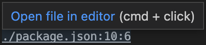
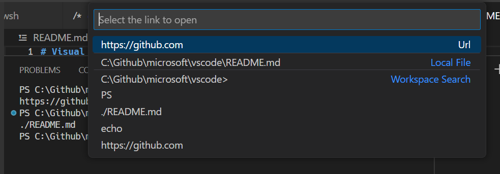
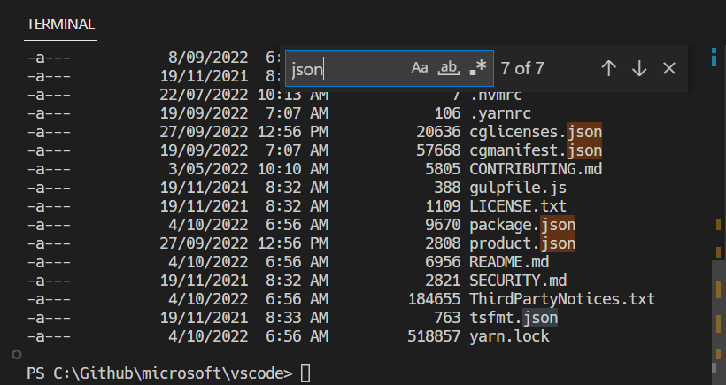
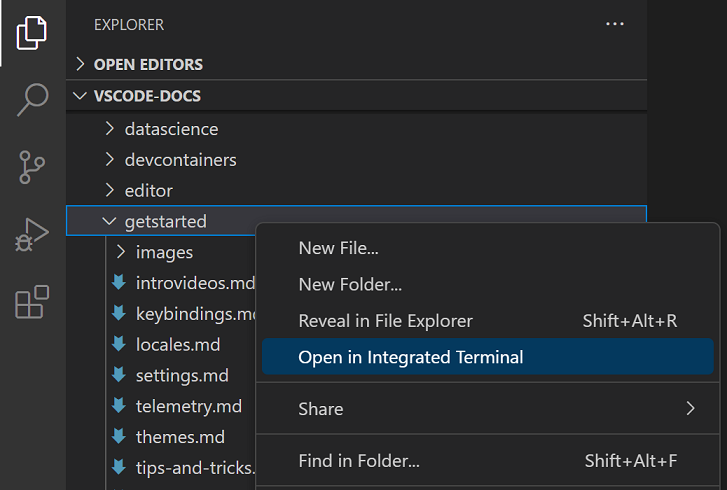

+++
title = "Terminal Basics"
date = 2024-01-12T22:36:24+08:00
weight = 1
type = "docs"
description = ""
isCJKLanguage = true
draft = false
+++

> 原文: [https://code.visualstudio.com/docs/terminal/basics](https://code.visualstudio.com/docs/terminal/basics)

# Terminal Basics 终端基础知识


Visual Studio Code includes a full featured integrated terminal that starts at the root of your workspace. It provides integration with the editor to support features like [links]() and [error detection](). The integrated terminal can run commands such as mkdir and git just like a standalone terminal.

​​	Visual Studio Code 包含一个全功能集成终端，该终端从工作区的根目录启动。它提供与编辑器的集成，以支持链接和错误检测等功能。集成终端可以像独立终端一样运行 mkdir 和 git 等命令。

You can open a terminal as follows:

​​	您可以按如下方式打开终端：

- From the menu, use the **Terminal** > **New Terminal** or **View** > **Terminal** menu commands.
  从菜单中，使用“终端”>“新建终端”或“视图”>“终端”菜单命令。
- From the **Command Palette** (Ctrl+Shift+P), use the **View: Toggle Terminal** command.
  从命令面板（Ctrl+Shift+P）中，使用“视图：切换终端”命令。
- In the Explorer, you can use the **Open in Integrated Terminal** context menu command to open a new terminal from a folder.
  在资源管理器中，您可以使用“在集成终端中打开”上下文菜单命令从文件夹中打开新终端。
- To toggle the terminal panel, use the Ctrl+` keyboard shortcut.
  要切换终端面板，请使用 Ctrl+` 键盘快捷键。
- To create a new terminal, use the Ctrl+Shift+` keyboard shortcut.
  要创建新终端，请使用 Ctrl+Shift+` 键盘快捷键。

VS Code's terminal has additional functionality called shell integration that tracks where commands are run with decorations on the left of a command and in the scrollbar:

​​	VS Code 的终端具有称为 shell 集成的附加功能，该功能可通过命令左侧的修饰和滚动条来跟踪命令的运行位置：


> **Note:** If you prefer to work outside VS Code, open an external terminal with the Ctrl+Shift+C keyboard shortcut
>
> ​​	注意：如果您更喜欢在 VS Code 外部工作，请使用 Ctrl+Shift+C 键盘快捷键打开外部终端

## [Terminal shells 终端外壳]()

The integrated terminal can use various shells installed on your machine, with the default being pulled from your system defaults. Shells are detected and presented in the terminal profiles dropdown.

​​	集成的终端可以使用您机器上安装的各种 shell，默认情况下从您的系统默认设置中提取。在终端配置文件下拉列表中检测并显示 shell。


You can learn more about configuring terminal shells in the [terminal profiles]() article.

​​	您可以在终端配置文件文章中了解有关配置终端 shell 的更多信息。

## [Managing terminals 管理终端]()

The terminal tabs UI is on the right side of the terminal view. Each terminal has an entry with its name, icon, color, and group decoration (if any).

​​	终端选项卡 UI 位于终端视图的右侧。每个终端都有一个条目，其中包含其名称、图标、颜色和组装饰（如果有）。


Add terminal instances by selecting the **+** icon on the top-right of the **TERMINAL** panel, selecting a profile from the terminal dropdown, or by triggering the Ctrl+Shift+` command. This action creates another entry in the tab list associated with that terminal.

​​	通过选择 TERMINAL 面板右上角的 + 图标、从终端下拉列表中选择一个配置文件或触发 Ctrl+Shift+` 命令来添加终端实例。此操作会在与该终端关联的选项卡列表中创建另一个条目。

Remove terminal instances by hovering a tab and selecting the **Trash Can** button, selecting a tab item and pressing Delete, using **Terminal: Kill the Active Terminal Instance** command, or via the right-click context menu.

​​	通过将鼠标悬停在选项卡上并选择垃圾桶按钮、选择选项卡项并按 Delete、使用终端：终止活动终端实例命令或通过右键单击上下文菜单来删除终端实例。

Navigate between terminal groups using focus next Ctrl+PageDown and focus previous Ctrl+PageUp.

​​	使用焦点下一个 Ctrl+PageDown 和焦点上一个 Ctrl+PageUp 在终端组之间导航。

Icons may appear to the right of the terminal title on the tab label when a terminal's status changes. Some examples are a bell (macOS) and for tasks, displaying a check mark when there are no errors and an X otherwise. Hover the icon to read status information, which may contain actions.

​​	当终端状态发生变化时，图标可能会出现在标签标签上的终端标题右侧。一些示例是铃铛（macOS），对于任务，当没有错误时显示复选标记，否则显示 X。将鼠标悬停在图标上以读取状态信息，其中可能包含操作。

### [Groups (split panes) 组（拆分窗格）]()

Place multiple terminals side-by-side and create a group by splitting a terminal:

​​	将多个终端并排放置，并通过拆分终端创建组：

- Hover over a entry in the list of terminals on the right and select the inline split button.
  将鼠标悬停在右侧终端列表中的某个条目上，然后选择内联拆分按钮。
- Right-click the context menu and selecting the **Split** menu option.
  右键单击上下文菜单并选择“拆分”菜单选项。
- Alt and click on a tab, the **+** button, or the single tab on the terminal panel.
  按住 Alt 键并单击选项卡、“+”按钮或终端面板上的单个选项卡。
- Trigger the Ctrl+Shift+5 command.
  触发 Ctrl+Shift+5 命令。

> **Tip:** The working directory for the new terminal depends on the `terminal.integrated.splitCwd` [setting]().
>
> ​​	提示：新终端的工作目录取决于 `terminal.integrated.splitCwd` 设置。

Navigate between terminals in a group by focusing the previous pane, Alt+Left, or the next pane, Alt+Right.

​​	通过聚焦上一个窗格（Alt+向左）或下一个窗格（Alt+向右）在组中的终端之间导航。

Dragging and dropping tabs in the list rearranges them. Dragging a tab into the main terminal area allows moving a terminal from one group to another.

​​	在列表中拖放选项卡会重新排列它们。将选项卡拖到主终端区域允许将终端从一个组移动到另一个组。

Moving a terminal into its own group can be done with the **Terminal: Unsplit Terminal** command through the Command Palette or in the right-click context menu.

​​	可以通过命令面板或右键单击上下文菜单中的“终端：取消拆分终端”命令将终端移至其自己的组中。

## [Terminals in editor area 编辑器区域中的终端]()

You can open terminals in the editor area (terminal editors) with the **Terminal: Create New Terminal in Editor Area** command, the **Terminal: Create New Terminal in Editor Area to the Side** command, or by dragging a terminal from the terminal view into the editor area. Terminal editors are presented like regular editor tabs:

​​	您可以使用“终端：在编辑器区域中创建新终端”命令、“终端：在编辑器区域中创建新终端到侧面”命令或通过将终端从终端视图拖动到编辑器区域中来在编辑器区域（终端编辑器）中打开终端。终端编辑器显示为常规编辑器选项卡：


You can have terminal editors on either side or arranged in multiple dimensions using the editor group layout system, e.g. PowerShell and WSL terminals stacked to the right of file editors:

​​	您可以使用编辑器组布局系统将终端编辑器放在任一侧或排列成多个维度，例如，将 PowerShell 和 WSL 终端堆叠在文件编辑器的右侧：


The `terminal.integrated.defaultLocation` setting can change the default `view` or `editor` area terminal location.

​​	 `terminal.integrated.defaultLocation` 设置可以更改默认 `view` 或 `editor` 区域终端位置。

## [Navigating the buffer 导航缓冲区]()

The content in the terminal is called the buffer, with the section right above the bottom viewport being called "scrollback". The amount of scrollback kept is determined by the `terminal.integrated.scrollback` [setting]() and defaults to `1000` lines.

​​	终端中的内容称为缓冲区，位于底部视口正上方的部分称为“滚动回滚”。保留的滚动回滚量由 `terminal.integrated.scrollback` 设置确定，默认为 `1000` 行。

There are various commands available to navigate around the terminal buffer:

​​	有各种命令可用于在终端缓冲区周围导航：

- Scroll up a line - Ctrl+Alt+PageUp
  向上滚动一行 - Ctrl+Alt+PageUp
- Scroll down a line - Ctrl+Alt+PageDown
  向下滚动一行 - Ctrl+Alt+PageDown
- Scroll up a page - Shift+PageUp
  向上滚动一页 - Shift+PageUp
- Scroll down a page - Shift+PageDown
  向下滚动一页 - Shift+PageDown
- Scroll to the top - Ctrl+Home
  滚动到顶部 - Ctrl+Home
- Scroll to the bottom - Ctrl+End
  滚动到底部 - Ctrl+End

**Command** navigation is also available (see [shell integration]()):

​​	还可以使用命令导航（请参阅 shell 集成）：

- Scroll to the previous command - Ctrl+Up
  滚动到上一条命令 - Ctrl+Up
- Scroll to the next command - Ctrl+Down
  滚动到下一条命令 - Ctrl+Down

Scrolling will happen instantaneously, but can be configured to animate over a short duration with the `terminal.integrated.smoothScrolling` setting.

​​	滚动将立即发生，但可以通过 `terminal.integrated.smoothScrolling` 设置配置为在短时间内以动画形式滚动。

## [Links 链接]()

The terminal features sophisticated link detection with editor integration and even extension contributed link handlers. Hover over a link to display an underline, then hold the Ctrl/Cmd key and click.

​​	该终端具有复杂链接检测功能，并与编辑器集成，甚至扩展了链接处理程序。将鼠标悬停在链接上以显示下划线，然后按住 Ctrl/Cmd 键并单击。

These built-in link handlers are used in the following priority order:

​​	这些内置链接处理程序按以下优先级顺序使用：

- URIs/URLs: Links that look like URIs, such as `https://code.visualstudio.com`, `vscode://path/to/file` or `file://path/to/file` will open using the standard handler for the protocol. For example, `https` links will open the browser.

  ​​	URI/URL：看起来像 URI 的链接，例如 `https://code.visualstudio.com` 、 `vscode://path/to/file` 或 `file://path/to/file` 将使用该协议的标准处理程序打开。例如， `https` 链接将打开浏览器。

  

- File links: Links to files that have been verified to exist on the system. These will open the file in a new editor tab and support many common line/column formats such as `file:1:2`, `file:line 1, column 2`.

  ​​	文件链接：指向已验证在系统上存在的文件的链接。这些链接将在新的编辑器选项卡中打开文件，并支持许多常见的行/列格式，例如 `file:1:2` 、 `file:line 1, column 2` 。

  

- Folder links: Links to folders are similar to file links but will open a new VS Code window at the folder.

  ​​	文件夹链接：指向文件夹的链接类似于文件链接，但将在文件夹中打开新的 VS Code 窗口。

  

- Word links: Fallback link type that uses the `terminal.integrated.wordSeparators` setting. The setting defines word boundaries and make nearly all text into words. Activating a word link searches the workspace for the word. If there is a single result it will open, otherwise it will present the search results. Word links are considered "low confidence" and will not show an underline or tooltip unless you hold the Ctrl/Cmd key. They also have limited support for line and column suffixes.

  ​​	单词链接：使用 `terminal.integrated.wordSeparators` 设置的备用链接类型。该设置定义单词边界，并将几乎所有文本变成单词。激活单词链接将在工作区中搜索该单词。如果只有一个结果，它将打开，否则它将显示搜索结果。单词链接被视为“低可信度”，除非您按住 Ctrl/Cmd 键，否则不会显示下划线或工具提示。它们对行和列后缀的支持也有限。

  

The **Open Detected Link** command (Ctrl+Shift+O) can be used to access links via the keyboard:

​​	可以使用“打开检测到的链接”命令 (Ctrl+Shift+O) 通过键盘访问链接：



> **Tip:** If link verification causes performance issues, like in high latency remote environments, disable it via the `terminal.integrated.enableFileLinks` [setting]().
>
> ​​	提示：如果链接验证导致性能问题，例如在高延迟的远程环境中，请通过 `terminal.integrated.enableFileLinks` 设置禁用它。

### [Extensions handling links 处理链接的扩展]()

Extensions can contribute **link providers** which allow the extension to define what happens when clicked. An example of this is the [GitLens](https://marketplace.visualstudio.com/items?itemName=eamodio.gitlens) extension detecting Git branch links.

​​	扩展可以提供链接提供程序，允许扩展定义单击时发生的情况。一个例子是 GitLens 扩展检测 Git 分支链接。


### [Keyboard accessibility 键盘辅助功能]()

Links are keyboard accessible through several commands that open links based on the type of link.

​​	可以通过多种命令访问键盘链接，这些命令根据链接类型打开链接。

- **Terminal: Open Last Local File Link** - Opens the most recent local file link. No default keybinding.
  终端：打开最后一个本地文件链接 - 打开最近的本地文件链接。无默认键绑定。
- **Terminal: Open Last URL link** - Opens the most recent URI/URL link. No default keybinding.
  终端：打开上一个 URL 链接 - 打开最近的 URI/URL 链接。无默认键绑定。
- **Terminal: Open Detected Link...** - Opens a searchable Quick Pick with all detected links, including word links. The default keybinding is Ctrl/Cmd+Shift+O, which is the same as the **Go to Symbol in Editor** keyboard shortcut.
  终端：打开检测到的链接... - 打开一个可搜索的快速选择，其中包含所有检测到的链接，包括单词链接。默认键绑定是 Ctrl/Cmd+Shift+O，与编辑器键盘快捷键中的转到符号相同。

## [Copy & paste 复制和粘贴]()

The keybindings for copy and paste follow platform standards:

​​	复制和粘贴的键绑定遵循平台标准：

- Linux: Ctrl+Shift+C and Ctrl+Shift+V; selection paste is available with Shift+Insert
  Linux：Ctrl+Shift+C 和 Ctrl+Shift+V；可以使用 Shift+Insert 进行选择性粘贴
- macOS: Cmd+C and Cmd+V
  macOS：Cmd+C 和 Cmd+V
- Windows: Ctrl+C and Ctrl+V
  Windows：Ctrl+C 和 Ctrl+V

Copying is done automatically on selection when `terminal.integrated.copyOnSelection` is enabled.

​​	启用 `terminal.integrated.copyOnSelection` 时，在选择时会自动执行复制操作。

By default, there is a warning when pasting multiple lines, which can be disabled with the `terminal.integrated.enableMultiLinePasteWarning` setting. This is only done when the shell does not support "bracketed paste mode". When that mode is enabled, the shell is indicating that it can handle multiple line pasting.

​​	默认情况下，粘贴多行时会发出警告，可以使用 `terminal.integrated.enableMultiLinePasteWarning` 设置禁用此警告。仅当外壳程序不支持“带括号的粘贴模式”时才会执行此操作。启用该模式时，外壳程序会指示它可以处理多行粘贴。

## [Using the mouse 使用鼠标]()

### [Right-click behavior 右键单击行为]()

The right-click behavior differs based on the platform:

​​	右键单击行为根据平台而异：

- Linux: Show the context menu.
  Linux：显示上下文菜单。
- macOS: Select the word under the cursor and show the context menu.
  macOS：选择光标下的单词并显示上下文菜单。
- Windows: Copy and drop selection if there is a selection, otherwise paste.
  Windows：如果有选定内容，则复制并放置选定内容，否则粘贴。

This can be configured using the `terminal.integrated.rightClickBehavior` setting. The options are:

​​	可以使用 `terminal.integrated.rightClickBehavior` 设置对其进行配置。选项有：

- `default` - Show the context menu.
  `default` - 显示上下文菜单。
- `copyPaste` - Copy when there is a selection, otherwise paste.
  `copyPaste` - 有选定内容时复制，否则粘贴。
- `paste` - Paste on right-click.
  `paste` - 右键单击时粘贴。
- `selectWord` - Select the word under the cursor and show the context menu.
  `selectWord` - 选择光标下的单词并显示上下文菜单。
- `nothing` - Do nothing and pass event to terminal.
  `nothing` - 不执行任何操作并将事件传递给终端。

### [Reposition the cursor with Alt 使用 Alt]()

Alt and left-click will reposition the cursor to underneath the mouse. This works by simulating arrow keystrokes, which may not work reliably for some shells or programs. This feature can be disabled with the `terminal.integrated.altClickMovesCursor` setting.

​​	Alt 重新定位光标，然后左键单击会将光标重新定位到鼠标下方。这通过模拟箭头键击来实现，对于某些 shell 或程序可能无法可靠地工作。此功能可以使用 `terminal.integrated.altClickMovesCursor` 设置禁用。

### [Mouse events mode 鼠标事件模式]()

When applications running in the terminal turn on mouse events mode, such as Vim mouse mode, mouse interaction is sent to the application instead of the terminal. This means that clicking and dragging will no longer create a selection. Terminal selection can be forced by holding the Alt key on Windows and Linux, this can also be done with the Option key on macOS but requires enabling the `terminal.integrated.macOptionClickForcesSelection` setting first.

​​	当在终端中运行的应用程序打开鼠标事件模式（例如 Vim 鼠标模式）时，鼠标交互将发送到应用程序，而不是终端。这意味着单击和拖动将不再创建选区。可以通过在 Windows 和 Linux 上按住 Alt 键来强制选择终端，也可以在 macOS 上使用 Option 键来完成此操作，但首先需要启用 `terminal.integrated.macOptionClickForcesSelection` 设置。

## [Find 查找]()

The integrated terminal has find functionality that can be triggered with Ctrl+F.

​​	集成终端具有可以通过 Ctrl+F 触发的查找功能。



> **Tip:** Ctrl+F can be sent to the shell by removing the `workbench.action.terminal.focusFind` command from [commands to skip shell]().
>
> ​​	提示：可以通过从命令中删除 `workbench.action.terminal.focusFind` 命令来将 Ctrl+F 发送到 shell 以跳过 shell。

## [Run selected text 运行选中的文本]()

To use the `runSelectedText` command, select text in an editor and run the command **Terminal: Run Selected Text in Active Terminal** via the **Command Palette** (Ctrl+Shift+P), the terminal will attempt to run the selected text. If no text is selected in the active editor, the entire line that the cursor is on will run in the terminal.

​​	要使用 `runSelectedText` 命令，请在编辑器中选择文本并通过命令面板（Ctrl+Shift+P）运行命令终端：在活动终端中运行选定文本，终端将尝试运行选定的文本。如果在活动编辑器中未选择任何文本，则光标所在的整行将在终端中运行。

> **Tip:** Also run the active file using the command `workbench.action.terminal.runActiveFile`.
>
> ​​	提示：还可以使用命令 `workbench.action.terminal.runActiveFile` 运行活动文件。

## [Maximizing the terminal 最大化终端]()

The terminal view can be maximized by clicking the maximize panel size button with the upwards chevron icon. This will temporarily hide the editors and maximize the panel. This is useful to temporarily focus on a large amount of output. Some developers use VS Code as a standalone terminal by opening a new window, maximizing the panel, and hiding the side bar.

​​	可以通过单击带有向上箭头图标的最大化面板大小按钮来最大化终端视图。这将暂时隐藏编辑器并最大化面板。这对于暂时关注大量输出非常有用。一些开发人员通过打开新窗口、最大化面板和隐藏侧边栏将 VS Code 用作独立终端。

Note that the panel can only be maximized if its [alignment]() option is set to **Center**.

​​	请注意，仅当面板的对齐选项设置为居中时才能最大化面板。

## [Select all 全选]()

There is a **Terminal: Select All** command, which is bound to Cmd+A on macOS, but does not have a default keybinding on Windows and Linux as it may conflict with shell hotkeys. To use Ctrl+A to select all, add this custom keybinding:

​​	有一个终端：全选命令，它绑定到 macOS 上的 Cmd+A，但在 Windows 和 Linux 上没有默认键绑定，因为它可能与 shell 热键冲突。要使用 Ctrl+A 全选，请添加此自定义键绑定：

```
{
  "key": "ctrl+a",
  "command": "workbench.action.terminal.selectAll",
  "when": "terminalFocus && !isMac"
},
```

## [Drag and drop file paths 拖放文件路径]()

Dragging a file into the terminal will input the path into the terminal, with escaping to match the active shell.

​​	将文件拖入终端会将路径输入终端，并转义以匹配活动外壳。

## [Automating terminals with tasks 使用任务自动化终端]()

The [Tasks]() feature can be used to automate the launching of terminals, for example, the following `.vscode/tasks.json` file will launch a Command Prompt and PowerShell terminal in a single terminal group when the window starts:

​​	任务功能可用于自动化终端的启动，例如，以下 `.vscode/tasks.json` 文件将在窗口启动时在单个终端组中启动命令提示符和 PowerShell 终端：

```
{
  "version": "2.0.0",
  "presentation": {
    "echo": false,
    "reveal": "always",
    "focus": false,
    "panel": "dedicated",
    "showReuseMessage": true
  },
  "tasks": [
    {
      "label": "Create terminals",
      "dependsOn": [
        "First",
        "Second"
      ],
      // Mark as the default build task so cmd/ctrl+shift+b will create them
      "group": {
        "kind": "build",
        "isDefault": true
      },
      // Try start the task on folder open
      "runOptions": {
        "runOn": "folderOpen"
      }
    },
    {
      // The name that shows up in terminal tab
      "label": "First",
      // The task will launch a shell
      "type": "shell",
      "command": "",
      // Set the shell type
      "options": {
        "shell": {
          "executable": "cmd.exe",
          "args": []
        }
      },
      // Mark as a background task to avoid the spinner animation on the terminal tab
      "isBackground": true,
      "problemMatcher": [],
      // Create the tasks in a terminal group
      "presentation": {
        "group": "my-group"
      }
    },
    {
      "label": "Second",
      "type": "shell",
      "command": "",
      "options": {
        "shell": {
          "executable": "pwsh.exe",
          "args": []
        }
      },
      "isBackground": true,
      "problemMatcher": [],
      "presentation": {
        "group": "my-group"
      }
    }
  ]
}
```

This file could be committed to the repository to share with other developers or created as a user task via the `workbench.action.tasks.openUserTasks` command.

​​	此文件可以提交到存储库以与其他开发人员共享，或通过 `workbench.action.tasks.openUserTasks` 命令创建为用户任务。

## [Working directory 工作目录]()

By default, the terminal will open at the folder that is opened in the Explorer. The `terminal.integrated.cwd` setting allows specifying a custom path to open instead:

​​	默认情况下，终端将在资源管理器中打开的文件夹中打开。 `terminal.integrated.cwd` 设置允许指定要打开的自定义路径：

```
{
  "terminal.integrated.cwd": "/home/user"
}
```

Split terminals on Windows will start in the directory that the parent terminal started with. On macOS and Linux, split terminals will inherit the current working directory of the parent terminal. This behavior can be changed using the `terminal.integrated.splitCwd` setting:

​​	Windows 上的拆分终端将在父终端启动的目录中启动。在 macOS 和 Linux 上，拆分终端将继承父终端的当前工作目录。可以使用 `terminal.integrated.splitCwd` 设置更改此行为：

```
{
  "terminal.integrated.splitCwd": "workspaceRoot"
}
```

There are also extensions available that give more options such as [Terminal Here](https://marketplace.visualstudio.com/items?itemName=Tyriar.vscode-terminal-here).

​​	还有一些扩展提供了更多选项，例如“在此处打开终端”。

## [Fixed dimension terminals 固定尺寸端子]()

The **Terminal: Set Fixed Dimensions** command allows changing the number of columns and rows that the terminal and it's backing pseudoterminal uses. This will add scroll bars when necessary, which may lead to an unpleasant UX and is generally not recommended, but it is a common ask on Windows in particular for reading logs or long lines when paging tools aren't available.

​​	终端：设置固定尺寸命令允许更改终端及其支持的伪终端使用的列数和行数。这将在必要时添加滚动条，这可能会导致不愉快的 UX，并且通常不建议这样做，但当分页工具不可用时，在 Windows 上尤其常见，用于读取日志或长行。

You can also right-click on a terminal tab and select **Toggle Size to Content Width** (Alt+Z) to resize the number of terminal columns to the largest wrapped line in the terminal.

​​	您还可以右键单击终端选项卡并选择切换大小到内容宽度（Alt+Z）以将终端列数调整为终端中最长的换行行。

## [Next steps 后续步骤]()

The basics of the terminal have been covered in this document. Read on to find out more about:

​​	本文档已介绍终端的基础知识。继续阅读以了解有关以下内容的更多信息：

- [Tasks]() - Tasks let you integrate with external tools and leverage the terminal heavily.
  任务 - 任务允许您与外部工具集成并充分利用终端。
- [Mastering VS Code's Terminal](https://www.growingwiththeweb.com/2017/03/mastering-vscodes-terminal.html) - An external blog with plenty of power user tips for the terminal.
  精通 VS Code 的终端 - 一个外部博客，其中包含大量适用于终端的超级用户提示。
- Explore terminal commands by browsing the keyboard shortcuts within VS Code (**Preferences: Open Keyboard Shortcuts** then search on 'terminal').
  通过浏览 VS Code 中的键盘快捷方式（首选项：打开键盘快捷方式，然后搜索“终端”）来探索终端命令。

## [Common questions 常见问题]()

### [I'm having problems launching the terminal 我在启动终端时遇到问题]()

There's a [dedicated troubleshooting guide](https://code.visualstudio.com/docs/supporting/troubleshoot-terminal-launch) for these sorts of problems.

​​	针对此类问题，有一个专门的故障排除指南。

### [How do I create an Admin terminal? 如何创建管理员终端？]()

The integrated terminal shell is running with the permissions of VS Code. If you need to run a shell command with elevated (administrator) or different permissions, use platform utilities such as `runas.exe` within a terminal.

​​	集成终端外壳正在使用 VS Code 的权限运行。如果您需要使用提升的（管理员）或不同的权限运行外壳命令，请在终端中使用平台实用工具，例如 `runas.exe` 。

You can learn more about customizing terminals via terminal profiles in [Configuring Profiles]().

​​	您可以在“配置配置文件”中通过终端配置文件了解有关自定义终端的更多信息。

### [Can I add a keyboard shortcut for the Explorer's Open in Integrated Terminal command? 我可以为资源管理器的“在集成终端中打开”命令添加键盘快捷方式吗？]()

You can open new terminals for specific folders from the Explorer via the **Open in Integrated Terminal** context menu command.

​​	您可以通过“在集成终端中打开”上下文菜单命令，为资源管理器中的特定文件夹打开新终端。



By default, there is no keyboard shortcut associated with **Open in Integrated Terminal** but you can add your own via the Keyboard Shortcuts editor (Ctrl+K Ctrl+S) to add a keybinding to your `keybindings.json`.

​​	默认情况下，“在集成终端中打开”不与任何键盘快捷方式相关联，但您可以通过键盘快捷方式编辑器 (Ctrl+K Ctrl+S) 添加您自己的快捷方式，以向您的 `keybindings.json` 添加键绑定。

The `keybindings.json` example below adds the keyboard shortcut Ctrl+T for `openInTerminal`.

​​	下面的 `keybindings.json` 示例为 `openInTerminal` 添加了键盘快捷方式 Ctrl+T。

```
{
  "key": "ctrl+t",
  "command": "openInTerminal",
  "when": "filesExplorerFocus"
}
```

### [Why is nvm complaining about a prefix option when the integrated terminal is launched? 启动集成终端时，为什么 nvm 会抱怨前缀选项？]()

nvm (Node Version Manager) users often see this error for the first time inside VS Code's integrated terminal:

​​	nvm（Node Version Manager）用户通常会在 VS Code 的集成终端中首次看到此错误：

```
nvm is not compatible with the npm config "prefix" option: currently set to "/usr/local"
Run `npm config delete prefix` or `nvm use --delete-prefix v8.9.1 --silent` to unset it
```

This is mostly a macOS problem and does not happen in external terminals. The typical reasons for this are the following:

​​	这主要是一个 macOS 问题，在外部终端中不会发生。造成这种情况的典型原因如下：

- `npm` was globally installed using another instance of `node` that is somewhere in your path (such as `/usr/local/bin/npm`).
  `npm` 已使用路径中的另一个 `node` 实例（例如 `/usr/local/bin/npm` ）在全球范围内安装。
- To get the development tools on the `$PATH`, VS Code will launch a bash login shell on startup. This means that your `~/.bash_profile` has already run and when an integrated terminal launches, it will run **another** login shell, reordering the `$PATH` potentially in unexpected ways.
  为了在 `$PATH` 上获取开发工具，VS Code 将在启动时启动一个 bash 登录 shell。这意味着您的 `~/.bash_profile` 已运行，当集成终端启动时，它将运行另一个登录 shell，以可能出乎意料的方式重新排序 `$PATH` 。

To resolve this issue, you need to track down where the old `npm` is installed and remove both it and its out-of-date node_modules. Find the `nvm` initialization script and run `which npm` before it runs, which should print the path when you launch a new terminal.

​​	要解决此问题，您需要追踪旧 `npm` 的安装位置并将其及其过时的 node_modules 一并删除。找到 `nvm` 初始化脚本并在其运行前运行 `which npm` ，这应在您启动新终端时打印路径。

Once you have the path to npm, find the old node_modules by resolving the symlink by running a command something like this:

​​	获得 npm 的路径后，通过运行类似以下命令解析符号链接来找到旧的 node_modules：

```
ls -la /usr/local/bin | grep "np[mx]"
```

This will give you the resolved path at the end:

​​	这将在末尾为您提供已解析的路径：

```
... npm -> ../lib/node_modules/npm/bin/npm-cli.js
... npx -> ../lib/node_modules/npm/bin/npx-cli.js
```

From there, removing the files and relaunching VS Code should fix the issue:

​​	从那里，删除文件并重新启动 VS Code 应解决此问题：

```
rm /usr/local/bin/npm /usr/local/lib/node_modules/npm/bin/npm-cli.js
rm /usr/local/bin/npx /usr/local/lib/node_modules/npm/bin/npx-cli.js
```

### [Why does macOS make a ding sound when I resize terminal split panes? 为什么我在调整终端拆分窗格大小时 macOS 会发出叮咚声？]()

The keybindings ⌃⌘← and ⌃⌘→ are the defaults for resizing individual split panes in the terminal. While they work, they also cause a system "invalid key" sound to play due to an issue in Chromium. The [recommended workaround](https://github.com/microsoft/vscode/issues/44070#issuecomment-799716362) is to tell macOS to no-op for these keybindings by running this in your terminal:

​​	终端中调整各个拆分窗格大小的默认键绑定为 ⌃⌘← 和 ⌃⌘→。虽然它们有效，但由于 Chromium 中存在问题，它们还会导致系统发出“无效键”声音。建议的解决方法是通过在终端中运行以下命令告诉 macOS 不要对这些键绑定执行任何操作：

```
mkdir -p ~/Library/KeyBindings
cat > ~/Library/KeyBindings/DefaultKeyBinding.dict <<EOF
{
  "^@\UF701" = "noop";
  "^@\UF702" = "noop";
  "^@\UF703" = "noop";
}
EOF
```

### [I'm having problems with the terminal rendering. What can I do? 我在终端渲染方面遇到问题。我该怎么办？]()

By default, the integrated terminal will render using GPU acceleration on most machines. Typically when there are rendering problems it's an issue of something in your hardware/OS/drivers not playing nicely with the GPU renderer. The first thing to try is to disable GPU acceleration, trading off rendering speed for DOM-based rendering, which is more reliable:

​​	默认情况下，集成终端将在大多数机器上使用 GPU 加速进行渲染。通常，当出现渲染问题时，这是由于硬件/操作系统/驱动程序中的某些内容与 GPU 渲染器不兼容。首先要尝试的是禁用 GPU 加速，用基于 DOM 的渲染（更可靠）来换取渲染速度：

```
{
  "terminal.integrated.gpuAcceleration": "off"
}
```

See the [GPU acceleration]() section for more information.

​​	有关更多信息，请参阅 GPU 加速部分。

### [I see 1~ or [201~ when I paste something 当我粘贴某些内容时，我看到 1~ 或 [201~]()

This normally means that the program/shell running inside the terminal requested to turn on "bracketed paste mode" but something doesn't support it properly. To work around this, you could run `printf "\e[?2004l"` to disable it for that session or add the following to your `~/.inputrc` file:

​​	这通常意味着在终端内运行的程序/shell 请求启用“带括号的粘贴模式”，但某些内容不支持它。要解决此问题，您可以运行 `printf "\e[?2004l"` 以禁用该会话，或将以下内容添加到您的 `~/.inputrc` 文件中：

```
set enable-bracketed-paste off
```

Alternatively, bracketed paste mode can be forced to ignore the shell's request by turning it off with this setting:

​​	或者，可以通过关闭此设置来强制括号粘贴模式忽略 shell 的请求：

```
{
  "terminal.integrated.ignoreBracketedPasteMode": true
}
```

### [Ctrl+A, Ctrl+R output ^A, ^R on zsh Ctrl+A、Ctrl+R 输出 ^A、^R 在 zsh 上]()

This can happen if zsh is in Vim mode instead of Emacs mode, due to setting `$EDITOR` or `$VISUAL` to `vi`/`vim` in your init scripts.

​​	如果 zsh 处于 Vim 模式而不是 Emacs 模式，则可能会发生这种情况，因为在您的 init 脚本中将 `$EDITOR` 或 `$VISUAL` 设置为 `vi` / `vim` 。

To work around this, you have two options:

​​	要解决此问题，您有两个选择：

- Ensure that you don't set `$EDITOR` to `vi(m)`. However, this isn't an option if you want your Git editor to work.
  确保您未将 `$EDITOR` 设置为 `vi(m)` 。但是，如果您希望 Git 编辑器正常工作，则这不是一个选项。
- Add `bindkey -e` to your init script to set Emacs explicitly.
  将 `bindkey -e` 添加到您的 init 脚本中以显式设置 Emacs。

### [How can I configure Cmd+. to map to Ctrl+C like macOS' built-in terminal? 如何将 Cmd+. 配置为像 macOS 的内置终端一样映射到 Ctrl+C？]()

The macOS default terminal uses Cmd+. to perform the same as Ctrl+C. To get this behavior in VS Code, add this [custom keybinding]():

​​	macOS 默认终端使用 Cmd+. 执行与 Ctrl+C 相同的操作。要在 VS Code 中获得此行为，请添加此自定义键绑定：

```
{
  "key": "cmd+.",
  "command": "workbench.action.terminal.sendSequence",
  "when": "terminalFocus",
  "args": { "text": "\u0003" }
}
```

### [Why are the colors in the terminal not correct? 为什么终端中的颜色不正确？]()

One of our accessibility features we enable by default is to ensure a minimum contrast ratio of at least 4.5 is met for the foreground text. This feature ensures that text is readable regardless of the shell and theme used which is not possible otherwise. To disable this feature, you can set:

​​	我们默认启用的辅助功能之一是确保前景色文本的最小对比度至少为 4.5。此功能可确保文本可读，无论使用什么 shell 和主题，否则这是不可能的。要禁用此功能，您可以设置：

```
"terminal.integrated.minimumContrastRatio": 1
```

See the [minimum contrast ratio]() section for more information.

​​	有关更多信息，请参阅最小对比度部分。
