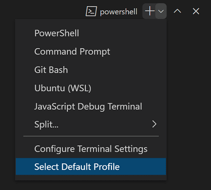
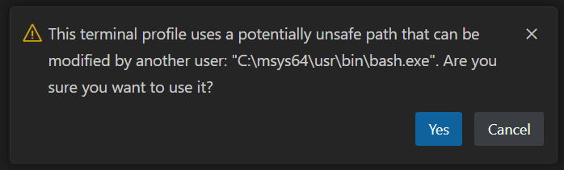

+++
title = "Terminal Profiles"
date = 2024-01-12T22:36:24+08:00
weight = 10
type = "docs"
description = ""
isCJKLanguage = true
draft = false
+++

> 原文: [https://code.visualstudio.com/docs/terminal/profiles](https://code.visualstudio.com/docs/terminal/profiles)

# Terminal Profiles 终端配置文件


Terminal profiles are platform-specific shell configurations comprised of an executable path, arguments, and other customizations. By default several profiles are automatically detected which can be customized or added to.

​​	终端配置文件是特定于平台的 shell 配置，由可执行路径、参数和其他自定义项组成。默认情况下，会自动检测到几个配置文件，可以对其进行自定义或添加。

Example profile:

​​	示例配置文件：

```
{
  "terminal.integrated.profiles.windows": {
    "Custom Init": {
      "path": "pwsh.exe",
      "args": [
         "-noexit",
         "-file",
         "${env:APPDATA}\\PowerShell\\custom-init.ps1"
      ]
    }
  },
  "terminal.integrated.defaultProfile.windows": "Custom Init"
}
```

You can use variables in terminal profiles as shown in the example above with the `APPDATA` environment variable. There is a list of available variables in the [Variables Reference](https://code.visualstudio.com/docs/editor/variables-reference) topic.

​​	您可以在终端配置文件中使用变量，如上例中使用 `APPDATA` 环境变量所示。变量参考主题中列出了可用变量。

Configure your default profile by running the **Terminal: Select Default Profile** command, which is also accessible via the new terminal dropdown.

​​	通过运行“终端：选择默认配置文件”命令来配置默认配置文件，也可以通过新的终端下拉列表访问该命令。



The default terminal profile shell defaults to `$SHELL` on Linux and macOS and PowerShell on Windows. VS Code will automatically detect most standard shells that can then be configured as the default.

​​	默认终端配置文件 shell 在 Linux 和 macOS 上默认为 `$SHELL` ，在 Windows 上默认为 PowerShell。VS Code 会自动检测大多数标准 shell，然后可以将其配置为默认 shell。

## [Configuring profiles 配置配置文件]()

To create a new profile, run the **Terminal: Select Default Profile** command and activate the configure button on the right side of the shell to base it on. This will add a new entry to your settings that can be tweaked manually in your `settings.json` file.

​​	要创建新配置文件，请运行“终端：选择默认配置文件”命令，然后激活要作为其基础的 shell 右侧的配置按钮。这会在设置中添加一个新条目，可以在 `settings.json` 文件中手动调整该条目。

Profiles can be created using either a `path` or a `source`, as well as a set of optional arguments. A `source` is available only on Windows and can be used to let VS Code detect the install of either `PowerShell` or `Git Bash`. Alternatively, a `path` pointing directly to the shell executable can be used. Here are some example profile configurations:

​​	可以使用 `path` 或 `source` 以及一组可选参数创建配置文件。 `source` 仅适用于 Windows，可用于让 VS Code 检测 `PowerShell` 或 `Git Bash` 的安装。或者，可以使用直接指向 shell 可执行文件的 `path` 。以下是一些示例配置文件配置：

```
{
  "terminal.integrated.profiles.windows": {
    "PowerShell -NoProfile": {
      "source": "PowerShell",
      "args": ["-NoProfile"]
    }
  },
  "terminal.integrated.profiles.linux": {
    "zsh (login)": {
      "path": "zsh",
      "args": ["-l"]
    }
  }
}
```

Other arguments supported in profiles include:

​​	配置文件中支持的其他参数包括：

- `overrideName`: A boolean indicating whether or not to replace the dynamic terminal title that detects what program is running with the static profile name.
  `overrideName` ：一个布尔值，指示是否用静态配置文件名称替换检测正在运行的程序的动态终端标题。
- `env`: A map defining environment variables and their values, set the variable to `null` to delete it from the environment. This can be configured for all profiles using the `terminal.integrated.env.<platform>` setting.
  `env` ：定义环境变量及其值的映射，将变量设置为 `null` 以从环境中删除它。可以使用 `terminal.integrated.env.<platform>` 设置为所有配置文件配置此项。
- `icon`: An icon ID to use for the profile.
  `icon` ：要用于配置文件的图标 ID。
- `color`: A theme color ID to style the icon.
  `color` ：用于设置图标样式的主题颜色 ID。

> **Tip:** Path, args, and env all support [resolving variables](https://code.visualstudio.com/docs/editor/variables-reference)
>
> ​​	提示：路径、参数和环境都支持解析变量

The **default profile** can be defined manually with the `terminal.integrated.defaultProfile.*` settings. This should be set to the name of an existing profile:

​​	可以使用 `terminal.integrated.defaultProfile.*` 设置手动定义默认配置文件。这应设置为现有配置文件的名称：

```
{
  "terminal.integrated.profiles.windows": {
    "my-pwsh": {
      "source": "PowerShell",
      "args": ["-NoProfile"]
    }
  },
  "terminal.integrated.defaultProfile.windows": "my-pwsh"
}
```

> **Tip:** The integrated terminal shell is running with the permissions of VS Code. If you need to run a shell command with elevated (administrator) or different permissions, use platform utilities such as `runas.exe` within a terminal.
>
> ​​	提示：集成终端 shell 正在使用 VS Code 的权限运行。如果您需要使用提升的（管理员）或不同的权限运行 shell 命令，请在终端中使用平台实用程序，例如 `runas.exe` 。

## [Removing built-in profiles 删除内置配置文件]()

To remove a built-in profile and prevent it from showing up in the new terminal dropdown, set the name of the profile to `null`. For example, to remove the `Git Bash` profile on Windows, use this setting:

​​	要删除内置配置文件并防止它显示在新终端下拉列表中，请将配置文件的名称设置为 `null` 。例如，要在 Windows 上删除 `Git Bash` 配置文件，请使用此设置：

```
{
  "terminal.integrated.profiles.windows": {
    "Git Bash": null
  }
}
```

## [Configuring the task/debug profile 配置任务/调试配置文件]()

By default, the task/debug features will use the default profile. This may not be ideal if your default has a heavy PowerShell startup script or a non-POSIX compliant shell for example. To configure a profile to be used only in the debug/tasks features, use the `terminal.integrated.automationProfile.<platform>` setting:

​​	默认情况下，任务/调试功能将使用默认配置文件。如果您的默认值具有繁重的 PowerShell 启动脚本或非 POSIX 兼容 shell，这可能并不理想。若要配置仅在调试/任务功能中使用的配置文件，请使用 `terminal.integrated.automationProfile.<platform>` 设置：

```
{
  "terminal.integrated.defaultProfile.osx": "fish",
  // Use a fully POSIX-compatible shell and avoid running a complex ~/.config/fish/config.fish
  // for tasks and debug
  "terminal.integrated.automationProfile.osx": {
    "path": "/bin/sh"
  }
}
```

## [Unsafe profile detection 不安全配置文件检测]()

Certain shells are installed in unsafe paths by default, like a path that could be written to by another user on a Windows environment. VS Code will still detect these but not expose them as a proper profile until they have been explicitly configured via the **Terminal: Select Default Profile** command. When configuring an unsafe profile, there will be a warning before it's added:

​​	某些 shell 默认安装在不安全路径中，例如在 Windows 环境中其他用户可以写入的路径。VS Code 仍会检测到这些 shell，但不会将它们公开为适当的配置文件，直到通过“终端：选择默认配置文件”命令显式配置它们。配置不安全配置文件时，在添加之前会发出警告：



## [Cmder]()

Cmder itself is a terminal, but you can use the [Cmder](https://cmder.app/) shell in VS Code with the following profile:

​​	Cmder 本身是一个终端，但你可以使用以下配置文件在 VS Code 中使用 Cmder shell：

```
{
  "terminal.integrated.profiles.windows": {
    "cmder": {
      "path": "C:\\WINDOWS\\System32\\cmd.exe",
      "args": ["/K", "C:\\cmder\\vendor\\bin\\vscode_init.cmd"]
    }
  },
  "terminal.integrated.defaultProfile.windows": "cmder"
}
```

This profile should be picked up automatically when the `CMDER_ROOT` environment variable is set. It will also be detected as an [unsafe profile]() if installed at `C:\cmder`. You may refer to [Cmder's wiki](https://github.com/cmderdev/cmder/wiki/Seamless-VS-Code-Integration) for more information.

​​	当 `CMDER_ROOT` 环境变量被设置时，此配置文件应该会被自动选中。如果安装在 `C:\cmder` ，它还将被检测为不安全配置文件。你可以参考 Cmder 的 wiki 了解更多信息。

## [Cygwin]()

Cygwin itself is a terminal, but you can use the [Cygwin](https://www.cygwin.com/) shell in VS Code with the following profile:

​​	Cygwin 本身是一个终端，但你可以使用以下配置文件在 VS Code 中使用 Cygwin shell：

```
{
  "terminal.integrated.profiles.windows": {
    "Cygwin": {
      "path": "C:\\cygwin64\\bin\\bash.exe",
      "args": ["--login"]
    }
  },
  "terminal.integrated.defaultProfile.windows": "Cygwin"
}
```

This profile should be detected automatically as an [unsafe profile]() when installed at the default paths `C:\cygwin` or `C:\cygwin64`.

​​	当安装在默认路径 `C:\cygwin` 或 `C:\cygwin64` 时，此配置文件应该会被自动检测为不安全配置文件。

## [Git Bash]()

A [limitation of Git Bash](https://github.com/microsoft/vscode/issues/85831#issuecomment-943403803) when VS Code uses bash.exe (the shell) as opposed to git-bash.exe (the terminal) is that history will not be retained across shell sessions. You can work around this by adding the following to your `~/.bashrc` or `~/.bash_profile` files:

​​	当 VS Code 使用 bash.exe（shell）而不是 git-bash.exe（终端）时，Git Bash 的一个限制是历史记录不会在 shell 会话中保留。你可以通过将以下内容添加到你的 `~/.bashrc` 或 `~/.bash_profile` 文件来解决此问题：

```
export PROMPT_COMMAND='history -a'
```

This will cause the shell to call `history -a` whenever the prompt is printed which flushes the session's current session commands to the backing history file.

​​	这将导致 shell 在打印提示符时调用 `history -a` ，从而将会话的当前会话命令刷新到支持历史记录的文件。

## [MSYS2]()

MSYS2's bash shell can be configured with the following profile:

​​	MSYS2 的 bash shell 可以使用以下配置文件进行配置：

```
{
  "terminal.integrated.profiles.windows": {
    "bash (MSYS2)": {
      "path": "C:\\msys64\\usr\\bin\\bash.exe",
      "args": ["--login", "-i"]
    }
  }
}
```

This profile should be detected automatically as an [unsafe profile]() when installed at the default path `C:\\msys64`.

​​	当安装在默认路径 `C:\\msys64` 时，此配置文件应自动检测为不安全配置文件。

## [Windows PowerShell]()

When PowerShell 6+ is installed, Windows PowerShell is not included in the profiles list by default. To add Windows PowerShell as a profile, choose the **Select Default Profile** option in the new terminal dropdown and select the Windows PowerShell item. This will configure the profile and set it as your default.

​​	安装 PowerShell 6+ 时，默认情况下配置文件列表中不包含 Windows PowerShell。若要将 Windows PowerShell 添加为配置文件，请在新的终端下拉菜单中选择“选择默认配置文件”选项，然后选择 Windows PowerShell 项。这将配置配置文件并将其设置为默认值。

## [WSL]()

When running VS Code on your local machine, Windows Subsystem for Linux shells should be automatically detected. Depending on your setup, this may be a nuisance if you have a lot of distros installed. For finer control over the WSL profiles the automatic detection can be disabled with the `terminal.integrated.useWslProfiles` setting, then here's an example of how to manually configure a WSL shell:

​​	在本地计算机上运行 VS Code 时，应自动检测 Windows 子系统 Linux 外壳。根据您的设置，如果您安装了许多发行版，这可能会很麻烦。若要更精细地控制 WSL 配置文件，可以使用 `terminal.integrated.useWslProfiles` 设置禁用自动检测，以下是如何手动配置 WSL 外壳的示例：

```
{
  "terminal.integrated.profiles.windows": {
    "Debian (WSL)": {
      "path": "C:\\WINDOWS\\System32\\wsl.exe",
      "args": [
        "-d",
        "Debian"
      ]
    }
  }
}
```

## [Common questions 常见问题]()

### [Why are there duplicate paths in the terminal's $PATH environment variable and/or why are they reversed on macOS? 为什么终端的 $PATH 环境变量中存在重复路径，或者为什么它们在 macOS 上被反转？]()

This can happen on macOS because of how the terminal launches using VS Code's environment. When VS Code launches for the first time, to source your "development environment," it launches your configured shell as a **login shell**, which runs your `~/.profile`/`~/.bash_profile`/`~/.zprofile` scripts. Now when the terminal launches, it also runs as a login shell, which will put the standard paths to the front (for example, `/usr/local/bin:/usr/bin:/bin:/usr/sbin:/sbin`) and reinitialize your shell environment.

​​	由于终端使用 VS Code 的环境启动，因此这可能会在 macOS 上发生。当 VS Code 首次启动时，为了获取您的“开发环境”，它会将您配置的 shell 启动为登录 shell，该 shell 会运行您的 `~/.profile` / `~/.bash_profile` / `~/.zprofile` 脚本。现在，当终端启动时，它也会作为登录 shell 运行，这会将标准路径放在前面（例如， `/usr/local/bin:/usr/bin:/bin:/usr/sbin:/sbin` ），并重新初始化您的 shell 环境。

To get a better understanding, you can simulate what is happening by launching an inner login shell within your operating system's built-in terminal:

​​	为了更好地理解，您可以通过在操作系统内置终端中启动内部登录 shell 来模拟正在发生的事情：

```
# Add /test to the beginning of $PATH
export PATH=/test:$PATH
# Echo $PATH, /test should be at the beginning
echo $PATH
# Run bash as a login shell
bash -l
# Echo $PATH, the values should be jumbled
echo $PATH
```

Unfortunately, unlike in Linux, standalone macOS terminals all run as login shells by default, since macOS does not run a login shell when the user logs into the system. This encourages "bad behavior," like initializing aliases in your profile script when they should live in your `rc` script as that runs on non-login shells.

​​	遗憾的是，与 Linux 不同，独立的 macOS 终端默认都作为登录 shell 运行，因为 macOS 在用户登录系统时不会运行登录 shell。这会助长“不良行为”，例如在您的个人资料脚本中初始化别名，而这些别名应该在您的 `rc` 脚本中，因为该脚本在非登录 shell 中运行。

There are two direct fixes for this. The first is to set `"terminal.integrated.inheritEnv": false`, which will strip most environment variables from the terminal's environment, except for some important ones (like `HOME`, `SHELL`, `TMPDIR`, etc.).

​​	对此有两种直接的解决方法。第一种是设置 `"terminal.integrated.inheritEnv": false` ，这会从终端的环境中剥离大多数环境变量，但会保留一些重要的变量（例如 `HOME` 、 `SHELL` 、 `TMPDIR` 等）。

The other fix is to no longer run a login shell in the terminal by creating a terminal profile and setting its `args` to `[]`. If you go with this fix, you will want to make sure any aliases in your profile scripts are moved over to your `~/.bashrc`/`~/.zshrc` file since aliases only apply to the shell they're set in.

​​	另一个解决方法是通过创建终端配置文件并将其 `args` 设置为 `[]` 来不再在终端中运行登录 shell。如果您采用此解决方法，您需要确保配置文件脚本中的任何别名都已移至您的 `~/.bashrc` / `~/.zshrc` 文件，因为别名仅适用于设置它们的 shell。
