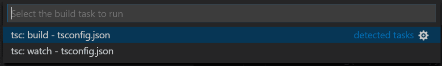

+++
title = "Compiling"
date = 2024-01-12T22:36:24+08:00
weight = 10
type = "docs"
description = ""
isCJKLanguage = true
draft = false
+++

> 原文: [https://code.visualstudio.com/docs/typescript/typescript-compiling](https://code.visualstudio.com/docs/typescript/typescript-compiling)

# Compiling TypeScript 正在编译 TypeScript


[TypeScript](https://www.typescriptlang.org/) is a typed superset of JavaScript that transpiles to plain JavaScript. It offers classes, modules, and interfaces to help you build robust components.

​​	TypeScript 是 JavaScript 的一个类型化超集，可转换为纯 JavaScript。它提供类、模块和接口，帮助您构建健壮的组件。

## [Install the TypeScript compiler 安装 TypeScript 编译器]()

Visual Studio Code includes TypeScript language support but does not include the TypeScript compiler, `tsc`. You will need to install the TypeScript compiler either globally or in your workspace to transpile TypeScript source code to JavaScript (`tsc HelloWorld.ts`).

​​	Visual Studio Code 包括 TypeScript 语言支持，但不包括 TypeScript 编译器， `tsc` 。您需要在全局或工作区中安装 TypeScript 编译器，才能将 TypeScript 源代码转译成 JavaScript（ `tsc HelloWorld.ts` ）。

The easiest way to install TypeScript is through npm, the [Node.js Package Manager](https://www.npmjs.com/). If you have npm installed, you can install TypeScript globally (`-g`) on your computer by:

​​	安装 TypeScript 的最简单方法是通过 npm，即 Node.js 包管理器。如果您已安装 npm，则可以通过以下方式在计算机上全局安装 TypeScript（ `-g` ）：

```
npm install -g typescript
```

You can test your install by checking the version or help.

​​	您可以通过检查版本或帮助来测试您的安装。

```
tsc --version
tsc --help
```

Another option is to install the TypeScript compiler locally in your project (`npm install --save-dev typescript`) and has the benefit of avoiding possible interactions with other TypeScript projects you may have.

​​	另一个选项是在您的项目中本地安装 TypeScript 编译器 ( `npm install --save-dev typescript` )，这样可以避免与您可能拥有的其他 TypeScript 项目发生可能的交互。

### [Compiler versus language service 编译器与语言服务]()

It is important to keep in mind that VS Code's TypeScript language service is separate from your installed TypeScript compiler. You can see the VS Code's TypeScript version in the Status Bar when you open a TypeScript file.

​​	务必要记住，VS Code 的 TypeScript 语言服务与您安装的 TypeScript 编译器是分开的。当您打开 TypeScript 文件时，可以在状态栏中看到 VS Code 的 TypeScript 版本。


Later in the article, we'll discuss how you can [change]() the version of TypeScript language service that VS Code uses.

​​	在本文的后面部分，我们将讨论如何更改 VS Code 使用的 TypeScript 语言服务版本。

## [tsconfig.json]()

Typically the first step in any new TypeScript project is to add a `tsconfig.json` file. A `tsconfig.json` file defines the TypeScript [project settings](https://www.typescriptlang.org/docs/handbook/tsconfig-json.html), such as the compiler options and the files that should be included. To do this, open up the folder where you want to store your source and add a new file named `tsconfig.json`. Once in this file, IntelliSense (Ctrl+Space) will help you along the way.

​​	通常，任何新 TypeScript 项目的第一步都是添加 `tsconfig.json` 文件。 `tsconfig.json` 文件定义 TypeScript 项目设置，例如编译器选项和应包含的文件。为此，请打开您要存储源代码的文件夹，并添加一个名为 `tsconfig.json` 的新文件。在此文件中，IntelliSense (Ctrl+Space) 将帮助您完成操作。


A simple `tsconfig.json` looks like this for ES5, **CommonJS** [modules](https://wiki.commonjs.org/wiki/Modules/1.0) and source maps:

​​	对于 ES5、CommonJS 模块和源映射，一个简单的 `tsconfig.json` 如下所示：

```
{
  "compilerOptions": {
    "target": "ES5",
    "module": "CommonJS",
    "sourceMap": true
  }
}
```

Now when you create a `.ts` file as part of the project we will offer up rich editing experiences and syntax validation.

​​	现在，当您创建 `.ts` 文件作为项目的一部分时，我们将提供丰富的编辑体验和语法验证。

## [Transpile TypeScript into JavaScript 将 TypeScript 编译成 JavaScript]()

VS Code integrates with `tsc` through our integrated [task runner](). We can use this to transpile `.ts` files into `.js` files. Another benefit of using VS Code tasks is that you get integrated error and warning detection displayed in the [Problems]() panel. Let's walk through transpiling a simple TypeScript Hello World program.

​​	VS Code 通过我们的集成任务运行程序与 `tsc` 集成。我们可以使用它将 `.ts` 文件编译成 `.js` 文件。使用 VS Code 任务的另一个好处是，您可以在“问题”面板中获取集成的错误和警告检测。我们来逐步编译一个简单的 TypeScript Hello World 程序。

### [Step 1: Create a simple TS file 步骤 1：创建一个简单的 TS 文件]()

Open VS Code on an empty folder and create a `helloworld.ts` file, place the following code in that file...

​​	在空文件夹中打开 VS Code 并创建一个 `helloworld.ts` 文件，将以下代码放入该文件中...

```
let message: string = 'Hello World';
console.log(message);
```

To test that you have the TypeScript compiler `tsc` installed correctly and a working Hello World program, open a terminal and type `tsc helloworld.ts`. You can use the Integrated Terminal (Ctrl+`) directly in VS Code.

​​	要测试您是否正确安装了 TypeScript 编译器 `tsc` 以及一个有效的 Hello World 程序，请打开一个终端并键入 `tsc helloworld.ts` 。您可以在 VS Code 中直接使用集成终端 (Ctrl+`)。

You should now see the transpiled `helloworld.js` JavaScript file, which you can run if you have [Node.js](https://nodejs.org/) installed, by typing `node helloworld.js`.

​​	现在，您应该会看到编译后的 `helloworld.js` JavaScript 文件，如果您安装了 Node.js，可以通过键入 `node helloworld.js` 来运行该文件。


### [Step 2: Run the TypeScript build 步骤 2：运行 TypeScript 构建]()

Execute **Run Build Task** (Ctrl+Shift+B) from the global **Terminal** menu. If you created a `tsconfig.json` file in the earlier section, this should present the following picker:

​​	从全局终端菜单执行运行构建任务（Ctrl+Shift+B）。如果您在前面的部分中创建了 `tsconfig.json` 文件，则应显示以下选择器：



Select the **tsc: build** entry. This will produce a `HelloWorld.js` and `HelloWorld.js.map` file in the workspace.

​​	选择 tsc: build 条目。这将在工作区中生成 `HelloWorld.js` 和 `HelloWorld.js.map` 文件。

If you selected **tsc: watch**, the TypeScript compiler watches for changes to your TypeScript files and runs the transpiler on each change.

​​	如果您选择了 tsc: watch，TypeScript 编译器将监视 TypeScript 文件的更改，并在每次更改时运行转换器。

Under the covers, we run the TypeScript compiler as a task. The command we use is: `tsc -p .`

​​	在后台，我们将 TypeScript 编译器作为任务运行。我们使用的命令是： `tsc -p .`

### [Step 3: Make the TypeScript Build the default 步骤 3：使 TypeScript 构建成为默认构建]()

You can also define the TypeScript build task as the default build task so that it is executed directly when triggering **Run Build Task** (Ctrl+Shift+B). To do so, select **Configure Default Build Task** from the global **Terminal** menu. This shows you a picker with the available build tasks. Select TypeScript **tsc: build**, which generates the following `tasks.json` file in a `.vscode` folder:

​​	您还可以将 TypeScript 构建任务定义为默认构建任务，以便在触发运行构建任务（Ctrl+Shift+B）时直接执行它。为此，请从全局终端菜单中选择“配置默认构建任务”。这会向您显示一个选择器，其中包含可用的构建任务。选择 TypeScript tsc: build，它将在 `.vscode` 文件夹中生成以下 `tasks.json` 文件：

```
{
    // See https://go.microsoft.com/fwlink/?LinkId=733558
    // for the documentation about the tasks.json format
    "version": "2.0.0",
    "tasks": [
        {
            "type": "typescript",
            "tsconfig": "tsconfig.json",
            "problemMatcher": [
                "$tsc"
            ],
            "group": {
                "kind": "build",
                "isDefault": true
            }
        }
    ]
}
```

Notice that the task has a `group` JSON object that sets the task `kind` to `build` and makes it the default. Now when you select the **Run Build Task** command or press (Ctrl+Shift+B), you are not prompted to select a task and your compilation starts.

​​	请注意，该任务有一个 `group` JSON 对象，它将任务 `kind` 设置为 `build` 并使其成为默认值。现在，当您选择“运行构建任务”命令或按 (Ctrl+Shift+B) 时，系统不会提示您选择任务，并且您的编译将开始。

> **Tip:** You can also run the program using VS Code's Run/Debug feature. Details about running and debugging Node.js applications in VS Code can be found in the [Node.js tutorial]()
>
> ​​	提示：您还可以使用 VS Code 的运行/调试功能运行程序。有关在 VS Code 中运行和调试 Node.js 应用程序的详细信息，请参阅 Node.js 教程

### [Step 4: Reviewing build issues 步骤 4：检查构建问题]()

The VS Code task system can also detect build issues through a [problem matcher](). A problem matcher parses build output based on the specific build tool and provides integrated issue display and navigation. VS Code ships with many problem matchers and `$tsc` seen above in `tasks.json` is the problem matcher for TypeScript compiler output.

​​	VS Code 任务系统还可以通过问题匹配器检测构建问题。问题匹配器根据特定的构建工具解析构建输出，并提供集成的错误显示和导航。VS Code 附带了许多问题匹配器， `$tsc` 如上文在 `tasks.json` 中看到的，是 TypeScript 编译器输出的问题匹配器。

As an example, if there was a simple error (extra 'g' in `console.log`) in our TypeScript file, we may get the following output from `tsc`:

​​	例如，如果我们的 TypeScript 文件中存在一个简单的错误（ `console.log` 中的额外“g”），我们可能会从 `tsc` 中获得以下输出：

```
HelloWorld.ts(3,17): error TS2339: Property 'logg' does not exist on type 'Console'.
```

This would show up in the terminal panel (Ctrl+`) and selecting the **Tasks - build tsconfig.json** in the terminal view dropdown.

​​	这将显示在终端面板（Ctrl+`）中，并在终端视图下拉列表中选择“任务 - 构建 tsconfig.json”。

You can see the error and warning counts in the Status Bar. Click on the error and warnings icon to get a list of the problems and navigate to them.

​​	您可以在状态栏中看到错误和警告计数。单击错误和警告图标以获取问题列表并导航到它们。


You can also use the keyboard to open the list Ctrl+Shift+M.

​​	您还可以使用键盘打开列表 Ctrl+Shift+M。

> **Tip:** Tasks offer rich support for many actions. Check the [Tasks]() topic for more information on how to configure them.
>
> ​​	提示：任务为许多操作提供丰富的支持。查看任务主题以获取有关如何配置它们的更多信息。

## [JavaScript source map support JavaScript 源映射支持]()

TypeScript debugging supports JavaScript source maps. To generate source maps for your TypeScript files, compile with the `--sourcemap` option or set the `sourceMap` property in the `tsconfig.json` file to `true`.

​​	TypeScript 调试支持 JavaScript 源映射。要为 TypeScript 文件生成源映射，请使用 `--sourcemap` 选项进行编译，或将 `tsconfig.json` 文件中的 `sourceMap` 属性设置为 `true` 。

In-lined source maps (a source map where the content is stored as a data URL instead of a separate file) are also supported, although in-lined source is not yet supported.

​​	内联源映射（其中内容存储为数据 URL，而不是单独的文件）也受支持，尽管尚未支持内联源。

## [Output location for generated files 生成文件的输出位置]()

Having the generated JavaScript file in the same folder at the TypeScript source will quickly get cluttered on larger projects. You can specify the output directory for the compiler with the `outDir` attribute.

​​	将生成的 JavaScript 文件与 TypeScript 源放在同一个文件夹中，在较大的项目中会很快变得杂乱无章。您可以使用 `outDir` 属性为编译器指定输出目录。

```
{
  "compilerOptions": {
    "target": "ES5",
    "module": "CommonJS",
    "outDir": "out"
  }
}
```

## [Hiding derived JavaScript files 隐藏派生的 JavaScript 文件]()

When you are working with TypeScript, you often don't want to see generated JavaScript files in the File Explorer or in Search results. VS Code offers filtering capabilities with a `files.exclude` [workspace setting]() and you can easily create an expression to hide those derived files:

​​	使用 TypeScript 时，您通常不希望在文件资源管理器或搜索结果中看到生成的 JavaScript 文件。VS Code 提供了具有 `files.exclude` 工作区设置的筛选功能，您可以轻松创建表达式来隐藏这些派生文件：

```
**/*.js: { "when": "$(basename).ts" }
```

This pattern will match on any JavaScript file (`**/*.js`) but only if a sibling TypeScript file with the same name is present. The File Explorer will no longer show derived resources for JavaScript if they are compiled to the same location.

​​	此模式将匹配任何 JavaScript 文件 ( `**/*.js` )，但仅当存在具有相同名称的同级 TypeScript 文件时才匹配。如果将派生的 JavaScript 资源编译到同一位置，文件资源管理器将不再显示这些资源。


Add the `files.exclude` setting with a filter in the workspace `settings.json` file, located in the `.vscode` folder at the root of the workspace. You can open the workspace `settings.json` via the **Preferences: Open Workspace Settings (JSON)** command from the Command Palette (Ctrl+Shift+P).

​​	在工作区 `settings.json` 文件中添加 `files.exclude` 设置，该文件位于工作区根目录的 `.vscode` 文件夹中。您可以通过命令面板 (Ctrl+Shift+P) 中的“首选项：打开工作区设置 (JSON)”命令打开工作区 `settings.json` 。要排除从 `files.exclude` 和 `settings.json` 源文件生成的 JavaScript 文件，请使用此表达式：

To exclude JavaScript files generated from both `.ts` and `.tsx` source files, use this expression:

​​	这有点像一个技巧。搜索 glob 模式用作键。上面的设置使用两个不同的 glob 模式来提供两个唯一键，但搜索仍会匹配相同的文件。

```
"files.exclude": {
    "**/*.js": { "when": "$(basename).ts" },
    "**/**.js": { "when": "$(basename).tsx" }
}
```

This is a bit of a trick. The search [glob patterns](https://code.visualstudio.com/docs/editor/glob-patterns) is used as a key. The settings above use two different glob patterns to provide two unique keys but the search will still match the same files.

​​	使用较新的 TypeScript 版本

## [Using newer TypeScript versions VS Code 附带最新稳定版本的 TypeScript 语言服务，并默认使用此服务在您的工作区中提供 IntelliSense。工作区的 TypeScript 版本独立于您用于编译 文件的 TypeScript 版本。对于大多数常见情况，您只需使用 VS Code 的内置 TypeScript 版本即可获得 IntelliSense，而无需担心，但有时您可能需要更改 VS Code 用于 IntelliSense 的 TypeScript 版本。]()

VS Code ships with a recent stable version of the TypeScript language service and uses this by default to provide IntelliSense in your workspace. The workspace version of TypeScript is independent of the version of TypeScript you use to compile your `*.ts` files. You can just use VS Code's built-in TypeScript version for IntelliSense without worry for most common cases, but sometimes you may need to change the version of TypeScript VS Code uses for IntelliSense.

​​	执行此操作的原因包括：

Reasons for doing this include:

- Trying out the latest TypeScript features by switching to the TypeScript nightly build (`typescript@next`).
  通过切换到 TypeScript nightly 内部版本 ( `typescript@next` ) 来试用最新的 TypeScript 功能。
- Making sure you are using the same version of TypeScript for IntelliSense that you use to compile your code.
  确保您使用与用于编译代码的 IntelliSense 相同版本的 TypeScript。

The active TypeScript version and its install location are displayed in the Status Bar when viewing a TypeScript file:

​​	查看 TypeScript 文件时，活动 TypeScript 版本及其安装位置会显示在状态栏中：


You have a few options if you want to change the default version of TypeScript in your workspace:

​​	如果您想更改工作区中 TypeScript 的默认版本，则有几个选项：

### [Using the workspace version of TypeScript 使用工作区版本的 TypeScript]()

If your workspace has a specific TypeScript version, you can switch between the workspace version of TypeScript and the version that VS Code uses by default by opening a TypeScript or JavaScript file and clicking on the TypeScript version number in the Status Bar. A message box will appear asking you which version of TypeScript VS Code should use:

​​	如果您的工作区具有特定的 TypeScript 版本，则可以通过打开 TypeScript 或 JavaScript 文件并单击状态栏中的 TypeScript 版本号，在 TypeScript 的工作区版本和 VS Code 默认使用的版本之间切换。将出现一个消息框，询问您 VS Code 应使用哪个版本的 TypeScript：


Use this to switch between the version of TypeScript that comes with VS Code and the version of TypeScript in your workspace. You can also trigger the TypeScript version selector with the **TypeScript: Select TypeScript Version** command.

​​	使用此功能可在 VS Code 附带的 TypeScript 版本和工作区中的 TypeScript 版本之间切换。您还可以使用 TypeScript：选择 TypeScript 版本命令触发 TypeScript 版本选择器。

VS Code will automatically detect workspace versions of TypeScript that are installed under `node_modules` in the root of your workspace. You can also explicitly tell VS Code which version of TypeScript to use by configuring the `typescript.tsdk` in your user or workspace [settings](). The `typescript.tsdk` setting should point to a directory containing the TypeScript `tsserver.js` file. You can find the TypeScript installation location using `npm list -g typescript`. The `tsserver.js` file is usually in the `lib` folder.

​​	VS Code 会自动检测工作区根目录 `node_modules` 下安装的 TypeScript 工作区版本。您还可以通过在用户或工作区设置中配置 `typescript.tsdk` 来明确告知 VS Code 使用哪个版本的 TypeScript。 `typescript.tsdk` 设置应指向包含 TypeScript `tsserver.js` 文件的目录。您可以使用 `npm list -g typescript` 查找 TypeScript 安装位置。 `tsserver.js` 文件通常位于 `lib` 文件夹中。

For example:

​​	例如：

```
{
  "typescript.tsdk": "/usr/local/lib/node_modules/typescript/lib"
}
```

> **Tip:** To get a specific TypeScript version, specify `@version` during npm install. For example, for TypeScript 3.6.0, you would use `npm install --save-dev typescript@3.6.0`. To preview the next version of TypeScript, run `npm install --save-dev typescript@next`.
>
> ​​	提示：若要获取特定 TypeScript 版本，请在 npm install 期间指定 `@version` 。例如，对于 TypeScript 3.6.0，您将使用 `npm install --save-dev typescript@3.6.0` 。若要预览 TypeScript 的下一个版本，请运行 `npm install --save-dev typescript@next` 。

Note that while `typescript.tsdk` points to the `lib` directory inside of `typescript` in these examples, the `typescript` directory must be a full TypeScript install that contains the TypeScript `package.json` file.

​​	请注意，虽然在这些示例中 `typescript.tsdk` 指向 `typescript` 中的 `lib` 目录，但 `typescript` 目录必须是包含 TypeScript `package.json` 文件的完整 TypeScript 安装。

You can also tell VS Code to use a specific version of TypeScript in a particular workspace by adding a `typescript.tsdk` workspace setting pointing to the directory of the `tsserver.js` file:

​​	您还可以通过添加指向 `tsserver.js` 文件目录的 `typescript.tsdk` 工作区设置，告知 VS Code 在特定工作区中使用特定版本的 TypeScript：

```
{
  "typescript.tsdk": "./node_modules/typescript/lib"
}
```

The `typescript.tsdk` workspace setting only tells VS Code that a workspace version of TypeScript exists. To actually start using the workspace version for IntelliSense, you must run the **TypeScript: Select TypeScript Version** command and select the workspace version.

​​	工作区设置仅告诉 VS Code 存在 TypeScript 的工作区版本。要实际开始将工作区版本用于 IntelliSense，您必须运行 TypeScript: 选择 TypeScript 版本命令并选择工作区版本。

### [Using TypeScript nightly builds 使用 TypeScript nightly 版本]()

The simplest way to try out the latest TypeScript features in VS Code is to install the [JavaScript and TypeScript Nightly extension](https://marketplace.visualstudio.com/items?itemName=ms-vscode.vscode-typescript-next).

​​	在 VS Code 中试用最新 TypeScript 功能的最简单方法是安装 JavaScript 和 TypeScript Nightly 扩展。

This extension automatically replaces VS Code's built-in TypeScript version with the latest TypeScript nightly build. Just make sure you [switch back to using VS Code's TypeScript version]() if you've configured your TypeScript version with the **TypeScript: Select TypeScript Version** command.

​​	此扩展会自动将 VS Code 的内置 TypeScript 版本替换为最新的 TypeScript nightly 版本。如果您已使用 TypeScript: 选择 TypeScript 版本命令配置了 TypeScript 版本，请务必切换回使用 VS Code 的 TypeScript 版本。

## [Mixed TypeScript and JavaScript projects 混合 TypeScript 和 JavaScript 项目]()

It is possible to have mixed TypeScript and JavaScript projects. To enable JavaScript inside a TypeScript project, you can set the `allowJs` property to `true` in the `tsconfig.json`.

​​	可以同时使用 TypeScript 和 JavaScript 项目。要在 TypeScript 项目中启用 JavaScript，您可以在 `tsconfig.json` 中将 `allowJs` 属性设置为 `true` 。

> **Tip:** The `tsc` compiler does not detect the presence of a `jsconfig.json` file automatically. Use the `–p` argument to make `tsc` use your `jsconfig.json` file, e.g. `tsc -p jsconfig.json`.
>
> ​​	提示： `tsc` 编译器不会自动检测到 `jsconfig.json` 文件的存在。使用 `–p` 参数使 `tsc` 使用您的 `jsconfig.json` 文件，例如 `tsc -p jsconfig.json` 。

## [Working with large projects 处理大型项目]()

If you are working in a codebase with hundreds or thousands of TypeScript files, here are some steps you can take to improve both the editing experience in VS Code as well as compile times on the command line.

​​	如果您正在使用包含数百或数千个 TypeScript 文件的代码库，可以采取以下步骤来改善 VS Code 中的编辑体验以及命令行上的编译时间。

### [Make sure your tsconfig only includes files you care about 确保您的 tsconfig 仅包含您关心的文件]()

Use `include` or `files` in your project's `tsconfig.json` to make sure the project only includes the files that should be part of the project.

​​	在项目的 `tsconfig.json` 中使用 `include` 或 `files` 以确保项目仅包含应属于该项目的文件。

[More information](https://github.com/microsoft/TypeScript/wiki/Performance#configuring-tsconfigjson-or-jsconfigjson) on configuring your project's `tsconfig.json`.

​​	有关配置项目的 `tsconfig.json` 的更多信息。

### [Break up your project using project references 使用项目引用来分解项目]()

Instead of structuring your source code as a single large project, you can improve performance by breaking it up into smaller projects using [project references](https://www.typescriptlang.org/docs/handbook/project-references.html). This allows TypeScript to load just a subset of your codebase at a time, instead of loading the entire thing.

​​	不要将源代码构建为单个大型项目，您可以通过使用项目引用将其分解为更小的项目来提高性能。这允许 TypeScript 一次仅加载代码库的子集，而不是加载整个代码库。

See the [TypeScript documentation](https://www.typescriptlang.org/docs/handbook/project-references.html) for details on how to use project references and best practices for working with them.

​​	请参阅 TypeScript 文档，了解有关如何使用项目引用以及使用它们的最佳实践的详细信息。

## [Next steps 后续步骤]()

Read on to find out about:

​​	继续阅读以了解：

- [Editing TypeScript]() - Specific editing features for TypeScript.
  编辑 TypeScript - 针对 TypeScript 的特定编辑功能。
- [Refactoring TypeScript]() - Useful refactorings from the TypeScript language service.
  重构 TypeScript - TypeScript 语言服务提供有用的重构。
- [Debugging TypeScript]() - Configure the debugger for your TypeScript project.
  调试 TypeScript - 为 TypeScript 项目配置调试器。

## [Common questions 常见问题]()

### [How do I resolve a TypeScript "Cannot compile external module" error? 如何解决 TypeScript“无法编译外部模块”错误？]()

If you get that error, resolve it by creating a `tsconfig.json` file in the root folder of your project. The tsconfig.json file lets you control how Visual Studio Code compiles your TypeScript code. For more information, see the [tsconfig.json overview](https://www.typescriptlang.org/docs/handbook/tsconfig-json.html).

​​	如果出现该错误，请通过在项目的根文件夹中创建一个 `tsconfig.json` 文件来解决。tsconfig.json 文件允许您控制 Visual Studio Code 如何编译 TypeScript 代码。有关详细信息，请参阅 tsconfig.json 概述。

### [Why do I get different errors and warnings with VS Code than when I compile my TypeScript project? 为什么我在使用 VS Code 时收到的错误和警告与在编译 TypeScript 项目时收到的不同？]()

VS Code ships with a recent stable version of the TypeScript language service and it may not match the version of TypeScript installed globally on your computer or locally in your workspace. For that reason, you may see differences between your compiler output and errors detected by the active TypeScript language service. See [Using newer TypeScript versions]() for details on installing a matching TypeScript version.

​​	VS Code 附带最新稳定版本的 TypeScript 语言服务，它可能与您计算机上全局安装的或在工作区中本地安装的 TypeScript 版本不匹配。因此，您可能会看到编译器输出与活动 TypeScript 语言服务检测到的错误之间存在差异。有关安装匹配的 TypeScript 版本的详细信息，请参阅使用较新版本的 TypeScript。

### [Can I use the version of TypeScript that ships with VS 2022? 我可以使用 VS 2022 附带的 TypeScript 版本吗？]()

No, the TypeScript language service that ships with Visual Studio 2019 and 2022 isn't compatible with VS Code. You will need to install a separate version of TypeScript from [npm](https://www.npmjs.com/package/typescript).

​​	不可以，Visual Studio 2019 和 2022 附带的 TypeScript 语言服务与 VS Code 不兼容。您需要从 npm 安装单独的 TypeScript 版本。

### [Why are some errors reported as warnings? 为什么某些错误被报告为警告？]()

By default, VS Code TypeScript displays code style issues as warnings instead of errors. This applies to:

​​	默认情况下，VS Code TypeScript 将代码样式问题显示为警告，而不是错误。这适用于：

- Variable is declared but never used
  声明了变量但从未使用
- Property is declared but its value is never read
  声明了属性，但从未读取其值
- Unreachable code detected
  检测到无法到达的代码
- Unused label
  未使用的标签
- Fall through case in switch
  switch 中存在穿透情况
- Not all code paths return a value
  并非所有代码路径都返回一个值

Treating these as warnings is consistent with other tools, such as TSLint. These will still be displayed as errors when you run `tsc` from the command line.

​​	将这些视为警告与其他工具（例如 TSLint）保持一致。当您从命令行运行 `tsc` 时，这些仍将显示为错误。

You can disable this behavior by setting `"typescript.reportStyleChecksAsWarnings": false` in your User [settings]().

​​	您可以在用户设置中设置 `"typescript.reportStyleChecksAsWarnings": false` 来禁用此行为。
