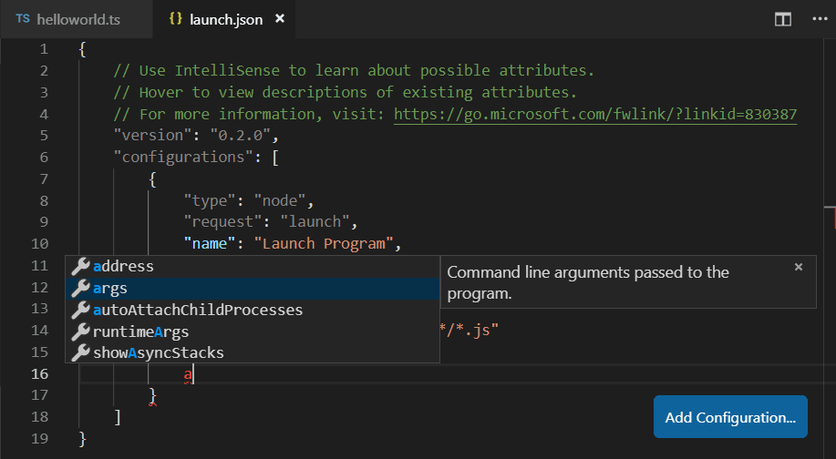
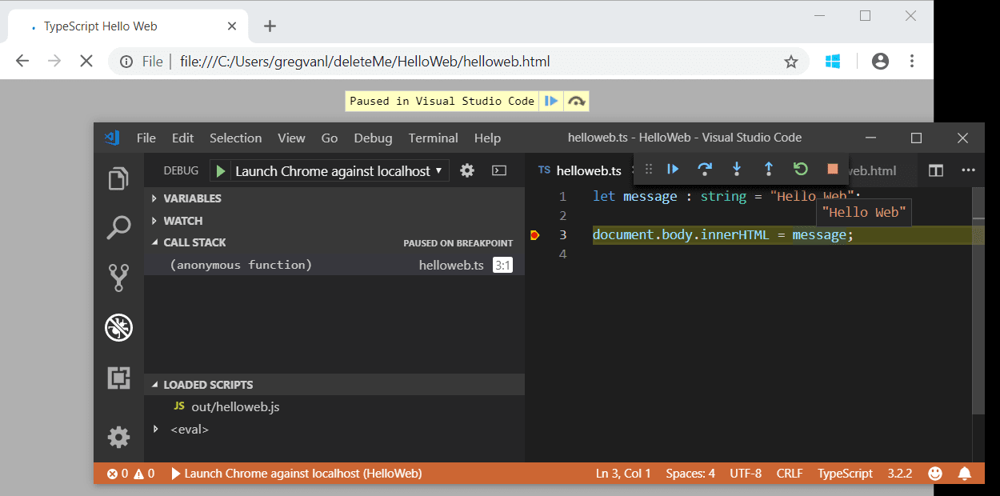

+++
title = "Debugging"
date = 2024-01-12T22:36:24+08:00
weight = 40
type = "docs"
description = ""
isCJKLanguage = true
draft = false
+++

> 原文: [https://code.visualstudio.com/docs/typescript/typescript-debugging](https://code.visualstudio.com/docs/typescript/typescript-debugging)

# Debugging TypeScript 调试 TypeScript


Visual Studio Code supports TypeScript debugging through its built-in [Node.js debugger]() and [Edge and Chrome debugger]().

​​	Visual Studio Code 通过其内置的 Node.js 调试器和 Edge 和 Chrome 调试器支持 TypeScript 调试。

## [JavaScript source map support JavaScript 源映射支持]()

TypeScript debugging supports JavaScript source maps. To generate source maps for your TypeScript files, compile with the `--sourcemap` option or set the `sourceMap` property in the `tsconfig.json` file to `true`.

​​	TypeScript 调试支持 JavaScript 源映射。要为 TypeScript 文件生成源映射，请使用 `--sourcemap` 选项进行编译，或将 `tsconfig.json` 文件中的 `sourceMap` 属性设置为 `true` 。

In-lined source maps (a source map where the content is stored as a data URL instead of a separate file) are also supported, although in-lined source is not yet supported.

​​	内联源映射（其中内容存储为数据 URL，而不是单独的文件）也受支持，尽管尚未支持内联源。

For a simple example of source maps in action, see the [TypeScript tutorial](), which shows debugging a simple "Hello World" Node.js application using the following `tsconfig.json` and VS Code default Node.js debugging configuration.

​​	有关操作中的源映射的简单示例，请参阅 TypeScript 教程，该教程演示了使用以下 `tsconfig.json` 和 VS Code 默认 Node.js 调试配置对简单的“Hello World”Node.js 应用程序进行调试。

```
{
  "compilerOptions": {
    "target": "ES5",
    "module": "CommonJS",
    "outDir": "out",
    "sourceMap": true
  }
}
```

For more advanced debugging scenarios, you can create your own debug configuration `launch.json` file. To see the default configuration, go to the **Run and Debug** view (Ctrl+Shift+D) and select the **create a launch.json file** link.

​​	对于更高级的调试方案，您可以创建自己的调试配置 `launch.json` 文件。要查看默认配置，请转到“运行和调试”视图 (Ctrl+Shift+D) 并选择“创建 launch.json 文件”链接。

This will create a `launch.json` file in a `.vscode` folder with default values detected in your project.

​​	这将在 `.vscode` 文件夹中创建一个 `launch.json` 文件，其中包含在您的项目中检测到的默认值。

```
{
  // Use IntelliSense to learn about possible attributes.
  // Hover to view descriptions of existing attributes.
  // For more information, visit: https://go.microsoft.com/fwlink/?linkid=830387
  "version": "0.2.0",
  "configurations": [
    {
      "type": "node",
      "request": "launch",
      "name": "Launch Program",
      "program": "${workspaceFolder}/helloworld.ts",
      "preLaunchTask": "tsc: build - tsconfig.json",
      "outFiles": ["${workspaceFolder}/out/**/*.js"]
    }
  ]
}
```

VS Code has determined the program to launch, `helloworld.ts`, included the build as a `preLaunchTask`, and told the debugger where to find the generated JavaScript files.

​​	VS Code 已确定要启动的程序 `helloworld.ts` ，将构建包括为 `preLaunchTask` ，并告知调试器在何处查找生成的 JavaScript 文件。

There is full IntelliSense with suggestions and information for `launch.json` to help you learn about other debug configuration options. You can also add new debug configurations to `launch.json` with the **Add Configuration** button in the lower right.

​​	对于 `launch.json` ，有完整的 IntelliSense，其中包含建议和信息，可帮助您了解其他调试配置选项。您还可以在右下角使用“添加配置”按钮将新的调试配置添加到 `launch.json` 。



Also see [Node.js Debugging]() for examples and further explanations.

​​	另请参阅 Node.js 调试，以获取示例和进一步的说明。

## [Mapping the output location 映射输出位置]()

If generated (transpiled) JavaScript files do not live next to their source, you can help the VS Code debugger locate them by setting the `outFiles` attribute in the launch configuration. Whenever you set a breakpoint in the original source, VS Code tries to find the generated source by searching the files specified by glob patterns in `outFiles`.

​​	如果生成的（转译的）JavaScript 文件不在其源代码旁边，您可以通过在启动配置中设置 `outFiles` 属性来帮助 VS Code 调试器找到它们。每当您在原始源代码中设置断点时，VS Code 都会尝试通过搜索 `outFiles` 中的 glob 模式指定的文件来查找生成的源代码。

## [Client-side debugging 客户端调试]()

TypeScript is great for writing client-side code as well as Node.js applications and you can debug client-side source code with the [built-in Edge and Chrome debugger]().

​​	TypeScript 非常适合编写客户端代码以及 Node.js 应用程序，您还可以使用内置的 Edge 和 Chrome 调试器调试客户端源代码。

We'll create a tiny web application to show client-side debugging in action.

​​	我们将创建一个微型 Web 应用程序来演示客户端调试操作。

Create a new folder `HelloWeb` and add three files: `helloweb.ts`, `helloweb.html`, and `tsconfig.json` with the following content"

​​	创建一个新文件夹 `HelloWeb` 并添加三个文件： `helloweb.ts` 、 `helloweb.html` 和 `tsconfig.json` ，内容如下“

helloweb.ts

```
let message: string = 'Hello Web';
document.body.innerHTML = message;
```

helloweb.html

```
<!DOCTYPE html>
<html>
    <head><title>TypeScript Hello Web</title></head>
    <body>
        <script src="out/helloweb.js"></script>
    </body>
</html>
```

tsconfig.json

```
{
  "compilerOptions": {
    "target": "ES5",
    "module": "CommonJS",
    "outDir": "out",
    "sourceMap": true
  }
}
```

Run `tsc` to build the app and then test by opening `helloweb.html` in your browser (you can right-click `helloweb.html` in the File Explorer and select **Copy Path** to paste into your browser).

​​	运行 `tsc` 以构建应用程序，然后通过在浏览器中打开 `helloweb.html` 来进行测试（您可以在文件资源管理器中右键单击 `helloweb.html` 并选择“复制路径”以粘贴到浏览器中）。

In the Run and Debug view (Ctrl+Shift+D), select **create a launch.json file** to create a `launch.json` file selecting **Web App (Edge)** as the debugger, or **Web App (Chrome)** if you prefer.

​​	在“运行和调试”视图（Ctrl+Shift+D）中，选择创建 launch.json 文件以创建 `launch.json` 文件，选择 Web App（Edge）作为调试器，如果您愿意，也可以选择 Web App（Chrome）。

Update the `launch.json` to specify the local file URL to `helloweb.html`:

​​	更新 `launch.json` 以将本地文件 URL 指定为 `helloweb.html` ：

```
{
  "version": "0.2.0",
  "configurations": [
    {
      "type": "msedge",
      "request": "launch",
      "name": "Launch Edge against localhost",
      "url": "file:///C:/Users/username/HelloWeb/helloweb.html",
      "webRoot": "${workspaceFolder}"
    }
  ]
}
```

The **Run and Debug** view configuration dropdown will now show the new configuration **Launch Edge against localhost**. If you run that configuration, your browser will launch with your web page. Open `helloweb.ts` in the editor and click the left gutter to add a breakpoint (it will be displayed as a red circle). Press F5 to start the debug session, which launches the browser and hits your breakpoint in `helloweb.ts`.

​​	运行和调试视图配置下拉列表现在将显示针对 localhost 的新配置启动 Edge。如果您运行该配置，您的浏览器将随您的网页启动。在编辑器中打开 `helloweb.ts` 并单击左侧边距以添加断点（它将显示为红色圆圈）。按 F5 启动调试会话，该会话将启动浏览器并在 `helloweb.ts` 中命中您的断点。



## [Common questions 常见问题]()

### [Cannot launch program because corresponding JavaScript cannot be found 无法启动程序，因为找不到相应的 JavaScript]()

You've likely not set `"sourceMap": true` in your `tsconfig.json` or `outFiles` in your `launch.json` and the VS Code Node.js debugger can't map your TypeScript source code to the running JavaScript. Turn on source maps and rebuild your project.

​​	您可能尚未在 `tsconfig.json` 或 `launch.json` 中的 `"sourceMap": true` 中进行设置，VS Code Node.js 调试器无法将您的 TypeScript 源代码映射到正在运行的 JavaScript。打开源映射并重新生成您的项目。
