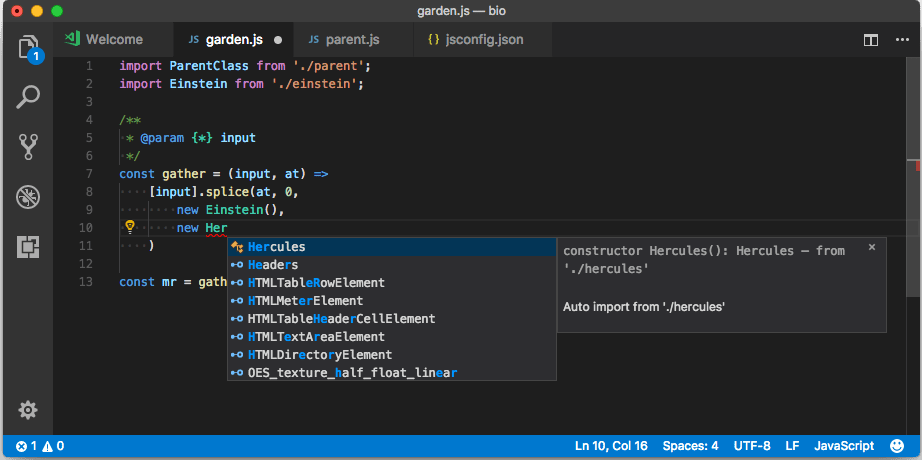
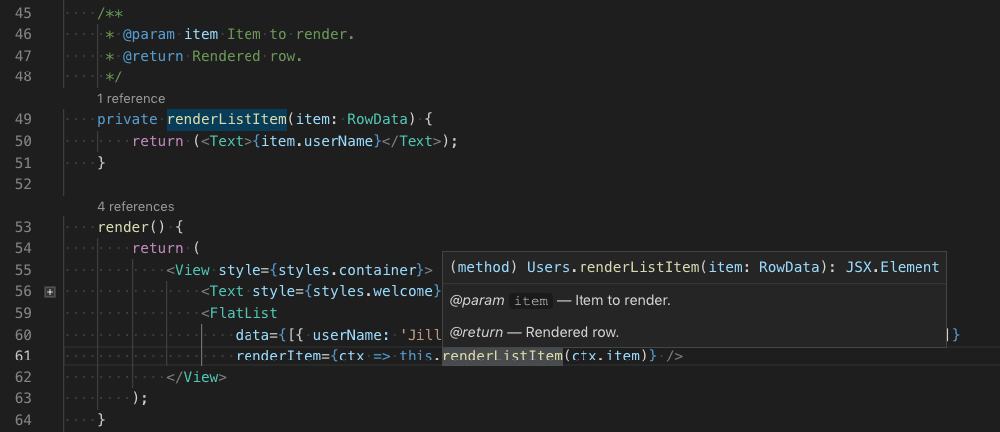

+++
title = "Editing"
date = 2024-01-12T22:36:24+08:00
weight = 20
type = "docs"
description = ""
isCJKLanguage = true
draft = false
+++

> 原文: [https://code.visualstudio.com/docs/typescript/typescript-editing](https://code.visualstudio.com/docs/typescript/typescript-editing)

# Editing TypeScript 编辑 TypeScript

Visual Studio Code has great editing support for [TypeScript](https://www.typescriptlang.org/). This article goes into depth on the editing and programming language features that come built-in to VS Code. If you'd like to know more about general editing features in VS Code, such as keyboard shortcuts, multi-cursors, search, and find and replace, you can read [Basic Editing](https://code.visualstudio.com/docs/editor/codebasics).

​​	Visual Studio Code 对 TypeScript 具有强大的编辑支持。本文深入介绍了 VS Code 中内置的编辑和编程语言功能。如果您想详细了解 VS Code 中的常规编辑功能，例如键盘快捷方式、多光标、搜索以及查找和替换，可以阅读基本编辑。

## [IntelliSense](https://code.visualstudio.com/docs/typescript/typescript-editing#_intellisense)

IntelliSense shows you intelligent code completion, hover information, and signature help so that you can write code more quickly and correctly.

​​	IntelliSense 会向您显示智能代码补全、悬停信息和签名帮助，以便您可以更快速、更正确地编写代码。

VS Code provides IntelliSense for individual TypeScript files as well as TypeScript `tsconfig.json` projects.

​​	VS Code 为单独的 TypeScript 文件以及 TypeScript `tsconfig.json` 项目提供 IntelliSense。

### [Hover information 悬停信息](https://code.visualstudio.com/docs/typescript/typescript-editing#_hover-information)

Hover over a TypeScript symbol to quickly see its type information and relevant documentation:

​​	将鼠标悬停在 TypeScript 符号上，即可快速查看其类型信息和相关文档：

You can also show the hover information at the current cursor position with the Ctrl+K Ctrl+I keyboard shortcut.

​​	您还可以使用 Ctrl+K Ctrl+I 键盘快捷方式在当前光标位置显示悬停信息。

### [Signature help 签名帮助](https://code.visualstudio.com/docs/typescript/typescript-editing#_signature-help)

As you write a TypeScript function call, VS Code shows information about the function signature and highlights the parameter that you are currently completing:

​​	在编写 TypeScript 函数调用时，VS Code 会显示有关函数签名的信息，并突出显示您当前正在完成的参数：

Signature help is shown automatically when you type a `(` or `,` within a function call. Use Ctrl+Shift+Space to manually trigger signature help.

​​	在函数调用中键入 `(` 或 `,` 时，会自动显示签名帮助。使用 Ctrl+Shift+Space 手动触发签名帮助。

## [Snippets 代码片段](https://code.visualstudio.com/docs/typescript/typescript-editing#_snippets)

VS Code includes basic TypeScript [snippets](https://code.visualstudio.com/docs/editor/userdefinedsnippets) that are suggested as you type;

​​	VS Code 包含基本 TypeScript 代码段，在您键入时会建议使用；

You can install extensions to get additional snippets or define your own snippets for TypeScript. See [User Defined Snippets](https://code.visualstudio.com/docs/editor/userdefinedsnippets) for more information.

​​	您可以安装扩展以获取其他代码段或定义您自己的 TypeScript 代码段。有关更多信息，请参阅用户定义的代码段。

> **Tip**: You can disable snippets by setting `editor.snippetSuggestions` to `"none"` in your [settings](https://code.visualstudio.com/docs/getstarted/settings) file. If you'd like to see snippets, you can specify the order relative to suggestions; at the top (`"top"`), at the bottom (`"bottom"`), or inlined ordered alphabetically (`"inline"`). The default is `"inline"`.
>
> ​​	提示：您可以通过在设置文件中将 `editor.snippetSuggestions` 设置为 `"none"` 来禁用代码段。如果您想查看代码段，您可以指定相对于建议的顺序；在顶部 ( `"top"` )、底部 ( `"bottom"` ) 或内联按字母顺序排列 ( `"inline"` )。默认值为 `"inline"` 。

## [Inlay hints 内联提示](https://code.visualstudio.com/docs/typescript/typescript-editing#_inlay-hints)

Inlay hints add additional inline information to source code to help you understand what the code does.

​​	内联提示向源代码添加其他内联信息，以帮助您理解代码的作用。

**Parameter name inlay hints** show the names of parameters in function calls:

​​	参数名称内联提示显示函数调用中的参数名称：

This can help you understand the meaning of each argument at a glance, which is especially helpful for functions that take Boolean flags or have parameters that are easy to mix up.

​​	这可以帮助您一目了然地理解每个参数的含义，这对于采用布尔标志或具有容易混淆的参数的函数特别有用。

To enable parameter name hints, set `typescript.inlayHints.parameterNames.enabled`. There are three possible values:

​​	要启用参数名称提示，请设置 `typescript.inlayHints.parameterNames.enabled` 。有三个可能的值：

- `none` — Disable parameter inlay hints.
  `none` — 禁用参数内联提示。
- `literals` — Only show inlay hints for literals (string, number, Boolean).
  `literals` — 仅显示文字（字符串、数字、布尔值）的内联提示。
- `all` — Show inlay hints for all arguments.
  `all` — 显示所有参数的内联提示。

**Variable type inlay hints** show the types of variables that don't have explicit type annotations.

​​	变量类型内联提示显示没有显式类型注释的变量的类型。

Setting: `typescript.inlayHints.variableTypes.enabled`

​​	设置： `typescript.inlayHints.variableTypes.enabled`

**Property type inlay hints** show the type of class properties that don't have an explicit type annotation.

​​	属性类型内联提示显示没有显式类型注释的类属性的类型。

Setting: `typescript.inlayHints.propertyDeclarationTypes.enabled`

​​	设置： `typescript.inlayHints.propertyDeclarationTypes.enabled`

**Parameter type hints** show the types of implicitly typed parameters.

​​	参数类型提示显示隐式类型参数的类型。

Setting: `typescript.inlayHints.parameterTypes.enabled`

​​	设置： `typescript.inlayHints.parameterTypes.enabled`

**Return type inlay hints** show the return types of functions that don't have an explicit type annotation.

​​	返回类型内联提示显示没有显式类型注释的函数的返回类型。

Setting: `typescript.inlayHints.functionLikeReturnTypes.enabled`

​​	设置： `typescript.inlayHints.functionLikeReturnTypes.enabled`

## [References CodeLens 引用 CodeLens](https://code.visualstudio.com/docs/typescript/typescript-editing#_references-codelens)

The TypeScript references CodeLens displays an inline count of reference for classes, interfaces, methods, properties, and exported objects:

​​	TypeScript 引用 CodeLens 显示类、接口、方法、属性和导出对象的内联引用计数：

You can enable this by setting `"typescript.referencesCodeLens.enabled": true` in the User Settings file.

​​	您可以在用户设置文件中设置 `"typescript.referencesCodeLens.enabled": true` 来启用此功能。

Click on the reference count to quickly browse a list of references:

​​	单击引用计数以快速浏览引用列表：

## [Implementations CodeLens 实现 CodeLens](https://code.visualstudio.com/docs/typescript/typescript-editing#_implementations-codelens)

The TypeScript implementations CodeLens displays the number of implementors of an interface:

​​	TypeScript 实现 CodeLens 显示接口的实现者数量：

You can enable this by setting `"typescript.implementationsCodeLens.enabled": true`.

​​	您可以在用户设置文件中设置 `"typescript.implementationsCodeLens.enabled": true` 来启用此功能。

As with the references CodeLens, you can click on the implementation count to quickly browse a list of all implementations.

​​	与引用 CodeLens 一样，您可以单击实现计数以快速浏览所有实现的列表。

## [Auto imports 自动导入](https://code.visualstudio.com/docs/typescript/typescript-editing#_auto-imports)

Automatic imports speed up coding by helping you find available symbols and automatically adding imports for them.

​​	自动导入通过帮助您查找可用符号并自动为它们添加导入来加快编码速度。

Just start typing to see [suggestions](https://code.visualstudio.com/docs/typescript/typescript-editing#_intellisense) for all available TypeScript symbols in your current project.

​​	只需开始键入即可查看当前项目中所有可用 TypeScript 符号的建议。

If you choose one of the suggestions from another file or module, VS Code will automatically add an import for it. In this example, VS Code adds an import for `Hercules` to the top of the file:

​​	如果您选择另一个文件或模块中的某个建议，VS Code 会自动为其添加导入。在此示例中，VS Code 为 `Hercules` 添加了文件顶部的导入：

You can disable auto imports by setting `"typescript.suggest.autoImports": false`.

​​	您可以通过设置 `"typescript.suggest.autoImports": false` 来禁用自动导入。

## [JSX and auto closing tags JSX 和自动关闭标签](https://code.visualstudio.com/docs/typescript/typescript-editing#_jsx-and-auto-closing-tags)

VS Code's TypeScript features also work with [JSX](https://reactjs.org/docs/introducing-jsx.html). To use JSX in your TypeScript, use the `*.tsx` file extension instead of the normal `*.ts`:

​​	VS Code 的 TypeScript 功能也适用于 JSX。要在 TypeScript 中使用 JSX，请使用 `*.tsx` 文件扩展名，而不是普通的 `*.ts` ：

VS Code also includes JSX-specific features such as autoclosing of JSX tags in TypeScript:

​​	VS Code 还包括特定于 JSX 的功能，例如在 TypeScript 中自动关闭 JSX 标签：

<video src="https://code.visualstudio.com/assets/docs/typescript/editing/jsx-tag-complete.mp4" placeholder="/assets/docs/typescript/editing/jsx-tag-complete.png" autoplay="" loop="" controls="" muted="" data-immersive-translate-walked="55c38569-e5a8-44fa-8525-4ebcda509bf3" data-immersive-translate-paragraph="1" style="box-sizing: border-box; font-family: &quot;Segoe UI&quot;, &quot;Helvetica Neue&quot;, Helvetica, Arial, sans-serif; display: inline-block; vertical-align: baseline; margin-top: 1.5rem; margin-bottom: 2.5rem; width: 616.662px; max-width: 100%; color: rgb(36, 36, 36); font-size: 16px; font-style: normal; font-variant-ligatures: normal; font-variant-caps: normal; font-weight: 400; letter-spacing: normal; orphans: 2; text-align: start; text-indent: 0px; text-transform: none; widows: 2; word-spacing: 0px; -webkit-text-stroke-width: 0px; white-space: normal; background-color: rgb(255, 255, 255); text-decoration-thickness: initial; text-decoration-style: initial; text-decoration-color: initial;"></video>

Set `"typescript.autoClosingTags"` to `false` to disable JSX tag closing.

​​	将 `"typescript.autoClosingTags"` 设置为 `false` 以禁用 JSX 标签关闭。

## [JSDoc support JSDoc 支持](https://code.visualstudio.com/docs/typescript/typescript-editing#_jsdoc-support)

VS Code's TypeScript IntelliSense understands many standard [JSDoc](https://jsdoc.app/) annotations, and uses them to show typing information and documentation in [suggestions](https://code.visualstudio.com/docs/typescript/typescript-editing#_intellisense), [hover information](https://code.visualstudio.com/docs/typescript/typescript-editing#_hover-information), and [signature help](https://code.visualstudio.com/docs/typescript/typescript-editing#_signature-help).

​​	VS Code 的 TypeScript IntelliSense 了解许多标准 JSDoc 注释，并使用它们在建议、悬停信息和签名帮助中显示类型信息和文档。

Keep in mind that when using JSDoc for TypeScript code, you should not include type annotations. The TypeScript compiler only uses TypeScript type annotations and ignores those from JSDoc.

​​	请记住，在将 JSDoc 用于 TypeScript 代码时，您不应包含类型注释。TypeScript 编译器仅使用 TypeScript 类型注释，而忽略 JSDoc 中的注释。

<video src="https://code.visualstudio.com/assets/docs/typescript/editing/jsdoc-autofill.mp4" placeholder="/assets/docs/typescript/editing/jsdoc-autofill-placeholder.png" autoplay="" loop="" controls="" muted="" data-immersive-translate-walked="55c38569-e5a8-44fa-8525-4ebcda509bf3" data-immersive-translate-paragraph="1" style="box-sizing: border-box; font-family: &quot;Segoe UI&quot;, &quot;Helvetica Neue&quot;, Helvetica, Arial, sans-serif; display: inline-block; vertical-align: baseline; margin-top: 1.5rem; margin-bottom: 2.5rem; width: 616.662px; max-width: 100%; color: rgb(36, 36, 36); font-size: 16px; font-style: normal; font-variant-ligatures: normal; font-variant-caps: normal; font-weight: 400; letter-spacing: normal; orphans: 2; text-align: start; text-indent: 0px; text-transform: none; widows: 2; word-spacing: 0px; -webkit-text-stroke-width: 0px; white-space: normal; background-color: rgb(255, 255, 255); text-decoration-thickness: initial; text-decoration-style: initial; text-decoration-color: initial;"></video>

To disable JSDoc comment suggestions in TypeScript, set `"typescript.suggest.completeJSDocs": false`.

​​	若要禁用 TypeScript 中的 JSDoc 注释建议，请设置 `"typescript.suggest.completeJSDocs": false` 。

## [Code navigation 代码导航](https://code.visualstudio.com/docs/typescript/typescript-editing#_code-navigation)

Code navigation lets you quickly navigate TypeScript projects.

​​	代码导航允许您快速导航 TypeScript 项目。

- **Go to Definition** F12 - Go to the source code of a symbol definition.
  转到定义 F12 - 转到符号定义的源代码。
- **Peek Definition** Alt+F12 - Bring up a Peek window that shows the definition of a symbol.
  预览定义 Alt+F12 - 调出显示符号定义的预览窗口。
- **Go to References** Shift+F12 - Show all references to a symbol.
  转到引用 Shift+F12 - 显示对符号的所有引用。
- **Go to Type Definition** - Go to the type that defines a symbol. For an instance of a class, this will reveal the class itself instead of where the instance is defined.
  转到类型定义 - 转到定义符号的类型。对于类的实例，这将显示类本身，而不是定义实例的位置。
- **Go to Implementation** Ctrl+F12 - Go to the implementations of an interface or abstract method.
  转到实现 Ctrl+F12 - 转到接口或抽象方法的实现。

You can navigate via symbol search using the **Go to Symbol** commands from the **Command Palette** (Ctrl+Shift+P).

​​	您可以使用“命令面板”（Ctrl+Shift+P）中的“转到符号”命令通过符号搜索进行导航。

- **Go to Symbol in File** Ctrl+Shift+O
  转到文件中的符号 Ctrl+Shift+O
- **Go to Symbol in Workspace** Ctrl+T
  转到工作区中的符号 Ctrl+T

## [Formatting 格式化](https://code.visualstudio.com/docs/typescript/typescript-editing#_formatting)

VS Code includes a TypeScript formatter that provides basic code formatting with reasonable defaults.

​​	VS Code 包括一个 TypeScript 格式化程序，它提供基本代码格式化，具有合理的默认值。

Use the `typescript.format.*` [settings](https://code.visualstudio.com/docs/getstarted/settings) to configure the built-in formatter, such as making braces appear on their own line. Or, if the built-in formatter is getting in the way, set `"typescript.format.enable"` to `false` to disable it.

​​	使用 `typescript.format.*` 设置来配置内置格式化程序，例如使大括号出现在它们自己的行上。或者，如果内置格式化程序碍事，请将 `"typescript.format.enable"` 设置为 `false` 以禁用它。

For more specialized code formatting styles, try installing one of the formatting extensions from the VS Code marketplace.

​​	对于更专业的代码格式化样式，请尝试从 VS Code 市场安装一个格式化扩展。

## [Syntax highlighting and semantic highlighting 语法突出显示和语义突出显示](https://code.visualstudio.com/docs/typescript/typescript-editing#_syntax-highlighting-and-semantic-highlighting)

In addition to syntax highlighting, TypeScript and JavaScript also provide semantic highlighting.

​​	除了语法突出显示外，TypeScript 和 JavaScript 还提供语义突出显示。

Syntax highlighting colors the text based on lexical rules. Semantic highlighting enriches the syntax coloring based on resolved symbol information from the language service.

​​	语法突出显示根据词法规则对文本进行着色。语义突出显示根据语言服务的已解析符号信息丰富了语法着色。

Whether semantic highlighting is visible depends on the current color theme. Each theme can [configure](https://code.visualstudio.com/docs/getstarted/themes#_editor-semantic-highlighting) whether to display semantic highlighting and how it styles the semantic tokens.

​​	语义突出显示是否可见取决于当前的颜色主题。每个主题都可以配置是否显示语义突出显示以及如何设置语义标记的样式。

If semantic highlighting is enabled and the color theme has a corresponding styling rule defined, different colors and styles can be seen.

​​	如果启用了语义突出显示，并且颜色主题定义了相应的样式规则，则可以看到不同的颜色和样式。

Semantic highlighting can change colors based on:

​​	语义突出显示可以根据以下内容更改颜色：

- The resolved type of a symbol: namespace, variable, property, variable, class, interface, typeParameter.
  符号的已解析类型：命名空间、变量、属性、变量、类、接口、typeParameter。
- Whether the variable/property is read-only (const) or modifiable.
  变量/属性是只读 (const) 还是可修改的。
- Whether the variable/property type is callable (a function type) or not.
  变量/属性类型是否可调用（函数类型）。

## [Next steps 后续步骤](https://code.visualstudio.com/docs/typescript/typescript-editing#_next-steps)

Read on to find out about:

​​	继续阅读以了解：

- [Refactor TypeScript](https://code.visualstudio.com/docs/typescript/typescript-refactoring) - Learn about the useful refactorings available for TypeScript.
  重构 TypeScript - 了解适用于 TypeScript 的有用重构。
- [Debugging TypeScript](https://code.visualstudio.com/docs/typescript/typescript-debugging) - Configure the debugger for your TypeScript project.
  调试 TypeScript - 为 TypeScript 项目配置调试器。
