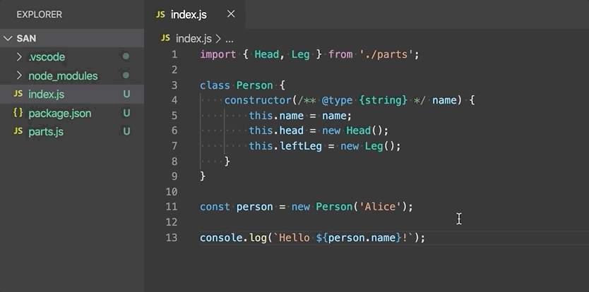

+++
title = "Refactoring"
date = 2024-01-12T22:36:24+08:00
weight = 30
type = "docs"
description = ""
isCJKLanguage = true
draft = false
+++

> 原文: [https://code.visualstudio.com/docs/typescript/typescript-refactoring](https://code.visualstudio.com/docs/typescript/typescript-refactoring)

# Refactoring TypeScript 重构 TypeScript


[Source code refactoring](https://en.wikipedia.org/wiki/Code_refactoring) can improve the quality and maintainability of your project by restructuring your code while not modifying the runtime behavior. Visual Studio Code supports refactoring operations (refactorings) such as [Extract Method](https://refactoring.com/catalog/extractMethod.html) and [Extract Variable](https://refactoring.com/catalog/extractVariable.html) to improve your code base from within your editor.

​​	源代码重构可以通过在不修改运行时行为的情况下重构代码来提高项目的质量和可维护性。Visual Studio Code 支持重构操作（重构），例如提取方法和提取变量，以便从编辑器中改进代码库。

Visual Studio Code has built-in support for TypeScript refactoring through the [TypeScript](https://www.typescriptlang.org/) language service and in this topic we'll demonstrate refactoring support with the TypeScript language service.

​​	Visual Studio Code 通过 TypeScript 语言服务内置支持 TypeScript 重构，在本主题中，我们将演示使用 TypeScript 语言服务进行重构支持。

## [Rename 重命名](https://code.visualstudio.com/docs/typescript/typescript-refactoring#_rename)

One of the simplest refactorings is to rename a method or variable. Press F2 to rename the symbol under the cursor across your TypeScript project:

​​	最简单的重构之一是重命名方法或变量。按 F2 在 TypeScript 项目中重命名光标下的符号：


## [Refactoring 重构](https://code.visualstudio.com/docs/typescript/typescript-refactoring#_refactoring)

To see the available TypeScript refactorings, put your cursor on a region of your source code and either right-click to bring up the editor context menu and select **Refactor** or press Ctrl+Shift+R directly.

​​	若要查看可用的 TypeScript 重构，请将光标放在源代码区域，然后右键单击以打开编辑器上下文菜单并选择“重构”，或直接按 Ctrl+Shift+R。


See [Refactorings](https://code.visualstudio.com/docs/editor/refactoring) for more information about refactorings and how you can configure keyboard shortcuts for individual refactorings.

​​	有关重构的更多信息以及如何为各个重构配置键盘快捷方式，请参阅重构。

Available TypeScript refactorings include:

​​	可用的 TypeScript 重构包括：

- **Extract to method or function** - Extract the selected statements or expressions to either a new method or a new function in the file.

  ​​	提取到方法或函数 - 将选定的语句或表达式提取到文件中的新方法或新函数。

  

  After selecting the **Extract to method** or **Extract to function** refactoring, enter the name of the extracted method/function.

  ​​	选择提取到方法或提取到函数重构后，输入提取的方法/函数的名称。

- **Extract to constant** - Extract the selected expression to a new constant in the file.

  ​​	提取到常量 - 将选定的表达式提取到文件中一个新的常量中。

  

- **Extract type to interface or type alias** - Extract the selected complex type to either an interface or a type alias.

  ​​	将类型提取到接口或类型别名 - 将选定的复杂类型提取到接口或类型别名中。

  

- **Move to new file** - Move one or more classes, functions, constants, or interfaces in the top-level scope of the file to a new file. The new file's name is inferred from the selected symbol's name.

  ​​	移至新文件 - 将一个或多个类、函数、常量或接口从文件的顶级作用域移至新文件。新文件的名称根据所选符号的名称推断。

  

- **Convert between named imports and namespace imports** - Convert between named imports (`import { Name } from './foo'`) and namespace imports (`import * as foo from './foo'`).

  ​​	在命名导入和命名空间导入之间转换 - 在命名导入 ( `import { Name } from './foo'` ) 和命名空间导入 ( `import * as foo from './foo'` ) 之间转换。

  

- **Convert between default export and named export** - Convert from using a `export default` and having a named export (`export const Foo = ...`).

  ​​	在默认导出和命名导出之间转换 - 从使用 `export default` 并具有命名导出 ( `export const Foo = ...` ) 转换。

- **Convert parameters to destructured object** - Rewrite a function that takes a long list of arguments to take a single arguments object.

  ​​	将参数转换为解构对象 - 重写一个函数，该函数采用一个长参数列表来采用一个单一参数对象。

- **Generate get and set accessors** - Encapsulate a selected class property by generating a getter and setter for it.

  ​​	生成 get 和 set 访问器 - 通过为选定的类属性生成 getter 和 setter 来封装它。

  

- **Infer function return types** - Adds explicit return type annotations to functions.

  ​​	推断函数返回类型 - 为函数添加显式返回类型注释。

  

- **Add/remove braces from arrow function** - Converts single line arrow function to multiline and back.

  ​​	在箭头函数中添加/删除大括号 - 将单行箭头函数转换为多行，反之亦然。

## [Quick Fixes 快速修复](https://code.visualstudio.com/docs/typescript/typescript-refactoring#_quick-fixes)

Quick Fixes are suggested edits that address simple coding errors. Example Quick Fixes include:

​​	快速修复是建议的编辑，可解决简单的编码错误。快速修复示例包括：

- Adding a missing `this` to a member access.
  向成员访问添加一个缺失的 `this` 。
- Fixing a misspelled property name.
  修复拼写错误的属性名称。
- Removing unreachable code or unused imports
  删除无法访问的代码或未使用的导入
- Declaring
  声明

When you move your cursor on to a TypeScript error, VS Code shows a light bulb that indicates that Quick Fixes are available. Click the light bulb or press Ctrl+. to show a list of available Quick Fixes and [refactorings](https://code.visualstudio.com/docs/typescript/typescript-refactoring#_refactoring).

​​	将光标移到 TypeScript 错误上时，VS Code 会显示一个指示灯泡，表示可以使用快速修复。单击灯泡或按 Ctrl+. 以显示可用快速修复和重构的列表。

Additionally, **Code Action Widget: Include Nearby Quick Fixes** (`editor.codeActionWidget.includeNearbyQuickFixes`) is a setting that is enabled on default, which will activate the nearest Quick Fix in a line from Ctrl+. (command ID `editor.action.quickFix`), no matter where your cursor is in that line.

​​	此外，代码操作小部件：包含附近的快速修复（ `editor.codeActionWidget.includeNearbyQuickFixes` ）是一项默认启用的设置，它将激活 Ctrl+.（命令 ID `editor.action.quickFix` ）所在行中最近的快速修复，无论光标在该行中的什么位置。

The command highlights the source code that will be refactored or fixed with Quick Fixes. Normal Code Actions and non-fix refactorings can still be activated at the cursor location.

​​	该命令突出显示将通过快速修复重构或修复的源代码。仍然可以在光标位置激活常规代码操作和非修复重构。

## [Unused variables and unreachable code 未使用的变量和不可达代码](https://code.visualstudio.com/docs/typescript/typescript-refactoring#_unused-variables-and-unreachable-code)

Unused TypeScript code, such as the `else` block of an `if` statement that is always true or an unreferenced import, is faded out in the editor:

​​	未使用的 TypeScript 代码（例如始终为 true 的 `else` 语句块或未引用的导入）在编辑器中会显示为淡出状态：


You can quickly remove this unused code by placing the cursor on it and triggering the Quick Fix command (Ctrl+.) or clicking on the light bulb.

​​	您可以将光标放在此类未使用的代码上并触发快速修复命令 (Ctrl+.) 或单击灯泡，以便快速将其删除。

To disable fading out of unused code, set `"editor.showUnused"` to `false`. You can also disable fading of unused code only in TypeScript by setting:

​​	若要禁用未使用的代码的淡出效果，请将 `"editor.showUnused"` 设置为 `false` 。您还可以仅通过设置禁用 TypeScript 中未使用的代码的淡出效果：

```
"[typescript]": {
    "editor.showUnused":  false
},
"[typescriptreact]": {
    "editor.showUnused":  false
},
```

## [Organize Imports 整理导入](https://code.visualstudio.com/docs/typescript/typescript-refactoring#_organize-imports)

The **Organize Imports** source code action sorts the imports in a TypeScript file and removes unused imports:

​​	“整理导入”源代码操作会对 TypeScript 文件中的导入进行排序，并删除未使用的导入：

<video src="https://code.visualstudio.com/assets/docs/typescript/refactoring/organize-imports.mp4" placeholder="/assets/docs/typescript/refactoring/organize-imports-placeholder.png" autoplay="" loop="" controls="" muted="" data-immersive-translate-walked="80e06e65-8665-48b3-952b-f193db002826" data-immersive-translate-paragraph="1" style="box-sizing: border-box; font-family: &quot;Segoe UI&quot;, &quot;Helvetica Neue&quot;, Helvetica, Arial, sans-serif; display: inline-block; vertical-align: baseline; margin-top: 1.5rem; margin-bottom: 2.5rem; width: 616.662px; max-width: 100%; color: rgb(36, 36, 36); font-size: 16px; font-style: normal; font-variant-ligatures: normal; font-variant-caps: normal; font-weight: 400; letter-spacing: normal; orphans: 2; text-align: start; text-indent: 0px; text-transform: none; widows: 2; word-spacing: 0px; -webkit-text-stroke-width: 0px; white-space: normal; background-color: rgb(255, 255, 255); text-decoration-thickness: initial; text-decoration-style: initial; text-decoration-color: initial;"></video>


You can run **Organize Imports** from the **Source Action** context menu or with the Shift+Alt+O keyboard shortcut.

​​	您可以从“源操作”上下文菜单或使用 Shift+Alt+O 键盘快捷方式运行“整理导入”。

Organize imports can also be done automatically when you save a TypeScript file by setting:

​​	您还可以在保存 TypeScript 文件时自动执行整理导入操作，方法是设置：

```
"editor.codeActionsOnSave": {
    "source.organizeImports": "explicit"
}
```

## [Update imports on file move 在移动文件时更新导入](https://code.visualstudio.com/docs/typescript/typescript-refactoring#_update-imports-on-file-move)

When you move or rename a file that is imported by other files in your TypeScript project, VS Code can automatically update all import paths that reference the moved file.

​​	当您移动或重命名 TypeScript 项目中其他文件导入的文件时，VS Code 可以自动更新所有引用已移动文件的导入路径。

The `typescript.updateImportsOnFileMove.enabled` setting controls this behavior. Valid settings values are:

​​	设置 `typescript.updateImportsOnFileMove.enabled` 控制此行为。有效的设置值是：

- `"prompt"` - The default. Asks if paths should be updated for each file move.
  `"prompt"` - 默认值。询问是否应为每个文件移动更新路径。
- `"always"` - Always automatically update paths.
  `"always"` - 始终自动更新路径。
- `"never"` - Do not update paths automatically and do not prompt.
  `"never"` - 不要自动更新路径，也不要提示。

## [Code Actions on Save 保存时的代码操作](https://code.visualstudio.com/docs/typescript/typescript-refactoring#_code-actions-on-save)

The `editor.codeActionsOnSave` setting lets you configure a set of Code Actions that are run when a file is saved. For example, you can enable Organize Imports on save by setting:

​​	设置 `editor.codeActionsOnSave` 允许您配置一组在保存文件时运行的代码操作。例如，您可以通过设置启用保存时的整理导入：

```
// On explicit save, run fixAll source action. On auto save (window or focus change), run organizeImports source action.
"editor.codeActionsOnSave": {
    "source.fixAll": "explicit",
    "source.organizeImports": "always",
}
```

As of today, the following enums are supported:

​​	截至今日，支持以下枚举：

- `explicit` (default): Triggers Code Actions when explicitly saved. Same as `true`.
  `explicit` （默认）：在显式保存时触发代码操作。与 `true` 相同。
- `always`: Triggers Code Actions when explicitly saved and on Auto Saves from window or focus changes.
  `always` ：在显式保存时和从窗口或焦点更改自动保存时触发代码操作。
- `never`: Never triggers Code Actions on save. Same as `false`.
  `never` ：保存时绝不触发代码操作。与 `false` 相同。

You can also set `editor.codeActionsOnSave` to an array of Code Actions to execute in order.

​​	您还可以将 `editor.codeActionsOnSave` 设置为按顺序执行的代码操作数组。

Here are some source actions:

​​	以下是一些源操作：

- `"organizeImports"` - Enables organize imports on save.
  `"organizeImports"` - 启用保存时整理导入。
- `"fixAll"` - Auto Fix on Save computes all possible fixes in one round (for all providers including ESLint).
  `"fixAll"` - 保存时自动修复计算一轮中所有可能的修复（适用于包括 ESLint 在内的所有提供程序）。
- `"fixAll.eslint"` - Auto Fix only for ESLint.
  `"fixAll.eslint"` - 仅对 ESLint 自动修复。
- `"addMissingImports"` - Adds all missing imports on save.
  `"addMissingImports"` - 保存时添加所有缺失的导入。

See [TypeScript](https://code.visualstudio.com/docs/typescript/typescript-tutorial) for more information.

​​	有关详细信息，请参阅 TypeScript。

## [Code suggestions 代码建议](https://code.visualstudio.com/docs/typescript/typescript-refactoring#_code-suggestions)

VS Code automatically suggests some common code simplifications such as converting a chain of `.then` calls on a promise to use `async` and `await`

​​	VS Code 会自动建议一些常见的代码简化，例如将对 Promise 的 `.then` 调用链转换为使用 `async` 和 `await`

<video src="https://code.visualstudio.com/assets/docs/typescript/refactoring/code-suggestions-convert-async.mp4" placeholder="/assets/docs/typescript/refactoring/code-suggestions-convert-async-placeholder.png" autoplay="" loop="" controls="" muted="" data-immersive-translate-walked="80e06e65-8665-48b3-952b-f193db002826" data-immersive-translate-paragraph="1" style="box-sizing: border-box; font-family: &quot;Segoe UI&quot;, &quot;Helvetica Neue&quot;, Helvetica, Arial, sans-serif; display: inline-block; vertical-align: baseline; margin-top: 1.5rem; margin-bottom: 2.5rem; width: 616.662px; max-width: 100%; color: rgb(36, 36, 36); font-size: 16px; font-style: normal; font-variant-ligatures: normal; font-variant-caps: normal; font-weight: 400; letter-spacing: normal; orphans: 2; text-align: start; text-indent: 0px; text-transform: none; widows: 2; word-spacing: 0px; -webkit-text-stroke-width: 0px; white-space: normal; background-color: rgb(255, 255, 255); text-decoration-thickness: initial; text-decoration-style: initial; text-decoration-color: initial;"></video>


Set `"typescript.suggestionActions.enabled"` to `false` to disable suggestions.

​​	将 `"typescript.suggestionActions.enabled"` 设置为 `false` 以禁用建议。

## [Next steps 后续步骤](https://code.visualstudio.com/docs/typescript/typescript-refactoring#_next-steps)

Read on to find out about:

​​	继续阅读以了解：

- [Editing TypeScript](https://code.visualstudio.com/docs/typescript/typescript-editing) - Learn about VS Code editing features for TypeScript.
  编辑 TypeScript - 了解 VS Code 的 TypeScript 编辑功能。
- [Debugging TypeScript](https://code.visualstudio.com/docs/typescript/typescript-debugging) - Configure the debugger for your TypeScript project.
  调试 TypeScript - 为 TypeScript 项目配置调试器。
