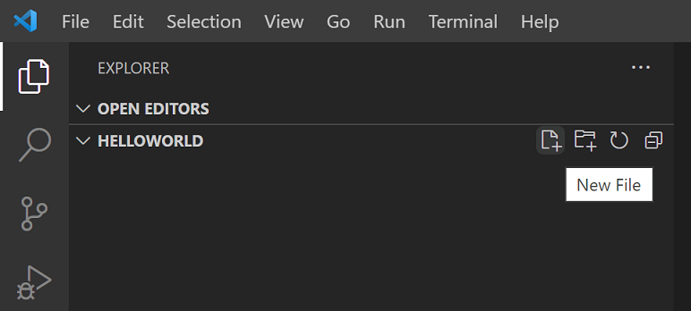

+++
title = "Tutorial"
date = 2024-01-12T22:36:24+08:00
weight = 1
type = "docs"
description = ""
isCJKLanguage = true
draft = false
+++

> 原文: [https://code.visualstudio.com/docs/typescript/typescript-tutorial](https://code.visualstudio.com/docs/typescript/typescript-tutorial)

# TypeScript tutorial in Visual Studio Code Visual Studio Code 中的 TypeScript 教程


[TypeScript](https://www.typescriptlang.org/) is a typed superset of JavaScript that compiles to plain JavaScript. It offers classes, modules, and interfaces to help you build robust components.

​​	TypeScript 是 JavaScript 的一个类型化超集，可编译成普通的 JavaScript。它提供类、模块和接口来帮助您构建健壮的组件。

## [Install the TypeScript compiler 安装 TypeScript 编译器]()

Visual Studio Code includes TypeScript language support but does not include the TypeScript compiler, `tsc`. You will need to install the TypeScript compiler either globally or in your workspace to transpile TypeScript source code to JavaScript (`tsc HelloWorld.ts`).

​​	Visual Studio Code 包括 TypeScript 语言支持，但不包括 TypeScript 编译器， `tsc` 。您需要在全局或工作区中安装 TypeScript 编译器，才能将 TypeScript 源代码转译成 JavaScript（ `tsc HelloWorld.ts` ）。

The easiest way to install TypeScript is through npm, the [Node.js Package Manager](https://www.npmjs.com/). If you have npm installed, you can install TypeScript globally (`-g`) on your computer by:

​​	安装 TypeScript 的最简单方法是通过 npm，即 Node.js 包管理器。如果您已安装 npm，则可以通过以下方式在计算机上全局安装 TypeScript（ `-g` ）：

```
npm install -g typescript
```

You can test your install by checking the version.

​​	您可以通过检查版本来测试您的安装。

```
tsc --version
```

## [Hello World]()

Let's start with a simple Hello World Node.js example. Create a new folder `HelloWorld` and launch VS Code.

​​	我们从一个简单的 Hello World Node.js 示例开始。创建一个新文件夹 `HelloWorld` 并启动 VS Code。

```
mkdir HelloWorld
cd HelloWorld
code .
```

From the File Explorer, create a new file called `helloworld.ts`.

​​	在文件资源管理器中，创建一个名为 `helloworld.ts` 的新文件。



Now add the following TypeScript code. You'll notice the TypeScript keyword `let` and the `string` type declaration.

​​	现在添加以下 TypeScript 代码。您会注意到 TypeScript 关键字 `let` 和 `string` 类型声明。

```
let message: string = 'Hello World';
console.log(message);
```

To compile your TypeScript code, you can open the [Integrated Terminal]() (Ctrl+`) and type `tsc helloworld.ts`. This will compile and create a new `helloworld.js` JavaScript file.

​​	要编译 TypeScript 代码，您可以打开集成终端 (Ctrl+`) 并键入 `tsc helloworld.ts` 。这将编译并创建一个新的 `helloworld.js` JavaScript 文件。


If you have Node.js installed, you can run `node helloworld.js`.

​​	如果您已安装 Node.js，则可以运行 `node helloworld.js` 。


If you open `helloworld.js`, you'll see that it doesn't look very different from `helloworld.ts`. The type information has been removed and `let` is now `var`.

​​	如果打开 `helloworld.js` ，您会发现它与 `helloworld.ts` 看起来没什么不同。类型信息已被删除， `let` 现在是 `var` 。

```
var message = 'Hello World';
console.log(message);
```

## [IntelliSense]()

In VS Code, you can see that you get language features such as syntax highlighting and bracket matching. When you were typing in the editor, you may have noticed IntelliSense, the smart code completions and suggestions provided by VS Code and the TypeScript language server. Below you can see the methods of `console`

​​	在 VS Code 中，您会看到您获得了语言功能，例如语法突出显示和括号匹配。在编辑器中键入时，您可能注意到了 IntelliSense，这是 VS Code 和 TypeScript 语言服务器提供的智能代码补全和建议。您可以在下面看到 `console` 的方法


When you select a method, you then get parameter help and can always get hover information.

​​	当您选择一个方法时，您会获得参数帮助，并且始终可以获得悬停信息。


## [tsconfig.json]()

So far in this tutorial, you have been relying on the TypeScript compiler's default behavior to compile your TypeScript source code. You can modify the TypeScript compiler options by adding a `tsconfig.json` file that defines the TypeScript [project settings](https://www.typescriptlang.org/docs/handbook/tsconfig-json.html) such as the [compiler options](https://www.typescriptlang.org/docs/handbook/compiler-options.html) and the files that should be included.

​​	到目前为止，在本教程中，您一直依赖 TypeScript 编译器的默认行为来编译 TypeScript 源代码。您可以通过添加 `tsconfig.json` 文件来修改 TypeScript 编译器选项，该文件定义了 TypeScript 项目设置，例如编译器选项和应包含的文件。

**Important**: To use `tsconfig.json` for the rest of this tutorial, invoke `tsc` without input files. The TypeScript compiler knows to look at your `tsconfig.json` for project settings and compiler options.

​​	重要提示：要在本教程的其余部分使用 `tsconfig.json` ，请在没有输入文件的情况下调用 `tsc` 。TypeScript 编译器知道查看您的 `tsconfig.json` 以获取项目设置和编译器选项。

Add a simple `tsconfig.json` that set the options to compile to ES5 and use **CommonJS** [modules](https://wiki.commonjs.org/wiki/Modules/1.0).

​​	添加一个简单的 `tsconfig.json` ，将选项设置为编译为 ES5 并使用 CommonJS 模块。

```
{
  "compilerOptions": {
    "target": "ES5",
    "module": "CommonJS"
  }
}
```

When editing `tsconfig.json`, IntelliSense (Ctrl+Space) will help you along the way.

​​	编辑 `tsconfig.json` 时，IntelliSense (Ctrl+Space) 将在过程中为您提供帮助。


By default, TypeScript includes all the `.ts` files in the current folder and subfolders if the `files` attribute isn't included, so we don't need to list `helloworld.ts` explicitly.

​​	默认情况下，如果未包含 `files` 属性，TypeScript 会包含当前文件夹和子文件夹中的所有 `.ts` 文件，因此我们无需显式列出 `helloworld.ts` 。

### [Change the build output 更改生成输出]()

Having the generated JavaScript file in the same folder as the TypeScript source will quickly get cluttered on larger projects, so you can specify the output directory for the compiler with the `outDir` attribute.

​​	将生成的 JavaScript 文件与 TypeScript 源文件放在同一个文件夹中，在较大的项目中会很快变得杂乱，因此您可以使用 `outDir` 属性为编译器指定输出目录。

```
{
  "compilerOptions": {
    "target": "ES5",
    "module": "CommonJS",
    "outDir": "out"
  }
}
```

Delete `helloworld.js` and run the command `tsc` with no options. You will see that `helloworld.js` is now placed in the `out` directory.

​​	删除 `helloworld.js` 并运行没有任何选项的命令 `tsc` 。您将看到 `helloworld.js` 现在位于 `out` 目录中。

See [Compiling TypeScript]() to learn about other features of the TypeScript language service and how to use tasks to run your builds directly from VS Code.

​​	请参阅编译 TypeScript 以了解 TypeScript 语言服务的其他功能以及如何使用任务直接从 VS Code 运行生成。

## [Error checking 错误检查]()

TypeScript helps you avoid common programming mistakes through strong type checking. For example, if you assign a number to `message`, the TypeScript compiler will complain with **'error TS2322: Type '2' is not assignable to type 'string'**. You can see type checking errors in VS Code both in the editor (red squiggles with hover information) and the Problems panel (Ctrl+Shift+M). The `[ts]` prefix lets you know this error is coming from the TypeScript language service.

​​	TypeScript 通过强类型检查帮助您避免常见的编程错误。例如，如果您将数字分配给 `message` ，TypeScript 编译器会抱怨“错误 TS2322：类型“2”不能分配给类型“字符串”。您可以在 VS Code 中的编辑器（带有悬停信息的红色波浪线）和“问题”面板（Ctrl+Shift+M）中看到类型检查错误。 `[ts]` 前缀让您知道此错误来自 TypeScript 语言服务。


## [Quick Fixes 快速修复]()

The TypeScript language service has a powerful set of diagnostics to find common coding issues. For example, it can analyze your source code and detect unreachable code which is displayed as dimmed in the editor. If you hover over the line of source code, you'll see a hover explaining and if you place your cursor on the line, you'll get a Quick Fix light bulb.

​​	TypeScript 语言服务有一套强大的诊断功能，可查找常见的编码问题。例如，它可以分析您的源代码并检测到无法访问的代码，这些代码在编辑器中显示为灰显。如果您将鼠标悬停在源代码行上，您将看到一个解释性悬停，如果您将光标放在该行上，您将获得一个快速修复灯泡。


Clicking on the light bulb or pressing Ctrl+. brings up the Quick Fix menu where you can select the **Remove unreachable code** fix.

​​	单击灯泡或按 Ctrl+. 会弹出一个快速修复菜单，您可以在其中选择“删除无法访问的代码”修复。

Additionally, **Code Action Widget: Include Nearby Quick Fixes** (`editor.codeActionWidget.includeNearbyQuickFixes`) is a setting that is enabled on default, which will activate the nearest Quick Fix in a line from Ctrl+. (command ID `editor.action.quickFix`), no matter where your cursor is in that line.

​​	此外，代码操作小部件：包含附近的快速修复（ `editor.codeActionWidget.includeNearbyQuickFixes` ）是一项默认启用的设置，它将激活 Ctrl+.（命令 ID `editor.action.quickFix` ）所在行中最近的快速修复，无论光标在该行中的什么位置。

The command highlights the source code that will be refactored or fixed with Quick Fixes. Normal Code Actions and non-fix refactorings can still be activated at the cursor location.

​​	该命令突出显示将通过快速修复重构或修复的源代码。仍然可以在光标位置激活常规代码操作和非修复重构。

## [Debugging 调试]()

VS Code has built-in support for TypeScript debugging. To support debugging TypeScript in combination with the executing JavaScript code, VS Code relies on [source maps](https://firefox-source-docs.mozilla.org/devtools-user/debugger/how_to/use_a_source_map/index.html) for the debugger to map between the original TypeScript source code and the running JavaScript. You can create source maps during the build by setting `"sourceMap": true` in your `tsconfig.json`.

​​	VS Code 内置了对 TypeScript 调试的支持。为了支持将 TypeScript 调试与正在执行的 JavaScript 代码结合起来，VS Code 依靠源映射，以便调试器在原始 TypeScript 源代码和正在运行的 JavaScript 之间进行映射。您可以在构建期间通过在 `tsconfig.json` 中设置 `"sourceMap": true` 来创建源映射。

```
{
  "compilerOptions": {
    "target": "ES5",
    "module": "CommonJS",
    "outDir": "out",
    "sourceMap": true
  }
}
```

Rebuild by running `tsc` and you should now have a `helloworld.js.map` in the `out` directory next to `helloworld.js`.

​​	通过运行 `tsc` 重新构建，您现在应该在 `out` 目录中拥有一个 `helloworld.js.map` ，该目录位于 `helloworld.js` 旁边。

With `helloworld.ts` open in the editor, press F5. If you have other debugger extensions installed, you need to select **Node.js** from the dropdown.

​​	在编辑器中打开 `helloworld.ts` 后，按 F5。如果您安装了其他调试器扩展，则需要从下拉列表中选择 Node.js。

The debugger will start a session, run your code, and display the "Hello World" message in the Debug console panel.

​​	调试器将启动一个会话，运行您的代码，并在“调试”控制台面板中显示“Hello World”消息。


In `helloworld.ts`, set a breakpoint by clicking on the left gutter of the editor. You will see a red circle if the breakpoint is set. Press F5 again. Execution will stop when the breakpoint is hit and you'll be able to see debugging information such as variable values and the call stack in the **Run and Debug** view (Ctrl+Shift+D).

​​	在 `helloworld.ts` 中，通过单击编辑器的左侧边距来设置断点。如果设置了断点，您将看到一个红色圆圈。再次按 F5。当命中断点时，执行将停止，您将能够在“运行和调试”视图（Ctrl+Shift+D）中看到调试信息，例如变量值和调用堆栈。


See [Debugging TypeScript]() to learn more about VS Code's built-in debugging support for TypeScript and how you can configure the debugger for your project scenarios.

​​	请参阅调试 TypeScript 以详细了解 VS Code 对 TypeScript 的内置调试支持以及如何为项目方案配置调试器。

## [Next steps 后续步骤]()

This tutorial was a quick introduction to using VS Code for TypeScript development. Read on to learn more about using VS Code's compiling and debugging support for TypeScript:

​​	本教程快速介绍了如何将 VS Code 用于 TypeScript 开发。继续阅读以详细了解如何使用 VS Code 的编译和调试支持来处理 TypeScript：

- [Compiling TypeScript]() - Use VS Code's powerful task system for compiling TypeScript.
  编译 TypeScript - 使用 VS Code 功能强大的任务系统来编译 TypeScript。
- [Editing TypeScript]() - Specific editing features for TypeScript.
  编辑 TypeScript - 针对 TypeScript 的特定编辑功能。
- [Refactoring TypeScript]() - Useful refactorings from the TypeScript language service.
  重构 TypeScript - TypeScript 语言服务提供有用的重构。
- [Debugging TypeScript]() - Configure the debugger for your TypeScript project.
  调试 TypeScript - 为 TypeScript 项目配置调试器。

## [Common questions 常见问题]()

### [Cannot launch program because corresponding JavaScript cannot be found 无法启动程序，因为找不到相应的 JavaScript]()

You've likely not set `"sourceMap": true` in your `tsconfig.json` and the VS Code Node.js debugger can't map your TypeScript source code to the running JavaScript. Turn on source maps and rebuild your project.

​​	您可能尚未在 `"sourceMap": true` 中设置 `tsconfig.json` ，VS Code Node.js 调试器无法将 TypeScript 源代码映射到正在运行的 JavaScript。打开源映射并重新生成项目。
