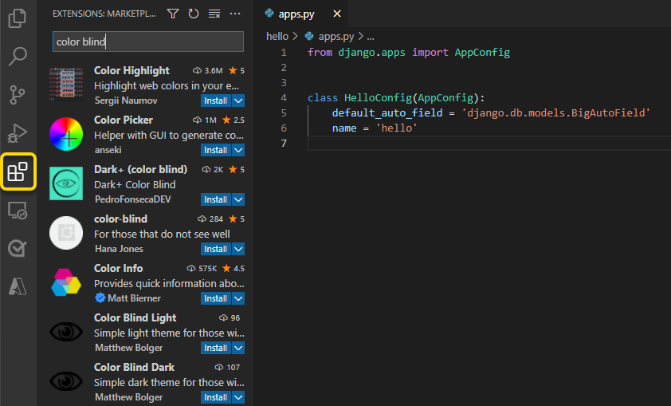
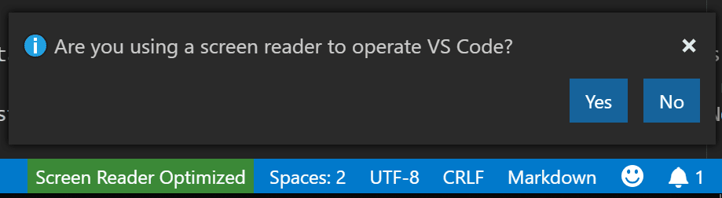

+++
title = "Accessibility"
date = 2024-01-12T22:36:24+08:00
weight = 160
type = "docs"
description = ""
isCJKLanguage = true
draft = false
+++

> 原文: [https://code.visualstudio.com/docs/editor/accessibility](https://code.visualstudio.com/docs/editor/accessibility)

# Accessibility 辅助功能


Visual Studio Code has many features to help make the editor accessible to all users. Zoom levels and High Contrast colors improve editor visibility, keyboard-only navigation supports use without a mouse, and the editor is optimized for screen readers.

​​	Visual Studio Code 具有许多功能，可帮助使编辑器对所有用户都可访问。缩放级别和高对比度颜色可提高编辑器可见性，仅键盘导航支持不使用鼠标，并且编辑器针对屏幕阅读器进行了优化。

## [Zoom 缩放](https://code.visualstudio.com/docs/editor/accessibility#_zoom)

You can adjust the zoom level in VS Code with the **View** > **Appearance** > **Zoom** commands. Each **Zoom** command increases or decreases the zoom level by 20 percent.

​​	您可以使用“视图”>“外观”>“缩放”命令调整 VS Code 中的缩放级别。每个“缩放”命令都会将缩放级别增加或减少 20%。

- **View** > **Appearance** > **Zoom In** (Ctrl+=) - increase the zoom level.
  “视图”>“外观”>“放大”（Ctrl+=） - 增加缩放级别。
- **View** > **Appearance** > **Zoom Out** (Ctrl+-) - decrease the zoom level.
  “视图”>“外观”>“缩小”（Ctrl+-） - 减少缩放级别。
- **View** > **Appearance** > **Reset Zoom** (Ctrl+Numpad0) - reset the zoom level to 0.
  “视图”>“外观”>“重置缩放”（Ctrl+Numpad0） - 将缩放级别重置为 0。

> **Note**: If you are using a magnifier, hold down the Alt key while viewing the hover to move the cursor over the hover.
>
> ​​	注意：如果您使用的是放大镜，请在查看悬停时按住 Alt 键以将光标移到悬停上。


### [Persisted zoom level 持久缩放级别](https://code.visualstudio.com/docs/editor/accessibility#_persisted-zoom-level)

When you adjust the zoom level with the **View** > **Zoom In / Out** commands, the zoom level is persisted in the `window.zoomLevel` [setting](https://code.visualstudio.com/docs/getstarted/settings). The default value is 0 and each increment/decrement changes the zoom level by 20 percent.

​​	当您使用“视图”>“放大/缩小”命令调整缩放级别时，缩放级别会保存在 `window.zoomLevel` 设置中。默认值为 0，每次增量/减量都会将缩放级别更改 20%。

## [High Contrast theme 高对比度主题](https://code.visualstudio.com/docs/editor/accessibility#_high-contrast-theme)

VS Code supports a High Contrast color theme on all platforms. Use **File** > **Preferences** > **Theme** > **Color Theme** (Ctrl+K Ctrl+T) to display the **Select Color Theme** dropdown and select the **High Contrast** theme.

​​	VS Code 在所有平台上支持高对比度颜色主题。使用文件 > 首选项 > 主题 > 颜色主题 (Ctrl+K Ctrl+T) 显示“选择颜色主题”下拉列表并选择“高对比度”主题。


## [Color vision accessibility 色觉可访问性](https://code.visualstudio.com/docs/editor/accessibility#_color-vision-accessibility)

You can search for extensions in **Visual Studio Marketplace** that are compatible with color vision deficiency. Use the Extensions view Ctrl+Shift+X and search for "color blind" to populate relevant options.

​​	您可以在 Visual Studio Marketplace 中搜索与色觉缺陷兼容的扩展。使用扩展视图 Ctrl+Shift+X 并搜索“色盲”以填充相关选项。



Once you have installed a color theme from the Marketplace, you can change the [color theme](https://code.visualstudio.com/docs/getstarted/themes) with **File** > **Preferences** > **Theme** > **Color Theme** Ctrl+K Ctrl+T.

​​	从 Marketplace 安装颜色主题后，您可以使用文件 > 首选项 > 主题 > 颜色主题 Ctrl+K Ctrl+T 更改颜色主题。


### [Recommended themes for color vision accessibility 推荐用于色觉可访问性的主题](https://code.visualstudio.com/docs/editor/accessibility#_recommended-themes-for-color-vision-accessibility)

- [GitHub](https://marketplace.visualstudio.com/items?itemName=GitHub.github-vscode-theme) - Accessible to most forms of color blindness and matches the themes in GitHub's settings.
  GitHub - 适用于大多数形式的色盲，并与 GitHub 设置中的主题匹配。
- [Gotthard](https://marketplace.visualstudio.com/items?itemName=janbiasi.gotthard-theme) - Optimized for approximately 20 programming languages.
  Gotthard - 针对大约 20 种编程语言进行了优化。
- [Blinds](https://marketplace.visualstudio.com/items?itemName=tankashing.blinds-theme) - Created for people with deuteranopia, featuring a high contrast color ratio.
  Blinds - 专为患有第二色盲的人创建，具有高对比度颜色比率。
- [Greative](https://marketplace.visualstudio.com/items?itemName=Greative.greative) - Considers both color blindness and light sensitivity.
  Greative - 同时考虑色盲和光敏性。
- [Pitaya Smoothie](https://marketplace.visualstudio.com/items?itemName=trallard.pitaya-smoothie) - Accessible to most forms of color blindness and compliant with [WCAG 2.1 criteria for color contrast](https://www.w3.org/TR/UNDERSTANDING-WCAG20/visual-audio-contrast-contrast.html).
  Pitaya Smoothie - 适用于大多数形式的色盲，并符合 WCAG 2.1 的颜色对比度标准。

## [Customizing warning colors 自定义警告颜色](https://code.visualstudio.com/docs/editor/accessibility#_customizing-warning-colors)

The default Color Theme for VS Code is **Dark+**. However, you can customize both the theme and property colors in the user interface.

​​	VS Code 的默认颜色主题为 Dark+。但是，您可以在用户界面中自定义主题和属性颜色。

> **Note**: Go to [Customizing a Color Theme](https://code.visualstudio.com/docs/getstarted/themes#_customizing-a-color-theme) for more information about overriding the colors in your current theme.
>
> ​​	注意：有关覆盖当前主题中的颜色的更多信息，请转到自定义颜色主题。

To customize the error and warning squiggles, go to **File** > **Preferences** > **Settings** for user settings. Search for "color customizations" to find the **Workbench: Color Customizations** setting, and open your user `settings.json` file by selecting **Edit in settings.json**.

​​	要自定义错误和警告波浪线，请转到文件 > 首选项 > 用户设置的设置。搜索“颜色自定义”以查找工作台：颜色自定义设置，然后通过选择在 settings.json 中编辑来打开您的用户 `settings.json` 文件。


In your `settings.json` file, nest the following code inside the outermost curly braces. You can assign a color to each object by entering a hex code.

​​	在您的 `settings.json` 文件中，将以下代码嵌套在外层大括号内。您可以通过输入十六进制代码为每个对象分配颜色。

```
"workbench.colorCustomizations": {
    "editorError.foreground": "#ffef0f",
    "editorWarning.foreground": "#3777ff"
}
```

In the following example, the warning color is applied when a comma is missing after a JSON item.

​​	在以下示例中，当 JSON 项后缺少逗号时，将应用警告颜色。


- `editorError.foreground` - Overrides the wavy line beneath an error.
  `editorError.foreground` - 覆盖错误下方的波浪线。
- `editorWarning.foreground` - Overrides the wavy line beneath a warning.
  `editorWarning.foreground` - 覆盖警告下方的波浪线。
- `editorError.background` - Overrides the highlight color of an error.
  `editorError.background` - 覆盖错误的高亮颜色。
- `editorWarning.background` - Overrides the highlight color of a warning.
  `editorWarning.background` - 覆盖警告的高亮颜色。

Assigning a color to the background of `editorError` and `editorWarning` also helps to identify potential issues. The color that you choose will highlight the respective error or warning. The colors shown in the preceding example, `#ffef0f` (yellow) and `#37777ff` (blue), are more accessible to individuals with common forms of color vision deficiencies.

​​	为 `editorError` 和 `editorWarning` 的背景分配颜色也有助于识别潜在问题。您选择的颜色将突出显示相应的错误或警告。在前面的示例中显示的颜色， `#ffef0f` （黄色）和 `#37777ff` （蓝色），对于具有常见形式色觉缺陷的人来说更容易识别。

### [Selecting accessible colors 选择可访问的颜色](https://code.visualstudio.com/docs/editor/accessibility#_selecting-accessible-colors)

The accessibility of colors is subjective to the type of anomalous trichromacy (color blindness). The level of severity ranges per person and can be divided into four condition types:

​​	颜色的可访问性取决于异常三色性（色盲）的类型。严重程度因人而异，可分为四种情况类型：

| Condition 情况        | Type 类型                                                    |
| :-------------------- | :----------------------------------------------------------- |
| Deuteranopia 红绿色盲 | Reduced sensitivity to green light. It is the most common form of color blindness. 对绿光的敏感性降低。这是最常见的一种色盲。 |
| Protanopia 红绿色盲   | Reduced sensitivity to red light. 对红光的敏感性降低。       |
| Tritanopia 蓝黄色盲   | Reduced sensitivity to blue light. This condition is considered rare. 对蓝光的敏感性降低。这种情况被认为是罕见的。 |
| Monochromia 单色症    | The inability to see all colors, also referred to as achromatopsia. More information about the rarest form of color blindness: [Foundation for Fighting Blindness](https://www.fightingblindness.org/diseases/achromatopsia). 无法看到所有颜色，也称为全色盲。有关最罕见的色盲形式的更多信息：防盲基金会。 |

One of the best approaches to selecting the best colors for a specific condition is to apply complementary colors. These are colors located opposite of one another on a color wheel.

​​	选择最适合特定情况的颜色的一种最佳方法是应用互补色。这些颜色位于色轮上彼此相对的位置。


> **Note**: For more information on finding complementary colors, access the color blind simulator and interactive color wheel at [Adobe Color](https://color.adobe.com/create/color-accessibility).
>
> ​​	注意：有关查找互补色的更多信息，请访问 Adobe Color 中的色盲模拟器和交互式色轮。

## [Dim unfocused editors and terminals 调暗未聚焦的编辑器和终端](https://code.visualstudio.com/docs/editor/accessibility#_dim-unfocused-editors-and-terminals)

Unfocused views can be dimmed to make it clearer where typed input will go. This is especially useful when working with multiple editor groups or terminals. Turn on this feature by setting `"accessibility.dimUnfocused.enabled": true`. You can control the dimness level with `accessibility.dimUnfocused.opacity`, which takes the opacity fraction from 0.2 to 1 (default 0.75).

​​	可以调暗未聚焦的视图，以便更清楚地了解键入的输入将转到何处。在使用多个编辑器组或终端时，此功能特别有用。通过设置 `"accessibility.dimUnfocused.enabled": true` 来启用此功能。您可以使用 `accessibility.dimUnfocused.opacity` 控制调暗级别，该级别将不透明度分数从 0.2 调整到 1（默认值为 0.75）。

## [Keyboard navigation 键盘导航](https://code.visualstudio.com/docs/editor/accessibility#_keyboard-navigation)

VS Code provides an exhaustive list of commands in the **Command Palette** (Ctrl+Shift+P) so that you can use VS Code without a mouse. Press Ctrl+Shift+P, then type a command name (for example 'git') to filter the list of commands.

​​	VS Code 在命令面板（Ctrl+Shift+P）中提供了详尽的命令列表，以便您无需鼠标即可使用 VS Code。按 Ctrl+Shift+P，然后键入命令名称（例如“git”）以筛选命令列表。

VS Code also has many preset keyboard shortcuts for commands.

​​	VS Code 还为命令提供了许多预设键盘快捷键。


You can also set your own keyboard shortcuts. **File** > **Preferences** > **Keyboard Shortcuts** (Ctrl+K Ctrl+S) opens the Keyboard Shortcuts editor, where you can discover and modify key bindings for VS Code actions. See [Key Bindings](https://code.visualstudio.com/docs/getstarted/keybindings) for more details on customizing or adding your own keyboard shortcuts.

​​	您还可以设置自己的键盘快捷键。文件 > 首选项 > 键盘快捷键 (Ctrl+K Ctrl+S) 将打开键盘快捷键编辑器，您可以在其中发现和修改 VS Code 操作的键绑定。有关自定义或添加您自己的键盘快捷键的更多详细信息，请参阅键绑定。

For quick navigation across the workbench, we recommend using **Focus Next Part** (F6) and **Focus Previous Part** (Shift+F6) commands.

​​	为了在工作台中快速导航，我们建议使用聚焦下一部分 (F6) 和聚焦上一部分 (Shift+F6) 命令。

### [Anchor selection 锚定选择](https://code.visualstudio.com/docs/editor/accessibility#_anchor-selection)

To make it easier to start and end selections with the keyboard, there are four commands: **Set Selection Anchor** (Ctrl+K Ctrl+B), **Select From Anchor to Cursor** (Ctrl+K Ctrl+K), **Cancel Selection Anchor** (Escape) and **Go to Selection Anchor**.

​​	为了更容易地使用键盘开始和结束选择，有四个命令：设置选择锚点 (Ctrl+K Ctrl+B)、从锚点选择到光标 (Ctrl+K Ctrl+K)、取消选择锚点 (Esc) 和转到选择锚点。

## [Tab navigation Tab 导航](https://code.visualstudio.com/docs/editor/accessibility#_tab-navigation)

You can use the Tab key to navigate between UI controls in VS Code. Use Shift+Tab to tab in reverse order. As you tab through the UI controls, an indicator will appear around each UI element when it has focus.

​​	您可以在 VS Code 中使用 Tab 键在 UI 控件之间导航。使用 Shift+Tab 以相反的顺序进行制表。在 UI 控件中使用 Tab 键时，当某个 UI 元素获得焦点时，该元素周围会出现一个指示符。

All elements in the workbench support tab navigation. To avoid having too many tab stops, workbench toolbars and tab lists each have only one. Once a toolbar or a tab list has focus, you can use the arrow keys to navigate within them.

​​	工作台中所有元素都支持 Tab 导航。为了避免出现太多制表位，工作台工具栏和选项卡列表各自只有一个。一旦工具栏或选项卡列表获得焦点，您就可以使用箭头键在其中导航。

> **Note**: Tab navigation goes in the visually natural order, with the exception of WebViews (like Markdown preview). For WebViews, we recommend using the F6 and Shift+F6 commands to navigate between the WebViews and the rest of the workbench. Alternatively, you can use one of many Focus Editor commands.
>
> ​​	注意：制表符导航遵循视觉自然顺序，Markdown 预览等 WebView 除外。对于 WebView，我们建议使用 F6 和 Shift+F6 命令在 WebView 与工作台的其余部分之间导航。或者，您可以使用许多聚焦编辑器命令之一。

## [Tab trapping 制表符捕获](https://code.visualstudio.com/docs/editor/accessibility#_tab-trapping)

By default, pressing Tab within a source code file inserts the Tab character (or spaces depending on your indentation setting) and does not leave the open file. You can toggle Tab trapping with Ctrl+M, and subsequent Tab keys will move focus out of the file. When default Tab trapping is off, you will see a **Tab moves focus** indicator in the Status Bar.

​​	默认情况下，在源代码文件中按 Tab 会插入 Tab 字符（或根据您的缩进设置插入空格），并且不会离开打开的文件。您可以使用 Ctrl+M 切换制表符捕获，后续的 Tab 键会将焦点移出文件。当默认制表符捕获关闭时，您会看到状态栏中的 Tab 移动焦点指示器。

Tab trapping also exists in the integrated terminal. The default behavior for the feature can be configured with `editor.tabFocusMode`.

​​	制表符捕获也存在于集成终端中。可以使用 `editor.tabFocusMode` 配置该功能的默认行为。


You can also toggle Tab trapping on and off from the **Command Palette** (Ctrl+Shift+P) with the **Toggle Tab Key Moves Focus** action.

​​	您还可以使用命令面板（Ctrl+Shift+P）中的“切换 Tab 键移动焦点”操作来打开和关闭制表符捕获。

Read-only files never trap the Tab key. The **Integrated Terminal** panel respects the Tab trapping mode and can be toggled with Ctrl+M.

​​	只读文件绝不会捕获 Tab 键。集成终端面板遵循制表符捕获模式，可以使用 Ctrl+M 进行切换。

## [Screen readers 屏幕阅读器](https://code.visualstudio.com/docs/editor/accessibility#_screen-readers)

VS Code supports screen readers in the editor using a strategy based on text pagination. The following screen readers have been tested:

​​	VS Code 在编辑器中支持屏幕阅读器，使用基于文本分页的策略。已测试以下屏幕阅读器：

- Windows: [NVDA](https://www.nvaccess.org/) and [JAWS](https://www.freedomscientific.com/products/software/jaws)
  Windows：NVDA 和 JAWS
- macOS: [VoiceOver](https://support.apple.com/guide/voiceover/welcome/mac)
  macOS：VoiceOver
- Linux: [Orca](https://help.gnome.org/users/orca/stable/introduction.html)
  Linux：Orca

> For NVDA, we recommend that you stay in focus mode and use the hotkeys to navigate, instead of using browse mode.
>
> ​​	对于 NVDA，我们建议您保持焦点模式并使用热键导航，而不是使用浏览模式。

The **Go to Next/Previous Error or Warning** actions (F8 and Shift+F8) allow screen readers to announce the error and warning messages.

​​	转到下一个/上一个错误或警告操作（F8 和 Shift+F8）允许屏幕阅读器播报错误和警告消息。

When suggestions pop up, they are announced to screen readers. Navigate the suggestions using Ctrl+Up and Ctrl+Down and dismiss them with Shift+Escape. If suggestions get in your way, you can turn them off with the `editor.quickSuggestions` setting.

​​	当建议弹出时，它们会向屏幕阅读器播报。使用 Ctrl+向上和 Ctrl+向下导航建议，并使用 Shift+Escape 退出建议。如果建议妨碍您，您可以使用 `editor.quickSuggestions` 设置将其关闭。

In the diff view pane, the **Go to Next/Previous Difference** actions (F7 and Shift+F7) will show the Accessible Diff Viewer with diffs presented in a unified patch format. Navigate through the unchanged, inserted, or deleted lines with Up and Down. Press Enter to return focus to the modified pane of the diff editor at the selected line number (or the closest line number that still exists, if a deleted line is selected). Use Escape or Shift+Escape to dismiss the Accessible Diff Viewer.

​​	在 diff 视图窗格中，转到下一个/上一个差异操作（F7 和 Shift+F7）将显示无障碍差异查看器，其中以统一的补丁格式显示差异。使用向上和向下键导航到未更改、已插入或已删除的行。按 Enter 键可将焦点返回到 diff 编辑器的已修改窗格，位于所选行号（或如果选择了已删除的行，则返回到仍然存在的最近行号）。使用 Escape 或 Shift+Escape 退出无障碍差异查看器。

## [Accessibility help 辅助功能帮助](https://code.visualstudio.com/docs/editor/accessibility#_accessibility-help)

The command **Open Accessibility Help** Alt+F1 opens a help menu based on the current context. It currently applies to the editor, terminal, notebook, chat view, and inline chat features.

​​	打开辅助功能帮助 Alt+F1 命令会根据当前上下文打开一个帮助菜单。它目前适用于编辑器、终端、笔记本、聊天视图和内联聊天功能。

You can dismiss the accessibility help menu or open additional documentation from within the help menu.

​​	您可以关闭辅助功能帮助菜单或从帮助菜单中打开其他文档。


## [Accessible View 无障碍视图](https://code.visualstudio.com/docs/editor/accessibility#_accessible-view)

Run the command **Open Accessible View** Alt+F2 to display an Accessible View to inspect content character by character, line by line. The Accessible View is currently available for hovers, notifications, Jupyter notebook output, and chat responses.

​​	运行打开无障碍视图 Alt+F2 命令以显示无障碍视图，逐个字符、逐行检查内容。无障碍视图目前可用于悬停、通知、Jupyter 笔记本输出和聊天回复。

## [Screen reader mode 屏幕阅读器模式](https://code.visualstudio.com/docs/editor/accessibility#_screen-reader-mode)

When VS Code detects that a screen reader is being used, it goes into an optimized screen reader mode for UI such as the editor and Integrated Terminal. The Status bar will display **Screen Reader Optimized** in the lower right. You can exit screen reader mode by clicking on the display text or using the **Toggle Screen Reader Accessibility Mode** command.

​​	当 VS Code 检测到正在使用屏幕阅读器时，它会进入优化的屏幕阅读器模式，适用于编辑器和集成终端等 UI。状态栏将在右下角显示屏幕阅读器已优化。您可以通过单击显示文本或使用切换屏幕阅读器辅助功能模式命令退出屏幕阅读器模式。



Some features, such as folding and minimap (code overview), are disabled when in screen reader mode. You can control whether VS Code uses screen reader mode with the **Editor: Accessibility Support** setting (`editor.accessibilitySupport`) and the values are `on`, `off`, or the default `auto` that automatically detects a screen reader through querying the platform.

​​	折叠和迷你地图（代码概览）等某些功能在屏幕阅读器模式下禁用。您可以通过编辑器：辅助功能支持设置（ `editor.accessibilitySupport` ）控制 VS Code 是否使用屏幕阅读器模式，其值可以是 `on` 、 `off` 或默认的 `auto` ，后者会通过查询平台自动检测屏幕阅读器。

## [Input control and result navigation 输入控件和结果导航](https://code.visualstudio.com/docs/editor/accessibility#_input-control-and-result-navigation)

Navigating between an input control (for example, search or filter input) and its results is consistent across the Extensions view, the Keyboard Shortcuts editor, and the Comments, Problems, and Debug Console panels using (Ctrl+Down) and (Ctrl+Up).

​​	在输入控件（例如，搜索或筛选输入）及其结果之间导航在扩展视图、键盘快捷方式编辑器以及注释、问题和调试控制台中使用 (Ctrl+向下) 和 (Ctrl+向上) 保持一致。

## [Terminal accessibility 终端辅助功能](https://code.visualstudio.com/docs/editor/accessibility#_terminal-accessibility)

You can display terminal accessibility help via Alt+F1, which describes useful tips when using a screen reader. One tip is to use Alt+F2 to access the buffer in the terminal. This will automatically enter the screen reader's browse mode, depending on your screen reader, for an accessible view of the entire terminal buffer.

​​	您可以通过 Alt+F1 显示终端辅助功能帮助，其中介绍了使用屏幕阅读器时的有用提示。一个提示是使用 Alt+F2 访问终端中的缓冲区。这会根据您的屏幕阅读器自动进入屏幕阅读器的浏览模式，以便以无障碍的方式查看整个终端缓冲区。

Use `editor.tabFocusMode` to control whether the terminal receives the Tab key instead of the workbench, similar to the editor.

​​	使用 `editor.tabFocusMode` 控制终端是否接收 Tab 键而不是工作台，类似于编辑器。

### [Shell integration 外壳集成](https://code.visualstudio.com/docs/editor/accessibility#_shell-integration)

The terminal has a feature called [shell integration](https://code.visualstudio.com/docs/terminal/shell-integration) that enables many additional features that are not found in other terminals. When using a screen reader, the [Run Recent Command](https://code.visualstudio.com/docs/terminal/shell-integration#_run-recent-command) and [Go to Recent Directory](https://code.visualstudio.com/docs/terminal/shell-integration#_go-to-recent-directory) features are particularly useful.

​​	终端有一个称为 shell 集成的功能，该功能启用了许多其他终端中找不到的其他功能。使用屏幕阅读器时，“运行最近的命令”和“转到最近的目录”功能特别有用。

Another shell integration powered command, **Go to Symbol in Accessible View** (Ctrl+Shift+O), lets you navigate between terminal commands similar to **Go to Symbol in Editor...** navigation in the editor.

​​	另一个由 shell 集成支持的命令“转到无障碍视图中的符号”(Ctrl+Shift+O) 允许您在终端命令之间导航，类似于编辑器中的“转到编辑器中的符号...”导航。

### [Minimum contrast ratio 最小对比度](https://code.visualstudio.com/docs/editor/accessibility#_minimum-contrast-ratio)

Set `terminal.integrated.minimumContrastRatio` to a number between 1 and 21 to adjust text color luminance until the desired contrast ratio is met or pure white (`#FFFFFF`) black (`#000000`) is hit.

​​	将 `terminal.integrated.minimumContrastRatio` 设置为 1 到 21 之间的数字，以调整文本颜色亮度，直到达到所需的对比度或纯白色 ( `#FFFFFF` ) 黑色 ( `#000000` ) 为止。

Note that the `terminal.integrated.minimumContrastRatio` setting will not apply to `powerline` characters.

​​	请注意， `terminal.integrated.minimumContrastRatio` 设置不适用于 `powerline` 字符。

## [Status bar accessibility 状态栏无障碍性](https://code.visualstudio.com/docs/editor/accessibility#_status-bar-accessibility)

Once focus is in the Status bar via **Focus Next Part** (F6), you can use arrow navigation to move focus between Status bar entries.

​​	通过“聚焦下一个部分”(F6) 将焦点置于状态栏后，您可以使用箭头导航在状态栏条目之间移动焦点。

### [Diff editor accessibility 差异编辑器无障碍性](https://code.visualstudio.com/docs/editor/accessibility#_diff-editor-accessibility)

There is an Accessible Diff Viewer in the Diff editor that presents changes in a unified patch format. You can navigate between changes with **Go to Next Difference** (F7) and **Go to Previous Difference** (Shift+F7). Navigate lines with the arrow keys and press Enter to jump back in the Diff editor and the selected line.

​​	差异编辑器中有一个无障碍差异查看器，它以统一的修补程序格式显示更改。您可以使用“转到下一个差异”(F7) 和“转到上一个差异”(Shift+F7) 在更改之间导航。使用箭头键导航行，然后按 Enter 键可在差异编辑器和选定行中跳回。

## [Debugger accessibility 调试器无障碍性](https://code.visualstudio.com/docs/editor/accessibility#_debugger-accessibility)

The VS Code debugger UI is user accessible and has the following features:

​​	VS Code 调试器 UI 可供用户访问，并具有以下功能：

- Debug state changes are read out (for example, 'started', 'breakpoint hit', 'terminated', ...).
  读出调试状态更改（例如，“已启动”、“已命中断点”、“已终止”，...）。
- All debug actions are keyboard accessible.
  所有调试操作均可通过键盘访问。
- Both the Run and Debug view and Debug Console support Tab navigation.
  “运行和调试”视图和“调试控制台”均支持 Tab 导航。
- Debug hover is keyboard accessible (Ctrl+K Ctrl+I).
  调试悬停可通过键盘访问 (Ctrl+K Ctrl+I)。
- Keyboard shortcuts can be created to set focus to each debugger area.
  可以创建键盘快捷方式来将焦点设置为每个调试器区域。

## [Audio Cues 音频提示](https://code.visualstudio.com/docs/editor/accessibility#_audio-cues)

Audio cues indicate if the current line has certain markers such as: errors, warnings, breakpoints, folded text regions or inline suggestions.

​​	音频提示指示当前行是否具有某些标记，例如：错误、警告、断点、折叠文本区域或内联建议。

They are played when the primary cursor changes its line or the first time a marker is added to the current line. Audio cues are enabled automatically when a screen reader is attached, but can also be controlled by the settings `audioCues.*`.

​​	当主光标更改其行或首次将标记添加到当前行时，它们会播放。当屏幕阅读器连接时，音频提示会自动启用，但也可以通过设置 `audioCues.*` 进行控制。

The command **Help: List Audio Cues** lists all available audio cues, lets you hear each audio cue as you move through the list, and review which cues are currently enabled.

​​	命令“帮助：列出音频提示”列出所有可用的音频提示，让您在浏览列表时听到每个音频提示，并查看当前启用了哪些提示。

## [Hover accessibility 悬停辅助功能](https://code.visualstudio.com/docs/editor/accessibility#_hover-accessibility)

Some hovers cannot be hovered normally, which makes them hard to use with screen magnifiers. To work around this, hold the Alt or Option key while a hover is active to "lock" it in place so that it won't hide when hovered. Release the key to unlock the hover.

​​	某些悬停无法正常悬停，这使得它们难以与屏幕放大镜配合使用。要解决此问题，请在悬停处于活动状态时按住 Alt 或 Option 键将其“锁定”到位，以便在悬停时不会隐藏。释放按键以解锁悬停。

## [Current known issues 当前已知问题](https://code.visualstudio.com/docs/editor/accessibility#_current-known-issues)

VS Code has some known accessibility issues, depending on the platform. For the full list, go to [VS Code accessibility issues](https://github.com/microsoft/vscode/issues?q=is%3Aopen+is%3Aissue+label%3Aaccessibility).

​​	VS Code 存在一些已知的辅助功能问题，具体取决于平台。有关完整列表，请转到 VS Code 辅助功能问题。

### [macOS](https://code.visualstudio.com/docs/editor/accessibility#_macos)

The editor includes screen reader support for VoiceOver.

​​	编辑器包括对 VoiceOver 的屏幕阅读器支持。

### [Linux](https://code.visualstudio.com/docs/editor/accessibility#_linux)

VS Code works well with the Orca screen reader. If Orca in your Linux distribution does not read the editor content:

​​	VS Code 与 Orca 屏幕阅读器配合良好。如果 Linux 发行版中的 Orca 无法读取编辑器内容：

- Make sure to have the setting `"editor.accessibilitySupport": "on"` in VS Code. You can do this using settings, or by running the **Show Accessibility Help** command and pressing Ctrl+E to turn on accessibilitySupport.
  确保在 VS Code 中设置 `"editor.accessibilitySupport": "on"` 。您可以使用设置来执行此操作，或通过运行“显示辅助功能帮助”命令并按 Ctrl+E 来打开 accessibilitySupport。
- If Orca is still silent, try setting `ACCESSIBILITY_ENABLED=1` as an environment variable.
  如果 Orca 仍然没有声音，请尝试将 `ACCESSIBILITY_ENABLED=1` 设置为环境变量。

After you enable that setting, VS Code should work with the Orca screen reader.

​​	启用该设置后，VS Code 应可与 Orca 屏幕阅读器配合使用。

## [Next steps 后续步骤](https://code.visualstudio.com/docs/editor/accessibility#_next-steps)

Read on to find out about:

​​	继续阅读以了解：

- [Visual Studio Code User Interface](https://code.visualstudio.com/docs/getstarted/userinterface) - A quick orientation to VS Code.
  Visual Studio Code 用户界面 - VS Code 的快速入门。
- [Basic Editing](https://code.visualstudio.com/docs/editor/codebasics) - Learn about the powerful VS Code editor.
  基本编辑 - 了解功能强大的 VS Code 编辑器。
- [Code Navigation](https://code.visualstudio.com/docs/editor/editingevolved) - Move quickly through your source code.
  代码导航 - 快速浏览源代码。
