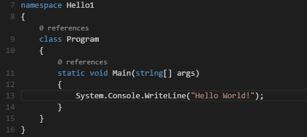

+++
title = "Basic Editing"
date = 2024-01-12T22:36:24+08:00
weight = 1
type = "docs"
description = ""
isCJKLanguage = true
draft = false
+++

> 原文: [https://code.visualstudio.com/docs/editor/codebasics](https://code.visualstudio.com/docs/editor/codebasics)

# Basic Editing 基本编辑


Visual Studio Code is an editor first and foremost, and includes the features you need for highly productive source code editing. This topic takes you through the basics of the editor and helps you get moving with your code.

​​	Visual Studio Code 首先是一款编辑器，它包含了高效率源代码编辑所需的功能。本主题将带您了解编辑器的基础知识，帮助您开始使用代码。

## [Keyboard shortcuts 键盘快捷键](https://code.visualstudio.com/docs/editor/codebasics#_keyboard-shortcuts)

Being able to keep your hands on the keyboard when writing code is crucial for high productivity. VS Code has a rich set of default keyboard shortcuts as well as allowing you to customize them.

​​	在编写代码时能够将手放在键盘上对于提高工作效率至关重要。VS Code 有一套丰富的默认键盘快捷键，还允许您自定义它们。

- [Keyboard Shortcuts Reference](https://code.visualstudio.com/docs/getstarted/keybindings#_keyboard-shortcuts-reference) - Learn the most commonly used and popular keyboard shortcuts by downloading the reference sheet.
  键盘快捷键参考 - 通过下载参考表来学习最常用和最受欢迎的键盘快捷键。
- [Install a Keymap extension](https://code.visualstudio.com/docs/getstarted/keybindings#_keymap-extensions) - Use the keyboard shortcuts of your old editor (such as Sublime Text, Atom, and Vim) in VS Code by installing a Keymap extension.
  安装按键映射扩展 - 通过安装按键映射扩展，在 VS Code 中使用旧编辑器（例如 Sublime Text、Atom 和 Vim）的键盘快捷键。
- [Customize Keyboard Shortcuts](https://code.visualstudio.com/docs/getstarted/keybindings#_keyboard-shortcuts-editor) - Change the default keyboard shortcuts to fit your style.
  自定义键盘快捷键 - 更改默认键盘快捷键以适应您的风格。

## [Multiple selections (multi-cursor) 多重选择（多光标）](https://code.visualstudio.com/docs/editor/codebasics#_multiple-selections-multicursor)

VS Code supports multiple cursors for fast simultaneous edits. You can add secondary cursors (rendered thinner) with Alt+Click. Each cursor operates independently based on the context it sits in. A common way to add more cursors is with Ctrl+Alt+Down or Ctrl+Alt+Up that insert cursors below or above.

​​	VS Code 支持多光标，可快速同时进行编辑。您可以使用 Alt+单击添加辅助光标（以更细的线段呈现）。每个光标都根据其所在上下文独立运行。添加更多光标的常用方法是使用 Ctrl+Alt+向下或 Ctrl+Alt+向上，这些组合键可在下方或上方插入光标。

> **Note:** Your graphics card driver (for example NVIDIA) might overwrite these default shortcuts.
>
> ​​	注意：您的显卡驱动程序（例如 NVIDIA）可能会覆盖这些默认快捷方式。


Ctrl+D selects the word at the cursor, or the next occurrence of the current selection.

​​	Ctrl+D 选择光标处的单词，或当前选定的下一个出现位置。


> **Tip:** You can also add more cursors with Ctrl+Shift+L, which will add a selection at each occurrence of the current selected text.
>
> ​​	提示：您还可以使用 Ctrl+Shift+L 添加更多光标，这将在当前选定文本的每个出现位置添加一个选定内容。

### [Multi-cursor modifier 多光标修饰符](https://code.visualstudio.com/docs/editor/codebasics#_multicursor-modifier)

If you'd like to change the modifier key for applying multiple cursors to Cmd+Click on macOS and Ctrl+Click on Windows and Linux, you can do so with the `editor.multiCursorModifier` [setting](https://code.visualstudio.com/docs/getstarted/settings). This lets users coming from other editors such as Sublime Text or Atom continue to use the keyboard modifier they are familiar with.

​​	如果您想更改在 macOS 上使用 Cmd+Click 和在 Windows 和 Linux 上使用 Ctrl+Click 应用多个光标的修饰键，可以使用 `editor.multiCursorModifier` 设置来实现。这使用户可以继续使用他们熟悉的键盘修饰符，例如来自 Sublime Text 或 Atom 等其他编辑器。

The setting can be set to:

​​	该设置可以设置为：

- `ctrlCmd` - Maps to Ctrl on Windows and Cmd on macOS.
  `ctrlCmd` - 映射到 Windows 上的 Ctrl 和 macOS 上的 Cmd。
- `alt` - The existing default Alt.
  `alt` - 现有的默认 Alt。

There's also a menu item **Use Ctrl+Click for Multi-Cursor** in the **Selection** menu to quickly toggle this setting.

​​	在“选择”菜单中还有一个菜单项“使用 Ctrl+Click 进行多光标”，可快速切换此设置。

The **Go to Definition** and **Open Link** gestures will also respect this setting and adapt such that they do not conflict. For example, when the setting is `ctrlCmd`, multiple cursors can be added with Ctrl/Cmd+Click, and opening links or going to definition can be invoked with Alt+Click.

​​	转到定义和打开链接手势也将遵循此设置，并进行调整，以避免冲突。例如，当设置是 `ctrlCmd` 时，可以使用 Ctrl/Cmd+Click 添加多个光标，并且可以使用 Alt+Click 打开链接或转到定义。

### [Shrink/expand selection 缩小/展开选择](https://code.visualstudio.com/docs/editor/codebasics#_shrinkexpand-selection)

Quickly shrink or expand the current selection. Trigger it with Shift+Alt+Left and Shift+Alt+Right.

​​	快速缩小或展开当前选择。使用 Shift+Alt+左和 Shift+Alt+右触发它。

Here's an example of expanding the selection with Shift+Alt+Right:

​​	以下是如何使用 Shift+Alt+右展开选择的一个示例：



## [Column (box) selection 列（框）选择](https://code.visualstudio.com/docs/editor/codebasics#_column-box-selection)

Place the cursor in one corner and then hold Shift+Alt while dragging to the opposite corner:

​​	将光标放在一个角上，然后按住 Shift+Alt 并拖动到对角：


Note: This changes to Shift+Ctrl/Cmd when using Ctrl/Cmd as [multi-cursor modifier](https://code.visualstudio.com/docs/editor/codebasics#_multi-cursor-modifier).

​​	注意：当使用 Ctrl/Cmd 作为多光标修饰符时，这会变为 Shift+Ctrl/Cmd。

There are also default key bindings for column selection on macOS and Windows, but not on Linux.

​​	在 macOS 和 Windows 上也有列选择的默认键绑定，但在 Linux 上没有。

| Key                                      | Command 命令                           | Command ID 命令 ID           |
| :--------------------------------------- | :------------------------------------- | :--------------------------- |
| Ctrl+Shift+Alt+Down Ctrl+Shift+Alt+向下  | Column Select Down 向下选择列          | `cursorColumnSelectDown`     |
| Ctrl+Shift+Alt+Up Ctrl+Shift+Alt+向上    | Column Select Up 列选择向上            | `cursorColumnSelectUp`       |
| Ctrl+Shift+Alt+Left Ctrl+Shift+Alt+向左  | Column Select Left 列选择向左          | `cursorColumnSelectLeft`     |
| Ctrl+Shift+Alt+Right Ctrl+Shift+Alt+向右 | Column Select Right 列选择向右         | `cursorColumnSelectRight`    |
| Ctrl+Shift+Alt+PageDown                  | Column Select Page Down 列选择向下翻页 | `cursorColumnSelectPageDown` |
| Ctrl+Shift+Alt+PageUp                    | Column Select Page Up 列选择向上翻页   | `cursorColumnSelectPageUp`   |

You can [edit](https://code.visualstudio.com/docs/getstarted/keybindings) your `keybindings.json` to bind them to something more familiar if you want.

​​	如果您想将 `keybindings.json` 编辑为更熟悉的内容，可以这样做。

### [Column Selection mode 列选择模式](https://code.visualstudio.com/docs/editor/codebasics#_column-selection-mode)

The user setting **Editor: Column Selection** controls this feature. Once this mode is entered, as indicated in the Status bar, the mouse gestures and the arrow keys will create a column selection by default. This global toggle is also accessible via the **Selection** > **Column Selection Mode** menu item. In addition, one can also disable Column Selection mode from the Status bar.

​​	用户设置编辑器：列选择控制此功能。一旦进入此模式，如状态栏中所示，鼠标手势和箭头键将默认创建列选择。还可以通过“选择”>“列选择模式”菜单项访问此全局切换。此外，还可以从状态栏禁用列选择模式。

## [Save / Auto Save 保存/自动保存](https://code.visualstudio.com/docs/editor/codebasics#_save-auto-save)

By default, VS Code requires an explicit action to save your changes to disk, Ctrl+S.

​​	默认情况下，VS Code 需要一个显式操作才能将您的更改保存到磁盘，即 Ctrl+S。

However, it's easy to turn on `Auto Save`, which will save your changes after a configured delay or when focus leaves the editor. With this option turned on, there is no need to explicitly save the file. The easiest way to turn on `Auto Save` is with the **File** > **Auto Save** toggle that turns on and off save after a delay.

​​	但是，很容易打开 `Auto Save` ，它将在配置的延迟后或焦点离开编辑器时保存您的更改。启用此选项后，无需显式保存文件。打开 `Auto Save` 的最简单方法是使用“文件”>“自动保存”切换，它会在延迟后打开和关闭保存。

For more control over `Auto Save`, open User or Workspace [settings](https://code.visualstudio.com/docs/getstarted/settings) and find the associated settings:

​​	要对 `Auto Save` 进行更多控制，请打开用户或工作区设置并查找关联的设置：

- ```
  files.autoSave
  ```

  : Can have the values:

  
  `files.autoSave` ：可以具有以下值：

  - `off` - to disable auto save.
    `off` - 禁用自动保存。
  - `afterDelay` - to save files after a configured delay (default 1000 ms).
    `afterDelay` - 在配置的延迟后保存文件（默认 1000 毫秒）。
  - `onFocusChange` - to save files when focus moves out of the editor of the dirty file.
    `onFocusChange` - 在焦点移出未保存文件编辑器时保存文件。
  - `onWindowChange` - to save files when the focus moves out of the VS Code window.
    `onWindowChange` - 在焦点移出 VS Code 窗口时保存文件。

- `files.autoSaveDelay`: Configures the delay in milliseconds when `files.autoSave` is configured to `afterDelay`. The default is 1000 ms.
  `files.autoSaveDelay` ：当 `files.autoSave` 配置为 `afterDelay` 时，配置延迟（以毫秒为单位）。默认值为 1000 毫秒。

## [Hot Exit 热退出](https://code.visualstudio.com/docs/editor/codebasics#_hot-exit)

VS Code will remember unsaved changes to files when you exit by default. Hot exit is triggered when the application is closed via **File** > **Exit** (**Code** > **Quit** on macOS) or when the last window is closed.

​​	默认情况下，VS Code 会记住退出时未保存的文件更改。当通过“文件”>“退出”（在 macOS 上为“代码”>“退出”）关闭应用程序或关闭最后一个窗口时，将触发热退出。

You can configure hot exit by setting `files.hotExit` to the following values:

​​	可以通过将 `files.hotExit` 设置为以下值来配置热退出：

- `"off"`: Disable hot exit.
  `"off"` ：禁用热退出。
- `"onExit"`: Hot exit will be triggered when the application is closed, that is when the last window is closed on Windows/Linux or when the `workbench.action.quit` command is triggered (from the **Command Palette**, keyboard shortcut or menu). All windows without folders opened will be restored upon next launch.
  `"onExit"` ：当关闭应用程序时（即在 Windows/Linux 上关闭最后一个窗口或触发 `workbench.action.quit` 命令时（从命令面板、键盘快捷方式或菜单中）），将触发热退出。下次启动时，将还原所有未打开文件夹的窗口。
- `"onExitAndWindowClose"`: Hot exit will be triggered when the application is closed, that is when the last window is closed on Windows/Linux or when the `workbench.action.quit` command is triggered (from the **Command Palette**, keyboard shortcut or menu), and also for any window with a folder opened regardless of whether it is the last window. All windows without folders opened will be restored upon next launch. To restore folder windows as they were before shutdown, set `window.restoreWindows` to `all`.
  `"onExitAndWindowClose"` ：当应用程序关闭时，即在 Windows/Linux 上关闭最后一个窗口或触发 `workbench.action.quit` 命令（来自命令面板、键盘快捷键或菜单）时，以及对于任何打开文件夹的窗口（无论它是否是最后一个窗口）时，都会触发热退出。所有未打开文件夹的窗口将在下次启动时还原。若要将文件夹窗口还原为关闭前的状态，请将 `window.restoreWindows` 设置为 `all` 。

If something happens to go wrong with hot exit, all backups are stored in the following folders for standard install locations:

​​	如果热退出出现问题，所有备份都存储在以下文件夹中（适用于标准安装位置）：

- **Windows** `%APPDATA%\Code\Backups`
- **macOS** `$HOME/Library/Application Support/Code/Backups`
- **Linux** `$HOME/.config/Code/Backups`

## [Find and Replace 查找和替换](https://code.visualstudio.com/docs/editor/codebasics#_find-and-replace)

VS Code allows you to quickly find text and replace in the currently opened file. Press Ctrl+F to open the Find Widget in the editor, search results will be highlighted in the editor, overview ruler and minimap.

​​	VS Code 允许您快速查找文本并在当前打开的文件中替换。按 Ctrl+F 在编辑器中打开查找小组件，搜索结果将在编辑器、概览标尺和迷你地图中突出显示。

If there are more than one matched result in the current opened file, you can press Enter and Shift+Enter to navigate to next or previous result when the find input box is focused.

​​	如果在当前打开的文件中有多个匹配结果，则可以在查找输入框获得焦点时按 Enter 和 Shift+Enter 导航到下一个或上一个结果。

### [Seed Search String From Selection 从所选内容播种搜索字符串](https://code.visualstudio.com/docs/editor/codebasics#_seed-search-string-from-selection)

When the Find Widget is opened, it will automatically populate the selected text in the editor into the find input box. If the selection is empty, the word under the cursor will be inserted into the input box instead.

​​	当打开查找小部件时，它会自动将编辑器中选定的文本填充到查找输入框中。如果选择为空，则光标下的单词将被插入到输入框中。


This feature can be turned off by setting `editor.find.seedSearchStringFromSelection` to `"never"`.

​​	可以通过将 `editor.find.seedSearchStringFromSelection` 设置为 `"never"` 来关闭此功能。

### [Find In Selection 在选中内容中查找](https://code.visualstudio.com/docs/editor/codebasics#_find-in-selection)

By default, the find operations are run on the entire file in the editor. It can also be run on selected text. You can turn this feature on by clicking the hamburger icon on the Find Widget.

​​	默认情况下，查找操作在编辑器中的整个文件中运行。它也可以在选定的文本上运行。您可以通过单击查找小部件上的汉堡包图标来打开此功能。


If you want it to be the default behavior of the Find Widget, you can set `editor.find.autoFindInSelection` to `always`, or to `multiline`, if you want it to be run on selected text only when multiple lines of content are selected.

​​	如果您希望它是查找小部件的默认行为，则可以将 `editor.find.autoFindInSelection` 设置为 `always` ，或者将其设置为 `multiline` ，如果您希望仅在选择多行内容时在选定的文本上运行它。

### [Advanced find and replace options 高级查找和替换选项](https://code.visualstudio.com/docs/editor/codebasics#_advanced-find-and-replace-options)

In addition to find and replace with plain text, the Find Widget also has three advanced search options:

​​	除了查找和替换纯文本外，查找小部件还具有三个高级搜索选项：

- Match Case
  匹配大小写
- Match Whole Word
  匹配整个单词
- Regular Expression
  正则表达式

The replace input box support case preserving, you can turn it on by clicking the Preserve Case (**AB**) button.

​​	替换输入框支持保留大小写，您可以通过单击“保留大小写 (AB)”按钮来启用它。

### [Multiline support and Find Widget resizing 支持多行和调整“查找”小组件大小](https://code.visualstudio.com/docs/editor/codebasics#_multiline-support-and-find-widget-resizing)

You can search multiple line text by pasting the text into the Find input box and Replace input box. Pressing `Ctrl+Enter` inserts a new line in the input box.

​​	您可以通过将文本粘贴到“查找”输入框和“替换”输入框中来搜索多行文本。按 `Ctrl+Enter` 可在输入框中插入新行。


While searching long text, the default size of Find Widget might be too small. You can drag the left sash to enlarge the Find Widget or double click the left sash to maximize it or shrink it to its default size.

​​	在搜索长文本时，“查找”小组件的默认大小可能太小。您可以拖动左侧窗格以放大“查找”小组件，或双击左侧窗格以将其最大化或缩小至其默认大小。


## [Search across files 跨文件搜索](https://code.visualstudio.com/docs/editor/codebasics#_search-across-files)

VS Code allows you to quickly search over all files in the currently opened folder. Press Ctrl+Shift+F and enter your search term. Search results are grouped into files containing the search term, with an indication of the hits in each file and its location. Expand a file to see a preview of all of the hits within that file. Then single-click on one of the hits to view it in the editor.

​​	VS Code 允许您快速搜索当前打开的文件夹中的所有文件。按 Ctrl+Shift+F 并输入您的搜索词。搜索结果会分组到包含搜索词的文件中，并指示每个文件中的匹配项及其位置。展开文件以查看该文件内所有匹配项的预览。然后单击其中一个匹配项以在编辑器中查看它。


> **Tip:** We support regular expression searching in the search box, too.
>
> ​​	提示：我们还支持在搜索框中进行正则表达式搜索。

You can configure advanced search options by clicking the ellipsis (**Toggle Search Details**) below the search box on the right (or press Ctrl+Shift+J). This will show additional fields to configure the search.

​​	您可以通过单击搜索框右侧下方的省略号（切换搜索详细信息）来配置高级搜索选项（或按 Ctrl+Shift+J）。这将显示其他字段以配置搜索。

### [Advanced search options 高级搜索选项](https://code.visualstudio.com/docs/editor/codebasics#_advanced-search-options)


In the two input boxes below the search box, you can enter patterns to include or exclude from the search. If you enter `example`, that will match every folder and file named `example` in the workspace. If you enter `./example`, that will match the folder `example/` at the top level of your workspace. Use `,` to separate multiple patterns. Paths must use forward slashes. You can also use [glob pattern](https://code.visualstudio.com/docs/editor/glob-patterns) syntax, for example:

​​	在搜索框下方的两个输入框中，您可以输入要包含或从搜索中排除的模式。如果您输入 `example` ，它将匹配工作区中名为 `example` 的每个文件夹和文件。如果您输入 `./example` ，它将匹配工作区顶层的文件夹 `example/` 。使用 `,` 分隔多个模式。路径必须使用正斜杠。您还可以使用 glob 模式语法，例如：

- `*` to match zero or more characters in a path segment
  `*` 匹配路径段中的零个或多个字符
- `?` to match on one character in a path segment
  `?` 匹配路径段中的一个字符
- `**` to match any number of path segments, including none
  `**` 匹配任意数量的路径段，包括无
- `{}` to group conditions (for example `{**/*.html,**/*.txt}` matches all HTML and text files)
  `{}` 对条件进行分组（例如 `{**/*.html,**/*.txt}` 匹配所有 HTML 和文本文件）
- `[]` to **declare** a range of characters to match (`example.[0-9]` to match on `example.0`, `example.1`, …)
  `[]` 声明要匹配的一系列字符（ `example.[0-9]` 匹配 `example.0` 、 `example.1` 、…）
- `[!...]` to negate a range of characters to match (`example.[!0-9]` to match on `example.a`, `example.b`, but not `example.0`)
  `[!...]` 否定要匹配的一系列字符（ `example.[!0-9]` 匹配 `example.a` 、 `example.b` ，但不匹配 `example.0` ）

VS Code excludes some folders by default to reduce the number of search results that you are not interested in (for example: `node_modules`). Open [settings](https://code.visualstudio.com/docs/getstarted/settings) to change these rules under the `files.exclude` and `search.exclude` section.

​​	VS Code 默认会排除一些文件夹，以减少您不感兴趣的搜索结果数量（例如： `node_modules` ）。打开设置，在 `files.exclude` 和 `search.exclude` 部分下更改这些规则。

Note that glob patterns in the Search view work differently than in settings such as `files.exclude` and `search.exclude`. In the settings, you must use `**/example` to match a folder named `example` in subfolder `folder1/example` in your workspace. In the Search view, the `**` prefix is assumed. The glob patterns in these settings are always evaluated relative to the path of the workspace folder.

​​	请注意，搜索视图中的 glob 模式与 `files.exclude` 和 `search.exclude` 等设置中的工作方式不同。在设置中，您必须使用 `**/example` 来匹配工作区中子文件夹 `folder1/example` 中名为 `example` 的文件夹。在搜索视图中，假定 `**` 前缀。这些设置中的 glob 模式始终相对于工作区文件夹的路径进行评估。

Also note the **Use Exclude Settings and Ignore Files** toggle button in the **files to exclude** box. The toggle determines whether to exclude files that are ignored by your `.gitignore` files and/or matched by your `files.exclude` and `search.exclude` settings.

​​	还要注意排除框中的“使用排除设置和忽略文件”切换按钮。此切换按钮确定是否排除被 `.gitignore` 文件忽略和/或与 `files.exclude` 和 `search.exclude` 设置匹配的文件。

> **Tip:** From the Explorer, you can right-click on a folder and select **Find in Folder** to search inside a folder only.
>
> ​​	提示：在资源管理器中，您可以右键单击文件夹并选择“在文件夹中查找”以仅在文件夹内搜索。

### [Search and replace 搜索和替换](https://code.visualstudio.com/docs/editor/codebasics#_search-and-replace)

You can also Search and Replace across files. Expand the Search widget to display the Replace text box.

​​	您还可以在文件中搜索和替换。展开“搜索”小部件以显示“替换”文本框。


When you type text into the Replace text box, you will see a diff display of the pending changes. You can replace across all files from the Replace text box, replace all in one file or replace a single change.

​​	在“替换”文本框中键入文本时，您将看到待定更改的差异显示。您可以从“替换”文本框替换所有文件中的内容，替换一个文件中的所有内容或替换单个更改。


> **Tip:** You can quickly reuse a previous search term by using Down and Up to navigate through your search term history.
>
> ​​	提示：您可以使用向下和向上键浏览搜索词历史记录，快速重复使用以前的搜索词。

### [Case changing in regex replace 在正则表达式替换中更改大小写](https://code.visualstudio.com/docs/editor/codebasics#_case-changing-in-regex-replace)

VS Code supports changing the case of regex matching groups while doing Search and Replace in the editor or globally. This is done with the modifiers `\u\U\l\L`, where `\u` and `\l` will upper/lowercase a single character, and `\U` and `\L` will upper/lowercase the rest of the matching group.

​​	VS Code 支持在编辑器或全局范围内执行搜索和替换时更改正则表达式匹配组的大小写。这是通过修饰符 `\u\U\l\L` 完成的，其中 `\u` 和 `\l` 将使单个字符变为大写/小写，而 `\U` 和 `\L` 将使匹配组的其余部分变为大写/小写。

Example:

​​	示例：


The modifiers can also be stacked - for example, `\u\u\u$1` will uppercase the first three characters of the group, or `\l\U$1` will lowercase the first character, and uppercase the rest. The capture group is referenced by `$n` in the replacement string, where `n` is the order of the capture group.

​​	修饰符还可以堆叠 - 例如， `\u\u\u$1` 将使组的前三个字符变为大写，或者 `\l\U$1` 将使第一个字符变为小写，并将其余部分变为大写。捕获组在替换字符串中由 `$n` 引用，其中 `n` 是捕获组的顺序。

## [Search Editor 搜索编辑器](https://code.visualstudio.com/docs/editor/codebasics#_search-editor)

Search Editors let you view workspace search results in a full-sized editor, complete with syntax highlighting and optional lines of surrounding context.

​​	搜索编辑器允许您在全尺寸编辑器中查看工作区搜索结果，并完整显示语法突出显示和可选的周围上下文行。

Below is a search for the word 'SearchEditor' with two lines of text before and after the match for context:

​​	以下是搜索单词“SearchEditor”的结果，匹配前后各有两行文本以供参考：


The **Open Search Editor** command opens an existing Search Editor if one exists, or to otherwise create a new one. The **New Search Editor** command will always create a new Search Editor.

​​	“打开搜索编辑器”命令会打开现有的搜索编辑器（如果存在），否则会创建一个新的搜索编辑器。“新建搜索编辑器”命令始终会创建一个新的搜索编辑器。

In the Search Editor, results can be navigated to using **Go to Definition** actions, such as F12 to open the source location in the current editor group, or Ctrl+K F12 to open the location in an editor to the side. Additionally, double-clicking can optionally open the source location, configurable with the `search.searchEditor.doubleClickBehaviour` setting.

​​	在搜索编辑器中，可以使用转到定义操作来导航结果，例如按 F12 在当前编辑器组中打开源代码位置，或按 Ctrl+K F12 在侧面的编辑器中打开该位置。此外，还可以双击以打开源代码位置，此功能可以通过 `search.searchEditor.doubleClickBehaviour` 设置进行配置。

You can also use the **Open New Search Editor** button at the top of the Search view, and can copy your existing results from a Search view over to a Search Editor with the **Open in editor** link at the top of the results tree, or the **Search Editor: Open Results in Editor** command.

​​	您还可以使用搜索视图顶部的“打开新搜索编辑器”按钮，并可以使用结果树顶部的“在编辑器中打开”链接或“搜索编辑器：在编辑器中打开结果”命令将现有结果从搜索视图复制到搜索编辑器。


The Search Editor above was opened by selecting the **Open New Search Editor** button (third button) on the top of the Search view.

​​	上面的搜索编辑器是通过选择搜索视图顶部的“打开新搜索编辑器”按钮（第三个按钮）打开的。

### [Search Editor commands and arguments 搜索编辑器命令和参数](https://code.visualstudio.com/docs/editor/codebasics#_search-editor-commands-and-arguments)

- `search.action.openNewEditor` - Opens the Search Editor in a new tab.
  `search.action.openNewEditor` - 在新选项卡中打开搜索编辑器。
- `search.action.openInEditor` - Copy the current Search results into a new Search Editor.
  `search.action.openInEditor` - 将当前搜索结果复制到新的搜索编辑器中。
- `search.action.openNewEditorToSide` - Opens the Search Editor in a new window next to the window you currently have opened.
  `search.action.openNewEditorToSide` - 在您当前打开的窗口旁边的新窗口中打开搜索编辑器。

There are two arguments that you can pass to the Search Editor commands (`search.action.openNewEditor`, `search.action.openNewEditorToSide`) to allow keybindings to configure how a new Search Editor should behave:

​​	您可以将两个参数传递给搜索编辑器命令 ( `search.action.openNewEditor` , `search.action.openNewEditorToSide` )，以允许键绑定配置新的搜索编辑器应如何表现：

- `triggerSearch` - Whether a search be automatically run when a Search Editor is opened. Default is true.
  `triggerSearch` - 在打开搜索编辑器时是否自动运行搜索。默认值为 true。
- `focusResults` - Whether to put focus in the results of a search or the query input. Default is true.
  `focusResults` - 是否将焦点放在搜索结果还是查询输入上。默认值为 true。

For example, the following keybinding runs the search when the Search Editor is opened but leaves the focus in the search query control.

​​	例如，以下键绑定在打开搜索编辑器时运行搜索，但将焦点留在搜索查询控件中。

```
{
  "key": "ctrl+o",
  "command": "search.action.openNewEditor",
  "args": { "query": "VS Code", "triggerSearch": true, "focusResults": false }
}
```

### [Search Editor context default 搜索编辑器上下文默认值](https://code.visualstudio.com/docs/editor/codebasics#_search-editor-context-default)

The `search.searchEditor.defaultNumberOfContextLines` setting has a default value of 1, meaning one context line will be shown before and after each result line in the Search Editor.

​​	 `search.searchEditor.defaultNumberOfContextLines` 设置的默认值为 1，这意味着在搜索编辑器中的每行结果之前和之后都会显示一行上下文行。

### [Reuse last Search Editor configuration 重用上次搜索编辑器配置](https://code.visualstudio.com/docs/editor/codebasics#_reuse-last-search-editor-configuration)

The `search.searchEditor.reusePriorSearchConfiguration` setting (default is `false`) lets you reuse the last active Search Editor's configuration when creating a new Search Editor.

​​	 `search.searchEditor.reusePriorSearchConfiguration` 设置（默认值为 `false` ）允许您在创建新的搜索编辑器时重用上次活动的搜索编辑器的配置。

## [IntelliSense](https://code.visualstudio.com/docs/editor/codebasics#_intellisense)

We'll always offer word completion, but for the rich [languages](https://code.visualstudio.com/docs/languages/overview), such as JavaScript, JSON, HTML, CSS, SCSS, Less, C# and TypeScript, we offer a true IntelliSense experience. If a language service knows possible completions, the IntelliSense suggestions will pop up as you type. You can always manually trigger it with Ctrl+Space. By default, Tab or Enter are the accept keyboard triggers but you can also [customize these key bindings](https://code.visualstudio.com/docs/getstarted/keybindings).

​​	我们将始终提供单词补全功能，但对于 JavaScript、JSON、HTML、CSS、SCSS、Less、C# 和 TypeScript 等丰富的语言，我们提供真正的 IntelliSense 体验。如果语言服务知道可能的补全，IntelliSense 建议将在您键入时弹出。您始终可以使用 Ctrl+Space 手动触发它。默认情况下，Tab 或 Enter 是接受键盘触发器，但您也可以自定义这些键绑定。

> **Tip:** The suggestions filtering supports CamelCase so you can type the letters which are upper cased in a method name to limit the suggestions. For example, "cra" will quickly bring up "createApplication".
>
> ​​	提示：建议筛选支持 CamelCase，因此您可以键入方法名中大写的字母来限制建议。例如，“cra”将快速显示“createApplication”。

> **Tip:** IntelliSense suggestions can be configured via the `editor.quickSuggestions` and `editor.suggestOnTriggerCharacters` [settings](https://code.visualstudio.com/docs/getstarted/settings).
>
> ​​	提示：可以通过 `editor.quickSuggestions` 和 `editor.suggestOnTriggerCharacters` 设置配置 IntelliSense 建议。

JavaScript and TypeScript developers can take advantage of the [npmjs](https://www.npmjs.com/) type declaration (typings) file repository to get IntelliSense for common JavaScript libraries (Node.js, React, Angular). You can find a good explanation on using type declaration files in the [JavaScript language](https://code.visualstudio.com/docs/languages/javascript#_intellisense) topic and the [Node.js](https://code.visualstudio.com/docs/nodejs/nodejs-tutorial) tutorial.

​​	JavaScript 和 TypeScript 开发人员可以利用 npmjs 类型声明（类型化）文件存储库，为常见的 JavaScript 库（Node.js、React、Angular）获取 IntelliSense。您可以在 JavaScript 语言主题和 Node.js 教程中找到有关在类型声明文件中使用类型的良好解释。

Learn more in the [IntelliSense document](https://code.visualstudio.com/docs/editor/intellisense).

​​	在 IntelliSense 文档中了解更多信息。

## [Formatting 格式化](https://code.visualstudio.com/docs/editor/codebasics#_formatting)

VS Code has great support for source code formatting. The editor has two explicit format actions:

​​	VS Code 对源代码格式化有很好的支持。编辑器有两个显式格式操作：

- **Format Document** (Shift+Alt+F) - Format the entire active file.
  格式化文档（Shift+Alt+F） - 格式化整个活动文件。
- **Format Selection** (Ctrl+K Ctrl+F) - Format the selected text.
  格式化所选内容（Ctrl+K Ctrl+F） - 格式化所选文本。

You can invoke these from the **Command Palette** (Ctrl+Shift+P) or the editor context menu.

​​	您可以从命令面板（Ctrl+Shift+P）或编辑器上下文菜单中调用这些命令。

VS Code has default formatters for JavaScript, TypeScript, JSON, HTML, and CSS. Each language has specific formatting options (for example, `html.format.indentInnerHtml`) which you can tune to your preference in your user or workspace [settings](https://code.visualstudio.com/docs/getstarted/settings). You can also disable the default language formatter if you have another extension installed that provides formatting for the same language.

​​	VS Code 具有适用于 JavaScript、TypeScript、JSON、HTML 和 CSS 的默认格式化程序。每种语言都有特定的格式化选项（例如， `html.format.indentInnerHtml` ），您可以在用户或工作区设置中根据自己的喜好对其进行调整。如果您安装了另一个提供相同语言格式化的扩展，也可以禁用默认语言格式化程序。

```
"html.format.enable": false
```

Along with manually invoking code formatting, you can also trigger formatting based on user gestures such as typing, saving or pasting. These are off by default but you can enable these behaviors through the following [settings](https://code.visualstudio.com/docs/getstarted/settings):

​​	除了手动调用代码格式化之外，您还可以根据用户手势（例如键入、保存或粘贴）触发格式化。这些功能默认关闭，但您可以通过以下设置启用这些行为：

- `editor.formatOnType` - Format the line after typing.
  `editor.formatOnType` - 在键入后格式化该行。
- `editor.formatOnSave` - Format a file on save.
  `editor.formatOnSave` - 在保存时格式化文件。
- `editor.formatOnPaste` - Format the pasted content.
  `editor.formatOnPaste` - 格式化粘贴的内容。

> Note: Not all formatters support format on paste as to do so they must support formatting a selection or range of text.
>
> ​​	注意：并非所有格式化程序都支持粘贴时格式化，因为要做到这一点，它们必须支持格式化所选内容或文本范围。

In addition to the default formatters, you can find extensions on the Marketplace to support other languages or formatting tools. There is a `Formatters` category so you can easily search and find [formatting extensions](https://marketplace.visualstudio.com/search?target=VSCode&category=Formatters&sortBy=Installs). In the **Extensions** view search box, type 'formatters' or 'category:formatters' to see a filtered list of extensions within VS Code.

​​	除了默认格式化程序外，您还可以在 Marketplace 上找到扩展，以支持其他语言或格式化工具。有一个 `Formatters` 类别，因此您可以轻松搜索和查找格式化扩展。在“扩展”视图搜索框中，键入“formatters”或“category:formatters”，以查看 VS Code 中的扩展的筛选列表。

## [Folding 折叠](https://code.visualstudio.com/docs/editor/codebasics#_folding)

You can fold regions of source code using the folding icons on the gutter between line numbers and line start. Move the mouse over the gutter and click to fold and unfold regions. Use Shift + Click on the folding icon to fold or unfold the region and all regions inside.

​​	您可以使用行号和行开头之间的间距上的折叠图标折叠源代码区域。将鼠标移到间距上并单击以折叠和展开区域。在折叠图标上使用 Shift + 单击以折叠或展开该区域和内部的所有区域。


You can also use the following actions:

​​	您还可以使用以下操作：

- Fold (Ctrl+Shift+[) folds the innermost uncollapsed region at the cursor.
  折叠 (Ctrl+Shift+[) 折叠光标处最内层的未折叠区域。
- Unfold (Ctrl+Shift+]) unfolds the collapsed region at the cursor.
  展开 (Ctrl+Shift+]) 展开光标处的折叠区域。
- Toggle Fold (Ctrl+K Ctrl+L) folds or unfolds the region at the cursor.
  切换折叠 (Ctrl+K Ctrl+L) 折叠或展开光标处的区域。
- Fold Recursively (Ctrl+K Ctrl+[) folds the innermost uncollapsed region at the cursor and all regions inside that region.
  递归折叠 (Ctrl+K Ctrl+[) 折叠光标处最内层的未折叠区域和该区域内的所有区域。
- Unfold Recursively (Ctrl+K Ctrl+]) unfolds the region at the cursor and all regions inside that region.
  递归展开 (Ctrl+K Ctrl+]) 展开光标处的区域和该区域内的所有区域。
- Fold All (Ctrl+K Ctrl+0) folds all regions in the editor.
  折叠全部 (Ctrl+K Ctrl+0) 折叠编辑器中的所有区域。
- Unfold All (Ctrl+K Ctrl+J) unfolds all regions in the editor.
  展开全部（Ctrl+K Ctrl+J）展开编辑器中的所有区域。
- Fold Level X (Ctrl+K Ctrl+2 for level 2) folds all regions of level X, except the region at the current cursor position.
  折叠级别 X（Ctrl+K Ctrl+2 表示级别 2）折叠级别 X 的所有区域，当前光标位置处的区域除外。
- Fold All Block Comments (Ctrl+K Ctrl+/) folds all regions that start with a block comment token.
  折叠所有块注释（Ctrl+K Ctrl+/) 折叠所有以块注释标记开头的区域。

Folding regions are by default evaluated based on the indentation of lines. A folding region starts when a line has a smaller indent than one or more following lines, and ends when there is a line with the same or smaller indent.

​​	默认情况下，折叠区域根据行的缩进进行评估。当一行缩进小于一行或多行后一行时，折叠区域开始，当出现缩进相同或更小的行时，折叠区域结束。

Folding regions can also be computed based on syntax tokens of the editor's configured language. The following languages already provide syntax aware folding: Markdown, HTML, CSS, LESS, SCSS, and JSON.

​​	折叠区域还可以根据编辑器配置的语言的语法标记计算。以下语言已提供语法感知折叠：Markdown、HTML、CSS、LESS、SCSS 和 JSON。

If you prefer to switch back to indentation-based folding for one (or all) of the languages above, use:

​​	如果您希望对上述一种（或全部）语言切换回基于缩进的折叠，请使用：

```
  "[html]": {
    "editor.foldingStrategy": "indentation"
  },
```

Regions can also be defined by markers defined by each language. The following languages currently have markers defined:

​​	区域还可以由每种语言定义的标记定义。以下语言当前已定义标记：

| Language 语言         | Start region 开始区域                                        | End region 结束区域                                          |
| :-------------------- | :----------------------------------------------------------- | :----------------------------------------------------------- |
| Bat                   | `::#region` or `REM #region` `::#region` 或 `REM #region`    | `::#endregion` or `REM #endregion` `::#endregion` 或 `REM #endregion` |
| C#                    | `#region`                                                    | `#endregion`                                                 |
| C/C++                 | `#pragma region`                                             | `#pragma endregion`                                          |
| CSS/Less/SCSS         | `/*#region*/`                                                | `/*#endregion*/`                                             |
| Coffeescript          | `#region`                                                    | `#endregion`                                                 |
| F#                    | `//#region` or `(#_region)` `//#region` 或 `(#_region)`      | `//#endregion` or `(#_endregion)` `//#endregion` 或 `(#_endregion)` |
| Java                  | `//#region` or `//<editor-fold>` `//#region` 或 `//<editor-fold>` | `//#endregion` or `//</editor-fold>` `//#endregion` 或 `//</editor-fold>` |
| Markdown              | `<!-- #region -->`                                           | `<!-- #endregion -->`                                        |
| Perl5                 | `#region` or `=pod` `#region` 或 `=pod`                      | `#endregion` or `=cut` `#endregion` 或 `=cut`                |
| PHP                   | `#region`                                                    | `#endregion`                                                 |
| PowerShell            | `#region`                                                    | `#endregion`                                                 |
| Python                | `#region` or `# region` `#region` 或 `# region`              | `#endregion` or `# endregion` `#endregion` 或 `# endregion`  |
| TypeScript/JavaScript | `//#region`                                                  | `//#endregion`                                               |
| Visual Basic          | `#Region`                                                    | `#End Region`                                                |

To fold and unfold only the regions defined by markers use:

​​	要折叠和展开仅由标记定义的区域，请使用：

- Fold Marker Regions (Ctrl+K Ctrl+8) folds all marker regions.
  折叠标记区域（Ctrl+K Ctrl+8）折叠所有标记区域。
- Unfold Marker Regions (Ctrl+K Ctrl+9) unfolds all marker regions.
  展开标记区域（Ctrl+K Ctrl+9）展开所有标记区域。

### [Fold selection 折叠选择](https://code.visualstudio.com/docs/editor/codebasics#_fold-selection)

The command **Create Manual Folding Ranges from Selection** (Ctrl+K Ctrl+,) creates a folding range from the currently selected lines and collapses it. That range is called a **manual** folding range that goes on top of the ranges computed by folding providers.

​​	命令从选择中创建手动折叠范围（Ctrl+K Ctrl+,）从当前选定的行创建一个折叠范围并将其折叠。该范围称为手动折叠范围，位于折叠提供程序计算的范围之上。

Manual folding ranges can be removed with the command **Remove Manual Folding Ranges** (Ctrl+K Ctrl+.).

​​	可以使用命令删除手动折叠范围（Ctrl+K Ctrl+。）删除手动折叠范围。

Manual folding ranges are especially useful for cases when there isn't programming language support for folding.

​​	手动折叠范围对于没有编程语言折叠支持的情况特别有用。

## [Indentation 缩进](https://code.visualstudio.com/docs/editor/codebasics#_indentation)

VS Code lets you control text indentation and whether you'd like to use spaces or tab stops. By default, VS Code inserts spaces and uses 4 spaces per Tab key. If you'd like to use another default, you can modify the `editor.insertSpaces` and `editor.tabSize` [settings](https://code.visualstudio.com/docs/getstarted/settings).

​​	VS Code 允许您控制文本缩进以及您是否想要使用空格或制表符。默认情况下，VS Code 插入空格并每个制表符键使用 4 个空格。如果您想使用其他默认值，可以修改 `editor.insertSpaces` 和 `editor.tabSize` 设置。

```
    "editor.insertSpaces": true,
    "editor.tabSize": 4,
```

### [Auto-detection 自动检测](https://code.visualstudio.com/docs/editor/codebasics#_autodetection)

VS Code analyzes your open file and determines the indentation used in the document. The auto-detected indentation overrides your default indentation settings. The detected setting is displayed on the right side of the Status Bar:

​​	VS Code 分析您的打开文件并确定文档中使用的缩进。自动检测的缩进会覆盖您的默认缩进设置。检测到的设置显示在状态栏的右侧：


You can click on the Status Bar indentation display to bring up a dropdown with indentation commands allowing you to change the default settings for the open file or convert between tab stops and spaces.

​​	您可以单击状态栏缩进显示以调出带有缩进命令的下拉列表，允许您更改打开文件的默认设置或在制表符和空格之间转换。


> **Note:** VS Code auto-detection checks for indentations of 2, 4, 6 or 8 spaces. If your file uses a different number of spaces, the indentation may not be correctly detected. For example, if your convention is to indent with 3 spaces, you may want to turn off `editor.detectIndentation` and explicitly set the tab size to 3.
>
> ​​	注意：VS Code 自动检测检查 2、4、6 或 8 个空格的缩进。如果您的文件使用不同数量的空格，则可能无法正确检测缩进。例如，如果您的惯例是使用 3 个空格进行缩进，您可能需要关闭 `editor.detectIndentation` 并明确将制表符大小设置为 3。

```
    "editor.detectIndentation": false,
    "editor.tabSize": 3,
```

## [File encoding support 文件编码支持](https://code.visualstudio.com/docs/editor/codebasics#_file-encoding-support)

Set the file encoding globally or per workspace by using the `files.encoding` setting in **User Settings** or **Workspace Settings**.

​​	通过在用户设置或工作区设置中使用 `files.encoding` 设置，全局或按工作区设置文件编码。


You can view the file encoding in the status bar.

​​	您可以在状态栏中查看文件编码。


Click on the encoding button in the status bar to reopen or save the active file with a different encoding.

​​	单击状态栏中的编码按钮，以不同的编码重新打开或保存活动文件。


Then choose an encoding.

​​	然后选择一种编码。


## [Next steps 后续步骤](https://code.visualstudio.com/docs/editor/codebasics#_next-steps)

You've covered the basic user interface - there is a lot more to VS Code. Read on to find out about:

​​	您已经了解了基本的用户界面 - VS Code 中还有很多内容。继续阅读以了解以下内容：

- [Intro Video - Setup and Basics](https://code.visualstudio.com/docs/introvideos/basics) - Watch a tutorial on the basics of VS Code.
  简介视频 - 设置和基础知识 - 观看有关 VS Code 基础知识的教程。
- [User/Workspace Settings](https://code.visualstudio.com/docs/getstarted/settings) - Learn how to configure VS Code to your preferences through user and workspace settings.
  用户/工作区设置 - 了解如何通过用户和工作区设置将 VS Code 配置为您的首选项。
- [Code Navigation](https://code.visualstudio.com/docs/editor/editingevolved) - Peek and Goto Definition, and more.
  代码导航 - 窥视和转到定义等。
- [Integrated Terminal](https://code.visualstudio.com/docs/terminal/basics) - Learn about the integrated terminal for quickly performing command-line tasks from within VS Code.
  集成终端 - 了解集成终端，以便在 VS Code 中快速执行命令行任务。
- [IntelliSense](https://code.visualstudio.com/docs/editor/intellisense) - VS Code brings smart code completions.
  IntelliSense - VS Code 提供智能代码补全。
- [Debugging](https://code.visualstudio.com/docs/editor/debugging) - This is where VS Code really shines.
  调试 - 这是 VS Code 真正出彩的地方。

## [Common questions 常见问题](https://code.visualstudio.com/docs/editor/codebasics#_common-questions)

### [Is it possible to globally search and replace? 是否可以全局搜索和替换？](https://code.visualstudio.com/docs/editor/codebasics#_is-it-possible-to-globally-search-and-replace)

Yes, expand the Search view text box to include a replace text field. You can search and replace across all the files in your workspace. Note that if you did not open VS Code on a folder, the search will only run on the currently open files.

​​	可以，展开“搜索”视图文本框以包含替换文本字段。您可以在工作区的所有文件中搜索和替换。请注意，如果您没有在文件夹中打开 VS Code，则搜索只会针对当前打开的文件运行。


### [How do I turn on word wrap? 如何启用自动换行？](https://code.visualstudio.com/docs/editor/codebasics#_how-do-i-turn-on-word-wrap)

You can control word wrap through the `editor.wordWrap` [setting](https://code.visualstudio.com/docs/getstarted/settings). By default, `editor.wordWrap` is `off` but if you set to it to `on`, text will wrap on the editor's viewport width.

​​	您可以通过 `editor.wordWrap` 设置控制自动换行。默认情况下， `editor.wordWrap` 为 `off` ，但如果您将其设置为 `on` ，则文本将在编辑器的视口宽度上换行。

```
    "editor.wordWrap": "on"
```

You can toggle word wrap for the VS Code session with Alt+Z.

​​	您可以使用 Alt+Z 为 VS Code 会话切换自动换行。

You can also add vertical column rulers to the editor with the `editor.rulers` setting, which takes an array of column character positions where you'd like vertical rulers.

​​	您还可以使用 `editor.rulers` 设置向编辑器添加垂直列标尺，该设置采用一个数组，其中包含您希望放置垂直标尺的列字符位置。

As in other editors, commands such as **Cut** and **Copy** apply to the whole wrapped line. Triple-click selects the whole wrapped line. Pressing Home twice moves the cursor to the very beginning of the line. Pressing End twice moves the cursor to the very end of the line.

​​	与其他编辑器一样，剪切和复制等命令适用于整个换行。三次单击可选择整个换行。按两次 Home 可将光标移至行的最开头。按两次 End 可将光标移至行的最末尾。

### [How can I avoid placing extra cursors in word wrapped lines? 如何避免在自动换行的行中放置额外的光标？](https://code.visualstudio.com/docs/editor/codebasics#_how-can-i-avoid-placing-extra-cursors-in-word-wrapped-lines)

If you'd like to ignore line wraps when adding cursors above or below your current selection, you can pass in `{ "logicalLine": true }` to `args` on the keybinding like this:

​​	如果您想在当前选择上方或下方添加光标时忽略换行，可以在键绑定中传递 `{ "logicalLine": true }` 给 `args` ，如下所示：

```
{
  "key": "shift+alt+down",
  "command": "editor.action.insertCursorBelow",
  "when": "textInputFocus",
  "args": { "logicalLine": true },
},
{
  "key": "shift+alt+up",
  "command": "editor.action.insertCursorAbove",
  "when": "textInputFocus",
  "args": { "logicalLine": true },
},
```
