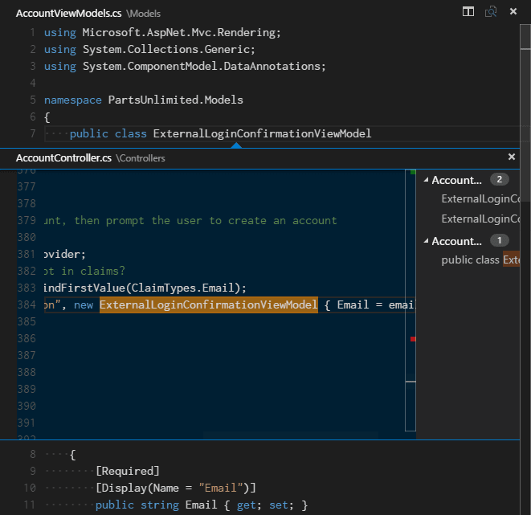
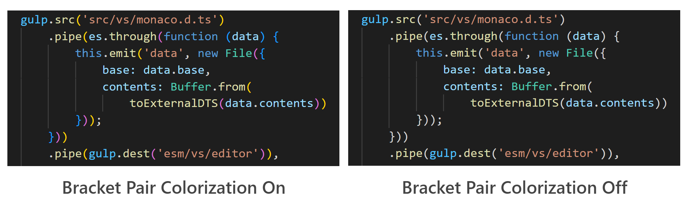

+++
title = "Code Navigation"
date = 2024-01-12T22:36:24+08:00
weight = 30
type = "docs"
description = ""
isCJKLanguage = true
draft = false
+++

> 原文: [https://code.visualstudio.com/docs/editor/editingevolved](https://code.visualstudio.com/docs/editor/editingevolved)

# Code Navigation 代码导航


Visual Studio Code has a high productivity code editor which, when combined with programming language services, gives you the power of an IDE and the speed of a text editor. In this topic, we'll first describe VS Code's language intelligence features (suggestions, parameter hints, smart code navigation) and then show the power of the core text editor.

​​	Visual Studio Code 具有高生产力的代码编辑器，当与编程语言服务结合使用时，它为你提供了 IDE 的强大功能和文本编辑器的速度。在本主题中，我们将首先介绍 VS Code 的语言智能功能（建议、参数提示、智能代码导航），然后展示核心文本编辑器的强大功能。

## [Quick file navigation 快速文件导航]()

> **Tip:** You can open any file by its name when you type Ctrl+P (**Quick Open**).
>
> ​​	提示：键入 Ctrl+P（快速打开）时，你可以按名称打开任何文件。

The Explorer is great for navigating between files when you are exploring a project. However, when you are working on a task, you will find yourself quickly jumping between the same set of files. VS Code provides two powerful commands to navigate in and across files with easy-to-use key bindings.

​​	在浏览项目时，资源管理器非常适合在文件之间导航。但是，当你处理一项任务时，你会发现自己在同一组文件之间快速跳转。VS Code 提供了两个强大的命令，可通过易于使用的键绑定在文件中和文件之间导航。

Hold Ctrl and press Tab to view a list of all files open in an editor group. To open one of these files, use Tab again to pick the file you want to navigate to, then release Ctrl to open it.

​​	按住 Ctrl 并按 Tab 可查看编辑器组中打开的所有文件的列表。要打开其中一个文件，请再次使用 Tab 选择要导航到的文件，然后释放 Ctrl 以将其打开。


Alternatively, you can use Alt+Left and Alt+Right to navigate between files and edit locations. If you are jumping around between different lines of the same file, these shortcuts allow you to navigate between those locations easily.

​​	或者，你可以使用 Alt+左箭头和 Alt+右箭头在文件和编辑位置之间导航。如果你在同一文件的不同行之间跳转，这些快捷方式可让你轻松地在这些位置之间导航。

## [Breadcrumbs 面包屑]()

The editor has a navigation bar above its contents called [Breadcrumbs](https://en.wikipedia.org/wiki/Breadcrumb_(navigation)). It shows the current location and allows you to quickly navigate between folders, files, and symbols.

​​	编辑器的内容上方有一个名为“面包屑”的导航栏。它显示当前位置，并允许您在文件夹、文件和符号之间快速导航。


Breadcrumbs always show the file path and, with the help of language extensions, the symbol path up to the cursor position. The symbols shown are the same as in Outline view and Go to Symbol.

​​	面包屑始终显示文件路径，并且借助语言扩展，还显示到光标位置的符号路径。显示的符号与“大纲”视图和“转到符号”中的符号相同。

Selecting a breadcrumb in the path displays a dropdown with that level's siblings so you can quickly navigate to other folders and files.

​​	选择路径中的面包屑会显示一个下拉列表，其中包含该级别的同级项，以便您可以快速导航到其他文件夹和文件。


If the current file type has language support for symbols, you will see the current symbol path and a dropdown of other symbols at the same level and below.

​​	如果当前文件类型对符号具有语言支持，您将看到当前符号路径以及同一级别及以下的其他符号的下拉列表。


You can turn off breadcrumbs with the **View** > **Show Breadcrumbs** toggle or with the `breadcrumbs.enabled` [setting]().

​​	您可以使用“视图”>“显示面包屑”切换按钮或 `breadcrumbs.enabled` 设置关闭面包屑。

### [Breadcrumb customization 面包屑自定义]()

The appearance of breadcrumbs can be customized. If you have very long paths or are only interested in either file paths or symbols paths, you can use the `breadcrumbs.filePath` and `breadcrumbs.symbolPath` settings. Both support `on`, `off`, and `last` and they define if or what part of the path you see. By default, breadcrumbs show file and symbol icons to the left of the breadcrumb but you can remove the icons by setting `breadcrumbs.icons` to false.

​​	可以自定义面包屑的外观。如果您有很长的路径或仅对文件路径或符号路径感兴趣，则可以使用 `breadcrumbs.filePath` 和 `breadcrumbs.symbolPath` 设置。两者都支持 `on` 、 `off` 和 `last` ，并且它们定义您看到路径的哪一部分或是否看到。默认情况下，面包屑在面包屑的左侧显示文件和符号图标，但您可以通过将 `breadcrumbs.icons` 设置为 false 来移除图标。

### [Symbol order in Breadcrumbs 面包屑中的符号顺序]()

You can control how symbols are ordered in the Breadcrumbs dropdown with the `breadcrumbs.symbolSortOrder` settings.

​​	您可以使用 `breadcrumbs.symbolSortOrder` 设置控制符号在面包屑下拉列表中的排序方式。

Allowed values are:

​​	允许的值有：

- `position` - position in the file (default)
  `position` - 文件中的位置（默认）
- `name` - alphabetical order
  `name` - 字母顺序
- `type` - symbol type order
  `type` - 符号类型顺序

### [Breadcrumb keyboard navigation 面包屑键盘导航]()

To interact with breadcrumbs, use the **Focus Breadcrumbs** command or press Ctrl+Shift+.. It will select that last element and open a dropdown that allows you to navigate to a sibling file or symbol. Use the Left and Right keyboard shortcuts to go to elements before or after the current element. When the dropdown appears, start typing - all matching elements will be highlighted and the best match will be selected for quick navigation.

​​	要与面包屑交互，请使用“聚焦面包屑”命令或按 Ctrl+Shift+..。它将选择最后一个元素并打开一个下拉列表，允许您导航到同级文件或符号。使用左右键盘快捷键可转到当前元素之前或之后的元素。当下拉列表出现时，开始键入 - 所有匹配的元素都将突出显示，并将选择最佳匹配项以快速导航。

You can also interact with breadcrumbs without the dropdown. Press Ctrl+Shift+; to focus the last element, use Left and Right to navigate, and use Space to reveal the element in the editor.

​​	您也可以在不使用下拉列表的情况下与面包屑进行交互。按 Ctrl+Shift+; 以聚焦最后一个元素，使用左右键导航，并使用空格键在编辑器中显示该元素。

## [Go to Definition 转到定义]()

If a [language]() supports it, you can go to the definition of a symbol by pressing F12.

​​	如果语言支持，您可以通过按 F12 转到符号的定义。

If you press Ctrl and hover over a symbol, a preview of the declaration will appear:

​​	如果按住 Ctrl 并将鼠标悬停在符号上，将显示声明的预览：


> **Tip:** You can jump to the definition with Ctrl+Click or open the definition to the side with Ctrl+Alt+Click.
>
> ​​	提示：您可以通过 Ctrl+单击跳转到定义，或通过 Ctrl+Alt+单击将定义打开到侧面。

## [Go to Type Definition 转到类型定义]()

Some [languages]() also support jumping to the type definition of a symbol by running the **Go to Type Definition** command from either the editor context menu or the **Command Palette**. This will take you to the definition of the type of a symbol. The command `editor.action.goToTypeDefinition` is not bound to a keyboard shortcut by default but you can add your own custom [keybinding]().

​​	某些语言还支持通过从编辑器上下文菜单或命令面板运行“转到类型定义”命令来跳转到符号的类型定义。这将带您到符号类型的定义。默认情况下，该命令 `editor.action.goToTypeDefinition` 未绑定到键盘快捷键，但您可以添加自己的自定义键绑定。

## [Go to Implementation 转到实现]()

[Languages]() can also support jumping to the implementation of a symbol by pressing Ctrl+F12. For an interface, this shows all the implementors of that interface and for abstract methods, this shows all concrete implementations of that method.

​​	语言还可以支持通过按 Ctrl+F12 跳转到符号的实现。对于接口，这将显示该接口的所有实现者，对于抽象方法，这将显示该方法的所有具体实现。

## [Go to Symbol 转到符号]()

You can navigate symbols inside a file with Ctrl+Shift+O. By typing : the symbols will be grouped by category. Press Up or Down and navigate to the place you want.

​​	使用 Ctrl+Shift+O 可以导航文件中的符号。通过键入 : 符号将按类别分组。按向上或向下键并导航到所需位置。


## [Open symbol by name 按名称打开符号]()

Some languages support jumping to a symbol across files with Ctrl+T. Type the first letter of a type you want to navigate to, regardless of which file contains it, and press Enter.

​​	某些语言支持使用 Ctrl+T 跳转到跨文件的符号。键入要导航到的类型的第一个字母，无论它包含在哪个文件中，然后按 Enter。


## [Peek 窥视]()

We think there's nothing worse than a big context switch when all you want is to quickly check something. That's why we support peeked editors. When you execute a **Go to References** search (via Shift+F12), or a **Peek Definition** (via Alt+F12), we embed the result inline:

​​	我们认为，当您只想快速检查某项内容时，没有什么比大的上下文切换更糟糕的了。这就是我们支持窥视编辑器的原因。当您执行转到引用搜索（通过 Shift+F12）或窥视定义（通过 Alt+F12）时，我们会将结果内嵌：



You can navigate between different references in the peeked editor and make quick edits right there. Clicking on the peeked editor filename or double-clicking in the result list will open the reference in the outer editor.

​​	您可以在窥视编辑器中导航到不同的引用，并在那里进行快速编辑。单击窥视编辑器文件名或在结果列表中双击将在外部编辑器中打开引用。

> **Tip:** Additionally, the peek window is closed if you press Escape or double-click in the peek editor region. You can disable this behavior with the `editor.stablePeek` [setting]().
>
> ​​	提示：此外，如果您按 Escape 或在窥视编辑器区域中双击，窥视窗口将关闭。您可以使用 `editor.stablePeek` 设置禁用此行为。

## [Bracket matching 括号匹配]()

Matching brackets will be highlighted as soon as the cursor is near one of them.

​​	当光标靠近其中一个括号时，匹配的括号将被突出显示。


> **Tip:** You can jump to the matching bracket with Ctrl+Shift+\
>
> ​​	提示：您可以使用 Ctrl+Shift+\ 跳转到匹配的括号

### [Bracket Pair Colorization 括号对颜色化]()

Matching bracket pairs can also be colorized by setting `editor.bracketPairColorization.enabled` to `true`.

​​	匹配的括号对也可以通过将 `editor.bracketPairColorization.enabled` 设置为 `true` 来进行颜色化。



All colors are themeable and up to six colors can be configured.

​​	所有颜色都是可设置主题的，并且最多可以配置六种颜色。

You can use `workbench.colorCustomizations` to override these theme-contributed colors in your settings:

​​	您可以在设置中使用 `workbench.colorCustomizations` 来覆盖这些主题贡献的颜色：

```
"workbench.colorCustomizations": {
    "editorBracketHighlight.foreground1": "#FFD700",
    "editorBracketHighlight.foreground2": "#DA70D6",
    "editorBracketHighlight.foreground3": "#179fff",
},
```

## [Reference information 引用信息]()

Some languages like C# support inline reference information, that is updated live. This allows you to quickly analyze the impact of your edit or the popularity of your specific method or property throughout your project:

​​	某些语言（如 C#）支持内联引用信息，该信息会实时更新。这使您可以快速分析编辑的影响或在整个项目中特定方法或属性的受欢迎程度：


> **Tip:** Directly invoke the **Peek References** action by clicking on these annotations.
>
> ​​	提示：通过单击这些注释直接调用“查看引用”操作。

> **Tip:** Reference information shown in CodeLens can be turned on or off through the `editor.codeLens` [setting]().
>
> ​​	提示：可以通过 `editor.codeLens` 设置打开或关闭 CodeLens 中显示的引用信息。

## [Rename symbol 重命名符号]()

Some languages support rename symbol across files. Press F2 and then type the new desired name and press Enter. All usages of the symbol will be renamed, across files.

​​	某些语言支持跨文件重命名符号。按 F2，然后键入新的所需名称并按 Enter。符号的所有用法都将在跨文件中重命名。


## [Errors & warnings 错误和警告]()

Warnings or Errors can be generated either via [configured tasks](), by rich language services, or by linters, that constantly analyze your code in the background. Since we love bug-free code, warnings and errors show up in multiple places:

​​	警告或错误可以通过配置的任务、丰富的语言服务或在后台持续分析代码的 linter 生成。由于我们喜欢无 bug 的代码，因此警告和错误会显示在多个位置：

- In the Status Bar, there is a summary of all errors and warnings counts.
  状态栏中汇总了所有错误和警告计数。
- You can click on the summary or press Ctrl+Shift+M to display the **PROBLEMS** panel with a list of all current errors.
  您可以单击摘要或按 Ctrl+Shift+M 以显示包含所有当前错误列表的“问题”面板。
- If you open a file that has errors or warnings, they will be rendered inline with the text and in the overview ruler.
  如果您打开包含错误或警告的文件，它们将与文本和概述标尺内联呈现。


> **Tip:** To loop through errors or warnings in the current file, you can press F8 or Shift+F8 which will show an inline zone detailing the problem and possible Code Actions (if available):
>
> ​​	提示：若要循环浏览当前文件中的错误或警告，您可以按 F8 或 Shift+F8，这将显示一个内联区域，详细说明问题和可能的代码操作（如果可用）：


## [Code Action 代码操作]()

Warnings and Errors can provide Code Actions (also known as Quick Fixes) to help fix issues. These will be displayed in the editor in the left margin as a lightbulb. Clicking on the lightbulb will either display the Code Action options or perform the action.

​​	警告和错误可以提供代码操作（也称为快速修复）来帮助解决问题。这些操作将以灯泡的形式显示在编辑器的左边缘。单击灯泡将显示代码操作选项或执行操作。

## [Inlay Hints 镶嵌提示]()

Some languages provide inlay hints: that is additional information about source code that is rendered inline. This is usually used to show inferred types. The sample below shows inlay hints that display the inferred types of JavaScript variables and function return types.

​​	某些语言提供内联提示：即内联呈现的有关源代码的其他信息。这通常用于显示推断出的类型。以下示例显示了显示 JavaScript 变量和函数返回类型的推断类型的内联提示。


Inlay hints can be enabled/disabled with the `editor.inlayHints.enabled` setting, the default is enabled. Extensions, like TypeScript or Rust, are needed to provide the actual inlay hint information.

​​	可以使用 `editor.inlayHints.enabled` 设置启用/禁用内联提示，默认情况下启用。需要 TypeScript 或 Rust 等扩展来提供实际的内联提示信息。

## [Outgoing link protection 外部链接保护]()

For your protection, VS Code displays a prompt before opening an outgoing website link from the editor.

​​	为了保护您，VS Code 会在从编辑器打开外部网站链接之前显示一个提示。


You can proceed to the external website in your browser or have the options to copy the link or cancel the request. If you choose **Configure Trusted Domains**, a dropdown lets you trust the exact URL, trust the URL domain and subdomains, or trust all domains to disable outgoing link protection.

​​	您可以继续在浏览器中访问外部网站，也可以选择复制链接或取消请求。如果您选择“配置受信任域”，则下拉列表允许您信任确切的 URL、信任 URL 域和子域，或信任所有域以禁用外部链接保护。


The option to **Manage Trusted Domains**, also available at any time from the Command Palette, brings up the **Trusted Domains** JSON file, where you can add, remove, or modify trusted domains.

​​	还可以随时从命令面板中找到的“管理受信任域”选项会打开“受信任域”JSON 文件，您可以在其中添加、删除或修改受信任域。

```
// You can use the "Manage Trusted Domains" command to open this file.
// Save this file to apply the trusted domains rules.
[
  "*.twitter.com"
]
```

The **Trusted Domains** JSON file also has comments with examples of the supported domain formats and a list of the domains trusted by default, such as `https://*.visualstudio.com` and `https://*.microsoft.com`.

​​	受信任的域 JSON 文件还包含有关受支持域格式的示例的注释，以及默认受信任的域列表，例如 `https://*.visualstudio.com` 和 `https://*.microsoft.com` 。

## [Next steps 后续步骤]()

Now that you know how the editor works, time to try a few other things...

​​	现在您已了解编辑器的工作原理，是时候尝试其他一些操作了...

- [Intro Video - Code Editing](https://code.visualstudio.com/docs/introvideos/codeediting) - Watch an introductory video on code editing features.
  简介视频 - 代码编辑 - 观看有关代码编辑功能的介绍性视频。
- [User Interface]() - In case you missed a basic orientation around VS Code.
  用户界面 - 以防您错过了 VS Code 的基本方向。
- [Key Bindings]() - Learn how to modify key bindings to your preference.
  键绑定 - 了解如何根据您的喜好修改键绑定。
- [Debugging]() - This is where VS Code really shines.
  调试 - 这是 VS Code 真正出彩的地方。

## [Common questions 常见问题]()

### [How can I automatically select the second entry in Quick Open instead of the first? 如何在快速打开中自动选择第二个条目而不是第一个条目？]()

With the command `workbench.action.quickOpenPreviousEditor`, you can have the second entry automatically selected in Quick Open. This can be useful if you want to select the previous entry from the list without having to invoke another keybinding:

​​	使用命令 `workbench.action.quickOpenPreviousEditor` ，您可以在快速打开中自动选择第二个条目。如果您想从列表中选择上一个条目而不必调用另一个键绑定，这会很有用：

```
[
  {
    "key": "ctrl+p",
    "command": "workbench.action.quickOpenPreviousEditor"
  },
  {
    "key": "ctrl+p",
    "command": "-workbench.action.quickOpen"
  }
]
```

### [How can I configure Ctrl+Tab to navigate across all editors of all groups 如何将 Ctrl+Tab 配置为在所有组的所有编辑器之间导航]()

By default, Ctrl+Tab navigates between editors of the same editor group. If you want to navigate across all opened editors in all groups, you can create keyboard shortcuts for the `workbench.action.quickOpenPreviousRecentlyUsedEditor` and `workbench.action.quickOpenLeastRecentlyUsedEditor` commands:

​​	默认情况下，Ctrl+Tab 在同一编辑器组的编辑器之间导航。如果您想在所有组中所有已打开的编辑器之间导航，可以为 `workbench.action.quickOpenPreviousRecentlyUsedEditor` 和 `workbench.action.quickOpenLeastRecentlyUsedEditor` 命令创建键盘快捷键：

```
[
  {
    "key": "ctrl+tab",
    "command": "workbench.action.quickOpenPreviousRecentlyUsedEditor",
    "when": "!inEditorsPicker"
  },
  {
    "key": "ctrl+shift+tab",
    "command": "workbench.action.quickOpenLeastRecentlyUsedEditor",
    "when": "!inEditorsPicker"
  }
]
```

### [How can I navigate between recently used editors without a picker 如何在没有选取器的情况下在最近使用的编辑器之间导航]()

Here is a list of commands you can use to navigate in editors without opening a picker:

​​	以下列出了可在编辑器中导航而不打开选择器的命令：

| Key               | Command 命令                                                 | Command ID 命令 ID                                       |
| :---------------- | :----------------------------------------------------------- | :------------------------------------------------------- |
| unassigned 未分配 | Open Next Recently Used Editor 打开最近使用的下一个编辑器    | `workbench.action.openNextRecentlyUsedEditor`            |
| unassigned 未分配 | Open Previously Used Editor 打开先前使用的编辑器             | `workbench.action.openPreviousRecentlyUsedEditor`        |
| unassigned 未分配 | Open Next Recently Used Editor in Group 在组中打开最近使用的下一个编辑器 | `workbench.action.openNextRecentlyUsedEditorInGroup`     |
| unassigned 未分配 | Open Previously Used Editor in Group 在组中打开先前使用的编辑器 | `workbench.action.openPreviousRecentlyUsedEditorInGroup` |

