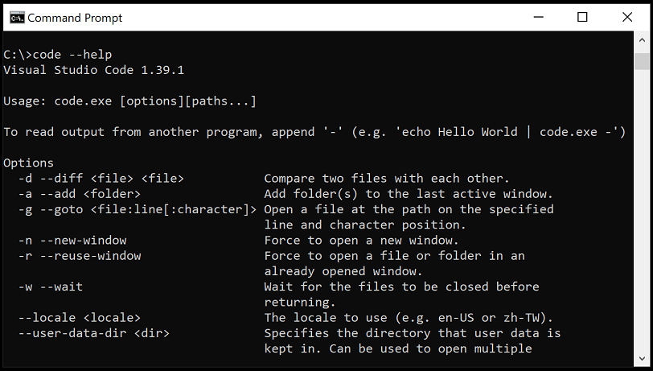
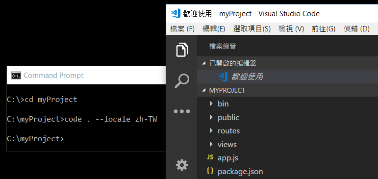
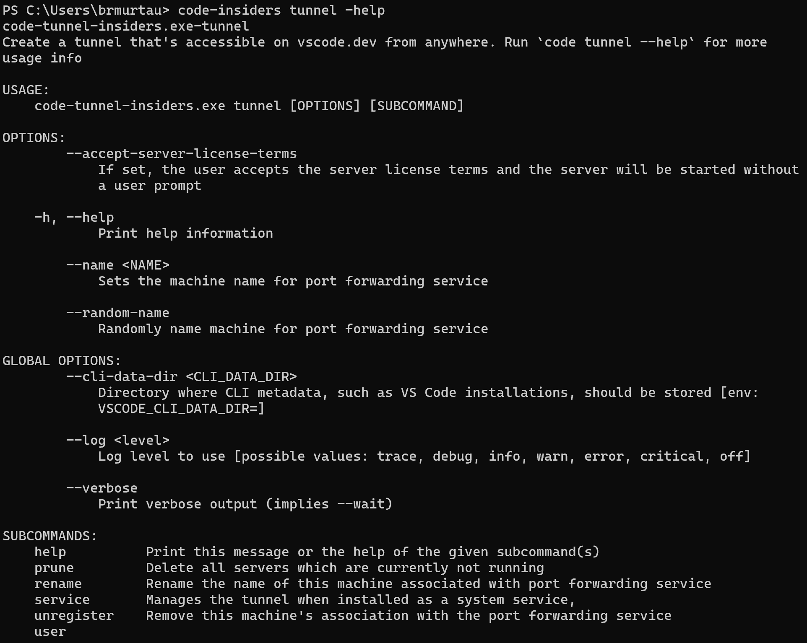

+++
title = "Command Line Interface"
date = 2024-01-12T22:36:24+08:00
weight = 130
type = "docs"
description = ""
isCJKLanguage = true
draft = false
+++

> 原文: [https://code.visualstudio.com/docs/editor/command-line](https://code.visualstudio.com/docs/editor/command-line)

# Command Line Interface (CLI) 命令行界面 (CLI)


Visual Studio Code has a powerful command-line interface built-in that lets you control how you launch the editor. You can open files, install extensions, change the display language, and output diagnostics through command-line options (switches).

​​	Visual Studio Code 内置了一个功能强大的命令行界面，可用于控制编辑器的启动方式。您可以通过命令行选项（开关）打开文件、安装扩展、更改显示语言和输出诊断信息。


If you are looking for how to run command-line tools inside VS Code, see the [Integrated Terminal]().

​​	如果您正在寻找如何在 VS Code 中运行命令行工具，请参阅集成终端。

## [Command line help 命令行帮助]()

To get an overview of the VS Code command-line interface, open a terminal or command prompt and type `code --help`. You will see the version, usage example, and list of command line options.

​​	若要获取 VS Code 命令行界面的概述，请打开终端或命令提示符并键入 `code --help` 。您将看到版本、用法示例和命令行选项列表。



## [Launching from command line 从命令行启动]()

You can launch VS Code from the command line to quickly open a file, folder, or project. Typically, you open VS Code within the context of a folder. To do this, from an open terminal or command prompt, navigate to your project folder and type `code .`:

​​	您可以从命令行启动 VS Code 以快速打开文件、文件夹或项目。通常，您在文件夹的上下文中打开 VS Code。为此，请从打开的终端或命令提示符导航到项目文件夹，然后键入 `code .` ：


**Note:** Users on macOS must first run a command (**Shell Command: Install 'code' command in PATH**) to add VS Code executable to the `PATH` environment variable. Read the [macOS setup guide]() for help.

​​	注意：macOS 上的用户必须先运行一个命令（Shell 命令：在 PATH 中安装“code”命令）才能将 VS Code 可执行文件添加到 `PATH` 环境变量中。有关帮助，请阅读 macOS 设置指南。

Windows and Linux installations should add the VS Code binaries location to your system path. If this isn't the case, you can manually add the location to the `Path` environment variable (`$PATH` on Linux). For example, on Windows, the default VS Code binaries location is `AppData\Local\Programs\Microsoft VS Code\bin`. To review platform-specific setup instructions, see [Setup]().

​​	Windows 和 Linux 安装应将 VS Code 二进制文件位置添加到系统路径。如果不是这种情况，您可以手动将位置添加到 `Path` 环境变量（在 Linux 上为 `$PATH` ）。例如，在 Windows 上，默认的 VS Code 二进制文件位置是 `AppData\Local\Programs\Microsoft VS Code\bin` 。要查看特定于平台的设置说明，请参阅设置。

> **Insiders:** If you are using the VS Code [Insiders](https://code.visualstudio.com/insiders) preview, you launch your Insiders build with `code-insiders`.
>
> ​​	内部人员：如果您使用的是 VS Code 内部人员预览版，则可以使用 `code-insiders` 启动内部人员版本。

## [Core CLI options 核心 CLI 选项]()

Here are optional arguments you can use when starting VS Code at the command line via `code`:

​​	以下是通过 `code` 在命令行启动 VS Code 时可以使用的一些可选参数：

| Argument 参数                                                | Description 说明                                             |
| :----------------------------------------------------------- | :----------------------------------------------------------- |
| `-h` or `--help` `-h` 或 `--help`                            | Print usage 打印用法                                         |
| `-v` or `--version` `-v` 或 `--version`                      | Print VS Code version (for example, 1.22.2), GitHub commit ID, and architecture (for example, x64). 打印 VS Code 版本（例如，1.22.2）、GitHub 提交 ID 和体系结构（例如，x64）。 |
| `-n` or `--new-window` `-n` 或 `--new-window`                | Opens a new session of VS Code instead of restoring the previous session (default). 打开新的 VS Code 会话，而不是还原以前的会话（默认）。 |
| `-r` or `--reuse-window` `-r` 或 `--reuse-window`            | Forces opening a file or folder in the last active window. 强制在上次活动的窗口中打开文件或文件夹。 |
| `-g` or `--goto` `-g` 或 `--goto`                            | When used with *file:line{:character}*, opens a file at a specific line and optional character position. This argument is provided since some operating systems permit `:` in a file name. 与 file:line{:character} 一起使用时，在特定行和可选字符位置打开文件。提供此参数是因为某些操作系统允许在文件名中使用 `:` 。 |
| `-d` or `--diff <file1> <file2>` `-d` 或 `--diff <file1> <file2>` | Open a file difference editor. Requires two file paths as arguments. 打开文件差异编辑器。需要两个文件路径作为参数。 |
| `-m` or `--merge <path1> <path2> <base> <result>` `-m` 或 `--merge <path1> <path2> <base> <result>` | Perform a three-way merge by providing paths for two modified versions of a file, the common origin of both modified versions, and the output file to save merge results. 通过提供两个修改版本的文件路径、两个修改版本文件的公共源文件以及保存合并结果的输出文件来执行三向合并。 |
| `-w` or `--wait` `-w` 或 `--wait`                            | Wait for the files to be closed before returning. 等待文件关闭后再返回。 |
| `--locale <locale>`                                          | Set the [display language]() (locale) for the VS Code session. (for example, `en-US` or `zh-TW`) 设置 VS Code 会话的显示语言（区域设置）。（例如， `en-US` 或 `zh-TW` ） |



## [Opening Files and Folders 打开文件和文件夹]()

Sometimes you will want to open or create a file. If the specified file does not exist, VS Code will create them for you along with any new intermediate folders:

​​	有时您会想要打开或创建文件。如果指定的文件不存在，VS Code 会为您创建它们以及任何新的中间文件夹：

```
code index.html style.css documentation\readme.md
```

For both files and folders, you can use absolute or relative paths. Relative paths are relative to the current directory of the command prompt where you run `code`.

​​	对于文件和文件夹，您可以使用绝对路径或相对路径。相对路径相对于您运行 `code` 的命令提示符的当前目录。

If you specify more than one file at the command line, VS Code will open only a single instance.

​​	如果您在命令行中指定多个文件，VS Code 将只打开一个实例。

If you specify more than one folder at the command line, VS Code will create a [Multi-root Workspace]() including each folder.

​​	如果您在命令行中指定多个文件夹，VS Code 将创建一个包含每个文件夹的多根工作区。

| Argument 参数           | Description 说明                                             |
| :---------------------- | :----------------------------------------------------------- |
| `file`                  | Name of a file to open. If the file doesn't exist, it will be created and marked as edited. You can specify multiple files by separating each file name with a space. 要打开的文件的名称。如果文件不存在，它将被创建并标记为已编辑。您可以通过用空格分隔每个文件名来指定多个文件。 |
| `file:line[:character]` | Used with the `-g` argument. Name of a file to open at the specified line and optional character position. 与 `-g` 参数一起使用。要在指定行和可选字符位置打开的文件的名称。 |
| `folder`                | Name of a folder to open. You can specify multiple folders and a new [Multi-root Workspace]() is created. 要打开的文件夹的名称。您可以指定多个文件夹，并创建一个新的多根工作区。 |


## [Select a profile 选择配置文件]()

You can launch VS Code with a specific [profile]() via the `--profile` command-line interface option. You pass the name of the profile after the `--profile` argument and open a folder or a workspace using that profile. The command line below opens the `web-sample` folder with the "Web Development" profile:

​​	您可以通过 `--profile` 命令行界面选项使用特定配置文件启动 VS Code。您在 `--profile` 参数后传递配置文件的名称，并使用该配置文件打开文件夹或工作区。以下命令行使用“Web 开发”配置文件打开 `web-sample` 文件夹：

```
code ~/projects/web-sample --profile "Web Development"
```

If the profile specified does not exist, a new empty profile with the given name is created.

​​	如果指定的配置文件不存在，则会创建一个具有给定名称的新空配置文件。

## [Working with extensions 使用扩展]()

You can install and manage VS Code [extensions]() from the command line.

​​	您可以从命令行安装和管理 VS Code 扩展。

| Argument 参数                 | Description 说明                                             |
| :---------------------------- | :----------------------------------------------------------- |
| `--install-extension <ext>`   | Install an extension. Provide the full extension name `publisher.extension` as an argument. Use `--force` argument to avoid prompts. 安装扩展。提供完整的扩展名 `publisher.extension` 作为参数。使用 `--force` 参数以避免提示。 |
| `--uninstall-extension <ext>` | Uninstall an extension. Provide the full extension name `publisher.extension` as an argument. 卸载扩展。提供完整的扩展名 `publisher.extension` 作为参数。 |
| `--disable-extensions`        | Disable all installed extensions. Extensions will still be visible in the **Disabled** section of the Extensions view but they will never be activated. 禁用所有已安装的扩展。扩展仍将在扩展视图的已禁用部分中可见，但它们永远不会被激活。 |
| `--list-extensions`           | List the installed extensions. 列出已安装的扩展。            |
| `--show-versions`             | Show versions of installed extensions, when using `--list-extensions` 在使用 `--list-extensions` 时显示已安装扩展的版本 |
| `--enable-proposed-api <ext>` | Enables proposed api features for an extension. Provide the full extension name `publisher.extension` as an argument. 为扩展启用建议的 API 功能。提供完整的扩展名 `publisher.extension` 作为参数。 |


## [Advanced CLI options 高级 CLI 选项]()

There are several CLI options that help with reproducing errors and advanced setup.

​​	有几个 CLI 选项可帮助重现错误和高级设置。

| Argument 参数            | Description 说明                                             |
| :----------------------- | :----------------------------------------------------------- |
| `--extensions-dir <dir>` | Set the root path for extensions. 设置扩展的根路径。 Overridden in [Portable Mode](https://code.visualstudio.com/docs/editor/portable) by the `data` folder. 在便携模式下由 `data` 文件夹覆盖。 |
| `--user-data-dir <dir>`  | Specifies the directory that user data is kept in, useful when running as root. 指定保存用户数据的目录，在以 root 身份运行时很有用。 Overridden in [Portable Mode](https://code.visualstudio.com/docs/editor/portable) by the `data` folder. 在便携模式下由 `data` 文件夹覆盖。 |
| `-s, --status`           | Print process usage and diagnostics information. 打印进程使用情况和诊断信息。 |
| `-p, --performance`      | Start with the **Developer: Startup Performance** command enabled. 从启用“开发人员：启动性能”命令开始。 |
| `--disable-gpu`          | Disable GPU hardware acceleration. 禁用 GPU 硬件加速。       |
| `--verbose`              | Print verbose output (implies `--wait`). 打印详细输出（暗示 `--wait` ）。 |
| `--prof-startup`         | Run CPU profiler during startup. 在启动期间运行 CPU 分析器。 |
| `--upload-logs`          | Uploads logs from current session to a secure endpoint. 将当前会话的日志上传到安全端点。 |
| **Multi-root 多根**      |                                                              |
| `--add <dir>`            | Add folder(s) to the last active window for a multi-root workspace. 将文件夹添加到多根工作区的最后一个活动窗口。 |

### [Create remote tunnel 创建远程隧道]()

VS Code integrates with other [remote environments]() to become even more powerful and flexible. Our goal is to provide a cohesive experience that allows you to manage both local and remote machines from one, unified CLI.

​​	VS Code 与其他远程环境集成，变得更加强大和灵活。我们的目标是提供一种连贯的体验，允许您从一个统一的 CLI 管理本地和远程计算机。

The Visual Studio Code [Remote - Tunnels](https://marketplace.visualstudio.com/items?itemName=ms-vscode.remote-server) extension lets you connect to a remote machine, like a desktop PC or VM, via a secure tunnel. Tunneling securely transmits data from one network to another. You can then securely connect to that machine from anywhere, without the requirement of SSH.

​​	Visual Studio Code Remote - Tunnels 扩展程序可让您通过安全隧道连接到远程计算机（如台式机或虚拟机）。隧道传输可安全地将数据从一个网络传输到另一个网络。然后，您可以从任何地方安全地连接到该计算机，而无需 SSH。

We've built functionality into the `code` CLI that will initiate tunnels on remote machines. You can run:

​​	我们在 `code` CLI 中构建了将在远程计算机上启动隧道的功能。您可以运行：

```
code tunnel
```

to create a tunnel on your remote machine. You may connect to this machine through a web or desktop VS Code client.

​​	以在远程计算机上创建隧道。您可以通过 Web 或桌面 VS Code 客户端连接到此计算机。

You can review the other tunneling commands by running `code tunnel -help`:

​​	您可以通过运行 `code tunnel -help` 来查看其他隧道传输命令：



As you may need to run the CLI on a remote machine that can't install VS Code Desktop, the CLI is also available for standalone install on the [VS Code download page](https://code.visualstudio.com/insiders/).

​​	由于您可能需要在无法安装 VS Code Desktop 的远程计算机上运行 CLI，因此 CLI 也可用于在 VS Code 下载页面上独立安装。

For more information on Remote Tunnels, you can review the [Remote Tunnels documentation]().

​​	有关远程隧道的更多信息，您可以查看远程隧道文档。

## [Opening VS Code with URLs 使用 URL 打开 VS Code]()

You can also open projects and files using the platform's URL handling mechanism. Use the following URL formats to:

​​	您还可以使用平台的 URL 处理机制打开项目和文件。使用以下 URL 格式来：

Open a project

​​	打开项目

```
vscode://file/{full path to project}/

vscode://file/c:/myProject/
```

Open a file

​​	打开文件

```
vscode://file/{full path to file}

vscode://file/c:/myProject/package.json
```

Open a file to line and column

​​	打开文件到行和列

```
vscode://file/{full path to file}:line:column

vscode://file/c:/myProject/package.json:5:10
```

You can use the URL in applications such as browsers or file explorers that can parse and redirect the URL. For example, on Windows, you could pass a `vscode://` URL directly to the Windows Explorer or to the command line as `start vscode://{full path to file}`.

​​	您可以在浏览器或文件资源管理器等应用程序中使用 URL，这些应用程序可以解析和重定向 URL。例如，在 Windows 上，您可以将 `vscode://` URL 直接传递给 Windows 资源管理器或命令行，作为 `start vscode://{full path to file}` 。


> **Note**: If you are using VS Code [Insiders](https://code.visualstudio.com/insiders) builds, the URL prefix is `vscode-insiders://`.
>
> ​​	注意：如果您使用的是 VS Code Insiders 内部版本，则 URL 前缀为 `vscode-insiders://` 。

## [Next steps 后续步骤]()

Read on to find out about:

​​	继续阅读以了解：

- [Integrated Terminal]() - Run command-line tools from inside VS Code.
  集成终端 - 从 VS Code 内部运行命令行工具。
- [Basic Editing]() - Learn the basics of the VS Code editor.
  基本编辑 - 了解 VS Code 编辑器的基础知识。
- [Code Navigation]() - VS Code lets you quickly understand and move through your source code.
  代码导航 - VS Code 允许您快速理解和浏览源代码。

## [Common questions 常见问题]()

### ['code' is not recognized as an internal or external command 'code' 未被识别为内部或外部命令]()

Your OS cannot find the VS Code binary `code` on its path. The VS Code Windows and Linux installations should have installed VS Code on your path. Try uninstalling and reinstalling VS Code. If `code` is still not found, consult the platform-specific setup topics for [Windows]() and [Linux]().

​​	您的操作系统无法在其路径上找到 VS Code 二进制文件 `code` 。VS Code Windows 和 Linux 安装应已在您的路径上安装 VS Code。尝试卸载并重新安装 VS Code。如果仍然找不到 `code` ，请参阅 Windows 和 Linux 的特定于平台的安装主题。

On macOS, you need to manually run the **Shell Command: Install 'code' command in PATH** command (available through the **Command Palette** Ctrl+Shift+P). Consult the [macOS]() specific setup topic for details.

​​	在 macOS 上，您需要手动运行 Shell 命令：在 PATH 命令中安装“code”命令（可通过命令面板 Ctrl+Shift+P 获得）。有关详细信息，请参阅 macOS 特定的安装主题。

### [How do I get access to a command line (terminal) from within VS Code? 如何从 VS Code 内部访问命令行（终端）？]()

VS Code has an [Integrated Terminal]() where you can run command-line tools from within VS Code.

​​	VS Code 具有一个集成终端，您可以在其中运行 VS Code 内部的命令行工具。

### [Can I specify the settings location for VS Code in order to have a portable version? 我可以指定 VS Code 的设置位置，以便拥有一个便携版本吗？]()

Not directly through the command line, but VS Code has a [Portable Mode](https://code.visualstudio.com/docs/editor/portable), which lets you keep settings and data in the same location as your installation, for example, on a USB drive.

​​	不能直接通过命令行，但 VS Code 具有便携模式，该模式允许您将设置和数据保存在与安装位置相同的位置，例如 USB 驱动器上。

### [How do I detect when a shell was launched by VS Code? 如何检测 VS Code 启动了某个 shell？]()

When VS Code starts up, it may launch a shell in order to source the "shell environment" to help set up tools. This will launch an **interactive login** shell and fetch its environment. Depending on your shell setup, this may cause problems. For example, it may be unexpected that the shell is launched as an interactive session, which VS Code needs in order to try to align `$PATH` with the exact value in a user created terminal.

​​	VS Code 启动时，可能会启动一个 shell，以便获取“shell 环境”来帮助设置工具。这将启动一个交互式登录 shell 并获取其环境。根据您的 shell 设置，这可能会导致问题。例如，shell 启动为交互式会话可能会出乎意料，VS Code 需要此会话才能尝试将 `$PATH` 与用户创建的终端中的确切值对齐。

Whenever VS Code launches this initial shell, VS Code sets the variable `VSCODE_RESOLVING_ENVIRONMENT` to `1`. If your shell or user scripts need to know if they are being run in the context of this shell, you can check the `VSCODE_RESOLVING_ENVIRONMENT` value.

​​	每当 VS Code 启动此初始 shell 时，VS Code 会将变量 `VSCODE_RESOLVING_ENVIRONMENT` 设置为 `1` 。如果您的 shell 或用户脚本需要知道它们是否在此 shell 的上下文中运行，则可以检查 `VSCODE_RESOLVING_ENVIRONMENT` 值。
