+++
title = "Custom Layout"
date = 2024-01-12T22:36:24+08:00
weight = 170
type = "docs"
description = ""
isCJKLanguage = true
draft = false
+++

> 原文: [https://code.visualstudio.com/docs/editor/custom-layout](https://code.visualstudio.com/docs/editor/custom-layout)

# Custom Layout 自定义布局

Visual Studio Code comes with a simple user interface and convenient default layout. At the same time, VS Code provides options and settings to let you customize the UI layout to suit your preferences and work style. In this topic, we'll highlight various UI customizations so you can display views, editors, and panels in the way that's most productive for you.

​​	Visual Studio Code 具有简单的用户界面和方便的默认布局。同时，VS Code 提供选项和设置，以便您可以自定义 UI 布局以适应您的偏好和工作方式。在本主题中，我们将重点介绍各种 UI 自定义，以便您可以以最有效的方式显示视图、编辑器和面板。

> **Note**: If you are new to VS Code, you may want to start with the [user interface overview]() or take a look at the [Tips and Tricks]() article.
>
> ​​	注意：如果您是 VS Code 新手，您可能需要从用户界面概述开始，或查看提示和技巧文章。

This article starts by discussing [Workbench]() customizations to rearrange UI elements such as the side bars, views, and panels. Later in the article, we'll cover customization of the [Editor]() region with editor groups, split editors, and editor tabs.

​​	本文首先讨论工作台自定义，以重新排列 UI 元素，例如侧边栏、视图和面板。在本文的后面部分，我们将介绍使用编辑器组、拆分编辑器和编辑器选项卡自定义编辑器区域。

## [Workbench 工作台]()

### [Primary side bar 主侧边栏]()

The default (Primary) side bar shows views such as the File Explorer, Search, and Source Control on the left of the workbench. If you'd prefer it on the right, you can:

​​	默认（主）侧边栏在工作台的左侧显示视图，例如文件资源管理器、搜索和源代码管理。如果您更喜欢在右侧，则可以：

- Right-click the Activity bar and select **Move Primary Side Bar Right**.
  右键单击活动栏，然后选择移动主侧边栏到右侧。
- Run **View: Toggle Primary Side Bar Position** to switch the Primary side bar right and left.
  运行视图：切换主侧边栏位置以切换主侧边栏的左右位置。
- Set the **Workbench > Side Bar: Location** (`workbench.sideBar.location`) [setting]() to `right`.
  将工作台 > 侧边栏：位置 ( `workbench.sideBar.location` ) 设置为 `right` 。

### [Secondary side bar 次要侧边栏]()

By default, VS Code shows all views in the **Primary Side Bar** located to the left of the editor region. If you like another place to display views, you can open the **Secondary Side Bar** to the right and drag and drop views into that side bar.

​​	默认情况下，VS Code 在编辑器区域左侧的主边栏中显示所有视图。如果您喜欢在其他位置显示视图，可以打开右侧的辅助边栏，并将视图拖放到该边栏中。

This can be useful if you'd like to see two views at the same time, for example, the File Explorer on the left and Source Control view on the right:

​​	这在您希望同时查看两个视图时非常有用，例如，左侧的文件资源管理器和右侧的源代码管理视图：

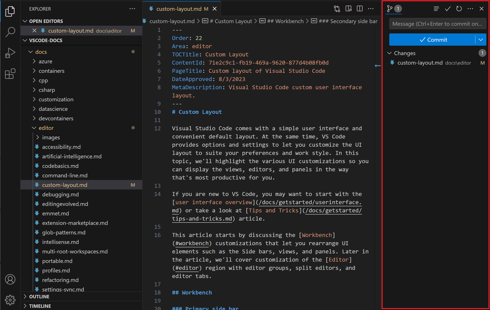

To display the Secondary side bar, you can:

​​	要显示辅助边栏，您可以：

- Run **View: Toggle Secondary Side Bar Visibility** (Ctrl+Alt+B).
  运行视图：切换辅助边栏可见性 (Ctrl+Alt+B)。
- Check the **View** > **Appearance** > **Secondary Side Bar** menu item.
  选中视图 > 外观 > 辅助边栏菜单项。

The Secondary side bar is initially empty but you can drag and drop views and panels into it and the layout is preserved across your VS Code sessions.

​​	辅助边栏最初是空的，但您可以将视图和面板拖放到其中，并且布局会保留在您的 VS Code 会话中。

> **Note**: You can reset views and panels back to their default locations with the **View: Reset View Locations** command.
>
> ​​	注意：您可以使用视图：重置视图位置命令将视图和面板重置回其默认位置。

### [Activity bar position 活动栏位置]()

By default, the Activity bar moves with the Primary side bar and remains on the outer edge of the workbench. You can also choose to hide the Activity bar or move it to the top of the Primary side bar. The **Activity Bar Position** menu available from the Activity bar context menu or under **View** > **Appearance** has the options **Side**, **Top**, or **Hidden**.

​​	默认情况下，活动栏会随着主边栏移动，并保持在工作台的外边缘。您还可以选择隐藏活动栏或将其移动到主边栏的顶部。活动栏上下文菜单或视图 > 外观下提供的活动栏位置菜单具有侧面、顶部或隐藏选项。

When the Activity bar is in the top position, the **Account** and **Manage** buttons, usually at the bottom of the Activity bar, move to the right side of the title bar.

​​	当活动栏位于顶部位置时，通常位于活动栏底部的帐户和管理按钮会移至标题栏右侧。

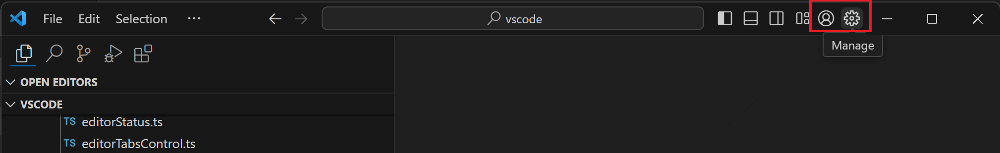

### [Panel 面板]()

The Panel region displays UI elements such as the Problems, Terminal, and Output panels and by default is located under the editor region.

​​	面板区域显示 UI 元素，例如问题、终端和输出面板，默认情况下位于编辑器区域下方。

### [Panel position 面板位置]()

You can also move the region to the left or right of the editor with the **Move Panel** commands:

​​	您还可以使用移动面板命令将区域移至编辑器的左侧或右侧：

- **View: Move Panel Left** (`workbench.action.positionPanelLeft`)
  视图：向左移动面板 ( `workbench.action.positionPanelLeft` )
- **View: Move Panel Right** (`workbench.action.positionPanelRight`)
  视图：向右移动面板 ( `workbench.action.positionPanelRight` )
- **View: Move Panel To Bottom** (`workbench.action.positionPanelBottom`)
  视图：将面板移至底部 ( `workbench.action.positionPanelBottom` )

You can configure these options in the menu under **View** > **Appearance** > **Panel Position**, Panel title bar context menu, or using the new **View: Move Panel** commands.

​​	您可以在视图 > 外观 > 面板位置、面板标题栏上下文菜单下或使用新的视图：移动面板命令中配置这些选项。

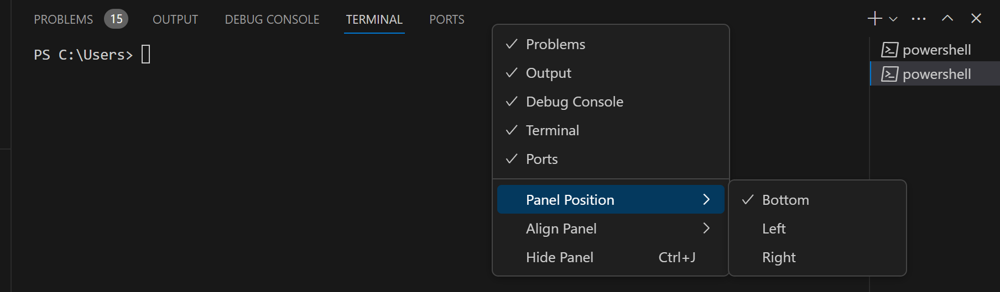

### [Panel alignment 面板对齐]()

This option lets you configure how far the bottom Panel spans across your window. There are four options:

​​	此选项允许您配置底部面板在窗口中的跨度。有四个选项：

- **Center** - This is the default behavior. The panel spans the width of the editor area only.
  居中 - 这是默认行为。面板仅跨编辑器区域的宽度。
- **Justify** - The panel spans the full width of the window.
  两端对齐 - 面板跨窗口的整个宽度。
- **Left** - The panel spans from the left edge of the window to the right edge of the editor area.
  左 - 面板从窗口的左边缘跨到编辑器区域的右边缘。
- **Right** - The panel spans from the right edge of the window to the left edge of the editor area.
  右 - 面板从窗口的右边缘跨到编辑器区域的左边缘。

With all Panel alignment options, the Activity Bar is considered the edge of the window.

​​	对于所有面板对齐选项，活动栏被视为窗口的边缘。

You can configure these options in the menu under **View** > **Appearance** > **Align Panel**, Panel title context menu, or using the new **Set Panel Alignment to...** commands.

​​	您可以在“视图”>“外观”>“对齐面板”、“面板标题上下文菜单”下的菜单中配置这些选项，或使用新的“将面板对齐方式设置为...”命令。

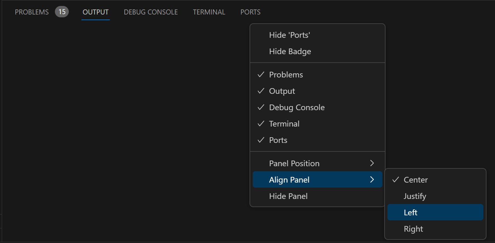

### [Maximize Panel size 最大化面板大小]()

When the Panel alignment is **Center**, you can quickly toggle the Panel region to fill the entire editor area with the **Maximize Panel Size** chevron button in the upper right of the Panel region. The chevron button points downwards in the maximized panel to restore the panel to the original size.

​​	当面板对齐方式为“居中”时，您可以快速切换面板区域以使用面板区域右上角的最大化面板大小人字形按钮填充整个编辑器区域。在最大化面板中，人字形按钮指向下方以将面板恢复到原始大小。

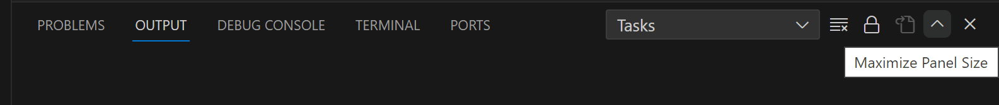

You can also maximize the Panel region via the **View: Toggle Maximized Panel** command.

​​	您还可以通过“视图：切换最大化面板”命令最大化面板区域。

> **Note**: Besides customizing the overall Panel region display, individual panels may have their own layout customizations. For example, the Terminal lets you have [multiple open tabs]() and [split existing terminals]().
>
> ​​	注意：除了自定义整体面板区域显示外，各个面板可能都有自己的布局自定义。例如，终端允许您打开多个选项卡并拆分现有终端。

### [Customize Layout control 自定义布局控件]()

The VS Code title bar also has buttons to toggle the visibility of the main UI elements (Side bars and Panel region).

​​	VS Code 标题栏还具有按钮，用于切换主 UI 元素（侧边栏和面板区域）的可见性。

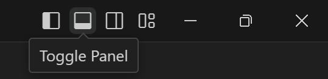

The rightmost button brings up the **Customize Layout** dropdown, where you can further change the visibility and layout of various UI elements and includes several layout modes:

​​	最右边的按钮会调出“自定义布局”下拉列表，您可以在其中进一步更改各种 UI 元素的可见性和布局，并包括几种布局模式：

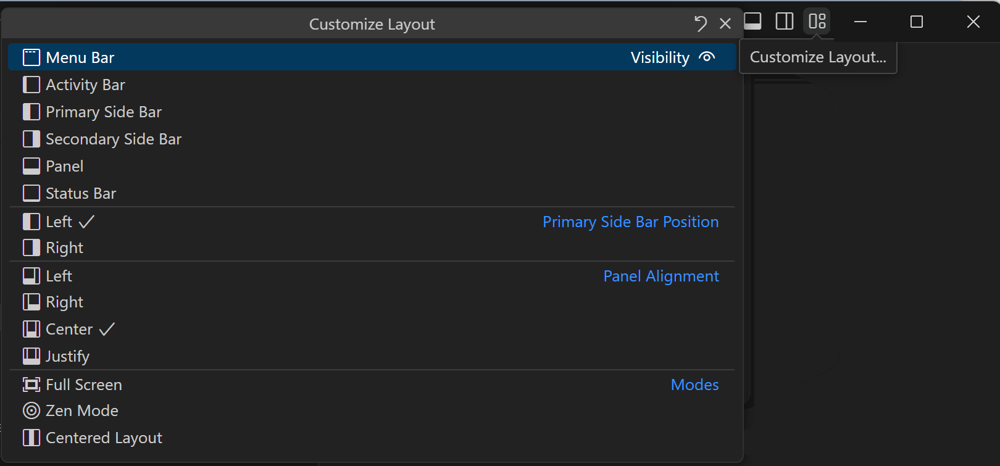

The layout modes are:

​​	布局模式包括：

- **Full Screen** - Set the editor to fill the full display screen. **View: Toggle Full Screen** (F11).
  全屏 - 将编辑器设置为填满整个显示屏。视图：切换全屏 (F11)。
- **Zen Mode** - Hide all UI except for the editor area. **View: Toggle Zen Mode** (Ctrl+K Z).
  Zen 模式 - 隐藏除编辑器区域之外的所有 UI。视图：切换 Zen 模式 (Ctrl+K Z)。
- **Centered Layout** - Centers the editor inside the editor region. **View: Toggle Centered Layout**.
  居中布局 - 将编辑器置中于编辑器区域内。视图：切换居中布局。

### [Drag and drop views and panels 拖放视图和面板]()

VS Code has a default layout of views and panels in the Primary Side bar and Panel region but you can drag and drop views and panels between these regions. For example, you can drag and drop the Source Control view into the Panel region or put the Problems panel into the Primary Side bar:

​​	VS Code 在主侧边栏和面板区域中具有默认的视图和面板布局，但您可以在这些区域之间拖放视图和面板。例如，您可以将源代码管理视图拖放到面板区域，或将问题面板放入主侧边栏：

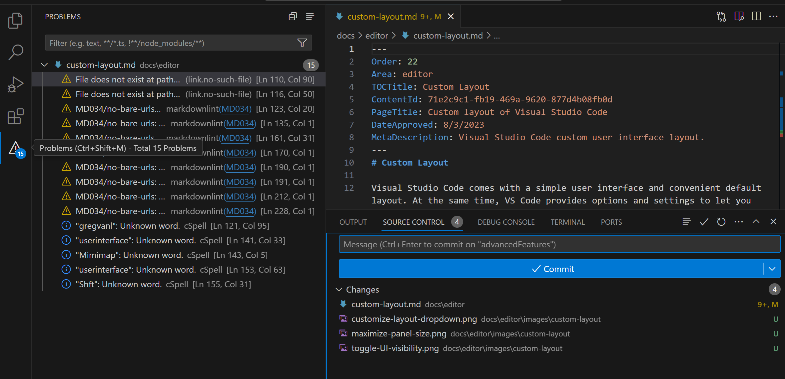

> **Note**: Remember that you can reset a view and panel back to its default location with the **Reset Location** context menu item or all views and panels with the general **View: Reset View Locations** command.
>
> ​​	注意：您可以使用“重置位置”上下文菜单项将视图和面板重置为其默认位置，或使用常规“视图：重置视图位置”命令将所有视图和面板重置为其默认位置。

You can also add views and panels to existing view or panel to create groups. For example, you could move the Output panel to the Explorer view group by dragging over the Explorer Activity bar item and then dropping into the view:

​​	您还可以将视图和面板添加到现有视图或面板中以创建组。例如，您可以通过拖动“资源管理器”活动栏项，然后将其拖放到视图中，将“输出”面板移动到“资源管理器”视图组：

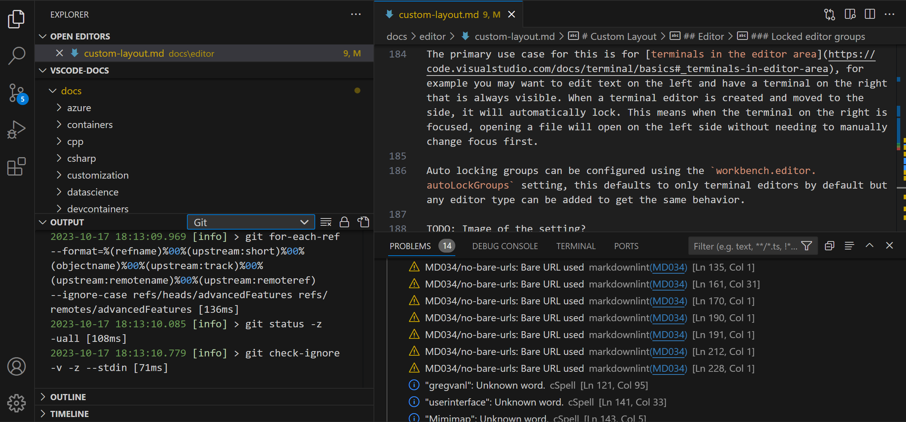

You are not limited to using the mouse for moving views and panels. You can also customize layouts via the keyboard with the **View: Move View** and **View: Move Focused View** commands, where dropdowns let you pick the UI element to move and the destination, either a location like the Side bar or Panel region or an existing view or panel to create a group.

​​	您不必局限于使用鼠标来移动视图和面板。您还可以通过键盘使用“视图：移动视图”和“视图：移动焦点视图”命令来自定义布局，其中下拉菜单可让您选择要移动的 UI 元素和目标位置，例如侧边栏或面板区域，或现有视图或面板以创建组。

## [Tool bars 工具栏]()

Most VS Code views and panels have tool bars displayed on the top right of their UI. For example, the Search view has a tool bar with actions such as **Refresh**, **Clear Search Results**, etc.:

​​	大多数 VS Code 视图和面板在 UI 的右上角显示工具栏。例如，“搜索”视图具有一个工具栏，其中包含“刷新”、“清除搜索结果”等操作：

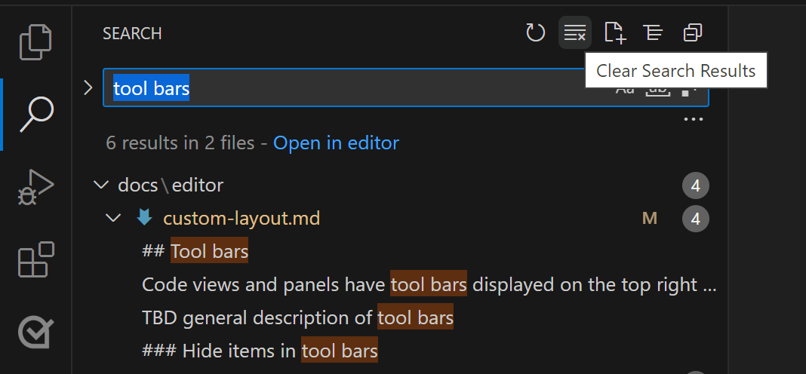

### [Hide items in tool bars 隐藏工具栏中的项目]()

If you think a tool bar is too busy and you'd like to hide less frequently used actions, you can right-click on any action and select its **Hide** command (for example **Hide 'Clear Search Results'**) or uncheck any of the actions from the dropdown. Hidden actions are moved to the `...` **More Actions** menu and can be invoked from there.

​​	如果您认为工具栏太繁忙，并且您想隐藏不常用的操作，则可以右键单击任何操作并选择其“隐藏”命令（例如“隐藏‘清除搜索结果’”），或取消选中下拉列表中的任何操作。隐藏的操作将移至 `...` “更多操作”菜单，并可从此处调用。

To restore an action to the tool bar, right-click the tool bar button area and select the **Reset Menu** command or recheck the hidden action. To restore all menus in VS Code, run **View: Reset All Menus** from the Command Palette (Ctrl+Shift+P).

​​	要将操作还原到工具栏，请右键单击工具栏按钮区域并选择“重置菜单”命令，或重新选中隐藏的操作。要还原 VS Code 中的所有菜单，请从命令面板（Ctrl+Shift+P）运行“视图：重置所有菜单”。

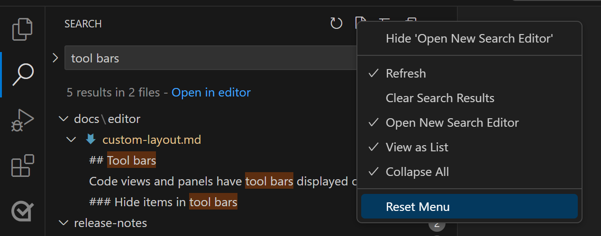

## [Editor 编辑器]()

You can customize the layout of the VS Code editor region independently of the workbench user interface. By default, the editor region displays useful features such as the minimap, breadcrumbs, editor tabs, and has optional UI such as Sticky Scroll. You can also adjust the layout of the editors themselves.

​​	您可以独立于工作台用户界面自定义 VS Code 编辑器区域的布局。默认情况下，编辑器区域会显示有用的功能，例如小地图、面包屑、编辑器选项卡，并具有可选的 UI，例如粘性滚动。您还可以调整编辑器本身的布局。

### [Minimap and breadcrumbs 小地图和面包屑]()

The **View** > **Appearance** menu has a section for customizing the editor region. There you'll find toggles for:

​​	“视图”>“外观”菜单有一个用于自定义编辑器区域的部分。您将在那里找到以下切换项：

- **Minimap** - A [visual overview]() of your current file. **View: Toggle Minimap**.
  小地图 - 当前文件的可视概述。视图：切换小地图。
- **Breadcrumbs** - Display [folder, file, and current symbol]() information for the active file. **View: Toggle Breadcrumbs**.
  面包屑 - 显示活动文件的文件夹、文件和当前符号信息。视图：切换面包屑。
- **Sticky Scroll** - Display [nested symbol scopes]() in the active file. **View: Toggle Sticky Scroll**.
  粘性滚动 - 在活动文件中显示嵌套符号范围。视图：切换粘性滚动。

### [Editor groups 编辑器组]()

By default, each opened editor goes into the same **editor group** and adds a new editor tab to the right. You can create new editor groups in order to group similar or related files, or to allow [side by side editing]() of the same file. Create a new editor group by dragging an editor to the side, or using one of the **Split** commands in the context menu to duplicate the current editor into a new editor group to the left, right, above, or below.

​​	默认情况下，每个打开的编辑器都进入同一个编辑器组，并在右侧添加一个新的编辑器选项卡。您可以创建新的编辑器组，以便对相似或相关文件进行分组，或允许对同一文件进行并排编辑。通过将编辑器拖到侧面或使用上下文菜单中的“拆分”命令之一将当前编辑器复制到左侧、右侧、上方或下方的新的编辑器组中，来创建新的编辑器组。

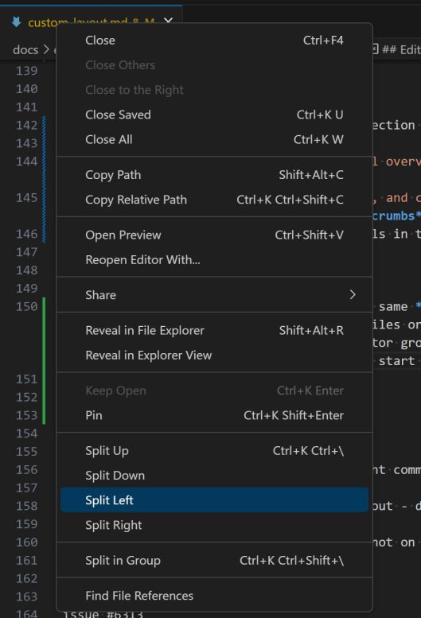

The **Split** editor commands are also available from the **View** > **Editor Layout** menu and through the Command Palette.

​​	“拆分”编辑器命令也可从“视图”>“编辑器布局”菜单和“命令面板”中获得。

If you'd like to go quickly between vertical and horizontal editor group layout, you can use the **Toggle Vertical/Horizontal Editor Layout** command (Shift+Alt+0).

​​	如果您想在垂直和水平编辑器组布局之间快速切换，可以使用“切换垂直/水平编辑器布局”命令（Shift+Alt+0）。

### [Split in group 在组中拆分]()

You can also split an editor in the same group for side by side editing with the **View: Split Editor in Group** command (Ctrl+K Ctrl+Shift+\).

​​	您还可以使用“视图：在组中拆分编辑器”命令（Ctrl+K Ctrl+Shift+\）在同一个组中拆分编辑器，以便并排编辑。

When using the split in group feature, there are specific commands for toggling this mode and navigating between the two split editors:

​​	在使用“在组中拆分”功能时，有一些特定命令可用于切换此模式并在两个拆分的编辑器之间导航：

- **View: Split Editor in Group** - Split the current editor.
  视图：在组中拆分编辑器 - 拆分当前编辑器。
- **View: Toggle Split Editor in Group** - Toggle between split mode for the active editor.
  视图：切换组中的拆分编辑器 - 在活动编辑器的拆分模式之间切换。
- **View: Join Editor in Group** - Go back to a single editor for the active file.
  视图：加入组中的编辑器 - 返回活动文件的单个编辑器。
- **View: Toggle Layout of Split Editor in Group** - Toggle between horizontal and vertical layout.
  视图：切换组中拆分编辑器的布局 - 在水平和垂直布局之间切换。

To navigate between the sides:

​​	在两侧之间导航：

- **View: Focus First Side in Active Editor** - Move focus to the first (left or top) side of split editor.
  视图：聚焦活动编辑器中的第一侧 - 将焦点移至拆分编辑器的第一侧（左或上）。
- **View: Focus Second Side in Active Editor** - Move focus to the second (right or bottom) side.
  视图：聚焦活动编辑器中的第二侧 - 将焦点移至第二侧（右或下）。
- **View: Focus Other Side in Active Editor** - Toggle between the split editor sides.
  视图：聚焦活动编辑器中的另一侧 - 在拆分编辑器两侧之间切换。

The **Workbench > Editor: Split in Group Layout** (`workbench.editor.splitInGroupLayout`) [setting]() lets you set the preferred split editor layout to either horizontal (default) or vertical.

​​	工作台 > 编辑器：组布局中的拆分（ `workbench.editor.splitInGroupLayout` ）设置允许您将首选的拆分编辑器布局设置为水平（默认）或垂直。

### [Grid layout 网格布局]()

If you'd like more control over the editor group layout, you can use the [grid layout](), where you can have multiple rows and columns of editor groups visible. The **View** > **Editor Layout** menu lists various editor layout options (for example, **Two Columns**, **Three Columns**, **Grid (2x2)**) and you can adjust the group sizes by grabbing and moving the sash between them.

​​	如果您想对编辑器组布局进行更多控制，可以使用网格布局，您可以在其中显示多行多列的编辑器组。视图 > 编辑器布局菜单列出了各种编辑器布局选项（例如，两列、三列、网格（2x2）），您可以通过抓取并移动它们之间的窗格来调整组的大小。

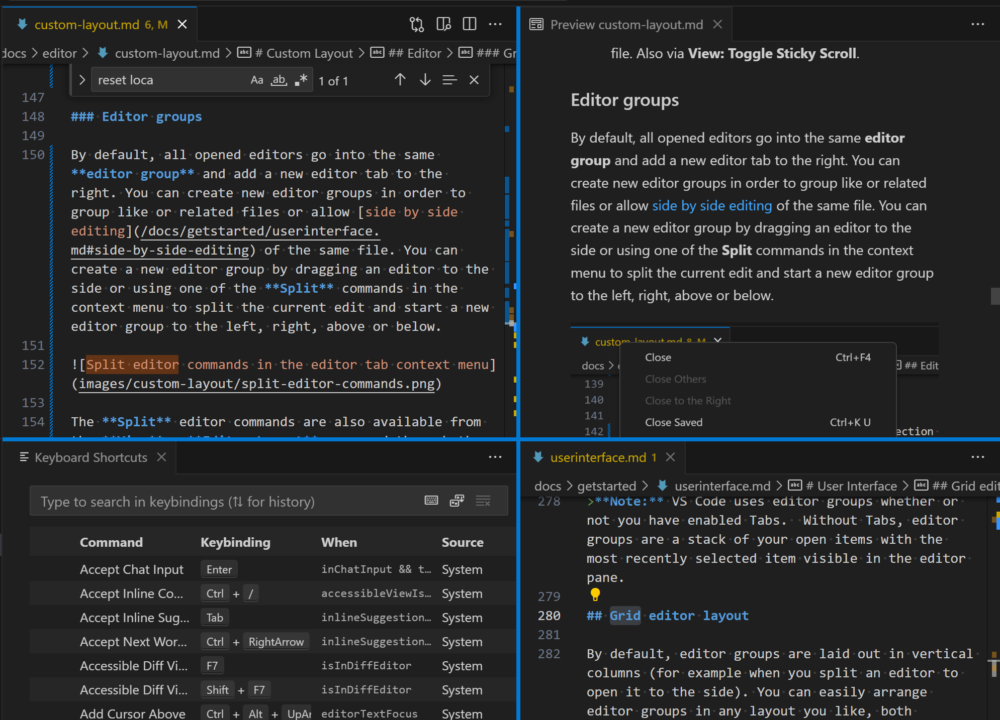

### [Pinned tabs 固定标签]()

If you'd like an editor tab to always be visible, you can pin it to the editor tab bar. You can pin an editor tab from either the context menu or using the command **View: Pin Editor** (Ctrl+K Shift+Enter).

​​	如果您希望某个编辑器标签始终可见，可以将其固定到编辑器标签栏。您可以从上下文菜单或使用命令视图：固定编辑器（Ctrl+K Shift+Enter）固定编辑器标签。

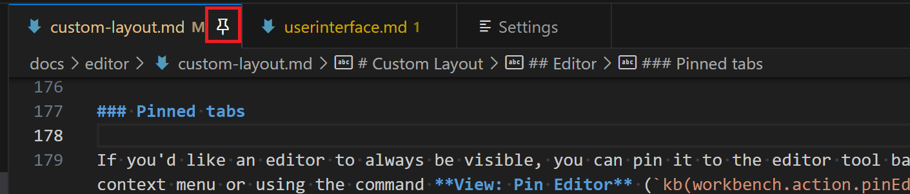

Pinned tabs help access files that are important to you as:

​​	固定标签有助于访问对您重要的文件，因为：

- Pinned tabs always appear first before non-pinned tabs.
  固定标签始终在非固定标签之前首先显示。
- They do not scroll out of view if you have many tabs opened.
  如果您打开了多个标签，它们不会滚动到视图之外。
- They do not close when using editor tab commands such as **Close Others** or **Close All**.
  使用编辑器标签命令（如关闭其他或全部关闭）时，它们不会关闭。
- They do not close even when you exceed a set limit of opened editors.
  即使您超过了打开编辑器的设置限制，它们也不会关闭。

Unpin an editor by clicking on the pin icon, using the **Unpin** editor tab context menu item, or the **View: Unpin Editor** command.

​​	通过单击固定图标、使用取消固定编辑器标签上下文菜单项或视图：取消固定编辑器命令取消固定编辑器。

You can choose how you'd like to display pinned editors with the **Workbench > Editor: Pinned Tab Sizing** (`workbench.editor.pinnedTabSizing`) setting. The options are:

​​	您可以使用工作台>编辑器：固定标签大小（ `workbench.editor.pinnedTabSizing` ）设置选择如何显示固定编辑器。选项有：

- `normal`: A pinned tab inherits the look of other tabs (default)
  `normal` ：固定标签继承其他标签的外观（默认）
- `shrink`: A pinned tab shrinks to a fixed size showing parts of the editor label.
  `shrink` ：固定标签会缩小到固定大小，显示编辑器标签的部分内容。
- `compact`: A pinned tab will only show as icon or first letter of the editor label.
  `compact` ：固定标签只会显示为图标或编辑器标签的第一个字母。

You can also show pinned editor tabs on a separate row above the regular editor tab bar by setting **Workbench > Editor: Pinned Tabs On Separate Row**. You can pin and unpin editors by dragging and dropping their tabs between the two rows.

​​	您还可以通过设置工作台>编辑器：将固定标签放在单独行中，在常规编辑器标签栏上方单独一行中显示固定编辑器标签。您可以通过在两行之间拖放标签来固定和取消固定编辑器。

### [Locked editor groups 锁定的编辑器组]()

When using multiple editors, it's common to have one or more that you want to always keep visible. The locked editor group feature, where an entire editor group is locked and visible, provides a stable display and any request to open a new editor will create it in another group. You can tell whether an editor group is locked by the lock icon in the editor group tool bar.

​​	在使用多个编辑器时，通常会希望始终保持一个或多个编辑器可见。锁定编辑器组功能（其中整个编辑器组被锁定且可见）提供稳定的显示，并且任何打开新编辑器的请求都会在另一个组中创建它。您可以通过编辑器组工具栏中的锁定图标来判断编辑器组是否已锁定。

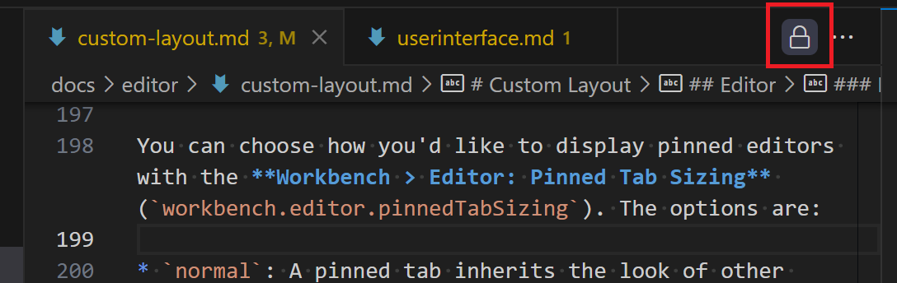

You can lock an editor group by selecting **Lock Group** from the editor tool bar **More Actions** `...` dropdown or running the **View: Lock Editor Group** command.

​​	您可以通过从编辑器工具栏更多操作 `...` 下拉列表中选择锁定组或运行视图：锁定编辑器组命令来锁定编辑器组。

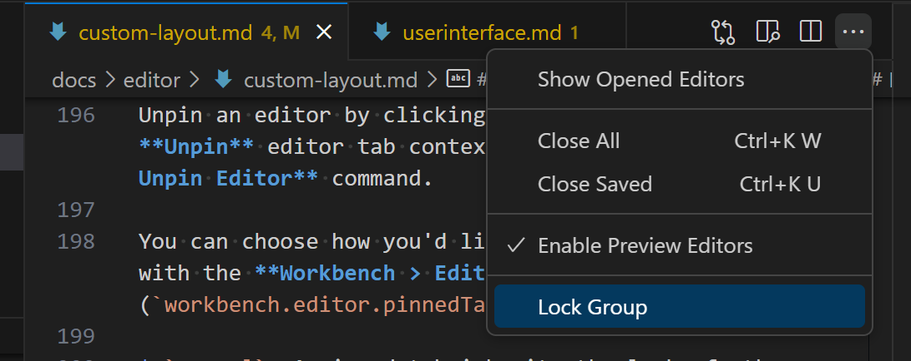

You can unlock an editor group by clicking on the lock icon or running the **View: Unlock Editor Group** command.

​​	您可以通过单击锁定图标或运行视图：解锁编辑器组命令来解锁编辑器组。

Locked groups behave differently than unlocked groups:

​​	锁定组的行为与未锁定组不同：

- New editors will not open in a locked group unless explicitly moved there (for example, via drag and drop).
  除非明确移动到那里（例如，通过拖放），否则新编辑器不会在锁定的组中打开。
- If a new editor skips a locked group, it will either open in the most recently used unlocked group or create a new group to the side of the locked one.
  如果新编辑器跳过一个锁定的组，它将在最近使用的解锁的组中打开或在锁定的组旁边创建一个新组。
- The locked state of an editor group is persisted and restored across restarts.
  编辑器组的锁定状态会保留并在重新启动后恢复。
- You can lock empty groups as well, allowing for a more stable editor layout.
  您还可以锁定空组，以便获得更稳定的编辑器布局。

The primary use case is for [terminals in the editor area](). For example, you might want to edit text on the left and have a terminal on the right that is always visible. When a terminal editor is created and moved to the side, it will automatically lock. This means that even when the terminal on the right is focused, opening a file will open it on the left side without needing to manually change focus first.

​​	主要用例是编辑器区域中的终端。例如，您可能希望在左侧编辑文本，并在右侧始终可见一个终端。创建终端编辑器并将其移至侧面时，它将自动锁定。这意味着即使右侧的终端获得焦点，打开文件也会在左侧打开，而无需先手动更改焦点。

Auto locking groups can be configured using the `workbench.editor.autoLockGroups` setting, which defaults to only terminal editors but any editor type can be added to get the same behavior.

​​	可以使用 `workbench.editor.autoLockGroups` 设置配置自动锁定组，该设置默认仅适用于终端编辑器，但可以添加任何编辑器类型以获得相同行为。

The commands related to editor group locking:

​​	与编辑器组锁定相关的命令：

- **View: Lock Editor Group** - Lock the active editor group.
  视图：锁定编辑器组 - 锁定活动编辑器组。
- **View: Unlock Editor Group** - Unlock the active locked editor group.
  视图：解锁编辑器组 - 解锁活动锁定的编辑器组。
- **View: Toggle Editor Group Lock** - Lock or unlock the active editor group.
  视图：切换编辑器组锁定 - 锁定或解锁活动编辑器组。

You must have more that one editor group for these commands to be available.

​​	您必须有多个编辑器组才能使用这些命令。

## [Next steps 后续步骤]()

Read on to find out about:

​​	继续阅读以了解：

- [Visual Studio Code User Interface]() - A quick orientation to VS Code.
  Visual Studio Code 用户界面 - VS Code 的快速入门。
- [Basic Editing]() - Learn about the powerful VS Code editor.
  基本编辑 - 了解功能强大的 VS Code 编辑器。
- [Code Navigation]() - Move quickly through your source code.
  代码导航 - 快速浏览源代码。

