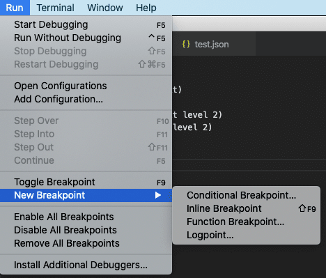
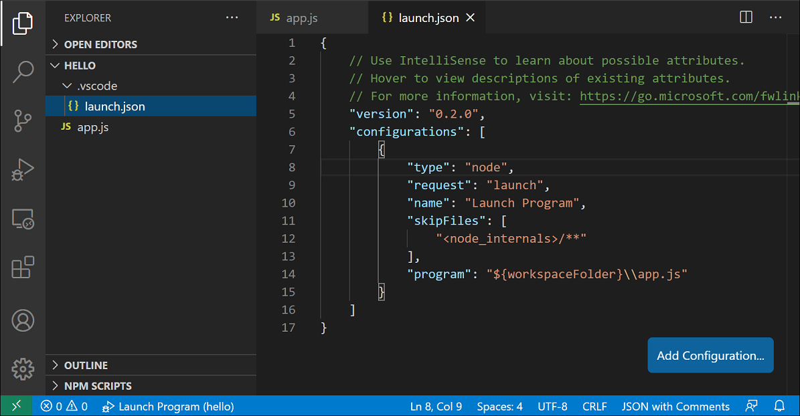
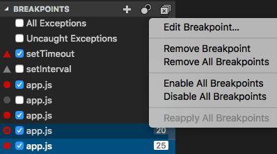
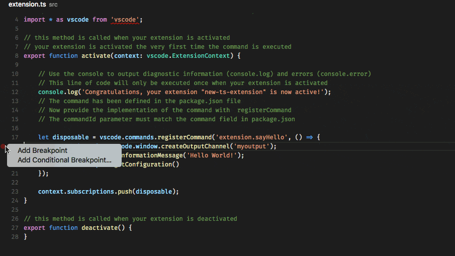
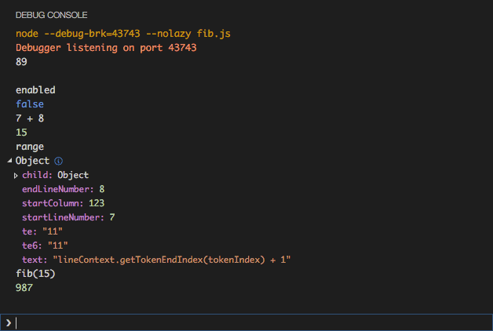

+++
title = "Debugging"
date = 2024-01-12T22:36:24+08:00
weight = 60
type = "docs"
description = ""
isCJKLanguage = true
draft = false
+++

> 原文: [https://code.visualstudio.com/docs/editor/debugging](https://code.visualstudio.com/docs/editor/debugging)

# Debugging 调试


One of the key features of Visual Studio Code is its great debugging support. VS Code's built-in debugger helps accelerate your edit, compile, and debug loop.

​​	Visual Studio Code 的一个主要功能是其强大的调试支持。VS Code 的内置调试器有助于加快您的编辑、编译和调试循环。


## [Debugger extensions 调试器扩展](https://code.visualstudio.com/docs/editor/debugging#_debugger-extensions)

VS Code has built-in debugging support for the [Node.js](https://nodejs.org/) runtime and can debug JavaScript, TypeScript, or any other language that gets transpiled to JavaScript.

​​	VS Code 对 Node.js 运行时具有内置调试支持，并且可以调试 JavaScript、TypeScript 或任何其他转译为 JavaScript 的语言。

For debugging other languages and runtimes (including [PHP](https://marketplace.visualstudio.com/items?itemName=xdebug.php-debug), [Ruby](https://marketplace.visualstudio.com/items?itemName=rebornix.Ruby), [Go](https://marketplace.visualstudio.com/items?itemName=golang.go), [C#](https://marketplace.visualstudio.com/items?itemName=ms-dotnettools.csharp), [Python](https://marketplace.visualstudio.com/items?itemName=ms-python.python), [C++](https://marketplace.visualstudio.com/items?itemName=ms-vscode.cpptools), [PowerShell](https://marketplace.visualstudio.com/items?itemName=ms-vscode.PowerShell) and [many others](https://marketplace.visualstudio.com/search?term=debug&target=VSCode&category=Debuggers&sortBy=Relevance)), look for `Debuggers` [extensions](https://code.visualstudio.com/docs/editor/extension-marketplace) in the VS Code [Marketplace](https://marketplace.visualstudio.com/vscode/Debuggers) or select **Install Additional Debuggers** in the top-level Run menu.

​​	要调试其他语言和运行时（包括 PHP、Ruby、Go、C#、Python、C++、PowerShell 和许多其他语言），请在 VS Code Marketplace 中查找 `Debuggers` 扩展，或在顶级“运行”菜单中选择“安装其他调试器”。

Below are several popular extensions which include debugging support:

​​	以下是几个包含调试支持的热门扩展：


Python

109.1M

ms-python


C/C++

58.3M

ms-vscode


Debugger for Java
Java 调试器

28.1M
2810 万

vscjava


CMake Tools
CMake 工具

27.9M
2790 万

ms-vscode

> Tip: The extensions shown above are dynamically queried. Select an extension tile above to read the description and reviews to decide which extension is best for you.
>
> ​​	提示：上面显示的扩展是动态查询的。选择上面的扩展磁贴以阅读描述和评论，以决定哪个扩展最适合您。

## [Start debugging 开始调试](https://code.visualstudio.com/docs/editor/debugging#_start-debugging)

The following documentation is based on the built-in [Node.js](https://nodejs.org/) debugger, but most of the concepts and features are applicable to other debuggers as well.

​​	以下文档基于内置的 Node.js 调试器，但大多数概念和功能也适用于其他调试器。

It is helpful to first create a sample Node.js application before reading about debugging. You can follow the [Node.js walkthrough](https://code.visualstudio.com/docs/nodejs/nodejs-tutorial) to install Node.js and create a simple "Hello World" JavaScript application (`app.js`). Once you have a simple application set up, this page will take you through VS Code debugging features.

​​	在阅读有关调试的信息之前，先创建一个 Node.js 示例应用程序会有所帮助。您可以按照 Node.js 演练安装 Node.js 并创建一个简单的“Hello World”JavaScript 应用程序 ( `app.js` )。一旦您设置好一个简单的应用程序，此页面将引导您完成 VS Code 调试功能。

## [Run and Debug view 运行和调试视图](https://code.visualstudio.com/docs/editor/debugging#_run-and-debug-view)

To bring up the **Run and Debug** view, select the **Run and Debug** icon in the **Activity Bar** on the side of VS Code. You can also use the keyboard shortcut Ctrl+Shift+D.

​​	若要打开“运行和调试”视图，请选择 VS Code 侧边栏中的“活动栏”中的“运行和调试”图标。您还可以使用键盘快捷键 Ctrl+Shift+D。


The **Run and Debug** view displays all information related to running and debugging and has a top bar with debugging commands and configuration settings.

​​	“运行和调试”视图显示与运行和调试相关的所有信息，并具有一个包含调试命令和配置设置的顶部栏。

If running and debugging is not yet configured (no `launch.json` has been created), VS Code shows the Run start view.

​​	如果尚未配置运行和调试（尚未创建 `launch.json` ），VS Code 将显示“运行启动”视图。


## [Run menu 运行菜单](https://code.visualstudio.com/docs/editor/debugging#_run-menu)

The top-level **Run** menu has the most common run and debug commands:

​​	顶级“运行”菜单具有最常见的运行和调试命令：



## [Launch configurations 启动配置](https://code.visualstudio.com/docs/editor/debugging#_launch-configurations)

To run or debug a simple app in VS Code, select **Run and Debug** on the Debug start view or press F5 and VS Code will try to run your currently active file.

​​	要在 VS Code 中运行或调试一个简单的应用，请选择“调试”开始视图中的“运行并调试”，或按 F5，VS Code 将尝试运行你当前活动的文件。

However, for most debugging scenarios, creating a launch configuration file is beneficial because it allows you to configure and save debugging setup details. VS Code keeps debugging configuration information in a `launch.json` file located in a `.vscode` folder in your workspace (project root folder) or in your [user settings](https://code.visualstudio.com/docs/editor/debugging#_global-launch-configuration) or [workspace settings](https://code.visualstudio.com/docs/editor/multi-root-workspaces#_workspace-launch-configurations).

​​	但是，对于大多数调试场景，创建启动配置文件很有用，因为它允许你配置和保存调试设置详细信息。VS Code 将调试配置信息保存在工作区（项目根文件夹）或用户设置或工作区设置中的 `launch.json` 文件夹中的 `.vscode` 文件中。

To create a `launch.json` file, click the **create a launch.json file** link in the Run start view.

​​	要创建 `launch.json` 文件，请单击“运行”开始视图中的“创建 launch.json 文件”链接。


VS Code will try to automatically detect your debug environment, but if this fails, you will have to choose it manually:

​​	VS Code 将尝试自动检测你的调试环境，但如果失败，你将必须手动选择它：


Here is the launch configuration generated for Node.js debugging:

​​	这是为 Node.js 调试生成的启动配置：

```
{
  "version": "0.2.0",
  "configurations": [
    {
      "type": "node",
      "request": "launch",
      "name": "Launch Program",
      "skipFiles": ["<node_internals>/**"],
      "program": "${workspaceFolder}\\app.js"
    }
  ]
}
```

If you go back to the File Explorer view (Ctrl+Shift+E), you'll see that VS Code has created a `.vscode` folder and added the `launch.json` file to your workspace.

​​	如果你返回到文件资源管理器视图（Ctrl+Shift+E），你将看到 VS Code 已创建 `.vscode` 文件夹，并将 `launch.json` 文件添加到你的工作区。



> **Note**: You can debug a simple application even if you don't have a folder open in VS Code, but it is not possible to manage launch configurations and set up advanced debugging. The VS Code Status Bar is purple if you do not have a folder open.
>
> ​​	注意：即使你没有在 VS Code 中打开文件夹，你也可以调试一个简单的应用程序，但无法管理启动配置和设置高级调试。如果你没有打开文件夹，VS Code 状态栏将显示紫色。

Note that the attributes available in launch configurations vary from debugger to debugger. You can use IntelliSense suggestions (Ctrl+Space) to find out which attributes exist for a specific debugger. Hover help is also available for all attributes.

​​	请注意，启动配置中可用的属性因调试器而异。您可以使用 IntelliSense 建议（Ctrl+空格）来查找特定调试器存在哪些属性。所有属性均提供悬停帮助。

Do not assume that an attribute that is available for one debugger automatically works for other debuggers too. If you see red squiggles in your launch configuration, hover over them to learn what the problem is and try to fix them before launching a debug session.

​​	不要假设适用于一个调试器的属性也自动适用于其他调试器。如果在启动配置中看到红色波浪线，请将鼠标悬停在其上以了解问题所在，并在启动调试会话之前尝试修复它们。


Review all automatically generated values and make sure that they make sense for your project and debugging environment.

​​	查看所有自动生成的值，并确保它们对您的项目和调试环境有意义。

### [Launch versus attach configurations 启动与附加配置](https://code.visualstudio.com/docs/editor/debugging#_launch-versus-attach-configurations)

In VS Code, there are two core debugging modes, **Launch** and **Attach**, which handle two different workflows and segments of developers. Depending on your workflow, it can be confusing to know what type of configuration is appropriate for your project.

​​	在 VS Code 中，有两种核心调试模式，即启动和附加，它们处理两种不同的工作流和开发人员细分。根据您的工作流，可能很难知道哪种类型的配置适合您的项目。

If you come from a browser Developer Tools background, you might not be used to "launching from your tool," since your browser instance is already open. When you open DevTools, you are simply **attaching** DevTools to your open browser tab. On the other hand, if you come from a server or desktop background, it's quite normal to have your editor **launch** your process for you, and your editor automatically attaches its debugger to the newly launched process.

​​	如果您来自浏览器开发者工具背景，您可能不习惯“从您的工具启动”，因为您的浏览器实例已经打开。当您打开 DevTools 时，您只是将 DevTools 附加到您的打开的浏览器标签。另一方面，如果您来自服务器或桌面背景，让您的编辑器为您启动进程，并且您的编辑器自动将它的调试器附加到新启动的进程，这是很正常的。

The best way to explain the difference between **launch** and **attach** is to think of a **launch** configuration as a recipe for how to start your app in debug mode **before** VS Code attaches to it, while an **attach** configuration is a recipe for how to connect VS Code's debugger to an app or process that's **already** running.

​​	解释启动和附加之间差异的最佳方法是将启动配置视为在 VS Code 附加到您的应用之前以调试模式启动您的应用的配方，而附加配置是将 VS Code 的调试器连接到已经运行的应用或进程的配方。

VS Code debuggers typically support launching a program in debug mode or attaching to an already running program in debug mode. Depending on the request (`attach` or `launch`), different attributes are required, and VS Code's `launch.json` validation and suggestions should help with that.

​​	VS Code 调试器通常支持以调试模式启动程序或附加到已经以调试模式运行的程序。根据请求（ `attach` 或 `launch` ），需要不同的属性，而 VS Code 的 `launch.json` 验证和建议应该对此有所帮助。

### [Add a new configuration 添加新配置](https://code.visualstudio.com/docs/editor/debugging#_add-a-new-configuration)

To add a new configuration to an existing `launch.json`, use one of the following techniques:

​​	要向现有的 `launch.json` 添加新配置，请使用以下技术之一：

- Use IntelliSense if your cursor is located inside the configurations array.
  如果光标位于 configurations 数组中，请使用 IntelliSense。
- Press the **Add Configuration** button to invoke snippet IntelliSense at the start of the array.
  按“添加配置”按钮可在数组开头调用代码片段 IntelliSense。
- Choose **Add Configuration** option in the Run menu.
  在“运行”菜单中选择“添加配置”选项。


VS Code also supports compound launch configurations for starting multiple configurations at the same time; for more details, please read this [section](https://code.visualstudio.com/docs/editor/debugging#_compound-launch-configurations).

​​	VS Code 还支持复合启动配置，以便同时启动多个配置；有关更多详细信息，请阅读本部分。

In order to start a debug session, first select the configuration named **Launch Program** using the **Configuration dropdown** in the **Run and Debug** view. Once you have your launch configuration set, start your debug session with F5.

​​	要启动调试会话，首先使用“运行和调试”视图中的“配置”下拉列表选择名为“启动程序”的配置。设置好启动配置后，按 F5 启动调试会话。

Alternatively, you can run your configuration through the **Command Palette** (Ctrl+Shift+P) by filtering on **Debug: Select and Start Debugging** or typing `'debug '` and selecting the configuration you want to debug.

​​	或者，您可以通过“命令面板”(Ctrl+Shift+P) 筛选“调试：选择并开始调试”或键入 `'debug '` 并选择要调试的配置来运行配置。

As soon as a debugging session starts, the **DEBUG CONSOLE** panel is displayed and shows debugging output, and the Status Bar changes color (orange for default color themes):

​​	调试会话一经启动，“DEBUG CONSOLE”面板便会显示，并显示调试输出，状态栏也会变色（对于默认颜色主题，变为橙色）：


In addition, the **debug status** appears in the Status Bar showing the active debug configuration. By selecting the debug status, a user can change the active launch configuration and start debugging without needing to open the **Run and Debug** view.

​​	此外，调试状态会显示在状态栏中，显示活动调试配置。通过选择调试状态，用户可以更改活动启动配置并在无需打开“运行和调试”视图的情况下开始调试。


## [Debug actions 调试操作](https://code.visualstudio.com/docs/editor/debugging#_debug-actions)

Once a debug session starts, the **Debug toolbar** will appear on the top of the editor.

​​	一旦调试会话开始，调试工具栏将出现在编辑器顶部。


| Action 操作                    | Explanation 说明                                             |
| :----------------------------- | :----------------------------------------------------------- |
| Continue / Pause 继续/暂停 F5  | **Continue**: Resume normal program/script execution (up to the next breakpoint). 继续：恢复正常程序/脚本执行（直到下一个断点）。 **Pause**: Inspect code executing at the current line and debug line-by-line. 暂停：检查当前行执行的代码并逐行调试。 |
| Step Over 单步执行 F10         | Execute the next method as a single command without inspecting or following its component steps. |
| Step Into F11                  | Enter the next method to follow its execution line-by-line. 进入下一个方法以逐行跟踪其执行情况。 |
| Step Out 退出 Shift+F11        | When inside a method or subroutine, return to the earlier execution context by completing remaining lines of the current method as though it were a single command. 在方法或子例程中时，通过完成当前方法的剩余行（如同它是单个命令）返回到较早的执行上下文。 |
| Restart 重新启动 Ctrl+Shift+F5 | Terminate the current program execution and start debugging again using the current run configuration. 终止当前程序执行，并使用当前运行配置重新开始调试。 |
| Stop 停止 Shift+F5             | Terminate the current program execution. 终止当前程序执行。  |

> **Tip**: Use the setting `debug.toolBarLocation` to control the location of the debug toolbar. It can be the default `floating`, `docked` to the **Run and Debug** view, or `hidden`. A `floating` debug toolbar can be dragged horizontally and also down to the editor area.
>
> ​​	提示：使用设置 `debug.toolBarLocation` 来控制调试工具栏的位置。它可以是默认的 `floating` 、 `docked` 到运行和调试视图，或 `hidden` 。 `floating` 调试工具栏可以水平拖动，也可以向下拖动到编辑器区域。

### [Run mode 运行模式](https://code.visualstudio.com/docs/editor/debugging#_run-mode)

In addition to debugging a program, VS Code supports **running** the program. The **Debug: Run (Start Without Debugging)** action is triggered with Ctrl+F5 and uses the currently selected launch configuration. Many of the launch configuration attributes are supported in 'Run' mode. VS Code maintains a debug session while the program is running, and pressing the **Stop** button terminates the program.

​​	除了调试程序外，VS Code 还支持运行程序。调试：运行（不调试启动）操作通过 Ctrl+F5 触发，并使用当前选定的启动配置。许多启动配置属性在“运行”模式下受支持。VS Code 在程序运行时维护一个调试会话，按停止按钮可终止程序。

> **Tip**: The **Run** action is always available, but not all debugger extensions support 'Run'. In this case, 'Run' will be the same as 'Debug'.
>
> ​​	提示：运行操作始终可用，但并非所有调试器扩展都支持“运行”。在这种情况下，“运行”将与“调试”相同。

## [Breakpoints 断点](https://code.visualstudio.com/docs/editor/debugging#_breakpoints)

Breakpoints can be toggled by clicking on the **editor margin** or using F9 on the current line. Finer breakpoint control (enable/disable/reapply) can be done in the **Run and Debug** view's **BREAKPOINTS** section.

​​	可以通过单击编辑器边距或在当前行上使用 F9 来切换断点。可以在运行和调试视图的断点部分中执行更精细的断点控制（启用/禁用/重新应用）。

- Breakpoints in the editor margin are normally shown as red filled circles.
  编辑器边距中的断点通常显示为实心红色圆圈。
- Disabled breakpoints have a filled gray circle.
  禁用的断点有一个实心灰色圆圈。
- When a debugging session starts, breakpoints that cannot be registered with the debugger change to a gray hollow circle. The same might happen if the source is edited while a debug session without live-edit support is running.
  当调试会话开始时，无法用调试器注册的断点会变为灰色空心圆圈。如果在没有实时编辑支持的调试会话运行时编辑源代码，也可能会发生这种情况。

If the debugger supports breaking on different kinds of errors or exceptions, those will also be available in the **BREAKPOINTS** view.

​​	如果调试器支持中断不同类型的错误或异常，这些错误或异常也会在断点视图中可用。

The **Reapply All Breakpoints** command sets all breakpoints again to their original location. This is helpful if your debug environment is "lazy" and "misplaces" breakpoints in source code that has not yet been executed.

​​	“重新应用所有断点”命令会将所有断点重新设置到其原始位置。如果您的调试环境“懒惰”且“错放”了尚未执行的源代码中的断点，这会很有用。



Optionally, breakpoints can be shown in the editor's overview ruler by enabling the setting `debug.showBreakpointsInOverviewRuler`:

​​	或者，可以通过启用设置 `debug.showBreakpointsInOverviewRuler` 在编辑器的概览标尺中显示断点：


## [Logpoints 日志点](https://code.visualstudio.com/docs/editor/debugging#_logpoints)

A Logpoint is a variant of a breakpoint that does not "break" into the debugger but instead logs a message to the console. Logpoints are especially useful for injecting logging while debugging production servers that cannot be paused or stopped.

​​	日志点是断点的一种变体，它不会“中断”调试器，而是将消息记录到控制台。日志点对于在调试无法暂停或停止的生产服务器时注入日志特别有用。

A Logpoint is represented by a "diamond" shaped icon. Log messages are plain text but can include expressions to be evaluated within curly braces ('{}').

​​	日志点由“菱形”图标表示。日志消息是纯文本，但可以包括用大括号 ('{}') 括起来的要计算的表达式。


Just like regular breakpoints, Logpoints can be enabled or disabled and can also be controlled by a condition and/or hit count.

​​	与常规断点一样，Logpoint 可以启用或禁用，还可以通过条件和/或命中计数进行控制。

**Note**: Logpoints are supported by VS Code's built-in Node.js debugger, but can be implemented by other debug extensions. The [Python](https://code.visualstudio.com/docs/python/python-tutorial) and [Java](https://code.visualstudio.com/docs/java/java-tutorial) extensions, for example, support Logpoints.

​​	注意：Logpoint 受 VS Code 的内置 Node.js 调试器支持，但可以由其他调试扩展实现。例如，Python 和 Java 扩展支持 Logpoint。

## [Data inspection 数据检查](https://code.visualstudio.com/docs/editor/debugging#_data-inspection)

Variables can be inspected in the **VARIABLES** section of the **Run and Debug** view or by hovering over their source in the editor. Variable values and expression evaluation are relative to the selected stack frame in the **CALL STACK** section.

​​	可以在“运行和调试”视图的“变量”部分检查变量，或将鼠标悬停在编辑器中的源代码上。变量值和表达式计算相对于“调用堆栈”部分中选定的堆栈帧。


Variable values can be modified with the **Set Value** action from the variable's context menu. Additionally, you can use the **Copy Value** action to copy the variable's value, or **Copy as Expression** action to copy an expression to access the variable.

​​	可以使用变量上下文菜单中的“设置值”操作修改变量值。此外，可以使用“复制值”操作复制变量的值，或使用“复制为表达式”操作复制用于访问变量的表达式。

Variables and expressions can also be evaluated and watched in the **Run and Debug** view's **WATCH** section.

​​	还可以在“运行和调试”视图的“监视”部分评估和监视变量和表达式。


Variable names and values can be filtered by typing while the focus is on the **VARIABLES** section.

​​	当焦点位于“变量”部分时，可以通过键入来筛选变量名称和值。


## [Launch.json attributes Launch.json 属性](https://code.visualstudio.com/docs/editor/debugging#_launchjson-attributes)

There are many `launch.json` attributes to help support different debuggers and debugging scenarios. As mentioned above, you can use IntelliSense (Ctrl+Space) to see the list of available attributes once you have specified a value for the `type` attribute.

​​	有很多 `launch.json` 属性可帮助支持不同的调试器和调试方案。如上所述，一旦为 `type` 属性指定了一个值，您就可以使用 IntelliSense（Ctrl+空格）查看可用属性的列表。


The following attributes are mandatory for every launch configuration:

​​	每个启动配置都必须具有以下属性：

- `type` - the type of debugger to use for this launch configuration. Every installed debug extension introduces a type: `node` for the built-in Node debugger, for example, or `php` and `go` for the PHP and Go extensions.
  `type` - 用于此启动配置的调试器类型。每个已安装的调试扩展都会引入一个类型：例如，内置 Node 调试器的 `node` ，或者 PHP 和 Go 扩展的 `php` 和 `go` 。
- `request` - the request type of this launch configuration. Currently, `launch` and `attach` are supported.
  `request` - 此启动配置的请求类型。目前，支持 `launch` 和 `attach` 。
- `name` - the reader-friendly name to appear in the Debug launch configuration dropdown.
  `name` - 显示在“调试启动配置”下拉列表中的友好名称。

Here are some optional attributes available to all launch configurations:

​​	以下是所有启动配置都可用的某些可选属性：

- `presentation` - using the `order`, `group`, and `hidden` attributes in the `presentation` object, you can sort, group, and hide configurations and compounds in the Debug configuration dropdown and in the Debug quick pick.
  `presentation` - 使用 `presentation` 对象中的 `order` 、 `group` 和 `hidden` 属性，您可以在“调试配置”下拉列表和“调试快速选取”中对配置和复合项进行排序、分组和隐藏。
- `preLaunchTask` - to launch a task before the start of a debug session, set this attribute to the label of a task specified in [tasks.json](https://code.visualstudio.com/docs/editor/tasks) (in the workspace's `.vscode` folder). Or, this can be set to `${defaultBuildTask}` to use your default build task.
  `preLaunchTask` - 要在调试会话开始前启动任务，请将此属性设置为 tasks.json（在工作区的 `.vscode` 文件夹中）中指定的任务的标签。或者，可以将其设置为 `${defaultBuildTask}` 以使用默认的生成任务。
- `postDebugTask` - to launch a task at the very end of a debug session, set this attribute to the name of a task specified in [tasks.json](https://code.visualstudio.com/docs/editor/tasks) (in the workspace's `.vscode` folder).
  `postDebugTask` - 要在调试会话的最后启动任务，请将此属性设置为 tasks.json（在工作区的 `.vscode` 文件夹中）中指定的任务的名称。
- `internalConsoleOptions` - this attribute controls the visibility of the Debug Console panel during a debugging session.
  `internalConsoleOptions` - 此属性控制调试会话期间调试控制台面板的可见性。
- `debugServer` - **for debug extension authors only**: this attribute allows you to connect to a specified port instead of launching the debug adapter.
  `debugServer` - 仅适用于调试扩展作者：此属性允许您连接到指定端口，而不是启动调试适配器。
- `serverReadyAction` - if you want to open a URL in a web browser whenever the program under debugging outputs a specific message to the debug console or integrated terminal. For details see section [Automatically open a URI when debugging a server program](https://code.visualstudio.com/docs/editor/debugging#_automatically-open-a-uri-when-debugging-a-server-program) below.
  `serverReadyAction` - 只要正在调试的程序向调试控制台或集成终端输出特定消息，您就可以在 Web 浏览器中打开一个 URL。有关详细信息，请参阅下面的“在调试服务器程序时自动打开 URI”部分。

Many debuggers support some of the following attributes:

​​	许多调试器支持以下部分属性：

- `program` - executable or file to run when launching the debugger
  `program` - 启动调试器时要运行的可执行文件或文件
- `args` - arguments passed to the program to debug
  `args` - 传递给要调试的程序的参数
- `env` - environment variables (the value `null` can be used to "undefine" a variable)
  `env` - 环境变量（值 `null` 可用于“取消定义”变量）
- `envFile` - path to dotenv file with environment variables
  `envFile` - 带有环境变量的 dotenv 文件的路径
- `cwd` - current working directory for finding dependencies and other files
  `cwd` - 用于查找依赖项和其他文件的当前工作目录
- `port` - port when attaching to a running process
  `port` - 附加到正在运行的进程时的端口
- `stopOnEntry` - break immediately when the program launches
  `stopOnEntry` - 程序启动时立即中断
- `console` - what kind of console to use, for example, `internalConsole`, `integratedTerminal`, or `externalTerminal`
  `console` - 使用哪种控制台，例如 `internalConsole` 、 `integratedTerminal` 或 `externalTerminal`

## [Variable substitution 变量替换](https://code.visualstudio.com/docs/editor/debugging#_variable-substitution)

VS Code makes commonly used paths and other values available as variables and supports variable substitution inside strings in `launch.json`. This means that you do not have to use absolute paths in debug configurations. For example, `${workspaceFolder}` gives the root path of a workspace folder, `${file}` the file open in the active editor, and `${env:Name}` the environment variable 'Name'. You can see a full list of predefined variables in the [Variables Reference](https://code.visualstudio.com/docs/editor/variables-reference) or by invoking IntelliSense inside the `launch.json` string attributes.

​​	VS Code 将常用路径和其他值作为变量提供，并支持在 `launch.json` 中的字符串内进行变量替换。这意味着您不必在调试配置中使用绝对路径。例如， `${workspaceFolder}` 给出工作区文件夹的根路径， `${file}` 给出活动编辑器中打开的文件， `${env:Name}` 给出环境变量“Name”。您可以在“变量参考”中或通过在 `launch.json` 字符串属性内调用 IntelliSense 来查看预定义变量的完整列表。

```
{
  "type": "node",
  "request": "launch",
  "name": "Launch Program",
  "program": "${workspaceFolder}/app.js",
  "cwd": "${workspaceFolder}",
  "args": ["${env:USERNAME}"]
}
```

## [Platform-specific properties 特定于平台的属性](https://code.visualstudio.com/docs/editor/debugging#_platformspecific-properties)

`Launch.json` supports defining values (for example, arguments to be passed to the program) that depend on the operating system where the debugger is running. To do so, put a platform-specific literal into the `launch.json` file and specify the corresponding properties inside that literal.

​​	 `Launch.json` 支持定义值（例如要传递给程序的参数），这些值取决于运行调试器的操作系统。为此，将特定于平台的文字放入 `launch.json` 文件中，并在该文字内指定相应的属性。

Below is an example that passes `"args"` to the program differently on Windows:

​​	下面是一个在 Windows 上以不同方式将 `"args"` 传递给程序的示例：

```
{
  "version": "0.2.0",
  "configurations": [
    {
      "type": "node",
      "request": "launch",
      "name": "Launch Program",
      "program": "${workspaceFolder}/node_modules/gulp/bin/gulpfile.js",
      "args": ["myFolder/path/app.js"],
      "windows": {
        "args": ["myFolder\\path\\app.js"]
      }
    }
  ]
}
```

Valid operating properties are `"windows"` for Windows, `"linux"` for Linux, and `"osx"` for macOS. Properties defined in an operating system specific scope override properties defined in the global scope.

​​	有效的操作系统属性是 `"windows"` （适用于 Windows）、 `"linux"` （适用于 Linux）和 `"osx"` （适用于 macOS）。在特定于操作系统的范围内定义的属性会覆盖在全局范围内定义的属性。

Please note that the `type` property cannot be placed inside a platform-specific section, because `type` indirectly determines the platform in remote debugging scenarios, and that would result in a cyclic dependency.

​​	请注意， `type` 属性不能放在特定于平台的部分中，因为 `type` 间接确定了远程调试场景中的平台，这会导致循环依赖。

In the example below, debugging the program always **stops on entry** except on macOS:

​​	在下面的示例中，除了在 macOS 上，调试程序始终在入口处停止：

```
{
  "version": "0.2.0",
  "configurations": [
    {
      "type": "node",
      "request": "launch",
      "name": "Launch Program",
      "program": "${workspaceFolder}/node_modules/gulp/bin/gulpfile.js",
      "stopOnEntry": true,
      "osx": {
        "stopOnEntry": false
      }
    }
  ]
}
```

## [Global launch configuration 全局启动配置](https://code.visualstudio.com/docs/editor/debugging#_global-launch-configuration)

VS Code supports adding a `"launch"` object inside your User [settings](https://code.visualstudio.com/docs/getstarted/settings). This `"launch"` configuration will then be shared across your workspaces. For example:

​​	VS Code 支持在用户设置中添加 `"launch"` 对象。然后，此 `"launch"` 配置将在您的工作区之间共享。例如：

```
"launch": {
    "version": "0.2.0",
    "configurations": [{
        "type": "node",
        "request": "launch",
        "name": "Launch Program",
        "program": "${file}"
    }]
}
```

## [Advanced breakpoint topics 高级断点主题](https://code.visualstudio.com/docs/editor/debugging#_advanced-breakpoint-topics)

### [Conditional breakpoints 条件断点](https://code.visualstudio.com/docs/editor/debugging#_conditional-breakpoints)

A powerful VS Code debugging feature is the ability to set conditions based on expressions, hit counts, or a combination of both.

​​	VS Code 调试功能的一大特色是可以根据表达式、命中次数或两者的组合来设置条件。

- **Expression condition**: The breakpoint will be hit whenever the expression evaluates to `true`.
  表达式条件：当表达式求值为 `true` 时，将命中断点。
- **Hit count**: The 'hit count' controls how many times a breakpoint needs to be hit before it will 'break' execution. Whether a 'hit count' is respected and the exact syntax of the expression vary among debugger extensions.
  命中次数：“命中次数”控制断点需要被命中多少次才会“中断”执行。是否遵守“命中次数”以及表达式的确切语法因调试器扩展而异。

You can add a condition and/or hit count when creating a source breakpoint (with the **Add Conditional Breakpoint** action) or when modifying an existing one (with the **Edit Condition** action). In both cases, an inline text box with a dropdown menu opens where you can enter expressions:

​​	在创建源断点（使用“添加条件断点”操作）或修改现有断点（使用“编辑条件”操作）时，您可以添加条件和/或命中计数。在这两种情况下，都会打开一个带有下拉菜单的内联文本框，您可以在其中输入表达式：



Condition and hit count editing support is also supported for **function** and **exception** breakpoints. You can initiate condition editing from the context menu or the new inline **Edit Condition** action.

​​	函数和异常断点也支持条件和命中计数编辑支持。您可以从上下文菜单或新的内联“编辑条件”操作启动条件编辑。

An example of condition editing in the **BREAKPOINTS** view:

​​	BREAKPOINTS 视图中条件编辑示例：

If a debugger does not support conditional breakpoints, the **Add Conditional Breakpoint** and **Edit Condition** actions will be missing.

​​	如果调试器不支持条件断点，则“添加条件断点”和“编辑条件”操作将缺失。

### [Inline breakpoints 内联断点](https://code.visualstudio.com/docs/editor/debugging#_inline-breakpoints)

Inline breakpoints will only be hit when the execution reaches the column associated with the inline breakpoint. This is particularly useful when debugging minified code which contains multiple statements in a single line.

​​	只有当执行到达与内联断点关联的列时，才会命中内联断点。这在调试包含多条语句的单行代码时特别有用。

An inline breakpoint can be set using Shift+F9 or through the context menu during a debug session. Inline breakpoints are shown inline in the editor.

​​	可以在调试会话期间使用 Shift+F9 或通过上下文菜单设置内联断点。内联断点在编辑器中内联显示。

Inline breakpoints can also have conditions. Editing multiple breakpoints on a line is possible through the context menu in the editor's left margin.

​​	内联断点也可以有条件。可以通过编辑器左边缘的上下文菜单来编辑一行上的多个断点。

### [Function breakpoints 函数断点](https://code.visualstudio.com/docs/editor/debugging#_function-breakpoints)

Instead of placing breakpoints directly in source code, a debugger can support creating breakpoints by specifying a function name. This is useful in situations where source is not available but a function name is known.

​​	调试器可以支持通过指定函数名称来创建断点，而不是直接在源代码中放置断点。这在源代码不可用但已知函数名称的情况下非常有用。

A function breakpoint is created by pressing the **+** button in the **BREAKPOINTS** section header and entering the function name. Function breakpoints are shown with a red triangle in the **BREAKPOINTS** section.

​​	通过按 BREAKPOINTS 部分标题中的 + 按钮并输入函数名称来创建函数断点。函数断点在 BREAKPOINTS 部分中显示为红色三角形。

### [Data breakpoints 数据断点](https://code.visualstudio.com/docs/editor/debugging#_data-breakpoints)

If a debugger supports data breakpoints, they can be set from the context menu in the **VARIABLES** view. The **Break on Value Change/Read/Access** commands will add a data breakpoint that is hit when the value of the underlying variable changes/is read/is accessed. Data breakpoints are shown with a red hexagon in the **BREAKPOINTS** section.

​​	如果调试器支持数据断点，则可以从 VARIABLES 视图中的上下文菜单中设置它们。Break on Value Change/Read/Access 命令将添加一个数据断点，当底层变量的值发生更改/被读取/被访问时，该断点将被命中。数据断点在 BREAKPOINTS 部分中显示为红色六边形。

## [Debug Console REPL 调试控制台 REPL](https://code.visualstudio.com/docs/editor/debugging#_debug-console-repl)

Expressions can be evaluated with the **Debug Console** REPL ([Read-Eval-Print Loop](https://en.wikipedia.org/wiki/Read–eval–print_loop)) feature. To open the Debug Console, use the **Debug Console** action at the top of the Debug pane or use the **View: Debug Console** command (Ctrl+Shift+Y). Expressions are evaluated after you press Enter and the Debug Console REPL shows suggestions as you type. If you need to enter multiple lines, use Shift+Enter between the lines and then send all lines for evaluation with Enter. Debug Console input uses the mode of the active editor, which means that the Debug Console input supports syntax coloring, indentation, auto closing of quotes, and other language features.

​​	可以在 Debug 控制台 REPL（读取-评估-打印循环）功能中评估表达式。若要打开 Debug 控制台，请使用 Debug 窗格顶部的 Debug 控制台操作，或使用视图：Debug 控制台命令（Ctrl+Shift+Y）。在您按 Enter 后，表达式将得到评估，并且 Debug 控制台 REPL 会在您键入时显示建议。如果您需要输入多行，请在各行之间使用 Shift+Enter，然后使用 Enter 发送所有行进行评估。Debug 控制台输入使用活动编辑器的模式，这意味着 Debug 控制台输入支持语法着色、缩进、自动关闭引号和其他语言功能。



**Note**: You must be in a running debug session to use the Debug Console REPL.

​​	注意：您必须处于正在运行的调试会话中才能使用 Debug 控制台 REPL。

## [Redirect input/output to/from the debug target 将输入/输出重定向到/从调试目标](https://code.visualstudio.com/docs/editor/debugging#_redirect-inputoutput-tofrom-the-debug-target)

Redirecting input/output is debugger/runtime specific, so VS Code does not have a built-in solution that works for all debuggers.

​​	重定向输入/输出取决于调试器/运行时，因此 VS Code 没有适用于所有调试器的内置解决方案。

Here are two approaches you might want to consider:

​​	以下是可以考虑的两种方法：

1. Launch the program to debug ("debug target") manually in a terminal or command prompt and redirect input/output as needed. Make sure to pass the appropriate command line options to the debug target so that a debugger can attach to it. Create and run an "attach" debug configuration that attaches to the debug target.

   ​​	在终端或命令提示符中手动启动程序进行调试（“调试目标”），并根据需要重定向输入/输出。确保将适当的命令行选项传递给调试目标，以便调试器可以附加到它。创建并运行一个“附加”调试配置，该配置附加到调试目标。

2. If the debugger extension you are using can run the debug target in VS Code's Integrated Terminal (or an external terminal), you can try to pass the shell redirect syntax (for example, "<" or ">") as arguments.

   ​​	如果正在使用的调试器扩展可以在 VS Code 的集成终端（或外部终端）中运行调试目标，则可以尝试将 shell 重定向语法（例如，“<”或 “>”）作为参数传递。

Here's an example `launch.json` configuration:

​​	这是一个示例 `launch.json` 配置：

```
{
  "name": "launch program that reads a file from stdin",
  "type": "node",
  "request": "launch",
  "program": "program.js",
  "console": "integratedTerminal",
  "args": ["<", "in.txt"]
}
```

This approach requires that the "<" syntax is passed through the debugger extension and ends up unmodified in the Integrated Terminal.

​​	此方法要求将 “<” 语法通过调试器扩展传递，并在集成终端中保持不变。

## [Multi-target debugging 多目标调试](https://code.visualstudio.com/docs/editor/debugging#_multitarget-debugging)

For complex scenarios involving more than one process (for example, a client and a server), VS Code supports multi-target debugging.

​​	对于涉及多个进程的复杂场景（例如，客户端和服务器），VS Code 支持多目标调试。

Using multi-target debugging is simple: after you've started a first debug session, you can just launch another session. As soon as a second session is up and running, the VS Code UI switches to *multi-target mode*:

​​	使用多目标调试很简单：在启动第一个调试会话后，只需启动另一个会话即可。第二个会话启动并运行后，VS Code UI 将切换到多目标模式：

- The individual sessions now show up as top-level elements in the **CALL STACK** view.
  各个会话现在显示为 CALL STACK 视图中的顶级元素。
  
- The debug toolbar shows the currently **active session** (and all other sessions are available in a dropdown menu).
  调试工具栏显示当前活动会话（所有其他会话都可以在下拉菜单中找到）。
  
- Debug actions (for example, all actions in the debug toolbar) are performed on the active session. The active session can be changed either by using the dropdown menu in the debug toolbar or by selecting a different element in the **CALL STACK** view.
  调试操作（例如，调试工具栏中的所有操作）在活动会话上执行。可以通过使用调试工具栏中的下拉菜单或在调用堆栈视图中选择不同的元素来更改活动会话。

### [Compound launch configurations 复合启动配置](https://code.visualstudio.com/docs/editor/debugging#_compound-launch-configurations)

An alternative way to start multiple debug sessions is by using a **compound** launch configuration. A compound launch configuration lists the names of two or more launch configurations that should be launched in parallel. Optionally a `preLaunchTask` can be specified that is run before the individual debug sessions are started. The boolean flag `stopAll` controls whether manually terminating one session will stop all of the compound sessions.

​​	启动多个调试会话的另一种方法是使用复合启动配置。复合启动配置列出了应并行启动的两个或更多个启动配置的名称。还可以选择在启动各个调试会话之前运行一个 `preLaunchTask` 。布尔标志 `stopAll` 控制手动终止一个会话是否会停止所有复合会话。

```
{
  "version": "0.2.0",
  "configurations": [
    {
      "type": "node",
      "request": "launch",
      "name": "Server",
      "program": "${workspaceFolder}/server.js"
    },
    {
      "type": "node",
      "request": "launch",
      "name": "Client",
      "program": "${workspaceFolder}/client.js"
    }
  ],
  "compounds": [
    {
      "name": "Server/Client",
      "configurations": ["Server", "Client"],
      "preLaunchTask": "${defaultBuildTask}",
      "stopAll": true
    }
  ]
}
```

Compound launch configurations are displayed in the launch configuration dropdown menu.

​​	复合启动配置显示在启动配置下拉菜单中。

## [Remote debugging 远程调试](https://code.visualstudio.com/docs/editor/debugging#_remote-debugging)

VS Code does not itself support remote debugging: this is a feature of the debug extension you are using, and you should consult the extension's page in the [Marketplace](https://marketplace.visualstudio.com/search?target=VSCode&category=Debuggers&sortBy=Installs) for support and details.

​​	VS Code 本身不支持远程调试：这是您正在使用的调试扩展的功能，您应该查阅市场中的扩展页面以获取支持和详细信息。

There is, however, one exception: the Node.js debugger included in VS Code supports remote debugging. See the [Node.js Debugging](https://code.visualstudio.com/docs/nodejs/nodejs-debugging#_remote-debugging) topic to learn how to configure this.

​​	但是，有一个例外：VS Code 中包含的 Node.js 调试器支持远程调试。请参阅 Node.js 调试主题以了解如何配置此功能。

## [Automatically open a URI when debugging a server program 调试服务器程序时自动打开 URI](https://code.visualstudio.com/docs/editor/debugging#_automatically-open-a-uri-when-debugging-a-server-program)

Developing a web program typically requires opening a specific URL in a web browser in order to hit the server code in the debugger. VS Code has a built-in feature "**serverReadyAction**" to automate this task.

​​	开发 Web 程序通常需要在 Web 浏览器中打开特定 URL，以便在调试器中命中服务器代码。VS Code 具有内置功能“serverReadyAction”，可自动执行此任务。

Here is an example of a simple [Node.js Express](https://expressjs.com/) application:

​​	以下是一个简单的 Node.js Express 应用程序示例：

```
var express = require('express');
var app = express();

app.get('/', function(req, res) {
  res.send('Hello World!');
});

app.listen(3000, function() {
  console.log('Example app listening on port 3000!');
});
```

This application first installs a "Hello World" handler for the "/" URL and then starts to listen for HTTP connections on port 3000. The port is announced in the Debug Console, and typically, the developer would now type `http://localhost:3000` into their browser application.

​​	此应用程序首先为“/”URL 安装“Hello World”处理程序，然后开始在端口 3000 上侦听 HTTP 连接。端口在调试控制台中宣布，通常，开发人员现在会在其浏览器应用程序中键入 `http://localhost:3000` 。

The **serverReadyAction** feature makes it possible to add a structured property `serverReadyAction` to any launch config and select an "action" to be performed:

​​	serverReadyAction 功能可以将结构化属性 `serverReadyAction` 添加到任何启动配置并选择要执行的“操作”：

```
{
  "type": "node",
  "request": "launch",
  "name": "Launch Program",
  "program": "${workspaceFolder}/app.js",

  "serverReadyAction": {
    "pattern": "listening on port ([0-9]+)",
    "uriFormat": "http://localhost:%s",
    "action": "openExternally"
  }
}
```

Here the `pattern` property describes the regular expression for matching the program's output string that announces the port. The pattern for the port number is put into parenthesis so that it is available as a regular expression capture group. In this example, we are extracting only the port number, but it is also possible to extract a full URI.

​​	此处， `pattern` 属性描述了用于匹配程序输出字符串（宣布端口）的正则表达式。端口号的模式放入括号中，以便作为正则表达式捕获组使用。在此示例中，我们仅提取端口号，但也可以提取完整 URI。

The `uriFormat` property describes how the port number is turned into a URI. The first `%s` is substituted by the first capture group of the matching pattern.

​​	 `uriFormat` 属性描述了如何将端口号转换为 URI。第一个 `%s` 由匹配模式的第一个捕获组替换。

The resulting URI is then opened outside of VS Code ("externally") with the standard application configured for the URI's scheme.

​​	生成的 URI 随后在 VS Code 外部（“外部”）使用为 URI 方案配置的标准应用程序打开。

### [Trigger Debugging via Edge or Chrome 通过 Edge 或 Chrome 触发调试](https://code.visualstudio.com/docs/editor/debugging#_trigger-debugging-via-edge-or-chrome)

Alternatively, the `action` can be set to `debugWithEdge` or `debugWithChrome`. In this mode, a `webRoot` property can be added that is passed to the Chrome or Edge debug session.

​​	或者，可以将 `action` 设置为 `debugWithEdge` 或 `debugWithChrome` 。在此模式下，可以添加一个 `webRoot` 属性，该属性传递给 Chrome 或 Edge 调试会话。

To simplify things a bit, most properties are optional and we use the following fallback values:

​​	为了简化操作，大多数属性都是可选的，我们使用以下后备值：

- **pattern**: `"listening on.* (https?://\\S+|[0-9]+)"` which matches the commonly used messages "listening on port 3000" or "Now listening on: https://localhost:5001".
  pattern: `"listening on.* (https?://\\S+|[0-9]+)"` ，它匹配常用消息“正在端口 3000 上侦听”或“现在正在侦听：https://localhost:5001”。
- **uriFormat**: `"http://localhost:%s"`
- **webRoot**: `"${workspaceFolder}"`

### [Triggering an Arbitrary Launch Config 触发任意启动配置](https://code.visualstudio.com/docs/editor/debugging#_triggering-an-arbitrary-launch-config)

In some cases, you may need to configure additional options for the browser debug session--or use a different debugger entirely. You can do this by setting `action` to `startDebugging` with a `name` property set to the name of the launch configuration to start when the `pattern` is matched.

​​	在某些情况下，您可能需要为浏览器调试会话配置其他选项，或者完全使用其他调试器。您可以通过将 `action` 设置为 `startDebugging` 来执行此操作，其中 `name` 属性设置为启动配置的名称，以便在匹配 `pattern` 时启动。

The named launch configuration must be in the same file or folder as the one with the `serverReadyAction`.

​​	命名的启动配置必须与具有 `serverReadyAction` 的配置位于同一文件或文件夹中。

Here the **serverReadyAction** feature in action:

​​	此处展示了 serverReadyAction 功能的实际应用：


## [Next steps 后续步骤](https://code.visualstudio.com/docs/editor/debugging#_next-steps)

To learn about VS Code's Node.js debugging support, take a look at:

​​	若要了解 VS Code 的 Node.js 调试支持，请参阅：

- [Node.js](https://code.visualstudio.com/docs/nodejs/nodejs-debugging) - Describes the Node.js debugger, which is included in VS Code.
  Node.js - 介绍了 VS Code 中包含的 Node.js 调试器。
- [TypeScript](https://code.visualstudio.com/docs/typescript/typescript-debugging) - The Node.js debugger also supports TypeScript debugging.
  TypeScript - Node.js 调试器还支持 TypeScript 调试。

To see tutorials on the basics of Node.js debugging, check out these videos:

​​	要查看有关 Node.js 调试基础知识的教程，请查看以下视频：

- [Intro Video - Debugging](https://code.visualstudio.com/docs/introvideos/debugging) - Showcases the basics of debugging.
  简介视频 - 调试 - 展示了调试的基础知识。
- [Getting started with Node.js debugging](https://www.youtube.com/watch?v=2oFKNL7vYV8) - Shows how to attach a debugger to a running Node.js process.
  开始使用 Node.js 调试 - 演示如何将调试器附加到正在运行的 Node.js 进程。

To learn about debugging support for other programming languages via VS Code extensions:

​​	若要了解通过 VS Code 扩展对其他编程语言的调试支持：

- [C++](https://code.visualstudio.com/docs/cpp/cpp-debug)
- [Python](https://code.visualstudio.com/docs/python/debugging)
- [Java](https://code.visualstudio.com/docs/java/java-debugging)

To learn about VS Code's task running support, go to:

​​	要了解 VS Code 的任务运行支持，请转到：

- [Tasks](https://code.visualstudio.com/docs/editor/tasks) - Describes how to run tasks with Gulp, Grunt, and Jake and how to show errors and warnings.
  任务 - 介绍如何使用 Gulp、Grunt 和 Jake 运行任务，以及如何显示错误和警告。

To write your own debugger extension, visit:

​​	要编写自己的调试器扩展，请访问：

- [Debugger Extension](https://code.visualstudio.com/api/extension-guides/debugger-extension) - Uses a mock sample to illustrate the steps required to create a VS Code debug extension.
  调试器扩展 - 使用模拟示例来说明创建 VS Code 调试扩展所需的步骤。

## [Common questions 常见问题](https://code.visualstudio.com/docs/editor/debugging#_common-questions)

### [What are the supported debugging scenarios? 支持哪些调试方案？](https://code.visualstudio.com/docs/editor/debugging#_what-are-the-supported-debugging-scenarios)

Debugging of Node.js-based applications is supported on Linux, macOS, and Windows out of the box with VS Code. Many other scenarios are supported by [VS Code extensions](https://marketplace.visualstudio.com/vscode/Debuggers?sortBy=Installs) available in the Marketplace.

​​	VS Code 开箱即用地支持在 Linux、macOS 和 Windows 上调试基于 Node.js 的应用程序。市场中提供的 VS Code 扩展支持许多其他方案。

### [I do not see any launch configurations in the Run and Debug view dropdown. What is wrong? 我在运行和调试视图下拉列表中看不到任何启动配置。哪里出错了？](https://code.visualstudio.com/docs/editor/debugging#_i-do-not-see-any-launch-configurations-in-the-run-and-debug-view-dropdown-what-is-wrong)

The most common problem is that you did not set up `launch.json` or there is a syntax error in that file. Alternatively, you might need to open a folder, since no-folder debugging does not support launch configurations.

​​	最常见的问题是您没有设置 `launch.json` 或该文件中存在语法错误。或者，您可能需要打开一个文件夹，因为无文件夹调试不支持启动配置。
