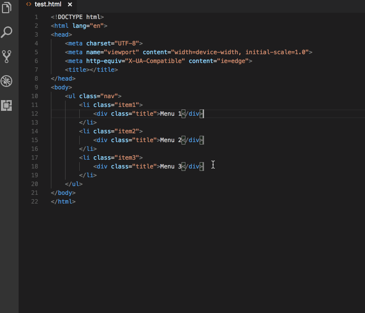

+++
title = "Emmet"
date = 2024-01-12T22:36:24+08:00
weight = 120
type = "docs"
description = ""
isCJKLanguage = true
draft = false
+++

> 原文: [https://code.visualstudio.com/docs/editor/emmet](https://code.visualstudio.com/docs/editor/emmet)

# Emmet in Visual Studio Code Visual Studio Code 中的 Emmet


Support for [Emmet](https://emmet.io/) snippets and expansion is built right into Visual Studio Code, **no extension required**. [Emmet 2.0](https://code.visualstudio.com/blogs/2017/08/07/emmet-2.0) has support for the majority of the [Emmet Actions](https://docs.emmet.io/actions/) including expanding [Emmet abbreviations and snippets](https://docs.emmet.io/cheat-sheet/).

​​	Visual Studio Code 内置对 Emmet 代码段和扩展的支持，无需扩展。Emmet 2.0 支持大多数 Emmet 操作，包括扩展 Emmet 缩写和代码段。

## [How to expand Emmet abbreviations and snippets 如何扩展 Emmet 缩写和代码段](https://code.visualstudio.com/docs/editor/emmet#_how-to-expand-emmet-abbreviations-and-snippets)

Emmet abbreviation and snippet expansions are enabled by default in `html`, `haml`, `pug`, `slim`, `jsx`, `xml`, `xsl`, `css`, `scss`, `sass`, `less` and `stylus` files, as well as any language that inherits from any of the above like `handlebars` and `php`.

​​	Emmet 缩写和代码段扩展在 `html` 、 `haml` 、 `pug` 、 `slim` 、 `jsx` 、 `xml` 、 `xsl` 、 `css` 、 `scss` 、 `sass` 、 `less` 和 `stylus` 文件中默认启用，以及继承自上述任何语言的文件，例如 `handlebars` 和 `php` 。


When you start typing an Emmet abbreviation, you will see the abbreviation displayed in the suggestion list. If you have the suggestion documentation fly-out open, you will see a preview of the expansion as you type. If you are in a stylesheet file, the expanded abbreviation shows up in the suggestion list sorted among the other CSS suggestions.

​​	当您开始键入 Emmet 缩写时，您将在建议列表中看到显示的缩写。如果您打开了建议文档弹出窗口，您将在键入时看到扩展的预览。如果您在样式表文件中，扩展的缩写会显示在建议列表中，并按其他 CSS 建议进行排序。

### [Using Tab for Emmet expansions 使用 Tab 进行 Emmet 扩展](https://code.visualstudio.com/docs/editor/emmet#_using-tab-for-emmet-expansions)

If you want to use the Tab key for expanding the Emmet abbreviations, add the following setting:

​​	如果您想使用 Tab 键扩展 Emmet 缩写，请添加以下设置：

```
"emmet.triggerExpansionOnTab": true
```

This setting allows using the Tab key for indentation when text is not an Emmet abbreviation.

​​	此设置允许在文本不是 Emmet 缩写时使用 Tab 键进行缩进。

### [Emmet when quickSuggestions are disabled 禁用 quickSuggestions 时使用 Emmet](https://code.visualstudio.com/docs/editor/emmet#_emmet-when-quicksuggestions-are-disabled)

If you have disabled the `editor.quickSuggestions` [setting](https://code.visualstudio.com/docs/getstarted/settings), you won't see suggestions as you type. You can still trigger suggestions manually by pressing Ctrl+Space and see the preview.

​​	如果您已禁用 `editor.quickSuggestions` 设置，则在您键入时不会看到建议。您仍可以通过按 Ctrl+空格键手动触发建议并查看预览。

### [Disable Emmet in suggestions 在建议中禁用 Emmet](https://code.visualstudio.com/docs/editor/emmet#_disable-emmet-in-suggestions)

If you don't want to see Emmet abbreviations in suggestions at all, then use the following setting:

​​	如果您根本不想在建议中看到 Emmet 缩写，请使用以下设置：

```
"emmet.showExpandedAbbreviation": "never"
```

You can still use the command **Emmet: Expand Abbreviation** to expand your abbreviations. You can also bind any keyboard shortcut to the command id `editor.emmet.action.expandAbbreviation` as well.

​​	您仍可以使用命令 Emmet：展开缩写来展开缩写。您还可以将任何键盘快捷键绑定到命令 ID `editor.emmet.action.expandAbbreviation` 。

### [Emmet suggestion ordering Emmet 建议排序](https://code.visualstudio.com/docs/editor/emmet#_emmet-suggestion-ordering)

To ensure Emmet suggestions are always on top in the suggestion list, add the following settings:

​​	为确保 Emmet 建议始终位于建议列表的顶部，请添加以下设置：

```
"emmet.showSuggestionsAsSnippets": true,
"editor.snippetSuggestions": "top"
```

## [Emmet abbreviations in other file types 其他文件类型中的 Emmet 缩写](https://code.visualstudio.com/docs/editor/emmet#_emmet-abbreviations-in-other-file-types)

To enable the Emmet abbreviation expansion in file types where it is not available by default, use the `emmet.includeLanguages` setting. Make sure to use [language identifiers](https://code.visualstudio.com/docs/languages/identifiers) for both sides of the mapping, with the right side being the language identifier of an Emmet supported language (see the list above).

​​	要在默认情况下不可用的文件类型中启用 Emmet 缩写扩展，请使用 `emmet.includeLanguages` 设置。确保对映射的双方使用语言标识符，右侧是 Emmet 支持的语言的语言标识符（请参阅上面的列表）。

For example:

​​	例如：

```
"emmet.includeLanguages": {
  "javascript": "javascriptreact",
  "razor": "html",
  "plaintext": "pug"
}
```

Emmet has no knowledge of these new languages, and so there might be Emmet suggestions showing up in non HTML/CSS contexts. To avoid this, you can use the following setting.

​​	Emmet 不了解这些新语言，因此在非 HTML/CSS 上下文中可能会显示 Emmet 建议。为避免这种情况，您可以使用以下设置。

```
"emmet.showExpandedAbbreviation": "inMarkupAndStylesheetFilesOnly"
```

> **Note:** If you used `emmet.syntaxProfiles` previously to map new file types, from VS Code 1.15 onwards you should use the setting `emmet.includeLanguages` instead. `emmet.syntaxProfiles` is meant for [customizing the final output](https://docs.emmet.io/customization/syntax-profiles) only.
>
> ​​	注意：如果您之前使用 `emmet.syntaxProfiles` 映射新文件类型，则从 VS Code 1.15 开始，您应该使用设置 `emmet.includeLanguages` 。 `emmet.syntaxProfiles` 仅用于自定义最终输出。

## [Emmet with multi-cursors Emmet 与多光标](https://code.visualstudio.com/docs/editor/emmet#_emmet-with-multicursors)

You can use most of the Emmet actions with multi-cursors as well:

​​	您也可以将大多数 Emmet 操作与多光标配合使用：



## [Using filters 使用筛选器](https://code.visualstudio.com/docs/editor/emmet#_using-filters)

Filters are special post-processors that modify the expanded abbreviation before it is output to the editor. There are 2 ways to use filters; either globally through the `emmet.syntaxProfiles` setting or directly in the current abbreviation.

​​	筛选器是特殊的后置处理器，它在将展开的缩写输出到编辑器之前对其进行修改。有 2 种方法可以使用筛选器；一种是通过 `emmet.syntaxProfiles` 设置全局使用，另一种是在当前缩写中直接使用。

Below is an example of the first approach using the `emmet.syntaxProfiles` setting to apply the `bem` filter for all the abbreviations in HTML files:

​​	下面是使用 `emmet.syntaxProfiles` 设置将 `bem` 筛选器应用于 HTML 文件中的所有缩写的第一个方法的示例：

```
"emmet.syntaxProfiles": {
  "html": {
    "filters": "bem"
  }
}
```

To provide a filter for just the current abbreviation, append the filter to your abbreviation. For example, `div#page|c` will apply the `comment` filter to the `div#page` abbreviation.

​​	若要仅为当前缩写提供筛选器，请将筛选器追加到您的缩写。例如， `div#page|c` 将 `comment` 筛选器应用于 `div#page` 缩写。

### [BEM filter (bem) BEM 筛选器 (bem)](https://code.visualstudio.com/docs/editor/emmet#_bem-filter-bem)

If you use the [Block Element Modifier](http://getbem.com/) (BEM) way of writing HTML, then `bem` filters are very handy for you to use. To learn more about how to use `bem` filters, read [BEM filter in Emmet](https://docs.emmet.io/filters/bem/).

​​	如果您使用块元素修饰符 (BEM) 方式编写 HTML，那么 `bem` 筛选器对您来说非常方便。若要详细了解如何使用 `bem` 筛选器，请阅读 Emmet 中的 BEM 筛选器。

You can customize this filter by using the `bem.elementSeparator` and `bem.modifierSeparator` preferences as documented in [Emmet Preferences](https://docs.emmet.io/customization/preferences/).

​​	您可以使用 `bem.elementSeparator` 和 `bem.modifierSeparator` 首选项自定义此筛选器，如 Emmet 首选项中所述。

### [Comment filter (c) 注释过滤器 (c)](https://code.visualstudio.com/docs/editor/emmet#_comment-filter-c)

This filter adds comments around important tags. By default, "important tags" are those tags with id and/or class attribute.

​​	此过滤器在重要标签周围添加注释。默认情况下，“重要标签”是指那些具有 id 和/或 class 属性的标签。

For example `div>div#page>p.title+p|c` will be expanded to:

​​	例如 `div>div#page>p.title+p|c` 将展开为：

```
<div>
    <div id="page">
        <p class="title"></p>
        <!-- /.title -->
        <p></p>
    </div>
    <!-- /#page -->
</div>
```

You can customize this filter by using the `filter.commentTrigger`, `filter.commentAfter` and `filter.commentBefore` preferences as documented in [Emmet Preferences](https://docs.emmet.io/customization/preferences/).

​​	您可以使用 `filter.commentTrigger` 、 `filter.commentAfter` 和 `filter.commentBefore` 首选项来自定义此过滤器，如 Emmet 首选项中所述。

The format for the `filter.commentAfter` preference is different in VS Code Emmet 2.0.

​​	在 VS Code Emmet 2.0 中， `filter.commentAfter` 首选项的格式不同。

For example, instead of:

​​	例如，在 VS Code 中，您将使用更简单的：

```
"emmet.preferences": {
  "filter.commentAfter": "\n<!-- /<%= attr('id', '#') %><%= attr('class', '.') %> -->"
}
```

in VS Code, you would use a simpler:

​​	修剪过滤器 (t)

```
"emmet.preferences": {
  "filter.commentAfter": "\n<!-- /[#ID][.CLASS] -->"
}
```

### [Trim filter (t) 此过滤器仅适用于为 Emmet 提供缩写：使用缩写包装命令的缩写。它会从包装的行中删除行标记。](https://code.visualstudio.com/docs/editor/emmet#_trim-filter-t)

This filter is applicable only when providing abbreviations for the **Emmet: Wrap with Abbreviation** command. It [removes line markers](https://docs.emmet.io/actions/wrap-with-abbreviation/#removing-list-markers) from wrapped lines.

​​	使用自定义 Emmet 代码段

## [Using custom Emmet snippets](https://code.visualstudio.com/docs/editor/emmet#_using-custom-emmet-snippets)

Custom Emmet snippets need to be defined in a json file named `snippets.json`. The `emmet.extensionsPath` setting should have the path to the directory containing this file.

​​	自定义 Emmet 代码段需要在名为 `snippets.json` 的 json 文件中定义。 `emmet.extensionsPath` 设置应包含此文件所在目录的路径。

Below is an example for the contents of this `snippets.json` file.

​​	以下是此 `snippets.json` 文件内容的示例。

```
{
  "html": {
    "snippets": {
      "ull": "ul>li[id=${1} class=${2}]*2{ Will work with html, pug, haml and slim }",
      "oll": "<ol><li id=${1} class=${2}> Will only work in html </ol>",
      "ran": "{ Wrap plain text in curly braces }"
    }
  },
  "css": {
    "snippets": {
      "cb": "color: black",
      "bsd": "border: 1px solid ${1:red}",
      "ls": "list-style: ${1}"
    }
  }
}
```

Authoring of Custom Snippets in Emmet 2.0 via the `snippets.json` file differs from the old way of doing the same in a few ways:

​​	通过 `snippets.json` 文件在 Emmet 2.0 中创作自定义代码段与旧方法有以下几点不同：

| Topic 主题                             | Old Emmet 旧 Emmet                                           | Emmet 2.0                                                    |
| :------------------------------------- | :----------------------------------------------------------- | :----------------------------------------------------------- |
| Snippets vs Abbreviations 代码段与缩写 | Supports both in 2 separate properties called `snippets` and `abbreviations` 在 2 个单独的属性中同时支持，分别称为 `snippets` 和 `abbreviations` | The 2 have been combined into a single property called snippets. See default [HTML snippets](https://github.com/emmetio/snippets/blob/master/html.json) and [CSS snippets](https://github.com/emmetio/snippets/blob/master/css.json) 这 2 个属性已合并为一个名为代码段的属性。请参阅默认 HTML 代码段和 CSS 代码段 |
| CSS snippet names CSS 代码段名称       | Can contain `:` 可以包含 `:`                                 | Do not use `:` when defining snippet names. It is used to separate property name and value when Emmet tries to fuzzy match the given abbreviation to one of the snippets. 定义代码段名称时不要使用 `:` 。当 Emmet 尝试将给定的缩写与其中一个代码段模糊匹配时，它用于分隔属性名称和值。 |
| CSS snippet values CSS 代码段值        | Can end with `;` 可以以 `;` 结尾                             | Do not add `;` at end of snippet value. Emmet will add the trailing `;` based on the file type (css/less/scss vs sass/stylus) or the emmet preference set for `css.propertyEnd`, `sass.propertyEnd`, `stylus.propertyEnd` 不要在代码段值末尾添加 `;` 。Emmet 将根据文件类型（css/less/scss 与 sass/stylus）或为 `css.propertyEnd` 、 `sass.propertyEnd` 、 `stylus.propertyEnd` 设置的 emmet 首选项添加尾随 `;` 。 |
| Cursor location 光标位置               | `${cursor}` or ` `${cursor}` 或 `                            | ` can be used ` 可用于                                       |

### [HTML Emmet snippets HTML Emmet 代码段](https://code.visualstudio.com/docs/editor/emmet#_html-emmet-snippets)

HTML custom snippets are applicable to all other markup flavors like `haml` or `pug`. When snippet value is an abbreviation and not actual HTML, the appropriate transformations can be applied to get the right output as per the language type.

​​	HTML 自定义代码段适用于所有其他标记风格，如 `haml` 或 `pug` 。当代码段值是缩写而不是实际 HTML 时，可以应用适当的转换以根据语言类型获得正确的输出。

For example, for an unordered list with a list item, if your snippet value is `ul>li`, you can use the same snippet in `html`, `haml`, `pug` or `slim`, but if your snippet value is `<ul><li></li></ul>`, then it will work only in `html` files.

​​	例如，对于带列表项的无序列表，如果您的代码段值为 `ul>li` ，则可以在 `html` 、 `haml` 、 `pug` 或 `slim` 中使用相同的代码段，但如果您的代码段值为 `<ul><li></li></ul>` ，则它仅适用于 `html` 文件。

If you want a snippet for plain text, then surround the text with `{}`.

​​	如果您想要一个纯文本代码段，则用 `{}` 括起文本。

### [CSS Emmet snippets CSS Emmet 代码段](https://code.visualstudio.com/docs/editor/emmet#_css-emmet-snippets)

Values for CSS Emmet snippets should be a complete property name and value pair.

​​	CSS Emmet 代码段的值应为一个完整的属性名称和值对。

CSS custom snippets are applicable to all other stylesheet flavors like `scss`, `less` or `sass`. Therefore, don't include a trailing `;` at the end of the snippet value. Emmet will add it as needed based on whether the language requires it.

​​	CSS 自定义代码段适用于所有其他样式表类型，如 `scss` 、 `less` 或 `sass` 。因此，不要在代码段值末尾包含尾随 `;` 。Emmet 会根据语言是否需要它来按需添加它。

Do not use `:` in the snippet name. `:` is used to separate property name and value when Emmet tries to fuzzy match the abbreviation to one of the snippets.

​​	不要在代码段名称中使用 `:` 。当 Emmet 尝试将缩写与其中一个代码段模糊匹配时， `:` 用于分隔属性名称和值。

### [Tab stops and cursors in custom snippets 自定义代码段中的制表符停靠点和光标](https://code.visualstudio.com/docs/editor/emmet#_tab-stops-and-cursors-in-custom-snippets)

The syntax for tab stops in custom Emmet snippets follows the [Textmate snippets syntax](https://manual.macromates.com/en/snippets).

​​	自定义 Emmet 代码段中制表符停靠点的语法遵循 Textmate 代码段语法。

- Use `${1}`, `${2}` for tab stops and `${1:placeholder}` for tab stops with placeholders.
  对于制表符停靠点，使用 `${1}` 、 `${2}` ；对于带占位符的制表符停靠点，使用 `${1:placeholder}` 。
- Previously, `|` or `${cursor}` was used to denote the cursor location in the custom Emmet snippet. This is no longer supported. Use `${1}` instead.
  以前， `|` 或 `${cursor}` 用于表示自定义 Emmet 代码段中的光标位置。此功能不再受支持。请改用 `${1}` 。

## [Emmet configuration Emmet 配置](https://code.visualstudio.com/docs/editor/emmet#_emmet-configuration)

Below are Emmet [settings](https://code.visualstudio.com/docs/getstarted/settings) that you can use to customize your Emmet experience in VS Code.

​​	以下列出了可在 VS Code 中用于自定义 Emmet 体验的 Emmet 设置。

- `emmet.includeLanguages`

  Use this setting to add mapping between the language of your choice and one of the Emmet supported languages to enable Emmet in the former using the syntax of the latter. Make sure to use language IDs for both sides of the mapping.

  ​​	使用此设置可在您选择的语言与 Emmet 支持的语言之间添加映射，以便使用后者的语法在前者中启用 Emmet。请务必对映射的双方使用语言 ID。

  For example:

  ​​	例如：

  ```
  "emmet.includeLanguages": {
    "javascript": "javascriptreact",
    "plaintext": "pug"
  }
  ```

- `emmet.excludeLanguages`

  If there is a language where you do not want to see Emmet expansions, add it in this setting which takes an array of language ID strings.

  ​​	如果您不希望在某种语言中看到 Emmet 展开，请将其添加到此设置中，该设置采用语言 ID 字符串数组。

- `emmet.syntaxProfiles`

  See [Emmet Customization of output profile](https://docs.emmet.io/customization/syntax-profiles/#create-your-own-profile) to learn how you can customize the output of your HTML abbreviations.

  ​​	请参阅 Emmet 输出配置文件自定义，了解如何自定义 HTML 缩写的输出。

  For example:

  ​​	例如：

  ```
  "emmet.syntaxProfiles": {
    "html": {
      "attr_quotes": "single"
    },
    "jsx": {
      "self_closing_tag": true
    }
  }
  ```

- `emmet.variables`

  Customize variables used by Emmet snippets.

  ​​	自定义 Emmet 代码段使用的变量。

  For example:

  ​​	例如：

  ```
  "emmet.variables": {
    "lang": "de",
    "charset": "UTF-16"
  }
  ```

- `emmet.showExpandedAbbreviation`

  Controls the Emmet suggestions that show up in the suggestion/completion list.

  ​​	控制在建议/完成列表中显示的 Emmet 建议。

  | Setting Value 设置 值            | Description 说明                                             |
  | :------------------------------- | :----------------------------------------------------------- |
  | `never`                          | Never show Emmet abbreviations in the suggestion list for any language. 对于任何语言，绝不显示 Emmet 缩写建议列表。 |
  | `inMarkupAndStylesheetFilesOnly` | Show Emmet suggestions only for languages that are purely markup and stylesheet based ('html', 'pug', 'slim', 'haml', 'xml', 'xsl', 'css', 'scss', 'sass', 'less', 'stylus'). 仅为纯标记和样式表语言（“html”、“pug”、“slim”、“haml”、“xml”、“xsl”、“css”、“scss”、“sass”、“less”、“stylus”）显示 Emmet 建议。 |
  | `always`                         | Show Emmet suggestions in all Emmet supported modes as well as the languages that have a mapping in the `emmet.includeLanguages` setting. 在所有 Emmet 支持的模式以及在 `emmet.includeLanguages` 设置中具有映射的语言中显示 Emmet 建议。 |

  **Note:** In the `always` mode, the new Emmet implementation is not context aware. For example, if you are editing a JavaScript React file, you will get Emmet suggestions not only when writing markup but also while writing JavaScript.

  ​​	注意：在 `always` 模式中，新的 Emmet 实现不具备上下文感知能力。例如，如果您正在编辑 JavaScript React 文件，您不仅在编写标记时会收到 Emmet 建议，在编写 JavaScript 时也会收到。

- `emmet.showAbbreviationSuggestions`

  Shows possible emmet abbreviations as suggestions. It is `true` by default.

  ​​	将可能的 emmet 缩写显示为建议。默认情况下为 `true` 。

  For example, when you type `li`, you get suggestions for all emmet snippets starting with `li` like `link`, `link:css` , `link:favicon` etc. This is helpful in learning Emmet snippets that you never knew existed unless you knew the [Emmet cheatsheet](https://docs.emmet.io/cheat-sheet/) by heart.

  ​​	例如，当您键入 `li` 时，您会收到所有以 `li` 开头的 emmet 代码段的建议，如 `link` 、 `link:css` 、 `link:favicon` 等。这有助于学习您从未知道存在的 Emmet 代码段，除非您熟记了 Emmet 速查表。

  Not applicable in stylesheets or when `emmet.showExpandedAbbreviation` is set to `never`.

  ​​	不适用于样式表或将 `emmet.showExpandedAbbreviation` 设置为 `never` 的情况。

- `emmet.extensionsPath`

  Provide the location of the directory that houses the `snippets.json` file which in turn has your custom snippets.

  ​​	提供包含 `snippets.json` 文件的目录的位置，该文件反过来包含您的自定义代码段。

- `emmet.triggerExpansionOnTab`

  Set this to true to enable expanding Emmet abbreviations with Tab key. We use this setting to provide the appropriate fallback to provide indentation when there is no abbreviation to expand.

  ​​	将此设置为 true 以启用使用 Tab 键展开 Emmet 缩写。我们使用此设置提供适当的回退，以便在没有要展开的缩写时提供缩进。

- `emmet.showSuggestionsAsSnippets`

  If set to `true`, then Emmet suggestions will be grouped along with other snippets allowing you to order them as per `editor.snippetSuggestions` setting. Set this to `true` and `editor.snippetSuggestions` to `top`, to ensure that Emmet suggestions always show up on top among other suggestions.

  ​​	如果设置为 `true` ，则 Emmet 建议将与其他代码段一起分组，允许您按照 `editor.snippetSuggestions` 设置对它们进行排序。将此设置为 `true` 和 `editor.snippetSuggestions` 为 `top` ，以确保 Emmet 建议始终显示在其他建议之上。

- `emmet.preferences`

  You can use this setting to customize Emmet as documented in [Emmet Preferences](https://docs.emmet.io/customization/preferences/). The below customizations are currently supported:

  ​​	您可以使用此设置自定义 Emmet，如 Emmet 首选项中所述。目前支持以下自定义项：

  - `css.propertyEnd`
  - `css.valueSeparator`
  - `sass.propertyEnd`
  - `sass.valueSeparator`
  - `stylus.propertyEnd`
  - `stylus.valueSeparator`
  - `css.unitAliases`
  - `css.intUnit`
  - `css.floatUnit`
  - `bem.elementSeparator`
  - `bem.modifierSeparator`
  - `filter.commentBefore`
  - `filter.commentTrigger`
  - `filter.commentAfter`
  - `format.noIndentTags`
  - `format.forceIndentationForTags`
  - `profile.allowCompactBoolean`
  - `css.fuzzySearchMinScore`

  The format for the `filter.commentAfter` preference is different and simpler in Emmet 2.0.

  ​​	在 Emmet 2.0 中， `filter.commentAfter` 首选项的格式不同且更简单。

  For example, instead of the older format

  ​​	例如，您将使用

  ```
  "emmet.preferences": {
    "filter.commentAfter": "\n<!-- /<%= attr('id', '#') %><%= attr('class', '.') %> -->"
  }
  ```

  you would use

  ​​	而不是旧格式

  ```
  "emmet.preferences": {
    "filter.commentAfter": "\n<!-- /[#ID][.CLASS] -->"
  }
  ```

  If you want support for any of the other preferences as documented in [Emmet Preferences](https://docs.emmet.io/customization/preferences/), please log a [feature request](https://github.com/microsoft/vscode/issues/new).

  ​​	如果您希望支持 Emmet 首选项中记录的任何其他首选项，请记录功能请求。

## [Next steps 后续步骤](https://code.visualstudio.com/docs/editor/emmet#_next-steps)

Emmet is just one of the great web developer features in VS Code. Read on to find out about:

​​	Emmet 只是 VS Code 中众多出色的 Web 开发人员功能之一。继续阅读以了解：

- [HTML](https://code.visualstudio.com/docs/languages/html) - VS Code supports HTML with IntelliSense, closing tags, and formatting.
  HTML - VS Code 支持具有 IntelliSense、闭合标签和格式的 HTML。
- [CSS](https://code.visualstudio.com/docs/languages/css) - We offer rich support for CSS, SCSS and Less.
  CSS - 我们为 CSS、SCSS 和 Less 提供丰富的支持。

## [Troubleshooting 故障排除](https://code.visualstudio.com/docs/editor/emmet#_troubleshooting)

### [Custom tags do not get expanded in the suggestion list 自定义标签不会在建议列表中展开](https://code.visualstudio.com/docs/editor/emmet#_custom-tags-do-not-get-expanded-in-the-suggestion-list)

Custom tags when used in an expression like `MyTag>YourTag` or `MyTag.someclass` do show up in the suggestion list. But when these are used on their own like `MyTag`, they do not appear in the suggestion list. This is designed so to avoid noise in the suggestion list as every word is a potential custom tag.

​​	当在类似 `MyTag>YourTag` 或 `MyTag.someclass` 的表达式中使用自定义标签时，它们会显示在建议列表中。但当它们单独使用时，如 `MyTag` ，它们不会出现在建议列表中。这是为了避免建议列表中出现噪音，因为每个单词都是一个潜在的自定义标签。

Add the following setting to enable expanding of Emmet abbreviations using tab which will expand custom tags in all cases.

​​	添加以下设置以启用使用 Tab 键展开 Emmet 缩写，这将在所有情况下展开自定义标签。

```
"emmet.triggerExpansionOnTab": true
```

### [My HTML snippets ending with + do not work 以 + 结尾的 HTML 代码段不起作用](https://code.visualstudio.com/docs/editor/emmet#_my-html-snippets-ending-with-do-not-work)

HTML snippets ending with `+` like `select+` and `ul+` from the [Emmet cheatsheet](https://docs.emmet.io/cheat-sheet/) are not supported. This is a known issue in Emmet 2.0 [Issue: emmetio/html-matcher#1](https://github.com/emmetio/html-matcher/issues/1). A workaround is to create your own [custom Emmet snippets](https://code.visualstudio.com/docs/editor/emmet#_using-custom-emmet-snippets) for such scenarios.

​​	以 `+` 结尾的 HTML 代码段，如 `select+` 和 `ul+` （来自 Emmet 速查表）不受支持。这是 Emmet 2.0 中的一个已知问题：问题：emmetio/html-matcher#1。解决方法是为这种场景创建您自己的自定义 Emmet 代码段。

### [Abbreviations are failing to expand 缩写无法展开](https://code.visualstudio.com/docs/editor/emmet#_abbreviations-are-failing-to-expand)

First, check if you're using custom snippets (if there is a `snippets.json` file being picked up by the `emmet.extensionsPath` setting). The format of custom snippets changed in VS Code release 1.53. Instead of using `|` to indicate where the cursor position is, use tokens such as `${1}`, `${2}`, etc. instead. The [default CSS snippets file](https://github.com/emmetio/emmet/blob/master/snippets/css.json) from the `emmetio/emmet` repository shows examples of the new cursor position format.

​​	首先，检查您是否正在使用自定义代码段（如果存在 `snippets.json` 文件被 `emmet.extensionsPath` 设置选中）。自定义代码段的格式在 VS Code 1.53 版本中已更改。不要再使用 `|` 来指示光标位置，而应使用诸如 `${1}` 、 `${2}` 等标记。来自 `emmetio/emmet` 存储库的默认 CSS 代码段文件显示了新光标位置格式的示例。

If abbreviations are still failing to expand:

​​	如果缩写仍无法展开：

- Check the [builtin extensions](https://code.visualstudio.com/docs/editor/extension-marketplace#_extensions-view-filters) to see if Emmet has been disabled.
  检查内置扩展以查看 Emmet 是否已被禁用。
- Try restarting the extension host by running the **Developer: Restart Extension Host** (`workbench.action.restartExtensionHost`) command in the [Command Palette](https://code.visualstudio.com/docs/getstarted/userinterface#_command-palette).
  尝试通过在命令面板中运行“开发人员：重新启动扩展主机”（ `workbench.action.restartExtensionHost` ）命令来重新启动扩展主机。

### [Where can I set all the preferences as documented in Emmet preferences? 我可以在哪里设置 Emmet 首选项文档中记录的所有首选项？](https://code.visualstudio.com/docs/editor/emmet#_where-can-i-set-all-the-preferences-as-documented-in-emmet-preferenceshttpsdocsemmetiocustomizationpreferences)

You can set the preferences using the setting `emmet.preferences`. Only a subset of the preferences that are documented in [Emmet preferences](https://docs.emmet.io/customization/preferences/) can be customized. Please read the preferences section under [Emmet configuration](https://code.visualstudio.com/docs/editor/emmet#_emmet-configuration).

​​	您可以使用设置 `emmet.preferences` 来设置首选项。只能自定义 Emmet 首选项文档中记录的部分首选项。请阅读 Emmet 配置下的首选项部分。

### [Any tips and tricks? 有什么提示和技巧吗？](https://code.visualstudio.com/docs/editor/emmet#_any-tips-and-tricks)

Of course!

​​	当然有！

- In CSS abbreviations, when you use `:`, the left part is used to fuzzy match with the CSS property name and the right part is used to match with CSS property value. Take full advantage of this by using abbreviations like `pos:f`, `trf:rx`, `fw:b`, etc.
  在 CSS 缩写中，当您使用 `:` 时，左侧部分用于与 CSS 属性名称模糊匹配，右侧部分用于与 CSS 属性值匹配。通过使用 `pos:f` 、 `trf:rx` 、 `fw:b` 等缩写充分利用这一点。
- Explore all other Emmet features as documented in [Emmet Actions](https://docs.emmet.io/actions/).
  在 Emmet 操作中记录的其他 Emmet 功能中探索所有其他功能。
- Don't hesitate to create your own [custom Emmet snippets](https://code.visualstudio.com/docs/editor/emmet#_using-custom-emmet-snippets).
  不要犹豫，创建您自己的自定义 Emmet 代码段。
