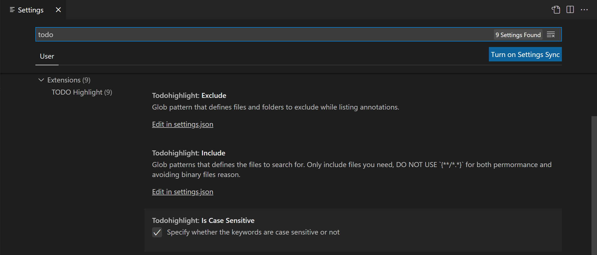
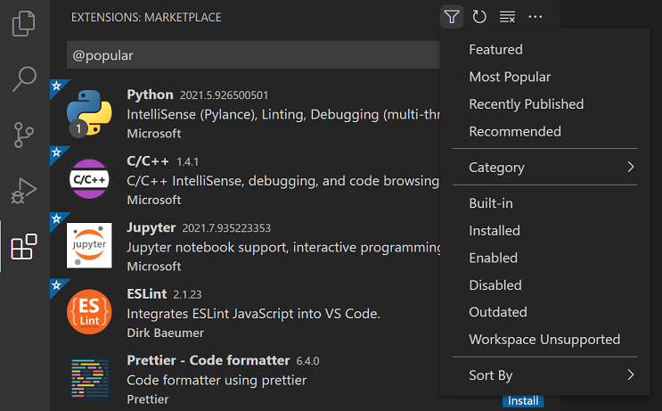

+++
title = "Extension Marketplace"
date = 2024-01-12T22:36:24+08:00
weight = 10
type = "docs"
description = ""
isCJKLanguage = true
draft = false
+++

> 原文: [https://code.visualstudio.com/docs/editor/extension-marketplace](https://code.visualstudio.com/docs/editor/extension-marketplace)

# Extension Marketplace 扩展市场


**Increase the power of Visual Studio Code through Extensions
通过扩展增强 Visual Studio Code 的功能**

The features that Visual Studio Code includes out-of-the-box are just the start. VS Code extensions let you add languages, debuggers, and tools to your installation to support your development workflow. VS Code's rich extensibility model lets extension authors plug directly into the VS Code UI and contribute functionality through the same APIs used by VS Code. This article explains how to find, install, and manage VS Code extensions from the [Visual Studio Code Marketplace](https://marketplace.visualstudio.com/VSCode).

​​	Visual Studio Code 开箱即用的功能仅仅是开始。VS Code 扩展使您能够向安装中添加语言、调试器和工具，以支持您的开发工作流。VS Code 丰富的可扩展性模型使扩展作者能够直接插入 VS Code UI，并通过 VS Code 使用的相同 API 提供功能。本文介绍如何从 Visual Studio Code Marketplace 查找、安装和管理 VS Code 扩展。

## [Browse for extensions 浏览扩展](https://code.visualstudio.com/docs/editor/extension-marketplace#_browse-for-extensions)

You can browse and install extensions from within VS Code. Bring up the Extensions view by clicking on the Extensions icon in the **Activity Bar** on the side of VS Code or the **View: Extensions** command (Ctrl+Shift+X).

​​	您可以在 VS Code 中浏览和安装扩展。通过单击 VS Code 侧边栏中的活动栏中的扩展图标或视图：扩展命令 (Ctrl+Shift+X) 来调出扩展视图。


This will show you a list of the most popular VS Code extensions on the [VS Code Marketplace](https://marketplace.visualstudio.com/VSCode).

​​	这将向您显示 VS Code Marketplace 上最受欢迎的 VS Code 扩展列表。


Each extension in the list includes a brief description, the publisher, the download count, and a five star rating. You can select the extension item to display the extension's details page where you can learn more.

​​	列表中的每个扩展都包括简要说明、发布者、下载次数和五星评级。您可以选择扩展项以显示扩展的详细信息页面，您可以在其中了解更多信息。

> **Note:** If your computer's Internet access goes through a proxy server, you will need to configure the proxy server. See [Proxy server support](https://code.visualstudio.com/docs/setup/network#_proxy-server-support) for details.
>
> ​​	注意：如果您的计算机的 Internet 访问通过代理服务器进行，您将需要配置代理服务器。有关详细信息，请参阅代理服务器支持。

## [Install an extension 安装扩展](https://code.visualstudio.com/docs/editor/extension-marketplace#_install-an-extension)

To install an extension, select the **Install** button. Once the installation is complete, the **Install** button will change to the **Manage** gear button.

​​	要安装扩展，请选择“安装”按钮。安装完成后，“安装”按钮将变为“管理”齿轮按钮。

### [Find and install an extension 查找并安装扩展](https://code.visualstudio.com/docs/editor/extension-marketplace#_find-and-install-an-extension)

For example, let's install the popular [TODO Highlight](https://marketplace.visualstudio.com/items?itemName=wayou.vscode-todo-highlight) extension. This extension highlights text like 'TODO:' and 'FIXME:' in your source code so you can quickly find undone sections.

​​	例如，我们来安装流行的 TODO Highlight 扩展。此扩展会突出显示源代码中类似“TODO:”和“FIXME:”的文本，以便您可以快速找到未完成的部分。


In the Extensions view (Ctrl+Shift+X), type 'todo' in the search box to filter the Marketplace offerings to extensions with 'todo' in the title or metadata. You should see the **TODO Highlight** extension in the list.

​​	在“扩展”视图（Ctrl+Shift+X）中，在搜索框中键入“todo”以将 Marketplace 产品过滤为标题或元数据中包含“todo”的扩展。您应该在列表中看到 TODO Highlight 扩展。


An extension is uniquely identified by its publisher and extension IDs. If you select the **TODO Highlight** extension, you will see the Extension details page, where you can find the extension ID, in this case, `wayou.vscode-todo-highlight`. Knowing the extension ID can be helpful if there are several similarly named extensions.

​​	扩展由其发布者和扩展 ID 唯一标识。如果您选择 TODO Highlight 扩展，您将看到“扩展详细信息”页面，您可以在其中找到扩展 ID，在本例中为 `wayou.vscode-todo-highlight` 。如果存在多个名称相似的扩展，了解扩展 ID 会有所帮助。


Select the **Install** button, and VS Code will download and install the extension from the Marketplace. When the installation is complete, the **Install** button will be replaced with a **Manage** gear button.

​​	选择“安装”按钮，VS Code 将从 Marketplace 下载并安装扩展。安装完成后，“安装”按钮将替换为“管理”齿轮按钮。


To see the TODO Highlight extension in action, open any source code file and add the text 'TODO:' and you will see the text highlighted.

​​	若要查看 TODO Highlight 扩展的实际效果，请打开任何源代码文件并添加文本“TODO:”，您将看到该文本突出显示。

The TODO Highlight extension contributes the commands, **TODO-Highlight: List highlighted annotations** and **TODO-Highlight: Toggle highlight**, that you can find in the Command Palette (Ctrl+Shift+P). The **TODO-Highlight: Toggle highlight** command lets you quickly disable or enable highlighting.

​​	TODO Highlight 扩展提供了命令“TODO-Highlight: 列出突出显示的注释”和“TODO-Highlight: 切换突出显示”，您可以在命令面板（Ctrl+Shift+P）中找到这些命令。使用“TODO-Highlight: 切换突出显示”命令，您可以快速禁用或启用突出显示。


The extension also provides settings for tuning its behavior, which you can find in the Settings editor (Ctrl+,). For example, you might want the text search to be case insensitive and you can uncheck the **Todohighlight: Is Case Sensitive** setting.

​​	该扩展还提供了用于调整其行为的设置，您可以在设置编辑器（Ctrl+,）中找到这些设置。例如，您可能希望文本搜索不区分大小写，您可以取消选中“Todohighlight: 区分大小写”设置。



If an extension doesn't provide the functionality you want, you can always **Uninstall** the extension from the **Manage** button context menu.

​​	如果某个扩展未提供您想要的功能，您可以随时从“管理”按钮的上下文菜单中卸载该扩展。


This has been just one example of how to install and use an extension. The VS Code Marketplace has thousands of extensions supporting hundreds of programming languages and tasks. Everything from full featured language support for [Java](https://marketplace.visualstudio.com/items?itemName=redhat.java), [Python](https://marketplace.visualstudio.com/items?itemName=ms-python.python), [Go](https://marketplace.visualstudio.com/items?itemName=golang.Go), and [C++](https://marketplace.visualstudio.com/items?itemName=ms-vscode.cpptools) to simple extensions that [create GUIDs](https://marketplace.visualstudio.com/items?itemName=nwallace.createGUID), change the [color theme](https://marketplace.visualstudio.com/items?itemName=PKief.material-icon-theme), or add [virtual pets](https://marketplace.visualstudio.com/items?itemName=tonybaloney.vscode-pets) to the editor.

​​	这只是有关如何安装和使用扩展的一个示例。VS Code Marketplace 有数千个扩展，支持数百种编程语言和任务。从对 Java、Python、Go 和 C++ 的全功能语言支持到创建 GUID、更改颜色主题或将虚拟宠物添加到编辑器的简单扩展，应有尽有。

### [Extension details 扩展详细信息](https://code.visualstudio.com/docs/editor/extension-marketplace#_extension-details)

On the extension details page, you can read the extension's README and review the extension's:

​​	在扩展详细信息页面上，您可以阅读扩展的 README 并查看扩展的：

- **Feature Contributions** - The extension's additions to VS Code such as settings, commands and keyboard shortcuts, language grammars, debugger, etc.
  功能贡献 - 扩展对 VS Code 的补充，例如设置、命令和键盘快捷方式、语言语法、调试器等。
- **Changelog** - The extension repository CHANGELOG if available.
  变更日志 - 如果有，则为扩展存储库的变更日志。
- **Dependencies** - Lists if the extension depends on any other extensions.
  依赖项 - 列出扩展是否依赖于任何其他扩展。


If an extension is an Extension Pack, the **Extension Pack** section will display which extensions will be installed when you install the pack. [Extension Packs](https://code.visualstudio.com/api/references/extension-manifest#_extension-packs) bundle separate extensions together so they can be easily installed at one time.

​​	如果扩展是扩展包，则扩展包部分将显示安装包时将安装哪些扩展。扩展包将单独的扩展捆绑在一起，以便可以一次轻松安装它们。


### [Extensions view filter and commands 扩展视图筛选器和命令](https://code.visualstudio.com/docs/editor/extension-marketplace#_extensions-view-filter-and-commands)

You can filter the Extensions view with the **Filter Extensions** context menu.

​​	您可以使用“筛选扩展”上下文菜单筛选“扩展”视图。



There are filters to show:

​​	有筛选器可显示：

- The list of currently installed extensions
  当前已安装的扩展列表
- The list of outdated extensions that can be updated
  可以更新的过时扩展列表
- The list of currently enabled/disabled extensions
  当前已启用/禁用的扩展列表
- The list of recommended extensions based on your workspace
  根据您的工作区推荐的扩展列表
- The list of globally popular extensions
  全球流行的扩展列表

You can sort the extension list by **Install Count** or **Rating** in either ascending or descending order. You can learn more about extension search filters [below](https://code.visualstudio.com/docs/editor/extension-marketplace#_extensions-view-filters).

​​	您可以按安装计数或评级对扩展列表进行升序或降序排序。您可以在下面了解有关扩展搜索过滤器的更多信息。

You can run additional Extensions view commands via the `...` **View and More Actions** button.

​​	您可以通过 `...` 查看和更多操作按钮运行其他扩展视图命令。


Through this context menu you can control extension updates, enable or disable all extensions, and use the [Extension Bisect](https://code.visualstudio.com/blogs/2021/02/16/extension-bisect) utility to isolate problematic extension behavior.

​​	通过此上下文菜单，您可以控制扩展更新，启用或禁用所有扩展，并使用扩展二分法实用程序来隔离有问题的扩展行为。


### [Search for an extension 搜索扩展](https://code.visualstudio.com/docs/editor/extension-marketplace#_search-for-an-extension)

You can clear the Search box at the top of the Extensions view and type in the name of the extension, tool, or programming language you're looking for.

​​	您可以清除扩展视图顶部的搜索框，然后键入您要查找的扩展、工具或编程语言的名称。

For example, typing 'python' will bring up a list of Python language extensions:

​​	例如，键入“python”将列出 Python 语言扩展：


If you know the exact identifier for an extension you're looking for, you can use the `@id:` prefix, for example `@id:vue.volar`. Additionally, to filter or sort results, you can use the [filter](https://code.visualstudio.com/docs/editor/extension-marketplace#_extensions-view-filters) and [sort](https://code.visualstudio.com/docs/editor/extension-marketplace#_sorting) commands, detailed below.

​​	如果您知道要查找的扩展的确切标识符，可以使用 `@id:` 前缀，例如 `@id:vue.volar` 。此外，若要筛选或排序结果，可以使用下面详细介绍的筛选和排序命令。

## [Manage extensions 管理扩展](https://code.visualstudio.com/docs/editor/extension-marketplace#_manage-extensions)

VS Code makes it easy to manage your extensions. You can install, disable, update, and uninstall extensions through the Extensions view, the **Command Palette** (commands have the **Extensions:** prefix) or command-line switches.

​​	VS Code 使得管理扩展变得容易。您可以通过“扩展”视图、命令面板（命令具有 Extensions: 前缀）或命令行开关来安装、禁用、更新和卸载扩展。

### [List installed extensions 列出已安装的扩展](https://code.visualstudio.com/docs/editor/extension-marketplace#_list-installed-extensions)

By default, the Extensions view will show the extensions you currently have enabled, all extensions that are recommended for you, and a collapsed view of all extensions you have disabled. You can use the **Show Installed Extensions** command, available in the **Command Palette** (Ctrl+Shift+P) or the **More Actions** (`...`) dropdown menu, to clear any text in the search box and show the list of all installed extensions, which includes those that have been disabled.

​​	默认情况下，“扩展”视图将显示您当前已启用的扩展、所有推荐给您的扩展以及您已禁用的所有扩展的折叠视图。您可以使用“显示已安装的扩展”命令（可在命令面板 (Ctrl+Shift+P) 或“更多操作”( `...` ) 下拉菜单中找到）清除搜索框中的任何文本并显示所有已安装扩展的列表，其中包括已禁用的扩展。

### [Uninstall an extension 卸载扩展](https://code.visualstudio.com/docs/editor/extension-marketplace#_uninstall-an-extension)

To uninstall an extension, select the **Manage** gear button at the right of an extension entry and then choose **Uninstall** from the dropdown menu. This will uninstall the extension and prompt you to reload VS Code.

​​	要卸载扩展，请选择扩展条目右侧的“管理”齿轮按钮，然后从下拉菜单中选择“卸载”。这将卸载扩展并提示您重新加载 VS Code。


### [Disable an extension 禁用扩展](https://code.visualstudio.com/docs/editor/extension-marketplace#_disable-an-extension)

If you don't want to permanently remove an extension, you can instead temporarily disable the extension by clicking the gear button at the right of an extension entry. You can disable an extension globally or just for your current Workspace. You will be prompted to reload VS Code after you disable an extension.

​​	如果您不想永久删除扩展，则可以通过单击扩展条目右侧的齿轮按钮暂时禁用扩展。您可以全局禁用扩展，也可以仅针对当前工作区禁用扩展。禁用扩展后，系统会提示您重新加载 VS Code。

If you want to quickly disable all installed extensions, there is a **Disable All Installed Extensions** command in the **Command Palette** and **More Actions** (`...`) dropdown menu.

​​	如果您想快速禁用所有已安装的扩展，则“命令面板”和“更多操作 ( `...` )”下拉菜单中有一个“禁用所有已安装的扩展”命令。

Extensions remain disabled for all VS Code sessions until you re-enable them.

​​	扩展在所有 VS Code 会话中保持禁用状态，直到您重新启用它们。

### [Enable an extension 启用扩展](https://code.visualstudio.com/docs/editor/extension-marketplace#_enable-an-extension)

Similarly if you have disabled an extension (it will be in the **Disabled** section of the list and marked ***Disabled***), you can re-enable it with the **Enable** or **Enable (Workspace)** commands in the dropdown menu.

​​	同样，如果您已禁用扩展（它将位于列表的“已禁用”部分并标记为“已禁用”），则可以使用下拉菜单中的“启用”或“启用（工作区）”命令重新启用它。


There is also an **Enable All Extensions** command in the **More Actions** (`...`) dropdown menu.

​​	“更多操作 ( `...` )”下拉菜单中还有一个“启用所有扩展”命令。

### [Extension auto-update 扩展自动更新](https://code.visualstudio.com/docs/editor/extension-marketplace#_extension-autoupdate)

VS Code checks for extension updates and installs them automatically. After an update, you will be prompted to reload VS Code. If you'd rather update your extensions manually, you can disable auto-update with the **Disable Auto Updating Extensions** command that sets the `extensions.autoUpdate` [setting](https://code.visualstudio.com/docs/getstarted/settings) to `false`. If you don't want VS Code to even check for updates, you can set the `extensions.autoCheckUpdates` setting to false.

​​	VS Code 会检查扩展更新并自动安装它们。更新后，系统会提示您重新加载 VS Code。如果您更愿意手动更新扩展，可以使用“禁用自动更新扩展”命令禁用自动更新，该命令将 `extensions.autoUpdate` 设置设置为 `false` 。如果您不希望 VS Code 甚至检查更新，可以将 `extensions.autoCheckUpdates` 设置设为 false。

### [Update an extension manually 手动更新扩展](https://code.visualstudio.com/docs/editor/extension-marketplace#_update-an-extension-manually)

If you have extensions auto-update disabled, you can quickly look for extension updates by using the **Show Outdated Extensions** command that uses the `@outdated` filter. This will display any available updates for your currently installed extensions. Select the **Update** button for the outdated extension and the update will be installed and you'll be prompted to reload VS Code. You can also update all your outdated extensions at one time with the **Update All Extensions** command. If you also have automatic checking for updates disabled, you can use the **Check for Extension Updates** command to check which of your extensions can be updated.

​​	如果您禁用了扩展自动更新，可以使用“显示过时扩展”命令快速查找扩展更新，该命令使用 `@outdated` 筛选器。这将显示您当前已安装扩展的任何可用更新。选择过时扩展的“更新”按钮，更新将被安装，系统会提示您重新加载 VS Code。您还可以使用“更新所有扩展”命令一次更新所有过时扩展。如果您还禁用了自动检查更新，可以使用“检查扩展更新”命令检查哪些扩展可以更新。

## [Recommended extensions 推荐的扩展](https://code.visualstudio.com/docs/editor/extension-marketplace#_recommended-extensions)

You can see a list of recommended extensions using **Show Recommended Extensions**, which sets the `@recommended` [filter](https://code.visualstudio.com/docs/editor/extension-marketplace#_extensions-view-filters). Extension recommendations can either be:

​​	您可以使用“显示推荐的扩展程序”查看推荐的扩展程序列表，该列表设置了 `@recommended` 过滤器。扩展程序推荐可以是：

- **Workspace Recommendations** - Recommended by other users of your current workspace.
  工作区推荐 - 由您当前工作区的其他用户推荐。
- **Other Recommendations** - Recommended based on recently opened files.
  其他推荐 - 根据最近打开的文件推荐。

See the section below to learn how to [contribute](https://code.visualstudio.com/docs/editor/extension-marketplace#_workspace-recommended-extensions) recommendations for other users in your project.

​​	请参阅下面的部分，了解如何为项目中的其他用户提供推荐。

### [Ignoring recommendations 忽略推荐](https://code.visualstudio.com/docs/editor/extension-marketplace#_ignoring-recommendations)

To dismiss a recommendation, select on the extension item to open the Details page and then select the **Manage** gear button to display the context menu. Select the **Ignore Recommendation** menu item. Ignored recommendations will no longer be recommended to you.

​​	要忽略推荐，请选择扩展程序项目以打开“详细信息”页面，然后选择“管理”齿轮按钮以显示上下文菜单。选择“忽略推荐”菜单项。忽略的推荐将不再向您推荐。


## [Configuring extensions 配置扩展程序](https://code.visualstudio.com/docs/editor/extension-marketplace#_configuring-extensions)

VS Code extensions may have very different configurations and requirements. Some extensions contribute [settings](https://code.visualstudio.com/docs/getstarted/settings) to VS Code, which can be modified in the Settings editor. Other extensions may have their own configuration files. Extensions may also require installation and setup of additional components like compilers, debuggers, and command-line tools. Consult the extension's README (visible in the Extensions view details page) or go to the extension page on the [VS Code Marketplace](https://marketplace.visualstudio.com/VSCode) (click on the extension name in the details page). Many extensions are open source and have a link to their repository on their Marketplace page.

​​	VS Code 扩展可能具有非常不同的配置和要求。某些扩展会向 VS Code 提供设置，这些设置可以在“设置”编辑器中修改。其他扩展可能具有自己的配置文件。扩展可能还需要安装和设置其他组件，如编译器、调试器和命令行工具。查阅扩展的 README（在扩展视图详细信息页面中可见）或转到 VS Code Marketplace 上的扩展页面（在详细信息页面中单击扩展名称）。许多扩展都是开源的，并在其 Marketplace 页面上提供指向其存储库的链接。

## [Command line extension management 命令行扩展管理](https://code.visualstudio.com/docs/editor/extension-marketplace#_command-line-extension-management)

To make it easier to automate and configure VS Code, it is possible to list, install, and uninstall extensions from the [command line](https://code.visualstudio.com/docs/editor/command-line). When identifying an extension, provide the full name of the form `publisher.extension`, for example `ms-python.python`.

​​	为了更轻松地实现 VS Code 的自动化和配置，可以从命令行列出、安装和卸载扩展。标识扩展时，提供完整名称，格式为 `publisher.extension` ，例如 `ms-python.python` 。

Example:

​​	示例：

```
code --extensions-dir <dir>
    Set the root path for extensions.
code --list-extensions
    List the installed extensions.
code --show-versions
    Show versions of installed extensions, when using --list-extension.
code --install-extension (<extension-id> | <extension-vsix-path>)
    Installs an extension.
code --uninstall-extension (<extension-id> | <extension-vsix-path>)
    Uninstalls an extension.
code --enable-proposed-api (<extension-id>)
    Enables proposed API features for extensions. Can receive one or more extension IDs to enable individually.
```

You can see the extension ID on the extension details page under the Marketplace Info.

​​	您可以在 Marketplace 信息下的扩展详细信息页面上看到扩展 ID。


## [Extensions view filters 扩展视图筛选器](https://code.visualstudio.com/docs/editor/extension-marketplace#_extensions-view-filters)

The Extensions view search box supports filters to help you find and manage extensions. You may have seen filters such as `@installed` and `@recommended` if you used the commands **Show Installed Extensions** and **Show Recommended Extensions**. Also, there are filters available to let you sort by popularity or ratings and search by category (for example 'Linters') and tags (for example 'node'). You can see a complete listing of all filters and sort commands by typing `@` in the extensions search box and navigating through the suggestions:

​​	扩展视图搜索框支持筛选器，可帮助您查找和管理扩展。如果您使用过“显示已安装的扩展”和“显示推荐的扩展”命令，您可能已经看到过诸如 `@installed` 和 `@recommended` 之类的筛选器。此外，还提供了一些筛选器，可让您按受欢迎程度或评分进行排序，并按类别（例如“Linters”）和标签（例如“node”）进行搜索。您可以在扩展搜索框中键入 `@` 并浏览建议，以查看所有筛选器和排序命令的完整列表：


Here are the Extensions view filters:

​​	以下是扩展视图筛选器：

- `@builtin` - Show extensions that come with VS Code. Grouped by type (Programming Languages, Themes, etc.).
  `@builtin` - 显示 VS Code 附带的扩展。按类型分组（编程语言、主题等）。

- `@disabled` - Show disabled installed extensions.
  `@disabled` - 显示已禁用的已安装扩展。

- `@installed` - Show installed extensions.
  `@installed` - 显示已安装的扩展。

- `@outdated` - Show outdated installed extensions. A newer version is available on the Marketplace.
  `@outdated` - 显示过时的已安装扩展。市场上有较新版本可用。

- `@enabled` - Show enabled installed extensions. Extensions can be individually enabled/disabled.
  `@enabled` - 显示已启用的已安装扩展。可以单独启用/禁用扩展。

- `@recommended` - Show recommended extensions. Grouped as Workspace specific or general use.
  `@recommended` - 显示推荐的扩展。按特定于工作区或常规用途分组。

- ```
  @category
  ```

   

  \- Show extensions belonging to specified category. Below are a few of supported categories. For a complete list, type

   

  ```
  @category
  ```

   

  and follow the options in the suggestion list:

  
  `@category` - 显示属于指定类别的扩展。以下是几个受支持的类别。有关完整列表，请键入 `@category` 并按照建议列表中的选项进行操作：

  - `@category:themes`
  - `@category:formatters`
  - `@category:linters`
  - `@category:snippets`

These filters can be combined as well. For example: Use `@installed @category:themes` to view all installed themes.

​​	这些筛选器也可以组合使用。例如：使用 `@installed @category:themes` 查看所有已安装的主题。

If no filter is provided, the Extensions view displays the currently installed and recommended extensions.

​​	如果未提供筛选器，则“扩展”视图会显示当前已安装和推荐的扩展。

### [Sorting 排序](https://code.visualstudio.com/docs/editor/extension-marketplace#_sorting)

You can sort extensions with the `@sort` filter, which can take the following values:

​​	您可以使用 `@sort` 筛选器对扩展进行排序，该筛选器可以采用以下值：

- `installs` - Sort by Marketplace installation count, in descending order.
  `installs` - 按 Marketplace 安装次数降序排序。
- `rating` - Sort by Marketplace rating (1-5 stars), in descending order.
  `rating` - 按 Marketplace 评级（1-5 星）降序排序。
- `name` - Sort alphabetically by extension name.
  `name` - 按扩展名称按字母顺序排序。


### [Categories and tags 类别和标签](https://code.visualstudio.com/docs/editor/extension-marketplace#_categories-and-tags)

Extensions can set **Categories** and **Tags** describing their features.

​​	扩展可以设置描述其功能的类别和标签。


You can filter on category and tag by using `category:` and `tag:`.

​​	您可以使用 `category:` 和 `tag:` 根据类别和标签进行筛选。

Supported categories are: `[Programming Languages, Snippets, Linters, Themes, Debuggers, Formatters, Keymaps, SCM Providers, Other, Extension Packs, Language Packs, Data Science, Machine Learning, Visualization, Notebooks, Education, Testing]`. They can be accessed through IntelliSense in the extensions search box:

​​	支持的类别有： `[Programming Languages, Snippets, Linters, Themes, Debuggers, Formatters, Keymaps, SCM Providers, Other, Extension Packs, Language Packs, Data Science, Machine Learning, Visualization, Notebooks, Education, Testing]` 。可以通过扩展搜索框中的 IntelliSense 访问它们：


Note that you must surround the category name in quotes if it is more than one word (for example, `category:"SCM Providers"`).

​​	请注意，如果类别名称由多个单词组成，则必须用引号将其括起来（例如， `category:"SCM Providers"` ）。

Tags may contain any string and are not provided by IntelliSense, so review the Marketplace to find helpful tags.

​​	标签可以包含任何字符串，并且不通过 IntelliSense 提供，因此请查看 Marketplace 以查找有用的标签。

## [Install from a VSIX 从 VSIX 安装](https://code.visualstudio.com/docs/editor/extension-marketplace#_install-from-a-vsix)

You can manually install a VS Code extension packaged in a `.vsix` file. Using the **Install from VSIX** command in the Extensions view command dropdown, or the **Extensions: Install from VSIX** command in the **Command Palette**, point to the `.vsix` file.

​​	您可以手动安装打包在 `.vsix` 文件中的 VS Code 扩展。使用扩展视图命令下拉列表中的“从 VSIX 安装”命令，或命令面板中的“扩展：从 VSIX 安装”命令，指向 `.vsix` 文件。

You can also install using the VS Code `--install-extension` command-line switch providing the path to the `.vsix` file.

​​	您还可以使用 VS Code `--install-extension` 命令行开关安装，提供 `.vsix` 文件的路径。

```
code --install-extension myextension.vsix
```

You may provide the `--install-extension` multiple times on the command line to install multiple extensions at once.

​​	您可以在命令行中多次提供 `--install-extension` 以一次安装多个扩展。

If you'd like to learn more about packaging and publishing extensions, see our [Publishing Extensions](https://code.visualstudio.com/api/working-with-extensions/publishing-extension) article in the Extension API.

​​	如果您想详细了解扩展的打包和发布，请参阅扩展 API 中的“发布扩展”一文。

## [Workspace recommended extensions 工作区推荐的扩展](https://code.visualstudio.com/docs/editor/extension-marketplace#_workspace-recommended-extensions)

A good set of extensions can make working with a particular workspace or programming language more productive and you'd often like to share this list with your team or colleagues. You can create a recommended list of extensions for a workspace with the **Extensions: Configure Recommended Extensions (Workspace Folder)** command.

​​	一套好的扩展程序可以提高使用特定工作区或编程语言的效率，您通常希望与您的团队或同事共享此列表。您可以使用“扩展：配置推荐的扩展程序（工作区文件夹）”命令为工作区创建推荐的扩展程序列表。

In a single folder workspace, the command creates an `extensions.json` file located in the workspace `.vscode` folder where you can add a list of extensions identifiers ({publisherName}.{extensionName}).

​​	在单个文件夹工作区中，该命令会在工作区 `.vscode` 文件夹中创建一个 `extensions.json` 文件，您可以在其中添加扩展程序标识符 ({publisherName}.{extensionName}) 的列表。

In a [multi-root workspace](https://code.visualstudio.com/docs/editor/multi-root-workspaces), the command will open your `.code-workspace` file where you can list extensions under `extensions.recommendations`. You can still add extension recommendations to individual folders in a multi-root workspace by using the **Extensions: Configure Recommended Extensions (Workspace Folder)** command.

​​	在多根工作区中，该命令将打开您的 `.code-workspace` 文件，您可以在其中列出 `extensions.recommendations` 下的扩展程序。您仍然可以使用“扩展：配置推荐的扩展程序（工作区文件夹）”命令向多根工作区中的各个文件夹添加扩展程序建议。

An example `extensions.json` could be:

​​	一个示例 `extensions.json` 可能是：

```
{
  "recommendations": ["dbaeumer.vscode-eslint", "esbenp.prettier-vscode"]
}
```

which recommends a linter extension and a code formatter extension.

​​	它推荐了一个 linter 扩展程序和一个代码格式化程序扩展程序。

An extension is identified using its publisher name and extension identifier `publisher.extension`. You can see the name on the extension's detail page. VS Code will provide you with auto-completion for installed extensions inside these files.

​​	扩展程序使用其发布者名称和扩展程序标识符 `publisher.extension` 进行标识。您可以在扩展程序的详细信息页面上看到该名称。VS Code 将为您在这些文件内安装的扩展程序提供自动完成。

.

VS Code prompts a user to install the recommended extensions when a workspace is opened for the first time. The user can also review the list with the **Extensions: Show Recommended Extensions** command.

​​	VS Code 会在首次打开工作区时提示用户安装推荐的扩展。用户还可以使用“扩展：显示推荐的扩展”命令查看列表。


## [Next steps 后续步骤](https://code.visualstudio.com/docs/editor/extension-marketplace#_next-steps)

Here are a few topics you may find interesting...

​​	以下是一些您可能感兴趣的主题...

- [Extension API](https://code.visualstudio.com/api) - Start learning about the VS Code extension API.
  扩展 API - 开始学习 VS Code 扩展 API。
- [Your First Extension](https://code.visualstudio.com/api/get-started/your-first-extension) - Try creating a simple Hello World extension.
  您的第一个扩展 - 尝试创建一个简单的 Hello World 扩展。
- [Publishing to the Marketplace](https://code.visualstudio.com/api/working-with-extensions/publishing-extension) - Publish your own extension to the VS Code Marketplace.
  发布到 Marketplace - 将您自己的扩展发布到 VS Code Marketplace。

## [Common questions 常见问题](https://code.visualstudio.com/docs/editor/extension-marketplace#_common-questions)

### [Where are extensions installed? 扩展安装在哪里？](https://code.visualstudio.com/docs/editor/extension-marketplace#_where-are-extensions-installed)

Extensions are installed in a per user extensions folder. Depending on your platform, the location is in the following folder:

​​	扩展安装在每个用户的扩展文件夹中。根据您的平台，位置位于以下文件夹中：

- **Windows** `%USERPROFILE%\.vscode\extensions`
- **macOS** `~/.vscode/extensions`
- **Linux** `~/.vscode/extensions`

You can change the location by launching VS Code with the `--extensions-dir <dir>` command-line [option](https://code.visualstudio.com/docs/editor/command-line).

​​	您可以通过使用 `--extensions-dir <dir>` 命令行选项启动 VS Code 来更改位置。

### [Whenever I try to install any extension, I get a connect ETIMEDOUT error 每当我尝试安装任何扩展时，都会收到连接 ETIMEDOUT 错误](https://code.visualstudio.com/docs/editor/extension-marketplace#_whenever-i-try-to-install-any-extension-i-get-a-connect-etimedout-error)

You may see this error if your machine is going through a proxy server to access the Internet. See the [Proxy server support](https://code.visualstudio.com/docs/setup/network#_proxy-server-support) section in the setup topic for details.

​​	如果您的计算机通过代理服务器访问 Internet，您可能会看到此错误。有关详细信息，请参阅设置主题中的代理服务器支持部分。

### [Can I download an extension directly from the Marketplace? 我可以直接从 Marketplace 下载扩展吗？](https://code.visualstudio.com/docs/editor/extension-marketplace#_can-i-download-an-extension-directly-from-the-marketplace)

Some users prefer to download an extension once from the Marketplace and then install it multiple times from a local share. This is useful when there are connectivity concerns or if your development team wants to use a fixed set of extensions.

​​	有些用户更喜欢从 Marketplace 一次下载一个扩展，然后从本地共享多次安装它。当存在连接问题或您的开发团队想要使用一组固定的扩展时，这很有用。

To download an extension, navigate to the details page for the specific extension within the [Marketplace](https://marketplace.visualstudio.com/vscode). On that page, there is a **Download Extension** link in the **Resources** section, which is located on the right-hand side of the page.

​​	要下载扩展，请导航到 Marketplace 中特定扩展的详细信息页面。在该页面上，资源部分中有一个“下载扩展”链接，该链接位于页面的右侧。

Once downloaded, you can then install the extension via the **Install from VSIX** command in the Extensions view command dropdown.

​​	下载后，您便可以通过扩展视图命令下拉列表中的“从 VSIX 安装”命令安装扩展。

### [Can I stop VS Code from providing extension recommendations? 我可以阻止 VS Code 提供扩展建议吗？](https://code.visualstudio.com/docs/editor/extension-marketplace#_can-i-stop-vs-code-from-providing-extension-recommendations)

Yes, if you would prefer to not have VS Code display extension recommendations in the Extensions view or through notifications, you can modify the following settings:

​​	可以，如果您不想让 VS Code 在扩展视图或通过通知显示扩展建议，您可以修改以下设置：

- `extensions.showRecommendationsOnlyOnDemand` - Set to true to remove the **RECOMMENDED** section.
  `extensions.showRecommendationsOnlyOnDemand` - 设置为 true 以删除“推荐”部分。
- `extensions.ignoreRecommendations` - Set to true to silence extension recommendation notifications.
  `extensions.ignoreRecommendations` - 设置为 true 以禁止扩展建议通知。

The **Show Recommended Extensions** command is always available if you want to see recommendations.

​​	如果您想查看建议，则“显示推荐的扩展”命令始终可用。

### [Can I trust extensions from the Marketplace? 我可以信任 Marketplace 中的扩展吗？](https://code.visualstudio.com/docs/editor/extension-marketplace#_can-i-trust-extensions-from-the-marketplace)

The Marketplace runs a virus scan on each extension package that's published to ensure its safety. The virus scan is run for each new extension and for each extension update. Until the scan is all clear, the extension won't be published in the Marketplace for public usage.

​​	市场会对发布的每个扩展包运行病毒扫描，以确保其安全性。每次发布新扩展和扩展更新时都会运行病毒扫描。在扫描完全清除之前，扩展不会在市场中发布供公众使用。

The Marketplace also prevents extension authors from name-squatting on official publishers such as Microsoft and RedHat.

​​	市场还会阻止扩展作者对 Microsoft 和 RedHat 等官方发布者进行名称抢注。

If a malicious extension is reported and verified, or a vulnerability is found in an extension dependency:

​​	如果报告并验证了恶意扩展，或在扩展依赖项中发现了漏洞：

1. The extension is removed from the Marketplace.
   将从市场中删除该扩展。
2. The extension is added to a kill list so that if it has been installed, it will be automatically uninstalled by VS Code.
   将该扩展添加到终止列表中，以便如果已安装该扩展，VS Code 将自动将其卸载。

The Marketplace also provides you with resources to make an informed decision about the extensions you install:

​​	市场还为您提供资源，以便您对要安装的扩展做出明智的决定：

- **Ratings & Review** - Read what others think about the extension.
  评级和评论 - 阅读其他人对该扩展的看法。
- **Q & A** - Review existing questions and the level of the publisher's responsiveness. You can also engage with the extension's publisher(s) if you have concerns.
  问答 - 查看现有问题和发布者的响应水平。如果您有疑虑，还可以与扩展的发布者联系。
- **Issues, Repository, and License** - Check if the publisher has provided these and if they have the support you expect.
  问题、存储库和许可证 - 检查发布者是否提供了这些内容，以及它们是否具有您期望的支持。

If you do see an extension that looks suspicious, you can report the extension to the Marketplace with the **Report Abuse** link at the bottom of the extension **More Info** section.

​​	如果您看到某个看起来可疑的扩展，您可以使用扩展详细信息部分底部的“举报滥用”链接向 Marketplace 举报该扩展。
