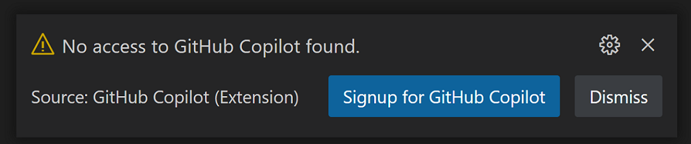
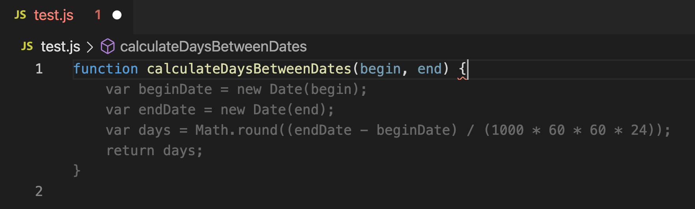
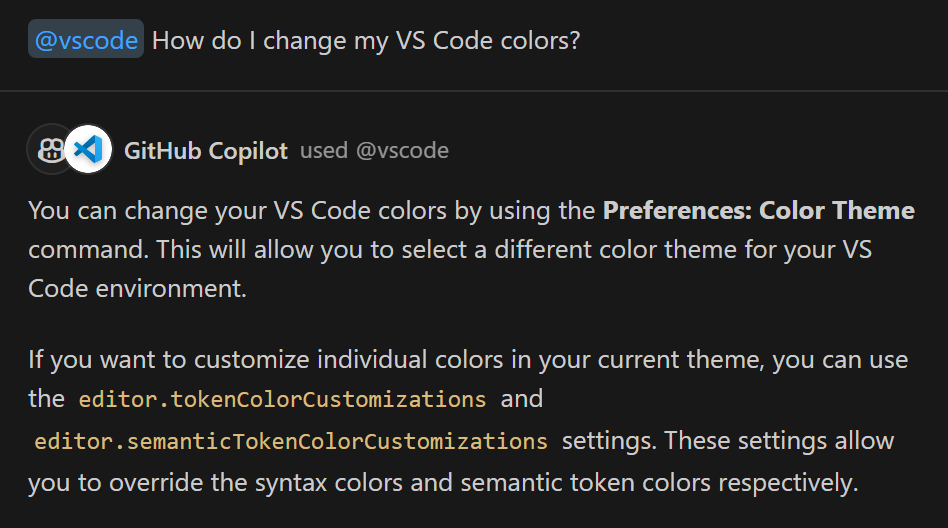
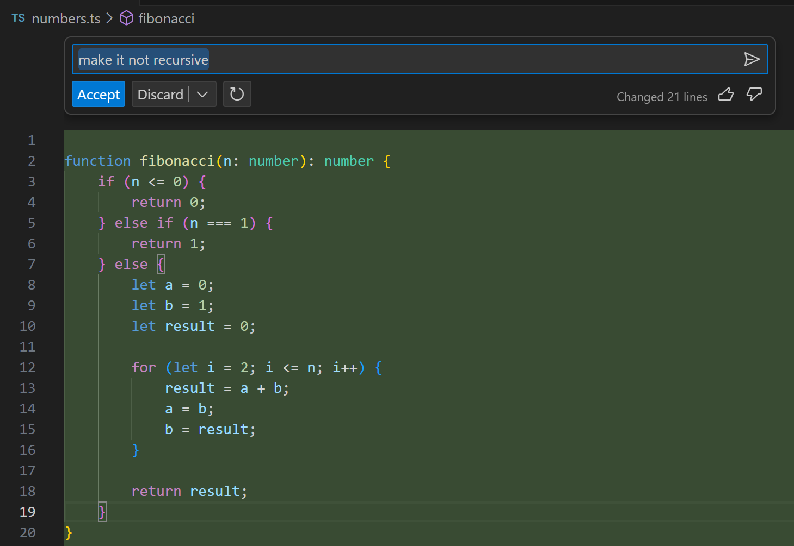
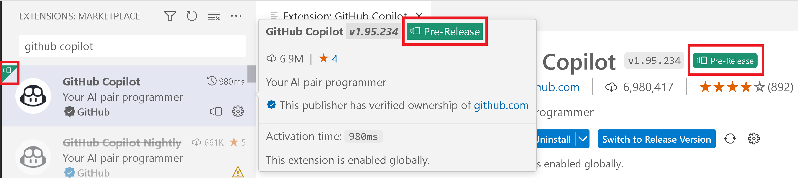

+++
title = "GitHub Copilot"
date = 2024-01-12T22:36:24+08:00
weight = 50
type = "docs"
description = ""
isCJKLanguage = true
draft = false
+++

> 原文: [https://code.visualstudio.com/docs/editor/github-copilot](https://code.visualstudio.com/docs/editor/github-copilot)

# GitHub Copilot in VS Code Visual Studio Code 中的 GitHub Copilot


The [GitHub Copilot](https://marketplace.visualstudio.com/items?itemName=GitHub.copilot) extension is an AI pair programmer tool that helps you write code faster and smarter. You can use the Copilot extension in VS Code to generate code, learn from the code it generates, and even configure your editor.

​​	GitHub Copilot 扩展是一个 AI 配对程序员工具，可帮助您更快速、更智能地编写代码。您可以在 VS Code 中使用 Copilot 扩展来生成代码、学习它生成的代码，甚至配置您的编辑器。

<iframe width="560" height="315" src="https://www.youtube.com/embed/Fi3AJZZregI" title="Get Started with the Future of Coding: GitHub Copilot" frameborder="0" allow="accelerometer; autoplay; clipboard-write; encrypted-media; gyroscope; picture-in-picture" allowfullscreen="" style="box-sizing: border-box; font-family: &quot;Segoe UI&quot;, &quot;Helvetica Neue&quot;, Helvetica, Arial, sans-serif; width: 616.662px; max-width: 100%; height: 400px; color: rgb(36, 36, 36); font-size: 16px; font-style: normal; font-variant-ligatures: normal; font-variant-caps: normal; font-weight: 400; letter-spacing: normal; orphans: 2; text-align: start; text-indent: 0px; text-transform: none; widows: 2; word-spacing: 0px; -webkit-text-stroke-width: 0px; white-space: normal; background-color: rgb(255, 255, 255); text-decoration-thickness: initial; text-decoration-style: initial; text-decoration-color: initial;"></iframe>


## [Prerequisites 先决条件]()

You'll use the [GitHub Copilot](https://marketplace.visualstudio.com/items?itemName=GitHub.copilot) extension to power your artificial intelligence (AI) suggestions in VS Code.

​​	您将使用 GitHub Copilot 扩展为 VS Code 中的人工智能 (AI) 建议提供支持。

> [Install the GitHub Copilot extension
> 安装 GitHub Copilot 扩展](vscode:extension/GitHub.copilot)


To use GitHub Copilot, you need an active GitHub Copilot subscription. In the [content below](), you'll learn how VS Code will help you activate your free trial directly from VS Code. You can also activate your trial starting from the [GitHub Copilot signup page](https://github.com/github-copilot/signup).

​​	要使用 GitHub Copilot，您需要一个有效的 GitHub Copilot 订阅。在下面的内容中，您将了解 VS Code 如何帮助您直接从 VS Code 激活您的免费试用。您还可以从 GitHub Copilot 注册页面开始激活您的试用。

## [Sign in and sign up 登录并注册]()

If you have not previously authorized VS Code in your GitHub account, you will be prompted to sign in to GitHub in VS Code:

​​	如果您之前未在 GitHub 帐户中授权 VS Code，系统将提示您在 VS Code 中登录 GitHub：


In your browser, GitHub will request the necessary permissions for GitHub Copilot. To approve these permissions, select **Authorize Visual Studio Code**.

​​	在您的浏览器中，GitHub 将请求 GitHub Copilot 的必要权限。要批准这些权限，请选择“授权 Visual Studio Code”。

### [Activate your free trial 激活您的免费试用]()

If you haven't yet activated your free trial for Copilot, the extension will notify you in VS Code. Select **Signup for GitHub Copilot** to activate your trial.

​​	如果您尚未激活 Copilot 的免费试用，该扩展将在 VS Code 中通知您。选择“注册 GitHub Copilot”以激活您的试用。



You can learn more about billing for Copilot in the [GitHub Copilot documentation](https://docs.github.com/billing/managing-billing-for-github-copilot/about-billing-for-github-copilot).

​​	您可以在 GitHub Copilot 文档中了解有关 Copilot 计费的更多信息。

## [Using Copilot 使用 Copilot]()

Now that you've signed up for Copilot and activated the extension, let's see its assistance in action!

​​	既然您已注册 Copilot 并激活扩展程序，让我们看看它如何帮助您行动！

GitHub Copilot provides suggestions for numerous languages and a wide variety of frameworks, and it works especially well for Python, JavaScript, TypeScript, Ruby, Go, C# and C++.

​​	GitHub Copilot 为多种语言和各种框架提供建议，它特别适用于 Python、JavaScript、TypeScript、Ruby、Go、C# 和 C++。

## [Inline suggestions 内联建议]()

Copilot presents suggestions automatically to help you code more efficiently. There are just 3 steps to harnessing these suggestions:

​​	Copilot 会自动提供建议，帮助您更有效地编写代码。只需 3 个步骤即可利用这些建议：

1. Start writing code (or code-related items, like comments or tests).
   开始编写代码（或与代码相关的项目，例如注释或测试）。

Copilot provides suggestions for a variety of languages and frameworks. For any given input, Copilot may offer multiple suggestions. You can select which suggestion to use or reject all suggestions.

​​	Copilot 为各种语言和框架提供建议。对于任何给定的输入，Copilot 都可能提供多个建议。您可以选择使用哪个建议或拒绝所有建议。

1. Receive a Copilot suggestion in gray ghost (faded) text.
   以灰色幽灵（淡入淡出）文本接收 Copilot 建议。

Ghost text is placeholder text that will be replaced by input you type or select from Copilot.

​​	幽灵文本是占位符文本，它将被您键入或从 Copilot 中选择的输入替换。

As an example, a JavaScript file, you can type the following function header:

​​	例如，JavaScript 文件，您可以键入以下函数头：

```
function calculateDaysBetweenDates(begin, end) {
```

Copilot will provide a suggestion like the following:

​​	副驾驶将提供以下建议：



1. Choose to accept Copilot's suggestion.
   选择接受副驾驶的建议。

For any given input, Copilot may offer multiple suggestions. When Copilot offers a suggestion, you can use accept it with the Tab key, or hover over the suggestion to see the inline suggestion toolbar:

​​	对于任何给定的输入，副驾驶可能会提供多个建议。当副驾驶提供建议时，您可以使用 Tab 键接受它，或将鼠标悬停在建议上以查看内联建议工具栏：


In the image above, Copilot presents three suggestions. You can accept the entire suggestion with Tab, or only part of the suggestion with Ctrl+RightArrow. You can switch between suggestions in the suggestion toolbar, or use the keyboard shortcut Alt+] instead.

​​	在上面的图片中，副驾驶提出了三个建议。您可以使用 Tab 键接受整个建议，或使用 Ctrl+RightArrow 键仅接受建议的一部分。您可以在建议工具栏中切换建议，或改用键盘快捷键 Alt+]。

If you don't want to accept any of the suggestions, you can continue typing, and Copilot will continue providing suggestions as you work.

​​	如果您不想接受任何建议，您可以继续键入，副驾驶将继续在您工作时提供建议。

## [Getting the most out of Copilot 充分利用副驾驶]()

There are things you can do to help ("prompt") Copilot give you the best possible suggestions. And the good news is that you are probably already doing these right now since they help you and your colleagues understand your code.

​​	您可以采取一些措施来帮助（“提示”）副驾驶为您提供最佳建议。好消息是您现在可能已经在这样做，因为它们可以帮助您和您的同事理解您的代码。

Copilot suggestions work best when Copilot has sufficient context to know what you're doing and what you want help with. Just as you would provide a colleague with the context when asking for help with a specific programming task, you can do the same with Copilot.

​​	当 Copilot 拥有足够的上下文来了解您在做什么以及您需要帮助的内容时，Copilot 建议的效果最佳。就像在请求有关特定编程任务的帮助时会向同事提供上下文一样，您也可以对 Copilot 执行相同的操作。

> **Note**: "Prompt engineering" is a common phrase you'll hear when discussing AI and refers to how and what information is packaged and sent to an AI API endpoint. The Copilot extension does this "prompt engineering" for you but you can help by providing hints to guide the extension.
>
> ​​	注意：“提示工程”是您在讨论人工智能时会听到的一个常见短语，它指的是如何以及将什么信息打包并发送到人工智能 API 端点。Copilot 扩展会为您执行此“提示工程”，但您可以通过提供提示来帮助指导该扩展。

### [Provide context 提供上下文]()

#### [Open files 打开文件]()

Copilot looks at the current and open files in your editor to analyze the context and create appropriate suggestions. Having related files open in VS Code while using Copilot helps set this context and lets the Copilot see a bigger picture of your project.

​​	Copilot 会查看编辑器中当前和打开的文件，以分析上下文并创建适当的建议。在使用 Copilot 时在 VS Code 中打开相关文件有助于设置此上下文，并让 Copilot 看到项目的更大画面。

#### [Top level comment 顶级注释]()

Just as you would give a brief, high-level introduction to a coworker, a top level comment in the file you're working in can help Copilot understand the overall context of the pieces you will be creating.

​​	就像您会向同事提供简短的高级介绍一样，您正在处理的文件中的顶级注释可以帮助 Copilot 了解您将创建的部分的整体上下文。

#### [Appropriate includes and references 适当的包含和引用]()

It's best to manually set the includes or module references you need for your work. Copilot can make suggestions, but you likely know best what dependencies you'll need to include. This can also help let Copilot know what frameworks, libraries, and their versions you'd like it to use when crafting suggestions.

​​	最好手动设置您工作所需的包含或模块引用。副驾驶可以提出建议，但您可能最了解需要包含哪些依赖项。这还可以帮助副驾驶了解在提出建议时您希望它使用哪些框架、库及其版本。

#### [Meaningful function names 有意义的函数名称]()

Just as a method called `fetchData()` won't mean much to a coworker (or you after several months), `fetchData()` won't help Copilot either. Using meaningful function names will help Copilot provide a body that does what you want.

​​	就像一个名为 `fetchData()` 的方法对同事（或几个月后的您）来说意义不大一样， `fetchData()` 对副驾驶也没有帮助。使用有意义的函数名称将帮助副驾驶提供一个执行您想要的操作的主体。

#### [Specific and well-scoped function comments 具体且范围明确的函数注释]()

A function name can only be so descriptive without being overly long so function comments can help fill in details that Copilot might need to know.

​​	函数名称只能在不过于冗长的情况下具有描述性，因此函数注释可以帮助填补副驾驶可能需要了解的详细信息。

#### [Prime Copilot with sample code 使用示例代码启动副驾驶]()

One trick to get Copilot on the right page is to copy and paste sample code into your open editor that is close to what you are looking for. Providing a small example can help Copilot generate suggestions that match the language and tasks you want to achieve. Once Copilot begins providing you with the code you want and will actually use, you can delete the sample code from the file. This can be especially helpful to jump start Copilot to a newer library version when it defaults to providing older code suggestions.

​​	让 Copilot 进入正确页面的一个技巧是将与您要查找的内容接近的示例代码复制并粘贴到打开的编辑器中。提供一个小示例可以帮助 Copilot 生成与您想要实现的语言和任务相匹配的建议。一旦 Copilot 开始为您提供您想要且实际会使用的代码，您就可以从文件中删除示例代码。当 Copilot 默认提供较旧的代码建议时，这对于将其快速启动到较新的库版本特别有用。

### [Be consistent and keep the quality bar high 保持一致并保持质量标准]()

Copilot is going to latch on to your code to generate suggestions that follow the existing pattern so the adage "garbage in, garbage out" applies.

​​	Copilot 将会抓住您的代码来生成遵循现有模式的建议，因此“输入垃圾，输出垃圾”的格言适用。

Keeping a high quality bar can take discipline when you're coding fast and loose to get something working and you might want to disable Copilot completions while in "hacking" mode. You can temporarily disable completions from the Copilot status menu. Bring up the Copilot status menu dropdown by selecting the Copilot status bar item.

​​	在快速且松散地编码以使某些内容正常工作时，保持高质量标准可能需要自律，您可能希望在“黑客”模式下禁用 Copilot 补全。您可以从 Copilot 状态菜单暂时禁用补全。通过选择 Copilot 状态栏项目调出 Copilot 状态菜单下拉列表。


From the dropdown, you can disable completions entirely or just for the active file type, for example Markdown files.

​​	在下拉列表中，您可以完全禁用补全，也可以仅禁用活动文件类型，例如 Markdown 文件。


### [More resources 更多资源]()

If you'd like to learn more about productively using GitHub Copilot, you can follow up with these videos and blog posts:

​​	如果您想详细了解如何高效使用 GitHub Copilot，可以查看以下视频和博客文章：

- [Effective Prompting for GitHub Copilot
  GitHub Copilot 的有效提示](https://www.youtube.com/watch?v=ImWfIDTxn7E)
- [Pragmatic techniques to get the most out of GitHub Copilot
  从 GitHub Copilot 中获取最大价值的实用技巧](https://www.youtube.com/watch?v=CwAzIpc4AnA)
- [Best practices for prompting GitHub Copilot in VS Code
  在 VS Code 中提示 GitHub Copilot 的最佳做法](https://www.linkedin.com/pulse/best-practices-prompting-github-copilot-vs-code-pamela-fox)
- [How to use GitHub Copilot: Prompts, tips, and use cases
  如何使用 GitHub Copilot：提示、技巧和用例](https://github.blog/2023-06-20-how-to-write-better-prompts-for-github-copilot/)

## [Chat features 聊天功能]()

In addition to inline suggestions, you can also get assistance from Copilot via a chat interface. This is supported in several ways:

​​	除了内联建议外，您还可以通过聊天界面从 Copilot 获取帮助。这可以通过多种方式实现：

- **Chat view:** Ask Copilot for help with any task or question in the GitHub Copilot Chat view.
  聊天视图：在 GitHub Copilot 聊天视图中向 Copilot 寻求有关任何任务或问题的帮助。
- **Inline Chat:** Talk with Copilot while writing code, inline in your files.
  内联聊天：在编写代码时与 Copilot 交谈，内联显示在您的文件中。
- **Quick Chat:** Bring up a Chat dropdown for quick questions and suggestions.
  快速聊天：打开聊天下拉列表，以获取快速问题和建议。

The Chat features are available by installing the additional [GitHub Copilot Chat](https://marketplace.visualstudio.com/items?itemName=GitHub.copilot-chat) extension.

​​	可以通过安装额外的 GitHub Copilot Chat 扩展程序来使用聊天功能。

> [Install the GitHub Copilot Chat extension
> 安装 GitHub Copilot Chat 扩展程序](vscode:extension/GitHub.copilot-chat)


## [Chat view 聊天视图]()

When developing a project or learning something new, it can be a big help to get AI assistance on your questions, big or small. Copilot enables an interactive Chat experience that understands the context of your code, workspace, extensions, settings, and more.

​​	在开发项目或学习新知识时，针对大大小小的疑问获得人工智能的帮助可能会有很大帮助。Copilot 提供了一种交互式聊天体验，它了解您的代码、工作区、扩展程序、设置等的上下文。

You can access the Chat view via the Activity Bar:

​​	您可以通过活动栏访问聊天视图：


Like other views in VS Code, you can move it anywhere. For example, you can move it to the [Secondary side bar]() so that you can use other views like the Explorer at the same time:

​​	与 VS Code 中的其他视图一样，您可以将其移动到任意位置。例如，您可以将其移动到辅助侧边栏，以便同时使用其他视图，如资源管理器：


Copilot will suggest potential questions to get started. You can select any of these questions or use the chat box to type your own:

​​	Copilot 会建议一些潜在问题以供您开始。您可以选择其中任何一个问题，或使用聊天框键入您自己的问题：


As you continue asking questions, Copilot maintains the history of your conversation, and it'll provide related follow-up questions or commands in its response too.

​​	随着您继续提问，Copilot 会保留对话记录，并在其回复中提供相关的后续问题或命令。

You can help Copilot provide better answers by upvoting or downvoting responses with the thumbs up and down icons in the upper right of its response. This provides Copilot feedback on how much it helped with your scenario so that it can help you even better in the future.

​​	您可以通过对回复右上角的点赞和倒赞图标进行点赞或点倒赞来帮助 Copilot 提供更好的答案。这会向 Copilot 提供有关它对您的方案提供了多少帮助的反馈，以便它将来能够更好地帮助您。

### [Keyboard shortcuts 键盘快捷键]()

To make it easy to work with the Chat view, there are several keyboard shortcuts:

​​	为了便于使用聊天视图，有几个键盘快捷键：

- Ctrl+Alt+I - Opens the Chat view
  Ctrl+Alt+I - 打开聊天视图
- Ctrl+L - Clears the Chat view
  Ctrl+L - 清除聊天视图
- Ctrl+Down - Moves keyboard focus to the Chat view input box
  Ctrl+向下 - 将键盘焦点移至聊天视图输入框

### [Agents and slash commands 代理和斜杠命令]()

To further help Copilot give you more relevant answers, you can indicate the scope and intent of your question through **agents** and **slash commands**.

​​	为了进一步帮助 Copilot 为您提供更相关的答案，您可以通过代理和斜杠命令来指示问题的范围和意图。

Agents are like experts who have a specialty that they can help you with, and you can talk to them in the chat by mentioning them with the `@` symbol. Currently, there are the following agents:

​​	代理就像专家，他们有可以帮助您的专长，您可以通过使用 `@` 符号提及他们来在聊天中与他们交谈。目前，有以下代理：

- `@workspace` has context about the code in your workspace and can help you navigate it, finding relevant files or classes.
  `@workspace` 具有有关工作区中代码的上下文，可以帮助您浏览代码，查找相关文件或类。
- `@vscode` knows about commands and features in the VS Code editor itself, and can help you use them.
  `@vscode` 了解 VS Code 编辑器本身中的命令和功能，可以帮助您使用它们。
- `@terminal` has context about the integrated terminal shell and its contents.
  `@terminal` 具有有关集成终端外壳及其内容的上下文。

You can prepend your chat inputs with a specific agent to help Copilot give you a more relevant response.

​​	您可以使用特定代理前置聊天输入，以帮助 Copilot 为您提供更相关的回复。



Agent can also support slash commands for specific types of questions or tasks. For example, `@workspace /explain` can be used to ask Copilot to explain a file or code selection in the context of your open workspace. To see the available agents and slash commands, type `/` for a list.

​​	代理还可以支持针对特定类型问题或任务的斜杠命令。例如， `@workspace /explain` 可用于要求 Copilot 在您打开的工作空间的上下文中解释文件或代码选择。要查看可用的代理和斜杠命令，请键入 `/` 以获取列表。


- @workspace /explain: Explain step-by-step how the selected code works.
  @workspace /explain：逐步解释所选代码的工作原理。
- @workspace /fix: Propose a fix for the bugs in the selected code.
  @workspace /fix：针对所选代码中的错误提出修复建议。
- @workspace /new: Create a new project based on a natural language description.
  @workspace /new：根据自然语言描述创建一个新项目。
- @workspace /newNotebook: Create a new Jupyter Notebook based on your description.
  @workspace /newNotebook：根据您的描述创建一个新的 Jupyter Notebook。
- @workspace /tests: Generate unit tests for the selected code.
  @workspace /tests：为所选代码生成单元测试。
- @vscode /api: Questions about VS Code extension development.
  @vscode /api：有关 VS Code 扩展开发的问题。
- @terminal: Explain how to do something in the integrated terminal.
  @terminal：解释如何在集成终端中执行操作。

In addition to agent and slash command combinations, there are general purpose slash commands for actions such as clearing the chat session or getting help.

​​	除了代理和斜杠命令组合之外，还有一些通用斜杠命令，用于执行诸如清除聊天会话或获取帮助等操作。

- /help: Prints general help about GitHub Copilot.
  /help：打印有关 GitHub Copilot 的常规帮助。
- /clear: Clear the session.
  /clear：清除会话。

### [Code blocks 代码块]()

Depending on your question, Copilot Chat may return source code in a code block.

​​	根据您的问题，Copilot Chat 可能会在代码块中返回源代码。


Hovering over the code block presents options to **Copy** and **Insert at Cursor** (Ctrl+Enter).

​​	将鼠标悬停在代码块上会显示“复制并插入光标处 (Ctrl+Enter)”选项。

The **More Actions** (`...`) button also displays options to **Insert Into New File** and **Insert into Terminal** (Ctrl+Alt+Enter).

​​	“更多操作 ( `...` )”按钮还会显示“插入到新文件中”和“插入到终端 (Ctrl+Alt+Enter)”选项。


If Copilot Chat detects that a code block contains a command, you can run it directly in the integrated terminal with **Insert into Terminal** Ctrl+Alt+Enter. This option will create or open the active terminal and insert the command text, ready for you to run.

​​	如果 Copilot Chat 检测到代码块中包含命令，您可以使用“插入到终端 Ctrl+Alt+Enter”直接在集成终端中运行该命令。此选项将创建或打开活动终端并插入命令文本，以便您运行。


### [Chat view locations 聊天视图位置]()

By default, the Chat view is displayed in the [Primary side bar]() but like other views in VS Code, you can [drag and drop]() it anywhere. For example, you could drag and drop the Chat view into the Panel region:

​​	默认情况下，“聊天”视图显示在“主侧边栏”中，但与 VS Code 中的其他视图一样，您可以将其拖放到任意位置。例如，您可以将“聊天”视图拖放到“面板”区域：


You can also open the Chat view in the editor region for a larger display area. From the Chat view title bar **More Actions** (`...`) menu, select **Open Session in Editor**.

​​	您还可以在编辑器区域中打开聊天视图，以获得更大的显示区域。从聊天视图标题栏更多操作（ `...` ）菜单中，选择在编辑器中打开会话。


Just like any open editor, you can move editor-hosted Chat views into separate [Editor Groups]() and use display customizations such as [Grid layout]() to have multiple chat sessions open in the editor region.

​​	就像任何打开的编辑器一样，您可以将由编辑器托管的聊天视图移至单独的编辑器组，并使用网格布局等显示自定义项在编辑器区域中打开多个聊天会话。

To move the Chat view back to the side bar, use the **Open Session in Side Bar** command in the editor title bar when the Chat view is the active editor.

​​	要将聊天视图移回侧边栏，请在聊天视图为活动编辑器时使用编辑器标题栏中的在侧边栏中打开会话命令。


## [Inline chat 内联聊天]()

An additional key functionality of Copilot is answering questions inline as you're coding. This allows you to harness the power of AI while staying in your existing editor workflow.

​​	Copilot 的另一个主要功能是在您编码时以内联方式回答问题。这使您能够在保持现有编辑器工作流的同时利用 AI 的强大功能。

In any file, you can press Ctrl+I on your keyboard to bring up Copilot inline chat:

​​	在任何文件中，您都可以按键盘上的 Ctrl+I 调出 Copilot 内联聊天：


You can ask Copilot questions that emerge as you write and iterate on code, such as "Explain this piece of code" or "How do I add functionality to do X?" If you have code selected in the editor, Copilot will scope your question to the selection.

​​	您可以询问 Copilot 在您编写和迭代代码时出现的问题，例如“解释这段代码”或“如何添加执行 X 的功能？”如果您在编辑器中选择了代码，Copilot 会将您的问题限定为所选内容。

Several [slash commands]() also work in inline chat such as `/explain` to ask Copilot to explain a block of code or `/tests` to generate unit tests.

​​	几个斜杠命令也适用于内联聊天，例如 `/explain` ，用于要求 Copilot 解释一段代码，或 `/tests` ，用于生成单元测试。


A useful command is `/fix`, which analyzes the error line or selected code and proposes a fix in a diff view for your review. After reviewing and possibly modifying the generated code, you can choose to **Accept** or **Discard** the fix.

​​	一个有用的命令是 `/fix` ，它会分析错误行或选定代码，并在 diff 视图中提出一个供您查看的修复建议。在查看并可能修改生成的代码后，您可以选择接受或放弃修复。


## [Quick Chat 快速聊天]()

If you want to ask Copilot a quick question and don't want to start a full Chat view session or have inline Chat open in your editor, you can use the Quick Chat dropdown. To open Quick Chat, you can run **Chat: Open Quick Chat** or use the Ctrl+Shift+I keyboard shortcut.

​​	如果您想向 Copilot 提出一个快速问题，并且不想启动一个完整的聊天视图会话或在编辑器中打开内联聊天，您可以使用快速聊天下拉列表。要打开快速聊天，您可以运行聊天：打开快速聊天或使用 Ctrl+Shift+I 键盘快捷键。


You can type questions, scope your questions with agents and slash commands such as `@workspace /explain` and `@vscode`, and promote the discussion to a full Chat view session with the **Open in Chat View** button in the upper right of the dropdown.

​​	您可以键入问题，使用代理和斜杠命令（例如 `@workspace /explain` 和 `@vscode` ）限定问题范围，并使用下拉列表右上角的“在聊天视图中打开”按钮将讨论提升为完整的聊天视图会话。


## [Chat smart actions 聊天智能操作]()

To make it easier to use Copilot Chat features, there is a **Copilot** menu group in the editor context menu. Right-click in the editor and navigate to **Copilot** to see the available options:

​​	为了便于使用 Copilot 聊天功能，编辑器上下文菜单中有一个 Copilot 菜单组。在编辑器中右键单击并导航到 Copilot 以查看可用选项：


You can apply these smart actions on the current file or a selection in the file. Choosing an action, brings up the appropriate agent and/or slash command in the Chat view or inline chat. For example, selecting **Generate Docs** for a function will open the inline chat with a proposed documentation comment:

​​	您可以对当前文件或文件中的选定内容应用这些智能操作。选择操作后，将在聊天视图或内联聊天中显示相应的代理和/或斜杠命令。例如，为函数选择“生成文档”将打开内联聊天，其中包含建议的文档注释：


## [Other Copilot uses 其他 Copilot 用法]()

In addition to inline completions and chat, GitHub Copilot can help with other development tasks and workflows. For example, Copilot can help with writing commit messages, fixing errors, and finding commands.

​​	除了内联补全和聊天之外，GitHub Copilot 还可以帮助完成其他开发任务和工作流。例如，Copilot 可以帮助编写提交消息、修复错误和查找命令。

### [Sparkles 闪光]()

When Copilot can help with a task or workflow, VS Code displays a **sparkle** icon. Hovering over the sparkle icon will describe the Copilot action.

​​	当 Copilot 可以帮助完成任务或工作流时，VS Code 会显示一个闪光图标。将鼠标悬停在闪光图标上将描述 Copilot 操作。


### [Generate Git commit messages 生成 Git 提交消息]()

Copilot can help you write GitHub commit messages. In the Source Control message input box, select the sparkle button at the right and Copilot will create a commit message based on your pending changes.

​​	Copilot 可以帮助您编写 GitHub 提交消息。在源代码管理消息输入框中，选择右侧的闪光按钮，Copilot 将根据您的待定更改创建一个提交消息。


If you using the [GitHub Pull Request and Issues](https://marketplace.visualstudio.com/items?itemName=GitHub.vscode-pull-request-github) extension, there is a sparkle button to fill in both the title and description in the Pull Request **Create** view.

​​	如果您使用 GitHub Pull Request 和 Issues 扩展，则有一个闪光按钮可以填写 Pull Request 创建视图中的标题和说明。

### [Terminal Quick Fixes 终端快速修复]()

When a command fails to run in the terminal, Copilot displays a sparkle in the gutter that offers a Quick Fix to explain what happened.

​​	当命令无法在终端中运行时，Copilot 会在边栏中显示一个闪光，提供快速修复以解释发生了什么情况。


Selecting **Explain using Copilot** will populate Quick Chat with the `@terminal #terminalLastCommand` agent and variable to help correct the last terminal command error.

​​	选择使用 Copilot 解释将使用 `@terminal #terminalLastCommand` 代理和变量填充快速聊天，以帮助更正上一个终端命令错误。


### [Command Palette help 命令面板帮助]()

When trying to find a command in the Command Palette (Ctrl+Shift+P), if you don't think you see the command you want, you can run **Ask GitHub Copilot** with your search term.

​​	在命令面板（Ctrl+Shift+P）中尝试查找命令时，如果您认为没有看到所需的命令，则可以使用搜索词运行询问 GitHub Copilot。


The **Ask GitHub Copilot** command will open the Chat view and input your search term.

​​	询问 GitHub Copilot 命令将打开聊天视图并输入您的搜索词。


## [Getting the most out of Copilot Chat 充分利用 Copilot 聊天]()

This section is similar to the earlier [Getting the most out of Copilot](), which had recommendations for getting the best editor inline completions from Copilot. Here we'll cover tips to effectively use Copilot Chat (Chat view, inline chat, Quick Chat).

​​	此部分类似于早期的充分利用 Copilot，其中包含有关从 Copilot 获取最佳编辑器内联完成的建议。在这里，我们将介绍有效使用 Copilot 聊天（聊天视图、内联聊天、快速聊天）的技巧。

### [Use agents and slash commands 使用代理和斜杠命令]()

[Agents]() are designed to collect extra context either about a code base or a specific domain or technology. By using the appropriate agent, Copilot Chat can find and provide better information to send to the Copilot backend.

​​	代理旨在收集有关代码库或特定域或技术的额外上下文。通过使用适当的代理，Copilot 聊天可以查找并提供更好的信息以发送到 Copilot 后端。

- Use `@workspace` if you want to ask questions about your open project.
  如果您想询问有关您的开放项目的相关问题，请使用 `@workspace` 。
- Use `@vscode` if you want to know about VS Code features and APIs.
  如果您想了解 VS Code 功能和 API，请使用 `@vscode` 。

Slash commands help Copilot Chat understand your **intent** when you ask a question. Are you learning about a code base (`/explain`) or do you want help fixing an issue (`/fix`) or creating test cases (`/tests`)? By letting Copilot Chat know what you're trying to do, it can tune its reply to your task and provide helpful commands, settings, and code snippets.

​​	斜杠命令可帮助 Copilot Chat 在您提问时了解您的意图。您是在学习代码库 ( `/explain` ) 还是想要帮助修复问题 ( `/fix` ) 或创建测试用例 ( `/tests` )？通过让 Copilot Chat 知道您要做什么，它可以根据您的任务调整回复，并提供有用的命令、设置和代码片段。

You could write out your project scope or current task with a natural language query but using agents and slash commands is more concise and explicit.

​​	您可以使用自然语言查询写出您的项目范围或当前任务，但使用代理和斜杠命令更加简洁和明确。

### [Iterate on your solution 迭代您的解决方案]()

When asking Copilot Chat for help, you aren't stuck with the first response. You can iterate and prompt Copilot to improve the solution. Copilot has both the context of the generated code and also your current conversation.

​​	在向 Copilot Chat 寻求帮助时，您不会被第一个回复所束缚。您可以迭代并提示 Copilot 改进解决方案。Copilot 既具有生成的代码的上下文，也具有您当前的对话。

Here's an example using inline chat to create a function to calculate Fibonacci numbers:

​​	以下是一个使用内联聊天创建函数来计算斐波那契数的示例：


Maybe you prefer a solution that doesn't use recursion:

​​	也许您更喜欢不使用递归的解决方案：



You can even ask Copilot to follow coding conventions or improve variable names:

​​	您甚至可以要求 Copilot 遵循编码约定或改进变量名称：


Even if you've already accepted a result, you can always ask Copilot to iterate on the code later:

​​	即使您已经接受了一个结果，您仍然可以随时要求 Copilot 稍后迭代代码：


## [Additional resources 其他资源]()

Congratulations, you've now used artificial intelligence to enhance your coding!

​​	恭喜，您现在已使用人工智能来增强您的编码！

You can read more about Copilot and how to use it in VS Code in the [GitHub Copilot documentation](https://docs.github.com/copilot/getting-started-with-github-copilot?tool=vscode).

​​	您可以在 GitHub Copilot 文档中阅读有关 Copilot 的更多信息以及如何在 VS Code 中使用它。

Or check out the [VS Code Copilot Series](https://www.youtube.com/playlist?list=PLj6YeMhvp2S5_hvBl2SE-7YCHYlLQ0bPt) on YouTube, where you can find more introductory content as well as programming-specific videos for using Copilot with [Python](https://www.youtube.com/watch?v=DSHfHT5qnGc), [C#](https://www.youtube.com/watch?v=VsUQlSyQn1E), [Java](https://www.youtube.com/watch?v=zhCB95cE0HY), [PowerShell](https://www.youtube.com/watch?v=EwtRzAFiXEM), and more.

​​	或者查看 YouTube 上的 VS Code Copilot 系列，您可以在其中找到更多入门内容以及使用 Copilot 与 Python、C#、Java、PowerShell 等一起进行编程的特定视频。

## [Common questions 常见问题]()

### [The Copilot Chat features aren't working for me? Copilot 聊天功能对我来说不起作用？]()

Check each requirement if Copilot Chat doesn't work:

​​	如果 Copilot 聊天不起作用，请检查每个要求：

- Make sure you are on the latest version of Visual Studio Code (run **Code: Check for Updates**).
  确保您使用的是最新版本的 Visual Studio Code（运行代码：检查更新）。
- Make sure you have the latest version of both the [GitHub Copilot](https://marketplace.visualstudio.com/items?itemName=GitHub.copilot) and [GitHub Copilot Chat](https://marketplace.visualstudio.com/items?itemName=GitHub.copilot-chat) extensions.
  确保您同时拥有最新版本的 GitHub Copilot 和 GitHub Copilot Chat 扩展。
- Your GitHub account that is signed into VS Code must have an activated Copilot subscription (check your [subscription](https://github.com/settings/copilot)).
  您登录到 VS Code 的 GitHub 帐户必须具有已激活的 Copilot 订阅（检查您的订阅）。

### [I can't find Copilot Chat in the Activity bar 我在活动栏中找不到 Copilot 聊天]()

If you've moved the Chat view out of the Primary side bar, for example, you dragged the view to the [Secondary side bar](), the Chat view icon will no longer be displayed on the Activity bar. If you close the Secondary side bar, the Chat view won't be visible and it may appear that you've lost access to the Chat view.

​​	例如，如果您已将聊天视图移出主侧边栏，您将视图拖动到辅助侧边栏，则聊天视图图标将不再显示在活动栏上。如果您关闭辅助侧边栏，则聊天视图将不可见，并且您似乎失去了对聊天视图的访问权限。

There are several ways to display the Chat view or restore it back to the Activity bar:

​​	有几种方法可以显示聊天视图或将其还原到活动栏：

- **View: Show Chat** - Opens the Chat view no matter where it is hosted.
  视图：显示聊天 - 无论它托管在何处，都会打开聊天视图。
- **Copilot status menu** - The status menu dropdown has an option to **Open GitHub Copilot Chat**.
  副驾驶状态菜单 - 状态菜单下拉列表有一个选项可用于打开 GitHub 副驾驶聊天。
- **View: Reset View Locations** - General command to restore all views and panels to their default locations.
  视图：重置视图位置 - 通用命令，可将所有视图和面板还原到其默认位置。

As with any view, you can drag and drop the Chat view back to the Activity bar or use **Reset Location** from the view title bar context menu.

​​	与任何视图一样，您可以将聊天视图拖放到活动栏中，或使用视图标题栏上下文菜单中的“重置位置”。

### [How do I disable Copilot? 如何禁用副驾驶？]()

You can temporarily deactivate Copilot from the Status bar. You will be prompted whether you want to disable Copilot for all code (globally) or just the programming language detected in the active editor (for example, Python).

​​	您可以从状态栏中暂时停用副驾驶。系统将提示您是要禁用所有代码（全局）的副驾驶，还是仅禁用活动编辑器中检测到的编程语言（例如 Python）。

### [How can I provide feedback on Copilot? 如何对副驾驶提供反馈？]()

You can give feedback on Copilot inline suggestions and responses in the [GitHub Copilot Discussions](https://github.com/orgs/community/discussions/categories/copilot).

​​	您可以在 GitHub 副驾驶讨论中对副驾驶内联建议和回复提供反馈。

If you would like to provide feedback on the Copilot Chat features, you can create issues in the [vscode-copilot-release](https://github.com/microsoft/vscode-copilot-release/issues) repository.

​​	如果您想对副驾驶聊天功能提供反馈，可以在 vscode-copilot-release 存储库中创建问题。

### [Are there pre-release builds of the Copilot extensions? Copilot 扩展是否有预发布版本？]()

Yes, you can switch to the pre-release (nightly) version of a Copilot extension to try the latest features and fixes. From the Extensions view, right-click or select the gear icon to bring up the context menu and select **Switch to Pre-Release Version**:

​​	是的，您可以切换到 Copilot 扩展的预发布（每晚）版本，以试用最新功能和修复程序。在“扩展”视图中，右键单击或选择齿轮图标以调出上下文菜单，然后选择“切换到预发布版本”：


You can tell if you're running a pre-release version by the "Pre-release" badge in the extension details:

​​	您可以通过扩展详细信息中的“预发布”徽章来判断您是否正在运行预发布版本：



