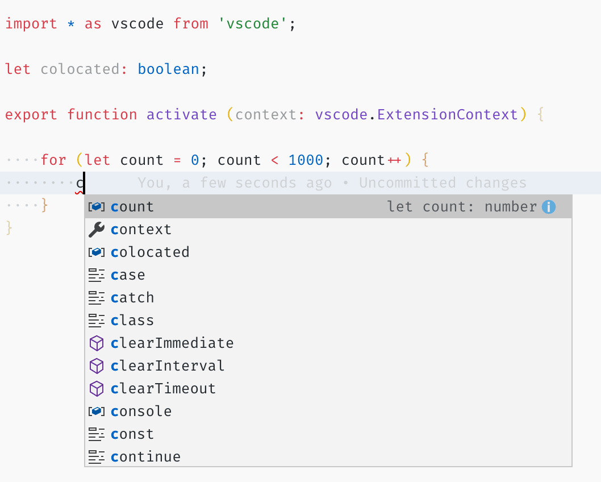

+++
title = "IntelliSense"
date = 2024-01-12T22:36:24+08:00
weight = 20
type = "docs"
description = ""
isCJKLanguage = true
draft = false
+++

> 原文: [https://code.visualstudio.com/docs/editor/intellisense](https://code.visualstudio.com/docs/editor/intellisense)

# ntelliSense


IntelliSense is a general term for various code editing features including: code completion, parameter info, quick info, and member lists. IntelliSense features are sometimes called by other names such as "code completion", "content assist", and "code hinting."

​​	IntelliSense 是一个通用术语，用于表示各种代码编辑功能，包括：代码补全、参数信息、快速信息和成员列表。IntelliSense 功能有时也称为其他名称，例如“代码补全”、“内容辅助”和“代码提示”。


## [IntelliSense for your programming language 适用于您编程语言的 IntelliSense](https://code.visualstudio.com/docs/editor/intellisense#_intellisense-for-your-programming-language)

Visual Studio Code IntelliSense is provided for JavaScript, TypeScript, JSON, HTML, CSS, SCSS, and Less out of the box. VS Code supports word based completions for any programming language but can also be configured to have richer IntelliSense by installing a language extension.

​​	Visual Studio Code IntelliSense 开箱即用，可用于 JavaScript、TypeScript、JSON、HTML、CSS、SCSS 和 Less。VS Code 支持任何编程语言的基于单词的补全，但也可以通过安装语言扩展来配置为具有更丰富的 IntelliSense。

Below are the most popular language extensions in the [Marketplace](https://marketplace.visualstudio.com/vscode). Select an extension tile below to read the description and reviews to decide which extension is best for you.

​​	以下是 Marketplace 中最受欢迎的语言扩展。选择下面的扩展磁贴以阅读描述和评论，以决定哪个扩展最适合您。


Python

109.0M

ms-python


C/C++

58.3M

ms-vscode


C#

25.5M
2550 万

ms-dotnettools


Extension Pack for Java
适用于 Java 的扩展包

24.2M

vscjava


Go

11.4M
1140 万

golang


Dart

8.2M
820 万

Dart-Code


PHP Extension Pack
PHP 扩展包

4.6M

xdebug


Ruby LSP

494.0K

Shopify

## [IntelliSense features IntelliSense 功能](https://code.visualstudio.com/docs/editor/intellisense#_intellisense-features)

VS Code IntelliSense features are powered by a language service. A language service provides intelligent code completions based on language semantics and an analysis of your source code. If a language service knows possible completions, the IntelliSense suggestions will pop up as you type. If you continue typing characters, the list of members (variables, methods, etc.) is filtered to only include members containing your typed characters. Pressing Tab or Enter will insert the selected member.

​​	VS Code IntelliSense 功能由语言服务提供支持。语言服务根据语言语义和对源代码的分析提供智能代码补全。如果语言服务知道可能的补全，IntelliSense 建议会在您键入时弹出。如果您继续键入字符，成员列表（变量、方法等）将被筛选，仅包括包含您键入的字符的成员。按 Tab 或 Enter 将插入选定的成员。

You can trigger IntelliSense in any editor window by typing Ctrl+Space or by typing a trigger character (such as the dot character (.) in JavaScript).

​​	您可以在任何编辑器窗口中通过键入 Ctrl+Space 或键入触发字符（例如 JavaScript 中的点字符 (.)）来触发 IntelliSense。


> **Tip:** The suggestions widget supports CamelCase filtering, meaning you can type the letters which are upper cased in a method name to limit the suggestions. For example, "cra" will quickly bring up "createApplication".
>
> ​​	提示：建议小部件支持 CamelCase 筛选，这意味着您可以键入方法名中大写的字母来限制建议。例如，“cra”将快速显示“createApplication”。

If you prefer, you can turn off IntelliSense while you type. See [Customizing IntelliSense](https://code.visualstudio.com/docs/editor/intellisense#_customizing-intellisense) below to learn how to disable or customize VS Code's IntelliSense features.

​​	如果您愿意，可以在键入时关闭 IntelliSense。请参阅下方的“自定义 IntelliSense”以了解如何禁用或自定义 VS Code 的 IntelliSense 功能。

As provided by the language service, you can see **quick info** for each method by either pressing Ctrl+Space or clicking the info icon. The accompanying documentation for the method will now expand to the side. The expanded documentation will stay so and will update as you navigate the list. You can close this by pressing Ctrl+Space again or by clicking on the close icon.

​​	根据语言服务提供的信息，您可以通过按 Ctrl+空格键或单击信息图标来查看每个方法的快速信息。方法的随附文档现在将展开到侧面。展开的文档将保持原样，并在您浏览列表时更新。您可以再次按 Ctrl+空格键或单击关闭图标来关闭此文档。


After choosing a method you are provided with **parameter info**.

​​	选择方法后，将为您提供参数信息。


When applicable, a language service will surface the underlying types in the quick info and method signatures. In the image above, you can see several `any` types. Because JavaScript is dynamic and doesn't need or enforce types, `any` suggests that the variable can be of any type.

​​	在适用的情况下，语言服务将在快速信息和方法签名中显示基础类型。在上面的图像中，您可以看到几个 `any` 类型。由于 JavaScript 是动态的，不需要或强制使用类型，因此 `any` 建议变量可以是任何类型。

## [Types of completions 完成类型](https://code.visualstudio.com/docs/editor/intellisense#_types-of-completions)

The JavaScript code below illustrates IntelliSense completions. IntelliSense gives both inferred proposals and the global identifiers of the project. The inferred symbols are presented first, followed by the global identifiers (shown by the Word icon).

​​	下面的 JavaScript 代码演示了 IntelliSense 完成。IntelliSense 提供推断的建议和项目的全局标识符。首先显示推断的符号，然后显示全局标识符（由“单词”图标显示）。


VS Code IntelliSense offers different types of completions, including language server suggestions, snippets, and simple word based textual completions.

​​	VS Code IntelliSense 提供不同类型的补全，包括语言服务器建议、代码段和基于文本的简单单词补全。

| Icon 图标                                                    | Name 名称                            | Symbol type 符号类型                |
| :----------------------------------------------------------- | :----------------------------------- | :---------------------------------- |
|         | Methods and Functions 方法和函数     | `method`, `function`, `constructor` |
|     | Variables 变量                       | `variable`                          |
|           | Fields 字段                          | `field`                             |
|  | Type parameters 类型参数             | `typeParameter`                     |
|       | Constants 常量                       | `constant`                          |
|                | Classes 类                           | `class`                             |
|        | Interfaces 接口                      | `interface`                         |
|     | Structures 结构                      | `struct`                            |
|             | Events 事件                          | `event`                             |
|       | Operators 运算符                     | `operator`                          |
|           | Modules 模块                         | `module`                            |
|          | Properties and Attributes 属性和特性 | `property`                          |
|  | Values and Enumerations 值和枚举     | `value`, `enum`                     |
|        | References 引用                      | `reference`                         |
|            | Keywords 关键字                      | `keyword`                           |
|               | Files 文件                           | `file`                              |
|                  | Folders 文件夹                       | `folder`                            |
|         | Colors 颜色                          | `color`                             |
|                 | Unit 单位                            | `unit`                              |
|  | Snippet prefixes 代码段前缀          | `snippet`                           |
|  | Words 单词                           | `text`                              |

## [Customizing IntelliSense 自定义 IntelliSense](https://code.visualstudio.com/docs/editor/intellisense#_customizing-intellisense)

You can customize your IntelliSense experience in settings and key bindings.

​​	您可以在设置和键绑定中自定义您的 IntelliSense 体验。

### [Settings 设置](https://code.visualstudio.com/docs/editor/intellisense#_settings)

The settings shown below are the default settings. You can change these settings in your `settings.json` file as described in [User and Workspace Settings](https://code.visualstudio.com/docs/getstarted/settings).

​​	下面显示的设置是默认设置。您可以按照用户和工作区设置中所述在 `settings.json` 文件中更改这些设置。

```
{
    // Controls if quick suggestions should show up while typing
    "editor.quickSuggestions": {
        "other": true,
        "comments": false,
        "strings": false
    },

     // Controls whether suggestions should be accepted on commit characters. For example, in JavaScript, the semi-colon (`;`) can be a commit character that accepts a suggestion and types that character.
    "editor.acceptSuggestionOnCommitCharacter": true,

    // Controls if suggestions should be accepted on 'Enter' - in addition to 'Tab'. Helps to avoid ambiguity between inserting new lines or accepting suggestions. The value 'smart' means only accept a suggestion with Enter when it makes a textual change
    "editor.acceptSuggestionOnEnter": "on",

    // Controls the delay in ms after which quick suggestions will show up.
    "editor.quickSuggestionsDelay": 10,

    // Controls if suggestions should automatically show up when typing trigger characters
    "editor.suggestOnTriggerCharacters": true,

    // Controls if pressing tab inserts the best suggestion and if tab cycles through other suggestions
    "editor.tabCompletion": "off",

    // Controls whether sorting favours words that appear close to the cursor
    "editor.suggest.localityBonus": true,

    // Controls how suggestions are pre-selected when showing the suggest list
    "editor.suggestSelection": "first",

    // Enable word based suggestions
    "editor.wordBasedSuggestions": "matchingDocuments",

    // Enable parameter hints
    "editor.parameterHints.enabled": true,
}
```

### [Tab Completion 制表符补全](https://code.visualstudio.com/docs/editor/intellisense#_tab-completion)

The editor supports "tab completion" which inserts the best matching completion when pressing Tab. This works regardless of the suggest widget showing or not. Also, pressing Tab after inserting a suggestions will insert the next best suggestion.

​​	编辑器支持“制表符补全”，它会在按下 Tab 键时插入最佳匹配的补全。无论建议小部件是否显示，此功能都会起作用。此外，在插入建议后按 Tab 键将插入下一个最佳建议。


By default, tab completion is disabled. Use the `editor.tabCompletion` setting to enable it. These values exist:

​​	默认情况下，禁用制表符补全。使用 `editor.tabCompletion` 设置启用它。存在以下值：

- `off` - (default) Tab completion is disabled.
  `off` -（默认）禁用制表符补全。
- `on` - Tab completion is enabled for all suggestions and repeated invocations insert the next best suggestion.
  `on` - 为所有建议启用制表符补全，重复调用会插入下一个最佳建议。
- `onlySnippets` - Tab completion only inserts static snippets which prefix match the current line prefix.
  `onlySnippets` - 制表符补全仅插入与当前行前缀匹配的前缀静态代码段。

### [Locality Bonus 局部奖励](https://code.visualstudio.com/docs/editor/intellisense#_locality-bonus)

Sorting of suggestions depends on extension information and on how well they match the current word you are typing. In addition, you can ask the editor to boost suggestions that appear closer to the cursor position, using the `editor.suggest.localityBonus` setting.

​​	建议的排序取决于扩展信息以及它们与您当前键入的单词的匹配程度。此外，您可以使用 `editor.suggest.localityBonus` 设置要求编辑器提升显示位置更靠近光标位置的建议。



In above images you can see that `count`, `context`, and `colocated` are sorted based on the scopes in which they appear (loop, function, file).

​​	在上面的图像中，您可以看到 `count` 、 `context` 和 `colocated` 是根据它们出现的范围（循环、函数、文件）进行排序的。

### [Suggestion selection 建议选择](https://code.visualstudio.com/docs/editor/intellisense#_suggestion-selection)

By default, VS Code pre-selects the first suggestion in the suggestion list. If you'd like different behavior, for example, to always select the most recently used item in the suggestion list, you can use the `editor.suggestSelection` setting.

​​	默认情况下，VS Code 会预先选择建议列表中的第一个建议。如果您希望有不同的行为，例如始终选择建议列表中最常用的项，则可以使用 `editor.suggestSelection` 设置。

The available `editor.suggestSelection` values are:

​​	可用的 `editor.suggestSelection` 值为：

- `first` - (default) Always select the top list item.
  `first` - （默认）始终选择列表顶部的项。
- `recentlyUsed` - The previously used item is selected unless a prefix (type to select) selects a different item.
  `recentlyUsed` - 除非前缀（键入以选择）选择不同的项，否则选择先前使用的项。
- `recentlyUsedByPrefix` - Select items based on previous prefixes that have completed those suggestions.
  `recentlyUsedByPrefix` - 根据已完成这些建议的先前前缀选择项。

Selecting the most recently used item is very useful as you can quickly insert the same completion multiple times.

​​	选择最近使用的项非常有用，因为您可以快速多次插入相同的补全内容。

"Type to select" means that the current prefix (roughly the text left of the cursor) is used to filter and sort suggestions. When this happens and when its result differs from the result of `recentlyUsed`, it will be given precedence.

​​	“键入以选择”意味着当前前缀（大致是光标左侧的文本）用于筛选和排序建议。当这种情况发生且其结果与 `recentlyUsed` 的结果不同时，它将被优先考虑。

When using the last option, `recentlyUsedByPrefix`, VS Code remembers which item was selected for a specific prefix (partial text). For example, if you typed `co` and then selected `console`, the next time you typed `co`, the suggestion `console` would be pre-selected. This lets you quickly map various prefixes to different suggestions, for example `co` -> `console` and `con` -> `const`.

​​	使用最后一个选项 `recentlyUsedByPrefix` 时，VS Code 会记住为特定前缀（部分文本）选择的项目。例如，如果您键入 `co` 然后选择 `console` ，那么下次您键入 `co` 时，建议 `console` 将被预先选择。这使您可以快速将各种前缀映射到不同的建议，例如 `co` -> `console` 和 `con` -> `const` 。

### [Snippets in suggestions 建议中的代码片段](https://code.visualstudio.com/docs/editor/intellisense#_snippets-in-suggestions)

By default, VS Code shows snippets and completion proposals in one widget. You can control the behavior with the `editor.snippetSuggestions` setting. To remove snippets from the suggestions widget, set the value to `"none"`. If you'd like to see snippets, you can specify the order relative to suggestions; at the top (`"top"`), at the bottom (`"bottom"`), or inline ordered alphabetically (`"inline"`). The default is `"inline"`.

​​	默认情况下，VS Code 在一个小部件中显示代码片段和完成建议。您可以使用 `editor.snippetSuggestions` 设置控制行为。若要从建议小部件中删除代码片段，请将值设置为 `"none"` 。如果您想查看代码片段，则可以指定相对于建议的顺序；在顶部 ( `"top"` )、在底部 ( `"bottom"` ) 或按字母顺序内联排序 ( `"inline"` )。默认值为 `"inline"` 。

### [Key bindings 按键绑定](https://code.visualstudio.com/docs/editor/intellisense#_key-bindings)

The key bindings shown below are the default key bindings. You can change these in your `keybindings.json` file as described in [Key Bindings](https://code.visualstudio.com/docs/getstarted/keybindings).

​​	下面显示的键绑定是默认键绑定。您可以在 `keybindings.json` 文件中更改这些键绑定，如键绑定中所述。

> **Note:** There are many more key bindings relating to IntelliSense. Open the **Default Keyboard Shortcuts** (**File** > **Preferences** > **Keyboard Shortcuts**) and search for "suggest".
>
> ​​	注意：还有许多与 IntelliSense 相关的键绑定。打开默认键盘快捷方式（文件 > 首选项 > 键盘快捷方式）并搜索“建议”。

```
[
  {
    "key": "ctrl+space",
    "command": "editor.action.triggerSuggest",
    "when": "editorHasCompletionItemProvider && editorTextFocus && !editorReadonly"
  },
  {
    "key": "ctrl+space",
    "command": "toggleSuggestionDetails",
    "when": "editorTextFocus && suggestWidgetVisible"
  },
  {
    "key": "ctrl+alt+space",
    "command": "toggleSuggestionFocus",
    "when": "editorTextFocus && suggestWidgetVisible"
  }
]
```

## [Enhance completions with AI 使用 AI 增强完成](https://code.visualstudio.com/docs/editor/intellisense#_enhance-completions-with-ai)

In VS Code, you can enhance your coding with artificial intelligence (AI), such as suggestions for lines of code or entire functions, fast documentation creation, and help creating code-related artifacts like tests.

​​	在 VS Code 中，您可以使用人工智能 (AI) 来增强编码，例如，提供代码行或整个函数的建议、快速创建文档以及帮助创建与代码相关的工件，如测试。

[GitHub Copilot](https://copilot.github.com/) is an AI-powered code completion tool that helps you write code faster and smarter. You can use the [GitHub Copilot extension](https://marketplace.visualstudio.com/items?itemName=GitHub.copilot) in VS Code to generate code, or to learn from the code it generates.

​​	GitHub Copilot 是一款由 AI 支持的代码完成工具，可帮助您更快速、更智能地编写代码。您可以在 VS Code 中使用 GitHub Copilot 扩展来生成代码，或从它生成的代码中学习。

[](https://marketplace.visualstudio.com/items?itemName=GitHub.copilot)

You can learn more about how to get started with Copilot in the [Copilot documentation](https://code.visualstudio.com/docs/editor/github-copilot).

​​	您可以在 Copilot 文档中了解有关如何开始使用 Copilot 的更多信息。

## [Troubleshooting 故障排除](https://code.visualstudio.com/docs/editor/intellisense#_troubleshooting)

If you find IntelliSense has stopped working, the language service may not be running. Try restarting VS Code and this should solve the issue. If you are still missing IntelliSense features after installing a language extension, open an issue in the repository of the language extension.

​​	如果您发现 IntelliSense 已停止工作，则语言服务可能未在运行。尝试重新启动 VS Code，这应该可以解决问题。如果在安装语言扩展后仍然缺少 IntelliSense 功能，请在语言扩展的存储库中打开一个问题。

> **Tip:** For configuring and troubleshooting JavaScript IntelliSense, see the [JavaScript documentation](https://code.visualstudio.com/docs/languages/javascript#_intellisense).
>
> ​​	提示：有关配置和故障排除 JavaScript IntelliSense 的信息，请参阅 JavaScript 文档。

A particular language extension may not support all the VS Code IntelliSense features. Review the extension's README to find out what is supported. If you think there are issues with a language extension, you can usually find the issue repository for an extension through the [VS Code Marketplace](https://marketplace.visualstudio.com/vscode). Navigate to the extension's Details page and select the **Support** link.

​​	特定语言扩展可能不支持所有 VS Code IntelliSense 功能。查看扩展的 README 以了解支持哪些功能。如果您认为语言扩展存在问题，通常可以通过 VS Code Marketplace 找到扩展的问题存储库。导航到扩展的详细信息页面并选择支持链接。

## [Next steps 后续步骤](https://code.visualstudio.com/docs/editor/intellisense#_next-steps)

IntelliSense is just one of VS Code's powerful features. Read on to learn more:

​​	IntelliSense 只是 VS Code 的众多强大功能之一。继续阅读以了解更多信息：

- [JavaScript](https://code.visualstudio.com/docs/languages/javascript) - Get the most out of your JavaScript development, including configuring IntelliSense.
  JavaScript - 充分利用 JavaScript 开发，包括配置 IntelliSense。
- [Node.js](https://code.visualstudio.com/docs/nodejs/nodejs-tutorial) - See an example of IntelliSense in action in the Node.js walkthrough.
  Node.js - 在 Node.js 演练中查看 IntelliSense 的实际示例。
- [Debugging](https://code.visualstudio.com/docs/editor/debugging) - Learn how to set up debugging for your application.
  调试 - 了解如何为应用程序设置调试。
- [Creating Language extensions](https://code.visualstudio.com/api/language-extensions/programmatic-language-features) - Learn how to create extensions that add IntelliSense for new programming languages.
  创建语言扩展 - 了解如何创建为新编程语言添加 IntelliSense 的扩展。
- [GitHub Copilot in VS Code](https://code.visualstudio.com/docs/editor/github-copilot) - Learn how to use AI with GitHub Copilot to enhance your coding.
  VS Code 中的 GitHub Copilot - 了解如何将 AI 与 GitHub Copilot 配合使用以增强编码。

## [Common questions 常见问题](https://code.visualstudio.com/docs/editor/intellisense#_common-questions)

### [Why am I not getting any suggestions? 为什么我没有收到任何建议？](https://code.visualstudio.com/docs/editor/intellisense#_why-am-i-not-getting-any-suggestions)


This can be caused by a variety of reasons. First, try restarting VS Code. If the problem persists, consult the language extension's documentation. For JavaScript specific troubleshooting, please see the [JavaScript language topic](https://code.visualstudio.com/docs/languages/javascript#_intellisense).

​​	这可能是由多种原因造成的。首先，尝试重新启动 VS Code。如果问题仍然存在，请查阅语言扩展的文档。有关 JavaScript 特定的故障排除，请参阅 JavaScript 语言主题。

### [Why am I not seeing method and variable suggestions? 为什么我看不到方法和变量建议？](https://code.visualstudio.com/docs/editor/intellisense#_why-am-i-not-seeing-method-and-variable-suggestions)


This issue is caused by missing type declaration (typings) files in JavaScript. You can check if a type declaration file package is available for a specific library by using the [TypeSearch](https://microsoft.github.io/TypeSearch) site. There is more information about this issue in the [JavaScript language topic](https://code.visualstudio.com/docs/languages/javascript#_intellisense). For other languages, please consult the extension's documentation.

​​	此问题是由 JavaScript 中缺少类型声明（类型化）文件引起的。您可以使用 TypeSearch 网站检查特定库是否提供了类型声明文件包。JavaScript 语言主题中提供了有关此问题的更多信息。对于其他语言，请查阅扩展的文档。
