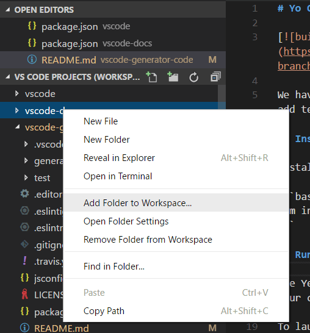
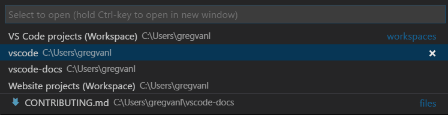

+++
title = "Multi-root Workspaces"
date = 2024-01-12T22:36:24+08:00
weight = 150
type = "docs"
description = ""
isCJKLanguage = true
draft = false
+++

> 原文: [https://code.visualstudio.com/docs/editor/multi-root-workspaces](https://code.visualstudio.com/docs/editor/multi-root-workspaces)

# Multi-root Workspaces 多根工作区


You can work with multiple project folders in Visual Studio Code with multi-root workspaces. This can be helpful when you are working on several related projects at one time. For example, you might have a repository with a product's documentation that you like to keep current when you update the product source code.

​​	在 Visual Studio Code 中，您可以使用多根工作区处理多个项目文件夹。当您一次处理多个相关项目时，这会很有用。例如，您可能有一个存储库，其中包含您在更新产品源代码时希望保持最新的产品文档。


> **Note**: If you'd like to learn more about the VS Code "workspace" concept, you can review [What is a VS Code "workspace"?](https://code.visualstudio.com/docs/editor/workspaces) Unless you are explicitly creating a multi-root workspace, a "workspace" is just your project's single root folder.
>
> ​​	注意：如果您想详细了解 VS Code 的“工作区”概念，可以查看什么是 VS Code 的“工作区”？除非您明确创建多根工作区，否则“工作区”只是项目的单个根文件夹。

## [Adding folders 添加文件夹]()

It is easy to add another folder to your existing workspace. There are several gestures for adding folders:

​​	可以轻松地将另一个文件夹添加到现有工作区。有几种添加文件夹的手势：

### [Add Folder to Workspace 将文件夹添加到工作区]()

The **File** > **Add Folder to Workspace** command brings up an Open Folder dialog to select the new folder.

​​	“文件”>“将文件夹添加到工作区”命令会打开“打开文件夹”对话框，以选择新文件夹。


Once a root folder is added, the Explorer will show the new folder as a root in the File Explorer. You can right-click on any of the root folders and use the context menu to add or remove folders.

​​	添加根文件夹后，资源管理器会将新文件夹显示为文件资源管理器中的根文件夹。您可以右键单击任何根文件夹，并使用上下文菜单添加或删除文件夹。



The File Explorer should work and behave as before. You can move files between root folders and use any of the typical file operation actions provided in the context menu and the Explorer view.

​​	文件资源管理器应像以前一样工作和运行。您可以在根文件夹之间移动文件，并使用上下文菜单和资源管理器视图中提供的任何典型文件操作操作。

Settings like `files.exclude` are supported for each root folder if configured, and across all folders if configured as global user setting.

​​	如果已配置，则每个根文件夹都支持 `files.exclude` 之类的设置，如果已配置为全局用户设置，则所有文件夹都支持。

### [Drag and drop 拖放]()

You can use drag and drop to add folders to a workspace. Drag a folder to the File Explorer to add it to the current workspace. You can even select and drag multiple folders.

​​	您可以使用拖放将文件夹添加到工作区。将文件夹拖到文件资源管理器中以将其添加到当前工作区。您甚至可以选择并拖动多个文件夹。

> **Note**: Dropping a single folder into the editor region of VS Code will still open the folder in single folder mode. If you drag and drop multiple folders into the editor region, a new multi-root workspace will be created.
>
> ​​	注意：将单个文件夹拖放到 VS Code 的编辑器区域中仍会以单个文件夹模式打开该文件夹。如果您将多个文件夹拖放到编辑器区域中，则会创建一个新的多根工作区。

You can also use drag and drop to reorder folders in the workspace.

​​	您还可以使用拖放来重新排列工作区中的文件夹。

### [Multiple selection native file open dialogs 多选原生文件打开对话框]()

Opening multiple folders with your platform's native file open dialog will create a multi-root workspace.

​​	使用平台的原生文件打开对话框打开多个文件夹将创建一个多根工作区。

### [command line --add 命令行 --add]()

Add a folder or multiple folders to the last active VS Code instance for a multi-root workspace.

​​	将一个或多个文件夹添加到最后一个活动的 VS Code 实例，以用于多根工作区。

```
  code --add vscode vscode-docs
```

### [Removing folders 删除文件夹]()

You can remove a folder from a Workspace with the **Remove Folder from Workspace** context menu command.

​​	您可以使用“从工作区移除文件夹”上下文菜单命令从工作区中移除文件夹。

## [Workspace file 工作区文件]()

When you add multiple folders, they are initially placed in a Workspace titled **UNTITLED WORKSPACE** and that name will remain until you save the workspace. You do not need to save a Workspace until you want to have it in a permanent location, for example, on your Desktop. Untitled Workspaces are present as long as the VS Code instance they are using is open. Once you completely close an instance with an untitled workspace, you will be asked to save it if you plan to open it again in the future:

​​	添加多个文件夹时，它们最初会放置在名为“UNTITLED WORKSPACE”的工作区中，该名称将保留，直到您保存工作区。您无需保存工作区，直到您希望将其放在永久位置（例如，在您的桌面上）。只要使用它们的 VS Code 实例处于打开状态，无标题工作区就会存在。一旦您完全关闭具有无标题工作区的一个实例，系统会要求您保存它，以便将来再次打开它：


When you save your workspace, it will create a `.code-workspace` file and the file name will be displayed in the File Explorer.

​​	保存工作区时，它将创建一个 `.code-workspace` 文件，文件名将显示在文件资源管理器中。

### [Save Workspace As... 另存为工作区...]()

If you want to move your Workspace file to a new location, you can use the **File** > **Save Workspace As** command, which will automatically set the correct folder paths relative to the new Workspace file location.

​​	如果要将工作区文件移动到新位置，可以使用“文件”>“另存为工作区”命令，该命令会自动设置相对于新工作区文件位置的正确文件夹路径。

### [Opening workspace files 打开工作区文件]()

To reopen a Workspace, you can:

​​	要重新打开工作区，您可以：

- Double-click the `.code-workspace` file in your platform's Explorer.
  在平台的资源管理器中双击 `.code-workspace` 文件。

- Use the **File** > **Open Workspace** command and select the Workspace file.
  使用“文件”>“打开工作区”命令并选择工作区文件。

- Select the Workspace from the

   

  File

   

  \>

   

  Open Recent

   

  (

  Ctrl+R

  ) list.

  
  从文件 > 打开最近 (Ctrl+R) 列表中选择工作区。

  - Workspaces have a **(Workspace)** suffix to differentiate them from folders.
    工作区具有 (工作区) 后缀，以将其与文件夹区分开来。



Just like **Close Folder** when a single folder is open in VS Code, there is a **Close Workspace** (Ctrl+K F) command to close the active Workspace.

​​	就像在 VS Code 中打开单个文件夹时关闭文件夹一样，有一个关闭工作区 (Ctrl+K F) 命令来关闭活动工作区。

### [Workspace file schema 工作区文件架构]()

The schema of `.code-workspace` is fairly straightforward. You have an array of folders with either absolute or relative paths. Relative paths are better when you want to share Workspace files.

​​	 `.code-workspace` 的架构非常简单。您有一个包含绝对路径或相对路径的文件夹数组。当您想要共享工作区文件时，相对路径更好。

You can override the display name of your folders with the `name` attribute, to give more meaningful names to folders in the Explorer. For example, you could name your project folders such as 'Product' and 'Documentation' to easily identify the content by folder name:

​​	您可以使用 `name` 属性覆盖文件夹的显示名称，以便为资源管理器中的文件夹提供更有意义的名称。例如，您可以将项目文件夹命名为“产品”和“文档”，以便通过文件夹名称轻松识别内容：

```
{
  "folders": [
    {
      // Source code
      "name": "Product",
      "path": "vscode"
    },
    {
      // Docs and release notes
      "name": "Documentation",
      "path": "vscode-docs"
    },
    {
      // Yeoman extension generator
      "name": "Extension generator",
      "path": "vscode-generator-code"
    }
  ]
}
```

which will result in the following Explorer display:

​​	这将导致以下资源管理器显示：


As you can see from the example above, you can add comments to your Workspace files.

​​	从上面的示例中可以看到，您可以将注释添加到工作区文件。

The Workspace file can also contain Workspace [global settings]() under `settings` and [extension recommendations]() under `extensions`, which we will discuss below.

​​	工作区文件还可以在 `settings` 下包含工作区全局设置，在 `extensions` 下包含扩展建议，我们将在下面讨论这些设置。


## [General UI 常规 UI]()

### [Editor 编辑器]()

There are only a few changes to the VS Code UI when you are using multi-root workspaces, primarily to disambiguate files between folders. For example, if there is a name collision between files in multiple folders, VS Code will include the folder name in tabbed headers.

​​	在使用多根工作区时，VS Code UI 只有少数更改，主要是为了消除文件夹之间的文件歧义。例如，如果多个文件夹中的文件之间存在名称冲突，VS Code 将在选项卡标题中包含文件夹名称。


If you'd always like to see the folder displayed in the tabbed header, you can use the `workbench.editor.labelFormat` [setting]() "medium" or "long" values to show the folder or full paths.

​​	如果您始终希望在选项卡标题中显示文件夹，可以使用 `workbench.editor.labelFormat` 设置“中等”或“长”值来显示文件夹或完整路径。

```
"workbench.editor.labelFormat": "medium"
```

VS Code UI such as the **OPEN EDITORS** and **Quick Open** (Ctrl+P) lists include the folder name.

​​	VS Code UI（如 OPEN EDITORS 和快速打开（Ctrl+P）列表）包含文件夹名称。


If you are using an [File Icon Theme]() and the active theme supports it, you will see a special Workspace icon.

​​	如果您正在使用文件图标主题并且活动主题支持它，您将看到一个特殊的工作区图标。

Below you can see the Workspace icons from the built-in **Minimal (Visual Studio Code)** file icon theme:

​​	您可以在下面看到内置的 Minimal（Visual Studio Code）文件图标主题中的工作区图标：


### [Search 搜索]()

VS Code features like global search work across all folders and group the search results by folder.

​​	VS Code 功能（如全局搜索）可在所有文件夹中工作，并将搜索结果按文件夹分组。


When you have a multi-root workspace open, you can choose to search in a single root folder by using the `./` syntax in the **files to include** box. For example, if you enter `./project1/**/*.txt`, that will search for all `.txt` files under the `project1/` root folder.

​​	当您打开多根工作区时，您可以选择使用 `./` 语法在要包含的框中搜索单个根文件夹。例如，如果您输入 `./project1/**/*.txt` ，它将在 `project1/` 根文件夹下搜索所有 `.txt` 文件。

## [Settings 设置]()

With multiple root folders in one workspace, it is possible to have a `.vscode` folder in each root folder defining the settings that should apply for that folder. To avoid setting collisions, only resource (file, folder) settings are applied when using a multi-root workspace. Settings that affect the entire editor (for example, UI layout) are ignored. For example, two projects cannot both set the zoom level.

​​	在一个工作区中有多个根文件夹时，可以在每个根文件夹中有一个 `.vscode` 文件夹，用于定义应适用于该文件夹的设置。为了避免设置冲突，仅在使用多根工作区时应用资源（文件、文件夹）设置。影响整个编辑器（例如，UI 布局）的设置将被忽略。例如，两个项目不能同时设置缩放级别。

User settings are supported as with single folder projects and you can also set global Workspace settings that will apply to all folders in your multi-root Workspace. Global Workspace settings will be stored in your `.code-workspace` file.

​​	用户设置与单文件夹项目一样受支持，您还可以设置全局工作区设置，这些设置将应用于多根工作区中的所有文件夹。全局工作区设置将存储在您的 `.code-workspace` 文件中。

```
{
  "folders": [
    {
      "path": "vscode"
    },
    {
      "path": "vscode-docs"
    },
    {
      "path": "vscode-generator-code"
    }
  ],
  "settings": {
    "window.zoomLevel": 1,
    "files.autoSave": "afterDelay"
  }
}
```

When you go from a single folder instance to multiple folders, VS Code will add the appropriate editor-wide settings from the first folder to the new global Workspace settings.

​​	当您从单个文件夹实例转到多个文件夹时，VS Code 会将第一个文件夹中的适当编辑器范围设置添加到新的全局工作区设置中。

You can easily review and modify the different settings files through the Settings editor. The Settings editor tabs let you select your User settings, global Workspace settings, and individual folder settings.

​​	您可以通过“设置”编辑器轻松查看和修改不同的设置文件。“设置”编辑器选项卡允许您选择用户设置、全局工作区设置和各个文件夹设置。


You can also open specific settings files with the commands:

​​	您还可以使用以下命令打开特定设置文件：

- **Preferences: Open User Settings** - Open your global User settings
  首选项：打开用户设置 - 打开您的全局用户设置
- **Preferences: Open Workspace Settings** - Open the settings section of your Workspace file.
  首选项：打开工作区设置 - 打开工作区文件设置部分。
- **Preferences: Open Folder Settings** - Open the settings for the active folder.
  首选项：打开文件夹设置 - 打开活动文件夹的设置。

Global Workspace settings override User settings and folder settings can override Workspace or User settings.

​​	全局工作区设置会覆盖用户设置，文件夹设置可以覆盖工作区或用户设置。

### [Unsupported folder settings 不受支持的文件夹设置]()

Unsupported editor-wide folder settings will be shown as grayed out in your folder settings and are filtered out of the **DEFAULT FOLDER SETTINGS** list. You will also see an information icon in front of the setting.

​​	不受支持的编辑器范围文件夹设置将在文件夹设置中显示为灰色，并从默认文件夹设置列表中筛选出来。您还将在设置前看到一个信息图标。


## [Debugging 调试]()

With multi-root workspaces, VS Code searches across all folders for `launch.json` debug configuration files and displays them with the folder name as a suffix. Additionally VS Code will also display launch configurations defined in the workspace configuration file.

​​	对于多根工作区，VS Code 会在所有文件夹中搜索 `launch.json` 调试配置文件，并将其显示为带有文件夹名称的后缀。此外，VS Code 还将显示在工作区配置文件中定义的启动配置。


The example above shows the debugging configurations for the [TSLint extension](https://marketplace.visualstudio.com/items?itemName=eg2.tslint). There is a `launch` configuration from the `tslint` extension folder to start the extension running in the VS Code Extension Host and also an `attach` configuration from the `tslint-server` folder to attach the debugger to a running TSLint server.

​​	上面的示例显示了 TSLint 扩展的调试配置。有一个 `launch` 配置来自 `tslint` 扩展文件夹，用于启动在 VS Code 扩展主机中运行的扩展，还有一个 `attach` 配置来自 `tslint-server` 文件夹，用于将调试器附加到正在运行的 TSLint 服务器。

You can also see the three **Add Config** commands for the folders, `tslint`, `tslint-server`, and `tslint-tests`, in the vscode-tslint [Workspace](https://github.com/microsoft/vscode-tslint/blob/main/vscode-tslint.code-workspace). The **Add Config** command will either open an existing `launch.json` file in the folder's `.vscode` subfolder or create a new one and display the debugging configuration template dropdown.

​​	您还可以在 vscode-tslint 工作区中看到三个用于文件夹的“添加配置”命令： `tslint` 、 `tslint-server` 和 `tslint-tests` 。“添加配置”命令将在文件夹的 `.vscode` 子文件夹中打开现有的 `launch.json` 文件，或创建一个新文件并显示调试配置模板下拉列表。


[Variables](https://code.visualstudio.com/docs/editor/variables-reference) used in a configuration (for example `${workspaceFolder}` or the now deprecated `${workspaceRoot}`) are resolved relative to the folder they belong to. It is possible to scope a variable per workspace folder by appending the root folder's name to a variable (separated by a colon).

​​	配置中使用的变量（例如 `${workspaceFolder}` 或现已弃用的 `${workspaceRoot}` ）相对于它们所属的文件夹进行解析。可以通过将根文件夹的名称追加到变量（用冒号分隔）来为每个工作区文件夹设置变量的范围。

### [Workspace launch configurations 工作区启动配置]()

Workspace scoped launch configurations live in the `"launch"` section of the workspace configuration file (**Workspaces: Open Workspace Configuration File** in the Command Palette):

​​	工作区范围的启动配置位于工作区配置文件的 `"launch"` 部分（工作区：在命令面板中打开工作区配置文件）：


Alternatively, new launch configurations can be added via the "Add Config (workspace)" entry of the Launch Configuration dropdown menu:

​​	或者，可以通过启动配置下拉菜单的“添加配置（工作区）”条目添加新的启动配置：


A compound launch configuration can reference the individual launch configurations by name as long as the names are unique within the workspace, for example:

​​	复合启动配置可以按名称引用各个启动配置，只要这些名称在工作区中是唯一的，例如：

```
  "compounds": [{
      "name": "Launch Server & Client",
      "configurations": [
        "Launch Server",
        "Launch Client"
      ]
  }]
```

If the individual launch configuration names are not unique, the qualifying folder can be specified with a more verbose "folder" syntax:

​​	如果各个启动配置名称不唯一，则可以使用更详细的“文件夹”语法指定限定文件夹：

```
  "compounds": [{
      "name": "Launch Server & Client",
      "configurations": [
        "Launch Server",
        {
          "folder": "Web Client",
          "name": "Launch Client"
        },
        {
          "folder": "Desktop Client",
          "name": "Launch Client"
        }
      ]
  }]
```

In addition to `compounds`, the `launch` section of the workspace configuration file can contain regular launch configurations too. Make sure that all used variables are explicitly scoped to a specific folder because otherwise they are not valid for the workspace. You can find more details about explicitly scoped variables in the [Variables Reference](https://code.visualstudio.com/docs/editor/variables-reference#_variables-scoped-per-workspace-folder).

​​	除了 `compounds` 之外，工作区配置文件的 `launch` 部分还可以包含常规启动配置。请确保所有已使用的变量都明确限定到特定文件夹，因为否则它们对工作区无效。您可以在变量参考中找到有关明确限定变量的更多详细信息。

Here is an example for a launch configuration where the program lives in a folder "Program" and where all files from a folder "Library" should be skipped when stepping:

​​	这是一个启动配置的示例，其中程序位于文件夹“Program”中，并且在调试时应跳过文件夹“Library”中的所有文件：

```
"launch": {
  "configurations": [{
      "type": "node",
      "request": "launch",
      "name": "Launch test",
      "program": "${workspaceFolder:Program}/test.js",
      "skipFiles": [
        "${workspaceFolder:Library}/out/**/*.js"
      ]
  }]
}
```

## [Tasks 任务]()

Similar to how VS Code searches for debugging configurations, VS Code will also try to autodetect tasks from gulp, grunt, npm, and TypeScript project files across all folders in a workspace as well as search for tasks defined in `tasks.json` files. The location of tasks is indicated by a folder name suffix. Note that tasks defined in `tasks.json` must be version 2.0.0.

​​	与 VS Code 搜索调试配置的方式类似，VS Code 还将尝试自动检测工作区中所有文件夹中的 gulp、grunt、npm 和 TypeScript 项目文件的任务，以及搜索 `tasks.json` 文件中定义的任务。任务的位置由文件夹名称后缀指示。请注意，在 `tasks.json` 中定义的任务必须为版本 2.0.0。


From the TSLint extension [Workspace](https://github.com/microsoft/vscode-tslint/blob/main/vscode-tslint.code-workspace) example above, you can see that there are two **configured tasks** from `tasks.json` files in the `tslint` and `tslint-tests` folders and numerous autodetected npm and TypeScript compiler **detected tasks**.

​​	从上面的 TSLint 扩展工作区示例中，您可以看到有来自 `tasks.json` 文件的两个已配置任务，位于 `tslint` 和 `tslint-tests` 文件夹中，以及许多自动检测到的 npm 和 TypeScript 编译器检测到的任务。

### [Workspace task configuration 工作区任务配置]()

Workspace scoped tasks live in the `"tasks"` section of the workspace configuration file (**Workspaces: Open Workspace Configuration File** in the Command Palette). Only `"shell"` and `"process"` type tasks can be defined in the workspace configuration file.

​​	工作区范围的任务位于工作区配置文件的 `"tasks"` 部分（工作区：在命令面板中打开工作区配置文件）。只能在工作区配置文件中定义 `"shell"` 和 `"process"` 类型任务。

## [Source Control 源代码管理]()

With multi-root workspaces, there is a **SOURCE CONTROL PROVIDERS** section that gives you an overview when you have multiple active repositories. These can be contributed by several SCM providers; for example, you can have Git repositories side-by-side with Azure DevOps Server workspaces. As you select repositories in this view, you can see the source control details below.

​​	对于多根工作区，有一个 SOURCE CONTROL PROVIDERS 部分，当您有多个活动存储库时，它会为您提供概述。这些可以由多个 SCM 提供程序提供；例如，您可以将 Git 存储库与 Azure DevOps Server 工作区并排放置。在该视图中选择存储库时，您可以在下面看到源代码管理详细信息。


You can use Ctrl+Click or Shift+Click to select multiple repositories. Their details will appear as separate regions underneath.

​​	您可以使用 Ctrl+单击或 Shift+单击来选择多个存储库。它们的详细信息将作为单独的区域显示在下面。

## [Extensions 扩展]()

If you are an extension author, you can review our [Adopting Multi Root Workspace APIs](https://github.com/microsoft/vscode/wiki/Adopting-Multi-Root-Workspace-APIs) guide to learn about VS Code multi-root workspace APIs and how to make your extension work well across multiple folders.

​​	如果您是扩展作者，可以查看我们的采用多根工作区 API 指南，以了解 VS Code 多根工作区 API 以及如何让您的扩展在多个文件夹中正常工作。

Below are some of the popular extensions that have adopted the multi-root workspace APIs.

​​	以下是已采用多根工作区 API 的一些热门扩展。


CMake Integration
CMake 集成

141.8K

go2sh


Moxer Icons
Moxer 图标

45.1K

Equinusocio


Workspace Terminals
工作区终端

6.2K

joshx


Go Workspace
Go 工作区

1.5K

lixvbnet

**Note**: If an extension doesn't yet support multiple folders, it will still work in the first folder of your multi-root workspace.

​​	注意：如果某个扩展尚不支持多个文件夹，它仍将在多根工作区的第一个文件夹中运行。

### [Extension recommendations 扩展建议]()

VS Code supports folder level extension recommendations through the `extensions.json` files under the folder's `.vscode` subfolder. You can also provide global Workspace extension recommendations by adding them to your `.code-workspace` file. You can use the **Extensions: Configure Recommended Extensions (Workspace Folder)** command to open your Workspace file and add extension identifiers ({publisherName}.{extensionName}) to the `extensions.recommendations` array.

​​	VS Code 通过文件夹的 `.vscode` 子文件夹下的 `extensions.json` 文件支持文件夹级别的扩展建议。您还可以通过将它们添加到 `.code-workspace` 文件中来提供全局工作区扩展建议。您可以使用“扩展：配置建议的扩展（工作区文件夹）”命令打开您的工作区文件，并将扩展标识符 ({publisherName}.{extensionName}) 添加到 `extensions.recommendations` 数组中。

```
{
  "folders": [
    {
      "path": "vscode"
    },
    {
      "path": "vscode-docs"
    }
  ],
  "extensions": {
    "recommendations": ["eg2.tslint", "dbaeumer.vscode-eslint", "esbenp.prettier-vscode"]
  }
}
```

## [Next steps 后续步骤]()

- [What is a VS Code "workspace"?](https://code.visualstudio.com/docs/editor/workspaces) - More about single-folder and multi-root workspaces.
  什么是 VS Code “工作区”？- 更多有关单文件夹和多根工作区的信息。
- [Debugging]() - Learn how to set up debugging for your application.
  调试 - 了解如何为应用程序设置调试。
- [Tasks]() - Tasks let you run external tools like compilers within VS Code.
  任务 - 任务允许您在 VS Code 中运行外部工具，如编译器。

## [Common questions 常见问题]()

### [How can I go back to working with a single project folder? 如何返回到使用单个项目文件夹？]()

You can either close the Workspace and open the folder directly or remove the folder from Workspace.

​​	您可以关闭工作区并直接打开文件夹，或从工作区中移除文件夹。

### [As an extension author what do I need to do? 作为扩展作者，我需要做什么？]()

See our [Adopting Multi Root Workspace APIs](https://github.com/microsoft/vscode/wiki/Adopting-Multi-Root-Workspace-APIs) guide. Most extensions can easily support multi-root workspaces.

​​	请参阅我们的采用多根工作区 API 指南。大多数扩展都可以轻松支持多根工作区。
