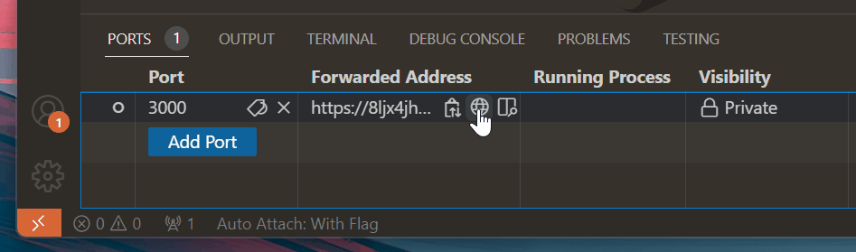

+++
title = "Port Forwarding"
date = 2024-01-12T22:36:24+08:00
weight = 180
type = "docs"
description = ""
isCJKLanguage = true
draft = false
+++

> 原文: [https://code.visualstudio.com/docs/editor/port-forwarding](https://code.visualstudio.com/docs/editor/port-forwarding)

# Local Port Forwarding 本地端口转发


Support for port forwarding is built into Visual Studio Code via [Microsoft dev tunnels](https://learn.microsoft.com/azure/developer/dev-tunnels/overview), no extension required. When running a local web service, you can use the **Ports** view to make the service accessible to others over the internet.
Visual Studio Code 通过 Microsoft dev tunnels 内置了对端口转发的支持，无需扩展。在运行本地 Web 服务时，可以使用“端口”视图使服务可通过 Internet 供其他人访问。

## [How to use local port forwarding 如何使用本地端口转发](https://code.visualstudio.com/docs/editor/port-forwarding#_how-to-use-local-port-forwarding)

First, you need to have a service you want to forward. If you don't have one yet but do have Node.js installed, you can run this command to start up a server on port 3000:
首先，您需要有一个要转发的服务。如果您还没有服务，但已安装 Node.js，则可以运行此命令以在端口 3000 上启动服务器：

```
npx serve
```

Then, navigate to the **Ports** view in the Panel region (**Ports: Focus on Ports View**), and select **Forward a Port**.
然后，导航到“面板”区域中的“端口”视图（端口：关注端口视图），然后选择“转发端口”。


If you haven't logged in with GitHub before, you'll be prompted to sign in. Then, enter the port you'd like to forward; the default port using the above command is port 3000. Once you do, the port forwarding system starts and the **Ports** view updates to show the port you forwarded and its **Forwarded Address**.
如果您之前未使用 GitHub 登录，系统会提示您登录。然后，输入您要转发的端口；使用上述命令的默认端口是端口 3000。执行此操作后，端口转发系统启动，“端口”视图更新以显示您转发的端口及其“已转发地址”。



Hovering over the **Forwarded Address**, you can use the inline actions copy the address, open it in your browser, or open an in-editor preview.
将鼠标悬停在“已转发地址”上，您可以使用内联操作复制地址、在浏览器中打开地址或打开编辑器内预览。

By default, the forwarded port is **Private**. When you navigate to the URL, you'll be required to sign in with the same GitHub account you used to start the port forwarding process in VS Code. You can change the visibility right-clicking on the port and selecting **Port Visibility > Public**. **Public** ports don't require sign in.
默认情况下，转发端口为“专用”。当您导航到 URL 时，您需要使用与在 VS Code 中启动端口转发进程时所用的相同 GitHub 帐户登录。您可以右键单击端口并选择“端口可见性”>“公共”来更改可见性。公共端口不需要登录。

## [Common questions 常见问题](https://code.visualstudio.com/docs/editor/port-forwarding#_common-questions)

### [How do I forward local services if I'm connected to a remote machine? 如果我连接到远程计算机，该如何转发本地服务？](https://code.visualstudio.com/docs/editor/port-forwarding#_how-do-i-forward-local-services-if-im-connected-to-a-remote-machine)

Currently, port forwarding only works to expose locally-running services. It doesn't work in remote connections yet, although we expect it to in the future.
目前，端口转发仅适用于公开本地运行的服务。它目前不适用于远程连接，但我们预计它将在未来适用。

Depending on your scenario, you may want to use the VS Code [Remote - Tunnels](https://marketplace.visualstudio.com/items?itemName=ms-vscode.remote-server) extension to tunnel into a remote machine. You can learn more in the [Remote - Tunnels documentation](https://code.visualstudio.com/docs/remote/tunnels).
根据您的方案，您可能希望使用 VS Code Remote - Tunnels 扩展来隧道进入远程计算机。您可以在 Remote - Tunnels 文档中了解更多信息。

### [How are forwarded ports secured? 如何保护已转发的端口？](https://code.visualstudio.com/docs/editor/port-forwarding#_how-are-forwarded-ports-secured)

By default, both hosting and connecting to a tunnel requires authentication with the same GitHub or Microsoft account on each end. In both cases, VS Code makes outbound connections to a service hosted in Azure; no firewall changes are generally necessary, and VS Code doesn't set up any network listeners.
默认情况下，托管和连接到隧道都需要在每端使用相同的 GitHub 或 Microsoft 帐户进行身份验证。在这两种情况下，VS Code 都会与托管在 Azure 中的服务建立出站连接；通常不需要更改防火墙，VS Code 也不会设置任何网络侦听器。

However, if you've opened a **Public** port, any user with your link can access the forwarded service. You should be careful to avoid hosting any confidential information or insecure services over such ports.
但是，如果您已打开一个公共端口，任何具有您链接的用户都可以访问已转发的服务。您应小心避免在这些端口上托管任何机密信息或不安全的服务。

If you're part of an organization that wants to control access to port forwarding, you can do so by allowing or denying access to the domain `global.rel.tunnels.api.visualstudio.com`.
如果您属于希望控制对端口转发访问的组织，可以通过允许或拒绝访问域 `global.rel.tunnels.api.visualstudio.com` 来做到这一点。

You can learn more about the security of the underlying dev tunnels service in its [documentation](https://learn.microsoft.com/azure/developer/dev-tunnels/security).
您可以在其文档中了解有关基础开发隧道服务安全性的更多信息。

### [What limits are there on port forwarding? 端口转发有哪些限制？](https://code.visualstudio.com/docs/editor/port-forwarding#_what-limits-are-there-on-port-forwarding)

There are limits to both the amount of bandwidth used and the number of active machines that can be used in port forwarding, which are subject to change over time. Read more about tunnel usage limits in the [Remote-Tunnels](https://aka.ms/vscode-dev-tunnel-limit) documentation.
端口转发中使用的带宽量和可用的活动机器数量都有限制，这些限制可能会随着时间的推移而改变。在远程隧道文档中阅读有关隧道使用限制的更多信息。
