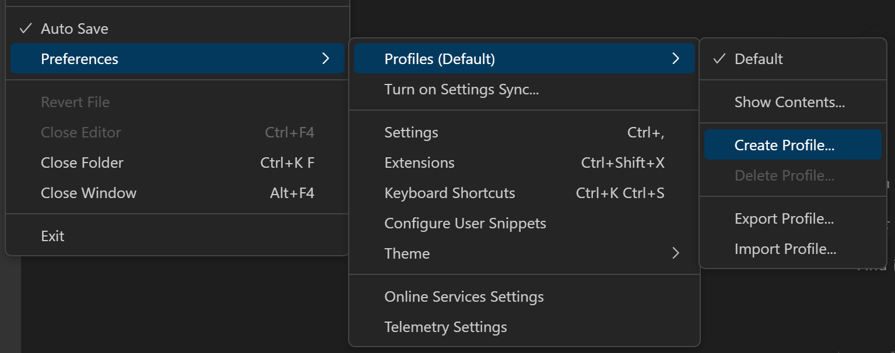
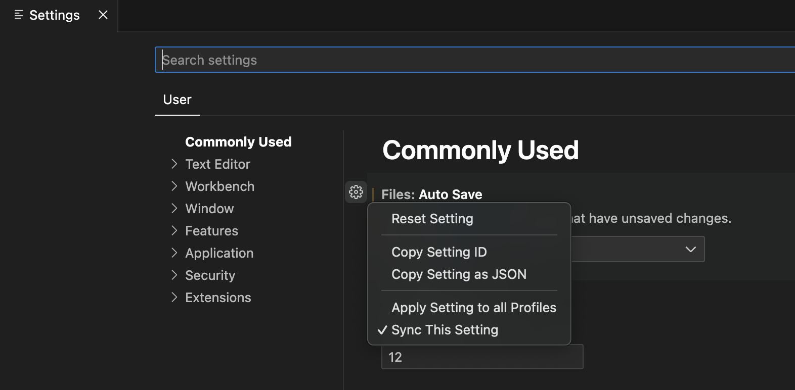

+++
title = "Profiles"
date = 2024-01-12T22:36:24+08:00
weight = 90
type = "docs"
description = ""
isCJKLanguage = true
draft = false
+++

> 原文: [https://code.visualstudio.com/docs/editor/profiles](https://code.visualstudio.com/docs/editor/profiles)

# Profiles in Visual Studio Code Visual Studio Code 中的配置文件


Visual Studio Code has hundreds of [settings](), thousands of [extensions](), and innumerable ways to adjust the UI layout to customize the editor. VS Code **Profiles** let you create sets of customizations and quickly switch between them or share them with others. This topic explains how to create, modify, export, and import profiles.

​​	Visual Studio Code 有数百个设置、数千个扩展以及无数种调整 UI 布局的方式来自定义编辑器。VS Code 配置文件允许您创建一组自定义项并在它们之间快速切换或与他人共享。本主题介绍如何创建、修改、导出和导入配置文件。

## [Create a Profile 创建配置文件]()

VS Code treats your current configuration as the **Default Profile**. As you modify settings, install extensions, or change UI layout by moving views, these customizations are tracked in the Default Profile.

​​	VS Code 将您当前的配置视为默认配置文件。当您修改设置、安装扩展或通过移动视图更改 UI 布局时，这些自定义项将在默认配置文件中进行跟踪。

To create a new profile, you can use the **File** > **Preferences** > **Profiles** > **Create Profile** menu item.

​​	要创建新配置文件，可以使用“文件”>“首选项”>“配置文件”>“创建配置文件”菜单项。



You can create a new profile based on the current profile (**Profiles: Create from Current Profiles**) or create an Empty Profile. An Empty Profile includes no user customizations (settings, extensions, snippets, etc.).

​​	您可以基于当前配置文件（配置文件：从当前配置文件创建）创建新配置文件，或创建一个空配置文件。空配置文件不包含任何用户自定义项（设置、扩展、代码段等）。

You can also access the Profile command menu via the **Manage** gear button in the lower right of the Activity bar.

​​	您还可以通过活动栏右下角的“管理”齿轮按钮访问配置文件命令菜单。


The **Profiles: Create Profile** command is also available in the Command Palette (Ctrl+Shift+P).

​​	配置文件：创建配置文件命令还可在命令面板（Ctrl+Shift+P）中使用。

You can choose to create a new profile by copying from a Profile Template or from an existing profile or create an Empty Profile in the Profile creation dialog.

​​	您可以在“配置文件”创建对话框中选择通过从配置文件模板或现有配置文件复制来创建新配置文件，或创建空配置文件。


### [Partial Profile 部分配置文件]()

A partial profile allows you to customize only a subset of configurations (settings, keyboard shortcuts, snippets, tasks and extensions) and use the rest of the configurations from the Default Profile. For example, you can create a profile with all configurations except for keyboard shortcuts, and VS Code will apply the keyboard shortcuts from the Default Profile when this profile is active.

​​	部分配置文件允许您仅自定义配置子集（设置、键盘快捷方式、代码段、任务和扩展），并使用默认配置文件中的其余配置。例如，您可以创建一个包含除键盘快捷方式之外的所有配置的配置文件，当此配置文件处于活动状态时，VS Code 将应用默认配置文件中的键盘快捷方式。


### [Check the current profile 检查当前配置文件]()

The current profile name is displayed in several places in the VS Code UI:

​​	当前配置文件名称显示在 VS Code UI 的多个位置：

- Title bar
  标题栏
- **File** > **Preferences** > **Profiles**
  文件 > 首选项 > 配置文件
- **Manage** gear button hover
  管理齿轮按钮悬停

If you are still using the Default Profile, no profile name is displayed.

​​	如果您仍在使用默认配置文件，则不会显示配置文件名称。

The **Manage** gear button displays a badge with the first two letters of the active profile so you can quickly check which profile you are running.

​​	管理齿轮按钮会显示一个徽章，其中包含活动配置文件的前两个字母，以便您可以快速检查正在运行哪个配置文件。


### [Configure a profile 配置配置文件]()

You can configure a profile just as you would normally change any VS Code configuration. You can install/uninstall/disable extensions, change settings, and adjust the editor's UI layout (for example, moving and hiding views) like normal. These changes are stored in your currently active profile.

​​	您可以像通常更改任何 VS Code 配置一样配置配置文件。您可以像往常一样安装/卸载/禁用扩展、更改设置以及调整编辑器的 UI 布局（例如，移动和隐藏视图）。这些更改存储在您当前活动的配置文件中。

### [Workspace associations 工作区关联]()

When you create or select an existing profile, it is associated with the current workspace and whenever you open that folder, the workspace's profile is active. If you open another folder, the profile switches to that folder's associated profile if one has been set or remains on the last used profile.

​​	当您创建或选择现有配置文件时，它会与当前工作区关联，并且无论何时打开该文件夹，工作区的配置文件都会处于活动状态。如果您打开另一个文件夹，则配置文件会切换到该文件夹的关联配置文件（如果已设置）或保留在上次使用的配置文件上。

## [Managing profiles 管理配置文件]()

### [Switch profiles 切换配置文件]()

You can quickly switch between profiles with the **Profiles: Switch Profile** command in the Command Palette, which presents a dropdown listing your available profiles.

​​	您可以使用“命令面板”中的“配置文件：切换配置文件”命令在配置文件之间快速切换，该命令会显示一个下拉列表，列出您的可用配置文件。

You can also switch profiles by selecting a profile from the list displayed in the Profiles menus, available via the **Manage** gear button or **File** > **Preferences** > **Profiles**.

​​	您还可以通过从“配置文件”菜单中显示的列表中选择配置文件来切换配置文件，该菜单可通过“管理”齿轮按钮或“文件”>“首选项”>“配置文件”获得。

### [Edit a profile 编辑配置文件]()

You can edit an existing profile via the **Edit** command in the Profiles menu.

​​	您可以通过“配置文件”菜单中的“编辑”命令编辑现有配置文件。

### [Delete a profile 删除个人资料]()

You can delete a profile via the **Delete Profile** command. The **Delete Profile** drop down lets you select which profile(s) to delete.

​​	您可以通过“删除配置文件”命令删除配置文件。“删除配置文件”下拉菜单允许您选择要删除的配置文件。

## [Profile contents 配置文件内容]()

The **Profiles: Show Contents** command (available in the Command Palette or Profiles menus) brings up the Profiles view, where you can review the customizations for the profile.

​​	配置文件：显示内容命令（可在命令面板或配置文件菜单中找到）会打开配置文件视图，您可以在其中查看配置文件的自定义项。


A profile can include:

​​	配置文件可以包括：

- Settings - In a profile-specific `settings.json` file.
  设置 - 在特定于配置文件的 `settings.json` 文件中。
- Extensions - The list of extensions included in the current profile.
  扩展 - 当前配置文件中包含的扩展列表。
- UI state - View layout (positions), visible views and actions.
  UI 状态 - 视图布局（位置）、可见视图和操作。
- Keybindings - In a profile-specific `keybindings.json` file.
  键盘绑定 - 在特定于配置文件的 `keybindings.json` 文件中。
- Snippets - In a profile-specific `{language}.json` files.
  代码片段 - 在特定于配置文件的 `{language}.json` 文件中。
- User Tasks - In a profile-specific `tasks.json` file.
  用户任务 - 在特定于配置文件的 `tasks.json` 文件中。

When you create a new profile based on the Default Profile, the profile-specific configuration files are populated from your user configuration files. Workspace-specific settings are not automatically included in a new profile.

​​	当您基于默认配置文件创建新配置文件时，特定于配置文件的配置文件将从您的用户配置文件中填充。特定于工作区的设置不会自动包含在新配置文件中。

> **Note**: Unchecking an extension in the Profiles view does not remove or disable the extension from the current profile but does remove the extension if you export the profile.
>
> ​​	注意：在“配置文件”视图中取消选中扩展程序不会从当前配置文件中删除或禁用扩展程序，但如果您导出配置文件，则会删除扩展程序。

### [Applying a setting to all profiles 将设置应用于所有配置文件]()

A setting can be applied to all profiles using the **Apply Setting to all Profiles** action available in the Settings editor.

​​	可以使用“设置”编辑器中提供的“将设置应用于所有配置文件”操作将设置应用于所有配置文件。



This will apply the value of the setting to all profiles. Any updates to this setting from any profile will be applied to all profiles. You can always revert this by unchecking the **Apply Setting to all Profiles** action.

​​	这会将设置的值应用于所有配置文件。对该设置从任何配置文件进行的任何更新都将应用于所有配置文件。您可以随时取消选中“将设置应用于所有配置文件”操作来还原此操作。

### [Applying an extension to all profiles 将扩展程序应用于所有配置文件]()

An extension can be applied to all profiles by clicking on the **Apply Extension to all Profiles** action in the Extensions view.

​​	可以通过在“扩展程序”视图中单击“将扩展程序应用于所有配置文件”操作将扩展程序应用于所有配置文件。


This will make this extension available in all profiles. You can always revert this by unchecking the **Apply Extension to all Profiles** action.

​​	这会使该扩展程序在所有配置文件中可用。您可以随时取消选中“将扩展程序应用于所有配置文件”操作来还原此操作。

## [Share Profiles 共享配置文件]()

### [Export 导出]()

You can export a profile in order to save it or share it with others. The **Export Profile** command displays the Profiles view with the contents of the active profile and an **Export** button. You can unselect various elements of the profile such as extensions or configuration files before you export the profile.

​​	您可以导出配置文件以保存或与他人共享。导出配置文件命令会显示“配置文件”视图，其中包含活动配置文件的内容和“导出”按钮。您可以在导出配置文件之前取消选择配置文件的各种元素，例如扩展程序或配置文件。

When you select **Export**, you are prompted for the profile name and whether you want to export to a [GitHub gist](https://docs.github.com/get-started/writing-on-github/editing-and-sharing-content-with-gists/creating-gists) or your local file system.

​​	当您选择“导出”时，系统会提示您输入配置文件名称，并询问您是要导出到 GitHub gist 还是本地文件系统。

#### [Save as a GitHub gist 另存为 GitHub gist]()

After you save a profile to GitHub (you'll be prompted to log into GitHub), a dialog gives you the option to **Copy Link** so you can share your profile gist URL with others. The URL includes an autogenerated GUID and has the format `https://vscode.dev/editor/profile/github/{GUID}`. The GitHub gist is marked as **Secret**, so only those with the link can see the gist.

​​	将配置文件保存到 GitHub 后（系统会提示您登录 GitHub），一个对话框会为您提供“复制链接”选项，以便您可以与他人共享您的配置文件 gist URL。该 URL 包含一个自动生成的 GUID，格式为 `https://vscode.dev/editor/profile/github/{GUID}` 。GitHub gist 被标记为“秘密”，因此只有具有该链接的人才能看到该 gist。

If you launch the profile URL, it opens VS Code for the Web (vscode.dev) with the Profiles view open and the imported profile contents displayed. You can unselect profile elements if you wish and you need to manually **Install Extensions** (via the download cloud button) if you want to continue using that profile in vscode.dev.

​​	如果您启动配置文件 URL，它将在 VS Code for the Web (vscode.dev) 中打开“配置文件”视图，并显示导入的配置文件内容。如果您愿意，可以取消选择配置文件元素，如果您想在 vscode.dev 中继续使用该配置文件，则需要手动“安装扩展”(通过下载云按钮)。

You also have the option to **Import Profile in Visual Studio Code**, which opens VS Code Desktop with the profile's contents displayed and an **Import Profile** button.

​​	您还可以选择在 Visual Studio Code 中“导入配置文件”，这将在 VS Code Desktop 中打开配置文件的内容，并显示“导入配置文件”按钮。

You can review your gists at `https://gist.github.com/{username}`. From your GitHub gist page you can rename, delete, or copy the GUID of a gist.

​​	您可以在 `https://gist.github.com/{username}` 查看您的 gist。在您的 GitHub gist 页面中，您可以重命名、删除或复制 gist 的 GUID。

#### [Save as a local file 另存为本地文件]()

If you chose to save the profile as a local file, a **Save Profile** dialog lets you place the file on your local machine. A profile is persisted in a file with the extension `.code-profile`.

​​	如果您选择将配置文件另存为本地文件，则“保存配置文件”对话框允许您将文件放在本地计算机上。配置文件保存在扩展名为 `.code-profile` 的文件中。

### [Import 导入]()

To import an existing profile, run the **Import Profiles** command. You are prompted for the URL of a GitHub gist or the file location of a profile via an **Import Profile** dialog. Once you have selected the profile, the Profiles view opens and displays the profile to import. You can unselect some profile elements if you don't want to import them. Select the **Import Profile** button and you will now be using the imported profile.

​​	要导入现有配置文件，请运行“导入配置文件”命令。系统会通过“导入配置文件”对话框提示您输入 GitHub gist 的 URL 或配置文件的文件位置。选择配置文件后，“配置文件”视图随即打开并显示要导入的配置文件。如果您不想导入某些配置文件元素，可以取消选择它们。选择“导入配置文件”按钮，您现在将使用导入的配置文件。

## [Uses for Profiles 配置文件的用途]()

Profiles are a great way to customize VS Code to better fit your needs. In this section, we look at some common use cases for profiles.

​​	配置文件是自定义 VS Code 以更好地满足您需求的绝佳方式。在本部分中，我们了解配置文件的一些常见用例。

Since profiles are remembered per workspace, they are a great way to customize VS Code for a specific programming language. For example, you can create a JavaScript frontend profile that includes the extensions, settings, and customizations you use for JavaScript development in one workspace, and have a Python backend profile that includes the extensions, settings, and customizations you use for Python development in another workspace. Using this approach, you can easily switch between workspaces and always have VS Code configured the right way.

​​	由于配置文件会根据工作区记住，因此它们是针对特定编程语言自定义 VS Code 的好方法。例如，您可以创建一个 JavaScript 前端配置文件，其中包含您在某个工作区中用于 JavaScript 开发的扩展、设置和自定义项，并拥有一个 Python 后端配置文件，其中包含您在另一个工作区中用于 Python 开发的扩展、设置和自定义项。使用此方法，您可以轻松地在工作区之间切换，并始终以正确的方式配置 VS Code。

### [Demos 演示]()

When doing a demo, you can use a profile to set up a specific configuration for your demo. For example, you can create a profile with a specific set of extensions and settings like zoom level, font size, and color theme. By doing this, a demo will not mess up your normal VS Code setup and you can customize VS Code for better visibility during your presentation.

​​	在进行演示时，您可以使用配置文件为演示设置特定配置。例如，您可以创建一个配置文件，其中包含一组特定的扩展和设置，如缩放级别、字体大小和颜色主题。通过执行此操作，演示不会搞乱您的正常 VS Code 设置，并且您可以在演示期间自定义 VS Code 以提高可见性。

### [Education 教育]()

Profiles can be used to customize VS Code for students to ease the use in a classroom setting. Profiles allow educators to quickly share a customized VS Code setup with students. For example, educators can create a profile with a specific set of extensions and settings needed for a computer science class and then share that profile with students.

​​	配置文件可用于为学生自定义 VS Code，以便在课堂环境中轻松使用。配置文件允许教育工作者快速与学生共享自定义的 VS Code 设置。例如，教育工作者可以为计算机科学课程创建包含特定扩展和设置的配置文件，然后与学生共享该配置文件。

### [Report VS Code issues 报告 VS Code 问题]()

One use of an Empty Profile is to reset your editor when you want to report an issue with VS Code. An Empty Profile disables all extensions and modified settings so you can quickly see if the issue is due to an extension, a setting, or is in VS Code core.

​​	空配置文件的一个用途是在您想要报告 VS Code 问题时重置编辑器。空配置文件会禁用所有扩展和已修改的设置，以便您可以快速查看问题是由于扩展、设置还是 VS Code 内核造成的。

## [Profile Templates 配置文件模板]()

VS Code comes with a predefined set of profile templates that you can use to customize VS Code for your specific workflow. To create a new profile based on a template, select a Profile Template when going through the **Create Profile** flow.

​​	VS Code 附带一组预定义的配置文件模板，您可以使用这些模板为您的特定工作流自定义 VS Code。要基于模板创建新配置文件，请在执行“创建配置文件”流程时选择“配置文件模板”。

### [Python Profile Template Python 配置文件模板]()

The Python profile is a good starting point for Python development. It comes with Python specific snippets and has the following extensions:

​​	Python 配置文件是 Python 开发的良好起点。它附带 Python 特定的代码段，并具有以下扩展：

- [autoDocstring](https://marketplace.visualstudio.com/items?itemName=njpwerner.autodocstring) - Generate Python docstrings automatically.
  autoDocstring - 自动生成 Python 文档字符串。
- [Black Formatter](https://marketplace.visualstudio.com/items?itemName=ms-python.black-formatter) - Formatting support using the [black](https://github.com/python/black) formatter.
  Black Formatter - 使用 black 格式化程序进行格式化支持。
- [Docker](https://marketplace.visualstudio.com/items?itemName=ms-azuretools.vscode-docker) - Create, manage, and debug containerized applications.
  Docker - 创建、管理和调试容器化应用程序。
- [Even Better TOML](https://marketplace.visualstudio.com/items?itemName=tamasfe.even-better-toml) - Fully-featured TOML support.
  更好的 TOML - 全功能 TOML 支持。
- [Python](https://marketplace.visualstudio.com/items?itemName=ms-python.python) - IntelliSense, linting, formatting, debugging, refactoring.
  Python - IntelliSense、linting、格式化、调试、重构。
- [Python Environment Manager](https://marketplace.visualstudio.com/items?itemName=donjayamanne.python-environment-manager) - Manage Python environments and packages.
  Python 环境管理器 - 管理 Python 环境和包。
- [Remote Development](https://marketplace.visualstudio.com/items?itemName=ms-vscode-remote.vscode-remote-extensionpack) extension pack - Supports SSH, WSL, and Dev Containers.
  远程开发扩展包 - 支持 SSH、WSL 和 Dev Containers。
- [Ruff](https://marketplace.visualstudio.com/items?itemName=charliermarsh.ruff) - Integrates the [Ruff](https://github.com/charliermarsh/ruff) Python linter.
  Ruff - 集成了 Ruff Python linter。

This profile also sets the following settings:

​​	此配置文件还设置了以下设置：

```
    "python.analysis.autoImportCompletions": true,
    "python.analysis.fixAll": ["source.unusedImports"],
    "editor.defaultFormatter": "ms-python.black-formatter"
```

### [Data Science Profile Template 数据科学配置文件模板]()

The Data Science profile is a good starting point for all data and notebook work. It comes with specific snippets and has the following extensions:

​​	数据科学配置文件是所有数据和笔记本工作的良好起点。它带有一些特定的代码片段，并具有以下扩展：

- [Data Wrangler](https://marketplace.visualstudio.com/items?itemName=ms-toolsai.datawrangler) - Data cleaning and preparation for tabular datasets.
  数据整理器 - 清理和准备表格数据集的数据。
- [Black Formatter](https://marketplace.visualstudio.com/items?itemName=ms-python.black-formatter) - Formatting support using the [black](https://github.com/python/black) formatter.
  Black 格式化程序 - 使用 black 格式化程序的格式化支持。
- [Jupyter](https://marketplace.visualstudio.com/items?itemName=ms-toolsai.jupyter) - Use Jupyter notebooks within VS Code.
  Jupyter - 在 VS Code 中使用 Jupyter 笔记本。
- [Python](https://marketplace.visualstudio.com/items?itemName=ms-python.python) - IntelliSense, linting, formatting, debugging, refactoring.
  Python - IntelliSense、linting、格式化、调试、重构。
- [Dev Containers](https://marketplace.visualstudio.com/items?itemName=ms-vscode-remote.remote-containers) - Create custom development environments inside a Docker container.
  开发容器 - 在 Docker 容器内创建自定义开发环境。
- [GitHub Copilot](https://marketplace.visualstudio.com/items?itemName=GitHub.copilot) - Your AI pair programmer.
  GitHub Copilot - 您的 AI 配对程序员。

This profile also sets the following settings:

​​	此配置文件还设置了以下设置：

```
    "[python]": {
        "editor.defaultFormatter": "ms-python.black-formatter",
        "editor.formatOnType": true,
        "editor.formatOnSave": true
    },
    "editor.inlineSuggest.enabled": true,
    "editor.lineHeight": 17,
    "breadcrumbs.enabled": false,
    "files.autoSave": "afterDelay",
    "jupyter.themeMatplotlibPlots": true,
    "jupyter.widgetScriptSources": [
        "unpkg.com",
        "jsdelivr.com"
    ],
    "notebook.experimental.outputScrolling": true,
    // "notebook.outline.showCodeCells": true,
    "files.exclude": {
        "**/.csv": true,
        "**/.parquet": true,
        "**/.pkl": true,
        "**/.xls": true
    }
```

### [Doc Writer Profile Template 文档编写人员配置文件模板]()

The Doc Writer profile is a good lightweight setup for writing documentation. It comes with the following extensions:

​​	文档编写人员配置文件是用于编写文档的良好轻量级设置。它附带以下扩展：

- [Code Spell Checker](https://marketplace.visualstudio.com/items?itemName=streetsidesoftware.code-spell-checker) - Spelling checker for source code.
  代码拼写检查器 - 源代码的拼写检查器。
- [Markdown Checkboxes](https://marketplace.visualstudio.com/items?itemName=bierner.markdown-checkbox) - Adds checkbox support to the VS Code built-in Markdown Preview.
  Markdown 复选框 - 为 VS Code 内置 Markdown 预览添加复选框支持。
- [Markdown Emoji](https://marketplace.visualstudio.com/items?itemName=bierner.markdown-emoji) - Adds emoji syntax support to Markdown Preview and notebook Markdown cells.
  Markdown 表情符号 - 为 Markdown 预览和笔记本 Markdown 单元格添加表情符号语法支持。
- [Markdown Footnotes](https://marketplace.visualstudio.com/items?itemName=bierner.markdown-footnotes) - Adds ^footnote syntax support to the Markdown Preview.
  Markdown 脚注 - 为 Markdown 预览添加 ^footnote 语法支持。
- [Markdown Preview GitHub Styling](https://marketplace.visualstudio.com/items?itemName=bierner.markdown-preview-github-styles) - Use GitHub styling in the Markdown Preview.
  Markdown 预览 GitHub 样式 - 在 Markdown 预览中使用 GitHub 样式。
- [Markdown Preview Mermaid Support](https://marketplace.visualstudio.com/items?itemName=bierner.markdown-mermaid) - Mermaid diagrams and flowcharts.
  Markdown 预览 Mermaid 支持 - Mermaid 图表和流程图。
- [Markdown yaml Preamble](https://marketplace.visualstudio.com/items?itemName=bierner.markdown-yaml-preamble) - Renders YAML front matter as a table.
  Markdown yaml 序言 - 将 YAML 前置内容渲染为表格。
- [markdownlint](https://marketplace.visualstudio.com/items?itemName=DavidAnson.vscode-markdownlint) - Markdown linting and style checking for Visual Studio Code.
  markdownlint - Visual Studio Code 的 Markdown linting 和样式检查。

This profile also sets the following settings:

​​	此配置文件还设置以下设置：

```
    "workbench.colorTheme": "Default Light+ Experimental",
    "editor.minimap.enabled": false,
    "breadcrumbs.enabled": false,
    "editor.glyphMargin": false,
    "explorer.decorations.badges": false,
    "explorer.decorations.colors": false,
    "editor.fontLigatures": true,
    "files.autoSave": "afterDelay",
    "git.enableSmartCommit": true,
    "window.commandCenter": true,
    "editor.renderWhitespace": "none",
    "workbench.editor.untitled.hint": "hidden",
    "markdown.validate.enabled": true,
    "markdown.updateLinksOnFileMove.enabled": "prompt",
    "workbench.startupEditor": "none"
```

### [Node.js Profile Template Node.js 配置文件模板]()

The Node.js profile is a good starting point for all Node.js work. It comes with the following extensions:

​​	Node.js 配置文件是所有 Node.js 工作的良好起点。它附带以下扩展：

- [ESLint](https://marketplace.visualstudio.com/items?itemName=dbaeumer.vscode-eslint) - Integrates ESLint JavaScript into VS Code.
  ESLint - 将 ESLint JavaScript 集成到 VS Code 中。
- [Dev Containers](https://marketplace.visualstudio.com/items?itemName=ms-vscode-remote.remote-containers) - Create custom development environments inside a Docker container.
  开发容器 - 在 Docker 容器中创建自定义开发环境。
- [Docker](https://marketplace.visualstudio.com/items?itemName=ms-azuretools.vscode-docker) - Create, manage, and debug containerized applications.
  Docker - 创建、管理和调试容器化应用程序。
- [DotENV](https://marketplace.visualstudio.com/items?itemName=mikestead.dotenv) - Support for dotenv file syntax.
  DotENV - 支持 dotenv 文件语法。
- [EditorConfig for VS Code](https://marketplace.visualstudio.com/items?itemName=EditorConfig.EditorConfig) - EditorConfig Support for Visual Studio Code.
  VS Code 的 EditorConfig - Visual Studio Code 的 EditorConfig 支持。
- [JavaScript (ES6) code snippets](https://marketplace.visualstudio.com/items?itemName=xabikos.JavaScriptSnippets) - Code snippets for JavaScript in ES6 syntax.
  JavaScript (ES6) 代码片段 - ES6 语法中 JavaScript 的代码片段。
- [Jest](https://marketplace.visualstudio.com/items?itemName=Orta.vscode-jest) - Use Facebook's [jest](https://jestjs.io/) testing framework.
  Jest - 使用 Facebook 的 jest 测试框架。
- [Microsoft Edge Tools for VS Code](https://marketplace.visualstudio.com/items?itemName=ms-edgedevtools.vscode-edge-devtools) - Use the Microsoft Edge Tools from within VS Code.
  VS Code 的 Microsoft Edge 工具 - 在 VS Code 中使用 Microsoft Edge 工具。
- [npm Intellisense](https://marketplace.visualstudio.com/items?itemName=christian-kohler.npm-intellisense) - Autocomplete npm modules in import statements.
  npm 智能感知 - 在 import 语句中自动完成 npm 模块。
- [Prettier - Code formatter](https://marketplace.visualstudio.com/items?itemName=esbenp.prettier-vscode) - Code formatter using [Prettier](https://prettier.io/).
  Prettier - 代码格式化程序 - 使用 Prettier 的代码格式化程序。
- [Rest Client](https://marketplace.visualstudio.com/items?itemName=humao.rest-client) - REST Client for Visual Studio Code.
  Rest Client - Visual Studio Code 的 REST 客户端。
- [YAML](https://marketplace.visualstudio.com/items?itemName=redhat.vscode-yaml) - YAML language support with built-in Kubernetes syntax.
  YAML - YAML 语言支持，内置 Kubernetes 语法。

This profile comes with the following settings:

​​	此配置文件具有以下设置：

```
    "editor.formatOnPaste": true,
    "git.autofetch": true,
    "[markdown]":  {
        "editor.wordWrap": "on"
    },
    "[json]": {
        "editor.defaultFormatter": "esbenp.prettier-vscode"
    },
    "[jsonc]": {
        "editor.defaultFormatter": "vscode.json-language-features"
    },
    "[html]": {
        "editor.defaultFormatter": "esbenp.prettier-vscode"
    },
    "[javascript]": {
        "editor.defaultFormatter": "esbenp.prettier-vscode"
    },
    "[typescript]": {
        "editor.defaultFormatter": "esbenp.prettier-vscode"
    }
```

### [Angular Profile Template Angular 配置文件模板]()

The Angular profile is a good starting point for all Angular work. It comes with the following extensions:

​​	Angular 配置文件是所有 Angular 工作的良好起点。它具有以下扩展：

- [Angular Language Service](https://marketplace.visualstudio.com/items?itemName=Angular.ng-template) - Editor services for Angular templates.
  Angular 语言服务 - Angular 模板的编辑器服务。
- [Angular Schematics](https://marketplace.visualstudio.com/items?itemName=cyrilletuzi.angular-schematics) - Integrate Angular schematics (CLI commands).
  Angular 架构 - 集成 Angular 架构（CLI 命令）。
- [angular2-switcher](https://marketplace.visualstudio.com/items?itemName=infinity1207.angular2-switcher) - Easily navigate to `typescript`|`template`|`style` in angular2 project.
  angular2-switcher - 在 angular2 项目中轻松导航到 `typescript` | `template` | `style` 。
- [Dev Containers](https://marketplace.visualstudio.com/items?itemName=ms-vscode-remote.remote-containers) - Create custom development environments inside a Docker container.
  Dev Containers - 在 Docker 容器内创建自定义开发环境。
- [EditorConfig for VS Code](https://marketplace.visualstudio.com/items?itemName=EditorConfig.EditorConfig) - EditorConfig Support for Visual Studio Code.
  EditorConfig for VS Code - Visual Studio Code 的 EditorConfig 支持。
- [ESLint](https://marketplace.visualstudio.com/items?itemName=dbaeumer.vscode-eslint) - Integrates ESLint JavaScript into VS Code.
  ESLint - 将 ESLint JavaScript 集成到 VS Code 中。
- [JavaScript (ES6) code snippets](https://marketplace.visualstudio.com/items?itemName=xabikos.JavaScriptSnippets) - Code snippets for JavaScript in ES6 syntax.
  JavaScript (ES6) 代码片段 - ES6 语法中的 JavaScript 代码片段。
- [Jest](https://marketplace.visualstudio.com/items?itemName=Orta.vscode-jest) - Use Facebook's [jest](https://jestjs.io/) testing framework.
  Jest - 使用 Facebook 的 jest 测试框架。
- [Material Icon Theme](https://marketplace.visualstudio.com/items?itemName=PKief.material-icon-theme) - Material Design Icons for Visual Studio Code.
  Material Icon Theme - Visual Studio Code 的 Material Design 图标。
- [Microsoft Edge Tools for VS Code](https://marketplace.visualstudio.com/items?itemName=ms-edgedevtools.vscode-edge-devtools) - Use the Microsoft Edge Tools from within VS Code.
  Microsoft Edge Tools for VS Code - 在 VS Code 中使用 Microsoft Edge 工具。
- [Playwright Test for VSCode](https://marketplace.visualstudio.com/items?itemName=ms-playwright.playwright) - Run [Playwright](https://playwright.dev/) tests in Visual Studio Code.
  Playwright Test for VSCode - 在 Visual Studio Code 中运行 Playwright 测试。
- [Prettier - Code formatter](https://marketplace.visualstudio.com/items?itemName=esbenp.prettier-vscode) - Code formatter using [Prettier](https://prettier.io/).
  Prettier - 代码格式化程序 - 使用 Prettier 的代码格式化程序。
- [Rest Client](https://marketplace.visualstudio.com/items?itemName=humao.rest-client) - REST Client for Visual Studio Code.
  Rest Client - Visual Studio Code 的 REST 客户端。
- [YAML](https://marketplace.visualstudio.com/items?itemName=redhat.vscode-yaml) - YAML language support with built-in Kubernetes syntax.
  YAML - YAML 语言支持，内置 Kubernetes 语法。

This profile sets the following settings:

​​	此配置文件设置以下设置：

```
    "editor.formatOnPaste": true,
    "git.autofetch": true,
    "[markdown]":  {
        "editor.wordWrap": "on"
    },
    "[json]": {
        "editor.defaultFormatter": "esbenp.prettier-vscode"
    },
    "[jsonc]": {
        "editor.defaultFormatter": "vscode.json-language-features"
    },
    "[html]": {
        "editor.defaultFormatter": "esbenp.prettier-vscode"
    },
    "[javascript]": {
        "editor.defaultFormatter": "esbenp.prettier-vscode"
    },
    "[typescript]": {
        "editor.defaultFormatter": "esbenp.prettier-vscode"
    },
    "workbench.iconTheme": "material-icon-theme"
```

### [Java General Profile Template Java 通用配置文件模板]()

The Java General profile is a good starting point for all Java work. It customizes the layout to improve the Java experience and comes with the following extensions from the [Extension Pack for Java](https://marketplace.visualstudio.com/items?itemName=vscjava.vscode-java-pack):

​​	Java 通用配置文件是所有 Java 工作的良好起点。它自定义了布局以改善 Java 体验，并附带 Java 扩展包中的以下扩展：

- [Debugger for Java](https://marketplace.visualstudio.com/items?itemName=vscjava.vscode-java-debug) - A lightweight Java debugger.
  Java 调试器 - 轻量级 Java 调试器。
- [IntelliCode](https://marketplace.visualstudio.com/items?itemName=VisualStudioExptTeam.vscodeintellicode) - AI-assisted development.
  IntelliCode - AI 辅助开发。
- [IntelliCode API Usage Examples](https://marketplace.visualstudio.com/items?itemName=VisualStudioExptTeam.intellicode-api-usage-examples) - Provides code examples for over 100K different APIs.
  IntelliCode API 使用示例 - 提供超过 100K 个不同 API 的代码示例。
- [Language Support for Java(TM) by Red Hat](https://marketplace.visualstudio.com/items?itemName=redhat.java) - Fundamental Java language support, Linting, Intellisense, formatting, refactoring.
  Red Hat 提供的 Java(TM) 语言支持 - 基本 Java 语言支持、Linting、智能感知、格式化、重构。
- [Maven for Java](https://marketplace.visualstudio.com/items?itemName=vscjava.vscode-maven) - Manage [Maven](https://maven.apache.org/) projects and builds.
  Java 的 Maven - 管理 Maven 项目和构建。
- [Project Manager for Java](https://marketplace.visualstudio.com/items?itemName=vscjava.vscode-java-dependency) - Manage Java projects within VS Code.
  Java 项目管理器 - 在 VS Code 中管理 Java 项目。
- [Test Runner for Java](https://marketplace.visualstudio.com/items?itemName=vscjava.vscode-java-test) - Run and debug JUnit or TestNG test cases.
  Java 的测试运行器 - 运行和调试 JUnit 或 TestNG 测试用例。

### [Java Spring Profile Template Java Spring 配置文件模板]()

The Java Spring profile is a good starting point for all Java and Spring developers. It builds on the Java General profile and add the following extensions from the [Spring Boot Extension Pack](https://marketplace.visualstudio.com/items?itemName=vmware.vscode-boot-dev-pack):

​​	Java Spring 配置文件是所有 Java 和 Spring 开发人员的良好起点。它基于 Java 通用配置文件，并添加了 Spring Boot 扩展包中的以下扩展：

- [Spring Boot Dashboard](https://marketplace.visualstudio.com/items?itemName=vscjava.vscode-spring-boot-dashboard) - Provides Spring Boot live data visualization and observation in your running Spring applications.
  Spring Boot 仪表板 - 在正在运行的 Spring 应用程序中提供 Spring Boot 实时数据可视化和观察。
- [Spring Boot Tools](https://marketplace.visualstudio.com/items?itemName=vmware.vscode-spring-boot) - Rich language support for Spring Boot files.
  Spring Boot 工具 - 对 Spring Boot 文件提供丰富的语言支持。
- [Spring Initializr Java Support](https://marketplace.visualstudio.com/items?itemName=vscjava.vscode-spring-initializr) - Scaffold and generate Spring Boot Java projects.
  Spring Initializr Java 支持 - 脚手架和生成 Spring Boot Java 项目。

This profile sets the following settings:

​​	此配置文件设置以下设置：

```
    "[java]": {
        "editor.defaultFormatter": "redhat.java"
    },
    "boot-java.rewrite.reconcile": true
```

## [Command line 命令行]()

You can launch VS Code with a specific profile via the `--profile` command-line interface option. You pass the name of the profile after the `--profile` argument and open a folder or a workspace using that profile. The command line below opens the `web-sample` folder with the "Web Development" profile:

​​	您可以通过 `--profile` 命令行界面选项使用特定配置文件启动 VS Code。您在 `--profile` 参数后传递配置文件的名称，并使用该配置文件打开文件夹或工作区。以下命令行使用“Web 开发”配置文件打开 `web-sample` 文件夹：

```
code ~/projects/web-sample --profile "Web Development"
```

If the profile specified does not exist, a new empty profile with the given name is created.

​​	如果指定的配置文件不存在，则会创建一个具有给定名称的新空配置文件。

## [Common Questions 常见问题]()

### [Where are profiles kept? 配置文件保存在哪里？]()

Profiles are stored under your User configurations similar to your user settings and keybindings.

​​	配置文件存储在您的用户配置中，类似于您的用户设置和键绑定。

- **Windows** `%APPDATA%\Code\User\profiles`
- **macOS** `$HOME/Library/Application\ Support/Code/User/profiles`
- **Linux** `$HOME/.config/Code/User/profiles`

If you are using the [Insiders](https://code.visualstudio.com/insiders) version, the intermediate folder name is `Code - Insiders`.

​​	如果您使用的是 Insiders 版本，则中间文件夹名称为 `Code - Insiders` 。

### [Where is the UI State globalState.json file? UI 状态 globalState.json 文件在哪里？]()

If you expand the **UI State** node in the Profiles view, there is a `globalState.json` entry. This is an in-memory JSON representation of your profile's UI State, describing the visibility and layout of various VS Code UI elements. The file does not actually exist on disk and is just a JSON view of the underlying global state storage.

​​	如果您在配置文件视图中展开 UI 状态节点，则会有一个 `globalState.json` 条目。这是配置文件的 UI 状态的内存中 JSON 表示形式，描述了各种 VS Code UI 元素的可见性和布局。该文件实际上并不存在于磁盘上，而只是基础全局状态存储的 JSON 视图。

### [What is a Temporary Profile? 什么是临时配置文件？]()

A Temporary Profile is a profile that is not saved across VS Code sessions. You create a Temporary Profile via the **Profiles: Create a Temporary Profile** command in the Command Palette. The Temporary Profile starts as an Empty Profile and has an automatically generated name (such as **Temp 1**). You can modify the profile settings and extensions, use the profile for the lifetime of your VS Code session, but it will be deleted once you close VS Code.

​​	临时配置文件是不会在 VS Code 会话中保存的配置文件。您可以通过命令面板中的“配置文件：创建临时配置文件”命令创建临时配置文件。临时配置文件从空配置文件开始，并具有自动生成的名称（例如 Temp 1）。您可以修改配置文件设置和扩展，在 VS Code 会话的生存期内使用该配置文件，但一旦您关闭 VS Code，它就会被删除。

Temporary Profiles are useful if you want to try a new configuration or test an extension without modifying your default or existing profile. Restarting VS Code reenables the current profile for your workspace.

​​	如果您想尝试新配置或测试扩展而无需修改默认或现有配置文件，临时配置文件非常有用。重新启动 VS Code 会为您的工作区重新启用当前配置文件。

### [How can I remove the profile from my project? 如何从我的项目中删除配置文件？]()

You can set your project back to the Default Profile. If you'd like to remove all profile workspace associations, you can use the **Developer: Reset Workspace Profiles Associations**, which will set all local folders currently assigned a profile back to the Default Profile. **Reset Workspace Profiles Associations** does not delete any existing profiles.

​​	您可以将项目设置回默认配置文件。如果您想删除所有配置文件工作区关联，可以使用 Developer: Reset Workspace Profiles Associations，它会将当前分配了配置文件的所有本地文件夹设置回默认配置文件。Reset Workspace Profiles Associations 不会删除任何现有配置文件。

### [Do profiles sync across machines (via Settings Sync)? 配置文件是否通过机器同步（通过设置同步）？]()

Yes, you can use [Settings Sync]() to move your profiles across various machines. With Setting Sync enabled and **Profiles** checked in the **Settings Sync: Configure** drop down, all your created profiles are available.

​​	是的，您可以使用设置同步功能在多台机器间移动您的配置文件。启用设置同步功能并在设置同步中选中配置文件：配置下拉菜单，您创建的所有配置文件都可用。


### [Why are some settings not exported when exporting a profile? 导出配置文件时为什么某些设置不会导出？]()

When exporting profiles, machine-specific settings are not included because these setting would not be applicable on another machine. For example, settings that point to local paths are not included.

​​	导出配置文件时，不会包含特定于机器的设置，因为这些设置在另一台机器上不适用。例如，不会包含指向本地路径的设置。
