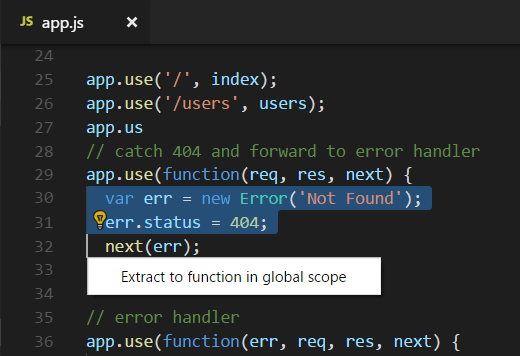
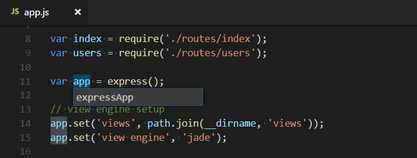

+++
title = "Refactoring"
date = 2024-01-12T22:36:24+08:00
weight = 40
type = "docs"
description = ""
isCJKLanguage = true
draft = false
+++

> 原文: [https://code.visualstudio.com/docs/editor/refactoring](https://code.visualstudio.com/docs/editor/refactoring)

# Refactoring 重构


[Source code refactoring](https://en.wikipedia.org/wiki/Code_refactoring) can improve the quality and maintainability of your project by restructuring your code while not modifying the runtime behavior. Visual Studio Code supports refactoring operations (refactorings) such as [Extract Method](https://refactoring.com/catalog/extractMethod.html) and [Extract Variable](https://refactoring.com/catalog/extractVariable.html) to improve your code base from within your editor.

​​	源代码重构可以通过在不修改运行时行为的情况下重构代码来提高项目的质量和可维护性。Visual Studio Code 支持重构操作（重构），例如提取方法和提取变量，以便从编辑器中改进代码库。



For example, a common refactoring used to avoid duplicating code (a maintenance headache) is the [Extract Method](https://refactoring.com/catalog/extractMethod.html) refactoring, where you select source code that you'd like to reuse elsewhere and pull it out into its own shared method.

​​	例如，为了避免重复代码（维护难题），常用的重构是提取方法重构，您可以在其中选择要重用在其他地方的源代码，并将其提取到其自己的共享方法中。

Refactorings are provided by a language service and VS Code has built-in support for TypeScript and JavaScript refactoring through the [TypeScript](https://www.typescriptlang.org/) language service. Refactoring support for other programming languages is provided through VS Code [extensions]() that contribute language services. The UI and commands for refactoring are the same across languages, and in this topic we'll demonstrate refactoring support with the TypeScript language service.

​​	重构由语言服务提供，VS Code 通过 TypeScript 语言服务内置了对 TypeScript 和 JavaScript 重构的支持。其他编程语言的重构支持通过提供语言服务的 VS Code 扩展提供。重构的 UI 和命令在所有语言中都是相同的，在本主题中，我们将演示使用 TypeScript 语言服务进行重构支持。

## [Code Actions = Quick Fixes and refactorings 代码操作 = 快速修复和重构]()

In VS Code, Code Actions can provide both refactorings and Quick Fixes for detected issues (highlighted with red squiggles). An available Code Action is announced by a lightbulb near the source code when the cursor is on a squiggle or selected text region. Clicking on the Code Action lightbulb or using the **Quick Fix** command Ctrl+. will display Quick Fixes and refactorings.

​​	在 VS Code 中，代码操作可以为检测到的问题（用红色波浪线突出显示）提供重构和快速修复。当光标位于波浪线或选定的文本区域上时，源代码附近的一个灯泡会通知您有可用的代码操作。单击代码操作灯泡或使用快速修复命令 Ctrl+. 将显示快速修复和重构。

If you'd just like to see refactorings without Quick Fixes, you can use the **Refactor** command (Ctrl+Shift+R).

​​	如果您只想查看不带快速修复的重构，可以使用重构命令 (Ctrl+Shift+R)。

> **Note:** If you prefer to not see the Code Action lightbulb in your editor, you can disable lightbulbs with the `editor.lightbulb.enable` [setting](). You can still open Quick Fixes through **Quick Fix** command and Ctrl+. keyboard shortcut.
>
> ​​	注意：如果您不想在编辑器中看到代码操作灯泡，可以使用 `editor.lightbulb.enable` 设置禁用灯泡。您仍然可以通过快速修复命令和 Ctrl+. 键盘快捷方式打开快速修复。

## [Refactoring actions 重构操作]()

### [Extract Method 提取方法]()

Select the source code you'd like to extract and then click on the lightbulb in the gutter or press (Ctrl+.) to see available refactorings. Source code fragments can be extracted into a new method, or into a new function at various different scopes. During the extract refactoring, you will be prompted to provide a meaningful name.

​​	选择要提取的源代码，然后单击边距中的灯泡或按 (Ctrl+.) 查看可用的重构。源代码片段可以提取到新方法中，也可以提取到不同范围的新函数中。在提取重构期间，系统会提示您提供一个有意义的名称。

### [Extract Variable 提取变量]()

TypeScript language service provides **Extract to const** refactoring to create a new local variable for the currently selected expression:

​​	TypeScript 语言服务提供提取到 const 重构，为当前选定的表达式创建一个新的局部变量：


When working with classes, you can also extract a value to a new property.

​​	在使用类时，您还可以将值提取到新属性中。

## [Rename symbol 重命名符号]()

Renaming is a common operation related to refactoring source code and VS Code has a separate **Rename Symbol** command (F2). Some languages support rename symbol across files. Press F2 and then type the new desired name and press Enter. All usages of the symbol will be renamed, across files.

​​	重命名是与重构源代码相关的常见操作，VS Code 有一个单独的重命名符号命令 (F2)。某些语言支持跨文件重命名符号。按 F2，然后键入新的所需名称并按 Enter。符号的所有用法都将重命名，跨文件。



## [Keybindings for Code Actions 代码操作的键绑定]()

The `editor.action.codeAction` command lets you configure keybindings for specific Code Actions. This keybinding, for example, triggers the **Extract function** refactoring Code Actions:

​​	 `editor.action.codeAction` 命令允许您为特定代码操作配置键绑定。例如，此键绑定触发提取函数重构代码操作：

```
{
  "key": "ctrl+shift+r ctrl+e",
  "command": "editor.action.codeAction",
  "args": {
    "kind": "refactor.extract.function"
  }
}
```

Code Action kinds are specified by extensions using the enhanced `CodeActionProvided` API. Kinds are hierarchical, so `"kind": "refactor"` will show all refactoring Code Actions, whereas `"kind": "refactor.extract.function"` will only show **Extract function** refactorings.

​​	代码操作种类由扩展使用增强的 `CodeActionProvided` API 指定。种类是分层的，因此 `"kind": "refactor"` 将显示所有重构代码操作，而 `"kind": "refactor.extract.function"` 将仅显示提取函数重构。

Using the above keybinding, if only a single `"refactor.extract.function"` Code Action is available, it will be automatically applied. If multiple **Extract function** Code Actions are available, we bring up a context menu to select them:

​​	使用上述键绑定，如果只有一个 `"refactor.extract.function"` 代码操作可用，它将自动应用。如果有多个提取函数代码操作可用，我们将弹出一个上下文菜单来选择它们：


You can also control how/when Code Actions are automatically applied using the `apply` argument:

​​	您还可以使用 `apply` 参数控制代码操作如何/何时自动应用：

```
{
  "key": "ctrl+shift+r ctrl+e",
  "command": "editor.action.codeAction",
  "args": {
    "kind": "refactor.extract.function",
    "apply": "first"
  }
}
```

Valid values for `"apply"`:

​​	 `"apply"` 的有效值：

- `"first"` - Always automatically apply the first available Code Action.
  `"first"` - 始终自动应用第一个可用的代码操作。
- `"ifSingle"` - Default. Automatically apply the Code Action if only one is available. Otherwise, show the context menu.
  `"ifSingle"` - 默认。如果只有一个可用，则自动应用代码操作。否则，显示上下文菜单。
- `"never"` - Always show the Code Action context menu, even if only a single Code Action is available.
  `"never"` - 始终显示代码操作上下文菜单，即使只有一个代码操作可用。

When a Code Action keybinding is configured with `"preferred": true`, only preferred Quick Fixes and refactorings are shown. A preferred Quick Fix addresses the underlying error, while a preferred refactoring is the most common refactoring choice. For example, while multiple `refactor.extract.constant` refactorings may exist, each extracting to a different scope in the file, the preferred `refactor.extract.constant` refactoring is the one that extracts to a local variable.

​​	当使用 `"preferred": true` 配置代码操作键绑定时，只会显示首选的快速修复和重构。首选的快速修复可解决基础错误，而首选的重构是最常见的重构选择。例如，虽然可能存在多个 `refactor.extract.constant` 重构，每个重构都提取到文件中的不同作用域，但首选的 `refactor.extract.constant` 重构是提取到局部变量。

This keybinding uses `"preferred": true` to create a refactoring that always tries to extract the selected source code to a constant in the local scope:

​​	此键绑定使用 `"preferred": true` 创建一个重构，该重构始终尝试将选定的源代码提取到局部作用域中的常量：

```
{
  "key": "shift+ctrl+e",
  "command": "editor.action.codeAction",
  "args": {
    "kind": "refactor.extract.constant",
    "preferred": true,
    "apply": "ifSingle"
  }
}
```

## [Extensions with refactorings 具有重构功能的扩展]()

You can find extensions that support refactoring by looking in the VS Code [Marketplace](https://marketplace.visualstudio.com/vscode). You can go to the Extensions view (Ctrl+Shift+X) and type 'refactor' in the search box. You can then sort by install count or ratings to see which extensions are popular.

​​	您可以在 VS Code Marketplace 中查找支持重构的扩展。您可以转到“扩展”视图 (Ctrl+Shift+X) 并搜索框中键入“重构”。然后，您可以按安装次数或评级排序，以查看哪些扩展很受欢迎。


Python

109.1M

ms-python


Language Support for Java(TM) by Red Hat
Red Hat 提供的 Java(TM) 语言支持

31.1M

redhat


GitHub Copilot

12.1M

GitHub


Tabnine: AI Autocomplete & Chat for Javascript, Python, Typescript, PHP, Go, Java & more
Tabnine：适用于 Javascript、Python、Typescript、PHP、Go、Java 等的 AI 自动补全和聊天

6.8M

TabNine

> Tip: The extensions shown above are dynamically queried. Click on an extension tile above to read the description and reviews to decide which extension is best for you.
>
> ​​	提示：上面显示的扩展名是动态查询的。单击上面的扩展名磁贴以阅读描述和评论，以决定哪个扩展名最适合您。

## [Next steps 后续步骤]()

- [Intro Video - Code Editing](https://code.visualstudio.com/docs/introvideos/codeediting) - Watch an introductory video on code editing features.
  简介视频 - 代码编辑 - 观看有关代码编辑功能的介绍性视频。
- [Code Navigation]() - VS Code lets you move quickly through your source code.
  代码导航 - VS Code 允许您快速浏览源代码。
- [Debugging]() - Learn about debugging with VS Code.
  调试 - 了解如何使用 VS Code 进行调试。

## [Common questions 常见问题]()

### [Why don't I see any lightbulbs when there are errors in my code? 为什么在我的代码中出现错误时看不到任何灯泡？]()

Lightbulbs (Code Actions) are only shown when your cursor hovers over the text showing the error. Hovering over the text will show the error description, but you need to move the cursor or select text to see lightbulbs for Quick Fixes and refactorings.

​​	只有当光标悬停在显示错误的文本上时，才会显示灯泡（代码操作）。将鼠标悬停在文本上将显示错误描述，但您需要移动光标或选择文本才能看到快速修复和重构的灯泡。
