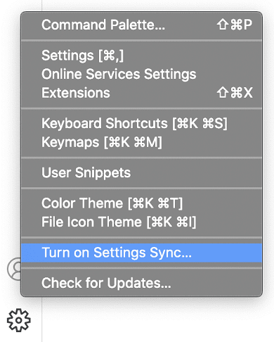
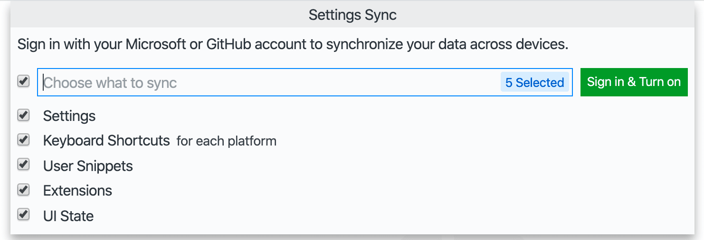

+++
title = "Settings Sync"
date = 2024-01-12T22:36:24+08:00
weight = 100
type = "docs"
description = ""
isCJKLanguage = true
draft = false
+++

> 原文: [https://code.visualstudio.com/docs/editor/settings-sync](https://code.visualstudio.com/docs/editor/settings-sync)

# Settings Sync 设置同步


Settings Sync lets you share your Visual Studio Code configurations such as settings, keybindings, and installed extensions across your machines so you are always working with your favorite setup.

​​	设置同步允许您在计算机之间共享 Visual Studio Code 配置，例如设置、键绑定和已安装的扩展，以便您始终使用您最喜欢的设置工作。

## [Turning on Settings Sync 启用设置同步]()

You can turn on Settings Sync using the **Turn On Settings Sync...** entry in the **Manage** gear menu at the bottom of the Activity Bar.

​​	您可以使用活动栏底部的“管理”齿轮菜单中的“启用设置同步...”条目来启用设置同步。



You will be asked to sign in and what preferences you would like to sync; currently Settings, Keyboard Shortcuts, Extensions, User Snippets, and UI State are supported.

​​	系统会要求您登录并询问您想要同步哪些首选项；当前支持设置、键盘快捷方式、扩展、用户代码段和 UI 状态。



Selecting the **Sign in & Turn on** button will ask you to choose between signing in with your Microsoft or GitHub account.

​​	选择“登录并启用”按钮将要求您选择使用 Microsoft 或 GitHub 帐户登录。


After making this selection, the browser will open so that you can sign in to your Microsoft or GitHub account. When a Microsoft account is chosen, you can use either personal accounts, such as Outlook accounts, or Azure accounts, and you can also link a GitHub account to a new or existing Microsoft account.

​​	进行此选择后，浏览器将打开，以便您可以登录到您的 Microsoft 或 GitHub 帐户。选择 Microsoft 帐户时，您可以使用个人帐户（例如 Outlook 帐户）或 Azure 帐户，您还可以将 GitHub 帐户链接到新的或现有的 Microsoft 帐户。

After signing in, Settings Sync will be turned on and continue to synchronize your preferences automatically in the background.

​​	登录后，设置同步将被启用，并将继续在后台自动同步您的首选项。

## [Merge or Replace 合并或替换]()

If you already synced from a machine and turning on sync from another machine, you will be shown with following **Merge or Replace** dialog.

​​	如果您已从一台机器同步并从另一台机器打开同步，您将看到以下“合并”或“替换”对话框。


- **Merge**: Selecting this option will merge **local** settings with **remote** settings from the cloud.
  合并：选择此选项将合并本地设置与云中的远程设置。
- **Replace Local**: Selecting this option will overwrite **local** settings with remote settings from the cloud.
  替换本地：选择此选项将用云中的远程设置覆盖本地设置。
- **Merge Manually...**: Selecting this option will open **Merges** view where you can merge preferences one by one.
  手动合并...：选择此选项将打开“合并”视图，您可以在其中逐个合并首选项。


## [Configuring synced data 配置同步数据]()

Machine settings (with `machine` or `machine-overridable` [scopes](https://code.visualstudio.com/updates/v1_34#_machinespecific-settings)) are not synchronized by default, since their values are specific to a given machine. You can also add or remove settings you want to this list from the Settings editor or using the setting `settingsSync.ignoredSettings`.

​​	机器设置（具有 `machine` 或 `machine-overridable` 作用域）默认情况下不会同步，因为它们的值特定于给定机器。您还可以从“设置”编辑器或使用设置 `settingsSync.ignoredSettings` 将您想要添加到此列表的设置添加或删除。


Keyboard Shortcuts are synchronized per platform by default. If your keyboard shortcuts are platform-agnostic, you can synchronize them across platforms by disabling the setting `settingsSync.keybindingsPerPlatform`.

​​	键盘快捷键默认情况下按平台同步。如果您的键盘快捷键与平台无关，您可以通过禁用设置 `settingsSync.keybindingsPerPlatform` 来跨平台同步它们。

All built-in and installed extensions are synchronized along with their global enablement state. You can skip synchronizing an extension, either from the Extensions view (Ctrl+Shift+X) or using the setting `settingsSync.ignoredExtensions`.

​​	所有内置和已安装的扩展连同它们的全局启用状态一起同步。您可以跳过同步扩展，无论是从“扩展”视图（Ctrl+Shift+X）还是使用设置 `settingsSync.ignoredExtensions` 。


Following UI State is synchronized currently:

​​	以下 UI 状态当前已同步：

- Display Language
  显示语言
- Activity Bar entries
  活动栏条目
- Panel entries
  面板条目
- Views layout and visibility
  视图布局和可见性
- Recently used commands
  最近使用的命令
- Do not show again notifications
  不再显示通知

You can always change what is synced via the **Settings Sync: Configure** command or by opening the **Manage** gear menu, selecting **Settings Sync is On**, and then **Settings Sync: Configure**.

​​	您可以随时通过“设置同步：配置”命令或通过打开“管理”齿轮菜单，选择“设置同步已启用”，然后选择“设置同步：配置”来更改同步的内容。

## [Conflicts 冲突]()

When synchronizing settings between multiple machines, there may occasionally be conflicts. Conflicts can happen when first setting up sync between machines or when settings change while a machine is offline. When conflicts occur, you will be presented with the following options:

​​	在多台机器之间同步设置时，偶尔可能会发生冲突。冲突可能发生在首次在机器之间设置同步时，或在机器处于脱机状态时设置更改时。发生冲突时，将显示以下选项：

- **Accept Local**: Selecting this option will overwrite **remote** settings in the cloud with your local settings.
  接受本地：选择此选项将用您的本地设置覆盖云中的远程设置。
- **Accept Remote**: Selecting this option will overwrite **local** settings with remote settings from the cloud.
  接受远程：选择此选项将用云中的远程设置覆盖本地设置。
- **Show Conflicts**: Selecting this will display a diff editor similar to the Source Control diff editor, where you can preview the local and remote settings and choose to either accept local or remote or manually resolve the changes in your local settings file and then accept the local file.
  显示冲突：选择此选项将显示一个类似于源代码管理 diff 编辑器的 diff 编辑器，您可以在其中预览本地和远程设置，并选择接受本地或远程设置，或手动解决本地设置文件中的更改，然后接受本地文件。

## [Switching Accounts 切换帐户]()

If at any time you want to sync your data to a different account, you can turn off and turn on Settings Sync again with different account.

​​	如果您想随时将数据同步到其他帐户，您可以关闭并再次打开设置同步，使用不同的帐户。

## [Syncing Stable versus Insiders 同步稳定版与内部版本]()

By default, the VS Code Stable and [Insiders](https://code.visualstudio.com/insiders) builds use different Settings Sync services, and therefore do not share settings. You can sync your Insiders with Stable by selecting the Stable sync service while turning on Settings Sync. This option is only available in VS Code Insiders.

​​	默认情况下，VS Code 稳定版和内部版本使用不同的设置同步服务，因此不会共享设置。您可以通过在打开设置同步时选择稳定同步服务来将内部版本与稳定版本同步。此选项仅在 VS Code 内部版本中可用。


**Note:** Since Insiders builds are newer than Stable builds, syncing them can sometimes lead to data incompatibility. In such cases, Settings sync will be disabled automatically on stable to prevent data inconsistencies. Once newer version of Stable build is released, you can upgrade your stable client and turn on sync to continue syncing.

​​	注意：由于内部版本比稳定版本更新，因此同步它们有时会导致数据不兼容。在这种情况下，设置同步将在稳定版本上自动禁用，以防止数据不一致。一旦发布了较新版本的稳定版本，您就可以升级您的稳定客户端并打开同步以继续同步。

## [Restoring data 恢复数据]()

VS Code always stores local and remote backups of your preferences while syncing and provides views for accessing these. In case something goes wrong, you can restore your data from these views.

​​	VS Code 在同步时始终存储首选项的本地和远程备份，并提供用于访问这些备份的视图。如果出现问题，您可以从这些视图中恢复数据。


You can open these views using **Settings Sync: Show Synced Data** command from the Command Palette. The Local Sync activity view is hidden by default and you can enable it using **Views** submenu under **Settings Sync** view overflow actions.

​​	您可以使用“设置同步：显示同步数据”命令从命令面板中打开这些视图。默认情况下，本地同步活动视图处于隐藏状态，您可以使用“设置同步”视图溢出操作下的“视图”子菜单启用它。


Local backups folder in the disk can be accessed via the **Settings Sync: Open Local Backups Folder** command. The folder is organized by the type of preference and contains versions of your JSON files, named with a timestamp of when the backup occurred.

​​	可以通过“设置同步：打开本地备份文件夹”命令访问磁盘中的本地备份文件夹。该文件夹按首选项类型组织，并包含 JSON 文件的版本，这些版本的文件名带有备份发生时的时间戳。

> **Note**: Local backups are automatically deleted after 30 days. For remote backups the latest 20 versions of each individual resource (settings, extensions, etc.) is retained.
>
> ​​	注意：本地备份会在 30 天后自动删除。对于远程备份，将保留每个单独资源（设置、扩展等）的最新 20 个版本。

## [Synced Machines 已同步的计算机]()

VS Code keeps track of the machines synchronizing your preferences and provides a view to access them. Every machine is given a default name based on the type of VS Code (Insiders or Stable) and the platform it is on. You can always update the machine name using the edit action available on the machine entry in the view. You can also disable sync on another machine using **Turn off Settings Sync** context menu action on the machine entry in the view.

​​	VS Code 会跟踪同步首选项的计算机，并提供一个视图来访问它们。每个计算机都会根据 VS Code 的类型（内部版本或稳定版本）及其所在的平台获得一个默认名称。您始终可以使用视图中计算机条目上可用的编辑操作来更新计算机名称。您还可以使用视图中计算机条目上的“关闭设置同步”上下文菜单操作在另一台计算机上禁用同步。


You can open this view using **Settings Sync: Show Synced Data** command from the Command Palette.

​​	您可以使用“设置同步：显示同步数据”命令从命令面板中打开此视图。

## [Extension authors 扩展作者]()

If you are an extension author, you should make sure your extension behaves appropriately when users enable Setting Sync. For example, you probably don't want your extension to display the same dismissed notifications or welcome pages on multiple machines.

​​	如果您是扩展作者，则应确保在用户启用设置同步时您的扩展行为得当。例如，您可能不希望您的扩展在多台机器上显示相同的已关闭通知或欢迎页面。

### [Sync user global state between machines 在机器之间同步用户全局状态]()

If your extension needs to preserve some user state across different machines then provide the state to Settings Sync using `vscode.ExtensionContext.globalState.setKeysForSync`. Sharing state such as UI dismissed or viewed flags across machines can provide a better user experience.

​​	如果您的扩展需要在不同机器之间保留某些用户状态，那么请使用 `vscode.ExtensionContext.globalState.setKeysForSync` 向设置同步提供该状态。在机器之间共享诸如已关闭或已查看的 UI 标志等状态可以提供更好的用户体验。

There is an example of using `setKeysforSync` in the [Extension Capabilities](https://code.visualstudio.com/api/extension-capabilities/common-capabilities#_data-storage) topic.

​​	扩展功能主题中有一个使用 `setKeysforSync` 的示例。

## [Reporting issues 报告问题]()

Settings Sync activity can be monitored in the **Log (Settings Sync)** output view. If you experience a problem with Settings Sync, include this log when creating the issue. If your problem is related to authentication, also include the log from the **Account** output view.

​​	可以在日志（设置同步）输出视图中监视设置同步活动。如果您遇到设置同步问题，请在创建问题时包含此日志。如果您的问题与身份验证相关，还应包含来自帐户输出视图的日志。

## [How do I delete my data? 如何删除我的数据？]()

If you want to remove all your data from our servers, just turn off sync via **Settings Sync is On** menu available under **Manage** gear menu and select the checkbox to clear all cloud data. If you choose to re-enable sync, it will be as if you're signing in for the first time.

​​	如果您想从我们的服务器中删除所有数据，只需通过“设置”中的“同步已开启”菜单关闭同步，并选择复选框以清除所有云数据。如果您选择重新启用同步，则就像您是首次登录一样。

## [Next steps 后续步骤]()

- [User and Workspace settings]() - Learn how to configure VS Code to your preferences through user and workspace settings.
  用户和工作区设置 - 了解如何通过用户和工作区设置将 VS Code 配置为您的首选项。

## [Common questions 常见问题]()

### [Is VS Code Settings Sync the same as the Settings Sync extension? VS Code 设置同步是否与设置同步扩展相同？]()

No, the [Settings Sync](https://marketplace.visualstudio.com/items?itemName=Shan.code-settings-sync) extension by [Shan Khan](https://marketplace.visualstudio.com/publishers/Shan) uses a private Gist on GitHub to share your VS Code settings across different machines and is unrelated to the VS Code Settings Sync.

​​	否，Shan Khan 的设置同步扩展使用 GitHub 上的私有 Gist 在不同的计算机上共享您的 VS Code 设置，并且与 VS Code 设置同步无关。

### [What types of accounts can I use for Settings Sync sign in? 我可以使用哪些类型的帐户登录设置同步？]()

VS Code Settings Sync supports signing in with either a Microsoft account (for example Outlook or Azure accounts) or a GitHub account. Sign in with GitHub Enterprise accounts is not supported. Other authentication providers may be supported in the future and you can review the proposed Authentication Provider API in [issue #88309](https://github.com/microsoft/vscode/issues/88309).

​​	VS Code 设置同步支持使用 Microsoft 帐户（例如 Outlook 或 Azure 帐户）或 GitHub 帐户登录。不支持使用 GitHub Enterprise 帐户登录。未来可能会支持其他身份验证提供程序，您可以在问题 #88309 中查看提议的身份验证提供程序 API。

> **Note**: VS Code Settings Sync does not support using your [Microsoft Sovereign Cloud](https://www.microsoft.com/en-us/industry/sovereignty/cloud) account at this time. If this is something you would like, please let us know what kind of Microsoft Sovereign Cloud you would like to use [in this GitHub issue](https://github.com/microsoft/vscode/issues/196509).
>
> ​​	注意：目前 VS Code 设置同步不支持使用您的 Microsoft Sovereign Cloud 帐户。如果您有此需求，请在此 GitHub 问题中告知我们您希望使用哪种 Microsoft Sovereign Cloud。

### [Can I use a different backend or service for Settings Sync? 我可以为设置同步使用其他后端或服务吗？]()

Settings Sync uses a dedicated service to store settings and coordinate updates. A service provider API may be exposed in the future to allow for custom Settings Sync backends.

​​	设置同步使用专用服务来存储设置并协调更新。将来可能会公开服务提供商 API，以允许自定义设置同步后端。

## [Troubleshooting keychain issues 故障排除钥匙串问题]()

> **Note**: This section applies to VS Code version **1.80 and higher**. In 1.80, we moved away from [keytar](https://github.com/atom/node-keytar), due to its archival, in favor of Electron's [safeStorage API](https://www.electronjs.org/docs/latest/api/safe-storage).
>
> ​​	注意：本节适用于 VS Code 1.80 及更高版本。在 1.80 中，我们放弃了 keytar，原因是它已归档，转而支持 Electron 的 safeStorage API。

> **Note**: keychain, keyring, wallet, credential store are synonymous in this document.
>
> ​​	注意：钥匙串、钥匙环、钱包、凭据存储在本文件中同义。

Settings Sync persists authentication information on desktop using the OS keychain for encryption. Using the keychain can fail in some cases if the keychain is misconfigured or the environment isn't recognized.

​​	设置同步使用操作系统钥匙串进行加密，在桌面上保留身份验证信息。如果钥匙串配置错误或环境无法识别，则在某些情况下使用钥匙串可能会失败。

To help diagnose the problem, you can restart VS Code with the following flags to generate a verbose log:

​​	为了帮助诊断问题，您可以使用以下标志重新启动 VS Code 以生成详细日志：

```
code --verbose --vmodule="*/components/os_crypt/*=1"
```

### [Windows & macOS Windows 和 macOS]()

At this time, there are no known configuration issues on Windows or macOS but, if you suspect something is wrong, you can open an [issue on VS Code](https://github.com/microsoft/vscode/issues/new/choose) with the verbose logs from above. This is important for us to support additional desktop configurations.

​​	目前，Windows 或 macOS 上没有已知配置问题，但如果您怀疑有错误，可以使用上面的详细日志在 VS Code 中打开一个问题。这对于我们支持其他桌面配置非常重要。

### [Linux]()

Towards the top of the logs from the previous command, you will see something to the effect of:

​​	在先前命令的日志顶部，您将看到类似以下内容：

```
[9699:0626/093542.027629:VERBOSE1:key_storage_util_linux.cc(54)] Password storage detected desktop environment: GNOME
[9699:0626/093542.027660:VERBOSE1:key_storage_linux.cc(122)] Selected backend for OSCrypt: GNOME_ANY
```

We rely on Chromium's oscrypt module to discover and store encryption key information in the keyring. Chromium supports [a number of different desktop environments](https://source.chromium.org/chromium/chromium/src/+/main:base/nix/xdg_util.cc;l=146-169). Outlined below are some popular desktop environments and troubleshooting steps that may help if the keyring is misconfigured.

​​	我们依靠 Chromium 的 oscrypt 模块来发现和存储钥匙串中的加密密钥信息。Chromium 支持许多不同的桌面环境。下面概述了一些流行的桌面环境和故障排除步骤，如果钥匙串配置错误，这些步骤可能会有所帮助。

#### [GNOME or UNITY (or similar) GNOME 或 UNITY（或类似环境）]()

If the error you're seeing is "Cannot create an item in a locked collection", chances are your keyring's `Login` keyring is locked. You should launch your OS's keyring ([Seahorse](https://wiki.gnome.org/Apps/Seahorse) is the commonly used GUI for seeing keyrings) and ensure the default keyring (usually referred to as `Login` keyring) is unlocked. This keyring needs to be unlocked when you log into your system.

​​	如果您看到错误“无法在已锁定的集合中创建项目”，则您的钥匙串的 `Login` 钥匙串很可能已锁定。您应该启动操作系统的钥匙串（Seahorse 是用于查看钥匙串的常用 GUI），并确保默认钥匙串（通常称为 `Login` 钥匙串）已解锁。当您登录系统时，需要解锁此钥匙串。

#### [KDE]()

> KDE 6 is not yet fully supported by Visual Studio Code. As a workaround: The latest kwallet6 is also accessible as kwallet5, so you can force it to use kwallet5 by setting the password store to `kwallet5` as explained below in [Configure the keyring to use with VS Code]().
>
> ​​	Visual Studio Code 尚不支持 KDE 6。作为解决方法：最新的 kwallet6 也可作为 kwallet5 访问，因此您可以通过将密码存储设置为 `kwallet5` 来强制使用 kwallet5，如下文在“配置与 VS Code 配合使用的钥匙串”中所述。

It's possible that your wallet (aka keyring) is closed. If you open [KWalletManager](https://apps.kde.org/kwalletmanager5), you can see if the default `kdewallet` is closed and if it is, make sure you open it.

​​	您的钱包（又称钥匙串）可能已关闭。如果您打开 KWalletManager，您可以查看默认的 `kdewallet` 是否已关闭，如果是，请务必将其打开。

If you are using KDE5 or higher and are having trouble connecting to `kwallet5` (like users of the unofficial VS Code Flatpak in [issue #189672](https://github.com/microsoft/vscode/issues/189672)), you can try [configuring the keyring]() to `gnome-libsecret` as this will use the [Secret Service API](https://www.gnu.org/software/emacs/manual/html_node/auth/Secret-Service-API.html) to communicate with any valid keyring. `kwallet5` implements the Secret Service API and can be accessed using this method.

​​	如果您使用的是 KDE5 或更高版本，并且在连接到 `kwallet5` 时遇到问题（例如问题 #189672 中非官方 VS Code Flatpak 的用户），您可以尝试将钥匙串配置为 `gnome-libsecret` ，因为这将使用 Secret Service API 与任何有效的钥匙串进行通信。 `kwallet5` 实现 Secret Service API，可以使用此方法访问。

#### [Other Linux desktop environments 其他 Linux 桌面环境]()

First off, if your desktop environment wasn't detected, you can [open an issue on VS Code](https://github.com/microsoft/vscode/issues/new/choose) with the verbose logs from above. This is important for us to support additional desktop configurations.

​​	首先，如果未检测到您的桌面环境，您可以在 VS Code 中打开一个问题，其中包含上述详细日志。这对于我们支持其他桌面配置非常重要。

#### [(recommended) Configure the keyring to use with VS Code （推荐）配置与 VS Code 配合使用的钥匙串]()

You can manually tell VS Code which keyring to use by passing the `password-store` flag. Our recommended configuration is to first install [gnome-keyring](https://wiki.gnome.org/Projects/GnomeKeyring) if you don't have it already and then launch VS Code with `code --password-store="gnome"`.

​​	您可以通过传递 `password-store` 标志手动告诉 VS Code 使用哪个密钥环。我们的推荐配置是，如果您还没有安装 gnome-keyring，请先安装它，然后使用 `code --password-store="gnome"` 启动 VS Code。

If this solution works for you, you can persist the value of `password-store` by opening the Command Palette (Ctrl+Shift+P) and running the **Preferences: Configure Runtime Arguments** command. This will open the `argv.json` file where you can add the setting `"password-store":"gnome"`.

​​	如果此解决方案对您有效，您可以通过打开命令面板 (Ctrl+Shift+P) 并运行首选项: 配置运行时参数命令来保留 `password-store` 的值。这将打开 `argv.json` 文件，您可以在其中添加设置 `"password-store":"gnome"` 。

Here are all the possible values of `password-store` if you would like to try using a different keyring than `gnome-keyring`:

​​	如果您想尝试使用 `gnome-keyring` 以外的密钥环，以下是 `password-store` 的所有可能值：

- `kwallet5`: For use with [kwalletmanager5](https://apps.kde.org/kwalletmanager5/).
  `kwallet5` ：用于 kwalletmanager5。
- `gnome`: This option will first try the `gnome-libsecret` option implementation and then if that fails, it will fallback to the `gnome-keyring` option implementation.
  `gnome` ：此选项将首先尝试 `gnome-libsecret` 选项实现，然后如果失败，它将回退到 `gnome-keyring` 选项实现。
- `gnome-libsecret`: For use with any package that implements the [Secret Service API](https://www.gnu.org/software/emacs/manual/html_node/auth/Secret-Service-API.html) (for example `gnome-keyring`, `kwallet5`, `KeepassXC`).
  `gnome-libsecret` ：用于实现 Secret Service API 的任何软件包（例如 `gnome-keyring` 、 `kwallet5` 、 `KeepassXC` ）。
- *(not recommended)* `kwallet`: For use with older versions of `kwallet`.
  （不推荐） `kwallet` ：用于较旧版本的 `kwallet` 。
- *(not recommended)* `gnome-keyring`: A different implementation to access `gnome-keyring` and should only be used if `gnome-libsecret` has a problem.
  （不推荐） `gnome-keyring` ：访问 `gnome-keyring` 的另一种实现，仅在 `gnome-libsecret` 有问题时才应使用。
- *(not recommended)* `basic`: See the [section below on basic text]() for more details.
  （不推荐） `basic` ：有关更多详细信息，请参阅下面有关基本文本的部分。

Don't hesitate to [open an issue on VS Code](https://github.com/microsoft/vscode/issues/new/choose) with the verbose logs if you run into any issues.

​​	如果您遇到任何问题，请毫不犹豫地打开 VS Code 中的问题，并附上详细日志。

#### [(not recommended) Configure basic text encryption （不推荐）配置基本文本加密]()

We rely on Chromium's oscrypt module to discover and store encryption key information in the keyring. Chromium offers an opt-in fallback encryption strategy that uses an in-memory key based on a string that is hardcoded in the Chromium source. Because of this, this fallback strategy is, at best, obfuscation, and should only be used if you are accepting of the risk that any process on the system could, in theory, decrypt your stored secrets.

​​	我们依靠 Chromium 的 oscrypt 模块来发现和存储钥匙串中的加密密钥信息。Chromium 提供了一个选择加入的备用加密策略，该策略使用基于硬编码在 Chromium 源代码中的字符串的内存中密钥。因此，这种备用策略充其量只是混淆，并且仅当您接受系统上的任何进程在理论上都可以解密您的存储秘密的风险时才应使用它。

If you accept this risk, you can set `password-store` to `basic` by opening the Command Palette (Ctrl+Shift+P) and running the **Preferences: Configure Runtime Arguments** command. This will open the `argv.json` file where you can add the setting `"password-store":"basic"`.

​​	如果您接受此风险，可以通过打开命令面板 (Ctrl+Shift+P) 并运行首选项：配置运行时参数命令，将 `password-store` 设置为 `basic` 。这将打开 `argv.json` 文件，您可以在其中添加设置 `"password-store":"basic"` 。

## [Can I share settings between VS Code Stable and Insiders? 我可以在 VS Code 稳定版和 Insiders 之间共享设置吗？]()

Yes. Please refer to the [Syncing Stable versus Insiders]() section for more information.

​​	可以。有关更多信息，请参阅同步稳定版与 Insiders 部分。

Please note that this can sometimes lead to data incompatibility because Insiders builds are newer than Stable builds. In such cases, Settings Sync will be disabled automatically on Stable to prevent data inconsistencies. Once a newer version of the Stable build is released, you can upgrade your client and turn on Settings Sync to continue syncing.

​​	请注意，有时这会导致数据不兼容，因为 Insiders 版本比稳定版本更新。在这种情况下，设置同步将在稳定版本上自动禁用，以防止数据不一致。一旦发布了稳定版本的新版本，您就可以升级客户端并打开设置同步以继续同步。
