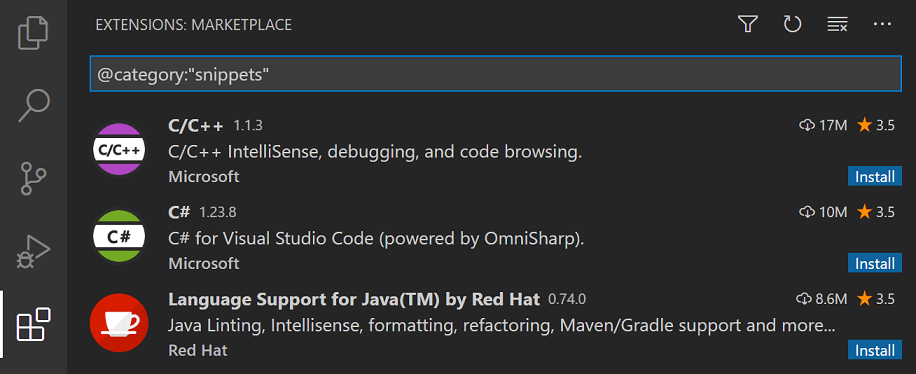
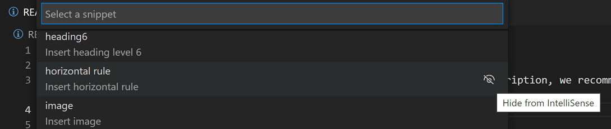

+++
title = "Snippets"
date = 2024-01-12T22:36:24+08:00
weight = 110
type = "docs"
description = ""
isCJKLanguage = true
draft = false
+++

> 原文: [https://code.visualstudio.com/docs/editor/userdefinedsnippets](https://code.visualstudio.com/docs/editor/userdefinedsnippets)

# Snippets in Visual Studio Code Visual Studio Code 中的代码片段


Code snippets are templates that make it easier to enter repeating code patterns, such as loops or conditional-statements.

​​	代码片段是模板，可让您更轻松地输入重复的代码模式，例如循环或条件语句。

In Visual Studio Code, snippets appear in IntelliSense (Ctrl+Space) mixed with other suggestions, as well as in a dedicated snippet picker (**Insert Snippet** in the Command Palette). There is also support for tab-completion: Enable it with `"editor.tabCompletion": "on"`, type a **snippet prefix** (trigger text), and press Tab to insert a snippet.

​​	在 Visual Studio Code 中，代码片段会与其他建议混合出现在 IntelliSense（Ctrl+空格）中，也会出现在专用代码片段选取器（在命令面板中插入代码片段）中。还支持制表符补全：使用 `"editor.tabCompletion": "on"` 启用它，键入代码片段前缀（触发文本），然后按 Tab 键插入代码片段。

The snippet syntax follows the [TextMate snippet syntax](https://manual.macromates.com/en/snippets) with the exceptions of 'interpolated shell code' and the use of `\u`; both are not supported.

​​	代码片段语法遵循 TextMate 代码片段语法，但例外情况是“内插的 shell 代码”和 `\u` 的使用；两者均不受支持。


## [Built-in snippets 内置代码片段](https://code.visualstudio.com/docs/editor/userdefinedsnippets#_builtin-snippets)

VS Code has built-in snippets for a number of languages such as: JavaScript, TypeScript, Markdown, and PHP.

​​	VS Code 为多种语言内置了代码片段，例如：JavaScript、TypeScript、Markdown 和 PHP。


You can see the available snippets for a language by running the **Insert Snippet** command in the Command Palette to get a list of the snippets for the language of the current file. However, keep in mind that this list also includes user snippets that you have defined, and any snippets provided by extensions you have installed.

​​	您可以通过在命令面板中运行“插入代码片段”命令来查看适用于某种语言的可用代码片段，以获取当前文件语言的代码片段列表。但是，请记住，此列表还包括您已定义的用户代码片段，以及您已安装的扩展提供的任何代码片段。

## [Install snippets from the Marketplace 从 Marketplace 安装代码片段](https://code.visualstudio.com/docs/editor/userdefinedsnippets#_install-snippets-from-the-marketplace)

Many [extensions](https://code.visualstudio.com/docs/editor/extension-marketplace) on the [VS Code Marketplace](https://marketplace.visualstudio.com/vscode) include snippets. You can search for extensions that contains snippets in the Extensions view (Ctrl+Shift+X) using the `@category:"snippets"` filter.

​​	VS Code Marketplace 上的许多扩展都包含代码段。您可以使用 `@category:"snippets"` 筛选器在扩展视图（Ctrl+Shift+X）中搜索包含代码段的扩展。



If you find an extension you want to use, install it, then restart VS Code and the new snippets will be available.

​​	如果您找到想要使用的扩展，请安装它，然后重新启动 VS Code，新的代码段将可用。

## [Create your own snippets 创建您自己的代码段](https://code.visualstudio.com/docs/editor/userdefinedsnippets#_create-your-own-snippets)

You can easily define your own snippets without any extension. To create or edit your own snippets, select **Configure User Snippets** under **File** > **Preferences**, and then select the language (by [language identifier](https://code.visualstudio.com/docs/languages/identifiers)) for which the snippets should appear, or the **New Global Snippets file** option if they should appear for all languages. VS Code manages the creation and refreshing of the underlying snippets file(s) for you.

​​	您可以在没有任何扩展的情况下轻松定义自己的代码段。若要创建或编辑您自己的代码段，请选择“文件”>“首选项”下的“配置用户代码段”，然后选择代码段应显示的语言（按语言标识符），或者选择“新建全局代码段”文件选项（如果它们应显示所有语言）。VS Code 会为您管理基础代码段文件(s) 的创建和刷新。


Snippets files are written in JSON, support C-style comments, and can define an unlimited number of snippets. Snippets support most TextMate syntax for dynamic behavior, intelligently format whitespace based on the insertion context, and allow easy multiline editing.

​​	代码段文件以 JSON 编写，支持 C 样式注释，并且可以定义无限数量的代码段。代码段支持大多数 TextMate 语法以实现动态行为，根据插入上下文智能地设置空格格式，并允许轻松进行多行编辑。

Below is an example of a `for` loop snippet for JavaScript:

​​	下面是 JavaScript 的 `for` 循环代码段示例：

```
// in file 'Code/User/snippets/javascript.json'
{
  "For Loop": {
    "prefix": ["for", "for-const"],
    "body": ["for (const ${2:element} of ${1:array}) {", "\t$0", "}"],
    "description": "A for loop."
  }
}
```

In the example above:

​​	在上面的示例中：

- "For Loop" is the snippet name. It is displayed via IntelliSense if no `description` is provided.
  “For Loop”是代码段名称。如果没有提供 `description` ，则通过 IntelliSense 显示它。
- `prefix` defines one or more trigger words that display the snippet in IntelliSense. Substring matching is performed on prefixes, so in this case, "fc" could match "for-const".
  `prefix` 定义一个或多个触发词，在 IntelliSense 中显示代码段。子字符串匹配在词缀上执行，因此在这种情况下，“fc”可以匹配“for-const”。
- `body` is one or more lines of content, which will be joined as multiple lines upon insertion. Newlines and embedded tabs will be formatted according to the context in which the snippet is inserted.
  `body` 是一个或多行内容，插入后将作为多行内容加入。换行符和嵌入式制表符将根据插入代码段的上下文进行格式化。
- `description` is an optional description of the snippet displayed by IntelliSense.
  `description` 是 IntelliSense 显示的代码段的可选说明。

Additionally, the `body` of the example above has three placeholders (listed in order of traversal): `${1:array}`, `${2:element}`, and `$0`. You can quickly jump to the next placeholder with Tab, at which point you may edit the placeholder or jump to the next one. The string after the colon `:` (if any) is the default text, for example `element` in `${2:element}`. Placeholder traversal order is ascending by number, starting from one; zero is an optional special case that always comes last, and exits snippet mode with the cursor at the specified position.

​​	此外，上面的示例的 `body` 有三个占位符（按遍历顺序列出）： `${1:array}` 、 `${2:element}` 和 `$0` 。您可以使用 Tab 键快速跳转到下一个占位符，此时您可以编辑占位符或跳转到下一个占位符。冒号 `:` 后面的字符串（如果有）是默认文本，例如 `${2:element}` 中的 `element` 。占位符遍历顺序按数字升序排列，从一开头；零是一个可选的特例，它始终排在最后，并使用光标在指定位置退出代码段模式。

### [File template snippets 文件模板代码段](https://code.visualstudio.com/docs/editor/userdefinedsnippets#_file-template-snippets)

You can add the `isFileTemplate` attribute to your snippet's definition if the snippet is intended to populate or replace a file's contents. File template snippets are displayed in a dropdown when you run the **Snippets: Populate File from Snippet** command in a new or existing file.

​​	如果代码段旨在填充或替换文件的内容，则可以将 `isFileTemplate` 属性添加到代码段的定义中。在新建或现有文件中运行“代码段：从代码段填充文件”命令时，文件模板代码段会显示在下拉列表中。

## [Snippet scope 代码段范围](https://code.visualstudio.com/docs/editor/userdefinedsnippets#_snippet-scope)

Snippets are scoped so that only relevant snippets are suggested. Snippets can be scoped by either:

​​	代码段具有范围，以便仅建议相关代码段。代码段可以通过以下方式之一进行范围限定：

1. the **language(s)** to which snippets are scoped (possibly all)
   代码段的范围语言（可能全部）
2. the **project(s)** to which snippets are scoped (probably all)
   代码段的范围项目（可能全部）

### [Language snippet scope 语言代码段范围](https://code.visualstudio.com/docs/editor/userdefinedsnippets#_language-snippet-scope)

Every snippet is scoped to one, several, or all ("global") languages based on whether it is defined in:

​​	根据代码段是在以下位置定义的，每个代码段的范围都是一种、多种或全部（“全局”）语言：

1. a **language** snippet file
   语言代码段文件
2. a **global** snippet file
   全局代码段文件

Single-language user-defined snippets are defined in a specific language's snippet file (for example `javascript.json`), which you can access by language identifier through **Snippets: Configure User Snippets**. A snippet is only accessible when editing the language for which it is defined.

​​	单语言用户定义代码段是在特定语言的代码段文件中定义的（例如 `javascript.json` ），可以通过“代码段：配置用户代码段”通过语言标识符访问该文件。仅在编辑为其定义了代码段的语言时才能访问该代码段。

Multi-language and global user-defined snippets are all defined in "global" snippet files (JSON with the file suffix `.code-snippets`), which is also accessible through **Snippets: Configure User Snippets**. In a global snippets file, a snippet definition may have an additional `scope` property that takes one or more [language identifiers](https://code.visualstudio.com/docs/languages/identifiers), which makes the snippet available only for those specified languages. If no `scope` property is given, then the global snippet is available in **all** languages.

​​	多语言和全局用户定义代码段均在“全局”代码段文件中定义（具有文件后缀 `.code-snippets` 的 JSON），也可以通过代码段：配置用户代码段进行访问。在全局代码段文件中，代码段定义可能具有一个或多个语言标识符的附加 `scope` 属性，这使得代码段仅对那些指定的语言可用。如果没有给出 `scope` 属性，则全局代码段在所有语言中都可用。

Most user-defined snippets are scoped to a single language, and so are defined in a language-specific snippet file.

​​	大多数用户定义的代码段都限定为一种语言，因此在特定于语言的代码段文件中定义。

### [Project snippet scope 项目代码段范围](https://code.visualstudio.com/docs/editor/userdefinedsnippets#_project-snippet-scope)

You can also have a global snippets file (JSON with file suffix `.code-snippets`) scoped to your project. Project-folder snippets are created with the **New Snippets file for ''...** option in the **Snippets: Configure User Snippets** dropdown menu and are located at the root of the project in a `.vscode` folder. Project snippet files are useful for sharing snippets with all users working in that project. Project-folder snippets are similar to global snippets and can be scoped to specific languages through the `scope` property.

​​	您还可以将全局代码段文件（具有文件后缀 `.code-snippets` 的 JSON）限定为您的项目。项目文件夹代码段使用代码段：配置用户代码段下拉菜单中的新建代码段文件''...选项创建，并位于项目的根目录中的 `.vscode` 文件夹中。项目代码段文件对于与在该项目中工作的用户共享代码段非常有用。项目文件夹代码段类似于全局代码段，并且可以通过 `scope` 属性限定为特定语言。

## [Snippet syntax 代码段语法](https://code.visualstudio.com/docs/editor/userdefinedsnippets#_snippet-syntax)

The `body` of a snippet can use special constructs to control cursors and the text being inserted. The following are supported features and their syntaxes:

​​	片段的 `body` 可以使用特殊结构来控制光标和正在插入的文本。以下是一些支持的功能及其语法：

### [Tabstops 制表符](https://code.visualstudio.com/docs/editor/userdefinedsnippets#_tabstops)

With tabstops, you can make the editor cursor move inside a snippet. Use `$1`, `$2` to specify cursor locations. The number is the order in which tabstops will be visited, whereas `$0` denotes the final cursor position. Multiple occurrences of the same tabstop are linked and updated in sync.

​​	使用制表符，您可以使编辑器光标在片段中移动。使用 `$1` 、 `$2` 来指定光标位置。数字是访问制表符的顺序，而 `$0` 表示最终光标位置。相同制表符的多次出现会链接并同步更新。

### [Placeholders 占位符](https://code.visualstudio.com/docs/editor/userdefinedsnippets#_placeholders)

Placeholders are tabstops with values, like `${1:foo}`. The placeholder text will be inserted and selected such that it can be easily changed. Placeholders can be nested, like `${1:another ${2:placeholder}}`.

​​	占位符是带有值的制表符，例如 `${1:foo}` 。占位符文本将被插入并选中，以便于更改。占位符可以嵌套，例如 `${1:another ${2:placeholder}}` 。

### [Choice 选择](https://code.visualstudio.com/docs/editor/userdefinedsnippets#_choice)

Placeholders can have choices as values. The syntax is a comma-separated enumeration of values, enclosed with the pipe-character, for example `${1|one,two,three|}`. When the snippet is inserted and the placeholder selected, choices will prompt the user to pick one of the values.

​​	占位符可以将选择作为值。语法是用竖线字符括起来的逗号分隔的值枚举，例如 `${1|one,two,three|}` 。当插入片段并选择占位符时，选择会提示用户选择其中一个值。

### [Variables 变量](https://code.visualstudio.com/docs/editor/userdefinedsnippets#_variables)

With `$name` or `${name:default}`, you can insert the value of a variable. When a variable isn't set, its **default** or the empty string is inserted. When a variable is unknown (that is, its name isn't defined) the name of the variable is inserted and it is transformed into a placeholder.

​​	使用 `$name` 或 `${name:default}` ，您可以插入变量的值。当变量未设置时，将插入其默认值或空字符串。当变量未知（即其名称未定义）时，将插入变量的名称，并将其转换为占位符。

The following variables can be used:

​​	可以使用以下变量：

- `TM_SELECTED_TEXT` The currently selected text or the empty string
  `TM_SELECTED_TEXT` 当前选定的文本或空字符串
- `TM_CURRENT_LINE` The contents of the current line
  `TM_CURRENT_LINE` 当前行的内容
- `TM_CURRENT_WORD` The contents of the word under cursor or the empty string
  `TM_CURRENT_WORD` 光标下单词的内容或空字符串
- `TM_LINE_INDEX` The zero-index based line number
  `TM_LINE_INDEX` 从零开始的行号
- `TM_LINE_NUMBER` The one-index based line number
  `TM_LINE_NUMBER` 从一开始的行号
- `TM_FILENAME` The filename of the current document
  `TM_FILENAME` 当前文档的文件名
- `TM_FILENAME_BASE` The filename of the current document without its extensions
  `TM_FILENAME_BASE` 当前文档的文件名（不含扩展名）
- `TM_DIRECTORY` The directory of the current document
  `TM_DIRECTORY` 当前文档的目录
- `TM_FILEPATH` The full file path of the current document
  `TM_FILEPATH` 当前文档的完整文件路径
- `RELATIVE_FILEPATH` The relative (to the opened workspace or folder) file path of the current document
  `RELATIVE_FILEPATH` 当前文档相对于（打开的工作区或文件夹）的文件路径
- `CLIPBOARD` The contents of your clipboard
  `CLIPBOARD` 剪贴板的内容
- `WORKSPACE_NAME` The name of the opened workspace or folder
  `WORKSPACE_NAME` 打开的工作区或文件夹的名称
- `WORKSPACE_FOLDER` The path of the opened workspace or folder
  `WORKSPACE_FOLDER` 打开的工作区或文件夹的路径
- `CURSOR_INDEX` The zero-index based cursor number
  `CURSOR_INDEX` 从零开始的游标编号
- `CURSOR_NUMBER` The one-index based cursor number
  `CURSOR_NUMBER` 从一开始的游标编号

For inserting the current date and time:

​​	用于插入当前日期和时间：

- `CURRENT_YEAR` The current year
  `CURRENT_YEAR` 当前年份
- `CURRENT_YEAR_SHORT` The current year's last two digits
  `CURRENT_YEAR_SHORT` 当前年份的最后两位数字
- `CURRENT_MONTH` The month as two digits (example '02')
  `CURRENT_MONTH` 两位数的月份（例如“02”）
- `CURRENT_MONTH_NAME` The full name of the month (example 'July')
  `CURRENT_MONTH_NAME` 月份的全称（例如“七月”）
- `CURRENT_MONTH_NAME_SHORT` The short name of the month (example 'Jul')
  `CURRENT_MONTH_NAME_SHORT` 月份的简称（例如“七”）
- `CURRENT_DATE` The day of the month as two digits (example '08')
  `CURRENT_DATE` 两位数的日期（例如“08”）
- `CURRENT_DAY_NAME` The name of day (example 'Monday')
  `CURRENT_DAY_NAME` 星期几（例如“星期一”）
- `CURRENT_DAY_NAME_SHORT` The short name of the day (example 'Mon')
  `CURRENT_DAY_NAME_SHORT` 星期几的简称（例如“周一”）
- `CURRENT_HOUR` The current hour in 24-hour clock format
  `CURRENT_HOUR` 24 小时制当前的小时
- `CURRENT_MINUTE` The current minute as two digits
  `CURRENT_MINUTE` 两位数的当前分钟
- `CURRENT_SECOND` The current second as two digits
  `CURRENT_SECOND` 两位数的当前秒
- `CURRENT_SECONDS_UNIX` The number of seconds since the Unix epoch
  `CURRENT_SECONDS_UNIX` 自 Unix 纪元以来的秒数
- `CURRENT_TIMEZONE_OFFSET` The current UTC time zone offset as `+HH:MM` or `-HH:MM` (example `-07:00`).
  `CURRENT_TIMEZONE_OFFSET` 当前 UTC 时区偏移量为 `+HH:MM` 或 `-HH:MM` （例如 `-07:00` ）。

For inserting random values:

​​	用于插入随机值：

- `RANDOM` 6 random Base-10 digits
  `RANDOM` 6 个随机的十进制数字
- `RANDOM_HEX` 6 random Base-16 digits
  `RANDOM_HEX` 6 个随机的十六进制数字
- `UUID` A Version 4 UUID
  `UUID` 一个版本 4 的 UUID

For inserting line or block comments, honoring the current language:

​​	用于插入行或块注释，并遵循当前语言：

- `BLOCK_COMMENT_START` Example output: in PHP `/*` or in HTML `<!--`
  `BLOCK_COMMENT_START` 示例输出：在 PHP `/*` 或在 HTML `<!--`
- `BLOCK_COMMENT_END` Example output: in PHP `*/` or in HTML `-->`
  `BLOCK_COMMENT_END` 示例输出：在 PHP `*/` 或在 HTML `-->`
- `LINE_COMMENT` Example output: in PHP `//`
  `LINE_COMMENT` 示例输出：在 PHP `//`

The snippet below inserts `/* Hello World */` in JavaScript files and `<!-- Hello World -->` in HTML files:

​​	下面的代码段在 JavaScript 文件中插入 `/* Hello World */` ，在 HTML 文件中插入 `<!-- Hello World -->` ：

```
{
  "hello": {
    "scope": "javascript,html",
    "prefix": "hello",
    "body": "$BLOCK_COMMENT_START Hello World $BLOCK_COMMENT_END"
  }
}
```

### [Variable transforms 变量转换](https://code.visualstudio.com/docs/editor/userdefinedsnippets#_variable-transforms)

Transformations allow you to modify the value of a variable before it is inserted. The definition of a transformation consists of three parts:

​​	转换允许您在插入变量之前修改变量的值。转换的定义包含三个部分：

1. A regular expression that is matched against the value of a variable, or the empty string when the variable cannot be resolved.
   与变量值匹配的正则表达式，或在无法解析变量时匹配的空字符串。
2. A "format string" that allows to reference matching groups from the regular expression. The format string allows for conditional inserts and simple modifications.
   允许从正则表达式引用匹配组的“格式字符串”。格式字符串允许条件插入和简单修改。
3. Options that are passed to the regular expression.
   传递给正则表达式的选项。

The following example inserts the name of the current file without its ending, so from `foo.txt` it makes `foo`.

​​	以下示例插入当前文件的文件名（不带后缀），因此从 `foo.txt` 变为 `foo` 。

```
${TM_FILENAME/(.*)\\..+$/$1/}
  |           |         |  |
  |           |         |  |-> no options
  |           |         |
  |           |         |-> references the contents of the first
  |           |             capture group
  |           |
  |           |-> regex to capture everything before
  |               the final `.suffix`
  |
  |-> resolves to the filename
```

### [Placeholder-Transform 占位符转换](https://code.visualstudio.com/docs/editor/userdefinedsnippets#_placeholdertransform)

Like a Variable-Transform, a transformation of a placeholder allows changing the inserted text for the placeholder when moving to the next tab stop. The inserted text is matched with the regular expression and the match or matches - depending on the options - are replaced with the specified replacement format text. Every occurrence of a placeholder can define its own transformation independently using the value of the first placeholder. The format for Placeholder-Transforms is the same as for Variable-Transforms.

​​	与变量转换类似，占位符的转换允许在移动到下一个制表位时更改占位符的插入文本。插入的文本与正则表达式匹配，并且匹配或匹配（取决于选项）将替换为指定的替换格式文本。占位符的每个出现都可以使用第一个占位符的值独立定义其自己的转换。占位符转换的格式与变量转换的格式相同。

### [Transform examples 转换示例](https://code.visualstudio.com/docs/editor/userdefinedsnippets#_transform-examples)

The examples are shown within double quotes, as they would appear inside a snippet body, to illustrate the need to double escape certain characters. Sample transformations and the resulting output for the filename `example-123.456-TEST.js`.

​​	示例显示在双引号内，因为它们会出现在代码段正文中，以说明对某些字符进行双重转义的必要性。文件名 `example-123.456-TEST.js` 的示例转换及其结果。

| Example 示例                          | Output 输出               | Explanation 说明                                             |
| :------------------------------------ | :------------------------ | :----------------------------------------------------------- |
| `"${TM_FILENAME/[\\.]/_/}"`           | `example-123_456-TEST.js` | Replace the first `.` with `_` 将第一个 `.` 替换为 `_`       |
| `"${TM_FILENAME/[\\.-]/_/g}"`         | `example_123_456_TEST_js` | Replace each `.` or `-` with `_` 将每个 `.` 或 `-` 替换为 `_` |
| `"${TM_FILENAME/(.*)/${1:/upcase}/}"` | `EXAMPLE-123.456-TEST.JS` | Change to all uppercase 全部改为大写                         |
| `"${TM_FILENAME/[^0-9^a-z]//gi}"`     | `example123456TESTjs`     | Remove non-alphanumeric characters 删除非字母数字字符        |

### [Grammar 语法](https://code.visualstudio.com/docs/editor/userdefinedsnippets#_grammar)

Below is the EBNF ([extended Backus-Naur form](https://en.wikipedia.org/wiki/Extended_Backus-Naur_form)) for snippets. With `\` (backslash), you can escape `$`, `}`, and `\`. Within choice elements, the backslash also escapes comma and pipe characters. Only the characters required to be escaped can be escaped, so `$` should not be escaped within these constructs and neither `$` or `}` should be escaped inside choice constructs.

​​	以下是代码段的 EBNF（扩展巴科斯范式）。使用 `\` （反斜杠），您可以转义 `$` 、 `}` 和 `\` 。在选择元素中，反斜杠还可以转义逗号和竖线字符。只能转义需要转义的字符，因此 `$` 不应在这些结构中转义， `$` 或 `}` 也不应在选择结构中转义。

```
any         ::= tabstop | placeholder | choice | variable | text
tabstop     ::= '$' int
                | '${' int '}'
                | '${' int  transform '}'
placeholder ::= '${' int ':' any '}'
choice      ::= '${' int '|' text (',' text)* '|}'
variable    ::= '$' var | '${' var '}'
                | '${' var ':' any '}'
                | '${' var transform '}'
transform   ::= '/' regex '/' (format | text)+ '/' options
format      ::= '$' int | '${' int '}'
                | '${' int ':' '/upcase' | '/downcase' | '/capitalize' | '/camelcase' | '/pascalcase' '}'
                | '${' int ':+' if '}'
                | '${' int ':?' if ':' else '}'
                | '${' int ':-' else '}' | '${' int ':' else '}'
regex       ::= JavaScript Regular Expression value (ctor-string)
options     ::= JavaScript Regular Expression option (ctor-options)
var         ::= [_a-zA-Z] [_a-zA-Z0-9]*
int         ::= [0-9]+
text        ::= .*
if          ::= text
else        ::= text
```

## [Using TextMate snippets 使用 TextMate 代码段](https://code.visualstudio.com/docs/editor/userdefinedsnippets#_using-textmate-snippets)

You can also use existing TextMate snippets (.tmSnippets) with VS Code. See the [Using TextMate Snippets](https://code.visualstudio.com/api/language-extensions/snippet-guide#_using-textmate-snippets) topic in our Extension API section to learn more.

​​	您还可以将现有的 TextMate 代码段 (.tmSnippets) 与 VS Code 配合使用。请参阅扩展 API 部分中的“使用 TextMate 代码段”主题以了解更多信息。

## [Assign keybindings to snippets 将键绑定分配给代码段](https://code.visualstudio.com/docs/editor/userdefinedsnippets#_assign-keybindings-to-snippets)

You can create custom [keybindings](https://code.visualstudio.com/docs/getstarted/keybindings) to insert specific snippets. Open `keybindings.json` (**Preferences: Open Keyboard Shortcuts File**), which defines all your keybindings, and add a keybinding passing `"snippet"` as an extra argument:

​​	您可以创建自定义键绑定以插入特定代码段。打开 `keybindings.json` （首选项：打开键盘快捷方式文件），其中定义了所有键绑定，并添加一个键绑定，将 `"snippet"` 作为额外参数传递：

```
{
  "key": "cmd+k 1",
  "command": "editor.action.insertSnippet",
  "when": "editorTextFocus",
  "args": {
    "snippet": "console.log($1)$0"
  }
}
```

The keybinding will invoke the **Insert Snippet** command but instead of prompting you to select a snippet, it will insert the provided snippet. You define the custom [keybinding](https://code.visualstudio.com/docs/getstarted/keybindings) as usual with a keyboard shortcut, command ID, and optional [when clause context](https://code.visualstudio.com/docs/getstarted/keybindings#_when-clause-contexts) for when the keyboard shortcut is enabled.

​​	键绑定将调用“插入代码段”命令，但不会提示您选择代码段，而是插入提供的代码段。您可以像往常一样使用键盘快捷方式、命令 ID 和可选的何时子句上下文来定义自定义键绑定，以启用键盘快捷方式。

Also, instead of using the `snippet` argument value to define your snippet inline, you can reference an existing snippet by using the `langId` and `name` arguments. The `langId` argument selects the language for which the snippet denoted by `name` is inserted, e.g the sample below selects the `myFavSnippet` that's available for `csharp`-files.

​​	此外，您不必使用 `snippet` 参数值来内联定义代码段，而是可以使用 `langId` 和 `name` 参数来引用现有代码段。 `langId` 参数选择要为其插入由 `name` 表示的代码段的语言，例如，下面的示例选择适用于 `csharp` 文件的 `myFavSnippet` 。

```
{
  "key": "cmd+k 1",
  "command": "editor.action.insertSnippet",
  "when": "editorTextFocus",
  "args": {
    "langId": "csharp",
    "name": "myFavSnippet"
  }
}
```

## [Next steps 后续步骤](https://code.visualstudio.com/docs/editor/userdefinedsnippets#_next-steps)

- [Command Line](https://code.visualstudio.com/docs/editor/command-line) - VS Code has a rich command-line interface to open or diff files and install extensions.
  命令行 - VS Code 具有丰富的命令行界面，可用于打开或比较文件以及安装扩展。
- [Extension API](https://code.visualstudio.com/api) - Learn about other ways to extend VS Code.
  扩展 API - 了解扩展 VS Code 的其他方法。
- [Snippet Guide](https://code.visualstudio.com/api/language-extensions/snippet-guide) - You can package snippets for use in VS Code.
  代码段指南 - 您可以打包代码段以在 VS Code 中使用。

## [Common questions 常见问题](https://code.visualstudio.com/docs/editor/userdefinedsnippets#_common-questions)

### [What if I want to use existing TextMate snippets from a .tmSnippet file? 如果我想使用 .tmSnippet 文件中的现有 TextMate 代码段，该怎么办？](https://code.visualstudio.com/docs/editor/userdefinedsnippets#_what-if-i-want-to-use-existing-textmate-snippets-from-a-tmsnippet-file)

You can easily package TextMate snippets files for use in VS Code. See [Using TextMate Snippets](https://code.visualstudio.com/api/language-extensions/snippet-guide#_using-textmate-snippets) in our Extension API documentation.

​​	您可以轻松打包 TextMate 代码段文件以供在 VS Code 中使用。请参阅扩展 API 文档中的使用 TextMate 代码段。

### [How do I have a snippet place a variable in the pasted script? 如何让代码段在粘贴的脚本中放置变量？](https://code.visualstudio.com/docs/editor/userdefinedsnippets#_how-do-i-have-a-snippet-place-a-variable-in-the-pasted-script)

To have a variable in the pasted script, you need to escape the '$' of the `$variable` name so that it isn't parsed by the snippet expansion phase.

​​	要在粘贴的脚本中使用变量，您需要转义 ' 的 `$variable` 名称，以便代码段扩展阶段不会对其进行解析。

```
"VariableSnippet":{
    "prefix": "_Var",
    "body": "\\$MyVar = 2",
    "description": "A basic snippet that places a variable into script with the $ prefix"
  }
```

This results in the pasted snippet as:

​​	这会导致粘贴的代码段如下：

```
$MyVar = 2
```

### [Can I remove snippets from IntelliSense? 我是否可以从 IntelliSense 中删除代码段？](https://code.visualstudio.com/docs/editor/userdefinedsnippets#_can-i-remove-snippets-from-intellisense)

Yes, you can hide specific snippets from showing in IntelliSense (completion list) by selecting the **Hide from IntelliSense** button to the right of snippet items in the **Insert Snippet** command dropdown.

​​	可以，您可以通过选择插入代码段命令下拉列表中代码段项目右侧的从 IntelliSense 中隐藏按钮来隐藏特定代码段，使其不显示在 IntelliSense（完成列表）中。



You can still select the snippet with the **Insert Snippet** command but the hidden snippet won't be displayed in IntelliSense.

​​	您仍然可以使用插入代码段命令选择代码段，但隐藏的代码段不会显示在 IntelliSense 中。
