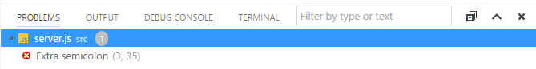
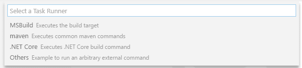
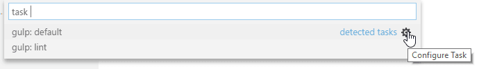

+++
title = "Tasks"
date = 2024-01-12T22:36:24+08:00
weight = 80
type = "docs"
description = ""
isCJKLanguage = true
draft = false
+++

> 原文: [https://code.visualstudio.com/docs/editor/tasks](https://code.visualstudio.com/docs/editor/tasks)

# Integrate with External Tools via Tasks 通过任务与外部工具集成


Lots of tools exist to automate tasks like linting, building, packaging, testing, or deploying software systems. Examples include the [TypeScript Compiler](https://www.typescriptlang.org/), linters like [ESLint](https://eslint.org/) and [TSLint](https://palantir.github.io/tslint/) as well as build systems like [Make](https://en.wikipedia.org/wiki/Make_software), [Ant](https://ant.apache.org/), [Gulp](https://gulpjs.com/), [Jake](https://jakejs.com/), [Rake](https://ruby.github.io/rake/), and [MSBuild](https://github.com/microsoft/msbuild).

​​	有很多工具可以自动执行诸如检查、构建、打包、测试或部署软件系统等任务。示例包括 TypeScript 编译器、ESLint 和 TSLint 等 linter，以及 Make、Ant、Gulp、Jake、Rake 和 MSBuild 等构建系统。


These tools are mostly run from the command line and automate jobs inside and outside the inner software development loop (edit, compile, test, and debug). Given their importance in the development life cycle, it is helpful to be able to run tools and analyze their results from within VS Code. Tasks in VS Code can be configured to run scripts and start processes so that many of these existing tools can be used from within VS Code without having to enter a command line or write new code. Workspace or folder specific tasks are configured from the `tasks.json` file in the `.vscode` folder for a workspace.

​​	这些工具大多从命令行运行，并在内部和外部软件开发循环（编辑、编译、测试和调试）中自动执行作业。鉴于它们在开发生命周期中的重要性，能够从 VS Code 内部运行工具并分析其结果非常有用。可以将 VS Code 中的任务配置为运行脚本并启动进程，以便从 VS Code 内部使用其中许多现有工具，而无需输入命令行或编写新代码。工作区或文件夹特定任务是从工作区的 `tasks.json` 文件夹中的 `.vscode` 文件配置的。

Extensions can also contribute tasks using a [Task Provider](https://code.visualstudio.com/api/extension-guides/task-provider), and these contributed tasks can add workspace-specific configurations defined in the `tasks.json` file.

​​	扩展还可以使用任务提供程序来提供任务，并且这些提供的任务可以添加在 `tasks.json` 文件中定义的工作区特定配置。

> **Note:** Task support is only available when working on a workspace folder. It is not available when editing single files.
>
> ​​	注意：仅在处理工作区文件夹时才提供任务支持。编辑单个文件时不提供此支持。

## [TypeScript Hello World](https://code.visualstudio.com/docs/editor/tasks#_typescript-hello-world)

Let's start with a simple "Hello World" TypeScript program that we want to compile to JavaScript.

​​	让我们从一个简单的“Hello World”TypeScript 程序开始，我们要将其编译成 JavaScript。

Create an empty folder "mytask", generate a `tsconfig.json` file and start VS Code from that folder.

​​	创建一个空文件夹“mytask”，生成一个 `tsconfig.json` 文件，并从该文件夹启动 VS Code。

```
mkdir mytask
cd mytask
tsc --init
code .
```

Now create a `HelloWorld.ts` file with the following content

​​	现在创建一个包含以下内容的 `HelloWorld.ts` 文件

```
function sayHello(name: string): void {
  console.log(`Hello ${name}!`);
}

sayHello('Dave');
```

Pressing Ctrl+Shift+B or running **Run Build Task** from the global **Terminal** menu show the following picker:

​​	按 Ctrl+Shift+B 或从全局终端菜单运行“运行生成任务”会显示以下选择器：


The first entry executes the TypeScript compiler and translates the TypeScript file to a JavaScript file. When the compiler has finished, there should be a `HelloWorld.js` file. The second entry starts the TypeScript compiler in watch mode. Every save to the `HelloWorld.ts` file will regenerate the `HelloWorld.js` file.

​​	第一个条目执行 TypeScript 编译器并将 TypeScript 文件转换为 JavaScript 文件。当编译器完成时，应该会有一个 `HelloWorld.js` 文件。第二个条目以监视模式启动 TypeScript 编译器。每次保存 `HelloWorld.ts` 文件都会重新生成 `HelloWorld.js` 文件。

You can also define the TypeScript build or watch task as the default build task so that it is executed directly when triggering **Run Build Task** (Ctrl+Shift+B). To do so, select **Configure Default Build Task** from the global **Terminal** menu. This shows you a picker with the available build tasks. Select **tsc: build** or **tsc: watch** and VS Code will generate a `tasks.json` file. The one shown below makes the **tsc: build** task the default build task:

​​	您还可以将 TypeScript 生成或监视任务定义为默认生成任务，以便在触发“运行生成任务”(Ctrl+Shift+B) 时直接执行它。为此，请从全局终端菜单中选择“配置默认生成任务”。这会向您显示一个包含可用生成任务的选择器。选择 tsc: build 或 tsc: watch，VS Code 将生成一个 `tasks.json` 文件。下面显示的一个将 tsc: build 任务设为默认生成任务：

```
{
  // See https://go.microsoft.com/fwlink/?LinkId=733558
  // for the documentation about the tasks.json format
  "version": "2.0.0",
  "tasks": [
    {
      "type": "typescript",
      "tsconfig": "tsconfig.json",
      "problemMatcher": ["$tsc"],
      "group": {
        "kind": "build",
        "isDefault": true
      }
    }
  ]
}
```

The `tasks.json` example above does not define a new task. It annotates the **tsc: build** tasks contributed by VS Code's TypeScript extension to be the default build task. You can now execute the TypeScript compiler by pressing Ctrl+Shift+B.

​​	上面的 `tasks.json` 示例未定义新任务。它注释了 VS Code 的 TypeScript 扩展提供的 tsc: build 任务，使其成为默认构建任务。您现在可以通过按 Ctrl+Shift+B 来执行 TypeScript 编译器。

## [Task auto-detection 任务自动检测](https://code.visualstudio.com/docs/editor/tasks#_task-autodetection)

VS Code currently auto-detects tasks for the following systems: Gulp, Grunt, Jake, and npm. We are working with the corresponding extension authors to add support for Maven and the C# `dotnet` command as well. If you develop a JavaScript application using Node.js as the runtime, you usually have a `package.json` file describing your dependencies and the scripts to run. If you have cloned the [eslint-starter](https://github.com/spicydonuts/eslint-starter) example, then executing **Run Tasks** from the global menu shows the following list:

​​	VS Code 目前自动检测以下系统的任务：Gulp、Grunt、Jake 和 npm。我们正在与相应的扩展作者合作，以添加对 Maven 和 C# `dotnet` 命令的支持。如果您使用 Node.js 作为运行时开发 JavaScript 应用程序，通常会有一个 `package.json` 文件来描述您的依赖项和要运行的脚本。如果您已克隆 eslint-starter 示例，那么从全局菜单执行“运行任务”将显示以下列表：


If you have not already done so, install the necessary npm modules by running `npm install`. Now open the `server.js` file and add a semicolon to the end of a statement (note the ESLint starter assumes statements without a semicolon) and execute the **Run Tasks** again. This time select the **npm: lint** task. When prompted for the problem matcher to use, select **ESLint stylish**

​​	如果您尚未执行此操作，请通过运行 `npm install` 来安装必要的 npm 模块。现在打开 `server.js` 文件，并在语句末尾添加分号（注意 ESLint starter 假设语句没有分号），然后再次执行“运行任务”。这次选择 npm: lint 任务。当系统提示您选择要使用的错误匹配器时，请选择 ESLint stylish


Executing the task produces one error, shown in the **Problems** view:

​​	执行任务会产生一个错误，该错误显示在“问题”视图中：



In addition, VS Code created a `tasks.json` file with the following content:

​​	此外，VS Code 创建了一个包含以下内容的 `tasks.json` 文件：

```
{
  // See https://go.microsoft.com/fwlink/?LinkId=733558
  // for the documentation about the tasks.json format
  "version": "2.0.0",
  "tasks": [
    {
      "type": "npm",
      "script": "lint",
      "problemMatcher": ["$eslint-stylish"]
    }
  ]
}
```

This instructs VS Code to scan the output of the **npm lint** script for problems using the ESLint stylish format.

​​	这指示 VS Code 使用 ESLint stylish 格式扫描 npm lint 脚本的输出以查找问题。

For Gulp, Grunt, and Jake, the task auto-detection works the same. Below is an example of the tasks detected for the [vscode-node-debug](https://github.com/microsoft/vscode-node-debug) extension.

​​	对于 Gulp、Grunt 和 Jake，任务自动检测的工作方式相同。以下是为 vscode-node-debug 扩展检测到的任务示例。


> **Tip:** You can run your task through **Quick Open** (Ctrl+P) by typing 'task', Space and the command name. In this case, 'task lint'.
>
> ​​	提示：您可以通过键入“任务”、“空格”和命令名称在快速打开（Ctrl+P）中运行任务。在本例中，为“任务 lint”。

Task auto detection can be disabled using the following settings:

​​	可以使用以下设置禁用任务自动检测：

```
{
  "typescript.tsc.autoDetect": "off",
  "grunt.autoDetect": "off",
  "jake.autoDetect": "off",
  "gulp.autoDetect": "off",
  "npm.autoDetect": "off"
}
```

## [Custom tasks 自定义任务](https://code.visualstudio.com/docs/editor/tasks#_custom-tasks)

Not all tasks or scripts can be auto-detected in your workspace. Sometimes it is necessary to define your own custom tasks. Assume you have a script to run your tests in order to set up some environment correctly. The script is stored in a script folder inside your workspace and named `test.sh` for Linux and macOS and `test.cmd` for Windows. Run **Configure Tasks** from the global **Terminal** menu and select the **Create tasks.json file from template** entry. This opens the following picker:

​​	并非所有任务或脚本都可以在您的工作区中自动检测。有时需要定义您自己的自定义任务。假设您有一个脚本来运行测试以便正确设置某些环境。该脚本存储在工作区内的脚本文件夹中，对于 Linux 和 macOS，命名为 `test.sh` ，对于 Windows，命名为 `test.cmd` 。从全局终端菜单运行“配置任务”，然后从模板条目中选择“创建 tasks.json 文件”。这将打开以下选取器：



> **Note:** If you don't see the list of task runner templates, you may already have a `tasks.json` file in your folder and its contents will be open in the editor. Close the file and either delete or rename it for this example.
>
> ​​	注意：如果您看不到任务运行器模板列表，则您的文件夹中可能已经存在一个 `tasks.json` 文件，并且其内容将在编辑器中打开。关闭该文件，然后将其删除或重命名以用于此示例。

We are working on more auto-detection support, so this list will get smaller and smaller in the future. Since we want to write our own custom task, select **Others** from the list. This opens the `tasks.json` file with a task skeleton. Replace the contents with the following:

​​	我们正在致力于更多的自动检测支持，因此此列表在未来会越来越小。由于我们想要编写自己的自定义任务，因此从列表中选择其他。这将使用任务框架打开 `tasks.json` 文件。用以下内容替换内容：

```
{
  // See https://go.microsoft.com/fwlink/?LinkId=733558
  // for the documentation about the tasks.json format
  "version": "2.0.0",
  "tasks": [
    {
      "label": "Run tests",
      "type": "shell",
      "command": "./scripts/test.sh",
      "windows": {
        "command": ".\\scripts\\test.cmd"
      },
      "group": "test",
      "presentation": {
        "reveal": "always",
        "panel": "new"
      }
    }
  ]
}
```

The task's properties have the following semantic:

​​	任务的属性具有以下语义：

- **label**: The task's label used in the user interface.
  标签：用户界面中使用的任务标签。
- **type**: The task's type. For a custom task, this can either be `shell` or `process`. If `shell` is specified, the command is interpreted as a shell command (for example: bash, cmd, or PowerShell). If `process` is specified, the command is interpreted as a process to execute.
  类型：任务的类型。对于自定义任务，这可以是 `shell` 或 `process` 。如果指定 `shell` ，则命令将被解释为 shell 命令（例如：bash、cmd 或 PowerShell）。如果指定 `process` ，则命令将被解释为要执行的进程。
- **command**: The actual command to execute.
  命令：要执行的实际命令。
- **windows**: Any Windows specific properties. Will be used instead of the default properties when the command is executed on the Windows operating system.
  Windows：任何 Windows 特定的属性。当在 Windows 操作系统上执行命令时，将使用这些属性代替默认属性。
- **group**: Defines to which group the task belongs. In the example, it belongs to the `test` group. Tasks that belong to the test group can be executed by running **Run Test Task** from the **Command Palette**.
  group：定义任务所属的组。在本例中，它属于 `test` 组。属于测试组的任务可以通过从命令面板运行“运行测试任务”来执行。
- **presentation**: Defines how the task output is handled in the user interface. In this example, the Integrated Terminal showing the output is `always` revealed and a `new` terminal is created on every task run.
  presentation：定义在用户界面中如何处理任务输出。在本例中，显示输出的集成终端 `always` 显示，并且在每次任务运行时都会创建一个 `new` 终端。
- **options**: Override the defaults for `cwd` (current working directory), `env` (environment variables), or `shell` (default shell). Options can be set per task but also globally or per platform. Environment variables configured here can only be referenced from within your task script or process and will not be resolved if they are part of your args, command, or other task attributes.
  options：覆盖 `cwd` （当前工作目录）、 `env` （环境变量）或 `shell` （默认 shell）的默认值。可以为每个任务设置选项，也可以全局或按平台设置选项。此处配置的环境变量只能在任务脚本或进程中引用，如果它们是 args、command 或其他任务属性的一部分，则不会解析它们。
- **runOptions**: Defines when and how a task is run.
  runOptions：定义何时以及如何运行任务。

You can see the full set of task properties and values with IntelliSense in your `tasks.json` file. Bring up suggestions with **Trigger Suggest** (Ctrl+Space) and read the descriptions on hover or with the **Read More...** ('i') flyout.

​​	您可以在 `tasks.json` 文件中使用 IntelliSense 查看完整的任务属性和值集。使用触发建议 (Ctrl+Space) 提出建议，并在悬停或使用“了解更多...”（“i”）弹出窗口时阅读说明。


You can also review the [tasks.json schema](https://code.visualstudio.com/docs/editor/tasks-appendix).

​​	您还可以查看 tasks.json 架构。

Shell commands need special treatment when it comes to commands and arguments that contain spaces or other special characters like `$`. By default, the task system supports the following behavior:

​​	涉及包含空格或其他特殊字符（如 `$` ）的命令和参数时，Shell 命令需要特殊处理。默认情况下，任务系统支持以下行为：

- If a single command is provided, the task system passes the command as is to the underlying shell. If the command needs quoting or escaping to function properly, the command needs to contain the proper quotes or escape characters. For example, to list the directory of a folder containing spaces in its name, the command executed in bash should look like this: `ls 'folder with spaces'`.
  如果提供单个命令，任务系统会按原样将命令传递给底层 Shell。如果命令需要引用或转义才能正常运行，则该命令需要包含适当的引号或转义字符。例如，要列出名称中包含空格的文件夹的目录，在 bash 中执行的命令应如下所示： `ls 'folder with spaces'` 。

```
{
  "label": "dir",
  "type": "shell",
  "command": "dir 'folder with spaces'"
}
```

- If a command and arguments are provided, the task system will use single quotes if the command or arguments contain spaces. For `cmd.exe`, double quotes are used. A shell command like below will be executed in PowerShell as `dir 'folder with spaces'`.
  如果提供了命令和参数，则如果命令或参数包含空格，任务系统将使用单引号。对于 `cmd.exe` ，使用双引号。如下所示的 Shell 命令将在 PowerShell 中执行为 `dir 'folder with spaces'` 。

```
{
  "label": "dir",
  "type": "shell",
  "command": "dir",
  "args": ["folder with spaces"]
}
```

- If you want to control how the argument is quoted, the argument can be a literal specifying the value and a quoting style. The example below uses escaping instead of quoting for an argument with spaces.
  如果要控制参数的引用方式，则参数可以是指定值和引用样式的文字。以下示例对带有空格的参数使用转义而不是引用。

```
{
  "label": "dir",
  "type": "shell",
  "command": "dir",
  "args": [
    {
      "value": "folder with spaces",
      "quoting": "escape"
    }
  ]
}
```

Besides escaping, the following values are supported:

​​	除了转义之外，还支持以下值：

- **strong**: Uses the shell's strong quoting mechanism, which suppresses all evaluations inside the string. Under PowerShell and for shells under Linux and macOS, single quotes are used (`'`). For cmd.exe, `"` is used.
  strong：使用 shell 的强引用机制，该机制会禁止字符串内的所有评估。在 PowerShell 和 Linux 和 macOS 下的 shell 中，使用单引号 ( `'` )。对于 cmd.exe，使用 `"` 。
- **weak**: Uses the shell's weak quoting mechanism, which still evaluates expression inside the string (for example, environment variables). Under PowerShell and for shells under Linux and macOS, double quotes are used (`"`). cmd.exe doesn't support weak quoting so VS Code uses `"` as well.
  weak：使用 shell 的弱引用机制，该机制仍会评估字符串内的表达式（例如，环境变量）。在 PowerShell 和 Linux 和 macOS 下的 shell 中，使用双引号 ( `"` )。cmd.exe 不支持弱引用，因此 VS Code 也使用 `"` 。

If the command itself contains spaces, VS Code will by default strong quote the command as well. As with arguments, the user can control the quoting of the command using the same literal style.

​​	如果命令本身包含空格，VS Code 默认也会对命令使用强引用。与参数一样，用户可以使用相同的文字样式控制命令的引用。

There are more task properties to configure your workflow. You can use IntelliSense with Ctrl+Space to get an overview of the valid properties.

​​	还有更多任务属性可用于配置工作流。您可以使用 Ctrl+Space 与 IntelliSense 配合使用，以获取有效属性的概述。


In addition to the global menu bar, task commands can be accessed using the **Command Palette** (Ctrl+Shift+P). You can filter on 'task' and can see the various task related commands.

​​	除了全局菜单栏外，还可以使用命令面板 (Ctrl+Shift+P) 访问任务命令。您可以按“任务”进行筛选，并查看各种与任务相关的命令。


### [Compound tasks 复合任务](https://code.visualstudio.com/docs/editor/tasks#_compound-tasks)

You can also compose tasks out of simpler tasks with the `dependsOn` property. For example, if you have a workspace with a client and server folder and both contain a build script, you can create a task that starts both build scripts in separate terminals. If you list more than one task in the `dependsOn` property, they are executed in parallel by default.

​​	您还可以使用 `dependsOn` 属性将任务组合成更简单的任务。例如，如果您有一个包含客户端和服务器文件夹的工作区，并且两者都包含一个构建脚本，则可以创建一个任务，在单独的终端中启动这两个构建脚本。如果您在 `dependsOn` 属性中列出了多个任务，则默认情况下它们将并行执行。

The `tasks.json` file looks like this:

​​	 `tasks.json` 文件如下所示：

```
{
  "version": "2.0.0",
  "tasks": [
    {
      "label": "Client Build",
      "command": "gulp",
      "args": ["build"],
      "options": {
        "cwd": "${workspaceFolder}/client"
      }
    },
    {
      "label": "Server Build",
      "command": "gulp",
      "args": ["build"],
      "options": {
        "cwd": "${workspaceFolder}/server"
      }
    },
    {
      "label": "Build",
      "dependsOn": ["Client Build", "Server Build"]
    }
  ]
}
```

If you specify `"dependsOrder": "sequence"`, then your task dependencies are executed in the order they are listed in `dependsOn`. Any background/watch tasks used in `dependsOn` with `"dependsOrder": "sequence"` must have a problem matcher that tracks when they are "done". The following task runs task Two, task Three, and then task One.

​​	如果您指定 `"dependsOrder": "sequence"` ，则您的任务依赖项将按照它们在 `dependsOn` 中列出的顺序执行。在 `dependsOn` 中与 `"dependsOrder": "sequence"` 一起使用的任何后台/监视任务都必须具有跟踪它们何时“完成”的问题匹配器。以下任务运行任务二、任务三，然后运行任务一。

```
{
  "label": "One",
  "type": "shell",
  "command": "echo Hello ",
  "dependsOrder": "sequence",
  "dependsOn": ["Two", "Three"]
}
```

### [User level tasks 用户级任务](https://code.visualstudio.com/docs/editor/tasks#_user-level-tasks)

You can create user level tasks that are not tied to a specific workspace or folder using the **Tasks: Open User Tasks** command. Only `shell` and `process` tasks can be used here since other task types require workspace information.

​​	您可以使用“任务：打开用户任务”命令创建不与特定工作区或文件夹绑定的用户级任务。此处只能使用 `shell` 和 `process` 任务，因为其他任务类型需要工作区信息。

## [Output behavior 输出行为](https://code.visualstudio.com/docs/editor/tasks#_output-behavior)

Sometimes you want to control how the Integrated Terminal panel behaves when running tasks. For instance, you may want to maximize editor space and only look at task output if you think there is a problem. The behavior of the terminal can be controlled using the `presentation` property of a task. It offers the following properties:

​​	有时您希望控制在运行任务时集成终端面板的行为。例如，您可能希望最大化编辑器空间，并且仅在您认为存在问题时才查看任务输出。可以使用任务的 `presentation` 属性来控制终端的行为。它提供以下属性：

- reveal

  : Controls whether the Integrated Terminal panel is brought to front. Valid values are:

  
  reveal：控制是否将集成终端面板置于最前面。有效值为：

  - `always` - The panel is always brought to front. This is the default.
    `always` - 面板始终置于最前面。这是默认值。
  - `never` - The user must explicitly bring the terminal panel to the front using the **View** > **Terminal** command (Ctrl+`).
    `never` - 用户必须使用“视图”>“终端”命令 (Ctrl+`) 显式地将终端面板置于最前面。
  - `silent` - The terminal panel is brought to front only if the output is not scanned for errors and warnings.
    `silent` - 仅当未扫描输出中的错误和警告时，才将终端面板置于最前面。

- revealProblems

  : Controls whether the Problems panel is revealed when running this task or not. Takes precedence over option

   

  ```
  reveal
  ```

  . Default is

   

  ```
  never
  ```

  .

  
  revealProblems：控制在运行此任务时是否显示“问题”面板。优先于选项 `reveal` 。默认值为 `never` 。

  - `always` - Always reveals the Problems panel when this task is executed.
    `always` - 在执行此任务时始终显示“问题”面板。
  - `onProblem` - Only reveals the Problems panel if a problem is found.
    `onProblem` - 仅在发现问题时才显示“问题”面板。
  - `never` - Never reveals the Problems panel when this task is executed.
    `never` - 在执行此任务时从不显示“问题”面板。

- **focus**: Controls whether the terminal is taking input focus or not. Default is `false`.
  focus：控制终端是否获取输入焦点。默认值为 `false` 。

- **echo**: Controls whether the executed command is echoed in the terminal. Default is `true`.
  echo：控制在终端中回显执行的命令。默认值为 `true` 。

- **showReuseMessage**: Controls whether to show the "Terminal will be reused by tasks, press any key to close it" message.
  showReuseMessage：控制是否显示“终端将被任务重复使用，按任意键关闭它”消息。

- panel

  : Controls whether the terminal instance is shared between task runs. Possible values are:

  
  panel：控制终端实例是否在任务运行之间共享。可能的值为：

  - `shared` - The terminal is shared and the output of other task runs are added to the same terminal.
    `shared` - 终端共享，其他任务运行的输出将添加到同一个终端。
  - `dedicated` - The terminal is dedicated to a specific task. If that task is executed again, the terminal is reused. However, the output of a different task is presented in a different terminal.
    `dedicated` - 终端专用于特定任务。如果该任务再次执行，则重复使用终端。但是，不同任务的输出显示在不同的终端中。
  - `new` - Every execution of that task is using a new clean terminal.
    `new` - 该任务的每次执行都使用一个新的干净终端。

- **clear**: Controls whether the terminal is cleared before this task is run. Default is `false`.
  clear：控制在运行此任务之前是否清除终端。默认值为 `false` 。

- **close**: Controls whether the terminal the task runs in is closed when the task exits. Default is `false`.
  close：控制任务运行所在的终端在任务退出时是否关闭。默认值为 `false` 。

- **group**: Controls whether the task is executed in a specific terminal group using split panes. Tasks in the same group (specified by a string value) will use split terminals to present instead of a new terminal panel.
  group：控制是否使用拆分窗格在特定终端组中执行任务。同一组中的任务（由字符串值指定）将使用拆分终端来显示，而不是新的终端面板。

You can modify the terminal panel behavior for auto-detected tasks as well. For example, if you want to change the output behavior for the **npm: run lint** from the ESLint example from above, add the `presentation` property to it:

​​	您也可以修改终端面板的行为以自动检测任务。例如，如果您想更改 ESLint 示例中 npm: run lint 的输出行为，请向其添加 `presentation` 属性：

```
{
  // See https://go.microsoft.com/fwlink/?LinkId=733558
  // for the documentation about the tasks.json format
  "version": "2.0.0",
  "tasks": [
    {
      "type": "npm",
      "script": "lint",
      "problemMatcher": ["$eslint-stylish"],
      "presentation": {
        "reveal": "never"
      }
    }
  ]
}
```

You can also mix custom tasks with configurations for detected tasks. A `tasks.json` that configures the **npm: run lint** task and adds a custom **Run Test** tasks looks like this:

​​	您还可以将自定义任务与检测到的任务配置混合使用。配置 npm: run lint 任务并添加自定义运行测试任务的 `tasks.json` 如下所示：

```
{
  // See https://go.microsoft.com/fwlink/?LinkId=733558
  // for the documentation about the tasks.json format
  "version": "2.0.0",
  "tasks": [
    {
      "type": "npm",
      "script": "lint",
      "problemMatcher": ["$eslint-stylish"],
      "presentation": {
        "reveal": "never"
      }
    },
    {
      "label": "Run tests",
      "type": "shell",
      "command": "./scripts/test.sh",
      "windows": {
        "command": ".\\scripts\\test.cmd"
      },
      "group": "test",
      "presentation": {
        "reveal": "always",
        "panel": "new"
      }
    }
  ]
}
```

## [Run behavior 运行行为](https://code.visualstudio.com/docs/editor/tasks#_run-behavior)

You can specify a task's run behaviors using the `runOptions` property:

​​	您可以使用 `runOptions` 属性指定任务的运行行为：

- **reevaluateOnRerun**: Controls how variables are evaluated when a task is executed through the **Rerun Last Task** command. The default is `true`, meaning that variables will be reevaluated when a task is rerun. When set to `false` the resolved variable values from the previous run of the task will be used.
  reevaluateOnRerun：控制通过“重新运行上一个任务”命令执行任务时如何评估变量。默认值为 `true` ，这意味着在重新运行任务时将重新评估变量。当设置为 `false` 时，将使用任务上次运行时解析的变量值。

- runOn

  : Specifies when a task is run.

  
  runOn：指定何时运行任务。

  - `default` - The task will only be run when executed through the **Run Task** command.
    `default` - 仅当通过“运行任务”命令执行时才运行任务。
  - `folderOpen` - The task will be run when the containing folder is opened. The first time you open a folder that contains a task with `folderOpen`, you will be asked if you want to allow tasks to run automatically in that folder. You can change your decision later using the **Manage Automatic Tasks** command and selecting between **Allow Automatic Tasks** and **Disallow Automatic Tasks**.
    `folderOpen` - 打开包含文件夹时将运行任务。首次打开包含具有 `folderOpen` 的任务的文件夹时，系统会询问您是否允许在该文件夹中自动运行任务。您可以稍后使用“管理自动任务”命令更改您的决定，并在“允许自动任务”和“禁止自动任务”之间进行选择。

## [Customizing auto-detected tasks 自定义自动检测到的任务](https://code.visualstudio.com/docs/editor/tasks#_customizing-autodetected-tasks)

As mentioned above, you can customize auto-detected tasks in the `tasks.json` file. You usually do so to modify presentation properties or to attach a problem matcher to scan the task's output for errors and warnings. You can customize a task directly from the **Run Task** list by pressing the gear icon to the right to insert the corresponding task reference into the `tasks.json` file. Assume you have the following Gulp file to lint JavaScript files using ESLint (the file is taken from https://github.com/adametry/gulp-eslint):

​​	如上所述，您可以在 `tasks.json` 文件中自定义自动检测到的任务。您通常这样做是为了修改演示属性或附加问题匹配器以扫描任务的输出以查找错误和警告。您可以通过按右侧的齿轮图标将相应的任务引用插入 `tasks.json` 文件，直接从“运行任务”列表自定义任务。假设您有以下 Gulp 文件，可以使用 ESLint 对 JavaScript 文件进行检查（该文件取自 https://github.com/adametry/gulp-eslint）：

```
const gulp = require('gulp');
const eslint = require('gulp-eslint');

gulp.task('lint', () => {
  // ESLint ignores files with "node_modules" paths.
  // So, it's best to have gulp ignore the directory as well.
  // Also, Be sure to return the stream from the task;
  // Otherwise, the task may end before the stream has finished.
  return (
    gulp
      .src(['**/*.js', '!node_modules/**'])
      // eslint() attaches the lint output to the "eslint" property
      // of the file object so it can be used by other modules.
      .pipe(eslint())
      // eslint.format() outputs the lint results to the console.
      // Alternatively use eslint.formatEach() (see Docs).
      .pipe(eslint.format())
      // To have the process exit with an error code (1) on
      // lint error, return the stream and pipe to failAfterError last.
      .pipe(eslint.failAfterError())
  );
});

gulp.task('default', ['lint'], function() {
  // This will only run if the lint task is successful...
});
```

Executing **Run Task** from the global **Terminal** menu will show the following picker:

​​	从全局“终端”菜单执行“运行任务”将显示以下选择器：



Press the gear icon. This will create the following `tasks.json` file:

​​	按齿轮图标。这将创建以下 `tasks.json` 文件：

```
{
  // See https://go.microsoft.com/fwlink/?LinkId=733558
  // for the documentation about the tasks.json format
  "version": "2.0.0",
  "tasks": [
    {
      "type": "gulp",
      "task": "default",
      "problemMatcher": []
    }
  ]
}
```

Usually you would now add a problem matcher (in this case `$eslint-stylish`) or modify the presentation settings.

​​	通常，您现在会添加问题匹配器（在本例中为 `$eslint-stylish` ）或修改演示设置。

## [Processing task output with problem matchers 使用问题匹配器处理任务输出](https://code.visualstudio.com/docs/editor/tasks#_processing-task-output-with-problem-matchers)

VS Code can process the output from a task with a problem matcher. Problem matchers scan the task output text for known warning or error strings, and report these inline in the editor and in the Problems panel. VS Code ships with several problem matchers 'in-the-box':

​​	VS Code 可以使用问题匹配器处理任务的输出。问题匹配器扫描任务输出文本以查找已知的警告或错误字符串，并在编辑器和“问题”面板中内联报告这些字符串。VS Code 自带几个问题匹配器：“内置”：

- **TypeScript**: `$tsc` assumes that file names in the output are relative to the opened folder.
  TypeScript： `$tsc` 假设输出中的文件名相对于打开的文件夹。
- **TypeScript Watch**: `$tsc-watch` matches problems reported from the `tsc` compiler when executed in watch mode.
  TypeScript 监视： `$tsc-watch` 匹配在监视模式下执行时从 `tsc` 编译器报告的问题。
- **JSHint**: `$jshint` assumes that file names are reported as an absolute path.
  JSHint： `$jshint` 假设文件名报告为绝对路径。
- **JSHint Stylish**: `$jshint-stylish` assumes that file names are reported as an absolute path.
  JSHint Stylish： `$jshint-stylish` 假设文件名报告为绝对路径。
- **ESLint Compact**: `$eslint-compact` assumes that file names in the output are relative to the opened folder.
  ESLint Compact： `$eslint-compact` 假设输出中的文件名相对于打开的文件夹。
- **ESLint Stylish**: `$eslint-stylish` assumes that file names in the output are relative to the opened folder.
  ESLint Stylish： `$eslint-stylish` 假设输出中的文件名相对于打开的文件夹。
- **Go**: `$go` matches problems reported from the `go` compiler. Assumes that file names are relative to the opened folder.
  Go： `$go` 匹配从 `go` 编译器报告的问题。假设文件名相对于打开的文件夹。
- **CSharp and VB Compiler**: `$mscompile` assumes that file names are reported as an absolute path.
  CSharp 和 VB 编译器： `$mscompile` 假设文件名报告为绝对路径。
- **Lessc compiler**: `$lessc` assumes that file names are reported as absolute path.
  Lessc 编译器： `$lessc` 假设文件名报告为绝对路径。
- **Node Sass compiler**: `$node-sass` assumes that file names are reported as an absolute path.
  Node Sass 编译器： `$node-sass` 假设文件名报告为绝对路径。

You can also create your own problem matcher, which we'll discuss [in a later section](https://code.visualstudio.com/docs/editor/tasks#_defining-a-problem-matcher).

​​	您还可以创建自己的问题匹配器，我们将在后面的章节中讨论。

## [Binding keyboard shortcuts to tasks 将键盘快捷键绑定到任务](https://code.visualstudio.com/docs/editor/tasks#_binding-keyboard-shortcuts-to-tasks)

If you need to run a task frequently, you can define a keyboard shortcut for the task.

​​	如果您需要频繁运行任务，可以为该任务定义键盘快捷键。

For example, to bind `Ctrl+H` to the **Run tests** task from above, add the following to your `keybindings.json` file:

​​	例如，要将 `Ctrl+H` 绑定到上面的“运行测试”任务，请将以下内容添加到 `keybindings.json` 文件中：

```
{
  "key": "ctrl+h",
  "command": "workbench.action.tasks.runTask",
  "args": "Run tests"
}
```

## [Variable substitution 变量替换](https://code.visualstudio.com/docs/editor/tasks#_variable-substitution)

When authoring tasks configurations, it is useful to have a set of predefined common variables such as the active file (`${file}`) or workspace root folder (`${workspaceFolder}`). VS Code supports variable substitution inside strings in the `tasks.json` file and you can see a full list of predefined variables in the [Variables Reference](https://code.visualstudio.com/docs/editor/variables-reference).

​​	在编写任务配置时，最好有一组预定义的通用变量，例如活动文件 ( `${file}` ) 或工作区根文件夹 ( `${workspaceFolder}` )。VS Code 支持在 `tasks.json` 文件中的字符串内进行变量替换，您可以在变量参考中查看预定义变量的完整列表。

> **Note:** Not all properties will accept variable substitution. Specifically, only `command`, `args`, and `options` support variable substitution.
>
> ​​	注意：并非所有属性都接受变量替换。具体来说，只有 `command` 、 `args` 和 `options` 支持变量替换。

Below is an example of a custom task configuration that passes the current opened file to the TypeScript compiler.

​​	下面是一个自定义任务配置的示例，该配置将当前打开的文件传递给 TypeScript 编译器。

```
{
  "label": "TypeScript compile",
  "type": "shell",
  "command": "tsc ${file}",
  "problemMatcher": ["$tsc"]
}
```

Similarly, you can reference your project's configuration settings by prefixing the name with **${config:**. For example, `${config:python.formatting.autopep8Path}` returns the Python extension setting `formatting.autopep8Path`.

​​	同样，您可以通过在名称前加上 ${config:. 来引用项目的配置设置。例如， `${config:python.formatting.autopep8Path}` 返回 Python 扩展设置 `formatting.autopep8Path` 。

Below is an example of a custom task configuration, which executes autopep8 on the current file using the autopep8 executable defined by the `python.formatting.autopep8Path` setting:

​​	下面是一个自定义任务配置的示例，它使用 `python.formatting.autopep8Path` 设置定义的 autopep8 可执行文件对当前文件执行 autopep8：

```
{
  "label": "autopep8 current file",
  "type": "process",
  "command": "${config:python.formatting.autopep8Path}",
  "args": ["--in-place", "${file}"]
}
```

If you want to specify the selected Python interpreter used by the Python extension for `tasks.json` or `launch.json`, you can use the `${command:python.interpreterPath}` command.

​​	如果您想指定 Python 扩展用于 `tasks.json` 或 `launch.json` 的选定 Python 解释器，可以使用 `${command:python.interpreterPath}` 命令。

If simple variable substitution isn't enough, you can also get input from the user of your task by adding an `inputs` section to your `tasks.json` file.

​​	如果简单的变量替换不够用，您还可以通过向 `tasks.json` 文件添加 `inputs` 部分来获取任务用户的输入。


For more information about `inputs`, see the [Variables Reference](https://code.visualstudio.com/docs/editor/variables-reference).

​​	有关 `inputs` 的更多信息，请参阅变量参考。

## [Operating system specific properties 操作系统特定属性](https://code.visualstudio.com/docs/editor/tasks#_operating-system-specific-properties)

The task system supports defining values (for example, the command to be executed) specific to an operating system. To do so, put an operating system specific literal into the `tasks.json` file and specify the corresponding properties inside that literal.

​​	任务系统支持定义特定于操作系统的值（例如，要执行的命令）。为此，将操作系统特定的文字放入 `tasks.json` 文件中，并在该文字中指定相应的属性。

Below is an example that uses the Node.js executable as a command and is treated differently on Windows and Linux:

​​	下面是一个示例，它使用 Node.js 可执行文件作为命令，并且在 Windows 和 Linux 上的处理方式不同：

```
{
  "label": "Run Node",
  "type": "process",
  "windows": {
    "command": "C:\\Program Files\\nodejs\\node.exe"
  },
  "linux": {
    "command": "/usr/bin/node"
  }
}
```

Valid operating properties are `windows` for Windows, `linux` for Linux, and `osx` for macOS. Properties defined in an operating system specific scope override properties defined in the task or global scope.

​​	有效的操作系统属性是 Windows 的 `windows` 、Linux 的 `linux` 和 macOS 的 `osx` 。在操作系统特定范围内定义的属性会覆盖在任务或全局范围内定义的属性。

## [Global tasks 全局任务](https://code.visualstudio.com/docs/editor/tasks#_global-tasks)

Task properties can also be defined in the global scope. If present, they will be used for specific tasks unless they define the same property with a different value. In the example below, there is a global `presentation` property, which defines that all tasks should be executed in a new panel:

​​	任务属性也可以在全局范围内定义。如果存在，它们将用于特定任务，除非它们使用不同的值定义相同的属性。在下面的示例中，有一个全局 `presentation` 属性，它定义所有任务都应在新面板中执行：

```
{
  // See https://go.microsoft.com/fwlink/?LinkId=733558
  // for the documentation about the tasks.json format
  "version": "2.0.0",
  "presentation": {
    "panel": "new"
  },
  "tasks": [
    {
      "label": "TS - Compile current file",
      "type": "shell",
      "command": "tsc ${file}",
      "problemMatcher": ["$tsc"]
    }
  ]
}
```

> **Tip:** To get access to the global scope `tasks.json` file, open the Command Palette (Ctrl+Shift+P) and run the **Tasks: Open User Tasks** command.
>
> ​​	提示：要访问全局范围 `tasks.json` 文件，请打开命令面板 (Ctrl+Shift+P) 并运行任务：打开用户任务命令。

### [Character escaping in PowerShell PowerShell 中的字符转义](https://code.visualstudio.com/docs/editor/tasks#_character-escaping-in-powershell)

When the default shell is PowerShell, or when a task is configured to use PowerShell, you might see unexpected space and quote escaping. The unexpected escaping only occurs with cmdlets because VS Code doesn't know if your command contains cmdlets. Example 1 below shows a case where you'll get escaping that doesn't work with PowerShell. Example 2 shows the best, cross-platform, way to get good escaping. In some cases, you might not be able to follow example 2 and you'll need to do the manual escaping shown in example 3.

​​	当默认 shell 为 PowerShell，或将任务配置为使用 PowerShell 时，您可能会看到意外的空格和引号转义。意外的转义仅发生在 cmdlet 上，因为 VS Code 不知道您的命令是否包含 cmdlet。下面的示例 1 显示了您将获得与 PowerShell 不兼容的转义的情况。示例 2 显示了获得良好转义的最佳跨平台方式。在某些情况下，您可能无法遵循示例 2，并且需要执行示例 3 中所示的手动转义。

```
"tasks": [
    {
        "label": "PowerShell example 1 (unexpected escaping)",
        "type": "shell",
        "command": "Get-ChildItem \"Folder With Spaces\""
    },
    {
        "label": "PowerShell example 2 (expected escaping)",
        "type": "shell",
        "command": "Get-ChildItem",
        "args": ["Folder With Spaces"]
    },
    {
        "label": "PowerShell example 3 (manual escaping)",
        "type": "shell",
        "command": "& Get-ChildItem \\\"Folder With Spaces\\\""
    }
]
```

## [Changing the encoding for a task output 更改任务输出的编码](https://code.visualstudio.com/docs/editor/tasks#_changing-the-encoding-for-a-task-output)

Tasks frequently act with files on disk. If these files are stored on disk with an encoding different than the system encoding, you need to let the command executed as a task know which encoding to use. Since this depends on the operating system and the shell used, there is no general solution to control this. Below are advice and examples on how to make it work.

​​	任务经常与磁盘上的文件一起执行操作。如果这些文件以不同于系统编码的编码存储在磁盘上，则需要让作为任务执行的命令知道要使用哪种编码。由于这取决于所使用的操作系统和 shell，因此没有通用的解决方案来控制此问题。以下是有关如何使其正常工作的建议和示例。

If you need to tweak the encoding, you should check whether it makes sense to change the default encoding used by your operating system or at least change it for the shell you use by tweaking the shell's profile file.

​​	如果您需要调整编码，则应检查更改操作系统使用的默认编码是否有意义，或者至少通过调整 shell 的配置文件来更改您使用的 shell 的编码。

If you only need to tweak it for a specific task, then add the OS-specific command necessary to change the encoding to the tasks command line. The following example is for Windows using code page of 437 as its default. The task shows the output of a file containing Cyrillic characters and therefore needs code page 866. The task to list the file looks like this assuming that the default shell is set to `cmd.exe`:

​​	如果您只需要针对特定任务对其进行调整，则添加必要的 OS 特定命令以将编码更改为任务命令行。以下示例适用于使用代码页 437 作为其默认值的 Windows。该任务显示包含西里尔字符的文件的输出，因此需要代码页 866。列出该文件的任务如下所示，假设默认 shell 设置为 `cmd.exe` ：

```
{
  // See https://go.microsoft.com/fwlink/?LinkId=733558
  // for the documentation about the tasks.json format
  "version": "2.0.0",
  "tasks": [
    {
      "label": "more",
      "type": "shell",
      "command": "chcp 866 && more russian.txt",
      "problemMatcher": []
    }
  ]
}
```

If the task is executed in `PowerShell`, the command needs to read like this `chcp 866; more russian.txt`. On Linux and macOS, the `locale` command can be used to inspect the locale and tweak the necessary environment variables.

​​	如果在 `PowerShell` 中执行任务，则命令需要像这样读取 `chcp 866; more russian.txt` 。在 Linux 和 macOS 上，可以使用 `locale` 命令检查区域设置并调整必要的环境变量。

## [Examples of tasks in action 任务操作示例](https://code.visualstudio.com/docs/editor/tasks#_examples-of-tasks-in-action)

To highlight the power of tasks, here are a few examples of how VS Code can use tasks to integrate external tools like linters and compilers.

​​	为了突出任务的功能，这里有一些 VS Code 如何使用任务集成诸如 linter 和编译器之类的外部工具的示例。

### [Transpiling TypeScript to JavaScript 将 TypeScript 转换为 JavaScript](https://code.visualstudio.com/docs/editor/tasks#_transpiling-typescript-to-javascript)

The [TypeScript topic](https://code.visualstudio.com/docs/typescript/typescript-compiling) includes an example that creates a task to transpile TypeScript to JavaScript and observe any related errors from within VS Code.

​​	TypeScript 主题包括一个示例，该示例创建一个任务以将 TypeScript 转换为 JavaScript 并观察 VS Code 中的任何相关错误。

### [Transpiling Less and SCSS into CSS 将 Less 和 SCSS 转换为 CSS](https://code.visualstudio.com/docs/editor/tasks#_transpiling-less-and-scss-into-css)

The CSS topic provides examples of how to use Tasks to generate CSS files.

​​	CSS 主题提供了有关如何使用任务生成 CSS 文件的示例。

1. [Manually transpiling with a Build task
   使用构建任务手动转换](https://code.visualstudio.com/docs/languages/css#_transpiling-sass-and-less-into-css)
2. [Automation of the compile step with a file watcher
   使用文件观察器自动执行编译步骤](https://code.visualstudio.com/docs/languages/css#_automating-sassless-compilation)

## [Defining a problem matcher 定义问题匹配器](https://code.visualstudio.com/docs/editor/tasks#_defining-a-problem-matcher)

VS Code ships some of the most common problem matchers 'in-the-box'. However, there are lots of compilers and linting tools out there, all of which produce their own style of errors and warnings so you may want to create your own problem matcher.

​​	VS Code 内置了一些最常见的问题匹配器。但是，有很多编译器和 linting 工具，它们都会生成自己的错误和警告样式，因此您可能需要创建自己的问题匹配器。

We have a `helloWorld.c` program in which the developer mistyped **printf** as **prinft**. Compiling it with [gcc](https://gcc.gnu.org/) will produce the following warning:

​​	我们有一个 `helloWorld.c` 程序，其中开发人员将 printf 错写成了 prinft。使用 gcc 编译它将生成以下警告：

```
helloWorld.c:5:3: warning: implicit declaration of function ‘prinft’
```

We want to produce a problem matcher that can capture the message in the output and show a corresponding problem in VS Code. Problem matchers heavily rely on [regular expressions](https://en.wikipedia.org/wiki/Regular_expression). The section below assumes you are familiar with regular expressions.

​​	我们希望生成一个问题匹配器，它可以捕获输出中的消息并在 VS Code 中显示相应的问题。问题匹配器严重依赖正则表达式。以下部分假定您熟悉正则表达式。

> **Tip:** We have found the [RegEx101 playground](https://regex101.com/), which has an ECMAScript (JavaScript) flavor, to be a great way to develop and test regular expressions.
>
> ​​	提示：我们发现 RegEx101 游乐场（具有 ECMAScript（JavaScript）风格）是开发和测试正则表达式的绝佳方式。

A matcher that captures the above warning (and errors) looks like this:

​​	捕获上述警告（和错误）的匹配器如下所示：

```
{
  // The problem is owned by the cpp language service.
  "owner": "cpp",
  // The file name for reported problems is relative to the opened folder.
  "fileLocation": ["relative", "${workspaceFolder}"],
  // The actual pattern to match problems in the output.
  "pattern": {
    // The regular expression. Example to match: helloWorld.c:5:3: warning: implicit declaration of function ‘printf’ [-Wimplicit-function-declaration]
    "regexp": "^(.*):(\\d+):(\\d+):\\s+(warning|error):\\s+(.*)$",
    // The first match group matches the file name which is relative.
    "file": 1,
    // The second match group matches the line on which the problem occurred.
    "line": 2,
    // The third match group matches the column at which the problem occurred.
    "column": 3,
    // The fourth match group matches the problem's severity. Can be ignored. Then all problems are captured as errors.
    "severity": 4,
    // The fifth match group matches the message.
    "message": 5
  }
}
```

Note that the file, line, and message properties are mandatory. The `fileLocation` specifies whether the file paths that are produced by the task output and matched in the problem are `absolute` or `relative`. If the task produces both absolute and relative paths, you can use the `autoDetect` file location. With `autoDetect`, paths are first tested as absolute paths, and if the file doesn't exist then the path is assumed to be relative.

​​	请注意，文件、行和消息属性是强制性的。 `fileLocation` 指定任务输出产生的文件路径和在问题中匹配的文件路径是 `absolute` 还是 `relative` 。如果任务同时产生绝对路径和相对路径，则可以使用 `autoDetect` 文件位置。使用 `autoDetect` 时，路径首先作为绝对路径进行测试，如果文件不存在，则假定路径是相对的。

Here is a finished `tasks.json` file with the code above (comments removed) wrapped with the actual task details:

​​	下面是使用上述代码（已删除注释）并用实际任务详细信息包装的已完成 `tasks.json` 文件：

```
{
  "version": "2.0.0",
  "tasks": [
    {
      "label": "build",
      "command": "gcc",
      "args": ["-Wall", "helloWorld.c", "-o", "helloWorld"],
      "problemMatcher": {
        "owner": "cpp",
        "fileLocation": ["relative", "${workspaceFolder}"],
        "pattern": {
          "regexp": "^(.*):(\\d+):(\\d+):\\s+(warning|error):\\s+(.*)$",
          "file": 1,
          "line": 2,
          "column": 3,
          "severity": 4,
          "message": 5
        }
      }
    }
  ]
}
```

Running it inside VS Code and pressing Ctrl+Shift+M to get the list of problems gives you the following output:

​​	在 VS Code 中运行它并按 Ctrl+Shift+M 以获取问题列表，将为您提供以下输出：


> **Note:** The [C/C++ extension](https://marketplace.visualstudio.com/items?itemName=ms-vscode.cpptools) includes problem matchers for GCC so there is no need to define our own.
>
> ​​	注意：C/C++ 扩展包括 GCC 的问题匹配器，因此无需定义我们自己的匹配器。

There are a couple more properties that can be used inside a pattern. These are:

​​	可以在模式中使用更多属性。这些属性包括：

- **location** - If the problem location is line or line,column or startLine,startColumn,endLine,endColumn, then our generic location match group can be used.
  location - 如果问题位置是 line 或 line,column 或 startLine,startColumn,endLine,endColumn，则可以使用我们的通用位置匹配组。
- **endLine** - The match group index for the problem's end line. Can be omitted if no end line value is provided by the compiler.
  endLine - 问题结束行的匹配组索引。如果编译器未提供结束行值，则可以省略。
- **endColumn** - The match group index for the problem's end column. Can be omitted if no end column value is provided by the compiler.
  endColumn - 问题的结束列的匹配组索引。如果编译器未提供结束列值，则可以省略。
- **code** - The match group index for the problem's code. Can be omitted if no code value is provided by the compiler.
  code - 问题的代码的匹配组索引。如果编译器未提供代码值，则可以省略。

You can also define a problem matcher that captures only a file. To do so, define a `pattern` with the optional `kind` attribute set to `file`. In this case, there is no need to provide a `line` or `location` property.

​​	您还可以定义仅捕获文件的错误匹配器。为此，请定义一个 `pattern` ，其中可选的 `kind` 属性设置为 `file` 。在这种情况下，无需提供 `line` 或 `location` 属性。

> **Note:** A functional pattern must at least provide a match group for `file` and `message` if the `kind` property is set to `file`. If no `kind` property is provided or the `kind` property is set to `location`, a function pattern must provide a `line` or `location` property as well.
>
> ​​	注意：如果 `kind` 属性设置为 `file` ，则功能模式必须至少为 `file` 和 `message` 提供匹配组。如果未提供 `kind` 属性或将 `kind` 属性设置为 `location` ，则功能模式还必须提供 `line` 或 `location` 属性。

> **Note:** The problem matcher only parses output from the given command. If you want to parse output written to separate file (e.g. a log file), make the command that you run print out lines from the separate file before it finishes executing.
>
> ​​	注意：错误匹配器仅解析给定命令的输出。如果您想解析写入单独文件（例如日志文件）的输出，请在命令运行完毕之前让其打印出单独文件中的行。

## [Defining a multiline problem matcher 定义多行错误匹配器](https://code.visualstudio.com/docs/editor/tasks#_defining-a-multiline-problem-matcher)

Some tools spread problems found in a source file over several lines, especially if stylish reporters are used. An example is [ESLint](https://eslint.org/); in stylish mode it produces output like this:

​​	某些工具会将源文件中发现的问题分散到多行，尤其是在使用美观报告器时。ESLint 就是一个例子；在美观模式下，它会生成如下输出：

```
test.js
  1:0   error  Missing "use strict" statement                 strict
✖ 1 problems (1 errors, 0 warnings)
```

Our problem matcher is line-based so we need to capture the file name (test.js) with a different regular expression than the actual problem location and message (1:0 error Missing "use strict" statement).

​​	我们的问题匹配器是基于行的，因此我们需要使用与实际问题位置和消息（1:0 错误缺少“use strict”语句）不同的正则表达式来捕获文件名 (test.js)。

To do this, use an array of problem patterns for the `pattern` property. This way you define a pattern per each line you want to match.

​​	为此，请对 `pattern` 属性使用问题模式数组。这样，您可以为要匹配的每一行定义一个模式。

The following problem pattern matches the output from ESLint in stylish mode - but still has one small issue that we need to resolve next. The code below has a first regular expression to capture the file name and the second to capture the line, column, severity, message, and error code:

​​	以下问题模式匹配美观模式下的 ESLint 输出 - 但仍有一个小问题需要我们接下来解决。下面的代码有一个正则表达式用于捕获文件名，第二个用于捕获行、列、严重性、消息和错误代码：

```
{
  "owner": "javascript",
  "fileLocation": ["relative", "${workspaceFolder}"],
  "pattern": [
    {
      "regexp": "^([^\\s].*)$",
      "file": 1
    },
    {
      "regexp": "^\\s+(\\d+):(\\d+)\\s+(error|warning|info)\\s+(.*)\\s\\s+(.*)$",
      "line": 1,
      "column": 2,
      "severity": 3,
      "message": 4,
      "code": 5
    }
  ]
}
```

However, this pattern will not work if there is more than one problem on a resource. For instance, imagine the following output from ESLint:

​​	但是，如果资源上有多个问题，此模式将不起作用。例如，想象一下 ESLint 的以下输出：

```
test.js
  1:0   error  Missing "use strict" statement                 strict
  1:9   error  foo is defined but never used                  no-unused-vars
  2:5   error  x is defined but never used                    no-unused-vars
  2:11  error  Missing semicolon                              semi
  3:1   error  "bar" is not defined                           no-undef
  4:1   error  Newline required at end of file but not found  eol-last
✖ 6 problems (6 errors, 0 warnings)
```

The pattern's first regular expression will match "test.js", the second "1:0 error ...". The next line "1:9 error ..." is processed but not matched by the first regular expression and so no problem is captured.

​​	模式的第一个正则表达式将匹配“test.js”，第二个匹配“1:0 error ...”。下一行“1:9 error ...”被处理，但未被第一个正则表达式匹配，因此未捕获任何问题。

To make this work, the last regular expression of a multiline pattern can specify the `loop` property. If set to true, it instructs the task system to apply the last pattern of a multiline matcher to the lines in the output as long as the regular expression matches.

​​	要实现此目的，多行模式的最后一个正则表达式可以指定 `loop` 属性。如果设置为 true，它会指示任务系统将多行匹配器的最后一个模式应用于输出中的行，只要正则表达式匹配即可。

The information captured by the first pattern, which in this case matches `test.js`, will be combined with each of the subsequent lines that match the `loop` pattern to create multiple problems. In this example, six problems would be created.

​​	第一个模式捕获的信息（在本例中匹配 `test.js` ）将与匹配 `loop` 模式的每个后续行组合以创建多个问题。在此示例中，将创建六个问题。

Here is a problem matcher to fully capture ESLint stylish problems:

​​	这是一个完全捕获 ESLint 样式问题的匹配器：

```
{
  "owner": "javascript",
  "fileLocation": ["relative", "${workspaceFolder}"],
  "pattern": [
    {
      "regexp": "^([^\\s].*)$",
      "file": 1
    },
    {
      "regexp": "^\\s+(\\d+):(\\d+)\\s+(error|warning|info)\\s+(.*)\\s\\s+(.*)$",
      "line": 1,
      "column": 2,
      "severity": 3,
      "message": 4,
      "code": 5,
      "loop": true
    }
  ]
}
```

> **Note**: If you have multiple problems that occur on the same resource with the exact same line and column, then only one problem will be shown. This applies to all problem matchers, not just multiline problem matchers.
>
> ​​	注意：如果您在同一资源上有多个问题发生在完全相同的行和列上，那么只显示一个问题。这适用于所有问题匹配器，而不仅仅是多行问题匹配器。

## [Modifying an existing problem matcher 修改现有问题匹配器](https://code.visualstudio.com/docs/editor/tasks#_modifying-an-existing-problem-matcher)

If an existing problem matcher is close to what you need, you can modify it in your `tasks.json` task. For example, the `$tsc-watch` problem matcher only applies to closed documents. If you want to have it apply to all documents you can modify it:

​​	如果现有问题匹配器接近您的需求，您可以在 `tasks.json` 任务中对其进行修改。例如， `$tsc-watch` 问题匹配器仅适用于已关闭的文档。如果您希望将其应用于所有文档，可以对其进行修改：

```
{
  "type": "npm",
  "script": "watch",
  "problemMatcher": {
    "base": "$tsc-watch",
    "applyTo": "allDocuments"
  },
  "isBackground": true
}
```

Other modifiable problem matcher properties include `background`, `fileLocation`, `owner`, `pattern`, `severity`, and `source`.

​​	其他可修改的问题匹配器属性包括 `background` 、 `fileLocation` 、 `owner` 、 `pattern` 、 `severity` 和 `source` 。

## [Background / watching tasks 后台/监视任务](https://code.visualstudio.com/docs/editor/tasks#_background-watching-tasks)

Some tools support running in the background while watching the file system for changes and then triggering an action when a file changes on disk. With `Gulp` such functionality is provided through the npm module [gulp-watch](https://www.npmjs.com/package/gulp-watch). The TypeScript compiler `tsc` has built in support for this via the `--watch` command line option.

​​	某些工具支持在后台运行，同时监视文件系统中的更改，然后在磁盘上的文件更改时触发操作。使用 `Gulp` ，此类功能通过 npm 模块 gulp-watch 提供。TypeScript 编译器 `tsc` 通过 `--watch` 命令行选项内置对此的支持。

To provide feedback that a background task is active in VS Code and producing problem results, a problem matcher has to use additional information to detect these `state` changes in the output. Let's take the `tsc` compiler as an example. When the compiler is started in watch mode, it prints the following additional information to the console:

​​	为了提供反馈，表明后台任务在 VS Code 中处于活动状态并生成问题结果，问题匹配器必须使用其他信息来检测输出中的这些 `state` 更改。我们以 `tsc` 编译器为例。当编译器在监视模式下启动时，它会将以下其他信息打印到控制台：

```
> tsc --watch
12:30:36 PM - Compilation complete. Watching for file changes.
```

When a file changes on disk that contains a problem, the following output appears:

​​	当磁盘上包含问题的文件发生更改时，将显示以下输出：

```
12:32:35 PM - File change detected. Starting incremental compilation...
src/messages.ts(276,9): error TS2304: Cannot find name 'candidate'.
12:32:35 PM - Compilation complete. Watching for file changes.
```

Looking at the output shows the following pattern:

​​	查看输出显示以下模式：

- The compiler runs when `File change detected. Starting incremental compilation...` is printed to the console.
  当 `File change detected. Starting incremental compilation...` 打印到控制台时，编译器运行。
- The compiler stops when `Compilation complete. Watching for file changes.` is printed to the console.
  当 `Compilation complete. Watching for file changes.` 打印到控制台时，编译器停止。
- Between those two strings problems are reported.
  在这两个字符串之间报告问题。
- The compiler also runs once the initial start (without printing `File change detected. Starting incremental compilation...` to the console).
  编译器在初始启动时也会运行一次（不会将 `File change detected. Starting incremental compilation...` 打印到控制台）。

To capture this information, a problem matcher can provide a `background` property.

​​	要捕获此信息，问题匹配器可以提供 `background` 属性。

For the `tsc` compiler, an appropriate `background` property looks like this:

​​	对于 `tsc` 编译器，合适的 `background` 属性如下所示：

```
"background": {
    "activeOnStart": true,
    "beginsPattern": "^\\s*\\d{1,2}:\\d{1,2}:\\d{1,2}(?: AM| PM)? - File change detected\\. Starting incremental compilation\\.\\.\\.",
    "endsPattern": "^\\s*\\d{1,2}:\\d{1,2}:\\d{1,2}(?: AM| PM)? - Compilation complete\\. Watching for file changes\\."
}
```

In addition to the `background` property on the problem matcher, the task itself has to be marked as `isBackground` so that the task keeps running in the background.

​​	除了问题匹配器上的 `background` 属性外，任务本身必须标记为 `isBackground` ，以便任务在后台持续运行。

A full handcrafted `tasks.json` for a `tsc` task running in watch mode looks like this:

​​	一个完整的 `tasks.json` 手动制作的 `tsc` 任务在监视模式下运行，如下所示：

```
{
  "version": "2.0.0",
  "tasks": [
    {
      "label": "watch",
      "command": "tsc",
      "args": ["--watch"],
      "isBackground": true,
      "problemMatcher": {
        "owner": "typescript",
        "fileLocation": "relative",
        "pattern": {
          "regexp": "^([^\\s].*)\\((\\d+|\\d+,\\d+|\\d+,\\d+,\\d+,\\d+)\\):\\s+(error|warning|info)\\s+(TS\\d+)\\s*:\\s*(.*)$",
          "file": 1,
          "location": 2,
          "severity": 3,
          "code": 4,
          "message": 5
        },
        "background": {
          "activeOnStart": true,
          "beginsPattern": "^\\s*\\d{1,2}:\\d{1,2}:\\d{1,2}(?: AM| PM)? - File change detected\\. Starting incremental compilation\\.\\.\\.",
          "endsPattern": "^\\s*\\d{1,2}:\\d{1,2}:\\d{1,2}(?: AM| PM)? - Compilation complete\\. Watching for file changes\\."
        }
      }
    }
  ]
}
```

## [Next steps 后续步骤](https://code.visualstudio.com/docs/editor/tasks#_next-steps)

That was tasks - let's keep going...

​​	那是任务 - 让我们继续...

- [tasks.json Schema](https://code.visualstudio.com/docs/editor/tasks-appendix) - You can review the full `tasks.json` schema and descriptions.
  tasks.json 架构 - 您可以查看完整的 `tasks.json` 架构和说明。
- [Basic Editing](https://code.visualstudio.com/docs/editor/codebasics) - Learn about the powerful VS Code editor.
  基本编辑 - 了解功能强大的 VS Code 编辑器。
- [Code Navigation](https://code.visualstudio.com/docs/editor/editingevolved) - Move quickly through your source code.
  代码导航 - 快速浏览源代码。
- [Language Support](https://code.visualstudio.com/docs/languages/overview) - Learn about our supported programming languages, both shipped with VS Code and through community extensions.
  语言支持 - 了解我们支持的编程语言，包括随 VS Code 一起提供的语言和通过社区扩展提供的语言。
- [Debugging](https://code.visualstudio.com/docs/editor/debugging) - Debug your source code directly in the VS Code editor.
  调试 - 直接在 VS Code 编辑器中调试源代码。

## [Common questions 常见问题](https://code.visualstudio.com/docs/editor/tasks#_common-questions)

### [Can a task use a different shell than the one specified for the Integrated Terminal? 任务可以使用与为集成终端指定的不同的 shell 吗？](https://code.visualstudio.com/docs/editor/tasks#_can-a-task-use-a-different-shell-than-the-one-specified-for-the-integrated-terminal)

Yes. You can use the `"terminal.integrated.automationProfile.*"` setting to set the shell that will be used for all automation in VS Code, which includes Tasks.

​​	是。您可以使用 `"terminal.integrated.automationProfile.*"` 设置来设置将在 VS Code 中的所有自动化（包括任务）中使用的 shell。

```
    "terminal.integrated.automationProfile.windows": {
        "path": "cmd.exe"
    }
```

Alternatively, you can override a task's shell with the `options.shell` property. You can set this per task, globally, or per platform. For example, to use cmd.exe on Windows, your `tasks.json` would include:

​​	或者，您可以使用 `options.shell` 属性覆盖任务的 shell。您可以按任务、全局或按平台设置此属性。例如，要在 Windows 上使用 cmd.exe，您的 `tasks.json` 将包括：

```
{
    "version": "2.0.0",
    "windows": {
        "options": {
            "shell": {
                "executable": "cmd.exe",
                "args": [
                    "/d", "/c"
                ]
            }
        }
    },
    ...
```

### [Can a background task be used as a prelaunchTask in launch.json? 背景任务是否可以用作 launch.json 中的 prelaunchTask？](https://code.visualstudio.com/docs/editor/tasks#_can-a-background-task-be-used-as-a-prelaunchtask-in-launchjson)

Yes. Since a background task will run until killed, a background task on its own has no signal that it has "completed". To use a background task as a `prelaunchTask`, you must add an appropriate background `problemMatcher` to the background task so that there is a way for the task system and debug system to know that the task "finished".

​​	是。由于后台任务将运行直到被终止，因此单独的后台任务没有“已完成”的信号。要将后台任务用作 `prelaunchTask` ，您必须向后台任务添加适当的后台 `problemMatcher` ，以便任务系统和调试系统能够知道任务“已完成”。

Your task could be:

​​	您的任务可以是：

```
{
  "type": "npm",
  "script": "watch",
  "problemMatcher": "$tsc-watch",
  "isBackground": true
}
```

> **Note:** The `$tsc-watch` is a **background** problem matcher, as is required for a background task.
>
> ​​	注意： `$tsc-watch` 是后台问题匹配器，这是后台任务所必需的。

You can then use the task as a `prelaunchTask` in your `launch.json` file:

​​	然后，您可以在 `launch.json` 文件中将任务用作 `prelaunchTask` ：

```
{
  "name": "Launch Extension",
  "type": "extensionHost",
  "request": "launch",
  "runtimeExecutable": "${execPath}",
  "args": ["--extensionDevelopmentPath=${workspaceRoot}"],
  "stopOnEntry": false,
  "sourceMaps": true,
  "outFiles": ["${workspaceRoot}/out/src/**/*.js"],
  "preLaunchTask": "npm: watch"
}
```

For more on background tasks, go to [Background / watching tasks](https://code.visualstudio.com/docs/editor/tasks#_background-watching-tasks).

​​	有关后台任务的更多信息，请转到后台/监视任务。

### [Why do I get "command not found" when running a task? 运行任务时，为什么我收到“命令未找到”？](https://code.visualstudio.com/docs/editor/tasks#_why-do-i-get-command-not-found-when-running-a-task)

The message "command not found" happens when the task command you're trying to run is not recognized by your terminal as something runnable. Most often, this occurs because the command is configured as part of your shell's startup scripts. Tasks are run as non-login and non-interactive, which means that the startup scripts for your shell won't be run. `nvm` in particular is known to use startup scripts as part of its configuration.

​​	当您的终端无法识别您尝试运行的任务命令为可运行内容时，就会出现“命令未找到”消息。大多数情况下，这是因为该命令配置为外壳启动脚本的一部分。任务以非登录和非交互方式运行，这意味着不会运行外壳的启动脚本。 `nvm` 特别是已知使用启动脚本作为其配置的一部分。

There are several ways to resolve this issue:

​​	有几种方法可以解决此问题：

1. Make sure your command is on your path and doesn't require startup scripts to get added to your path. This is the most thorough way to solve the problem, and is the recommended solution.
   确保您的命令在您的路径上，并且不需要启动脚本才能添加到您的路径中。这是解决问题的最彻底的方法，也是推荐的解决方案。
2. You can make a one-off fix for your task to run as login or interactive. This is not recommended, as it can have other consequences. However, it can also be a quick and easy fix for a single task. Below is an example of a task that does this with `bash` as the shell:
   您可以对任务进行一次性修复，使其作为登录或交互式任务运行。不建议这样做，因为它可能产生其他后果。但是，它也可以快速轻松地修复单个任务。以下是使用 `bash` 作为外壳执行此操作的任务示例：

```
{
  "type": "npm",
  "script": "watch",
  "options": {
    "shell": {
      "args": ["-c", "-l"]
    }
  }
}
```

The above `npm` task will run `bash` with a command (`-c`), just like the tasks system does by default. However, this task also runs `bash` as a login shell (`-l`).

​​	上面的 `npm` 任务将使用命令 ( `-c` ) 运行 `bash` ，就像任务系统默认执行的那样。但是，此任务还将作为登录 shell ( `-l` ) 运行 `bash` 。
