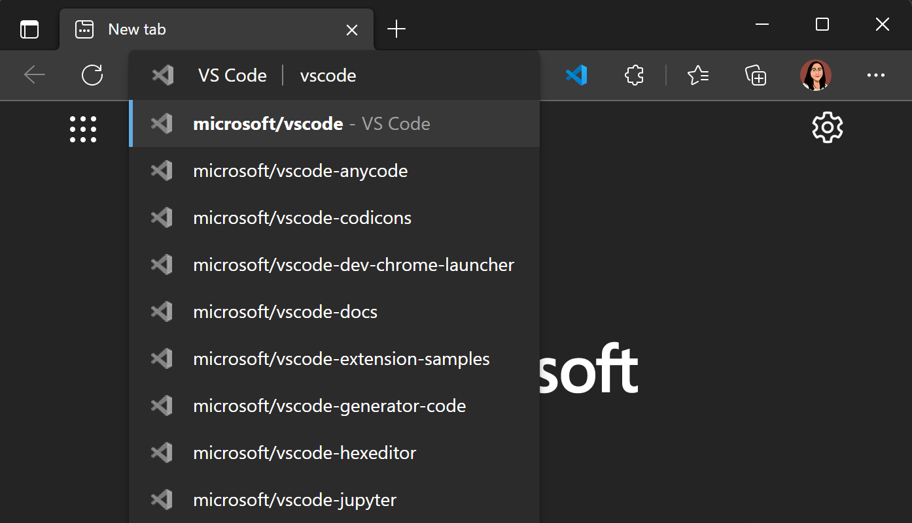
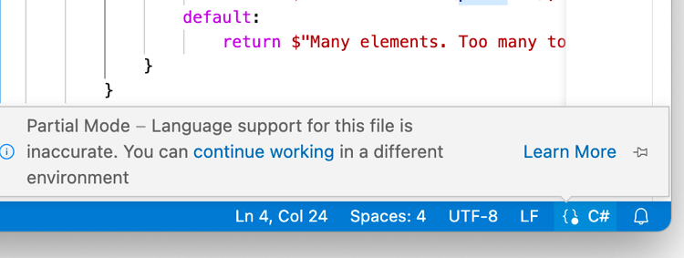
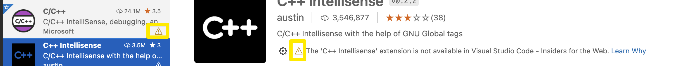
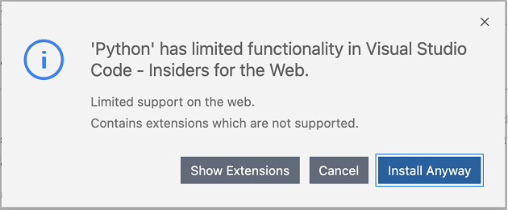
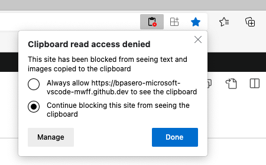

+++
title = "VS Code for the Web"
date = 2024-01-12T22:36:24+08:00
weight = 70
type = "docs"
description = ""
isCJKLanguage = true
draft = false
+++

> 原文: [https://code.visualstudio.com/docs/editor/vscode-web](https://code.visualstudio.com/docs/editor/vscode-web)

# Visual Studio Code for the Web


Visual Studio Code for the Web provides a free, zero-install Microsoft Visual Studio Code experience running entirely in your browser, allowing you to quickly and safely browse source code repositories and make lightweight code changes. To get started, go to [https://vscode.dev](https://vscode.dev/) in your browser.

​​	Visual Studio Code for the Web 提供免费、零安装的 Microsoft Visual Studio Code 体验，完全在您的浏览器中运行，让您能够快速安全地浏览源代码存储库并进行轻量级的代码更改。要开始使用，请在浏览器中访问 https://vscode.dev。

VS Code for the Web has many of the features of VS Code Desktop that you love, including search and syntax highlighting while browsing and editing, along with extension support to work on your codebase and make simpler edits. In addition to opening repositories, forks, and pull requests from source control providers like GitHub and Azure Repos, you can also work with code that is stored on your local machine.

​​	VS Code for the Web 具有许多您喜爱的 VS Code Desktop 功能，包括在浏览和编辑时进行搜索和语法突出显示，以及扩展支持，以便处理您的代码库并进行更简单的编辑。除了从 GitHub 和 Azure Repos 等源代码控制提供程序打开存储库、分支和拉取请求外，您还可以处理存储在本地计算机上的代码。

VS Code for the Web runs entirely in your web browser, so there are certain limitations compared to the desktop experience, which you can read more about [below]().

​​	VS Code for the Web 完全在您的 Web 浏览器中运行，因此与桌面体验相比存在一定的局限性，您可以在下面阅读更多相关信息。

## [Relationship to VS Code Desktop 与 VS Code Desktop 的关系]()

VS Code for the Web provides a browser-based experience for navigating files and repositories and committing lightweight code changes. However, if you need access to a runtime to run, build, or debug your code, you want to use platform features such as a terminal, or you want to run extensions that aren't supported in the web, we recommend moving your work to the desktop application, [GitHub Codespaces](https://github.com/features/codespaces), or using [Remote - Tunnels]() for the full capabilities of VS Code. In addition, VS Code Desktop lets you use a full set of keyboard shortcuts not limited by your browser.

​​	VS Code for the Web 提供基于浏览器的体验，用于导航文件和存储库以及提交轻量级代码更改。但是，如果您需要访问运行时来运行、构建或调试代码，您希望使用平台功能（如终端），或者您希望运行 Web 中不支持的扩展，我们建议您将工作移至桌面应用程序、GitHub Codespaces 或使用 Remote - Tunnels 以获得 VS Code 的全部功能。此外，VS Code Desktop 允许您使用一整套键盘快捷键，而不会受到浏览器的限制。

When you're ready to switch, you'll be able to ["upgrade"]() to the full VS Code experience with a few clicks.

​​	当您准备好切换时，只需单击几下即可“升级”到完整的 VS Code 体验。

You can also switch between the Stable and Insiders versions of VS Code for the Web by selecting the gear icon, then **Switch to Insiders Version...**, or by navigating directly to [https://insiders.vscode.dev](https://insiders.vscode.dev/).

​​	您还可以通过选择齿轮图标，然后选择切换到 Insiders 版本...，或直接导航到 https://insiders.vscode.dev 来在 VS Code for the Web 的稳定版和 Insiders 版本之间切换。

## [Opening a project 打开项目]()

By navigating to [https://vscode.dev](https://vscode.dev/), you can create a new local file or project, work on an existing local project, or access source code repositories hosted elsewhere, such as on GitHub and Azure Repos (part of Azure DevOps).

​​	通过导航到 https://vscode.dev，您可以创建新的本地文件或项目，处理现有本地项目，或访问托管在其他位置的源代码存储库，例如 GitHub 和 Azure Repos（Azure DevOps 的一部分）。

You can create a new local file in the web just as you would in a VS Code Desktop environment, using **File** > **New File** from the Command Palette (F1).

​​	您可以在 Web 中创建新的本地文件，就像在 VS Code 桌面环境中使用“文件”>“命令面板”（F1）中的“新建文件”一样。

## [GitHub repos GitHub 存储库]()

You can open a GitHub repository in VS Code for the Web directly from a URL, following the schema: `https://vscode.dev/github/<organization>/<repo>`. Using the [VS Code repository](https://github.com/microsoft/vscode) as an example, this would look like: `https://vscode.dev/github/microsoft/vscode`.

​​	您可以直接从 URL 在 VS Code for the Web 中打开 GitHub 存储库，按照以下架构： `https://vscode.dev/github/<organization>/<repo>` 。以 VS Code 存储库为例，这看起来像： `https://vscode.dev/github/microsoft/vscode` 。

This experience is delivered at a custom `vscode.dev/github` URL, which is powered by the [GitHub Repositories](https://marketplace.visualstudio.com/items?itemName=GitHub.remotehub) extension (which is part of the broader [Remote Repositories](https://marketplace.visualstudio.com/items?itemName=ms-vscode.remote-repositories) extension).

​​	此体验通过自定义 `vscode.dev/github` URL 提供，该 URL 由 GitHub 存储库扩展（作为更广泛的远程存储库扩展的一部分）提供支持。

GitHub Repositories allows you to remotely browse and edit a repository from within the editor, without needing to pull code onto your local machine. You can learn more about the extension and how it works in our [GitHub Repositories]() guide.

​​	GitHub 存储库允许您在编辑器中远程浏览和编辑存储库，而无需将代码拉取到本地计算机上。您可以在我们的 GitHub 存储库指南中了解有关该扩展的更多信息以及它的工作原理。

> **Note**: The [GitHub Repositories](https://marketplace.visualstudio.com/items?itemName=GitHub.remotehub) extension works in VS Code Desktop as well to provide fast repository browsing and editing. Once you have the extension installed, you can open a repo with the **GitHub Repositories: Open Repository...** command.
>
> ​​	注意：GitHub 存储库扩展也适用于 VS Code 桌面，以提供快速存储库浏览和编辑。安装扩展后，您可以使用 GitHub 存储库：打开存储库... 命令打开存储库。

You can also open GitHub repositories in `vscode.dev` through your browser's search bar (aka omnibox) by installing the `vscode.dev` [extension](https://chrome.google.com/webstore/detail/vs-code/kobakmhnkfaghloikphojodjebdelppk) for Chrome and Edge. Then, type `code` to activate the omnibox, followed by your repository's name. Suggestions are populated by your browser search history, so if the repo you want doesn't come up, you can also type in the fully qualified `<owner>/<repo>` name to open it, for example `microsoft/vscode`.

​​	您还可以通过安装适用于 Chrome 和 Edge 的 `vscode.dev` 扩展，在浏览器的搜索栏（又称万能搜索框）中打开 GitHub 存储库。然后，键入 `code` 以激活万能搜索框，然后输入存储库的名称。建议会根据您的浏览器搜索历史记录填充，因此，如果您想要的存储库没有出现，您还可以键入完全限定的 `<owner>/<repo>` 名称以打开它，例如 `microsoft/vscode` 。



If you're already in VS Code for the Web at [https://vscode.dev](https://vscode.dev/), you can alternatively navigate to different repos via the [Remote Repositories](https://marketplace.visualstudio.com/items?itemName=ms-vscode.remote-repositories) extension commands. Select the remote indicator in the lower left of the Status bar, and you'll be presented with the **Open Remote Repository...** command.

​​	如果您已在 https://vscode.dev 中使用 VS Code for the Web，则可以通过远程存储库扩展命令导航到不同的存储库。选择状态栏左下角的远程指示器，您将看到“打开远程存储库...”命令。


## [Azure Repos]()

You can open Azure Repos just like Github repos in VS Code for the Web.

​​	您可以在 VS Code for the Web 中像打开 Github 存储库一样打开 Azure Repos。

When you navigate to a URL with the schema `https://vscode.dev/azurerepos/<organization>/<project>/<repo>`, you will be able to read, search the files in the repo, and commit your changes to Azure Repos. You can fetch, pull, and sync changes, and view branches.

​​	当您导航到具有架构 `https://vscode.dev/azurerepos/<organization>/<project>/<repo>` 的 URL 时，您将能够读取、搜索存储库中的文件，并将您的更改提交到 Azure Repos。您可以获取、拉取和同步更改，并查看分支。

You can open any repository, branch, or tag from Azure Repos in VS Code for the Web by prefixing `vscode.dev` to the Azure Repos URL.

​​	您可以在 VS Code for the Web 中通过在 Azure Repos URL 前加上 `vscode.dev` 来打开 Azure Repos 中的任何存储库、分支或标记。

Alternatively, when you are on an Azure DevOps repository or pull request, you can press (.) to open it in VS Code for the Web.

​​	或者，当您在 Azure DevOps 存储库或拉取请求中时，可以按 (.) 在 VS Code for the Web 中将其打开。

## [More custom URLs 更多自定义 URL]()

Like in the desktop, you can customize VS Code for the Web through a rich ecosystem of extensions that support just about every back end, language, and service. `vscode.dev` includes URLs that provide shortcuts to common experiences.

​​	与桌面一样，您可以通过一个丰富的扩展生态系统自定义 VS Code for the Web，该生态系统支持几乎所有后端、语言和服务。 `vscode.dev` 包括提供常见体验的快捷方式的 URL。

We've explored a couple of URLs already (`vscode.dev/github` and `vscode.dev/azurerepos`). Here's a more complete list:

​​	我们已经探索了几个 URL（ `vscode.dev/github` 和 `vscode.dev/azurerepos` ）。以下是更完整的列表：

| Service 服务                                      | URL Structure URL 结构                                       | Docs 文档                                                    |
| :------------------------------------------------ | :----------------------------------------------------------- | :----------------------------------------------------------- |
| GitHub                                            | `/github/<org>/<repo>`                                       | [More info above 上面的更多信息]() |
| Azure Repos                                       | `/azurerepos/<org>/<project>/<repo>`                         | [More info above 上面的更多信息]() |
| Visual Studio Live Share                          | `/editor/liveshare/<sessionId>`                              | [More info below 更多信息如下]() |
| Visual Studio Marketplace                         | `/editor/marketplace/<marketplacePublisher>` `/<extensionId>/<extensionVersion>` | [Example route](https://insiders.vscode.dev/editor/marketplace/Brigit/devcontainer-image-convert/0.0.1) to edit [this extension](https://marketplace.visualstudio.com/items?itemName=Brigit.devcontainer-image-convert) 编辑此扩展的示例路线 |
| Power Pages                                       | `/power/pages`                                               | [Power Pages docs Power Pages 文档](https://learn.microsoft.com/power-pages/configure/visual-studio-code-editor) |
| Profiles 配置文件                                 | `/editor/profile/github/<GUID>`                              | [Profiles docs Profiles 文档]() |
| Themes 主题                                       | `/editor/theme/<extensionId>`                                | [More info below 更多信息如下]() |
| MakeCode                                          | `/edu/makecode`                                              | [MakeCode docs MakeCode 文档](https://arcade.makecode.com/vscode) |
| VS Code for Education                             | `/edu`                                                       | [VS Code for Education landing page VS Code for Education 登陆页面](https://vscodeedu.com/) |
| Azure Machine Learning (AML) Azure 机器学习 (AML) | `/+ms-toolsai.vscode-ai-remote-web`                          | [AML docs AML 文档](https://learn.microsoft.com/azure/machine-learning/how-to-launch-vs-code-remote?view=azureml-api-2&tabs=vscode-web) |

Please note that some URLs must be entered in a specific way (for example, `vscode.dev/editor/liveshare` requires an active Live Share session). Please review each service's documentation for specific access and usage information.

​​	请注意，某些 URL 必须以特定方式输入（例如， `vscode.dev/editor/liveshare` 需要一个活动的 Live Share 会话）。请查看每项服务的文档，了解具体的访问和使用信息。

There's more information on some of these URLs below.

​​	下面是其中一些 URL 的更多信息。

### [Themes 主题]()

You can share and experience color themes through VS Code for the Web through the URL schema: `https://vscode.dev/editor/theme/<extensionId>`.

​​	您可以通过 URL 架构 `https://vscode.dev/editor/theme/<extensionId>` 在 VS Code for the Web 中共享和体验颜色主题。

For instance, you can go to https://vscode.dev/editor/theme/sdras.night-owl to experience the [Night Owl theme](https://marketplace.visualstudio.com/items?itemName=sdras.night-owl) without having to go through the download and install process.

​​	例如，您可以访问 https://vscode.dev/editor/theme/sdras.night-owl 来体验 Night Owl 主题，而无需经历下载和安装过程。

> Note: The color theme URL schema works for themes that are fully declarative (no code).
>
> ​​	注意：颜色主题 URL 架构适用于完全声明性（无代码）的主题。

An extension can define multiple themes. You can use the schema `/editor/theme/<extensionId>/<themeName>`. If no `themeName` is specified, VS Code for the Web will take the first theme.

​​	扩展可以定义多个主题。您可以使用架构 `/editor/theme/<extensionId>/<themeName>` 。如果未指定 `themeName` ，VS Code for the Web 将采用第一个主题。

As a theme author, you can add the following badge to your extension readme to allow users to easily try out your theme in VS Code for the Web (replacing `<extensionId>` with your theme extension's unique identifier):

​​	作为主题作者，您可以将以下徽章添加到扩展自述文件中，以便用户轻松地在 VS Code for the Web 中试用您的主题（用您的主题扩展的唯一标识符替换 `<extensionId>` ）：

```
[](https://vscode.dev/editor/theme/<extensionId>)
```

### [Visual Studio Live Share]()

[Live Share](https://marketplace.visualstudio.com/items?itemName=MS-vsliveshare.vsliveshare) guest sessions are available in the browser through the `https://vscode.dev/editor/liveshare` URL. The `sessionId` will be passed to the extension to make joining a seamless experience.

​​	Live Share 客人会话可通过 `https://vscode.dev/editor/liveshare` URL 在浏览器中使用。将 `sessionId` 传递给扩展，以使加入成为无缝体验。

## [Continue working in a different environment 在其他环境中继续工作]()

In some cases, you will want to access a different environment that has the ability to run code. You can switch to working on a repository in a development environment that has support for a local file system and full language and development tooling.

​​	在某些情况下，您会希望访问能够运行代码的不同环境。您可以切换到在开发环境中处理存储库，该环境支持本地文件系统以及完整的语言和开发工具。

The GitHub Repositories extension makes it easy for you to clone the repository locally, reopen it on the desktop, or create a GitHub codespace for the current repository (if you have the [GitHub Codespaces](https://marketplace.visualstudio.com/items?itemName=GitHub.codespaces) extension installed and access to create GitHub codespaces). To do this, use the **Continue Working On...** command available from the Command Palette (F1) or click on the Remote indicator in the Status bar.

​​	GitHub Repositories 扩展使您可以轻松地在本地克隆存储库、在桌面上重新打开存储库或为当前存储库创建 GitHub 代码空间（如果您已安装 GitHub Codespaces 扩展并有权创建 GitHub 代码空间）。为此，请使用“命令面板”(F1) 中提供的“继续处理...”命令，或单击状态栏中的“远程”指示器。

## [Saving and sharing work 保存和共享工作]()

When working on a local file in the web, your work is saved automatically if you have [Auto Save]() enabled. You can also save manually as you do when working in desktop VS Code (for example **File** > **Save**).

​​	在网络中处理本地文件时，如果已启用自动保存，您的工作会自动保存。您也可以像在桌面 VS Code 中工作时一样手动保存（例如文件 > 保存）。

When working on a remote repository, your work is saved in the browser's local storage until you commit it. If you open a repo or pull request using GitHub Repositories, you can push your changes in the Source Control view to persist any new work.

​​	在远程存储库中工作时，您的工作会保存在浏览器的本地存储中，直到您提交它。如果您使用 GitHub 存储库打开存储库或拉取请求，您可以在源代码管理视图中推送您的更改以保留任何新工作。

You can also continue working in other environments via [Continue Working On]().

​​	您还可以通过继续处理继续在其他环境中工作。

The first time that you use **Continue Working On** with uncommitted changes, you will have the option to bring your edits to your selected development environment using **Cloud Changes**, which uses a VS Code service to store your pending changes. This is described further in the [GitHub Repositories]() doc.

​​	第一次使用继续处理处理未提交的更改时，您将可以选择使用云更改将您的编辑内容带到您选择的开发环境，云更改使用 VS Code 服务来存储您的待处理更改。这在 GitHub 存储库文档中进行了进一步描述。

## [Use your own compute with Remote Tunnels 使用远程隧道使用您自己的计算]()

You may develop against another machine in VS Code for the Web using the [Remote - Tunnels](https://marketplace.visualstudio.com/items?itemName=ms-vscode.remote-server) extension.

​​	您可以使用远程 - 隧道扩展在 VS Code for the Web 中针对另一台计算机进行开发。

The Remote - Tunnels extension lets you connect to a remote machine, like a desktop PC or virtual machine (VM), via a secure tunnel. You can then securely connect to that machine from anywhere, without the requirement of SSH. This lets you "bring your own compute" to vscode.dev, enabling additional scenarios like running your code in the browser.

​​	Remote - Tunnels 扩展程序允许您通过安全隧道连接到远程计算机，例如台式机或虚拟机 (VM)。然后，您可以从任何地方安全地连接到该计算机，而无需 SSH。这使您能够将“自己的计算”带到 vscode.dev，从而实现其他方案，例如在浏览器中运行代码。

You may learn more about Remote - Tunnels in its [documentation]().

​​	您可以在其文档中了解有关 Remote - Tunnels 的更多信息。

## [Safe exploration 安全探索]()

VS Code for the Web runs entirely in your web browser's sandbox and offers a very limited execution environment.

​​	VS Code for the Web 完全在您的网络浏览器的沙盒中运行，并提供非常有限的执行环境。

When accessing code from remote repositories, the web editor doesn't "clone" the repo, but instead loads the code by invoking the services' APIs directly from your browser; this further reduces the attack surface when cloning untrusted repositories.

​​	在从远程存储库访问代码时，Web 编辑器不会“克隆”存储库，而是通过直接从您的浏览器调用服务的 API 来加载代码；这进一步减少了克隆不受信任的存储库时的攻击面。

When working with local files, VS Code for the Web loads them through your browser's file system access APIs, which limit the scope of what the browser can access.

​​	在使用本地文件时，VS Code for the Web 会通过浏览器的文件系统访问 API 加载它们，这限制了浏览器可以访问的范围。

## [Run anywhere 随处运行]()

Similar to [GitHub Codespaces](), VS Code for the Web can run on tablets, like iPads.

​​	与 GitHub Codespaces 类似，VS Code for the Web 可以在平板电脑（如 iPad）上运行。

## [Language support 语言支持]()

Language support is a bit more nuanced on the web, including code editing, navigation, and browsing. The desktop experiences are typically powered by language services and compilers that expect a file system, runtime, and compute environment. In the browser, these experiences are powered by language services running in the browser that provide source code tokenization and syntax colorization, completions, and many single-file operations.

​​	在网络上，语言支持更加细致入微，包括代码编辑、导航和浏览。桌面体验通常由语言服务和编译器提供支持，这些服务和编译器需要文件系统、运行时和计算环境。在浏览器中，这些体验由浏览器中运行的语言服务提供支持，这些服务提供源代码标记化和语法着色、完成以及许多单文件操作。

Generally, experiences fall into the following categories:

​​	通常，体验分为以下几类：

- **Good:** For most programming languages, VS Code for the Web gives you code syntax colorization, text-based completions, and bracket pair colorization. Using a [Tree-sitter](https://tree-sitter.github.io/tree-sitter) syntax tree through the [anycode extension](https://marketplace.visualstudio.com/items?itemName=ms-vscode.anycode), we're able to provide additional experiences such as **Outline/Go to Symbol** and **Symbol Search** for popular languages such as C/C++, C#, Java, PHP, Rust, and Go.
  良好：对于大多数编程语言，VS Code for the Web 为您提供代码语法着色、基于文本的完成和括号对颜色。通过 anycode 扩展使用树形语法树，我们能够为 C/C++、C#、Java、PHP、Rust 和 Go 等常用语言提供其他体验，例如大纲/转到符号和符号搜索。
- **Better:** The TypeScript, JavaScript, and Python experiences are all powered by language services that run natively in the browser. With these programming languages, you'll get the "**Good**" experience plus rich single file completions, semantic highlighting, syntax errors, and more.
  更好：TypeScript、JavaScript 和 Python 体验均由浏览器中本机运行的语言服务提供支持。使用这些编程语言，您将获得“良好”的体验，以及丰富的单文件完成、语义突出显示、语法错误等。
- **Best:** For many "webby" languages, such as JSON, HTML, CSS, and LESS, etc., the coding experience in vscode.dev is nearly identical to the desktop (including Markdown preview!).
  最佳：对于许多“网络”语言，例如 JSON、HTML、CSS 和 LESS 等，vscode.dev 中的编码体验几乎与桌面相同（包括 Markdown 预览！）。

You can determine the level of language support in your current file through the Language Status Indicator in the Status bar:

​​	您可以通过状态栏中的语言状态指示器确定当前文件中语言支持的级别：



## [Limitations 局限性]()

Since VS Code for the Web runs completely within the browser, some experiences will naturally be more constrained when compared to what you can do in the desktop app. For example, the terminal and debugger are not available, which makes sense since you can't compile, run, and debug a Rust or Go application within the browser sandbox.

​​	由于 VS Code for the Web 完全在浏览器中运行，因此与您在桌面应用程序中可以执行的操作相比，某些体验自然会受到更多限制。例如，终端和调试器不可用，因为您无法在浏览器沙盒中编译、运行和调试 Rust 或 Go 应用程序。

### [Extensions 扩展]()

Only a subset of extensions can run in the browser. You can use the Extensions view to install extensions in the web, and extensions that cannot be installed will have a warning icon and **Learn Why** link. We expect more extensions to become enabled over time.

​​	只有部分扩展可以在浏览器中运行。您可以使用“扩展”视图在网络中安装扩展，而无法安装的扩展将带有警告图标和“了解原因”链接。我们预计随着时间的推移，将启用更多扩展。



When you install an extension, it is saved in the browser's local storage. You can ensure your extensions are synced across VS Code instances, including different browsers and even the desktop, by enabling [Settings Sync]().

​​	安装扩展时，它将保存在浏览器的本地存储中。您可以通过启用设置同步来确保您的扩展在 VS Code 实例（包括不同的浏览器甚至桌面）之间同步。

When an Extension Pack contains extensions that do not run in the browser sandbox, you will get an informational message with the option to see the extensions included in the pack.

​​	当扩展包包含无法在浏览器沙盒中运行的扩展时，您将收到一条包含查看包中包含的扩展的选项的信息消息。



When extensions are executed in the browser sandbox, they are more restricted. Extensions that are purely declarative, such as most themes, snippets, or grammars, can run unmodified and are available in VS Code for the Web without any modification from the extension authors. Extensions that are running code need to be updated to support running in the browser sandbox. You can read more about what is involved to support extensions in the browser in the [web extension authors guide](https://code.visualstudio.com/api/extension-guides/web-extensions).

​​	当扩展在浏览器沙盒中执行时，它们受到更多限制。纯声明性扩展（例如大多数主题、代码段或语法）可以运行且无需修改，并且在 VS Code for the Web 中可用，无需扩展作者进行任何修改。正在运行代码的扩展需要更新以支持在浏览器沙盒中运行。您可以在 Web 扩展作者指南中阅读有关在浏览器中支持扩展的更多信息。

There are also extensions that run in the browser with partial support only. A good example is a language extension that [restricts its support]() to single files or the currently opened files.

​​	还有一些扩展仅在浏览器中运行，且仅提供部分支持。一个很好的示例是将支持限制为单个文件或当前打开文件的语言扩展。

### [File system API 文件系统 API]()

Edge and Chrome today support the [File System API](https://developer.mozilla.org/docs/Web/API/File_System_Access_API), allowing web pages to access the local file system. If your browser does not support the File System API, you cannot open a folder locally, but you can open files instead.

​​	Edge 和 Chrome 目前支持文件系统 API，允许网页访问本地文件系统。如果您的浏览器不支持文件系统 API，则无法在本地打开文件夹，但您可以打开文件。

### [Browser support 浏览器支持]()

You can use VS Code for the Web in the latest versions of Chrome, Edge, Firefox, and Safari. Older versions of each browser may not work - we only guarantee support for the latest version.

​​	您可以在最新版本的 Chrome、Edge、Firefox 和 Safari 中使用 VS Code for the Web。较旧版本的每个浏览器可能无法使用 - 我们仅保证对最新版本提供支持。

> **Tip:** One way to check the compatible browser version is to look at the version of [Playright](https://playwright.dev/) currently used for testing VS Code and review its supported browser versions. You can find the currently used Playwright version in the VS Code repo's [package.json](https://github.com/microsoft/vscode/blob/main/package.json) file at `devDependencies/@playwright/test`. Once you know the Playwright version, for example `1.37`, you can then review the **Browser Versions** section in their [Release notes](https://playwright.dev/docs/release-notes).
>
> ​​	提示：检查兼容浏览器版本的一种方法是查看当前用于测试 VS Code 的 Playright 版本并查看其支持的浏览器版本。您可以在 VS Code 存储库的 package.json 文件中找到当前使用的 Playwright 版本，网址为 `devDependencies/@playwright/test` 。一旦您知道 Playwright 版本，例如 `1.37` ，您就可以查看其发行说明中的浏览器版本部分。

Webviews might appear differently or have some unexpected behavior in Firefox and Safari. You can view issue queries in the VS Code GitHub repo to track issues related to specific browsers, such as with the [Safari label](https://github.com/microsoft/vscode/labels/safari) and [Firefox label](https://github.com/microsoft/vscode/labels/firefox).

​​	Webview 在 Firefox 和 Safari 中可能看起来不同或有一些意外的行为。您可以在 VS Code GitHub 存储库中查看问题查询以跟踪与特定浏览器相关的问题，例如 Safari 标签和 Firefox 标签。

There are additional steps you can take to improve your browser experience using VS Code for the Web. Review the [Additional browser setup]() section for more information.

​​	您可以采取其他步骤来改善使用 VS Code for the Web 的浏览器体验。有关更多信息，请查看其他浏览器设置部分。

### [Mobile support 移动设备支持]()

You can use VS Code for the Web on mobile devices, but smaller screens may have certain limitations.

​​	您可以在移动设备上使用 VS Code for the Web，但较小的屏幕可能存在某些限制。

### [Keybindings 键绑定]()

Certain keybindings may also work differently in the web.

​​	某些键绑定在网络中也可能以不同的方式工作。

| Issue 问题                                                   | Reason 原因                                                  |
| :----------------------------------------------------------- | :----------------------------------------------------------- |
| Ctrl+Shift+P won't launch the Command Palette in Firefox. Ctrl+Shift+P 不会在 Firefox 中启动命令面板。 | Ctrl+Shift+P is reserved in Firefox. Ctrl+Shift+P 在 Firefox 中已被保留。 As a workaround, use F1 to launch the Command Palette. 作为解决方法，请使用 F1 启动命令面板。 |
| Ctrl+N for new file doesn't work in web. Ctrl+N 无法在 Web 中新建文件。 | Ctrl+N opens a new window instead. Ctrl+N 则会打开一个新窗口。 As a workaround, you can use Ctrl+Alt+N (Cmd+Alt+N on macOS). 作为解决方法，您可以使用 Ctrl+Alt+N（在 macOS 上为 Cmd+Alt+N）。 |
| Ctrl+W for closing an editor doesn't work in web. Ctrl+W 无法在 Web 中关闭编辑器。 | Ctrl+W closes the current tab in browsers. 在浏览器中，Ctrl+W 关闭当前选项卡。 As a workaround, you can use Ctrl+Shift+Alt+N (Cmd+Shift+Alt+N on macOS). 作为一种解决方法，您可以使用 Ctrl+Shift+Alt+N（在 macOS 上为 Cmd+Shift+Alt+N）。 |
| Ctrl+Shift+B will not toggle the favorites bar in the browser. Ctrl+Shift+B 不会在浏览器中切换收藏栏。 | VS Code for the Web overrides this and redirects to the "Build" menu in the Command Palette. VS Code for the Web 会覆盖此操作，并重定向到命令面板中的“生成”菜单。 |
| Alt+Left and Alt+Right should navigate within the editor but may incorrectly trigger tab history navigation. Alt+左箭头和 Alt+右箭头应在编辑器内导航，但可能会错误地触发选项卡历史记录导航。 | If focus is outside the editor, these shortcuts trigger tab history navigation instead. 如果焦点不在编辑器外，这些快捷方式会触发选项卡历史记录导航。 |

## [Additional browser setup 其他浏览器设置]()

There are additional browser configuration steps you can take when working with VS Code in a browser.

​​	在浏览器中使用 VS Code 时，您可以执行其他浏览器配置步骤。

### [Opening new tabs and windows 打开新选项卡和窗口]()

In certain cases, you may need to open a new tab or window while working in VS Code for the Web. VS Code might ask you for permission to access the clipboard when reading from it. Depending on your browser, you may grant access to the clipboard or otherwise allow for pop-up windows in different ways:

​​	在某些情况下，您可能需要在 VS Code for the Web 中工作时打开新选项卡或窗口。VS Code 可能会在从剪贴板读取时要求您授予访问剪贴板的权限。根据您的浏览器，您可以通过不同的方式授予对剪贴板的访问权限或允许弹出窗口：

- Chrome, Edge, Firefox: Search for "site permissions" in your browser's settings, or look for the following option in the address bar on the right:
  Chrome、Edge、Firefox：在浏览器的设置中搜索“网站权限”，或在右侧的地址栏中查找以下选项：



- Safari: In the Safari browser, go to **Preferences...** > **Websites** > **Pop-up Windows** > the domain you're accessing (for example, `vscode.dev`), and select **Allow** from the dropdown.
  Safari：在 Safari 浏览器中，转到“首选项...”>网站>弹出窗口>您正在访问的域（例如， `vscode.dev` ），然后从下拉列表中选择“允许”。
