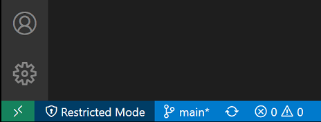
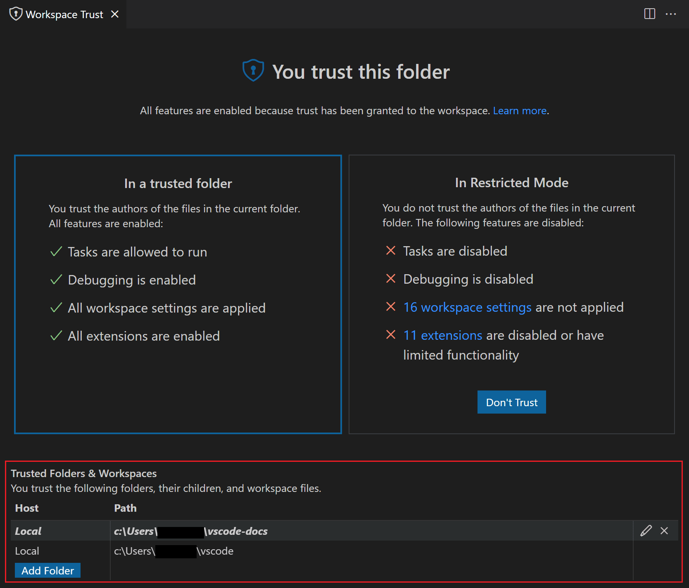

+++
title = "Workspace Trust"
date = 2024-01-12T22:36:24+08:00
weight = 140
type = "docs"
description = ""
isCJKLanguage = true
draft = false
+++

> 原文: [https://code.visualstudio.com/docs/editor/workspace-trust](https://code.visualstudio.com/docs/editor/workspace-trust)

# Workspace Trust 工作区信任


Visual Studio Code takes security seriously and wants to help you safely browse and edit code no matter the source or original authors. The Workspace Trust feature lets you decide whether code in your project folder can be executed by VS Code and extensions without your explicit approval.

​​	Visual Studio Code 非常重视安全性，无论源代码或原始作者是谁，都希望帮助您安全地浏览和编辑代码。工作区信任功能可让您决定是否可以在未经您明确批准的情况下由 VS Code 和扩展执行项目文件夹中的代码。


> **Note**: When in doubt, leave a folder in [Restricted Mode](https://code.visualstudio.com/docs/editor/workspace-trust#_restricted-mode). You can always [enable trust](https://code.visualstudio.com/docs/editor/workspace-trust#_trusting-a-workspace) later.
>
> ​​	注意：如有疑问，请将文件夹保留在受限模式下。您始终可以在以后启用信任。

## [Safe code browsing 安全代码浏览](https://code.visualstudio.com/docs/editor/workspace-trust#_safe-code-browsing)

It's great that there is so much source code available on public repositories and file shares. No matter the coding task or problem, there is probably already a good solution available somewhere. It is also great that there are so many powerful coding tools available to help you understand, debug, and optimize your code. However, using open-source code and tools does have risks, and you can leave yourself open to malicious code execution and exploits.

​​	在公共存储库和文件共享中提供如此多的源代码真是太好了。无论编码任务或问题是什么，可能某个地方已经有了很好的解决方案。同样很棒的是，有如此多的强大编码工具可帮助您理解、调试和优化代码。但是，使用开源代码和工具确实存在风险，您可能会使自己面临恶意代码执行和漏洞利用的风险。

Workspace Trust provides an extra layer of security when working with unfamiliar code, by preventing automatic code execution of any code in your workspace if the workspace is open in "Restricted Mode".

​​	如果工作区以“受限模式”打开，工作区信任会在处理不熟悉代码时提供额外的安全层，防止自动执行工作区中的任何代码。

> **Note**: The terms "workspace" and "folder" are used widely in the VS Code UI and documentation. You can think of a ["workspace"](https://code.visualstudio.com/docs/editor/workspaces) as a folder with extra metadata created and used by VS Code.
>
> ​​	注意：术语“工作区”和“文件夹”广泛用于 VS Code UI 和文档中。您可以将“工作区”视为一个文件夹，其中包含 VS Code 创建和使用的额外元数据。

## [Restricted Mode 受限模式](https://code.visualstudio.com/docs/editor/workspace-trust#_restricted-mode)

When prompted by the Workspace Trust dialog, if you choose **No, I don't trust the authors**, VS Code will go into Restricted Mode to prevent code execution. The workbench will display a banner at the top with links to **Manage** your folder via the Workspace Trust editor, and **Learn More** about Workspace Trust (which takes you to back to this documentation).

​​	当工作区信任对话框提示您时，如果您选择否，我不信任作者，VS Code 将进入受限模式以防止代码执行。工作台将在顶部显示一个横幅，其中包含通过工作区信任编辑器管理文件夹的链接，以及了解有关工作区信任的更多信息（将您带回此文档）。


You will also see a Restricted Mode badge in the Status bar.

​​	您还将在状态栏中看到受限模式徽章。



Restricted Mode tries to prevent automatic code execution by disabling or limiting the operation of several VS Code features: tasks, debugging, workspace settings, and extensions.

​​	受限模式尝试通过禁用或限制几个 VS Code 功能的操作来防止自动代码执行：任务、调试、工作区设置和扩展。

To see the full list of features disabled in Restricted Mode, you can open the Workspace Trust editor via the **Manage** link in the banner, or by clicking the Restricted Mode badge in the Status bar.

​​	要查看受限模式中禁用的功能的完整列表，您可以通过横幅中的管理链接或单击状态栏中的受限模式徽章来打开工作区信任编辑器。


> **Note**: Workspace Trust can not prevent a malicious extension from executing code and ignoring **Restricted Mode**. You should only install and run extensions that come from a well-known publisher that you trust.
>
> ​​	注意：工作区信任无法阻止恶意扩展执行代码并忽略受限模式。您应该只安装和运行来自您信任的知名发布者的扩展。

### [Tasks 任务](https://code.visualstudio.com/docs/editor/workspace-trust#_tasks)

[Tasks](https://code.visualstudio.com/docs/editor/tasks) can run scripts and tool binaries, and because task definitions are defined in the workspace `.vscode` folder, they are part of the committed source code for a repo, and shared to every user of that repo. Were someone to create a malicious task, it could be unknowingly run by anyone who cloned that repository.

​​	任务可以运行脚本和工具二进制文件，并且由于任务定义是在工作区 `.vscode` 文件夹中定义的，因此它们是存储库的已提交源代码的一部分，并与该存储库的每个用户共享。如果有人创建恶意任务，则克隆该存储库的任何人都可能在不知情的情况下运行该任务。

If you try to run or even enumerate tasks (**Terminal** > **Run Task...**) while in Restricted Mode, VS Code will display a prompt to trust the folder and continue executing the task. Cancelling the dialog leaves VS Code in Restricted Mode.

​​	如果在受限模式下尝试运行或甚至枚举任务（终端 > 运行任务...），VS Code 将显示一个提示，以信任该文件夹并继续执行任务。取消该对话框将使 VS Code 保持在受限模式。


### [Debugging 调试](https://code.visualstudio.com/docs/editor/workspace-trust#_debugging)

Similar to running a VS Code task, debug extensions can run debugger binaries when launching a debug session. For that reason, [debugging](https://code.visualstudio.com/docs/editor/debugging) is also disabled when a folder is open in Restricted Mode.

​​	与运行 VS Code 任务类似，调试扩展可以在启动调试会话时运行调试器二进制文件。因此，当文件夹在受限模式下打开时，调试也会被禁用。

If you try to start a debug session (**Run** > **Start Debugging**) while in Restricted Mode, VS Code will display a prompt to trust the folder and continue launching the debugger. Cancelling the dialog leaves VS Code in Restricted Mode, and does not start the debug session.

​​	如果在受限模式下尝试启动调试会话（运行 > 启动调试），VS Code 将显示一个提示，以信任该文件夹并继续启动调试器。取消该对话框将使 VS Code 保持在受限模式，并且不会启动调试会话。


### [Workspace settings 工作区设置](https://code.visualstudio.com/docs/editor/workspace-trust#_workspace-settings)

Workspace [settings](https://code.visualstudio.com/docs/getstarted/settings) are stored in the `.vscode` folder at the root of your workspace, and are therefore shared by anyone who clones the workspace repository. Some settings contain paths to executables (for example, linter binaries), which if set to point to malicious code, could do damage. For this reason, there is a set of workspace settings that are disabled when running in Restricted Mode.

​​	工作区设置存储在工作区根目录下的 `.vscode` 文件夹中，因此由克隆工作区存储库的任何人都共享。某些设置包含可执行文件的路径（例如，linter 二进制文件），如果将其设置为指向恶意代码，则可能会造成损害。出于此原因，在受限模式下运行时，有一组工作区设置被禁用。


In the Workspace Trust editor, there is a link to display the workspace settings that aren't being applied. Clicking the link brings up the Settings editor scoped by the `@tag:requireTrustedWorkspace` tag.

​​	在工作区信任编辑器中，有一个链接可显示未应用的工作区设置。单击该链接会打开范围由 `@tag:requireTrustedWorkspace` 标记设置的设置编辑器。


### [Extensions 扩展](https://code.visualstudio.com/docs/editor/workspace-trust#_extensions)

The VS Code [extensions](https://code.visualstudio.com/docs/editor/extension-marketplace) ecosystem is incredibly rich and diverse. People have created extensions to help with just about any programming task or editor customization. Some extensions provide full programming language support (IntelliSense, debugging, code analysis), and others let you play music or have virtual [pets](https://marketplace.visualstudio.com/items?itemName=tonybaloney.vscode-pets).

​​	VS Code 扩展生态系统非常丰富且多样。人们创建扩展来帮助完成几乎任何编程任务或编辑器自定义。某些扩展提供完整的编程语言支持（IntelliSense、调试、代码分析），而其他扩展则允许您播放音乐或拥有虚拟宠物。

Most extensions run code on your behalf and could potentially do harm. Some extensions have settings that could cause them to act maliciously if configured to run an unexpected executable. For this reason, extensions that have not explicitly opted into Workspace Trust are disabled by default in Restricted Mode.

​​	大多数扩展程序会代表您运行代码，并可能造成潜在的危害。某些扩展程序具有可能导致其在配置为运行意外的可执行文件时执行恶意操作的设置。出于此原因，在受限模式下，默认情况下会禁用尚未明确选择加入工作区信任的扩展程序。


You can review an installed extension's status by clicking the **extensions are disabled or have limited functionality** link in the Workspace Trust editor, which displays the Extensions view scoped with the `@workspaceUnsupported` filter.

​​	您可以通过点击工作区信任编辑器中的扩展程序已禁用或功能受限链接来查看已安装扩展程序的状态，该链接会显示范围为 `@workspaceUnsupported` 筛选器的扩展程序视图。


**Disabled in Restricted Mode
在受限模式下禁用**

Extensions that have either not explicitly indicated that they support running in Restricted Mode are shown in the **Disabled in Restricted Mode** section. An extension author can also indicate that they never want to be enabled in Restricted Mode if they determine that their extension could be misused by modifications (settings or files) in a workspace.

​​	尚未明确表明支持在受限模式下运行的扩展程序会显示在“在受限模式下禁用”部分。如果扩展程序作者确定其扩展程序可能会被工作区中的修改（设置或文件）滥用，他们还可以表明他们永远不想在受限模式下启用该扩展程序。

**Limited in Restricted Mode
在受限模式下受限**

Extension authors can also evaluate their extensions for possible security vulnerabilities and declare that they have **limited** support when running in Restricted Mode. This mode means the extension may disable some features or functionality to prevent a possible exploit.

​​	扩展作者还可以评估其扩展的潜在安全漏洞，并声明它们在受限模式下运行时支持有限。此模式意味着扩展可能会禁用某些功能或功能以防止可能的利用。

Extensions can add custom text to the Extensions view Workspace Trust badge explaining the limitation when running in an untrusted folder.

​​	扩展可以向扩展视图工作区信任徽章添加自定义文本，以解释在不受信任的文件夹中运行时的限制。

For example, the VS Code built-in PHP extension limits the use of the `php.validate.executablePath` setting to trusted folders since overriding this setting could run a malicious program.

​​	例如，VS Code 内置 PHP 扩展将 `php.validate.executablePath` 设置的使用限制为受信任的文件夹，因为覆盖此设置可能会运行恶意程序。


You can override an extension's Workspace Trust support level using the `extensions.supportUntrustedWorkspaces` setting described in the [Enabling extensions](https://code.visualstudio.com/docs/editor/workspace-trust#_enabling-extensions) section below.

​​	您可以使用下面启用扩展部分中描述的 `extensions.supportUntrustedWorkspaces` 设置覆盖扩展的工作区信任支持级别。

If you try to install an extension in Restricted Mode, you will be prompted to either trust the workspace or just install the extension. If the extension doesn't support Workspace Trust, it will be installed, but be disabled or running with limited functionality.

​​	如果您尝试在受限模式下安装扩展，系统将提示您信任工作区或仅安装扩展。如果扩展不支持工作区信任，它将被安装，但会被禁用或以有限的功能运行。


> **Note**: Extension authors can learn how to update their extensions to support Workspace Trust by reading the [Workspace Trust Extension Guide](https://code.visualstudio.com/api/extension-guides/workspace-trust).
>
> ​​	注意：扩展作者可以通过阅读工作区信任扩展指南了解如何更新其扩展以支持工作区信任。

## [Trusting a workspace 信任工作区](https://code.visualstudio.com/docs/editor/workspace-trust#_trusting-a-workspace)

If you trust the authors and maintainers of a project, you can trust the project's folder on your local machine. For example, it is usually safe to trust repositories from well-known GitHub organizations such as github.com/microsoft or github.com/docker.

​​	如果您信任某个项目的作者和维护者，则可以信任本地计算机上的项目文件夹。例如，通常可以信任来自知名 GitHub 组织（例如 github.com/microsoft 或 github.com/docker）的存储库。

The initial Workspace Trust prompt when you open a new folder allows you to trust that folder and its subfolders.

​​	当您打开新文件夹时，初始工作区信任提示允许您信任该文件夹及其子文件夹。


You can also bring up the Workspace Editor and quickly toggle a folder's trusted state.

​​	您还可以打开工作区编辑器并快速切换文件夹的受信任状态。

There are several ways to bring up the Workspace Editor dialog.

​​	有几种方法可以打开工作区编辑器对话框。

When in Restricted Mode:

​​	在受限模式下：

- Restricted Mode banner **Manage** link
  受限模式横幅管理链接
- Restricted Mode Status bar item
  受限模式状态栏项

You can also at any time use:

​​	您还可以随时使用：

- **Workspaces: Manage Workspace Trust** command from the Command Palette (Ctrl+Shift+P)
  工作区：从命令面板（Ctrl+Shift+P）管理工作区信任命令
- **Manage Workspace Trust** from the **Manage** gear in the Activity bar
  从活动栏中的管理齿轮管理工作区信任


## [Selecting folders 选择文件夹](https://code.visualstudio.com/docs/editor/workspace-trust#_selecting-folders)

When you trust a folder, it is added to the **Trusted Folders & Workspaces** list displayed in the Workspace Trust editor.

​​	信任文件夹后，它将被添加到工作区信任编辑器中显示的“受信任文件夹和工作区”列表中。



You can manually add, edit, and remove folders from this list and the active folder enabling trust is highlighted in bold.

​​	您可以手动添加、编辑和删除此列表中的文件夹，并且启用信任的活动文件夹将以粗体突出显示。

### [Selecting a parent folder 选择父文件夹](https://code.visualstudio.com/docs/editor/workspace-trust#_selecting-a-parent-folder)

When you trust a folder via the Workspace Trust editor, you have the option to trust the parent folder. This will apply trust to the parent folder and all subfolders.

​​	通过工作区信任编辑器信任文件夹时，您可以选择信任父文件夹。这会将信任应用于父文件夹和所有子文件夹。


This can be helpful if you have many folders with trusted content co-located under one folder.

​​	如果您有很多包含受信任内容的文件夹位于一个文件夹下，这会很有用。

When opening a subfolder under a trusted parent, you won't see the usual **Don't Trust** button to put you back in Restricted Mode, instead there is text mentioning that your folder is trusted due to another folder.

​​	在受信任的父文件夹下打开子文件夹时，您不会看到通常的“不信任”按钮，让您重新进入受限模式，而是会显示文本，说明您的文件夹由于另一个文件夹而受信任。

You can add, modify, and remove a parent folder entry from the **Trusted Folders & Workspaces** list.

​​	您可以从“受信任文件夹和工作区”列表中添加、修改和删除父文件夹条目。

### [Folder configurations 文件夹配置](https://code.visualstudio.com/docs/editor/workspace-trust#_folder-configurations)

As mentioned above, you can trust a parent folder and all subfolders will be trusted. This allows you to control Workspace Trust via a repository's location on disk.

​​	如上所述，您可以信任父文件夹，并且所有子文件夹都将受到信任。这允许您通过存储库在磁盘上的位置来控制工作区信任。

For example, you could put all trusted repos under a "TrustedRepos" parent folder, and unfamiliar repos under another parent folder such as "ForEvaluation". You would trust the "TrustedRepos" folder, and selectively trust folders under "ForEvaluation".

​​	例如，您可以将所有受信任的存储库放在“TrustedRepos”父文件夹下，将不熟悉的存储库放在另一个父文件夹（例如“ForEvaluation”）下。您将信任“TrustedRepos”文件夹，并有选择地信任“ForEvaluation”下的文件夹。

```
├── TrustedRepos - Clone trusted repositories under this parent folder
└── ForEvaluation - Clone experimental or unfamiliar repositories under this parent folder
```

You also group and set trust on your repositories by grouping them under organization-base parent folders.

​​	您还可以通过将存储库分组到组织基础父文件夹下，对它们进行分组并设置信任。

```
├── github/microsoft - Clone a specific organization's repositories under this parent folder
├── github/{myforks} - Place your forked repositories under this parent folder
└── local - Local un-published repositories
```

## [Enabling extensions 启用扩展](https://code.visualstudio.com/docs/editor/workspace-trust#_enabling-extensions)

What happens if you want to use Restricted Mode but your favorite extension doesn't support Workspace Trust? This can happen if an extension, while useful and functional, isn't being actively maintained and hasn't declared their Workspace Trust support. To handle this scenario, you can override the extension's trust state with the `extensions.supportUntrustedWorkspaces` setting.

​​	如果您想使用受限模式，但您最喜欢的扩展不支持工作区信任，会发生什么情况？如果某个扩展虽然有用且功能齐全，但未得到积极维护且未声明其工作区信任支持，则可能会发生这种情况。要处理此方案，您可以使用 `extensions.supportUntrustedWorkspaces` 设置覆盖扩展的信任状态。

> **Note**: Be careful overriding an extension's Workspace Trust support. It may be that the extension author has a good reason for disabling their extension in Restricted Mode. If in doubt, reach out to the extension author or review recent changelogs to get more context.
>
> ​​	注意：请谨慎覆盖扩展的工作区信任支持。扩展作者可能出于充分的理由在受限模式下禁用其扩展。如有疑问，请联系扩展作者或查看最近的变更日志以获取更多背景信息。

If you open the Settings editor (Ctrl+,) and search for "trust extensions", you can find the **Extensions: Support Untrusted Workspaces** setting, which has an **Edit in settings.json** link.

​​	如果您打开“设置”编辑器 (Ctrl+,) 并搜索“信任扩展”，则会找到“扩展：支持不受信任的工作区”设置，其中包含“在 settings.json 中编辑”链接。


Select that link and you will go to your user `settings.json` file with a new entry for `extensions.supportUntrustedWorkspaces`. This setting takes an object that has a list of extension IDs and their support status and version. You can select any of your installed extensions via IntelliSense suggestions.

​​	选择该链接，您将转到您的用户 `settings.json` 文件，其中包含 `extensions.supportUntrustedWorkspaces` 的新条目。此设置采用一个对象，该对象具有扩展 ID 列表及其支持状态和版本。您可以通过 IntelliSense 建议选择任何已安装的扩展。

Below you can see a `settings.json` entry for the Prettier extension.

​​	下面您可以看到 Prettier 扩展的 `settings.json` 条目。

```
  "extensions.supportUntrustedWorkspaces": {
    "esbenp.prettier-vscode": {
      "supported": true,
      "version": "6.4.0"
    },
  },
```

You can either enable or disable Workspace Trust support with the `supported` attribute. The `version` attribute specifies the exact extension version applicable and you can remove the version field if you want to set the state for all versions.

​​	您可以使用 `supported` 属性启用或禁用工作区信任支持。 `version` 属性指定适用的确切扩展版本，如果您想为所有版本设置状态，则可以删除版本字段。

If you'd like to learn more about how extension authors evaluate and determine which features to limit in Restricted Mode, you can read the [Workspace Trust Extension Guide](https://code.visualstudio.com/api/extension-guides/workspace-trust).

​​	如果您想详细了解扩展作者如何评估和确定在受限模式下限制哪些功能，可以阅读工作区信任扩展指南。

## [Opening untrusted files 打开不受信任的文件](https://code.visualstudio.com/docs/editor/workspace-trust#_opening-untrusted-files)

If you open a file that is located outside of a trusted folder, VS Code will detect that the file comes from somewhere outside the folder root and prompt you with the option to continue to open the file or open the file in a new window in Restricted Mode. Opening in Restricted Mode is the safest option and you can always reopen the file in your original VS Code window once you determine the file is trustworthy.

​​	如果您打开位于受信任文件夹外部的文件，VS Code 将检测到该文件来自文件夹根目录之外的某个位置，并提示您选择继续打开该文件或在受限模式下在新窗口中打开该文件。在受限模式下打开是最安全的选择，一旦您确定该文件是可信的，您始终可以在原始 VS Code 窗口中重新打开该文件。


If you would prefer to not be prompted when opening files from outside trusted workspaces, you can set `security.workspace.trust.untrustedFiles` to `open`. You can also set `security.workspace.trust.untrustedFiles` to `newWindow` to always create a new window in Restricted Mode. Checking the **Remember my decision for all workspaces** option in the untrusted files dialog applies your choice to the `security.workspace.trust.untrustedFiles` user setting.

​​	如果您不想在从受信任工作区外部打开文件时收到提示，可以将 `security.workspace.trust.untrustedFiles` 设置为 `open` 。您还可以将 `security.workspace.trust.untrustedFiles` 设置为 `newWindow` ，以便始终在受限模式下创建新窗口。选中不受信任文件对话框中的“记住我的决定以适用于所有工作区”选项，将您的选择应用于 `security.workspace.trust.untrustedFiles` 用户设置。

### [Opening untrusted folders 打开不受信任的文件夹](https://code.visualstudio.com/docs/editor/workspace-trust#_opening-untrusted-folders)

When working with [multi-root workspaces](https://code.visualstudio.com/docs/editor/multi-root-workspaces) with multiple folders, if you try to add a new folder to a trusted multi-root workspace, you will be prompted to decide if you trust the files in that folder or if not, the entire workspace will switch to Restricted Mode.

​​	在使用具有多个文件夹的多根工作区时，如果您尝试将新文件夹添加到受信任的多根工作区，系统将提示您决定是否信任该文件夹中的文件，否则整个工作区将切换到受限模式。


### [Empty windows (no open folder) 空窗口（无打开文件夹）](https://code.visualstudio.com/docs/editor/workspace-trust#_empty-windows-no-open-folder)

By default, if you open a new VS Code window (instance) without opening a folder or workspace, VS Code runs the window with full trust. All installed extensions are enabled and you can use the empty window without restrictions.

​​	默认情况下，如果您在不打开文件夹或工作区的情况下打开新的 VS Code 窗口（实例），VS Code 将以完全信任运行该窗口。所有已安装的扩展都已启用，您可以毫无限制地使用空窗口。

When you open a file, you will be prompted whether you want to open an [untrusted file](https://code.visualstudio.com/docs/editor/workspace-trust#_opening-untrusted-files) since there is no folder to parent it.

​​	当您打开文件时，系统将提示您是否要打开不受信任的文件，因为没有父文件夹。

You can switch an empty window to Restricted Mode using the Workspace Trust editor (select **Manage Workspace Trust** from the **Manage** gear button or the Command Palette) and selecting **Don't Trust**. The empty window will remain in Restricted Mode for your current session but will go back to trusted if you restart or create a new window.

​​	您可以使用工作区信任编辑器（从管理齿轮按钮或命令面板中选择管理工作区信任）将空窗口切换到受限模式，并选择不信任。空窗口在当前会话中将保持受限模式，但如果您重新启动或创建新窗口，它将恢复为受信任状态。

If you want all empty windows to be in Restricted Mode, you can set `security.workspace.trust.emptyWindow` to `false`.

​​	如果您希望所有空窗口都处于受限模式，您可以将 `security.workspace.trust.emptyWindow` 设置为 `false` 。

## [Settings 设置](https://code.visualstudio.com/docs/editor/workspace-trust#_settings)

Below are the available Workspace Trust settings:

​​	以下是可用的工作区信任设置：

- `security.workspace.trust.enabled` - Enable Workspace Trust feature. Default is true.
  `security.workspace.trust.enabled` - 启用工作区信任功能。默认值为 true。
- `security.workspace.trust.startupPrompt` - Whether to show the Workspace Trust dialog on startup. Default is to only show once per distinct folder or workspace.
  `security.workspace.trust.startupPrompt` - 是否在启动时显示工作区信任对话框。默认值是仅在每个不同的文件夹或工作区显示一次。
- `security.workspace.trust.emptyWindow` - Whether to always trust an empty window (no open folder). Default is true.
  `security.workspace.trust.emptyWindow` - 是否始终信任空窗口（没有打开的文件夹）。默认值为真。
- `security.workspace.trust.untrustedFiles` - Controls how to handle loose files in a workspace. Default is to prompt.
  `security.workspace.trust.untrustedFiles` - 控制如何处理工作区中的松散文件。默认是提示。
- `extensions.supportUntrustedWorkspaces` - Override extension Workspace Trust declarations. Either true or false.
  `extensions.supportUntrustedWorkspaces` - 覆盖扩展工作区信任声明。为 true 或 false。
- `security.workspace.trust.banner` - Controls when the Restricted Mode banner is displayed. Default is `untilDismissed`.
  `security.workspace.trust.banner` - 控制何时显示受限模式横幅。默认是 `untilDismissed` 。

## [Command-line switch 命令行开关](https://code.visualstudio.com/docs/editor/workspace-trust#_commandline-switch)

You can disable Workspace Trust via the VS Code command line by passing `--disable-workspace-trust`. This switch only affects the current session.

​​	您可以通过传递 `--disable-workspace-trust` 来通过 VS Code 命令行禁用工作区信任。此开关仅影响当前会话。

## [Next steps 后续步骤](https://code.visualstudio.com/docs/editor/workspace-trust#_next-steps)

Learn more at:

​​	了解更多信息：

- [Workspace Trust Extension Guide](https://code.visualstudio.com/api/extension-guides/workspace-trust) - Learn how extension authors can support Workspace Trust.
  工作区信任扩展指南 - 了解扩展作者如何支持工作区信任。
- [What is a VS Code "workspace"?](https://code.visualstudio.com/docs/editor/workspaces) - Find out more details about the VS Code "workspace" concept.
  什么是 VS Code “工作区”？- 了解有关 VS Code “工作区”概念的更多详细信息。
- [GitHub Repositories extension](https://code.visualstudio.com/docs/sourcecontrol/github#_github-repositories-extension) - Work directly on a repository without cloning the source code to your local machine.
  GitHub 存储库扩展 - 直接在存储库上工作，而无需将源代码克隆到本地计算机。

## [Common questions 常见问题](https://code.visualstudio.com/docs/editor/workspace-trust#_common-questions)

### [Can I still edit my source code in Restricted Mode? 我是否仍可以在受限模式下编辑我的源代码？](https://code.visualstudio.com/docs/editor/workspace-trust#_can-i-still-edit-my-source-code-in-restricted-mode)

Yes, you can still browse and edit source code in Restricted Mode. Some language features may be disabled, but text editing is always supported.

​​	是，您仍可以在受限模式下浏览和编辑源代码。某些语言功能可能被禁用，但始终支持文本编辑。

### [Where did my installed extensions go? 我的已安装扩展程序到哪里去了？](https://code.visualstudio.com/docs/editor/workspace-trust#_where-did-my-installed-extensions-go)

In Restricted Mode, any extension that doesn't support Workspace Trust will be disabled, and all UI elements such as Activity bar icons and commands will not be displayed.

​​	在受限模式下，任何不支持工作区信任的扩展程序都将被禁用，并且所有 UI 元素（如活动栏图标和命令）都不会显示。

You can override an extension's Workspace Trust support level with the `extensions.supportUntrustedWorkspaces` setting but do so with care. [Enabling extensions](https://code.visualstudio.com/docs/editor/workspace-trust#_enabling-extensions) has more details.

​​	您可以使用 `extensions.supportUntrustedWorkspaces` 设置覆盖扩展程序的工作区信任支持级别，但请谨慎操作。启用扩展程序有更多详细信息。

### [Can I disable the Workspace Trust feature? 我可以禁用工作区信任功能吗？](https://code.visualstudio.com/docs/editor/workspace-trust#_can-i-disable-the-workspace-trust-feature)

You can but it is not recommended. If you don't want VS Code to check for Workspace Trust when opening a new folder or repository, you can set `security.workspace.trust.enabled` to false. VS Code will then behave as it did before the 1.57 release.

​​	可以，但不建议这样做。如果您不希望 VS Code 在打开新文件夹或存储库时检查工作区信任，则可以将 `security.workspace.trust.enabled` 设置为 false。然后，VS Code 将按照 1.57 版本发布之前的方式运行。

### [How do I untrust a folder/workspace? 如何取消信任文件夹/工作区？](https://code.visualstudio.com/docs/editor/workspace-trust#_how-do-i-untrust-a-folderworkspace)

Bring up Workspace Trust editor (**Workspaces: Manage Workspace Trust** from the Command Palette) and select the **Don't Trust** button. You can also remove the folder from the **Trusted Folders & Workspaces** list.

​​	打开工作区信任编辑器（工作区：从命令面板管理工作区信任），然后选择“不信任”按钮。您还可以从“受信任文件夹和工作区”列表中删除该文件夹。

### [Why don't I see the "Don't Trust" button? 为什么我看不到“不信任”按钮？](https://code.visualstudio.com/docs/editor/workspace-trust#_why-dont-i-see-the-dont-trust-button)

If you don't see the **Don't Trust** button in the Workspace Trust dialog, the folder's trust level may be inherited from a parent folder. Review the **Trusted Folders & Workspaces** list to check if a parent folder has enabled Workspace Trust.

​​	如果在工作区信任对话框中看不到“不信任”按钮，则该文件夹的信任级别可能从父文件夹继承而来。查看受信任文件夹和工作区列表，以检查父文件夹是否已启用工作区信任。

Some workflows such as connecting to a [GitHub Codespace](https://code.visualstudio.com/docs/remote/codespaces) or [attaching to a running Docker container](https://code.visualstudio.com/docs/remote/attach-container) are automatically trusted since these are managed environments to which you should already have a high level of trust.

​​	某些工作流（例如连接到 GitHub Codespace 或附加到正在运行的 Docker 容器）会自动受到信任，因为这些是您应该已经高度信任的受管环境。

### [What does Workspace Trust protect against? 工作区信任可以防止什么？](https://code.visualstudio.com/docs/editor/workspace-trust#_what-does-workspace-trust-protect-against)

Many features of VS Code allow third-party tools and extensions to run automatically, such as linting or format on save, or when you do certain operations like compiling code or debugging. An unethical person could craft an innocent looking project that would run malicious code without your knowledge and harm your local machine. Workspace Trust provides an extra layer of security by trying to prevent code execution while you are evaluating the safety and integrity of unfamiliar source code.

​​	VS Code 的许多功能允许第三方工具和扩展自动运行，例如在保存时进行 linting 或格式化，或者在您执行某些操作（如编译代码或调试）时运行。不道德的人可以制作一个看起来无害的项目，该项目会在您不知情的情况下运行恶意代码并损害您的本地计算机。工作区信任通过在您评估不熟悉源代码的安全性和完整性时尝试阻止代码执行，从而提供额外的安全层。
